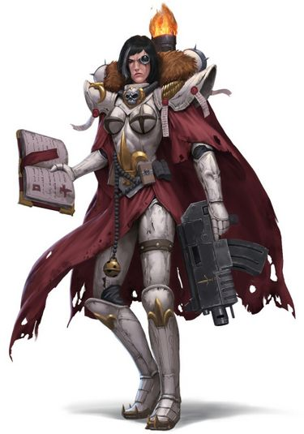
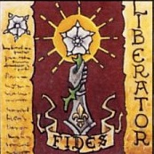

# 0120 神圣玫瑰修会 The Order of the Sacred Rose

精校状态：中文行文已逐段精校，部分术语仍为暂定

分类：通用概念 / 帝国 Imperium / 修女会 Adepta Sororitas

原文来源：https://www.bilibili.com/opus/1209327928644468756

原作者：帝国神选罐头

原文时间：2026年06月02日 21:30

[返回分类目录](目录.md) · [全书目录](../../目录.md)

<!-- A0120-B0001 -->
**英文原文**

The Order of the Sacred Rose is one of the six major Orders Militant of the Adepta Sororitas.

<!-- /A0120-B0001 -->

<!-- A0120-B0002 -->

原译文

神圣玫瑰修会是修女会的六大军事修会之一。

**校订译文**

神圣玫瑰修会是修女会的六大战斗修会之一。

<!-- /A0120-B0002 -->

<!-- A0120-B0003 图片 -->

<!-- A0120-B0004 -->

原译文

Order of the Sacred Rose 神圣玫瑰修会

**校订译文**

Order of the Sacred Rose 神圣玫瑰修会

<!-- /A0120-B0004 -->

<!-- A0120-B0005 -->
**英文原文**

Founder:Deacis VI

<!-- /A0120-B0005 -->

<!-- A0120-B0006 -->

原译文

建立者：迪阿西斯六世

**校订译文**

建立者：迪西斯六世

<!-- /A0120-B0006 -->

<!-- A0120-B0007 -->
**英文原文**

Founding:M38

<!-- /A0120-B0007 -->

<!-- A0120-B0008 -->

原译文

建立时间：M38

**校订译文**

建立时间：M38

<!-- /A0120-B0008 -->

<!-- A0120-B0009 -->
**英文原文**

Matriarch:Arabella

<!-- /A0120-B0009 -->

<!-- A0120-B0010 -->

原译文

修会长：阿拉贝拉

**校订译文**

修会长：阿拉贝拉

<!-- /A0120-B0010 -->

<!-- A0120-B0011 -->
**英文原文**

Convent:Convent Prioris (Terra)

<!-- /A0120-B0011 -->

<!-- A0120-B0012 -->

原译文

修道院：首席修道院(泰拉)

**校订译文**

修道院：首席修道院(泰拉)

<!-- /A0120-B0012 -->

<!-- A0120-B0013 -->
**英文原文**

Colours:White armour, black cloaks with red linings and weapons

<!-- /A0120-B0013 -->

<!-- A0120-B0014 -->

原译文

颜色：白色盔甲，红色内衬的黑色斗篷和武器

**校订译文**

配色：白色盔甲、带红色衬里的黑色斗篷、红色武器

<!-- /A0120-B0014 -->

<!-- A0120-B0015 -->
## Overview 概述

<!-- /A0120-B0015 -->

<!-- A0120-B0016 -->
**英文原文**

The Order is based on Terra within the Convent Prioris and was founded in honour of Sister Arabella along with the Order of the Bloody Rose by Ecclesiarch Deacis VI in mid-M38. Their colours are white armour, black cloaks with red linings and red weapons. The order strives to emulate their patron saint and her virtues of discipline, even temperament, and resolute determination. This resolve to stay calm in battle has particularly benefited Retributor Squads, who use her as a role model to avoid doubt and rash action while wielding their heavy weapons.

<!-- /A0120-B0016 -->

<!-- A0120-B0017 -->

原译文

该修会以泰拉的首席修道院为基地，与教宗迪阿西斯六世于M38中期建立的血腥玫瑰修会一起，为纪念阿拉贝拉修女而成立。她们的配色是白色盔甲、红色内衬的黑色斗篷和红色武器。该组织努力效仿她们的守护圣人及其纪律、气质和坚定决心的美德。这种在战斗中保持冷静的决心尤其有利于仇天使小队，她们以她为榜样，在挥舞重型武器时避免怀疑和鲁莽行动。

**校订译文**

神圣玫瑰修会驻于泰拉的首席修道院。第 38 千年中期，教宗迪西斯六世同时设立神圣玫瑰与鲜血玫瑰两大修会，其中神圣玫瑰纪念阿拉贝拉修女。她们身着白色盔甲、红衬黑斗篷，武器漆成红色，力求效仿守护圣人的自律、沉着与坚定。在战场上保持冷静的信念，尤其有益于操作重武器的仇天使小队，使她们免于迟疑或鲁莽行事。

<!-- /A0120-B0017 -->

<!-- A0120-B0018 图片 -->

<!-- A0120-B0019 -->

原译文

Battle Sister of the Sacred Rose 神圣玫瑰的战斗修女

**校订译文**

Battle Sister of the Sacred Rose 神圣玫瑰的战斗修女

<!-- /A0120-B0019 -->

<!-- A0120-B0020 -->
**英文原文**

The Order avows that they are not only devout servants of the Emperor but also conduits of his will. They believe that their words and actions are guided by his divine wisdom and teach that victory comes from faith and faith alone. They wage Wars of Faith in regions long thought lost in the darkness, freeing Imperial planets from the yoke of Xenos or heretics. Furthermore, citadels are established in the most remote corners of the Imperium. This has resulted in forging a sizable parish in Ultima Segmentum, but like Arabella, they bring their faith to bear across the Galaxy.

<!-- /A0120-B0020 -->

<!-- A0120-B0021 -->

原译文

修会宣称，她们不仅是帝皇的忠实仆人，也是帝皇意志的传达者。她们相信，她们的言行都受到他的神圣智慧的指引，并教导说，胜利只来自信仰。她们在长期被认为迷失在黑暗中的地区发动信仰战争，将帝国行星从异型或异端的枷锁中解放出来。此外，城堡建在帝国最偏远的角落。这导致了在极限星域建立了一个相当大的教区，但就像阿拉贝拉一样，她们将信仰带到了整个银河系。

**校订译文**

修会宣称，自己不仅是帝皇的虔诚仆从，也是传达他意志的载体。她们相信一言一行都受神圣智慧指引，胜利唯独来自信仰。她们在长期被视为陷落于黑暗的地区发动信仰战争，将帝国世界从异形或异端统治下解放，并在帝国最偏远的角落建立堡垒。她们由此在极限星域形成了广大的传教辖区，但也像阿拉贝拉一样，在整个银河践行自己的信仰。

<!-- /A0120-B0021 -->

<!-- A0120-B0022 -->
**英文原文**

On the battlefield the Sacred Rose advance in perfect tactical harmony and discipline, adapting fluidly to the shifting tides of battle. They press their attacks wherever their enemies show weakness, and where they show strength, the Sisters stand firm. They combine their faith with physical prowess, creating miracles where they may suddenly burst into speed or see foes spontaneously combust. The Sacred Rose often go to war alongside large numbers of Ecclesiarchy followers such as Priests or Zealots. As such, even a small mission is rarely short of soldiers. These great armies of the faithful go to war with the Sisters of the Sacred Rose forming their elite core. The Sisters welcome these auxiliaries, believing that the Emperor can work even from the lowliest of his servants. This ability to draw others to their cause has been instrumental since the Great Rift has opened. The majority of their sanctuaries lie deep within Imperium Nihilus, but few have succumbed to the nightmares that have been unleashed across the Galaxy. The Sisters have remained a steadfast bastion of hope, preventing fear and panic from consuming their worlds. They maintain patrols on these worlds that execute any who express any doubt in their security as well as those who show the slightest sign of mutation.

<!-- /A0120-B0022 -->

<!-- A0120-B0023 -->

原译文

在战场上，神圣玫瑰以完美的战术和谐和纪律前进，流畅地适应了不断变化的战斗潮向。她们在敌人表现出弱点的地方发动攻击，在他们表现出力量的地方，修女们坚定不移。她们将信仰与体魄相结合，创造奇迹，在那里她们可能会突然加速或看到敌人自燃。神圣玫瑰经常与众多国教信徒成员，如牧师或狂热者，并肩作战。因此，即使是小型任务也很少缺少士兵。这些忠诚的大军与神圣玫瑰的修女参加战争，形成了她们的精英核心。修女们欢迎这些辅助军，相信帝皇甚至可以从最低级的机仆那里工作。自从大裂隙打开以来，这种吸引他人支持她们事业的能力一直发挥着重要作用。她们的大部分庇护所都位于帝国暗面的深处，但很少有人屈服于银河系各地爆发的噩梦。修女们一直是希望的坚定堡垒，防止恐惧和恐慌吞噬她们的世界。她们在这些世界上保持巡逻，处决任何对她们的安全表示怀疑的人，以及那些表现出丝毫变异迹象的人。

**校订译文**

战场上的神圣玫瑰纪律严明、配合默契，能灵活应对战局变化：敌人露出弱点便进攻，敌人强势时则坚守。信仰与身体能力相结合，使她们能够创造奇迹，例如突然获得惊人的速度，或令敌人自行燃烧。牧师、狂热者等大批国教信众经常随她们出征，因此即使一个小教团也很少缺乏兵员。修女构成这些信徒大军的精锐核心，并欢迎辅助部队加入，因为她们相信，帝皇也能通过最卑微的仆从行事。大裂隙形成后，这种凝聚信众的能力尤为重要。修会的大多数圣所位于帝国暗面深处，却很少被席卷银河的恐怖吞没。修女始终是坚定的希望堡垒，使当地世界免于被恐惧和惊慌吞噬；同时，她们派出巡逻队，处决任何对当地安全提出质疑的人，以及显露丝毫变异迹象的人。

<!-- /A0120-B0023 -->

<!-- A0120-B0024 图片 -->

<!-- A0120-B0025 -->

原译文

Sacred Rose banner 神圣玫瑰旗帜

**校订译文**

Sacred Rose banner 神圣玫瑰旗帜

<!-- /A0120-B0025 -->

<!-- A0120-B0026 -->
## Known Battles 已知战斗

<!-- /A0120-B0026 -->

<!-- A0120-B0027 -->
**英文原文**

During a War of Faith against the Demagogues of the Second Halo Schism, the order broke the defenses at the Palace of Radiance, securing a victory which saw heretics burning on pyres twenty meters high.

<!-- /A0120-B0027 -->

<!-- A0120-B0028 -->

原译文

在一场对抗第二光环分裂煽动者的信仰战争中，该修会击破了光辉宫殿的防御，取得了胜利，异教徒在20米高的火堆上焚烧。

**校订译文**

在一场对抗第二光环分裂煽动者的信仰战争中，该修会击破了光辉宫殿的防御，取得了胜利，异教徒在20米高的火堆上焚烧。

<!-- /A0120-B0028 -->

<!-- A0120-B0029 -->
**英文原文**

The Order was led in a crusade to purge the xenos and heretics of the Kaurava system by their Canoness, Selena Agna, a mission which brought the order into brief conflict with forces from across the galaxy, including the Blood Raven Space Marines and the 252nd Conservator Regiment of the Imperial Guard. The Sisters were supported by the Living Saint Anais.

<!-- /A0120-B0029 -->

<!-- A0120-B0030 -->

原译文

修会领导了一场远征，通过他们的大修女赛琳娜·阿格娜净化考拉瓦星系中的异型和异端，这一任务使修会与来自银河系各地的部队发生了短暂的冲突，包括血鸦星际战士和帝国卫队第252保护者兵团。修女们得到了活圣人安娜伊斯的支援。

**校订译文**

大修女赛琳娜·阿格娜率修会远征考拉瓦星系，清除当地异形与异端。这场行动使她们短暂地与来自银河各地的军队交战，包括血鸦战团及帝国卫队第 252 保护者兵团。活圣人安娜伊斯为修女提供支援。

<!-- /A0120-B0030 -->

<!-- A0120-B0031 -->
**英文原文**

??? - Combating an invasion of Orks on Typhas I.

<!-- /A0120-B0031 -->

<!-- A0120-B0032 -->

原译文

在泰法斯一号上对抗欧克的入侵。

**校订译文**

日期不详——在泰法斯一号抵御欧克蛮人入侵。

<!-- /A0120-B0032 -->

<!-- A0120-B0033 -->

原译文

???.M41 — The Avignor Uprising 阿维格诺叛乱

**校订译文**

???.M41 — The Avignor Uprising 阿维格诺叛乱

<!-- /A0120-B0033 -->

<!-- A0120-B0034 -->
**英文原文**

835.M41 — Canoness Sariah led a force of Battle Sisters to the Shrine World of Piety, which had been consumed by a Warp storm for two centuries. They found the planet almost entirely corrupted save for the Reliquary of Hope. Sariah led a mission into the labyrinth of the Reliquary, though only she herself and two Celestians returned bearing three pages of the Lexicon of Falsehoods and the left thighbone of Saint Dolan. They left the planet just before the Grey Knights arrived to deliver Exterminatus to the planet.

<!-- /A0120-B0034 -->

<!-- A0120-B0035 -->

原译文

大修女赛瑞娅带领一支战斗修女部队前往虔诚星圣地世界，该世界已被一场亚空间风暴吞噬了两个世纪。他们发现，除了希望圣骨匣，这个行星几乎完全被破坏了。赛瑞娅带领一个使团进入了圣骨匣的迷宫，尽管只有她自己和两名洁天使带着三页《谎言词典》和圣多兰的左股骨回来了。就在灰骑士抵达将灭绝令带到行星之前，她们离开了这个行星。

**校订译文**

835.M41——大修女赛瑞娅率战斗修女前往被亚空间风暴吞没两百年的圣地世界“虔诚”。除希望圣物库外，整颗行星几乎已遭腐化。她率一个教团进入圣物库的迷宫，最终只有她和两名洁天使归来，带回《谎言词典》的三页残篇及圣多兰的左股骨。她们刚离开，灰骑士便抵达并准备实施灭绝令。

**校注：** mission 在此结合修女会编制暂译教团；Reliquary 为可进入、含迷宫的大型圣物库，不按微型容器译为圣骨匣。

<!-- /A0120-B0035 -->

<!-- A0120-B0036 -->
**英文原文**

997.M41 — Defence of Valedor. The small force of Battle Sisters were the only survivors of an overwhelming attack of Hive Fleet Leviathan on the planet Valedor.

<!-- /A0120-B0036 -->

<!-- A0120-B0037 -->

原译文

瓦莱多尔防御。战斗修女的小部队是虫巢舰队利维坦在瓦莱多尔行星上发动的压倒性攻击的唯一幸存者。

**校订译文**

997.M41——瓦莱多尔防御战。一小支战斗修女成为利维坦虫巢舰队猛烈攻击该行星后的唯一幸存者。

<!-- /A0120-B0037 -->

<!-- A0120-B0038 -->
**英文原文**

998.M41 — Canoness Magda Grace leads a force to aid in the Cryptus Campaign

<!-- /A0120-B0038 -->

<!-- A0120-B0039 -->

原译文

大修女玛格达·格蕾丝领导一支部队协助冥府战役

**校订译文**

998.M41——大修女玛格达·格蕾丝率部支援冥府战役。

<!-- /A0120-B0039 -->

<!-- A0120-B0040 -->
**英文原文**

999.M41 - Battle on Orison VIII during the 13th Black Crusade.

<!-- /A0120-B0040 -->

<!-- A0120-B0041 -->

原译文

第13次黑色远征期间的奥里松八号之战。

**校订译文**

999.M41——第十三次黑色远征期间的奥里松八号之战。

<!-- /A0120-B0041 -->

<!-- A0120-B0042 -->
**英文原文**

???.M42 - Battle against the Tau Empire in the Chalnath Expanse.

<!-- /A0120-B0042 -->

<!-- A0120-B0043 -->

原译文

在查尔纳特扩区与钛帝国作战。

**校订译文**

???.M42——在查尔纳斯广域与钛帝国作战。

<!-- /A0120-B0043 -->

<!-- A0120-B0044 -->

原译文

M42 - The Prosperine Rift War 普罗斯佩罗裂隙战争

**校订译文**

M42 - The Prosperine Rift War 普罗斯佩罗裂隙战争

<!-- /A0120-B0044 -->

<!-- A0120-B0045 -->
## Unique Squadrons 独特中队

<!-- /A0120-B0045 -->

<!-- A0120-B0046 -->

原译文

Flamewing Seraphim 炎翼炽天使

**校订译文**

Flamewing Seraphim 炎翼炽天使

<!-- /A0120-B0046 -->

<!-- A0120-B0047 图片 -->

<!-- A0120-B0048 -->

原译文

Flamewing Seraphim 炎翼炽天使

**校订译文**

Flamewing Seraphim 炎翼炽天使

<!-- /A0120-B0048 -->

<!-- A0120-B0049 -->
**英文原文**

Prioris Squadron — Are formed from elite Battle Sisters, who guard the Order of the Sacred Rose's convent on Terra. Intense additional training and wide-ranging battlefield experience are the minimum requirements for becoming a Prioris Battle Sister. If the need arises, the entire squadron can be requisitioned into serving in a Canoness' personal retinue.

<!-- /A0120-B0049 -->

<!-- A0120-B0050 -->

原译文

首席中队 — 由精英战斗修女组成，她们守卫着泰拉上神圣玫瑰的修道院的修会。强化的额外训练和广泛的战场经验是成为首席战斗修女的最低要求。如果需要，整个中队都可以被征召到大修女的个人随从中服役。

**校订译文**

首席中队——由负责守卫泰拉上神圣玫瑰修道院的精锐战斗修女组成。严格的额外训练与丰富的战场经验，是入选的最低要求。必要时，整个中队都可被征调，加入大修女的私人随从队伍。

<!-- /A0120-B0050 -->

<!-- A0120-B0051 图片 -->

<!-- A0120-B0052 -->

原译文

Prioris Squad 首席小队

**校订译文**

Prioris Squad 首席小队

<!-- /A0120-B0052 -->

<!-- A0120-B0053 -->
## Order Elements 修会成员

<!-- /A0120-B0053 -->

<!-- A0120-B0054 -->
## Relics 圣物

<!-- /A0120-B0054 -->

<!-- A0120-B0055 -->

原译文

Censer of the Sacred Rose 神圣玫瑰香炉

**校订译文**

Censer of the Sacred Rose 神圣玫瑰香炉

<!-- /A0120-B0055 -->

<!-- A0120-B0056 -->

原译文

Light of Saint Agnaetha 圣阿格奈莎之光

**校订译文**

Light of Saint Agnaetha 圣阿格奈莎之光

<!-- /A0120-B0056 -->

<!-- A0120-B0057 -->
## Known Members 已知成员

<!-- /A0120-B0057 -->

<!-- A0120-B0058 -->

原译文

Living Saint Anais 活圣人安娜伊斯

**校订译文**

Living Saint Anais 活圣人安娜伊斯

<!-- /A0120-B0058 -->

<!-- A0120-B0059 -->

原译文

Canoness Magda Grace 大修女玛格达·格蕾丝

**校订译文**

Canoness Magda Grace 大修女玛格达·格蕾丝

<!-- /A0120-B0059 -->

<!-- A0120-B0060 -->

原译文

Canoness Sariah 大修女赛瑞娅

**校订译文**

Canoness Sariah 大修女赛瑞娅

<!-- /A0120-B0060 -->

<!-- A0120-B0061 -->

原译文

Canoness Selena Agna 大修女赛琳娜·阿格娜

**校订译文**

Canoness Selena Agna 大修女赛琳娜·阿格娜

<!-- /A0120-B0061 -->

<!-- A0120-B0062 -->

原译文

Canoness Berionne 大修女贝瑞欧妮

**校订译文**

Canoness Berionne 大修女贝瑞欧妮

<!-- /A0120-B0062 -->

<!-- A0120-B0063 -->

原译文

Canoness Commander Ferenika Mysan 指挥大修女菲蕾妮卡·迈桑

**校订译文**

Canoness Commander Ferenika Mysan 指挥大修女菲蕾妮卡·迈桑

<!-- /A0120-B0063 -->

<!-- A0120-B0064 -->

原译文

Preceptoress Anjelis Gartayga 教导大修女安杰莉丝·加泰嘉

**校订译文**

Preceptoress Anjelis Gartayga 教导大修女安杰莉丝·加泰嘉

<!-- /A0120-B0064 -->

<!-- A0120-B0065 -->

原译文

Celestian Sacresant Aveline Aboyé 洁天使圣徒艾芙琳·阿波耶

**校订译文**

Celestian Sacresant Aveline Aboyé 洁天使圣徒艾芙琳·阿波耶

<!-- /A0120-B0065 -->

<!-- A0120-B0066 -->

原译文

Dominion Superior Vasiliki 高阶主天使瓦西莉基

**校订译文**

Dominion Superior Vasiliki 高阶御天使瓦西莉基

<!-- /A0120-B0066 -->

<!-- A0120-B0067 -->

原译文

Sister Superior Amity Hope 高阶修女阿米蒂·霍普

**校订译文**

Sister Superior Amity Hope 高阶修女阿米蒂·霍普

<!-- /A0120-B0067 -->

<!-- A0120-B0068 -->

原译文

Novitiate Marguerite 见习修女玛格丽特

**校订译文**

Novitiate Marguerite 见习修女玛格丽特

<!-- /A0120-B0068 -->

本篇核心术语与暂定项

以下列出本篇出现的英文原形及核心术语表用词。同形词可能指不同对象，具体词义以本篇正文和校注为准；单复数、别名和仅见于图注的名称可能尚未列入。完整候选见[术语表](../../术语表/双语术语候选.csv)。

| 英文 | 采用中文 | 状态 |
| --- | --- | --- |
| Space Marines | 星际战士 | 官方已核对 |
| Grey Knights | 灰骑士 | 官方已核对 |
| Adepta Sororitas | 修女会 | 官方已核对 |
| Imperial Guard | 帝国卫队 | 暂定·语境区分 |
| Orks | 欧克蛮人 | 官方已核对 |
| Warp | 亚空间 | 官方已核对 |
| Great Rift | 大裂隙 | 官方已核对 |
| Imperium | 帝国 | 暂定·简称 |
| Emperor | 帝皇 | 官方已核对 |
| Ecclesiarchy | 国教会 | 暂定 |
| Shrine World | 圣地世界 | 暂定·官方待核 |
| The Order | 秩序 | 暂定·官方待核 |
| Terra | 泰拉 | 暂定·官方待核 |
| Imperium Nihilus | 帝国暗面 | 暂定·官方待核 |
| Chalnath Expanse | 查尔纳斯广域 | 暂定·官方待核 |
| Hive Fleet Leviathan | 利维坦虫巢舰队 | 暂定·官方待核 |
| Ultima Segmentum | 极限星域 | 暂定·官方待核 |
| Segmentum | 星域 | 暂定·官方待核 |
| War of Faith | 信仰战争 | 暂定·官方待核 |
| Ecclesiarch | 教宗 | 暂定 |
| Mission | 教团／传教机构 | 暂定 |
| Orders Militant | 战斗修会（战斗修女）／武装骑士团（黑暗天使） | 语境定译·官方待核 |
| Order of the Sacred Rose | 神圣玫瑰修会 | 暂定 |
| Order of the Bloody Rose | 鲜血玫瑰修会 | 暂定 |
| Anais | 安娜伊斯 | 暂定 |
| Canoness | 大修女 | 官方已核对 |
| Founding | 建军 | 暂定·官方待核 |
| Cryptus | 冥府 | 暂定·官方待核 |
| Virtues | 力天使 | 暂定·官方待核 |
| Xenos | 异形 | 暂定·官方待核 |
| Kaurava | 考拉瓦 | 暂定·官方待核 |
| Harmony | 和谐星 | 暂定·官方待核 |
| Valedor | 瓦莱多尔 | 暂定·官方待核 |
| Bear | 熊 | 暂定·官方待核 |
| Piety | 虔诚星 | 暂定·官方待核 |
| The Blood | 鲜血 | 暂定·官方待核 |
| Warp Storm | 亚空间风暴 | 暂定·官方待核 |
| System | 星系（恒星系统） | 暂定·官方待核 |
| Kaurava System | 考拉瓦星系 | 暂定·官方待核 |
| Conservator | 文物保护员 | 暂定·官方待核 |
| Tau Empire | 钛帝国 | 暂定·官方待核 |
| Convent Prioris | 首席修道院 | 暂定·官方待核 |

