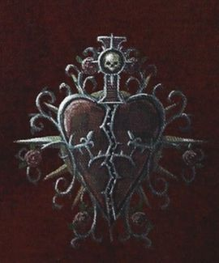

# 0122 受伤之心修会 The Order of the Wounded Heart

精校状态：中文行文已逐段精校，部分术语仍为暂定

分类：通用概念 / 帝国 Imperium / 修女会 Adepta Sororitas

原文来源：https://www.bilibili.com/opus/1208601220165402660

原作者：帝国神选罐头

原文时间：2026年05月31日 22:30

[返回分类目录](目录.md) · [全书目录](../../目录.md)

<!-- A0122-B0001 -->
**英文原文**

The Order of the Wounded Heart is a minor Order of the Sisters of Battle and is among those that have split off from the Order of the Valorous Heart.

<!-- /A0122-B0001 -->

<!-- A0122-B0002 -->

原译文

受伤之心修会是战斗修女的一个次级修会，是从英勇之心修会中分离出来的修会之一。

**校订译文**

受伤之心修会是战斗修女的一个次级修会，是从勇毅之心修会中分离出来的修会之一。

<!-- /A0122-B0002 -->

<!-- A0122-B0003 图片 -->

<!-- A0122-B0004 -->

原译文

Order of the Wounded Heart symbol 受伤之心修会标志

**校订译文**

Order of the Wounded Heart symbol 受伤之心修会标志

<!-- /A0122-B0004 -->

<!-- A0122-B0005 -->
## Overview 概述

<!-- /A0122-B0005 -->

<!-- A0122-B0006 -->
**英文原文**

The Order is unique, however, in that they only recite verse 482 from the Passion of Saint Lucia. The verse describes how Saint Lucia's right hand was flensed, and yet through her suffering she remained faithful. As an act of communion, the Order of the Wounded Heart also deglove their own right hands, ritually stripping them of skin to keep the flesh and nerves raw. In this way they feel Lucia's pain whenever they grip their weapon and pull the trigger; allowing them to mediate on the Saint's excruciation as they unleash death upon the faithless.

<!-- /A0122-B0006 -->

<!-- A0122-B0007 -->

原译文

然而，该修会的独特之处在于，他们只吟诵《圣露西娅的受难》中的482节。这节描述了圣露西娅的右手是如何被剥皮的，但在她受折磨的过程中，她仍然忠诚。作为一种交融行为，受伤之心修会也会对自己的右手进行脱下手铠，仪式性地剥去它们的皮肤，以保持血肉和神经的裸露。每当他们握住武器并扣动扳机时，他们都能感受到露西娅的痛苦；允许他们在向无信者释放死亡时，调解圣人的痛苦。

**校订译文**

这个修会只诵读《圣露西亚受难记》第 482 节，以此形成独特传统。该节讲述圣露西亚的右手惨遭剥皮，却在苦难中坚守信仰。为与圣人同感其苦，受伤之心修会的修女也举行剥除右手皮肤的仪式，让血肉与神经裸露。因此，每次握持武器、扣动扳机，她们都会感到露西亚遭受的痛楚，并在杀戮不信者时默想圣人的苦难。

**校注：** 英文 mediate on 很可能是 meditate on 的笔误，结合“圣人受难”语境译为“默想”，并非调解；deglove 此处明确指剥皮伤害，不是脱下手铠。

<!-- /A0122-B0007 -->

<!-- A0122-B0008 图片 -->

<!-- A0122-B0009 -->

原译文

Sister of the Order of the Wounded Heart 受伤之心修会的修女

**校订译文**

Sister of the Order of the Wounded Heart 受伤之心修会的修女

<!-- /A0122-B0009 -->

<!-- A0122-B0010 -->
**英文原文**

The Order of the Wounded Heart is known to maintain a presence on the Shrine World of Ras Shakeh, based out of the Cathedral of Blessed Alexia in Hjec Aleja.

<!-- /A0122-B0010 -->

<!-- A0122-B0011 -->

原译文

众所周知，受伤之心修会在拉斯·沙克圣地世界保持着存在，位于赫耶克·阿雷加的亚历克西娅祝圣大教堂内。

**校订译文**

受伤之心修会在圣地世界拉斯·沙克设有驻地，以赫耶克·阿雷加的蒙福亚历克西娅大教堂为基地。

<!-- /A0122-B0011 -->

<!-- A0122-B0012 -->
### Known Actions 已知行动

<!-- /A0122-B0012 -->

<!-- A0122-B0013 -->
**英文原文**

886.M41 - Fight for the Ecclesiarchy during the Fenris Incident

<!-- /A0122-B0013 -->

<!-- A0122-B0014 -->

原译文

芬里斯事件中为国教而战

**校订译文**

886.M41——在芬里斯事件中为国教会作战。

<!-- /A0122-B0014 -->

<!-- A0122-B0015 -->
**英文原文**

999.M41 - During the 13th Black Crusade, the Order committed 1 Commandery to the Imperial defense against Abaddon's forces.

<!-- /A0122-B0015 -->

<!-- A0122-B0016 -->

原译文

在第13次黑色远征期间，修会为帝国防御阿巴顿的部队部署了1个督所。

**校订译文**

999.M41——第十三次黑色远征期间，修会投入一个督所的兵力，协助帝国抵御阿巴顿的军队。

<!-- /A0122-B0016 -->

<!-- A0122-B0017 -->
## Heraldry 纹章

<!-- /A0122-B0017 -->

<!-- A0122-B0018 -->
**英文原文**

Sisters of the Order of the Wounded Heart wear night black power armour trimmed with pale ermine. The Order's symbol is a cracked heart, depicted in red on white.

<!-- /A0122-B0018 -->

<!-- A0122-B0019 -->

原译文

受伤之心修会的修女穿着配有白鼬皮的夜黑色动力盔甲。修会的标志是一颗破裂的心，用红白两色描绘。

**校订译文**

受伤之心修女身着夜黑色动力甲，饰以浅色白鼬皮。修会徽记为白底上的红色裂心。

<!-- /A0122-B0019 -->

<!-- A0122-B0020 图片 -->

<!-- A0122-B0021 -->

原译文

Sister of the Order of the Wounded Heart 受伤之心修会的修女

**校订译文**

Sister of the Order of the Wounded Heart 受伤之心修会的修女

<!-- /A0122-B0021 -->

<!-- A0122-B0022 -->
## Assets 资产

<!-- /A0122-B0022 -->

<!-- A0122-B0023 -->
### Vessels 战舰

<!-- /A0122-B0023 -->

<!-- A0122-B0024 -->

原译文

Succession of Purity 纯净继承号

**校订译文**

Succession of Purity 纯净继承号

<!-- /A0122-B0024 -->

<!-- A0122-B0025 -->
### Known Members 已知成员

<!-- /A0122-B0025 -->

<!-- A0122-B0026 -->
**英文原文**

Alexis de Chatelaine - Canoness.

<!-- /A0122-B0026 -->

<!-- A0122-B0027 -->

原译文

城堡女主人亚历克西斯 - 大修女

**校订译文**

亚历克西斯·德·沙特莱纳——大修女。

<!-- /A0122-B0027 -->

<!-- A0122-B0028 -->
**英文原文**

Arvian Nomu - Her advisor.

<!-- /A0122-B0028 -->

<!-- A0122-B0029 -->

原译文

阿维安·诺穆 - 她的顾问

**校订译文**

阿维安·诺穆 - 她的顾问

<!-- /A0122-B0029 -->

<!-- A0122-B0030 -->
**英文原文**

Callia - Battle Sister.

<!-- /A0122-B0030 -->

<!-- A0122-B0031 -->

原译文

卡莉娅 - 战斗修女

**校订译文**

卡莉娅 - 战斗修女

<!-- /A0122-B0031 -->

<!-- A0122-B0032 -->
## Trivia 琐事

<!-- /A0122-B0032 -->

<!-- A0122-B0033 -->
### Conflicting sources 来源冲突

<!-- /A0122-B0033 -->

<!-- A0122-B0034 -->
**英文原文**

The 8th Edition Adepta Sororitas Codex depicts a member of the Order in red power armour. However, the novel Blood of Asaheim instead depicts them in black.

<!-- /A0122-B0034 -->

<!-- A0122-B0035 -->

原译文

第8版修女会圣典描绘了一名身穿红色动力盔甲的修会成员。然而，小说《阿萨海姆之血》却用黑色描绘了他们。

**校订译文**

第八版《圣典：修女会》中的一名该修会成员身着红色动力甲；小说《阿萨海姆之血》却将她们的盔甲描述为黑色。

<!-- /A0122-B0035 -->

本篇核心术语与暂定项

以下列出本篇出现的英文原形及核心术语表用词。同形词可能指不同对象，具体词义以本篇正文和校注为准；单复数、别名和仅见于图注的名称可能尚未列入。完整候选见[术语表](../../术语表/双语术语候选.csv)。

| 英文 | 采用中文 | 状态 |
| --- | --- | --- |
| Adepta Sororitas | 修女会 | 官方已核对 |
| Ecclesiarchy | 国教会 | 暂定 |
| Shrine World | 圣地世界 | 暂定·官方待核 |
| The Order | 秩序 | 暂定·官方待核 |
| Sisters of Battle | 战斗修女 | 暂定·官方待核 |
| Fenris | 芬里斯 | 暂定·官方待核 |
| Order of the Wounded Heart | 受伤之心修会 | 暂定 |
| Order of the Valorous Heart | 勇毅之心修会 | 暂定 |
| Alexis de Chatelaine | 亚历克西斯·德·沙特莱纳 | 暂定 |
| Saint Lucia | 圣露西亚 | 暂定 |
| Canoness | 大修女 | 官方已核对 |
| Power Armour | 动力盔甲 | 暂定·官方待核 |
| The Faithless | 无信者 | 暂定·官方待核 |
| Fenris Incident | 芬里斯事件 | 暂定·官方待核 |
| Ras Shakeh | 拉斯·沙克 | 暂定·官方待核 |

