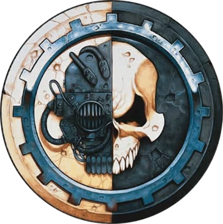
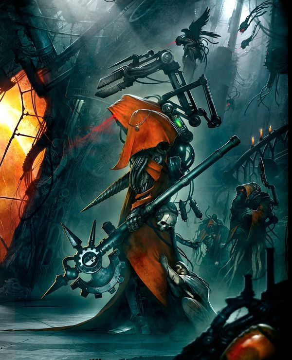
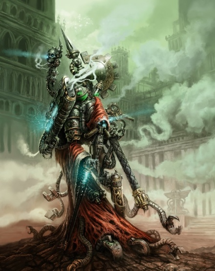
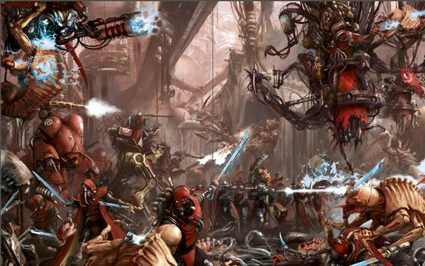
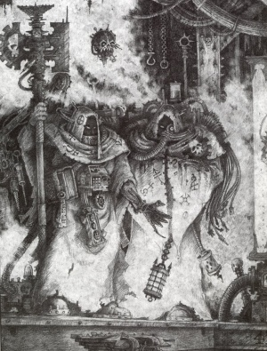
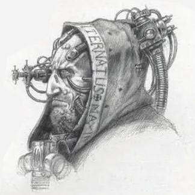
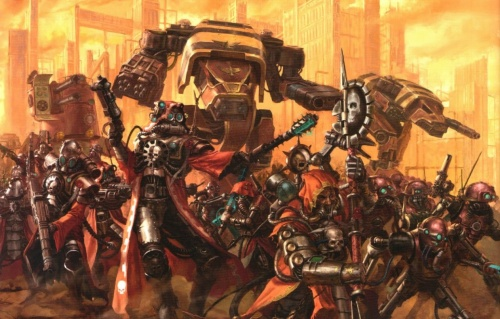
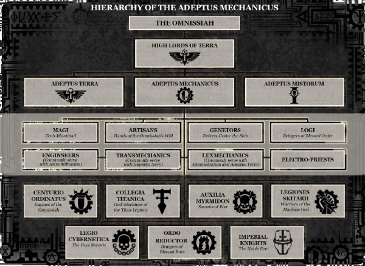
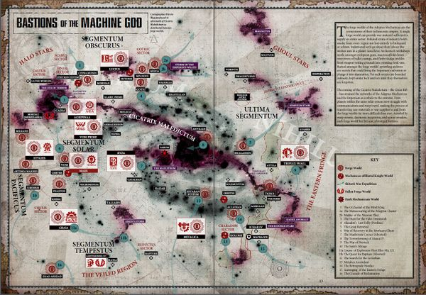

# 0124 机械修会 Adeptus Mechanicus

精校状态：中文行文已逐段精校，部分术语仍为暂定

分类：通用概念 / 帝国 Imperium / 机械神教 Adeptus Mechanicus

原文来源：https://www.bilibili.com/opus/1056644280766955520

原作者：帝国神选罐头

原文时间：编辑于 2025年12月01日 10:56

[返回分类目录](目录.md) · [全书目录](../../目录.md)

原篇名：机械神教 Adeptus Mechanicus

<!-- A0124-B0001 图片 -->

<!-- A0124-B0002 -->

原译文

Adeptus Mechanicus symbol 机械神教标志

**校订译文**

Adeptus Mechanicus symbol 机械修会标志

<!-- /A0124-B0002 -->

<!-- A0124-B0003 -->
**英文原文**

Capital:Mars

<!-- /A0124-B0003 -->

<!-- A0124-B0004 -->

原译文

首都：火星

**校订译文**

首都：火星

<!-- /A0124-B0004 -->

<!-- A0124-B0005 -->
**英文原文**

Official languages:Cant Mechanicus

<!-- /A0124-B0005 -->

<!-- A0124-B0006 -->

原译文

官方语言：机械之语

**校订译文**

官方语言：机械之语

<!-- /A0124-B0006 -->

<!-- A0124-B0007 -->
**英文原文**

Major Species:Human

<!-- /A0124-B0007 -->

<!-- A0124-B0008 -->

原译文

主要物种：人类

**校订译文**

主要物种：人类

<!-- /A0124-B0008 -->

<!-- A0124-B0009 -->
**英文原文**

Head of state:Fabricator-General Oud Oudia Raskian

<!-- /A0124-B0009 -->

<!-- A0124-B0010 -->

原译文

首领：铸造将军乌德·乌迪亚·拉斯基

**校订译文**

首领：铸造将军乌德·乌迪亚·拉斯基安

<!-- /A0124-B0010 -->

<!-- A0124-B0011 -->
**英文原文**

Governing body:Martian Parliament

<!-- /A0124-B0011 -->

<!-- A0124-B0012 -->

原译文

管理机构：火星议会

**校订译文**

管理机构：火星议会

<!-- /A0124-B0012 -->

<!-- A0124-B0013 -->
**英文原文**

State Religion:Cult Mechanicus

<!-- /A0124-B0013 -->

<!-- A0124-B0014 -->

原译文

国家宗教：机械教派

**校订译文**

国家宗教：机械教派

<!-- /A0124-B0014 -->

<!-- A0124-B0015 -->
**英文原文**

Military forces:Battle Congregations,Skitarii,Collegia Titanica,Centurio Ordinatus,Auxilia Myrmidon,Ordo Reductor,Legio Cybernetica,Prefecture Magisterium,Basilikon Astra,Knight Houses

<!-- /A0124-B0015 -->

<!-- A0124-B0016 -->

原译文

军事力量：战斗修会、护教军、泰坦修会、百机队、辅军精锐、源还修会、智控军团、辖区裁判所、星界君主（舰队）、骑士家族

**校订译文**

军事力量：战斗集群、护教军、泰坦修会、百机队、辅军精锐、源还修会、智控军团、辖区裁判所、星界君主（舰队）、骑士家族

<!-- /A0124-B0016 -->

<!-- A0124-B0017 -->
**英文原文**

The Adeptus Mechanicus, also formerly known as the Mechanicum, is a technological organisation, often known as the Priesthood of Mars. It holds a monopoly on technological knowledge in the Imperium. Their Forge Worlds turn out the Imperium's most powerful and advanced weaponry and equipment. The organisation's adepts, the Tech-priests, are vital in maintaining much of the Imperium's more technologically advanced equipment, not least of which is the Emperor's life-sustaining Golden Throne.

<!-- /A0124-B0017 -->

<!-- A0124-B0018 -->

原译文

机械神教，前身为机械师协会，是一个技术组织，通常被称为火星祭司。它垄断了帝国的技术知识。他们的铸造世界生产出帝国最强大、最先进的武器和装备。该组织的专家，即技术神甫，在维护帝国大部分技术更先进的设备方面至关重要，尤其是帝皇维持生命的黄金王座。

**校订译文**

机械修会的前身是机械教，常被称为“火星祭司团”，是一个垄断帝国技术知识的组织。其铸造世界生产帝国最强大、最先进的武器装备。成员中的技术祭司负责维护许多精密设备，其中尤为重要的是维持帝皇生命的黄金王座。

<!-- /A0124-B0018 -->

<!-- A0124-B0019 -->
## Overview 概述

<!-- /A0124-B0019 -->

<!-- A0124-B0020 -->
**英文原文**

While the Adeptus Mechanicus is a part of the Imperium, it has developed separately and enjoys a considerable degree of independence. Due to the great amount of power it wields, the Adeptus Mechanicus could almost be said to be like an allied empire, rather than an organisation within the Imperium. The Adeptus Mechanicus also follows a different religion from the rest of the Imperium. The religion and religious structure of the Adeptus Mechanicus is known as the Cult Mechanicus. The symbol of the Adeptus Mechanicus is a skull, half-bone and half-machine, set against the background of a black and white cog.

<!-- /A0124-B0020 -->

<!-- A0124-B0021 -->

原译文

虽然机械神教是帝国的一部分，但它是独立发展的，享有相当程度的独立性。由于它拥有巨大的权力，机械神教几乎可以说是一个结盟的帝国，而不是帝国内部的一个组织。机械神教也遵循与帝国其他成员不同的宗教。机械神教的宗教和宗教结构被称为机械教派。机械神教的象征标志是一个头骨，一半是骨头，一半是机械，背景是一个黑白齿轮。

**校订译文**

虽然机械修会是帝国的一部分，但它是独立发展的，享有相当程度的独立性。由于它拥有巨大的权力，机械修会几乎可以说是一个结盟的帝国，而不是帝国内部的一个组织。机械修会也遵循与帝国其他成员不同的宗教。机械修会的宗教和宗教结构被称为机械教派。机械修会的象征标志是一个头骨，一半是骨头，一半是机械，背景是一个黑白齿轮。

<!-- /A0124-B0021 -->

<!-- A0124-B0022 -->
**英文原文**

Adepts of the Adeptus Mechanicus are known as tech-priests. Any member of the Cult Mechanicus over the rank of menial will often be referred to as a tech-priest, though Magi and higher ranks are usually referred to by rank. As befits the religious nature of the Mechanicus, tech-priests usually wear robes, which are usually either rust-red or white. Tech-priests are often cybernetically augmented. The level of a techpriest's augmentation is highly dependent on his rank within the Cult Mechanicus; a novice may have only one or two augmented systems, if any, while very senior members may have only a few biological organs left in their bodies.

<!-- /A0124-B0022 -->

<!-- A0124-B0023 -->

原译文

精通机械艺术的人被称为技术神甫。任何超过仆人级别的机械神教成员通常都会被称为技术神甫，尽管贤者和更高级别的人通常是按级别称呼的。为了符合机械神教的宗教性质，技术神甫通常穿着长袍，长袍通常是铁锈红色或白色的。技术神甫经常在智控上得到增强。技术神甫的增强程度在很大程度上取决于他在机械神教中的地位；新手可能只有一两个增强系统（如果有的话），而非常资深的成员可能体内只剩下几个生物器官。

**校订译文**

机械修会的学识人员被称为技术祭司。机械教派中地位高于杂役的成员，往往都可如此称呼，不过贤者及更高阶者通常直接以职阶相称。出于宗教传统，技术祭司多穿锈红或白色长袍。他们经常接受机械强化，改造程度与教内地位密切相关：新手可能只有一两处改造，甚至尚未改造；资深成员却可能仅剩少数生物器官。

<!-- /A0124-B0023 -->

<!-- A0124-B0024 -->
**英文原文**

Members of the Mechanicum are often fast-grown in vats, infused with a instinctual level of knowledge due to data uplinks during their gestation. They are then born already post-adolescence and are promptly put to work. Members can also come from Imperials, who have been converted by the Sect Missionarius Mechanicus and even the Squat Abhuman subspecies.

<!-- /A0124-B0024 -->

<!-- A0124-B0025 -->

原译文

机械教的成员通常在大桶中快速成长，由于在培育期间的数据上行链路，他们被灌输了本能的知识水平。然后，他们在青春期后出生，并迅速投入工作。成员也可以来自帝国，他们已经被机械传道士教派甚至矮人亚人亚种皈依。

**校订译文**

机械教的许多成员在培养槽中快速生长，孕育期间便通过数据链路灌入知识，使其成为近乎本能的能力。他们离开培养槽时已越过青春期，随即投入工作。成员也可来自经机械传教士教派劝信的其他帝国居民，甚至包括斯夸特这一亚人支系。

<!-- /A0124-B0025 -->

<!-- A0124-B0026 -->
## Origins and history 起源和历史

<!-- /A0124-B0026 -->

<!-- A0124-B0027 -->
### Early history 早期历史

<!-- /A0124-B0027 -->

<!-- A0124-B0028 -->
**英文原文**

The birthplace of the Martian Mechanicum was the ancient Forge World Mars. Mars was colonised early in human history, and developed separately from Terra, both culturally and technologically. The arid surface of Mars was terraformed, and under a man-made atmosphere the colony flourished.

<!-- /A0124-B0028 -->

<!-- A0124-B0029 -->

原译文

火星机械教的诞生地是古老的铸造世界火星。火星在人类历史早期就被殖民了，在文化和技术上都与泰拉分开发展。火星干旱的表面被地球化，在人造大气下，殖民地蓬勃发展。

**校订译文**

火星机械教的诞生地是古老的铸造世界火星。火星在人类历史早期就被殖民了，在文化和技术上都与泰拉分开发展。火星干旱的表面被地球化，在人造大气下，殖民地蓬勃发展。

<!-- /A0124-B0029 -->

<!-- A0124-B0030 图片 -->

<!-- A0124-B0031 -->

原译文

Tech-priest 技术神甫

**校订译文**

Tech-priest 技术祭司

<!-- /A0124-B0031 -->

<!-- A0124-B0032 -->
**英文原文**

During the Dark Age of Technology, the two empires of Terra and Mars co-existed, to the mutual benefit of both. At the height of its splendour during the Golden Age, and even later in the anarchic Age of Strife, Mars dispatched hundreds of colony fleets into the void. Many perished in the terrible Warp storms that engulfed the galaxy at that time, but others survived. Those that did founded new worlds in the name of the Machine God, building on them a likeness of the great factories and temples of their distant home world. The Age of Strife brought an end to the glory and peace of the human domains. Across the galaxy mankind suddenly turned upon itself as a new breed of Warp-attuned humans emerged. Civil war engulfed thousands of human worlds, including the twin empires of Terra and Mars.

<!-- /A0124-B0032 -->

<!-- A0124-B0033 -->

原译文

在黑暗技术时代，泰拉和火星这两个帝国共存，互惠互利。在黄金时代最辉煌的时候，甚至在无政府主义的纷争时代后期，火星派遣了数百支殖民舰队进入太空。许多人在当时席卷银河系的可怕的亚空间风暴中丧生，但其他人幸存下来。那些以万机神的名义建立了新世界的人，在它们上面建造了与他们遥远家园的伟大工厂和神殿相像的一切。纷争时代结束了人类领地的荣耀与和平。随着一种新的适应亚空间的人类出现，整个银河系的人类突然转向了内战。内战吞噬了数千个人类世界，包括泰拉和火星这两个帝国。

**校订译文**

黑暗科技时代，泰拉与火星的两个政权并存，互惠互利。火星在黄金时代的鼎盛时期，乃至后来混乱的纷争时代，派出数百支殖民舰队。许多舰队在席卷银河的亚空间风暴中覆灭，幸存者则以万机神之名建立新世界，仿照遥远母星建造宏伟工厂与神殿。纷争时代终结了人类疆域的繁荣和平；随着对亚空间敏感的新型人类出现，人类社会纷纷陷入内斗，数千世界乃至泰拉与火星的政权都被内战吞噬。

<!-- /A0124-B0033 -->

<!-- A0124-B0034 -->
**英文原文**

Because of lack of maintenance during this time, Mars's atmospheric radiation shields soon disintegrated, allowing deadly solar radiation to destroy the fragile ecosystem and wiping out sparse vegetation which had taken millennia to cultivate. Mars returned to being the red wasteland of the past. Plagues caused by high radiation levels slew most of the population. Many of the survivors devolved into mutants or gibbering cannibals. The destruction of the entire planet seemed likely. However, this was not to be, for a new idea began to spread among the people, a religion of survival - the Cult Mechanicus dedicated to the Machine God. The religious devotees sought out the now scattered technology needed to rebuild temporary radiation shelters. The cult demanded absolute devotion from its followers, for only by selfless dedication and often personal sacrifice could machines be recovered or the planet saved. Under the direction of their Tech-priest leaders, the cultists set about restoring order to the world. They built shelters to protect themselves from the radiation storms, and oxygen generators and food processing machines to enable them to live behind the enclosed shielding.

<!-- /A0124-B0034 -->

<!-- A0124-B0035 -->

原译文

由于在此期间缺乏维护，火星的大气辐射屏蔽很快瓦解，致命的太阳辐射摧毁了脆弱的生态系统，并摧毁了数千年来培育的稀疏植被。火星又回到了过去的红色荒原。高辐射水平造成的瘟疫夺去了大部分人口的生命。许多幸存者变成了变种人或口齿不清的食人族。整个星球似乎都有可能毁灭。然而，事实并非如此，因为一种新的思想开始在人们中传播，一种生存的宗教——致力于万机神的机械教派。宗教信徒们寻找重建临时辐射避难所所需的分散技术。该教派要求其追随者绝对奉献，因为只有通过无私奉献和个人牺牲，才能恢复机械或拯救星球。在他们的技术神甫领袖的指导下，教派开始恢复世界秩序。他们建造了避难所来保护自己免受辐射风暴的影响，还建造了氧气发生器和食品加工机，使他们能够住在封闭的屏蔽后面。

**校订译文**

由于在此期间缺乏维护，火星的大气辐射屏蔽很快瓦解，致命的太阳辐射摧毁了脆弱的生态系统，并摧毁了数千年来培育的稀疏植被。火星又回到了过去的红色荒原。高辐射水平造成的瘟疫夺去了大部分人口的生命。许多幸存者变成了变种人或口齿不清的食人族。整个星球似乎都有可能毁灭。然而，事实并非如此，因为一种新的思想开始在人们中传播，一种生存的宗教——致力于万机神的机械教派。宗教信徒们寻找重建临时辐射避难所所需的分散技术。该教派要求其追随者绝对奉献，因为只有通过无私奉献和个人牺牲，才能恢复机械或拯救星球。在他们的技术祭司领袖的指导下，教派开始恢复世界秩序。他们建造了避难所来保护自己免受辐射风暴的影响，还建造了氧气发生器和食品加工机，使他们能够住在封闭的屏蔽后面。

<!-- /A0124-B0035 -->

<!-- A0124-B0036 图片 -->

<!-- A0124-B0037 -->

原译文

Tech-Priest of the Adeptus Mechanicus 机械神教技术神甫

**校订译文**

Tech-Priest of the Adeptus Mechanicus 机械修会技术祭司

<!-- /A0124-B0037 -->

<!-- A0124-B0038 -->
**英文原文**

There were few shelters even for the Tech-priests and none for unbelievers. Marauders and mutant raiders tried to force their way inside the hurriedly constructed buildings. Many of the cultists died defending their shelters and some early shelters were destroyed, but the survivors emerged all the stronger and more determined. The people interpreted their survival in the face of tremendous odds as vindication of the Cult Mechanicus. Their resolve and devotion to the cult became unshakable. While rival warlords battled over the remnants of Terra the Tech-priests built Mars anew, and the first temples of the Machine God were built. The Tech-priests scoured the ruins of Mars for surviving machinery which they enshrined within the Temple of All Knowledge. Within the temple's plasteel shell shining pistons held the vaulted roof almost a mile above. The shafts of each piston were so constructed that they moved to raise and lower the roof, altering its acoustic properties to accentuate the hymns of praise sung to the Machine God. The High Altar within took the form of a vast database containing the whole knowledge of the Tech-priests. Even today every new discovery is dedicated to this altar. Every temple on Mars and throughout the Forge Worlds is connected to the High Altar by means of a living Transmat link, a psychic Servitor whose mind co-joins all altars of the Cult Mechanicus into one holy machine entity.

<!-- /A0124-B0038 -->

<!-- A0124-B0039 -->

原译文

即使是科技神甫，也几乎没有避难所，无信者也没有避难所。掠夺者和变种袭击者试图强行闯入匆忙建造的建筑。许多信徒在保卫他们的避难所时死亡，一些早期的避难所也被摧毁，但幸存者们变得更加坚强和坚定。人们将他们在巨大困难面前的生存解释为对机械教派的辩护。他们对教派的决心和忠诚变得不可动摇。当敌对军阀争夺泰拉的遗迹时，技术神甫重新建造了火星，并建造了第一座万机神殿。技术神甫们在火星的废墟中搜寻幸存的机械，并将其供奉在所有知识的圣殿中。在圣殿的塑钢外壳内，闪闪发光的活塞支撑着近一英里高的拱形屋顶。每个活塞的轴都是这样构造的，它们可以移动以升高和降低屋顶，改变其声学特性，以突出向万机神唱的赞美诗。内部的至高祭坛采用了一个庞大的数据库的形式，其中包含了技术神甫的全部知识。即使在今天，每一个新发现都献给了这座祭坛。火星上和整个铸造世界的每一座神殿都通过一个活着的传输者链接与至高祭坛相连，传输者是一个灵能机仆，他的思想将机械教的所有祭坛共同连接成一个神圣的机械实体。

**校订译文**

避难所就连供技术祭司使用都不敷需求，更没有不信者的容身之地。掠夺者和变种人袭击者不断尝试闯入这些匆忙搭建的设施。许多信徒战死，一些避难所遭毁，但幸存者的意志愈发坚定。他们将自己在绝境中活下来视为机械教派正确性的证明，信仰也变得不可动摇。泰拉军阀争夺废墟时，技术祭司正在重建火星，建立最早的万机神殿。他们搜遍废墟，将残存机器供奉于万知圣殿。圣殿塑钢外壳内，闪亮的活塞支撑着近一英里高的穹顶，并可调节其高度与声学效果，使赞颂万机神的圣歌更加洪亮。至高祭坛本身是一座巨型数据库，储存祭司掌握的全部知识，新发现也持续奉献于此。火星及各铸造世界的神殿通过活体传输链路与其连接：灵能机仆以心智将机械教派的祭坛联成一个神圣的机械整体。

**校注：** Transmat link 按本段解释为灵能机仆构成的活体传输链路；此处并非一般电子通信网络。

<!-- /A0124-B0039 -->

<!-- A0124-B0040 -->
**英文原文**

Now unified under the Cult Mechanicus, the Priesthood of Mars began to dispatch Explorator Fleets across the galaxy and even plundered the surface of war-torn Terra itself in hopes of discovering lost technologies. Facing resistance to their quest on the planet's surface, the Adeptus Mechanicus soon became bitter enemies with the Techno-barbarians which plagued Terra and thus welcomed the eventual arrival of the Emperor.

<!-- /A0124-B0040 -->

<!-- A0124-B0041 -->

原译文

现在，在机械教派的统一下，火星祭司开始派遣探索舰队穿越银河系，甚至掠夺饱受战争蹂躏的泰拉表面，希望发现丢失的技术。面对对他们在地球表面的探索的抵抗，机械神教很快就成为了困扰泰拉的科技蛮人的死敌，因此欢迎帝皇的最终到来。

**校订译文**

机械教派完成统一后，火星祭司团开始向银河各地派遣探索者舰队，甚至劫掠饱经战争的泰拉，搜寻失落技术。在泰拉地表遭遇阻挠后，他们逐渐与横行当地的科技蛮人成为死敌，因此欢迎帝皇后来抵达并改变局势。

**校注：** 英文在统一战争前后历史叙述中使用 Adeptus Mechanicus，虽然后文才讲述其正式设立。译文在可行处使用火星祭司团，不据此倒改原文年代或组织史。

<!-- /A0124-B0041 -->

<!-- A0124-B0042 -->
### Union with the Imperium 与帝国联盟

<!-- /A0124-B0042 -->

<!-- A0124-B0043 -->
**英文原文**

After the Emperor formed the Imperium, he engendered support with the Martian Mechanicum, an already existing empire. On Mars, he was commonly seen as the Omnissiah, the earthly representative of the Machine God, due to his ability to seemingly instantly repair machinery with a mere touch. After landing in a golden ship on Mars' surface The Emperor came before the Mechanicum Parliament on Mars, pledging that in return for supplying arms to his armies and building a mighty war fleet, the Emperor would protect and the respect the sovereignty of the Mechanicum's Forge Worlds. In addition, he would donate six Navigator Houses to Mars, whose supply of Navigators had since dwindled. Given such incentives the Martian Parliament and Fabricator-General agreed to the terms, and the formal alliance between the Adeptus Mechanicus and Imperium was signed on Terra between the Martian Ambassador and the Emperor.

<!-- /A0124-B0043 -->

<!-- A0124-B0044 -->

原译文

帝皇建立帝国后，他得到了火星机械教的支持，这是一个已经存在的帝国。在火星上，他通常被视为万机神的地球代表欧姆尼赛亚，因为他似乎只需轻轻一触就能立即修复机械。在火星表面登上一艘金色飞船后，帝皇来到火星上的机械师议会，承诺作为向军队提供武器和建立强大舰队的回报，帝皇将保护和尊重机械教铸造世界的主权。此外，他还将向火星捐赠六个导航者家族，此后火星的导航者供应量逐渐减少。考虑到这些激励措施，火星议会和铸造将军同意了这些条款，火星大使和帝皇在泰拉上签署了机械教和帝国之间的正式联盟。

**校订译文**

帝皇建立帝国后，争取到了已形成独立政权的火星机械教支持。他似乎只需轻触就能修复机械，因而被许多火星人视为欧姆尼赛亚，即万机神的尘世代表。帝皇乘金色飞船降落火星，向机械教议会承诺：作为提供武器、建造强大战舰队的回报，他将保护并尊重各铸造世界的主权；此外还将让六个导航员家族归于火星，补充其日渐枯竭的导航员资源。火星议会与铸造将军接受了这些条件，随后由火星大使与帝皇在泰拉签署正式盟约。

<!-- /A0124-B0044 -->

<!-- A0124-B0045 -->
**英文原文**

The Treaty was not celebrated by all of the Tech-Priest elements on Mars. Many Tech-Priests saw the Emperor as a warlord seeking to subordinate the Mechanicum and limit their technological research. Among these was Kelbor-Hal.

<!-- /A0124-B0045 -->

<!-- A0124-B0046 -->

原译文

火星上的所有技术神甫成员都没有庆祝该条约。许多技术神甫认为帝皇是一个军阀，试图使机械教从属并限制他们的技术研究。凯尔博·哈尔就是其中之一。

**校订译文**

并非所有火星技术祭司都欢迎这份条约。许多人认为帝皇只是试图控制机械教、限制其技术研究的军阀，凯尔博·哈尔便在其中。

<!-- /A0124-B0046 -->

<!-- A0124-B0047 -->
### Horus Heresy 荷鲁斯之乱

原题：Horus Heresy 荷鲁斯叛乱

<!-- /A0124-B0047 -->

<!-- A0124-B0048 -->
**英文原文**

During the Horus Heresy, the Mechanicum, like most other branches of the Imperial military, found itself divided in loyalty. Many Mechanicum units declared for the Warmaster Horus, some retained their loyalty to the Imperium and some seceded altogether to remain neutral during the conflict.

<!-- /A0124-B0048 -->

<!-- A0124-B0049 -->

原译文

在荷鲁斯叛乱时期，机械教和帝国军队的大多数其他分支一样，发现自己的忠诚度存在分歧。许多机械教部队宣布支持战帅荷鲁斯，一些人保留了对帝国的忠诚，一些人在冲突期间完全脱离，保持中立。

**校订译文**

在荷鲁斯之乱时期，机械教和帝国军队的大多数其他分支一样，发现自己的忠诚度存在分歧。许多机械教部队宣布支持战帅荷鲁斯，一些人保留了对帝国的忠诚，一些人在冲突期间完全脱离，保持中立。

<!-- /A0124-B0049 -->

<!-- A0124-B0050 图片 -->

<!-- A0124-B0051 -->

原译文

The Adeptus Mechanicus at war 战争中的机械神教

**校订译文**

The Adeptus Mechanicus at war 战争中的机械修会

<!-- /A0124-B0051 -->

<!-- A0124-B0052 -->
**英文原文**

Horus was able to convince the Fabricator-General himself, Kelbor-Hal, to join forces with him on the condition that the autonomy of the Mechanicum be ensured, and that the STCs the Sons of Horus had captured from the recently subjugated but technologically advanced Auretian Technocracy be handed over to him. Kelbor-Hal's deputy, the Fabricator Locum Kane, remained loyal to the Emperor however, which initiated a civil war on the Red Planet known as the Schism of Mars that mirrored the larger conflict raging across the galaxy.

<!-- /A0124-B0052 -->

<!-- A0124-B0053 -->

原译文

荷鲁斯成功地说服了铸造将军凯尔博·哈尔本人与他联手，条件是确保机械教的自治权，并将荷鲁斯之子从最近被征服但技术先进的奥瑞提亚科技联盟手中夺取的STC移交给他。凯尔博·哈尔的副手，铸造代理凯恩仍然忠于帝皇，在这颗红色星球上发动了一场内战，称为火星分裂，这反映了整个银河系的更大冲突。

**校订译文**

荷鲁斯说服铸造将军凯尔博·哈尔结盟，条件是保障机械教自治，并将荷鲁斯之子从新近征服的技术先进政权——奥瑞提安技术联盟——夺得的 STC 交给他。然而，哈尔的副手、铸造代理凯恩仍忠于帝皇。红色星球因此爆发被称为“火星分裂”的内战，成为整个银河浩劫的缩影。

<!-- /A0124-B0053 -->

<!-- A0124-B0054 -->
**英文原文**

The Mechanicum considered the division of the Mechanicum with Hal and Kane both claiming the title of Fabricator General an unresolved equation, known as the "binary succession". In an attempt to resolve this, Ambassador Vethorel, Fabricator General Kane's representative on the Council of Terra, proposed to resolve this by the creation of a new Adeptus, the Adeptus Mechanicus. Despite the Mechanicum's concerns for their independence and the council's fears of a Martian power-grab, the resolution passed after the Collegia Titanica threatened to abandon the Solar War and the Imperator Titan Magnificum Incendius of the Legio Ignatum marched on the Great Chamber of the Senatorum Imperialis.

<!-- /A0124-B0054 -->

<!-- A0124-B0055 -->

原译文

机械教认为，哈尔和凯恩都声称拥有铸造将军的头衔，这是一个未解决的方程式，被称为“二元继承”。为了解决这个问题，铸造将军凯恩在泰拉议会的代表维索雷尔大使提议通过创建一个新的部门，即机械神教来解决这个问题。尽管机械教担心他们的独立性，议会也担心火星夺权，但在泰坦修会威胁要放弃太阳战争，以及烈焰军团的帝皇级泰坦滔天烈焰在帝国议会大会议厅前游行后通过决议。

**校订译文**

哈尔与凯恩同时宣称自己是铸造将军，机械教将这种分裂视为一道未解方程，称为“二元继承”。凯恩派驻泰拉议会的代表维索雷尔大使提议，建立新的帝国机构“机械修会”，以解决争端。机械教担心失去独立性，议会则担心火星借机夺权；但泰坦修会威胁退出太阳战争，烈焰军团的帝皇型泰坦“滔天烈焰”号又进逼帝国元老院大会厅后，议案终获通过。

<!-- /A0124-B0055 -->

<!-- A0124-B0056 -->
**英文原文**

The Mechanicum units that fought against the Emperor would come to be known in later times as the Dark Mechanicum.

<!-- /A0124-B0056 -->

<!-- A0124-B0057 -->

原译文

与帝皇作战的机械教部队在后来被称为黑暗机械教。

**校订译文**

与帝皇作战的机械教部队在后来被称为黑暗机械教。

<!-- /A0124-B0057 -->

<!-- A0124-B0058 -->
### Post-Heresy 叛乱后

<!-- /A0124-B0058 -->

<!-- A0124-B0059 -->
**英文原文**

In the last 10,000 years since the Great Heresy, the Adeptus Mechanicus has become fanatically ingrained in the dogma of the Cult Mechanicus. As their Forge Worlds supply mankind with vital weaponry and technology, the Adeptus Mechanicus continues their Quest for Knowledge and vigorously hunt for remains of precious STCs. Major conflicts over the tenets of the Cult Mechanicus have plagued the Adeptus Mechanicus, most notable of which include the Moirae Schism, Martian Civil War, and Elucidan Schism.

<!-- /A0124-B0059 -->

<!-- A0124-B0060 -->

原译文

在大叛乱以来的一万年里，机械神教已经狂热地植根于机械教派的教条中。当他们的铸造世界为人类提供重要的武器和技术时，机械教继续他们对知识的追求，并大力寻找珍贵的STC遗骸。关于机械教派教义的重大冲突一直困扰着机械神教，其中最著名的包括莫伊拉分裂、火星内战和阐明分裂。

**校订译文**

荷鲁斯之乱后的一万年间，机械修会愈发狂热地固守机械教派教条。其铸造世界为人类提供不可或缺的武器与技术，修会自身则持续追寻知识，竭力搜寻珍贵的 STC 遗存。围绕教义的重大冲突屡次撕裂组织，其中尤以莫伊拉分裂、火星内战与埃卢西丹分裂著名。

<!-- /A0124-B0060 -->

<!-- A0124-B0061 -->
**英文原文**

However, over the millennia, the ability of the Adeptus Mechanicus to reproduce technology from the Great Crusade has gradually diminished. Even the Golden Throne, cornerstone of the Imperium, is proving beyond the ability of the Adeptus Mechanicus to repair and maintain.

<!-- /A0124-B0061 -->

<!-- A0124-B0062 -->

原译文

然而，几千年来，机械神教复制大远征技术的能力逐渐减弱。即使是帝国的基石黄金王座，也被证明是机械神教无法修复和维护的。

**校订译文**

不过，数千年来，机械修会重现大远征时代技术的能力逐渐衰退。就连作为帝国基石的黄金王座，也逐渐超出他们维修与维护的能力范围。

<!-- /A0124-B0062 -->

<!-- A0124-B0063 -->
### Dark Imperium 黑暗帝国

<!-- /A0124-B0063 -->

<!-- A0124-B0064 -->
**英文原文**

With the creation of the Great Rift, many worlds of the Mechanicum became stranded within the Dark Imperium. Other worlds were using isolation as a pretext to declare independence. Faced with crisis, the core Forge Worlds of the Adeptus Mechanicus organised reclamation fleets to reestablish contact with these lost worlds and remind them of their duty to Mars.

<!-- /A0124-B0064 -->

<!-- A0124-B0065 -->

原译文

随着大裂隙的形成，许多机械教世界被困在黑暗帝国中。其他世界则以孤立为借口宣布独立。面对危机，机械神教的核心铸造世界组织了回收舰队，以重建与这些失落世界的联系，并提醒他们对火星的责任。

**校订译文**

大裂隙形成后，许多机械教世界被困于黑暗帝国，另一些世界则以与外界隔绝为由宣布独立。为应对危机，机械修会的核心铸造世界组织收复舰队，重新联络失落世界，并提醒它们对火星应尽的义务。

<!-- /A0124-B0065 -->

<!-- A0124-B0066 -->
## Beliefs 信仰

<!-- /A0124-B0066 -->

<!-- A0124-B0067 -->
### Cult Mechanicus 机械教派

<!-- /A0124-B0067 -->

<!-- A0124-B0068 -->
**英文原文**

We know every fleeting life form is a cog in the grand mechanism. Cast off your weak flesh and accept the glory of the Machine God. We know mortal frailty pales before the secrets revealed to the faithful, and with the wisdom of creation at our fingertips there is no prize beyond our acquisition.

<!-- /A0124-B0068 -->

<!-- A0124-B0069 -->

原译文

我们知道，每一个短暂的生命形态都是宏大机制中的一个齿轮。抛开你那脆弱的肉身，接受万机神的荣耀吧。我们明白，在向虔诚者揭示的奥秘面前，凡胎肉体的脆弱微不足道。当造物的智慧尽在我们掌握之中时，没有什么奖赏是我们无法获取的。

**校订译文**

我们知道，每一个短暂的生命形态都是宏大机制中的一个齿轮。抛开你那脆弱的肉身，接受万机神的荣耀吧。我们明白，在向虔诚者揭示的奥秘面前，凡胎肉体的脆弱微不足道。当造物的智慧尽在我们掌握之中时，没有什么奖赏是我们无法获取的。

<!-- /A0124-B0069 -->

<!-- A0124-B0070 -->
**英文原文**

--Declaration of the Trimechirate of the Eternal Forge.

<!-- /A0124-B0070 -->

<!-- A0124-B0071 -->

原译文

--永恒熔炉三巨头宣言

**校订译文**

--永恒熔炉三巨头宣言

<!-- /A0124-B0071 -->

<!-- A0124-B0072 -->
**英文原文**

Although the Emperor is venerated by the Adeptus Mechanicus for his ancient knowledge and comprehension, the techpriests do not follow the Imperial Cult, but a wholly different religion, known as the Cult Mechanicus or the Cult of the Machine.

<!-- /A0124-B0072 -->

<!-- A0124-B0073 -->

原译文

虽然帝皇因其古老的知识和理解力而受到机械神教的崇拜，但技术神甫并不信奉帝国教派，而是信奉一种完全不同的宗教，称为机械教派或机器教派。

**校订译文**

机械修会敬奉帝皇的古老学识与理解力，但技术祭司并不追随帝皇信仰，而信奉另一套宗教：机械教派，亦称机器崇拜。

<!-- /A0124-B0073 -->

<!-- A0124-B0074 图片 -->

<!-- A0124-B0075 -->

原译文

Techpriests performing their rituals 技术神甫们正在进行他们的仪式

**校订译文**

Techpriests performing their rituals 技术祭司们正在进行他们的仪式

<!-- /A0124-B0075 -->

<!-- A0124-B0076 -->
**英文原文**

The Cult Mechanicus originated during the Age of Strife. According to its teachings, knowledge is the supreme manifestation of divinity, and all creatures and artefacts that embody knowledge are holy because of it. Machines that preserve knowledge from ancient times are also holy, and machine intelligences are no less divine than those of flesh and blood. A man's worth is only the sum of his knowledge - his body is simply an organic machine capable of preserving intellect. In the Cult's tenets, life itself is of no intrinsic value. One of the most obvious examples of this belief is the techpriests' use of humans as raw material in the creation of the machine-slaves known as servitors.

<!-- /A0124-B0076 -->

<!-- A0124-B0077 -->

原译文

机械教派起源于纷争时代。根据其教义，知识是神性的最高体现，所有体现知识的生物和人工制品都因此而神圣。保存古代知识的机器也是神圣的，机器智能与血肉之躯一样神圣。一个人的价值只是他的知识的总和—他的身体只是一个能够保存智力的有机机器。在教派的信条中，生命本身没有内在价值。这种信念最明显的例子之一是技术神甫在创造被称为机仆的机器奴隶时使用人类作为原材料。

**校订译文**

机械教派起源于纷争时代。根据其教义，知识是神性的最高体现，所有体现知识的生物和人工制品都因此而神圣。保存古代知识的机器也是神圣的，机器智能与血肉之躯一样神圣。一个人的价值只是他的知识的总和—他的身体只是一个能够保存智力的有机机器。在教派的信条中，生命本身没有内在价值。这种信念最明显的例子之一是技术祭司在创造被称为机仆的机器奴隶时使用人类作为原材料。

<!-- /A0124-B0077 -->

<!-- A0124-B0078 -->
**英文原文**

To the Cult Mechanicus, machines represent a higher form of life than that created through biological evolution. The ultimate object of the cult's veneration is known as the Machine God (or the Deus Mechanicus), which is believed to have given rise to all technologies and made them manifest through his chosen illuminati among mankind. The Machine God may be the C'tan Void Dragon, who may be the Dragon of Mars that has been entombed on Mars for millennia and was worshipped by the Cult Mechanicus before the rise of the Emperor.

<!-- /A0124-B0078 -->

<!-- A0124-B0079 -->

原译文

对于机械教派来说，机器代表了一种比生物进化更高的生命形式。该教派崇拜的最终对象被称为万机神（或机械神），据信它产生了所有技术，并通过他在人类中选择的先觉者使其显现出来。万机神可能是星神虚空龙，它可能是埋在火星上数千年的火星之龙，在帝皇崛起之前被机械教派崇拜。

**校订译文**

对于机械教派来说，机器代表了一种比生物进化更高的生命形式。该教派崇拜的最终对象被称为万机神（或机械神），据信它产生了所有技术，并通过他在人类中选择的先觉者使其显现出来。万机神可能是星神虚空龙，它可能是埋在火星上数千年的火星之龙，在帝皇崛起之前被机械教派崇拜。

**校注：** 原文以 may 连续限定万机神、虚空龙与火星之龙的可能关系；仍保留为推测，未改写成确认身份。

<!-- /A0124-B0079 -->

<!-- A0124-B0080 -->
**英文原文**

The Cult Mechanicus awaits the arrival of the Omnissiah, a prophesised physical avatar of the Machine God. During the Great Crusade the forces of the Emperor liberated many of the forge worlds founded as colonies of Mars in ancient times. On his arrival at many of these worlds, the Cult Mechanicus recognised the Emperor as the long awaited Omnissiah.

<!-- /A0124-B0080 -->

<!-- A0124-B0081 -->

原译文

机械教派等待着欧姆尼赛亚的到来，欧姆尼赛亚是万机神的预言化身。在大远征期间，帝皇的军队解放了许多古代作为火星殖民地建立的铸造世界。当他到达许多这样的世界时，机械教派认出帝皇是期待已久的欧姆尼赛亚。

**校订译文**

机械教派期待欧姆尼赛亚降临，即预言中的万机神实体化身。大远征期间，帝皇军队解放了许多源自古代火星殖民地的铸造世界。帝皇抵达这些世界时，当地机械教派常将他认作久候的欧姆尼赛亚。

<!-- /A0124-B0081 -->

<!-- A0124-B0082 -->
**英文原文**

The sacred number of Adeptus Mechanicus is 12, so each macroclade of this organisation is composed of four cohorts, each consisting of three maniples (12 maniples in total).

<!-- /A0124-B0082 -->

<!-- A0124-B0083 -->

原译文

机械神教的神圣数字是12，因此该组织的每个宏枝由四个大队组成，每个大队由三个支队组成（总共12个支队）。

**校订译文**

机械修会的神圣数字是12，因此该组织的每个宏枝由四个大队组成，每个大队由三个支队组成（总共12个支队）。

<!-- /A0124-B0083 -->

<!-- A0124-B0084 -->
### The Quest for Knowledge 对知识的追求

<!-- /A0124-B0084 -->

<!-- A0124-B0085 -->
**英文原文**

The Quest for Knowledge is the driving mission of the Adeptus Mechanicus. The quest consists of research and exploration, but ultimately the focus of the quest is on the recovery of a working Standard Template Construct ("STC") system. The purpose of the many exploratory missions is the recovery of STC knowledge.

<!-- /A0124-B0085 -->

<!-- A0124-B0086 -->

原译文

对知识的追求是机械神教的核心使命。该任务包括研究和探索，但最终任务的重点是恢复一个可用的标准模板构建（“STC”）系统。许多探索任务的目的是恢复STC知识。

**校订译文**

追寻知识是机械修会的核心使命，包括研究与探索，但最终目标是寻回一套仍可运作的标准模板构造（STC）系统。众多探索行动都以找回 STC 知识为目的。

<!-- /A0124-B0086 -->

<!-- A0124-B0087 图片 -->

<!-- A0124-B0088 -->

原译文

member of the Adeptus Mechanicus 机械神教成员

**校订译文**

member of the Adeptus Mechanicus 机械修会成员

<!-- /A0124-B0088 -->

<!-- A0124-B0089 -->
**英文原文**

For thousands of years the Tech-priests have pursued all information about the STC. To the Mechanicus, it is their lost bible. Any information on the STC including the scraps of knowledge recorded on hard copy designs are sought out and kept as holy texts. No functional STC systems have ever been recovered. The STC survives only as print-outs, some of which are many thousands of years old. Although considered the most reliable, there are very few first generation print-outs, and these are regarded as the most sacred of texts.

<!-- /A0124-B0089 -->

<!-- A0124-B0090 -->

原译文

数千年来，技术神甫一直在追查有关STC的所有信息。对于机械教来说，这是他们丢失的圣经。关于STC的任何信息，包括硬拷贝设计上记录的零碎知识，都会被作为神圣的文本进行查找和保存。STC系统从未恢复过功能。STC仅以复制品的形式存在，其中一些已有数千年的历史。虽然被认为是最可靠的，但很少有第一代，这些复制品被视为最神圣的文本。

**校订译文**

数千年来，技术祭司一直搜集所有与 STC 有关的信息，将其视作失落的圣典。即使只是纸质设计图上记载的零星知识，也会被寻回并奉为圣文。原文称，机械修会尚未找回完整可用的 STC 系统，留存的只有输出图纸，其中一些已历经数千年。最可靠的第一代图纸极为稀少，也因此被视为最神圣的典籍。

**校注：** 原文“从未找回可用 STC 系统”是该条目的概括，与其他条目可能记述的局部系统、个别例外需分别保留来源。

<!-- /A0124-B0090 -->

<!-- A0124-B0091 -->
**英文原文**

Through the Tech-priests' efforts much has been recovered or reconstructed through comparison of copies, although preserved knowledge of the most advanced technology eludes the Adeptus Mechanicus. Most of the early colonists' needs were simple and very few would have bothered to preserve the more theoretical and advanced technological information the STC contained.

<!-- /A0124-B0091 -->

<!-- A0124-B0092 -->

原译文

通过技术神甫的努力，通过复制品的比较，已经恢复或重建了许多东西，尽管机械神教无法保留最先进技术的知识。早期殖民者的需求大多很简单，很少有人会费心保存STC中包含的更理论和更先进的技术信息。

**校订译文**

祭司通过比对不同图纸，已恢复或重建了大量知识，但最先进技术的记录仍难以寻获。早期殖民者大多只有简单的需求，很少愿意费力保存 STC 中偏重理论或更为高深的技术资料。

<!-- /A0124-B0092 -->

<!-- A0124-B0093 -->
### Factions 派系

<!-- /A0124-B0093 -->

<!-- A0124-B0094 -->
**英文原文**

Like the Inquisition and the Ecclesiarchy, the Adeptus Mechanicus has a number of philosophical factions within it which dictate an individuals pursuit of the Quest for Knowledge. These factions include:

<!-- /A0124-B0094 -->

<!-- A0124-B0095 -->

原译文

与审判庭和国教一样，机械神教也有许多哲学派别，这些派别规定了个人对知识的追求。这些派别包括：

**校订译文**

与审判庭和国教一样，机械修会也有许多哲学派别，这些派别规定了个人对知识的追求。这些派别包括：

<!-- /A0124-B0095 -->

<!-- A0124-B0096 -->
**英文原文**

Aes Omnissiah - A secret sect experimenting with the purity of form in the Lathe Worlds.

<!-- /A0124-B0096 -->

<!-- A0124-B0097 -->

原译文

俄歇欧姆尼赛亚 - 一个在车床世界中试验纯净形式的秘密教派。

**校订译文**

俄歇欧姆尼赛亚 - 一个在车床世界中试验纯净形式的秘密教派。

<!-- /A0124-B0097 -->

<!-- A0124-B0098 -->
**英文原文**

Alium Union - Believe that those who toil can serve the Quest for Knowledge as well as the high profile adepts.

<!-- /A0124-B0098 -->

<!-- A0124-B0099 -->

原译文

阿利姆联盟 - 相信那些辛勤工作的人可以为追求知识以及高超的专家服务。

**校订译文**

阿利姆联盟——相信普通劳作者与地位显赫的技术贤才一样，也能为追寻知识作出贡献。

<!-- /A0124-B0099 -->

<!-- A0124-B0100 -->
**英文原文**

Carnicula - Split from the Hippocrasian Sect to study controversial life-extending techniques, aligned with the Organicists.

<!-- /A0124-B0100 -->

<!-- A0124-B0101 -->

原译文

血肉延寿 - 从希波克拉底学派分裂出来，研究有争议的延长寿命的技术，与有机主义者结盟。

**校订译文**

血肉延寿 - 从希波克拉底学派分裂出来，研究有争议的延长寿命的技术，与有机主义者结盟。

<!-- /A0124-B0101 -->

<!-- A0124-B0102 -->
**英文原文**

Crucible Resolviate - Study and research Xenos machine spirits.

<!-- /A0124-B0102 -->

<!-- A0124-B0103 -->

原译文

熔炉分解 - 学习和研究异型机魂。

**校订译文**

熔炉分解 - 学习和研究异形机魂。

<!-- /A0124-B0103 -->

<!-- A0124-B0104 -->
**英文原文**

Cult Achanum- Believers that the Omnissiah has a pre-ordained plan.

<!-- /A0124-B0104 -->

<!-- A0124-B0105 -->

原译文

奥秘教派 - 相信欧姆尼赛亚有一个预先注定的计划。

**校订译文**

奥秘教派 - 相信欧姆尼赛亚有一个预先注定的计划。

<!-- /A0124-B0105 -->

<!-- A0124-B0106 -->
**英文原文**

Disciples of Thule - Belief in the importance of seeking knowledge of the past in the field.

<!-- /A0124-B0106 -->

<!-- A0124-B0107 -->

原译文

图勒使徒-相信在该领域寻求过去知识的重要性。

**校订译文**

图勒使徒——强调通过实地探索找回古代知识的重要性。

<!-- /A0124-B0107 -->

<!-- A0124-B0108 -->
**英文原文**

Divine Light of Sollex - Focuses their attention on developing more and more powerful weaponry.

<!-- /A0124-B0108 -->

<!-- A0124-B0109 -->

原译文

索莱克斯圣光 - 将他们的注意力集中在开发越来越强大的武器上。

**校订译文**

索莱克斯圣光 - 将他们的注意力集中在开发越来越强大的武器上。

<!-- /A0124-B0109 -->

<!-- A0124-B0110 -->
**英文原文**

Ferrous Whisper - A radical sect who want to see the Mechanicus as independent from, but still allied to, the Imperium.

<!-- /A0124-B0110 -->

<!-- A0124-B0111 -->

原译文

铁低语者 - 一个激进的教派，希望看到机械教独立于帝国，但仍与帝国结盟。

**校订译文**

铁低语者 - 一个激进的教派，希望看到机械教独立于帝国，但仍与帝国结盟。

<!-- /A0124-B0111 -->

<!-- A0124-B0112 -->
**英文原文**

Hippocrasian Sect - Study the transition between life and death.

<!-- /A0124-B0112 -->

<!-- A0124-B0113 -->

原译文

希波克拉底学派 -研究生与死之间的过渡。

**校订译文**

希波克拉底学派 -研究生与死之间的过渡。

<!-- /A0124-B0113 -->

<!-- A0124-B0114 -->
**英文原文**

Imperio-Cognisticians - A traditionalist faction who see the galaxy as full of corrupted programming.

<!-- /A0124-B0114 -->

<!-- A0124-B0115 -->

原译文

夺魂认知 - 一个传统派，认为银河系充满了崩溃的程序。

**校订译文**

帝国认知派——认为银河充满遭到污染的程序的传统派。

<!-- /A0124-B0115 -->

<!-- A0124-B0116 -->
**英文原文**

Levelists- A radical faction who believe technology should be the preserve of all mankind, not just the Adeptus Mechanicus.

<!-- /A0124-B0116 -->

<!-- A0124-B0117 -->

原译文

平等主义者 - 一个激进的派别，他们认为技术应该是全人类的专属，而不仅仅是机械神教。

**校订译文**

平等派——主张技术应为全人类共同掌握，而非由机械修会独占的激进派。

<!-- /A0124-B0117 -->

<!-- A0124-B0118 -->
**英文原文**

Magos Fidelis - A conservative faction concerned with the disunity in the Lathe Worlds.

<!-- /A0124-B0118 -->

<!-- A0124-B0119 -->

原译文

忠诚贤者 - 一个关注车床世界不团结的保守派。

**校订译文**

忠诚贤者 - 一个关注车床世界不团结的保守派。

<!-- /A0124-B0119 -->

<!-- A0124-B0120 -->
**英文原文**

Omnissiads- A radical faction looking to summon the Omnissiah into an Avatar.

<!-- /A0124-B0120 -->

<!-- A0124-B0121 -->

原译文

欧姆尼赛亚降世 -一个激进的派系，希望将欧姆尼赛亚召唤为化身。

**校订译文**

欧姆尼赛亚降世派——试图将欧姆尼赛亚召入实体化身的激进派。

<!-- /A0124-B0121 -->

<!-- A0124-B0122 -->
**英文原文**

Organicists - A faction who see flesh as a machine, and upgrade themselves with lab-grown enhancements.

<!-- /A0124-B0122 -->

<!-- A0124-B0123 -->

原译文

有机主义者 - 一个将肉体视为机器，并通过实验室培养的增强功能来升级自己的派系。

**校订译文**

有机主义者——将血肉视为机器，以实验室培养的强化组织改造自身的派别。

<!-- /A0124-B0123 -->

<!-- A0124-B0124 -->
**英文原文**

Scions of the Iron Sphere - See flesh as holding back mankind from its true potential.

<!-- /A0124-B0124 -->

<!-- A0124-B0125 -->

原译文

铁界后裔 - 将肉体视为阻碍人类发挥其真正潜力的因素。

**校订译文**

铁界后裔 - 将肉体视为阻碍人类发挥其真正潜力的因素。

<!-- /A0124-B0125 -->

<!-- A0124-B0126 -->
**英文原文**

Technotheologians- Proponents of the melding of flesh with machine to be closer to the Omnissiah.

<!-- /A0124-B0126 -->

<!-- A0124-B0127 -->

原译文

技术神学 - 支持将肉体与机器融合以更接近欧姆尼赛亚的人。

**校订译文**

技术神学派——倡导融合血肉与机器，以接近欧姆尼赛亚。

<!-- /A0124-B0127 -->

<!-- A0124-B0128 -->
**英文原文**

Tenninites - A faction interested in better understanding of machine spirits.

<!-- /A0124-B0128 -->

<!-- A0124-B0129 -->

原译文

机械精神 - 一个对更好地理解机魂感兴趣的派系。

**校订译文**

特尼派——致力于更深入理解机魂的派别。

<!-- /A0124-B0129 -->

<!-- A0124-B0130 -->
### Hereteks 技术异端

<!-- /A0124-B0130 -->

<!-- A0124-B0131 -->
**英文原文**

Among the Mechanicus, there are those factions who have been declared hereteks for deviating too far from the teachings of the Mechanicus

<!-- /A0124-B0131 -->

<!-- A0124-B0132 -->

原译文

在机械教中，有些派别因偏离机械教的教义太远而被宣布为异端

**校订译文**

在机械教中，有些派别因偏离机械教的教义太远而被宣布为异端

<!-- /A0124-B0132 -->

<!-- A0124-B0133 -->
**英文原文**

Acolytes of Abraxas- A heretek group who seek to learn the secrets of warp-based Xenos technology and incorporate it into their own bionics.

<!-- /A0124-B0133 -->

<!-- A0124-B0134 -->

原译文

阿布拉克萨斯侍僧 - 一个异端团体，他们寻求学习基于亚空间的异型技术的秘密，并将其融入自己的仿生部件中。

**校订译文**

阿布拉克萨斯侍僧 - 一个异端团体，他们寻求学习基于亚空间的异形技术的秘密，并将其融入自己的仿生部件中。

<!-- /A0124-B0134 -->

<!-- A0124-B0135 -->
**英文原文**

Empyric Engineers- A heretek faction who employ warp technology.

<!-- /A0124-B0135 -->

<!-- A0124-B0136 -->

原译文

至高天工程师 - 一个使用亚空间技术的异端派系。

**校订译文**

至高天工程师 - 一个使用亚空间技术的异端派系。

<!-- /A0124-B0136 -->

<!-- A0124-B0137 -->
**英文原文**

Khamrians- A radical faction interested in Abominable Intelligence.

<!-- /A0124-B0137 -->

<!-- A0124-B0138 -->

原译文

坎布里亚斯 - 一个对可憎情报感兴趣的激进派别。

**校订译文**

卡姆里派——对可憎智能感兴趣的激进派。

<!-- /A0124-B0138 -->

<!-- A0124-B0139 -->
**英文原文**

Logicians- A heretek faction who believe in throwing off the constrains of Imperial institutions such as the Ecclesiarchy for the advancement of mankind.

<!-- /A0124-B0139 -->

<!-- A0124-B0140 -->

原译文

逻辑学 - 一个异端派别，他们相信为了人类的进步而摆脱帝国机构（如国教）的限制。

**校订译文**

逻辑派——主张为了人类进步，摆脱国教会等帝国机构束缚的技术异端派别。

<!-- /A0124-B0140 -->

<!-- A0124-B0141 -->
**英文原文**

Lubricae Cult- A heretek group who worship lubricant.

<!-- /A0124-B0141 -->

<!-- A0124-B0142 -->

原译文

润滑教派 - 一个崇拜润滑油的异端团体。

**校订译文**

润滑教派 - 一个崇拜润滑油的异端团体。

<!-- /A0124-B0142 -->

<!-- A0124-B0143 -->
**英文原文**

Moirae Tech-creed- A creed based on prophetic calculations in the rebellious Forge World of Moirae.

<!-- /A0124-B0143 -->

<!-- A0124-B0144 -->

原译文

摩伊赖技术信条 - 一种基于叛乱的摩伊赖铸造世界预言计算的信条。

**校订译文**

摩伊赖技术信条 - 一种基于叛乱的摩伊赖铸造世界预言计算的信条。

<!-- /A0124-B0144 -->

<!-- A0124-B0145 -->
**英文原文**

Negavolt Cultists- Hereteks who use daemonic inovacations and rituals.

<!-- /A0124-B0145 -->

<!-- A0124-B0146 -->

原译文

消极信徒 - 使用恶魔般的创新和仪式的技术异端。

**校订译文**

负伏教徒——使用恶魔召唤祷咒与仪式的技术异端。

**校注：** 英文 inovacations 疑为 invocations 拼写错误；结合恶魔仪式语境译为召唤祷咒，并非 innovation（创新）。

<!-- /A0124-B0146 -->

<!-- A0124-B0147 -->
**英文原文**

Schismaticals of the Deep Infotombs- A heretek group who seek to use forbidden data spirits known as schismaticals.

<!-- /A0124-B0147 -->

<!-- A0124-B0148 -->

原译文

深层信息坟墓分裂者 - 一个寻求使用被称为分裂者的被禁止的数据灵魂的异端团体。

**校订译文**

深层信息坟墓分裂者 - 一个寻求使用被称为分裂者的被禁止的数据灵魂的异端团体。

<!-- /A0124-B0148 -->

<!-- A0124-B0149 -->
**英文原文**

Xarisians- An extinct heretek subsect of the Moirae creed who indulged in rampant techno-heresy.

<!-- /A0124-B0149 -->

<!-- A0124-B0150 -->

原译文

卡里西安斯 - 摩伊赖信条中已灭绝的异端分支，沉迷于猖獗的技术异端。

**校订译文**

卡里西安斯 - 摩伊赖信条中已灭绝的异端分支，沉迷于猖獗的技术异端。

<!-- /A0124-B0150 -->

<!-- A0124-B0151 -->
**英文原文**

Xenarites- A radical faction who focus on studying and using alien technology.

<!-- /A0124-B0151 -->

<!-- A0124-B0152 -->

原译文

异型事务 - 一个专注于研究和使用外星技术的激进派系。

**校订译文**

异技派——着重研究、利用异形技术的激进派。

<!-- /A0124-B0152 -->

<!-- A0124-B0153 -->
## Language 语言

<!-- /A0124-B0153 -->

<!-- A0124-B0154 -->
**英文原文**

Lingua-technis or Techna-Lingua is the official language of the Adeptus Mechanicus and part of the collective Cant Mechanicus. It is a binary language, optimised for quick communication of technical data, which consists of a burst of static emitted through the bionic implants of members of the Mechanicum which cannot be understood by unaugmented humans.

<!-- /A0124-B0154 -->

<!-- A0124-B0155 -->

原译文

机械之音或技术之语是机械神教的官方语言，也是机械之语集体的一部分。它是一种二进制语言，针对技术数据的快速通信进行了优化，其中包括通过机械教成员的仿生植入物发出的一股静电，未经认证的人类无法理解。

**校订译文**

技术之语（Lingua-technis，亦称 Techna-Lingua）是机械修会的官方语言，属于“机械之语”这一总称之下。它以二进制为基础，为迅速传递技术数据而优化，通过成员的机械植入物发出短促的杂讯；未经改造的人类无法理解。

<!-- /A0124-B0155 -->

<!-- A0124-B0156 -->
## Organisation 组织

<!-- /A0124-B0156 -->

<!-- A0124-B0157 -->
**英文原文**

The Adeptus Mechanicus is internally organised along a feudal structure, with lesser domains owing allegiance to major Forge Worlds, who in turn have sworn fealty to the Fabricator-General of Mars. This feudal hierarchy extends to their military forces, with each Forge World being responsible for raising and maintaining their own forces for the service of the greater Mechanicum. Many Forge Worlds oversee their own petty empires.

<!-- /A0124-B0157 -->

<!-- A0124-B0158 -->

原译文

机械神教内部按照封建结构组织，较小的领地效忠于主要的铸造世界，而锻造世界则宣誓效忠火星铸造将军。这种封建等级制度延伸到他们的军队，每个铸造世界都负责培养和维护自己的军队，为更大的机械教服务。许多铸造世界监督着自己的小帝国。

**校订译文**

机械修会内部采取封建结构：较小领地效忠主要铸造世界，后者则向火星铸造将军宣誓效忠。这种层级也体现在军队中，每个铸造世界负责筹建、维持自己的部队，为整个机械教体系服务。许多铸造世界还统治着各自的小帝国。

<!-- /A0124-B0158 -->

<!-- A0124-B0159 图片 -->

<!-- A0124-B0160 -->

原译文

Forces of the Adeptus Mechanicus 机械神教部队

**校订译文**

Forces of the Adeptus Mechanicus 机械修会部队

<!-- /A0124-B0160 -->

<!-- A0124-B0161 -->
### Non-military divisions 非军事部门

<!-- /A0124-B0161 -->

<!-- A0124-B0162 -->

原译文

Mechanicum Parliament 机械教议会

**校订译文**

Mechanicum Parliament 机械教议会

<!-- /A0124-B0162 -->

<!-- A0124-B0163 -->
**英文原文**

Divisio Linguistica: Adeptus Mechanicus branch dealing with languages and translation

<!-- /A0124-B0163 -->

<!-- A0124-B0164 -->

原译文

语言划分：处理语言和翻译的机械艺术分支

**校订译文**

语言部门：负责语言与翻译事务的机械修会机构。

<!-- /A0124-B0164 -->

<!-- A0124-B0165 -->

原译文

Explorator Fleets 探索者舰队

**校订译文**

Explorator Fleets 探索者舰队

<!-- /A0124-B0165 -->

<!-- A0124-B0166 -->
**英文原文**

Collegiate Extremis - Law enforcement agency that enforces the Lore Mechanicus

<!-- /A0124-B0166 -->

<!-- A0124-B0167 -->

原译文

绝境学院 - 执行机械教学识的执法机构

**校订译文**

绝境学院——负责执行机械律法的执法机构。

<!-- /A0124-B0167 -->

<!-- A0124-B0168 -->
**英文原文**

Sect Missionarius Mechanicus - Religious conversion agency

<!-- /A0124-B0168 -->

<!-- A0124-B0169 -->

原译文

机械传教士教派-宗教皈依机构

**校订译文**

机械传教士教派-宗教皈依机构

<!-- /A0124-B0169 -->

<!-- A0124-B0170 -->
**英文原文**

Adnector Concillium - Maintains the machinery of the Golden Throne

<!-- /A0124-B0170 -->

<!-- A0124-B0171 -->

原译文

统合议会-维护黄金王座的机器

**校订译文**

统合议会-维护黄金王座的机器

<!-- /A0124-B0171 -->

<!-- A0124-B0172 -->
### Hierarchy 等级制度

<!-- /A0124-B0172 -->

<!-- A0124-B0173 图片 -->

<!-- A0124-B0174 -->

原译文

Adeptus Mechanicus Hierarchy 机械神教等级制度

**校订译文**

Adeptus Mechanicus Hierarchy 机械修会等级制度

<!-- /A0124-B0174 -->

<!-- A0124-B0175 -->

原译文

Fabricator-General 铸造将军

**校订译文**

Fabricator-General 铸造将军

<!-- /A0124-B0175 -->

<!-- A0124-B0176 -->

原译文

Fabricator Locum 铸造代理

**校订译文**

Fabricator Locum 铸造代理

<!-- /A0124-B0176 -->

<!-- A0124-B0177 -->
**英文原文**

The Ruling Priesthood (Tech-priests)

<!-- /A0124-B0177 -->

<!-- A0124-B0178 -->

原译文

执政神甫（技术神甫）

**校订译文**

统治祭司阶层（技术祭司）

<!-- /A0124-B0178 -->

<!-- A0124-B0179 -->

原译文

Magos 圣贤士

**校订译文**

Magos 贤者

<!-- /A0124-B0179 -->

<!-- A0124-B0180 -->

原译文

Logis 逻辑士

**校订译文**

Logis 逻辑士

<!-- /A0124-B0180 -->

<!-- A0124-B0181 -->

原译文

Genetor 基因士

**校订译文**

Genetor 基因士

<!-- /A0124-B0181 -->

<!-- A0124-B0182 -->

原译文

Artisan 铸造士

**校订译文**

Artisan 铸造士

<!-- /A0124-B0182 -->

<!-- A0124-B0183 -->
**英文原文**

The Ordinary Priesthood (Tech-priests)

<!-- /A0124-B0183 -->

<!-- A0124-B0184 -->

原译文

普通神甫（技术神甫）

**校订译文**

普通祭司阶层（技术祭司）

<!-- /A0124-B0184 -->

<!-- A0124-B0185 -->

原译文

Electro-priest 电僧

**校订译文**

Electro-priest 电僧

<!-- /A0124-B0185 -->

<!-- A0124-B0186 -->

原译文

Enginseer 工造士

**校订译文**

Enginseer 工造士

<!-- /A0124-B0186 -->

<!-- A0124-B0187 -->

原译文

Transmechanic 传讯机僧

**校订译文**

Transmechanic 传讯机僧

<!-- /A0124-B0187 -->

<!-- A0124-B0188 -->

原译文

Lexmechanic 思律机僧

**校订译文**

Lexmechanic 思律机僧

<!-- /A0124-B0188 -->

<!-- A0124-B0189 -->

原译文

Rune Priest 如尼机僧

**校订译文**

Rune Priest 如尼机僧

<!-- /A0124-B0189 -->

<!-- A0124-B0190 -->

原译文

Servitor 机仆

**校订译文**

Servitor 机仆

<!-- /A0124-B0190 -->

<!-- A0124-B0191 -->

原译文

Tech-Thrall 技术奴工

**校订译文**

Tech-Thrall 技术奴工

<!-- /A0124-B0191 -->

<!-- A0124-B0192 -->
## Adeptus Mechanicus Fleet 机械修会舰队

原题：Adeptus Mechanicus Fleet 机械神教舰队

<!-- /A0124-B0192 -->

<!-- A0124-B0193 -->
**英文原文**

Because the Quest for Knowledge can involve long, ardurous forays into unexplored space; the Adeptus Mechanicus have at their disposal a large fleet of starships. It is important that these vessels be heavily armed and armoured, not only for their own protection from those who covet their technology but to engage in combat when necessary to secure vital data or artefacts that may prove cruical to the Quest. Though the total number of ships the Adeptus Mechanicus has at its disposal dispersed among its many forge worlds is far outnumbered by that of the Imperial Navy, it goes without saying that those responsible for all starship construction reserve for themselves among the most powerful and best-equipped warships encountered anywhere in the Imperium.

<!-- /A0124-B0193 -->

<!-- A0124-B0194 -->

原译文

因为对知识的追求可能涉及对未开发空间的长期、艰苦的探索；机械神教拥有庞大的星舰舰队。这些战舰必须全副武装和装甲，这不仅是为了保护自己免受那些觊觎其技术的人的攻击，也是为了在必要时参与战斗，以保护可能对任务至关重要的重要数据或文物。尽管机械神教在其众多铸造世界中可支配的船只总数远远超过了帝国海军，但毫无疑问，负责所有星舰建造的人都是帝国任何地方遇到的最强大、装备最好的战舰之一。

**校订译文**

追寻知识常需要长期艰苦地深入未知空间，因此机械修会拥有庞大星舰队。这些舰只必须具备强大武装和装甲，既要抵御觊觎其技术的敌人，也须在必要时通过战斗夺取关键资料或造物。分散于各铸造世界的舰只总数虽远少于帝国海军，但掌握星舰建造技术的机械修会，自然会为自己保留帝国最强大、装备最精良的一批战舰。

<!-- /A0124-B0194 -->

<!-- A0124-B0195 图片 -->

<!-- A0124-B0196 -->

原译文

Adeptus Mechanicus territory across the galaxy 整个银河系的机械神教

**校订译文**

Adeptus Mechanicus territory across the galaxy 机械修会在银河各地的领地

<!-- /A0124-B0196 -->

<!-- A0124-B0197 -->
**英文原文**

Mechanicus fleets have access to the same types of vessel as the Imperial Fleet, as well as other unique vessels such as the near-legendary Ark Mechanicus.

<!-- /A0124-B0197 -->

<!-- A0124-B0198 -->

原译文

机械教舰队可以使用与帝国舰队相同类型的战舰，以及其他独特的战舰，如近乎传奇的机械方舟。

**校订译文**

机械教舰队可以使用与帝国舰队相同类型的战舰，以及其他独特的战舰，如近乎传奇的机械方舟。

<!-- /A0124-B0198 -->

<!-- A0124-B0199 -->
## Military Organization 军事组织

<!-- /A0124-B0199 -->

<!-- A0124-B0200 -->
**英文原文**

The following illustrates the organisation of the fighting forces of the Adeptus Mechanicus. This example is an oversimplification of Martian forces as wrought by the Principia Militaris of the Adeptus Munitorum. It strictly represents the military of Mars as it stands in the late decades of the 41st Millennium.

<!-- /A0124-B0200 -->

<!-- A0124-B0201 -->

原译文

以下说明了机械神教战斗部队的组织。这个例子过于简化了军事教典对火星军队的描述。它严格代表了火星在第41个千年末期的军事地位。

**校订译文**

以下组织图是军务部门《军事原理》对火星兵力结构的简化描述，仅反映第 41 千年最后数十年间的火星军队编制。

**校注：** 英文 Adeptus Munitorum 的组织名用法待核，本处译作军务部门，不据此与 Departmento Munitorum 自动合并。

<!-- /A0124-B0201 -->

<!-- A0124-B0202 -->
### Forge World Command 铸造世界司令部

<!-- /A0124-B0202 -->

<!-- A0124-B0203 -->
**英文原文**

The Fabricator General, Fabricator Locum and the Cult Mechanicus are at the head of a Forge World military organization.

<!-- /A0124-B0203 -->

<!-- A0124-B0204 -->

原译文

铸造将军、铸造代理和机械教派是铸造世界军事组织的负责人。

**校订译文**

铸造将军、铸造代理和机械教派是铸造世界军事组织的负责人。

<!-- /A0124-B0204 -->

<!-- A0124-B0205 -->
**英文原文**

The assets at its disposal are as follows :

<!-- /A0124-B0205 -->

<!-- A0124-B0206 -->

原译文

其可处置资产如下：

**校订译文**

其可处置资产如下：

<!-- /A0124-B0206 -->

<!-- A0124-B0207 -->
**英文原文**

Forge World Flagship Explorator-class Capital Ship

<!-- /A0124-B0207 -->

<!-- A0124-B0208 -->

原译文

铸造世界旗舰 探索者级主力舰

**校订译文**

铸造世界旗舰 探索者级主力舰

<!-- /A0124-B0208 -->

<!-- A0124-B0209 -->

原译文

Cruisers 巡洋舰

**校订译文**

Cruisers 巡洋舰

<!-- /A0124-B0209 -->

<!-- A0124-B0210 -->

原译文

Secondary Escort Squadrons 次级护卫中队

**校订译文**

Secondary Escort Squadrons 次级护卫中队

<!-- /A0124-B0210 -->

<!-- A0124-B0211 -->

原译文

Transport Craft 运输船

**校订译文**

Transport Craft 运输船

<!-- /A0124-B0211 -->

<!-- A0124-B0212 -->

原译文

Auxiliary Forces 辅军部队

**校订译文**

Auxiliary Forces 辅军部队

<!-- /A0124-B0212 -->

<!-- A0124-B0213 -->

原译文

Titan Legions 泰坦军团

**校订译文**

Titan Legions 泰坦军团

<!-- /A0124-B0213 -->

<!-- A0124-B0214 -->

原译文

Knight Houses 骑士家族

**校订译文**

Knight Houses 骑士家族

<!-- /A0124-B0214 -->

<!-- A0124-B0215 -->

原译文

Centurio Ordinatus 百机队

**校订译文**

Centurio Ordinatus 百机队

<!-- /A0124-B0215 -->

<!-- A0124-B0216 -->
### Macroclades 宏枝

<!-- /A0124-B0216 -->

<!-- A0124-B0217 -->
**英文原文**

Macroclades, or Legions, or Regiments, or Divisions, are the main military unit of a Forge World. They always contain four Cohorts, and are led by a Tech Priest Dominus.

<!-- /A0124-B0217 -->

<!-- A0124-B0218 -->

原译文

宏枝，或军团，或兵团，或师，是铸造世界的主要军事单位。他们总是包含四个大队，由一位统御技术神甫领导。

**校订译文**

宏枝，或军团，或兵团，或师，是铸造世界的主要军事单位。他们总是包含四个大队，由一位技术祭司主宰者领导。

<!-- /A0124-B0218 -->

<!-- A0124-B0219 -->
**英文原文**

The assets at their disposal are as follows :

<!-- /A0124-B0219 -->

<!-- A0124-B0220 -->

原译文

其可处置资产如下：

**校订译文**

其可处置资产如下：

<!-- /A0124-B0220 -->

<!-- A0124-B0221 -->
**英文原文**

Macroclade Flagship Capital Ship

<!-- /A0124-B0221 -->

<!-- A0124-B0222 -->

原译文

宏枝旗舰主力舰

**校订译文**

宏枝旗舰主力舰

<!-- /A0124-B0222 -->

<!-- A0124-B0223 -->
**英文原文**

Planetary Assault Craft and Drop Ships

<!-- /A0124-B0223 -->

<!-- A0124-B0224 -->

原译文

行星突击艇和空投舰

**校订译文**

行星突击艇和空投舰

<!-- /A0124-B0224 -->

<!-- A0124-B0225 -->

原译文

Transports 运输机

**校订译文**

Transports 运输机

<!-- /A0124-B0225 -->

<!-- A0124-B0226 -->

原译文

Escort Squadrons 护卫中队

**校订译文**

Escort Squadrons 护卫中队

<!-- /A0124-B0226 -->

<!-- A0124-B0227 -->

原译文

Knight Households 骑士家庭

**校订译文**

Knight Households 骑士家族

<!-- /A0124-B0227 -->

<!-- A0124-B0228 -->

原译文

Super-heavy Cohorts 超重型大队

**校订译文**

Super-heavy Cohorts 超重型大队

<!-- /A0124-B0228 -->

<!-- A0124-B0229 -->
### Cohorts 大队

<!-- /A0124-B0229 -->

<!-- A0124-B0230 -->
**英文原文**

Cohorts are the third operational echelon in a Forge World military organization. There are 4 cohorts per Macroclade, and are led by a Tech Priest Dominus.

<!-- /A0124-B0230 -->

<!-- A0124-B0231 -->

原译文

大队是铸造世界军事组织中的第三个作战梯队。每个宏枝有4个大队，由一位统御技术神甫领导。

**校订译文**

大队是铸造世界军事组织中的第三个作战梯队。每个宏枝有4个大队，由一位技术祭司主宰者领导。

<!-- /A0124-B0231 -->

<!-- A0124-B0232 -->
**英文原文**

The assets at their disposal are as follows :

<!-- /A0124-B0232 -->

<!-- A0124-B0233 -->

原译文

其可处置资产如下：

**校订译文**

其可处置资产如下：

<!-- /A0124-B0233 -->

<!-- A0124-B0234 -->

原译文

Tech-Priests 技术神甫

**校订译文**

Tech-Priests 技术祭司

<!-- /A0124-B0234 -->

<!-- A0124-B0235 -->

原译文

Escorts 护卫队

**校订译文**

Escorts 护卫队

<!-- /A0124-B0235 -->

<!-- A0124-B0236 -->

原译文

Attack Craft Squadrons 攻击机中队

**校订译文**

Attack Craft Squadrons 攻击机中队

<!-- /A0124-B0236 -->

<!-- A0124-B0237 -->

原译文

Sicarian Killclades 刺客杀戮分支

**校订译文**

Sicarian Killclades 斯卡里亚杀戮战群

<!-- /A0124-B0237 -->

<!-- A0124-B0238 -->

原译文

Dunestrider Cohorts 沙丘爬行者大队

**校订译文**

Dunestrider Cohorts 沙丘爬行者大队

<!-- /A0124-B0238 -->

<!-- A0124-B0239 -->

原译文

Electro-Priest Congregations 电僧修会

**校订译文**

Electro-Priest Congregations 电僧修会

<!-- /A0124-B0239 -->

<!-- A0124-B0240 -->

原译文

Knight Lances 长枪骑士

**校订译文**

Knight Lances 骑士矛阵

<!-- /A0124-B0240 -->

<!-- A0124-B0241 -->

原译文

Enginseer Convocations 工造士议会

**校订译文**

Enginseer Convocations 工造士议会

<!-- /A0124-B0241 -->

<!-- A0124-B0242 -->
### Maniples 支队

<!-- /A0124-B0242 -->

<!-- A0124-B0243 -->
**英文原文**

A Maniple consists of up to six units of Skitarii, three units of Kataphron Battle Servitors, one unit of Kastelan Robots or a single Mechanicus Knight. There are 3 Maniples per Cohort.

<!-- /A0124-B0243 -->

<!-- A0124-B0244 -->

原译文

支队由最多六个护教军单位、三个重型战斗机仆单位、一个卡斯特兰机器人单位或一个机械教骑士组成。每个大队有3个支队。

**校订译文**

每个支队可由最多六个护教军单位、三个卡塔弗隆战斗机仆单位、一个卡斯特兰机器人单位，或一台机械教骑士组成。每个大队下辖三个支队。

**校注：** 原文列表使用 or，作为不同部队构成的选择，保留“或”；不改作每支队同时具备全部所列单位。

<!-- /A0124-B0244 -->

<!-- A0124-B0245 -->
**英文原文**

The assets at their disposal are as follows :

<!-- /A0124-B0245 -->

<!-- A0124-B0246 -->

原译文

其可处置资产如下：

**校订译文**

其可处置资产如下：

<!-- /A0124-B0246 -->

<!-- A0124-B0247 -->

原译文

Tech-Priest Enginseers 技术神甫工造士

**校订译文**

Tech-Priest Enginseers 技术祭司机械教士

<!-- /A0124-B0247 -->

<!-- A0124-B0248 -->

原译文

Electro-Priests 电僧

**校订译文**

Electro-Priests 电僧

<!-- /A0124-B0248 -->

<!-- A0124-B0249 -->

原译文

Sicarians 刺客

**校订译文**

Sicarians 斯卡里亚战士

<!-- /A0124-B0249 -->

<!-- A0124-B0250 -->

原译文

Ironstriders 铁行者

**校订译文**

Ironstriders 铁行者

<!-- /A0124-B0250 -->

<!-- A0124-B0251 -->

原译文

Onager Dunecrawlers 野驴沙丘爬行者

**校订译文**

Onager Dunecrawlers 沙丘爬行者

<!-- /A0124-B0251 -->

<!-- A0124-B0252 -->
### Military forces 军事力量

<!-- /A0124-B0252 -->

<!-- A0124-B0253 -->
**英文原文**

Battle Congregations: The personal armies of the tech-priesthood

<!-- /A0124-B0253 -->

<!-- A0124-B0254 -->

原译文

战斗修会：技术牧师的私人军队

**校订译文**

战斗集群：技术祭司的私人军队

<!-- /A0124-B0254 -->

<!-- A0124-B0255 -->
**英文原文**

Legiones Skitarii: The techguard of the Cult/Adeptus Mechanicus

<!-- /A0124-B0255 -->

<!-- A0124-B0256 -->

原译文

护教军团：机械教派/神教的技术守卫

**校订译文**

护教军团：机械教派或机械修会的技术卫军。

<!-- /A0124-B0256 -->

<!-- A0124-B0257 -->
**英文原文**

Collegia Titanica: The Titan Legions and Secutarii

<!-- /A0124-B0257 -->

<!-- A0124-B0258 -->

原译文

泰坦修会：泰坦军团和泰坦近卫

**校订译文**

泰坦修会：泰坦军团和泰坦禁卫

<!-- /A0124-B0258 -->

<!-- A0124-B0259 -->

原译文

Knight Houses 骑士家族

**校订译文**

Knight Houses 骑士家族

<!-- /A0124-B0259 -->

<!-- A0124-B0260 -->
**英文原文**

Centurio Ordinatus: Organisation dealing with the leviathan Ordinatii warmachines

<!-- /A0124-B0260 -->

<!-- A0124-B0261 -->

原译文

百机队：处理利维坦命令战争机器的组织

**校订译文**

百机队：负责巨型“百机”战争机器的组织。

<!-- /A0124-B0261 -->

<!-- A0124-B0262 -->
**英文原文**

Legio Cybernetica: Robotics branch of the Mechanicus

<!-- /A0124-B0262 -->

<!-- A0124-B0263 -->

原译文

智控军团：机械教的机器人分支

**校订译文**

智控军团：机械教的机器人分支

<!-- /A0124-B0263 -->

<!-- A0124-B0264 -->
**英文原文**

Auxilia Myrmidon: Known as siege engineers or war savants

<!-- /A0124-B0264 -->

<!-- A0124-B0265 -->

原译文

辅军精锐：被称为攻城工程师或战争专家

**校订译文**

辅军精锐：被称为攻城工程师或战争专家

<!-- /A0124-B0265 -->

<!-- A0124-B0266 -->
**英文原文**

Ordo Reductor: Organisation dealing with siege weaponry and Thallax

<!-- /A0124-B0266 -->

<!-- A0124-B0267 -->

原译文

源还修会：处理攻城武器和死隶战兵的组织

**校订译文**

源还修会：负责攻城武器与死隶战兵的组织。

<!-- /A0124-B0267 -->

<!-- A0124-B0268 -->
**英文原文**

Prefecture Magisterium: Internal security apparatus that punishes techno-heresy

<!-- /A0124-B0268 -->

<!-- A0124-B0269 -->

原译文

辖区裁判所：惩罚技术异端的内部安全机构

**校订译文**

辖区裁判所：惩罚技术异端的内部安全机构

<!-- /A0124-B0269 -->

<!-- A0124-B0270 -->
**英文原文**

Taghmata Omnissiah: Military command for all non-Skitarii and Titan forces during the Horus Heresy.

<!-- /A0124-B0270 -->

<!-- A0124-B0271 -->

原译文

机神禁卫军：荷鲁斯叛乱时期所有非护教军和泰坦部队的军事指挥。

**校订译文**

机神禁卫军：荷鲁斯之乱期间，统辖护教军与泰坦部队以外军事力量的指挥体系。

<!-- /A0124-B0271 -->

<!-- A0124-B0272 -->
**英文原文**

Astynomia: Enforcer security force for Forge Worlds

<!-- /A0124-B0272 -->

<!-- A0124-B0273 -->

原译文

律法督查：铸造世界的安全执法部队

**校订译文**

律法督查：铸造世界的安全执法部队

<!-- /A0124-B0273 -->

<!-- A0124-B0274 -->
## Notable Members of the Adeptus Mechanicus 著名机械修会成员

原题：Notable Members of the Adeptus Mechanicus 著名机械神教成员

<!-- /A0124-B0274 -->

<!-- A0124-B0275 -->
**英文原文**

Fabricator General Oud Oudia Raskian

<!-- /A0124-B0275 -->

<!-- A0124-B0276 -->

原译文

铸造将军乌德·乌迪亚·拉斯基

**校订译文**

铸造将军乌德·乌迪亚·拉斯基安

<!-- /A0124-B0276 -->

<!-- A0124-B0277 -->
**英文原文**

Fabricator General Zagreus Kane

<!-- /A0124-B0277 -->

<!-- A0124-B0278 -->

原译文

铸造将军扎格列欧斯·凯恩

**校订译文**

铸造将军扎格列欧斯·凯恩

<!-- /A0124-B0278 -->

<!-- A0124-B0279 -->
**英文原文**

Archmagos Belisarius Cawl

<!-- /A0124-B0279 -->

<!-- A0124-B0280 -->

原译文

大贤者贝利撒留·考尔

**校订译文**

大贤者贝利萨留斯·考尔

<!-- /A0124-B0280 -->

<!-- A0124-B0281 -->
**英文原文**

Archmagos Inar Satarael

<!-- /A0124-B0281 -->

<!-- A0124-B0282 -->

原译文

大贤者伊尔·萨塔莱尔

**校订译文**

大贤者伊纳尔·萨塔拉埃尔

<!-- /A0124-B0282 -->

<!-- A0124-B0283 -->

原译文

Magos Delphan Gruss 贤者德尔芬·格鲁斯

**校订译文**

Magos Delphan Gruss 贤者德尔芬·格鲁斯

<!-- /A0124-B0283 -->

<!-- A0124-B0284 -->

原译文

Magos Paladius 贤者帕拉迪乌斯

**校订译文**

Magos Paladius 贤者帕拉迪乌斯

<!-- /A0124-B0284 -->

<!-- A0124-B0285 -->

原译文

Magos Vianco Locard 贤者维安科·洛卡德

**校订译文**

Magos Vianco Locard 贤者维安科·洛卡德

<!-- /A0124-B0285 -->

<!-- A0124-B0286 -->

原译文

Magos Felicia Tayber 贤者菲莉希亚·泰伯尔

**校订译文**

Magos Felicia Tayber 贤者菲莉希亚·泰伯尔

<!-- /A0124-B0286 -->

<!-- A0124-B0287 -->

原译文

Magos Varnak 贤者瓦尔纳克

**校订译文**

Magos Varnak 贤者瓦尔纳克

<!-- /A0124-B0287 -->

<!-- A0124-B0288 -->

原译文

Techno Archaeologist Arkhan Land 科技考古学家阿坎·兰德

**校订译文**

Techno Archaeologist Arkhan Land 科技考古学家阿坎·兰德

<!-- /A0124-B0288 -->

<!-- A0124-B0289 -->
**英文原文**

Etolph Cycerin — turned to Chaos

<!-- /A0124-B0289 -->

<!-- A0124-B0290 -->

原译文

伊多弗·西瑟林 — 倒向混沌

**校订译文**

伊多弗·西瑟林 — 倒向混沌

<!-- /A0124-B0290 -->

<!-- A0124-B0291 -->
**英文原文**

Hieronomus Tezla — Runic Priest of Stygies VIII

<!-- /A0124-B0291 -->

<!-- A0124-B0292 -->

原译文

希罗诺穆兹·特兹拉 — 黄泉八号的如尼牧师

**校订译文**

希罗诺穆兹·特兹拉——黄泉八号的如尼祭司。

<!-- /A0124-B0292 -->

<!-- A0124-B0293 -->

原译文

Tilvius 蒂尔维乌斯

**校订译文**

Tilvius 蒂尔维乌斯

<!-- /A0124-B0293 -->

<!-- A0124-B0294 -->
## Development History 发展历史

<!-- /A0124-B0294 -->

<!-- A0124-B0295 -->
**英文原文**

While present in the original incarnation of 1987 Warhammer 40,000: Rogue Trader and further fleshed out in 1993's Codex Imperialis, the Adeptus Mechanicus were frequently mentioned throughout Warhammer 40,000 lore. However they would not become a fully playable faction in Warhammer 40,000 until 2015's Codex: Skitarii and Codex: Cult Mechanicus for the 7th Edition. These armies were regrouped into a single faction with the release of 2017's Codex: Adeptus Mechanicus for the 8th Edition.

<!-- /A0124-B0295 -->

<!-- A0124-B0296 -->

原译文

虽然存在于1987年的战锤40000：行商浪人最初引入，并在1993年的帝国圣典中得到了进一步的充实，但机械神教在战锤40000的传说中经常被提及。然而，直到2015年的圣典:护教军和第7版圣典:机械教派，他们才成为战锤40000中完全可玩的派系。随着2017年第8版圣典:机械神教的发布，这些军队重新集结为一个派别。

**校订译文**

机械修会在 1987 年《战锤 40,000：行商浪人》中已经登场，1993 年《帝国圣典》进一步补充了其设定，此后持续出现在背景故事中。不过，直到 2015 年第七版《圣典：护教军》和《圣典：机械教派》推出，它才成为完整可玩的阵营。2017 年，第八版《圣典：机械修会》将这两支军队整合为一个阵营。

<!-- /A0124-B0296 -->

本篇核心术语与暂定项

以下列出本篇出现的英文原形及核心术语表用词。同形词可能指不同对象，具体词义以本篇正文和校注为准；单复数、别名和仅见于图注的名称可能尚未列入。完整候选见[术语表](../../术语表/双语术语候选.csv)。

| 英文 | 采用中文 | 状态 |
| --- | --- | --- |
| Adeptus Mechanicus | 机械修会 | 官方已核对 |
| Horus Heresy | 荷鲁斯之乱 | 官方已核对 |
| Navigator | 导航员 | 官方已核对 |
| Warp | 亚空间 | 官方已核对 |
| Great Rift | 大裂隙 | 官方已核对 |
| Inquisition | 审判庭 | 暂定 |
| Imperium | 帝国 | 暂定·简称 |
| Imperial Navy | 帝国海军 | 暂定 |
| Mechanicum | 机械教 | 暂定·历史称谓 |
| Cult Mechanicus | 机械教派 | 暂定·概念区分 |
| Tech-Priest | 技术祭司 | 官方已核对 |
| Legio Cybernetica | 智控军团 | 暂定 |
| Dark Mechanicum | 黑暗机械教 | 暂定·官方待核 |
| Servitor | 机仆 | 暂定 |
| Abominable Intelligence | 憎恶智能 | 暂定·官方待核 |
| Dark Age of Technology | 黑暗科技时代 | 暂定 |
| History | 历史 | 编辑用语已统一 |
| Equipment | 装备 | 编辑用语已统一 |
| Rogue Trader | 行商浪人 | 暂定 |
| Emperor | 帝皇 | 官方已核对 |
| Ecclesiarchy | 国教会 | 暂定 |
| Imperial Fleet | 帝国舰队 | 暂定 |
| Forge World | 铸造世界 | 暂定·官方待核 |
| Abhuman | 亚人 | 暂定·官方待核 |
| Mutant | 变种人 | 暂定·官方待核 |
| Ark Mechanicus | 机械方舟 | 暂定·官方待核 |
| Lore Mechanicus | 机械教律 | 暂定·官方待核 |
| Great Crusade | 大远征 | 暂定·官方待核 |
| Age of Strife | 纷争时代 | 暂定·官方待核 |
| Terra | 泰拉 | 暂定·官方待核 |
| Horus | 荷鲁斯 | 暂定·官方待核 |
| Auretian Technocracy | 奥瑞提安技术联盟 | 暂定·官方待核 |
| STC | 标准建造模板 | 暂定·官方待核 |
| Sons of Horus | 荷鲁斯之子 | 暂定·官方待核 |
| COG | 机灵 | 暂定·官方待核 |
| Collegia Titanica | 泰坦修会 | 暂定·官方待核 |
| Battle Congregations | 战斗集群 | 暂定·官方待核 |
| Skitarii | 护教军 | 暂定·官方待核 |
| Navigators | 导航员 | 官方已核对 |
| Imperial Cult | 帝皇信仰 | 暂定·官方待核 |
| Legiones Skitarii | 护教军团 | 暂定·官方待核 |
| Dark Imperium | 黑暗帝国 | 暂定·官方待核 |
| Explorator Fleets | 探索者舰队 | 暂定·官方待核 |
| Prefecture Magisterium | 辖区裁判所 | 暂定·官方待核 |
| Sect Missionarius Mechanicus | 机械传教士教派 | 暂定·官方待核 |
| Collegiate Extremis | 绝境学院 | 暂定·官方待核 |
| Adnector Concillium | 统合议会 | 暂定·官方待核 |
| Golden Throne | 黄金王座 | 暂定·官方待核 |
| Ordo Reductor | 源还修会 | 暂定·官方待核 |
| Auxilia Myrmidon | 辅军精锐 | 暂定·官方待核 |
| Centurio Ordinatus | 百机队 | 暂定·官方待核 |
| Astynomia | 律法督查 | 暂定·官方待核 |
| Taghmata Omnissiah | 机神禁卫军 | 暂定·官方待核 |
| Lingua-technis | 技术之语 | 暂定·官方待核 |
| Machine God | 万机神 | 暂定·官方待核 |
| Omnissiah | 欧姆尼赛亚 | 暂定·官方待核 |
| Void Dragon | 虚空龙 | 暂定·官方待核 |
| Illuminati | 光照会 | 暂定·官方待核 |
| Mars | 火星 | 暂定·官方待核 |
| Stygies VIII | 黄泉八号 | 暂定·官方待核 |
| Titan | 泰坦 | 暂定·官方待核 |
| Tech | 技术语 | 暂定·官方待核 |
| Cant Mechanicus | 机械之语 | 暂定·官方待核 |
| Bionics | 仿生改造／仿生部件（依语境） | 语境定译·官方待核 |
| Standard Template Construct | 标准模板构造 | 暂定·官方待核 |
| Mission | 教团／传教机构 | 暂定 |
| Ancient | 旗手 | 官方已核对 |
| Fabricator-General | 铸造将军 | 暂定·官方待核 |
| Belisarius Cawl | 贝利萨留斯·考尔 | 官方已核对 |
| Kastelan Robots | 卡斯特兰机器人 | 官方已核对 |
| Fabricator Locum | 铸造代理 | 暂定·官方待核 |
| Xenarites | 异技派 | 暂定·官方待核 |
| Khamrians | 卡姆里派 | 暂定·官方待核 |
| Tenninites | 特尼派 | 暂定·官方待核 |
| Logicians | 逻辑派 | 暂定·官方待核 |
| Imperio-Cognisticians | 帝国认知派 | 暂定·官方待核 |
| Levelists | 平等派 | 暂定·官方待核 |
| Oud Oudia Raskian | 乌德·乌迪亚·拉斯基安 | 暂定·官方待核 |
| Zagreus Kane | 扎格列欧斯·凯恩 | 暂定·官方待核 |
| Hieronomus Tezla | 希罗诺穆兹·特兹拉 | 暂定·官方待核 |
| Inar Satarael | 伊纳尔·萨塔拉埃尔 | 暂定·官方待核 |
| Vethorel | 维索雷尔 | 暂定·官方待核 |
| Ordinatus | 百机战争机器 | 暂定·官方待核 |
| Thallax | 死隶战兵 | 暂定·官方待核 |
| Negavolt Cultists | 负伏教徒 | 暂定·官方待核 |
| Elucidan Schism | 埃卢西丹分裂 | 暂定·官方待核 |
| Carnicula | 血肉延寿派 | 暂定·官方待核 |
| Hippocrasian Sect | 希波克拉底派 | 暂定·官方待核 |
| Lathe Worlds | 拉特诸世界 | 暂定·官方待核 |
| Marauders | 掠夺者 | 暂定·官方待核 |
| Remnants | 残骸 | 暂定·官方待核 |
| Mortal | 凡人 | 暂定·官方待核 |
| Cohort | 大队 | 暂定·官方待核 |
| Absolute | 绝对号 | 暂定·官方待核 |
| Xenos | 异形 | 暂定·官方待核 |
| C'tan | 星神 | 暂定·官方待核 |
| Echelon | 梯队 | 暂定·官方待核 |
| Moirae Schism | 摩伊赖分裂 | 暂定·官方待核 |
| Reductor | 基因提取器 | 暂定·官方待核 |
| Kelbor-Hal | 凯尔博·哈尔 | 暂定·官方待核 |
| Imperialis | 帝国徽记 | 暂定·官方待核 |
| Thule | 图勒 | 暂定·官方待核 |
| Rampant | 猖獗号 | 暂定·官方待核 |
| Fealty | 忠诚 | 暂定·官方待核 |
| Crucible | 熔炉星 | 暂定·官方待核 |
| binary succession | 二元继承 | 暂定·官方待核 |
| Magnificum Incendius | 宏伟烈焰号 | 暂定·官方待核 |
| Legio Ignatum | 烈焰军团 | 暂定·官方待核 |
| Wrought | 锻造秘库 | 暂定·官方待核 |
| Sphere | 防御圈 | 暂定·官方待核 |
| The Dark | 《黑暗》 | 暂定·官方待核 |
| Cycerin | 西瑟林 | 暂定·官方待核 |
| Basilikon Astra | 星界君主舰队 | 暂定·官方待核 |
| System | 星系（恒星系统） | 暂定·官方待核 |
| Magisterium | 辖区裁判所 | 暂定·官方待核 |
| Moirae | 摩伊赖 | 暂定·官方待核 |
| Toil | 劳役星 | 暂定·官方待核 |
| macroclade | 宏枝 | 暂定·官方待核 |
| Fabricator | 铸造师 | 暂定·待核官方 |
| Warhammer 40,000: Rogue Trader | 战锤40000：行商浪人 | 暂定·官方待核 |
| Codex Imperialis | 帝国圣典 | 暂定·官方待核 |
| Titan Legions | 泰坦军团 | 暂定·官方待核 |
| Fidelis | 菲德利斯 | 暂定·官方待核 |
| The Great Chamber of the Senatorum Imperialis | 帝国议会大会议厅 | 暂定·官方待核 |
| The Temple of All Knowledge | 全知圣殿 | 暂定·官方待核 |

