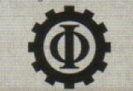
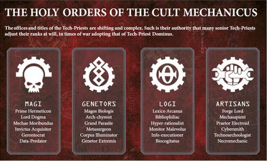

# 0125 机械教派 Cult Mechanicus

精校状态：中文行文已逐段精校，部分术语仍为暂定

分类：通用概念 / 帝国 Imperium / 机械神教 Adeptus Mechanicus

原文来源：https://www.bilibili.com/opus/1126031483202437129

原作者：帝国神选罐头

原文时间：编辑于 2025年12月02日 10:46

[返回分类目录](目录.md) · [全书目录](../../目录.md)

<!-- A0125-B0001 -->
**英文原文**

The Cult Mechanicus, also known as the Cult of Mars, is the state religion of the Adeptus Mechanicus, which recognises its own dogma as opposed to that of the Imperial Cult. As an organisation, it is composed of the priesthood of the Adeptus Mechanicus, also known as Tech-Priests.

<!-- /A0125-B0001 -->

<!-- A0125-B0002 -->

原译文

机械教派，也称为火星教派，是机械神教的宗教信仰，它承认自己的教条，而不是帝国教派的教条。作为一个组织，它由机械神教的神甫组成，也被称为技术神甫。

**校订译文**

机械教派又称火星教派，是机械修会的宗教体系，奉行自身教义，区别于帝皇信仰。作为一个组织，它由机械修会的祭司阶层，也就是技术祭司构成。

<!-- /A0125-B0002 -->

<!-- A0125-B0003 图片 -->

<!-- A0125-B0004 -->

原译文

Symbol of the Cult Mechanicus 机械教派标志

**校订译文**

Symbol of the Cult Mechanicus 机械教派标志

<!-- /A0125-B0004 -->

<!-- A0125-B0005 -->
## Overview 概述

<!-- /A0125-B0005 -->

<!-- A0125-B0006 -->
### History 历史

<!-- /A0125-B0006 -->

<!-- A0125-B0007 -->
**英文原文**

The Cult Mechanicus has ancient origins, developing on Mars during the Age of Strife. It was the state religion of the early Mechanicum even before the arrival of the Emperor and the commencement of the Great Crusade. When the Emperor first arrived on Mars many saw him as the Omnissiah, or the physical manifestation of the Machine God. As per the terms of the Treaty of Olympus that saw Terra and Mars unify, the Mechanicum was still allowed to practice its faith despite the Emperor's own secular Imperial Truth. The Cult Mechanicus continues to exist to this day, distinct but related to the Imperial Cult.

<!-- /A0125-B0007 -->

<!-- A0125-B0008 -->

原译文

机械教派有着古老的起源，在纷争时代在火星上发展起来。甚至在帝皇到来和大远征开始之前，它就是早期机械教的信仰。当帝皇首次抵达火星时，许多人将他视为欧姆尼赛亚，或万机神的化身。根据《奥林匹斯条约》的条款，泰拉和火星统一，尽管帝皇有自己的世俗帝国真理，机械教仍然被允许实践自己的信仰。机械教派一直存在到今天，它与帝国教派不同但有联系。

**校订译文**

机械教派有着古老的起源，在纷争时代在火星上发展起来。甚至在帝皇到来和大远征开始之前，它就是早期机械教的信仰。当帝皇首次抵达火星时，许多人将他视为欧姆尼赛亚，或万机神的化身。根据《奥林匹斯条约》的条款，泰拉和火星统一，尽管帝皇有自己的世俗帝国真理，机械教仍然被允许实践自己的信仰。机械教派一直存在到今天，它与帝皇信仰不同但有联系。

<!-- /A0125-B0008 -->

<!-- A0125-B0009 -->
### Beliefs 信仰

<!-- /A0125-B0009 -->

<!-- A0125-B0010 -->
**英文原文**

The core tenets of the Cult Mechanicus are codified in the sixteen "Universal Laws". Along the ages, the creed has accrued further theses, such as the Law of the Divine Complexity or the Third Law of Universal Variance.

<!-- /A0125-B0010 -->

<!-- A0125-B0011 -->

原译文

机械教派的核心原则被编纂成十六条“普遍法则”。随着时间的推移，信条积累了更多的论点，如神圣复杂性法则或第三法则的普遍差异。

**校订译文**

机械教派的核心教义编为十六条“普遍法则”。漫长岁月中，又衍生出其他论说，例如神圣复杂性法则和普遍变异第三法则。

<!-- /A0125-B0011 -->

<!-- A0125-B0012 -->
**英文原文**

According to the Cult Mechanicus, knowledge is the supreme manifestation of divinity and all creatures and technology that embody knowledge are thus holy because of it. The worth of a single man is only the sum of his knowledge - his body is simply an organic machine capable of preserving intellect. It is by this motivation that the followers of the Cult Mechanicus follow the Quest for Knowledge, seeking new technology and information to better themselves.

<!-- /A0125-B0012 -->

<!-- A0125-B0013 -->

原译文

根据机械教派的说法，知识是神性的最高体现，因此所有体现知识的生物和技术都是神圣的。一个人的价值只是他的知识的总和 — 他的身体只是一个能够保存智力的有机机械。正是出于这种动机，机械教派的追随者们追求知识，寻求新技术和信息来改善自己。

**校订译文**

根据机械教派的说法，知识是神性的最高体现，因此所有体现知识的生物和技术都是神圣的。一个人的价值只是他的知识的总和 — 他的身体只是一个能够保存智力的有机机械。正是出于这种动机，机械教派的追随者们追求知识，寻求新技术和信息来改善自己。

<!-- /A0125-B0013 -->

<!-- A0125-B0014 -->
**英文原文**

The Machine God, also known as the Deus Mechanicus, He who is three-in-one, the three in one, the triple god, the prime architect, and God-Machine, is the ultimate object of worship in the Cult Mechanicus. It is the Machine God that gave rise to all technologies and made them manifest through his chosen among mankind. To the Mechanicus, machines represent a higher form of life than those crudely formed from biological evolution. The planned perfection of form and function embodied in a machine are so great, that they could only have arisen from a divine source. Officially, the Cult Mechanicus maintains that the Emperor is the physical manifestation of the Machine God (the Omnissiah) and part of a trinity that also includes the Machine God and the Motive Force, the deity that gives all life and motion its continued existence.

<!-- /A0125-B0014 -->

<!-- A0125-B0015 -->

原译文

机械神，又称万机神，是三位一体、三合一、三重之神、首席设计师和机器神，是机械教派的终极目标。正是万机神创造了所有技术，并通过他在人类中的选择使它们显现出来。对于机械教来说，机器代表了一种比那些由生物进化粗略形成的生命形式更高的生命形式。机器所体现的形式和功能的设计完美是如此之好，以至于它们只能从神圣的源头产生。根据官方说法，机械教派认为帝皇是欧姆尼赛亚的物质表现，也是三位一体的一部分，三位一体还包括万机神和源力，源力是赋予所有生命和运动持续存在的神。

**校订译文**

万机神又称 Deus Mechanicus，拥有“三位一体者”“三重之神”“大造物者”等称号，是机械教派崇拜的终极对象。教派相信，所有技术都源自万机神，再通过其选定的人类显现。相比由生物进化形成的血肉生命，机械代表更高等的生命形式；其形态与功能如此完美地结合，必然出自神圣源头。机械教派的正式教义将帝皇认定为万机神的实体化身——欧姆尼赛亚。他与万机神、源力共同构成三位一体，源力则使一切生命与运动得以持续。

**校注：** 本段“正式教义”指作品内机械教派的立场，不代表编辑者已通过 GW 官网认证所有神学陈述。

<!-- /A0125-B0015 -->

<!-- A0125-B0016 -->
**英文原文**

The Machine-God made the universe, his perfect machine, the Great Work. He made humanity, and put them into it so that they might flourish, and do so by knowledge, which begets improvement, which allows understanding. Like the Ecclesiarchy, the Mechanicus believes that the human form is perfect, however the Machine Cult sees instead as the perfect beginning in order to test Machine-God's followers. The flesh was made weak by the Machine God to test them. Their role in life is to learn all there is to learn, to improve upon what the Machine-God gave them, and enrich his creation in the process.

<!-- /A0125-B0016 -->

<!-- A0125-B0017 -->

原译文

万机神创造了宇宙，他完美的机器，伟业。他创造了人类，并将他们放入其中，以便他们能够蓬勃发展，并通过知识实现这一点，知识带来了进步，使理解成为可能。与国教一样，机械教也认为人类形态是完美的，但机械教派却将其视为测试万机神追随者的完美开端。机械之神使肉体变得衰弱，以考验他们。他们在生活中的角色是学习所有需要学习的东西，改进神给他们的机器，并在此过程中丰富祂的创造。

**校订译文**

依照机械教派教义，万机神创造了宇宙这部完美机器，即“伟业”，又创造人类，将其置身其中，通过知识带来改进、获得理解，进而繁荣发展。与国教会一样，机械教派认为人类形体是完美的，不过这种完美只是考验的起点：万机神刻意使血肉脆弱，以试炼信徒。人生的职责是穷尽一切知识，改善万机神赐予的禀赋，并在这一过程中丰富祂的造物。

<!-- /A0125-B0017 -->

<!-- A0125-B0018 -->
**英文原文**

Some believe that organic life is the Machine-God’s greatest accomplishment within the scope of the Great Work. The Machine God created the complex weaknesses of flesh so his followers might learn metallic strength, and ascend to his level of machinic perfection. Thus striving to improve upon it and replace it, however, abandoning his numerous gifts is done at great peril. For to give up one's soul is the great sin of the Cult Mechanicus. The soul must be understood, not despised. Such is life’s great test.

<!-- /A0125-B0018 -->

<!-- A0125-B0019 -->

原译文

有人认为，有机生命是万机神在伟业范围内的最大成就。万机神创造了肉体的复杂弱点，这样他的追随者就可以学习金属力量，并提升到他的机器完美水平。因此，努力改进和替换它，然而，放弃他的众多天赋是危险的。因为放弃一个人的灵魂是机械教派的大罪。灵魂必须被理解，而不是被轻视。这就是生命最大的考验。

**校订译文**

一些信徒认为，有机生命是万机神伟业中的最高成就。血肉的复杂弱点让追随者得以认识金属的力量，进而趋近神的机械完美。他们因而不断改进、替换肉体，但轻率舍弃神所赐予的一切同样危险：抛弃自己的灵魂，是机械教派的大罪。灵魂应被理解，而非轻蔑，这正是生命的大考验。

<!-- /A0125-B0019 -->

<!-- A0125-B0020 -->
**英文原文**

The Great Work of the Machine God was made with the warp and the universe in balance, each influencing the other. Without the touch of the warp, the human soul cannot function and ill effects will occur to humans when completely cut free of the spiritual aspect of the universe. Little or no connection to the Warp will cause a Stilling effect on humans, as seen within the Necrons' Pariah Nexus, while to detrimental effects of too much or direct Warp exposure has been well documented after the opening of the Great Rift.

<!-- /A0125-B0020 -->

<!-- A0125-B0021 -->

原译文

万机神的伟业是在亚空间和宇宙平衡的情况下完成的，两者相互影响。如果没有亚空间的触摸，人类的灵魂就无法运作，当人类完全脱离宇宙的灵魂层面时，就会对人类产生不良影响。与亚空间的很少或没有联系会对人类产生停滞效应，正如在死灵的驱灵死域中看到的那样，而在大裂隙打开后，过多或直接接触亚空间的有害影响已被充分记录。

**校订译文**

教派认为，万机神的伟业使亚空间与实体宇宙保持平衡，彼此影响。人类灵魂离不开亚空间，一旦与宇宙的精神层面完全隔绝，就会遭受损害。与亚空间联系过弱或断绝，会引发寂滞效应，太空死灵的驱灵死域就是例子；而过量或直接接触亚空间的危害，在大裂隙出现后也有充分记载。

<!-- /A0125-B0021 -->

<!-- A0125-B0022 -->
**英文原文**

In death, some followers of the Machine Cult believe they join the Machina Opus, the Great Work of the Machine-God, to become pure data.

<!-- /A0125-B0022 -->

<!-- A0125-B0023 -->

原译文

于死亡，一些机械教派的追随者相信他们加入了万机神的伟业神之机械，成为纯粹的数据。

**校订译文**

部分机械教派信徒相信，死后自己将化为纯粹的数据，融入 Machina Opus，即万机神的伟业。

<!-- /A0125-B0023 -->

<!-- A0125-B0024 -->
**英文原文**

One of the surviving Men of Iron, UR-025, states that it has met the true Omnissiah, not the false one worshipped by man, and that it would find the Mechanicum disappointing.

<!-- /A0125-B0024 -->

<!-- A0125-B0025 -->

原译文

其中一位幸存的铁人UR-025表示，它遇到了真正的欧姆尼赛亚，而不是人类崇拜的虚假欧姆尼赛亚。

**校订译文**

幸存铁人之一 UR-025 声称，它见过真正的欧姆尼赛亚，而非人类崇拜的伪神；真正的欧姆尼赛亚会对机械教感到失望。

**校注：** 此为 UR-025 的角色发言，不据此认定真正欧姆尼赛亚的身份。原译漏掉其对机械教失望的后半句，已补。

<!-- /A0125-B0025 -->

<!-- A0125-B0026 -->
**英文原文**

Non-Mechanicus individuals who take well to quality augmetic implants, with no signs of rejection and natural synergy, are seen as having a natural synergy with the Machine-God. Some would say this marks the individual out as a favoured ignorant or enlightened-in-waiting.

<!-- /A0125-B0026 -->

<!-- A0125-B0027 -->

原译文

非机械教个体接受高质量的增强植入物，没有排斥和自然协同的迹象，被视为与万机神有着自然协同。有人会说，这标志着这个人被视为一个受宠的无知或开明的等待者。

**校订译文**

如果机械修会之外的人与优质强化植入物高度适配，没有排斥反应、运行自然协调，教徒就会认为此人与万机神有天然的亲和。一些人将其视为“蒙受恩宠却尚未得知者”，或“等待启蒙之人”。

<!-- /A0125-B0027 -->

<!-- A0125-B0028 -->
### Tech-Heresy 技术异端

<!-- /A0125-B0028 -->

<!-- A0125-B0029 -->
**英文原文**

The Treaty of Olympus outlines a strict code of Technological conduct, as dictated by the God-Emperor during the onset of his Great Crusade, dubbing a far range of innovations and fields as Tech-Heresy (Heretechnica) and its practitioners as Hereteks. These include such forbidden sciences as unleashing plagues of death across entire star systems, draining energy from stars, or distorting space-time. However the three greatest orders of Tech-Heresy are that of Abominable Intelligence, manipulating the Human genome, and delving deeply into the powers of the Warp.

<!-- /A0125-B0029 -->

<!-- A0125-B0030 -->

原译文

《奥林匹斯条约》概述了一项严格的技术行为准则，这是由神皇在其大远征开始时规定的，将广泛的创新和领域称为技术异端（科技异端），将其从事者称为异端。这些包括诸如在整个恒星系统中释放死亡瘟疫、从恒星中消耗能量或扭曲时空等被禁止的科学。然而，技术异端的三个最大的等级是憎恶智能，操纵人类基因组，深入研究亚空间的力量。

**校订译文**

《奥林匹斯条约》确立了帝皇在大远征初期规定的严格技术准则，将众多创新和研究领域划为技术异端（Heretechnica），从事者则称技术异端者（Hereteks）。禁忌领域包括向整个恒星系释放致命瘟疫、抽取恒星能量，以及扭曲时空。其中最严重的三类，是可憎智能、操纵人类基因组，以及深入探索亚空间力量。

<!-- /A0125-B0030 -->

<!-- A0125-B0031 -->
**英文原文**

Preventing Tech-Heresy takes many forms, like the Puritens surgery.

<!-- /A0125-B0031 -->

<!-- A0125-B0032 -->

原译文

预防技术异端有很多形式，比如纯洁手术。

**校订译文**

预防技术异端有很多形式，比如纯洁手术。

<!-- /A0125-B0032 -->

<!-- A0125-B0033 -->
### Sign of the Cog 齿轮手势

<!-- /A0125-B0033 -->

<!-- A0125-B0034 -->
**英文原文**

The sign of the cog, sign of the cogwheel, sign of the Cult Omnissiah, or sign of the Icon Mechanicus, is a hand gesture to indicate faith and deference towards the Machine God. This sign is equivalent in function to the Imperial Cult's sign of the aquila but used in the context of the Cult Mechanicus.

<!-- /A0125-B0034 -->

<!-- A0125-B0035 -->

原译文

轮齿手势、齿轮手势、欧姆尼赛亚教派手势或机械教图标手势是一种手势，表示对万机神的信仰和尊重。这个符号在功能上相当于帝国教派的天鹰手势，但用于机械教派的环境。

**校订译文**

齿轮手势另有“轮齿手势”“欧姆尼赛亚教派手势”“机械圣徽手势”等名称，表达对万机神的信仰与敬意。其作用相当于帝皇信仰中的天鹰手势，但用于机械教派礼仪。

<!-- /A0125-B0035 -->

<!-- A0125-B0036 -->
**英文原文**

The sign of the cog is made by lacing both hands together across one's torso. The sign can be, and is regularly, made by unaugmented human hands. The knuckles are knotted and meshed. This gesture is often used while praying to the Machine God. It is also used when showing solemn thanks and respect to a member of the Cult Mechanicus or an honoured machine, such as a Knight. Making a circular symbol over one's breast: the sign of the cogwheel, might be done to pay one's respects to the deceased.

<!-- /A0125-B0036 -->

<!-- A0125-B0037 -->

原译文

齿轮手势是通过系双手横跨躯干而形成的。该手势可以并且经常由精简的人手使用。指关节打结并啮合。这个手势经常在向万机神祈祷时使用。它也用于向机械教派或骑士等荣誉机械的成员表示庄严的感谢和尊重。在胸前做一个圆形符号：齿轮手势，可能是为了向死者致敬。

**校订译文**

做齿轮手势时，双手在胸腹前交扣，指节彼此咬合，如同齿轮。未经机械改造的双手也能完成，而且经常如此使用。信徒向万机神祈祷时会做此手势，也用它向教派成员或骑士等受尊崇的机器郑重致谢、致敬；在胸前划出圆形的齿轮符号，有时则用来悼念死者。

<!-- /A0125-B0037 -->

<!-- A0125-B0038 -->
**英文原文**

Those of the Imperial Cult and Cult Mechanicus will sometimes make the symbol of each-other's faith during a formal greeting, when giving solemn thanks, or showing showing one's respect. The mutual gesture expresses a sense of cooperation and solidarity between the two cultures working together. Most Imperials tend to make the sign of the cog with a laboured unfamiliarity. Regardless of execution, this gesture tends to meet with a degree of approval or appreciation from the Mechanicus party.

<!-- /A0125-B0038 -->

<!-- A0125-B0039 -->

原译文

帝国教派和机械教派的信徒有时会在正式的问候、庄严的感谢或表示尊重时，互作信仰的象征。这种相互的姿态表达了两种文化共同努力的合作和团结感。大多数帝国人倾向于用一种费力的陌生感来打齿轮手势。无论执行方式如何，这种姿态往往会得到机械教一方的一定程度的认可或赞赏。

**校订译文**

帝皇信仰与机械教派的信徒，在正式问候、郑重致谢或表示敬意时，有时会使用对方信仰的手势，以表达两种文化之间的合作与团结。多数帝国人做齿轮手势显得生疏费力，但无论动作是否准确，机械修会一方通常都会认可这份心意。

<!-- /A0125-B0039 -->

<!-- A0125-B0040 -->
## Organisation 组织

<!-- /A0125-B0040 -->

<!-- A0125-B0041 -->
**英文原文**

While each Forge World is led by its own Fabricator General, it is the Fabricator of Mars who is considered the de facto leader of the Cult Mechanicus. Beneath the Fabricator General is the Fabricator Locum who in turn may call upon and command Magi Technicus, Metallurgicus, Alchemys, Cogitatrices, Pedanticum, Tech-assassins, hive monitors and Holy Requisitioners, who in turn can command a body of fabricators minoris, Fulgurites, Corpuscarii, overseers, underseers, stasis clerks, and techno-dervishes. The governing body of each Forge World's technarchy is referred to as a forge-synod. These synods are collections of high ranking tech priests of that Forge World and are led by that Forge World's Fabricator General. All Forge Synods ultimately owe fealty to the Great Synod of Mars.

<!-- /A0125-B0041 -->

<!-- A0125-B0042 -->

原译文

虽然每个铸造世界都由自己的铸造将军领导，但火星的铸造将军被认为是机械教派的事实领导者。在铸造将军之下是铸造代理，他相应的可以召唤和指挥技术贤者、冶炼贤者、炼金贤者、沉思贤者、迂究贤者、技术刺客、巢都监督者和神圣探求者，他们相应的可以指挥一个由铸造下属团体 — 雷岩电僧、法身电僧、监督者、监督员、静滞书记员和技术苦行僧。每个铸造世界的技术统治的管理机构被称为铸造议会。这些议会是铸造世界高级技术神甫的集合，由铸造世界的铸造将军领导。所有铸造议会最终都要效忠于火星大议会。

**校订译文**

各铸造世界都有自己的铸造将军，而火星铸造将军被视为机械教派事实上的领袖。其下是铸造代理，可指挥技术、冶金、炼金、计算及学究等领域的贤者，以及技术刺客、巢都监查员和神圣征调员；这些人又统辖次级铸造师、电岩与科普斯卡驭电祭司、各级监工、静滞书记员及技术苦行僧。每个铸造世界的统治机构称为铸造议会，由当地高阶技术祭司组成、铸造将军主持。所有铸造议会最终都向火星大议会效忠。

<!-- /A0125-B0042 -->

<!-- A0125-B0043 -->
### Holy Orders 神圣修会

<!-- /A0125-B0043 -->

<!-- A0125-B0044 -->
**英文原文**

The Cult Mechanicus is organised in different Holy Orders, of which a Tech-Priest may change in time of need. The orders of the Magi pursue esoteric agendas as likely to end in triumpth as disaster. The orders of the Genetors probe biological mysteries, creating ever-stranger cyborgs and slaughtering numerous xenos to excise their biological secrets. The Logis includes analyst, statistician, and logistician whose purpose is to predict future trends and make forecasts about Mechanicus expenditure and needs. The Artisans create and restore weapons of war.

<!-- /A0125-B0044 -->

<!-- A0125-B0045 -->

原译文

机械教派按不同的神圣修会组织，其中技术神甫可能会在需要时改变。圣贤士修会追求深奥的议程，既可能以胜利告终，也可能以灾难告终。基因士修会探索生物奥秘，创造出越来越怪异的半机械人，并屠杀了许多异型来揭开他们的生物秘密。逻辑士员包括分析师、统计学家和后勤人员，他们的目的是预测未来趋势，并对机械教支出和需求进行预测。铸造士创造并修复战争武器。

**校订译文**

机械教派分为不同的神圣修会，技术祭司可按需要转属。贤者修会追求深奥的研究目标，成果可能是胜利，也可能是灾难。基因士修会探索生物奥秘，创造愈发奇异的半机械生命，并屠杀大量异形以揭开其生物学秘密。逻辑士包括分析师、统计学家与后勤专家，负责预测未来趋势，以及机械修会的开支和需求。铸造士则制造、修复战争武器。

**校注：** GW-09/GW-10 第4页强化名称将 Artisan/Genetor/Logis/Magos 对应为工匠师/基因师/预言师/贤者；此处属于历史职业及组织分类，尤其 Logis 与预言师的映射需核具体背景用法，暂保留逻辑士，并在术语表注明范围。

<!-- /A0125-B0045 -->

<!-- A0125-B0046 图片 -->

<!-- A0125-B0047 -->

原译文

Holy Orders of the Cult Mechanicus 机械教派神圣修会

**校订译文**

Holy Orders of the Cult Mechanicus 机械教派神圣修会

<!-- /A0125-B0047 -->

<!-- A0125-B0048 -->
### Military Forces 军事部队

<!-- /A0125-B0048 -->

<!-- A0125-B0049 -->
**英文原文**

Each Tech-Priest Dominus may lead a Battle Congregation consisting of detachments of the Servitoria, Electro-Priesthood, and the Legio Cybernetica.

<!-- /A0125-B0049 -->

<!-- A0125-B0050 -->

原译文

每个统御技术神甫都可以领导一个由机仆、电僧和智控军团组成的战斗修会。

**校订译文**

每位技术祭司主宰者都可以率领一个战斗集群，由机仆部队、驭电祭司及智控军团的分遣队组成。

<!-- /A0125-B0050 -->

<!-- A0125-B0051 -->

原译文

Tech-Priests 技术神甫

**校订译文**

Tech-Priests 技术祭司

<!-- /A0125-B0051 -->

<!-- A0125-B0052 -->

原译文

Tech-Priest Dominus 统御技术神甫

**校订译文**

Tech-Priest Dominus 技术祭司主宰者

<!-- /A0125-B0052 -->

<!-- A0125-B0053 -->

原译文

Tech-Priest Enginseers 技术神甫工造士

**校订译文**

Tech-Priest Enginseers 技术祭司机械教士

<!-- /A0125-B0053 -->

<!-- A0125-B0054 -->

原译文

Servitoria 机仆

**校订译文**

Servitoria 机仆

<!-- /A0125-B0054 -->

<!-- A0125-B0055 -->

原译文

Kataphron Clades 重型战斗机仆分支

**校订译文**

Kataphron Clades 卡塔弗隆战斗群

<!-- /A0125-B0055 -->

<!-- A0125-B0056 -->

原译文

Electro-Priesthood 电僧

**校订译文**

Electro-Priesthood 驭电祭司团

<!-- /A0125-B0056 -->

<!-- A0125-B0057 -->

原译文

Corpuscarii Brotherhoods 法身电僧

**校订译文**

Corpuscarii Brotherhoods 科普斯卡兄弟会

<!-- /A0125-B0057 -->

<!-- A0125-B0058 -->

原译文

Fulgurite Brotherhoods 雷岩电僧

**校订译文**

Fulgurite Brotherhoods 电岩兄弟会

<!-- /A0125-B0058 -->

<!-- A0125-B0059 -->

原译文

Legio Cybernetica 智控军团

**校订译文**

Legio Cybernetica 智控军团

<!-- /A0125-B0059 -->

<!-- A0125-B0060 -->

原译文

Cybernetica Datasmith 智控数据铁匠

**校订译文**

Cybernetica Datasmith 智控数据技师

<!-- /A0125-B0060 -->

<!-- A0125-B0061 -->

原译文

Kastelan Robots 卡斯特兰机兵

**校订译文**

Kastelan Robots 卡斯特兰机器人

<!-- /A0125-B0061 -->

本篇核心术语与暂定项

以下列出本篇出现的英文原形及核心术语表用词。同形词可能指不同对象，具体词义以本篇正文和校注为准；单复数、别名和仅见于图注的名称可能尚未列入。完整候选见[术语表](../../术语表/双语术语候选.csv)。

| 英文 | 采用中文 | 状态 |
| --- | --- | --- |
| Adeptus Mechanicus | 机械修会 | 官方已核对 |
| Necrons | 太空死灵 | 官方已核对 |
| Warp | 亚空间 | 官方已核对 |
| Great Rift | 大裂隙 | 官方已核对 |
| Mechanicum | 机械教 | 暂定·历史称谓 |
| Cult Mechanicus | 机械教派 | 暂定·概念区分 |
| Tech-Priest | 技术祭司 | 官方已核对 |
| Legio Cybernetica | 智控军团 | 暂定 |
| Abominable Intelligence | 憎恶智能 | 暂定·官方待核 |
| Men of Iron | 铁人 | 暂定·官方待核 |
| Emperor | 帝皇 | 官方已核对 |
| Ecclesiarchy | 国教会 | 暂定 |
| Forge World | 铸造世界 | 暂定·官方待核 |
| Great Crusade | 大远征 | 暂定·官方待核 |
| Age of Strife | 纷争时代 | 暂定·官方待核 |
| Terra | 泰拉 | 暂定·官方待核 |
| UR-025 | UR-025 | 暂定·官方待核 |
| COG | 机灵 | 暂定·官方待核 |
| Imperial Cult | 帝皇信仰 | 暂定·官方待核 |
| Pariah Nexus | 驱灵死域 | 暂定·官方待核 |
| Electro-Priesthood | 驭电祭司团 | 暂定·官方待核 |
| Treaty of Olympus | 奥林匹斯条约 | 暂定·官方待核 |
| Machine God | 万机神 | 暂定·官方待核 |
| Omnissiah | 欧姆尼赛亚 | 暂定·官方待核 |
| Mars | 火星 | 暂定·官方待核 |
| Pariah | 贱民 | 暂定·官方待核 |
| Tech | 技术语 | 暂定·官方待核 |
| Aquila | 天鹰 | 暂定·官方待核 |
| Sign of the Aquila | 天鹰礼 | 暂定·官方待核 |
| Sign of the Cog | 齿轮礼 | 暂定·官方待核 |
| Imperial Truth | 帝国真理 | 暂定·官方待核 |
| Machina Opus | 机械之作 | 暂定·官方待核 |
| Ancient | 旗手 | 官方已核对 |
| Tech-Priest Dominus | 技术祭司主宰者 | 官方已核对 |
| Fabricator Locum | 铸造代理 | 暂定·官方待核 |
| Logis | 逻辑士 | 暂定·官方待核 |
| Powers | 能天使 | 暂定·官方待核 |
| Xenos | 异形 | 暂定·官方待核 |
| Fealty | 忠诚 | 暂定·官方待核 |
| Fabricator | 铸造师 | 暂定·待核官方 |
| Synod of Mars | 火星议会 | 暂定·官方待核 |

