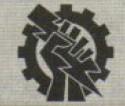
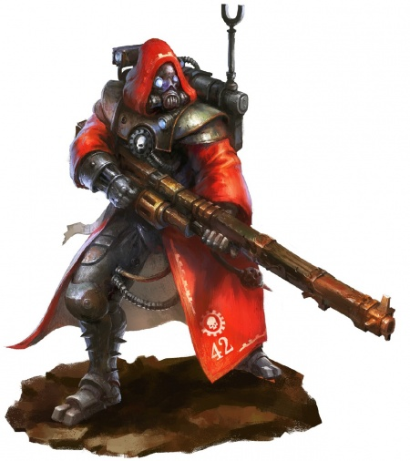
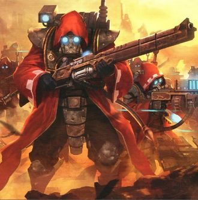
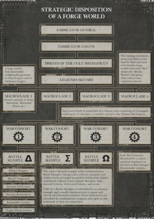
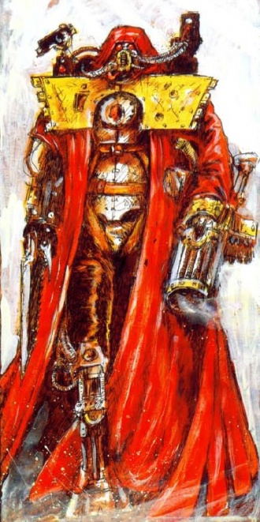

# 0134 护教军 Skitarii

精校状态：中文行文已逐段精校，部分术语仍为暂定

分类：通用概念 / 帝国 Imperium / 机械神教 Adeptus Mechanicus

原文来源：https://www.bilibili.com/opus/1127517627808219159

原作者：帝国神选罐头

原文时间：编辑于 2025年12月01日 11:06

[返回分类目录](目录.md) · [全书目录](../../目录.md)

<!-- A0134-B0001 -->
**英文原文**

The Skitarii (sg. skitarius, pl. skitarii) are the cyborg armies of the Adeptus Mechanicus and its primary military force alongside the Collegia Titanica and Cult Mechanicus Battle Congregations.

<!-- /A0134-B0001 -->

<!-- A0134-B0002 -->

原译文

护教军（单数.护教兵，复数.护教军）是机械神教的半机械人军队及其主要军事部队，与泰坦修会和机械教派战斗修会并肩作战。

**校订译文**

护教军（英文单数 skitarius，复数 skitarii）是机械修会的半机械人军队，与泰坦修会和机械教派战斗集群共同构成其主要军事力量。

<!-- /A0134-B0002 -->

<!-- A0134-B0003 图片 -->

<!-- A0134-B0004 -->

原译文

Symbol of the Skitarii 护教军标志

**校订译文**

Symbol of the Skitarii 护教军标志

<!-- /A0134-B0004 -->

<!-- A0134-B0005 -->
**英文原文**

The military forces of the Skitarii are known as the Legiones Skitarii.

<!-- /A0134-B0005 -->

<!-- A0134-B0006 -->

原译文

护教军的军事部队被称为护教军团。

**校订译文**

护教军的军事部队被称为护教军团。

<!-- /A0134-B0006 -->

<!-- A0134-B0007 -->
## Overview 概述

<!-- /A0134-B0007 -->

<!-- A0134-B0008 -->
**英文原文**

"Skitarii" are armies of specially augmented cybernetic warriors sworn to a specific Forge World and serve alongside the Collegia Titanica and Taghmata Omnissiah as the military forces of the Mechanicum. Skitarii, sometimes referred as Tech-Guard (or Tech Guard) to outsiders, both refer to these cybernetically augmented infantry. During the Great Crusade the Skitarii Legions were sworn directly to the Fabricator-General of Mars, though since the Horus Heresy they have been broken up to be commanded by individual Forge Worlds.

<!-- /A0134-B0008 -->

<!-- A0134-B0009 -->

原译文

“护教军”是由特殊增强的智控战士组成的军队，他们宣誓效忠于一个特定的铸造世界，并与泰坦修会和机神禁卫军一起作为机械教的部队服役。护教军，有时对外称为技术守卫（或技术卫队），都是指这些智控增强的步兵。在大远征期间，护教军团直接向火星铸造将军宣誓，尽管自荷鲁斯叛乱以来，他们已经被解散，由各个铸造世界指挥。

**校订译文**

护教军由经过特殊机械强化的战士组成，效忠特定铸造世界，与泰坦修会及机神禁卫军共同为机械教作战。外人有时将这些机械改造步兵称为技术卫军。大远征期间，各护教军团直接效忠火星铸造将军；荷鲁斯之乱后，军团被拆分，改由各铸造世界分别指挥。

<!-- /A0134-B0009 -->

<!-- A0134-B0010 图片 -->

<!-- A0134-B0011 -->

原译文

Skitarii Soldier 护教军士兵

**校订译文**

Skitarii Soldier 护教军士兵

<!-- /A0134-B0011 -->

<!-- A0134-B0012 -->
**英文原文**

While their bodies are more machine than flesh, Skitarii are not true Servitors and still retain independent thought. Those with the highest level of augmentation are known as Skitarii Alphas, a high honor in Skitarii culture. Due to their extensive modification Skitarii can excel and survive in almost any atmosphere. Skitarii are also known for their near-emotionless nature, a result of both brain surgery and psychological condition. Because of their conditioning Skitarii are so loyal to their Tech-Priest masters that they will even blindly kill one another if ordered.

<!-- /A0134-B0012 -->

<!-- A0134-B0013 -->

原译文

虽然他们的身体更多的是机器而不是肉体，但护教军并不是真正的机仆，仍然保留着独立的思想。那些拥有最高增强水平的人被称为护教军阿尔法，这是护教军文化中的一项崇高荣誉。由于其广泛的改造，护教军可以在几乎任何环境中脱颖而出并生存。护教军也以其近乎无感情的天性而闻名，这是脑部手术和心理状况共同作用的结果。由于他们的条件，护教军对他们的技术神甫主人非常忠诚，如果有命令，他们甚至会盲目地互相残杀。

**校订译文**

虽然护教军体内机械成分多于血肉，他们仍保留独立思维，并非真正的机仆。改造程度最高者称为护教军阿尔法，这是极受尊崇的称号。广泛改造使他们能在几乎各种大气环境中生存、有效作战。脑部手术与心理调教令其几乎不流露感情，对技术祭司主人忠诚到盲从；只要奉命，甚至会自相残杀。

<!-- /A0134-B0013 -->

<!-- A0134-B0014 -->
**英文原文**

In battle, Skitarii fight with near-robotic discipline and base their firing vectors and positioning on mathematical formulae guaranteed to bring about maximum success. While the Imperial Guard focuses on broad sweeping assaults, Skitarii units generally focus on maximizing their strength against vital enemy units and installations. While Skitarii fighters do not require any boost in morale, they do receive regular enhancements from combat drugs that can cause sudden bursts of energy, strength, and regenerative power. However, many of these drugs are extremely dangerous and cause horrific side effects mere minutes after their use.

<!-- /A0134-B0014 -->

<!-- A0134-B0015 -->

原译文

在战斗中，护教军以近乎机器人的纪律进行战斗，并将他们的射击矢量和定位建立在数学公式的基础上，以确保取得最大的成功。虽然帝国卫队专注于广泛的扫荡，但护教军部队通常专注于最大限度地增强对重要敌方单位和设施的实力。虽然护教军战士不需要提高士气，但他们确实会定期服用战斗药物，这些药物会导致能量、力量和再生能力的突然爆发。然而，其中许多药物非常危险，使用几分钟后就会产生可怕的副作用。

**校订译文**

护教军以近乎机器的纪律作战，用数学公式计算射击方向和阵位，力求最大化战果。帝国卫队偏重大范围攻势，护教军则通常集中力量打击敌方关键部队与设施。他们不需要鼓舞士气，却会定期接受战斗药物强化，使精力、力量和再生能力骤然增强。不过，许多药物极为危险，使用数分钟后就会出现严重副作用。

<!-- /A0134-B0015 -->

<!-- A0134-B0016 -->
**英文原文**

The Skitarii also serve as the bodyguards of the Adeptus Mechanicus Survey teams. They were present at the First Encounter with the Eldar. The Eldar of the Biel-tan craftworld slaughtered the Skitarii present and only one ship was able to escape, though the crew died from lack of food and oxygen.

<!-- /A0134-B0016 -->

<!-- A0134-B0017 -->

原译文

护教军还担任机械神教调查队的护卫。他们出席了与灵族的第一次会面。比耶-坦方舟世界的灵族屠杀了在场的护教军，只有一艘船能够逃脱，尽管船员因缺乏食物和氧气而死亡。

**校订译文**

护教军也为机械修会勘察队提供护卫，曾参与原文所称的“与灵族的首次接触”。比耶坦方舟世界的灵族屠杀了现场护教军，仅一艘舰船逃出，舰员最终仍因食物与氧气耗尽而死。

**校注：** First Encounter 为原条目链接事件名；此处不将其扩大为整个人类历史上首次接触灵族。

<!-- /A0134-B0017 -->

<!-- A0134-B0018 图片 -->

<!-- A0134-B0019 -->

原译文

Skitarii Rangers 护教军游侠

**校订译文**

Skitarii Rangers 护教军游骑兵

<!-- /A0134-B0019 -->

<!-- A0134-B0020 -->
**英文原文**

Skitarii regularly communicate amongst themselves and other Mechanicus members using skit-code, a dialect that is entirely unequipped to express anything more than tactical data. Skitarii of high rank or station are also permitted to join in Noospheric communion when it is practical to do so, such as when serving in high offices or as personal protectors to Tech Priests.

<!-- /A0134-B0020 -->

<!-- A0134-B0021 -->

原译文

护教军经常使用短文暗码在他们自己和其他机械教成员之间进行交流，这是一种完全没有能力表达战术数据以外的任何东西的方言。高级别或地位的护教军也被允许在可行的情况下加入思想空间交流，例如在担任高级军官或作为技术神甫的个人护卫时。

**校订译文**

护教军彼此之间、以及与机械教其他成员交流时，常使用护教军暗码；这种方言只能传递战术数据。位阶较高者在条件允许时也可参加通感网络交流，例如担任高级职务或技术祭司私人护卫时。

<!-- /A0134-B0021 -->

<!-- A0134-B0022 -->
### Recruitment and Creation 招募与创造

<!-- /A0134-B0022 -->

<!-- A0134-B0023 -->
**英文原文**

Skitarii recruitment follows no universal role. Some Skitarii began as volunteers who were faithful to the Cult Mechanicus Others are recruited from the factory workers of Forge Worlds. Some denizens of Forge Worlds are destined to become Skitarii at birth, having been bred from eugenics programs that emphasize strength and aggression.

<!-- /A0134-B0023 -->

<!-- A0134-B0024 -->

原译文

护教军的招募没有遵循普遍的角色。一些护教军最初是忠于机械教派的志愿者，其他人则是从铸造世界的工厂工人中招募的。铸造世界的一些居民注定会在出生时成为护教军，他们是从强调力量和侵略性的优生学项目中长大的。

**校订译文**

护教军没有统一的招募规则。有些是虔信机械教派的志愿者，有些从铸造世界工人中选出，也有些通过强调力量与攻击性的育种计划诞生，出生时便已注定成为护教军。

**校注：** 英文 universal role 在招募语境中疑为 universal rule 的误写，译作没有统一招募规则。

<!-- /A0134-B0024 -->

<!-- A0134-B0025 -->
**英文原文**

Skitarii are often created from menials or vat-born humans. They are sometimes inducted into the legions from other sources as needed, such as from refugee populations. Each skitarius taking the Vows of Integration whilst kneeling in supplication to their new master within the Cult Mechanicus. However, those coming from alternative origins might be viewed as inferior by their cyborg peers. The majority of a legion's troops often consist of elevated-menials and vat-born individuals. Forge World menials who suffer significant injuries are sometimes turned into skitarii, either that or a servitor. Regardless, some menials who desire greatness, but are lack the skill or opportunity to become a tech-adept, instead seek out becoming horrendously injured in the hopes of becoming a warrior of the Omnissiah. Some skitarii have their memories prior to their induction into the legions purged.

<!-- /A0134-B0025 -->

<!-- A0134-B0026 -->

原译文

护教军通常是由仆人或缸中出生的人创造的。他们有时会根据需要从其他来源（如难民）被引入军团。每个护教兵都要做整合誓言，同时跪在机械教派中恳求他们的新主人。然而，那些来自其他来源的人可能会被他们的半机械人同辈视为劣等。军团的大多数部队通常由仆人晋升和缸中出生的人组成。铸造世界遭受重伤的仆人有时会被变成护教军，要么成为机仆。无论如何，一些渴望伟大，但缺乏成为技术专家的技能或机会的仆人，反而会寻求受到可怕的伤害，希望成为欧姆尼赛亚的战士。一些护教军在加入军团之前就已经清除了记忆。

**校订译文**

护教军通常由杂役或培养槽中诞生的人类改造而来，也会按需要从难民等其他群体征募。每名护教兵都须跪在新的机械教派主人面前，宣读整合誓言。不过，其他出身者可能遭机械同袍轻视；军团主体通常仍是晋升的杂役和槽生人。重伤的铸造世界杂役有时会被改造成护教军，另一些则成为机仆。有些渴望出人头地、却无力或无缘成为技术文吏的杂役，甚至故意寻求重伤，以换取成为欧姆尼赛亚战士的机会。部分护教兵还会被抹除入伍以前的记忆。

<!-- /A0134-B0026 -->

<!-- A0134-B0027 -->
**英文原文**

The process Skitarii creation is a closely kept secret of the Adeptus Mechanicus, but what is clear is that involves heavy cybernetic augmentation to those with a fanatical faith in the Omnissiah. Their masters refashion their bodies, replacing fallible ligaments and flesh with titanium servo-motors and bionic musculature. During the process of conversion into a Skitarii most of their organs and tissue are modified or replaced entirely with circuit, bio-plastic, and metal. With few exceptions, Skitarii have pallid bodies of puckered flesh and sutured cybernetics. Ceramic valves and adamantium sockets stud their hard knots of sun-starved and translucent muscle. In imitation (so some tech priests believe) of the ancient cohorts that first ground their limbs into stumps upon the dunes of Mars, the Skitarii's lower legs are replaced with prostheses of inviolate alloy. Even the brains of these warriors are grotesque hybrids of grey matter and twisting neurocircuitry.

<!-- /A0134-B0027 -->

<!-- A0134-B0028 -->

原译文

护教军的创造过程是机械神教的秘密，但很明显，这涉及到对那些狂热信仰欧姆尼赛亚的人进行大量的智控增强。他们的主人重塑了他们的身体，用钛伺服电机和仿生肌肉组织取代了容易受伤的韧带和肌肉。在转化为护教军的过程中，他们的大部分器官和组织都被电路、生物塑料和金属完全改变或替换。除了少数例外，护教军有着苍白的皱巴巴的肉体和缝合的智控。陶钢阀门和精金插口在它们阳光不足、半透明的坚硬肌肉上。为了模仿（一些科技神甫相信）最初在火星沙丘上将四肢磨成残肢的古代大队，护教军的小腿被不容破坏的合金假肢所取代。甚至这些战士的大脑也是灰质和扭曲神经回路的怪诞混合体。

**校订译文**

制造护教军的具体工艺是机械修会严守的秘密，但可以确定，虔信欧姆尼赛亚者会接受大规模机械改造。祭司以钛制伺服电机和仿生肌肉替换脆弱的韧带、血肉，大多数器官组织也改为电路、生物塑料与金属。除了少数例外，他们身体苍白，皱缩血肉与机械缝接在一起；缺乏日照、近乎半透明的紧绷肌肉中嵌着陶瓷阀门与精金插口。其小腿被坚固合金义肢替代，据某些祭司说，这是效仿最早在火星沙丘上跋涉、将四肢磨残的古代战士。就连大脑也是灰质与盘绕神经电路的怪异混合物。

<!-- /A0134-B0028 -->

<!-- A0134-B0029 -->
**英文原文**

One who looked for consistency in Skitarii augmentations would be sorely disappointed. A soldier of the Adeptus Mechanicus may have a punch card skull slot and leather bellows for lungs, whilst at the same time housing quantum bioware in his brain. It is often said that were one of these enhanced warriors to be rendered down, traces of nearly every element known to its masters could be found somewhere in the remains. The Tech-Priests know this to be no exaggeration, for dissection is but one of the dark fates a skitarius might undergo in order to satisfy their masters' predatory curiosity.

<!-- /A0134-B0029 -->

<!-- A0134-B0030 -->

原译文

一个在护教军的增强中寻求一致性的人会非常失望。机械神教的士兵可能有一个穿孔卡头骨槽和用于肺部的皮革风箱，同时在他的大脑中容纳量子生物制品。人们常说，如果这些增强的战士之一被击倒，其主人所知的几乎所有元素的痕迹都可以在遗骸的某个地方找到。技术神甫知道这一点并不夸张，因为解剖只是护教军为了满足主人掠夺性的好奇心而可能经历的黑暗命运之一。

**校订译文**

想在护教军的改造中找到统一标准，往往会失望。同一个士兵可能头骨上装着穿孔卡槽、以皮革风箱代替肺，脑中却植入量子生物装置。据说，将一个强化战士彻底分解，就能在残骸中找到其主人所知几乎每一种元素。技术祭司知道这并非夸张，因为为满足主人贪婪的求知欲而遭解剖，正是护教兵可能面对的黑暗命运之一。

<!-- /A0134-B0030 -->

<!-- A0134-B0031 -->
**英文原文**

Some possible skitarii upgrades include steel teeth, a 5 chambered heart, gyroscopically balanced legs, and plasteel augmetic limbs. Alongside this, a skitarius will often have an emotional partition implanted to manage their emotions, blunting individuality so that they might perform more like an unquestioning machine. This implant renders the skitarius unable to feel any emotion, rendering them disassociated with their own natural instincts, thus becoming more obedient and mechanical in their demernour. However, an active emotional partition can be damaged due to combat injury or severe emotional overload, no longer effectively suppressing their emotions.

<!-- /A0134-B0031 -->

<!-- A0134-B0032 -->

原译文

一些可能的护教军升级包括钢牙、五室心脏、陀螺仪平衡腿和塑钢增强四肢。除此之外，护教军通常会植入一个情绪隔断来管理他们的情绪，削弱个性，这样他们可能会表现得更像一台毫无疑问的机器。这种植入物使护教军无法感受到任何情绪，使他们与自己的自然本能脱节，从而在他们的情绪中变得更加顺从和机械。然而，由于战斗伤害或严重的情绪超载，运行的情绪隔断可能会受到损害，不再有效地抑制他们的情绪。

**校订译文**

护教军的改造可能包括钢牙、五腔心脏、陀螺稳定腿和塑钢义肢。他们通常还植入情绪隔断装置，压制感情与个性，使其像机器一样服从命令。装置阻断情绪体验，使士兵疏离自身本能，表现得更加顺从、机械。然而，战伤或严重情绪过载可能损坏装置，使其无法继续有效抑制情感。

<!-- /A0134-B0032 -->

<!-- A0134-B0033 -->
**英文原文**

Despite their many bionic upgrades, a skitarius can suffer from disassociation with their cyborg bodies. Issues such as pain from phantom limb syndrome might prompt a Magos Biologis to simply prescribe the individual to conduct the Daily Canticles of Defragmentation until symptoms cease. Other symptoms of this bodily disassociation include: momentary visual hallucinations of augmetics instead appearing as a flesh counterpart, a sense that one's body is lagging behind where their cybernetically augmented body parts actually are whilst moving, and progressively increasing phantom pains or other biological sensation in cybernetic limbs. Said symptoms are normally put aside for defragmentation.

<!-- /A0134-B0033 -->

<!-- A0134-B0034 -->

原译文

尽管他们进行了许多仿生升级，但护教军可能会与他们的半机械人身体分离。幻肢综合征引起的疼痛等问题可能会促使生物贤者简单地给患者开处方，让他们每天进行碎片整理圣歌，直到症状消失。这种身体分离的其他症状包括：眼球运动的瞬时视觉幻觉，而不是作为肉体的对应物出现，一种感觉，即一个人的身体在运动时落后于他们的智控增强的身体部位，以及逐渐增加的幻痛或智控肢体的其他生物感觉。所述症状通常被搁置一边进行碎片整理。

**校订译文**

尽管接受大量机械强化，护教兵仍可能对自己的半机械身体产生疏离感。遇到幻肢疼痛等问题，生物贤者有时只会要求其每日诵念《碎片整理圣歌》，直至症状消失。其他症状包括：一瞬间误见机械义肢变回血肉；运动时觉得身体位置落后于机械部件的实际位置；以及机械肢体中逐渐加重的幻痛或其他生物性感觉。这类症状通常一并交由“碎片整理”处理。

<!-- /A0134-B0034 -->

<!-- A0134-B0035 -->
## Organization 组织

<!-- /A0134-B0035 -->

<!-- A0134-B0036 -->
**英文原文**

Each Forge World of the Mechanicus operates a Legion of Skitarii. This is in turn divided into a number of Macroclades, which in turn are broken down into 4 Cohorts, each consisting of 3 Maniples. The vast majority of Skitarii troops are not brought into battle by aircraft or armoured personnel carriers, rather they simply march into battle without stopping even if they have to start the journey months in advance.

<!-- /A0134-B0036 -->

<!-- A0134-B0037 -->

原译文

每个机械教铸造世界都有一个护教军团。这又被划分为多个宏枝，这些宏枝又被细分为4个大队，每个大队由3个支队组成。绝大多数护教军部队不是通过飞机或装甲运兵车进入战斗的，相反，即使他们必须提前几个月开始旅程，他们也只是不停地进入战斗。

**校订译文**

每个机械教铸造世界都有自己的护教军团，下辖多个宏枝。每个宏枝分为四个大队，每大队又含三个支队。绝大多数护教军并不乘飞机或装甲运兵车抵达战场，而是持续徒步行军，即使必须提前数月出发也在所不惜。

<!-- /A0134-B0037 -->

<!-- A0134-B0038 图片 -->

<!-- A0134-B0039 -->

原译文

Organization of Skitarii Forces 护教军部队的组织

**校订译文**

Organization of Skitarii Forces 护教军部队的组织

<!-- /A0134-B0039 -->

<!-- A0134-B0040 -->
**英文原文**

Skitarii can also be divided into several types, based on their battlefield role:

<!-- /A0134-B0040 -->

<!-- A0134-B0041 -->

原译文

护教军也可以根据其战场作用分为几种类型：

**校订译文**

护教军也可以根据其战场作用分为几种类型：

<!-- /A0134-B0041 -->

<!-- A0134-B0042 -->
### Officers 军官

<!-- /A0134-B0042 -->

<!-- A0134-B0043 -->
**英文原文**

Skitarii Alpha: Squad Commanders

<!-- /A0134-B0043 -->

<!-- A0134-B0044 -->

原译文

护教军阿尔法：小队指挥官

**校订译文**

护教军阿尔法：小队指挥官

<!-- /A0134-B0044 -->

<!-- A0134-B0045 -->
**英文原文**

Skitarii Marshal: High-ranking officer

<!-- /A0134-B0045 -->

<!-- A0134-B0046 -->

原译文

护教军元帅：高级军官

**校订译文**

护教军元帅：高级军官

<!-- /A0134-B0046 -->

<!-- A0134-B0047 -->
**英文原文**

Master of Skitarii: The commander of a Skitarii brigade.

<!-- /A0134-B0047 -->

<!-- A0134-B0048 -->

原译文

护教军大师：护教军旅的指挥官。

**校订译文**

护教军大师：护教军旅的指挥官。

<!-- /A0134-B0048 -->

<!-- A0134-B0049 -->
**英文原文**

Secutarii Axiarch: Skitarii officers used by the Collegia Titanica's Titan Guard.

<!-- /A0134-B0049 -->

<!-- A0134-B0050 -->

原译文

轴卫长：泰坦修会泰坦卫队使用的护教军军官。

**校订译文**

轴卫长：泰坦修会泰坦卫队使用的护教军军官。

<!-- /A0134-B0050 -->

<!-- A0134-B0051 -->
### Infantry 步兵

<!-- /A0134-B0051 -->

<!-- A0134-B0052 -->
**英文原文**

Hyspasists: These are the basic tech-guard infantry, and are armed with lasguns. They are more augmented than the normal Imperial Guardsman, and may have received emotional-suppression surgery.

<!-- /A0134-B0052 -->

<!-- A0134-B0053 -->

原译文

精锐卫兵：这些是基本的技术卫士步兵，装备有激光枪。他们比普通的帝国卫队士兵更强壮，可能接受了情绪抑制手术。

**校订译文**

精锐卫兵——基础技术卫军步兵，装备激光枪。其机械改造程度高于普通帝国卫队士兵，可能接受过情绪抑制手术。

<!-- /A0134-B0053 -->

<!-- A0134-B0054 -->
**英文原文**

Skitarii Vanguard: Radiation weapon-equipped infantry.

<!-- /A0134-B0054 -->

<!-- A0134-B0055 -->

原译文

护教军先锋：配备辐射武器的步兵。

**校订译文**

护教军先锋：配备辐射武器的步兵。

<!-- /A0134-B0055 -->

<!-- A0134-B0056 -->
**英文原文**

Skitarii Rangers: Hunter-Killers.

<!-- /A0134-B0056 -->

<!-- A0134-B0057 -->

原译文

护教军游侠：猎杀者

**校订译文**

护教军游骑兵：猎杀者

<!-- /A0134-B0057 -->

<!-- A0134-B0058 -->
**英文原文**

Sicarian Infiltrators: Scouts.

<!-- /A0134-B0058 -->

<!-- A0134-B0059 -->

原译文

短刃渗透者：侦察兵

**校订译文**

斯卡里亚渗透者：侦察兵

<!-- /A0134-B0059 -->

<!-- A0134-B0060 -->
**英文原文**

Sicarian Ruststalkers: Assassins.

<!-- /A0134-B0060 -->

<!-- A0134-B0061 -->

原译文

短刃锈蚀追猎者：刺客

**校订译文**

斯卡里亚锈蚀追猎者：刺客

<!-- /A0134-B0061 -->

<!-- A0134-B0062 -->
**英文原文**

Pteraxii: Winged infantry

<!-- /A0134-B0062 -->

<!-- A0134-B0063 -->

原译文

铁翼：有翼步兵

**校订译文**

Pteraxii 佩莱克斯——有翼步兵

<!-- /A0134-B0063 -->

<!-- A0134-B0064 -->
**英文原文**

Protector: Used as bodyguards by Cult Mechanicus Tech-Priests.

<!-- /A0134-B0064 -->

<!-- A0134-B0065 -->

原译文

保护者：被机械教派技术神甫用作护卫。

**校订译文**

保护者：被机械教派技术祭司用作护卫。

<!-- /A0134-B0065 -->

<!-- A0134-B0066 图片 -->

<!-- A0134-B0067 -->

原译文

Skitarii Protector 护教军保护者

**校订译文**

Skitarii Protector 护教军保护者

<!-- /A0134-B0067 -->

<!-- A0134-B0068 -->
**英文原文**

Secutarii Hoplites: Skitarii warriors used by the Collegia Titanica's Titan Guard.

<!-- /A0134-B0068 -->

<!-- A0134-B0069 -->

原译文

泰坦禁卫重步兵：泰坦修会泰坦卫队使用的护教军战士。

**校订译文**

泰坦禁卫重步兵：泰坦修会泰坦卫队使用的护教军战士。

<!-- /A0134-B0069 -->

<!-- A0134-B0070 -->
**英文原文**

Secutarii Peltasts: Skitarii warriors used by the Collegia Titanica's Titan Guard.

<!-- /A0134-B0070 -->

<!-- A0134-B0071 -->

原译文

泰坦禁卫轻步兵：泰坦修会泰坦卫队使用的护教军战士。

**校订译文**

泰坦禁卫轻步兵：泰坦修会泰坦卫队使用的护教军战士。

<!-- /A0134-B0071 -->

<!-- A0134-B0072 -->
**英文原文**

Sagitarii: These are the heavy weapon operatives. These only include dedicated heavy weapons squads, as heavy weapons attached to Hyspasist squads are still called Hyspasists.

<!-- /A0134-B0072 -->

<!-- A0134-B0073 -->

原译文

神射手：这些是重型武器操作员。这些只包括专门的重型武器小队，因为附属于精锐卫兵小队的重型武器仍被称为精锐卫兵。

**校订译文**

神射手——专职重武器人员，特指编成独立重武器小队者；精锐卫兵小队内操作重武器的人，仍称精锐卫兵。

<!-- /A0134-B0073 -->

<!-- A0134-B0074 -->
**英文原文**

Skitarii Provost: Internal Security troops used to maintain order on Cult Mechanicus Worlds.

<!-- /A0134-B0074 -->

<!-- A0134-B0075 -->

原译文

护教军教长：内部安全部队过去负责维持机械教派世界的秩序。

**校订译文**

护教军宪兵——负责维持机械教派世界秩序的内部治安部队。

<!-- /A0134-B0075 -->

<!-- A0134-B0076 -->
**英文原文**

Skitarii Aquis: Aquatic warfare specialists.

<!-- /A0134-B0076 -->

<!-- A0134-B0077 -->

原译文

水栖护教军：水上战争专家。

**校订译文**

水栖护教军：水上战争专家。

<!-- /A0134-B0077 -->

<!-- A0134-B0078 -->
**英文原文**

Sydonian Skatros: Snipers

<!-- /A0134-B0078 -->

<!-- A0134-B0079 -->

原译文

西多尼亚猎杀者：狙击手

**校订译文**

西多尼亚斯卡特罗射手：狙击手

<!-- /A0134-B0079 -->

<!-- A0134-B0080 -->
**英文原文**

Classiarii Troopers: Armsmen-Skitarii serving as boarding parties, security personnel and bodyguards.

<!-- /A0134-B0080 -->

<!-- A0134-B0081 -->

原译文

海军士兵：护教军武装人员担任跳帮队、安保人员和护卫。

**校订译文**

舰卫兵——承担跳帮作战、安保与护卫任务的护教军武装人员。

<!-- /A0134-B0081 -->

<!-- A0134-B0082 -->
### Elite 精英

<!-- /A0134-B0082 -->

<!-- A0134-B0083 -->
**英文原文**

Praetorians: These are the elite of the Skitarii. They are super-enhanced (bionically/cybernetically/chemically/genetically etc) humans who are augmented with a huge array of cybernetics and heavy weapons. They are, essentially, a sort of counterpart to Obliterators. However, many old sources also suggest that Praetorians are instead an elite Skitarii type following the fashion of Imperial Guard stormtrooper units, but with slightly more augmentations, putting them somewhere "between" storm troopers and Space Marines. All of these are completely plausible, and based on the preferences of the Magi who build them.

<!-- /A0134-B0083 -->

<!-- A0134-B0084 -->

原译文

禁卫军：这些是护教军的精英。他们是超级增强的（仿生/智控/化学/基因等）人类，他们被大量的智控和重型武器所增强。从本质上讲，它们是泯灭者的一种对应物。然而，许多旧消息来源也表明，禁卫军是一种精英的护教军，效仿帝国卫队风暴兵的风格，但增加了一些，使他们处于风暴兵和星际战士之间。所有这些都是完全合理的，并且是基于建造它们的圣贤士的偏好。

**校订译文**

禁卫兵——护教军精锐，经过机械、生化、基因等多方面极端强化，植入大量机械装置和重武器，在某种程度上类似混沌泯灭者。不过，许多旧资料也将其描写为类似帝国卫队风暴兵、但改造更多的精锐，其水平介于风暴兵与星际战士之间。原条目认为，这些形态都可能存在，取决于制造它们的贤者的偏好。

**校注：** Praetorians 在此指护教军内部的精锐类型，暂译禁卫兵，避免与 Adeptus Custodes 帝皇禁军混同。本篇后段另载旧版将其描述为机仆，保留差异。

<!-- /A0134-B0084 -->

<!-- A0134-B0085 -->
**英文原文**

Skitarii Mandragora: Elite Skitarii that serve as the bodyguards of the Fabricator-General of Mars.

<!-- /A0134-B0085 -->

<!-- A0134-B0086 -->

原译文

护教军曼德拉：精英护教军，担任火星铸造将军的护卫。

**校订译文**

护教军曼德拉：精英护教军，担任火星铸造将军的护卫。

<!-- /A0134-B0086 -->

<!-- A0134-B0087 -->
**英文原文**

Tribunes: Elite forces.

<!-- /A0134-B0087 -->

<!-- A0134-B0088 -->

原译文

保民官：精英部队

**校订译文**

护民官：精英部队

**校注：**  Tribunes 此处为护教军精英类别，译名词根统一护民官，不与禁军同名职衔混并组织身份。

<!-- /A0134-B0088 -->

<!-- A0134-B0089 -->
**英文原文**

Thallax: Further augmented troops with cybernetic bodies developed from Astartes power armor designs. Used exclusively by the Ordo Reductor.

<!-- /A0134-B0089 -->

<!-- A0134-B0090 -->

原译文

死隶：根据阿斯塔特的动力盔甲设计，进一步增强了具有智控身体的部队。仅由源还修会使用。

**校订译文**

死隶战兵——经过进一步机械强化的部队，躯体设计源于阿斯塔特动力甲，仅由源还修会使用。

<!-- /A0134-B0090 -->

<!-- A0134-B0091 -->
### Cavalry 骑兵

<!-- /A0134-B0091 -->

<!-- A0134-B0092 -->

原译文

Ironstrider Ballistarii 铁骑弩炮

**校订译文**

Ironstrider Ballistarii 巴利斯塔铁骑兵

<!-- /A0134-B0092 -->

<!-- A0134-B0093 -->

原译文

Serberys Raiders 瑟贝瑞思突袭者

**校订译文**

Serberys Raiders 塞波利斯掠夺者

<!-- /A0134-B0093 -->

<!-- A0134-B0094 -->

原译文

Serberys Sulphurhounds 瑟贝瑞思硫磺犬

**校订译文**

Serberys Sulphurhounds 塞波利斯硫磺猎手

<!-- /A0134-B0094 -->

<!-- A0134-B0095 -->

原译文

Sydonian Dragoons 西多尼亚龙骑兵

**校订译文**

Sydonian Dragoons 西多尼亚龙骑兵

<!-- /A0134-B0095 -->

<!-- A0134-B0096 -->
### Other 其他

<!-- /A0134-B0096 -->

<!-- A0134-B0097 -->
**英文原文**

Balisteria: Artillery units. The range of artillery goes from Thudd guns to the massive Ordinatus pieces. This includes both the vehicle/machine, as well as the crews manning them.

<!-- /A0134-B0097 -->

<!-- A0134-B0098 -->

原译文

弩炮：炮兵部队。火炮的射程从砰砰炮到巨大的将军炮。这包括载具/机械以及为其配备的人员。

**校订译文**

弩炮部队——炮兵单位，装备从砰砰炮到巨型百机武器不等。这一称谓既包括载具或机械，也包括其操作人员。

<!-- /A0134-B0098 -->

<!-- A0134-B0099 -->
**英文原文**

Cataphractii: Armour units. The range of armour goes from small transports to heavy walkers and superheavy tanks, such as Baneblades.

<!-- /A0134-B0099 -->

<!-- A0134-B0100 -->

原译文

铁骑：装甲部队。装甲的范围从小型运输车到重型步行者和超重型坦克，如毒刃。

**校订译文**

铁骑部队——装甲单位，涵盖小型运输车、重型步行机及毒刃等超重型坦克。

<!-- /A0134-B0100 -->

<!-- A0134-B0101 -->

原译文

Skitarii Mancatcher. 护教军猎者

**校订译文**

Skitarii Mancatcher. 护教军猎者

<!-- /A0134-B0101 -->

<!-- A0134-B0102 -->
## Non-Human Skitarii 非人护教军

<!-- /A0134-B0102 -->

<!-- A0134-B0103 -->
**英文原文**

Skitarii can and have been created from Mutant and Xenos stock. Depending on the overseeing Magos's level of desperation and orthodoxy, such troops can be considered either flirting with tech-heresy or firmly over the line. Explorator Magos Caul on Phaedra, for example, believed himself still loyal to the Mechanicus while simultaneously creating Skitarii maniples drawn mostly from the sanctioned mutants known as the Saathlaa, lead by a Skitarii Alpha built from a mind-wiped T'au.

<!-- /A0134-B0103 -->

<!-- A0134-B0104 -->

原译文

护教军可以而且已经由变种人和异型贮存创建。根据监督贤者的拼命程度和正统观念，这些部队可以被认为是在与技术异端接触，也可以被认为坚决越界。例如， 菲德拉上的探索贤者卡尔相信自己仍然忠于机械教，同时创造了主要来自被称为萨斯拉的受制裁变种人的护教军小队，由一个由头脑清醒的钛制造的护教军阿尔法领导。

**校订译文**

护教军也曾由变种人或异形改造而成。取决于主管贤者的处境有多绝望、思想有多正统，这类部队可能被视为游走于技术异端边缘，也可能被认定已彻底越界。例如，菲德拉上的探索贤者卡尔自认仍忠于机械修会，却组建了主要由获准存在的萨斯拉变种人构成的护教军支队，再以一名遭抹除心智的钛族改造成阿尔法指挥官。

**校注：** mind-wiped 明确是心智被抹除，原译“头脑清醒”含义相反，已修正。此角色 Caul 不与 Belisarius Cawl 合并。

<!-- /A0134-B0104 -->

<!-- A0134-B0105 -->
## Equipment 装备

<!-- /A0134-B0105 -->

<!-- A0134-B0106 -->
**英文原文**

The Skitarii generally have more advanced weaponry and equipment than their Imperial Guard equivalents, due to the technological expertise of their Techpriest masters. Bionics are quite common and devices such as weapon links and sensory feeds are also common amongst them.

<!-- /A0134-B0106 -->

<!-- A0134-B0107 -->

原译文

由于他们的技术神甫主人的技术专长，护教军通常比他们的帝国卫队拥有更先进的武器和装备。仿生部件很常见，武器链接和感官反馈等设备也很常见。

**校订译文**

由于他们的技术祭司主人的技术专长，护教军通常比他们的帝国卫队拥有更先进的武器和装备。仿生部件很常见，武器链接和感官反馈等设备也很常见。

<!-- /A0134-B0107 -->

<!-- A0134-B0108 -->
**英文原文**

The equipment can vary massively based on which Magos, Mechanicus Organisation or Forge World has raised and equipped them. There is little standardisation or central command of Skitarii across the Mechanicus, as each individual regiment is the personal army of a particular Magos. For example, the Skitarii of the Titan Legion Legio Invicta are gene-bulked humans with weaponised limbs and augmetic armour, whereas a different type of Skitarii investigated the dead world of Tarsis Ultra, and were seen to be wearing something similar in both function and design to Terminator armour.

<!-- /A0134-B0108 -->

<!-- A0134-B0109 -->

原译文

根据贤者、机械教组织或铸造世界供给和装备的装备，可能会有很大差异。在整个机械教中，护教军几乎没有标准化或中央指挥，因为每个兵团都是特定贤者的私人军队。例如，常胜泰坦军团的护教军是基因增大的人类，拥有武器化的四肢和增强盔甲，而另一种护教军则研究了塔西斯·极限的死亡世界，并被认为在功能和设计上都与终结者盔甲相似。

**校订译文**

护教军装备因征募、供给它们的贤者、机械教机构或铸造世界而异。整个体系缺乏统一标准和集中指挥，因为各兵团通常是特定贤者的私军。例如，常胜泰坦军团的护教军经基因强化增大体格，四肢武器化，并装配强化装甲；调查死寂世界塔西斯·极限的另一类护教军，则穿着在设计和功能上都类似终结者甲的装备。

<!-- /A0134-B0109 -->

<!-- A0134-B0110 -->
**英文原文**

Due to their substantial bionic enhancements, Skitarii are capable of marching for periods far beyond standard humans. Skitarii Rangers can hunt for decades on end. Thus most Skitarii forego the use of armored transports, finding them redundant. Despite often going on foot, they nonetheless operate an array of vehicles which include Rhinos, Chimeras, Skorpius Duneriders, Skorpius Disintegrators, Triaros Armored Conveyors, Leman Russ Battle Tanks, Malcador Heavy Tank, and Hydra Flak Tank. Combat walkers include the Onager Dunecrawler, Black Widow, and Ironstrider Engine. They also operate air units which include Thunderbolt Fighters and Vulture Gunships as well as Archaeopters.

<!-- /A0134-B0110 -->

<!-- A0134-B0111 -->

原译文

由于其显著的仿生增强，护教军能够行进的时间远远超过标准人类。护教军游侠可以连续狩猎几十年。因此，大多数护教军放弃使用装甲运输工具，认为它们是多余的。尽管他们经常步行，但他们仍然操作着一系列载具，包括犀牛、奇美拉、天蝎沙漠掠袭者、天蝎粉碎者、特里亚罗斯装甲运输机、黎曼鲁斯战斗坦克、马卡多重型坦克和九头蛇防空坦克。战斗步行者包括野驴沙丘爬行者、黑寡妇和铁行者引擎。他们还使用着空军部队，其中包括霹雳战斗机和秃鹫炮艇以及始祖鸟战机。

**校订译文**

由于其显著的仿生增强，护教军能够行进的时间远远超过标准人类。护教军游骑兵可以连续狩猎几十年。因此，大多数护教军放弃使用装甲运输工具，认为它们是多余的。尽管他们经常步行，但他们仍然操作着一系列载具，包括犀牛、奇美拉、天蝎沙行船、天蝎粉碎者、特里亚罗斯装甲运输机、黎曼鲁斯战斗坦克、马卡多重型坦克和九头蛇防空坦克。战斗步行者包括沙丘爬行者、黑寡妇和铁行者引擎。他们还使用着空军部队，其中包括霹雳战斗机和秃鹫炮艇以及始祖鸟战机。

<!-- /A0134-B0111 -->

<!-- A0134-B0112 -->
## Notable Skitarii 著名护教军

<!-- /A0134-B0112 -->

<!-- A0134-B0113 -->
**英文原文**

13-Jzzal - Skitarii Ranger Alpha.

<!-- /A0134-B0113 -->

<!-- A0134-B0114 -->

原译文

13-贾扎尔 - 护教军游侠阿尔法

**校订译文**

13-贾扎尔 - 护教军游骑兵阿尔法

<!-- /A0134-B0114 -->

<!-- A0134-B0115 -->
**英文原文**

Alpha 9-Thyrrc - Skitarii field commander.

<!-- /A0134-B0115 -->

<!-- A0134-B0116 -->

原译文

阿尔法 9-蒂瑞克 - 护教军战地指挥官

**校订译文**

阿尔法 9-蒂瑞克 - 护教军战地指挥官

<!-- /A0134-B0116 -->

<!-- A0134-B0117 -->
**英文原文**

Arook Serotid - Master of Skitarii on Calth.

<!-- /A0134-B0117 -->

<!-- A0134-B0118 -->

原译文

阿若克·塞罗蒂德 - 考斯的护教军大师

**校订译文**

阿若克·塞罗蒂德 - 考斯的护教军大师

<!-- /A0134-B0118 -->

<!-- A0134-B0119 -->
**英文原文**

Jekri - Former Skitarii Ranger. Acolyte and pilot of Inquisitor Ngiri.

<!-- /A0134-B0119 -->

<!-- A0134-B0120 -->

原译文

杰克里 - 前护教军游侠。审判官恩吉里的侍僧和驾驶员。

**校订译文**

杰克里 - 前护教军游骑兵。审判官恩吉里的侍僧和驾驶员。

<!-- /A0134-B0120 -->

<!-- A0134-B0121 -->
**英文原文**

Klayden - Colonel-priest of a tech-guard regiment known as the Sixers.

<!-- /A0134-B0121 -->

<!-- A0134-B0122 -->

原译文

克莱登 - 一个被称为七六人的技术卫队兵团的上校神甫。

**校订译文**

克莱登——绰号“六人众”的技术卫军兵团的祭司上校。

<!-- /A0134-B0122 -->

<!-- A0134-B0123 -->

原译文

Magna-Delta-8v8 麦格纳-德尔塔-8v8

**校订译文**

Magna-Delta-8v8 麦格纳-德尔塔-8v8

<!-- /A0134-B0123 -->

<!-- A0134-B0124 -->
**英文原文**

Melissima Artos-Septus Iota - Skitarii Marshal and general for Magos Dominus Belisarius Cawl.

<!-- /A0134-B0124 -->

<!-- A0134-B0125 -->

原译文

梅利西玛·阿图斯·7·Ι - 护教军元帅和统御贤者贝利萨留·考尔的将军。

**校订译文**

梅利西玛·阿图斯—塞普图斯·约塔——护教军元帅，担任统御贤者贝利萨留斯·考尔麾下将领。

<!-- /A0134-B0125 -->

<!-- A0134-B0126 -->
**英文原文**

Rho-mu 31 - Skitarii Protector serving Koriel Zeth.

<!-- /A0134-B0126 -->

<!-- A0134-B0127 -->

原译文

罗-穆31 - 为科里尔·泽斯服役的护教军保护者。

**校订译文**

罗-穆31 - 为科里尔·泽斯服役的护教军保护者。

<!-- /A0134-B0127 -->

<!-- A0134-B0128 -->

原译文

Transacta-7Y1 特兰萨克塔-7Y1

**校订译文**

Transacta-7Y1 特兰萨克塔-7Y1

<!-- /A0134-B0128 -->

<!-- A0134-B0129 -->
**英文原文**

Khepra - Master of Skitarii and Subdomina for Magos Dominus Faustinius.

<!-- /A0134-B0129 -->

<!-- A0134-B0130 -->

原译文

凯布利 - 护教军大师和统御贤者弗斯蒂尼乌斯的下属

**校订译文**

凯布利 - 护教军大师和统御贤者弗斯蒂尼乌斯的下属

<!-- /A0134-B0130 -->

<!-- A0134-B0131 -->
**英文原文**

Phocon Xal - Skitarii Protector of Explorator Sherax.

<!-- /A0134-B0131 -->

<!-- A0134-B0132 -->

原译文

弗康·沙尔 - 探索者谢拉克斯的护教军保护者

**校订译文**

弗康·沙尔 - 探索者谢拉克斯的护教军保护者

<!-- /A0134-B0132 -->

<!-- A0134-B0133 -->
**英文原文**

Rho-6-2 - Skitarii Ranger Alpha of Explorator Sherax.

<!-- /A0134-B0133 -->

<!-- A0134-B0134 -->

原译文

Ρ-6-2 - 探索者谢拉克斯的护教军游侠阿尔法

**校订译文**

Ρ-6-2 - 探索者谢拉克斯的护教军游骑兵阿尔法

<!-- /A0134-B0134 -->

<!-- A0134-B0135 -->
## Trivia 琐事

<!-- /A0134-B0135 -->

<!-- A0134-B0136 -->
**英文原文**

The word "Skitarii" likely derives from scitari, Latin for "to seek to know; to ask, to inquire."

<!-- /A0134-B0136 -->

<!-- A0134-B0137 -->

原译文

“护教军”这个词可能来源于拉丁语了解，意思是“寻求了解；询问，询问”

**校订译文**

英文名称 Skitarii 可能源自拉丁语 scitari，意为“求知、询问、探究”。

<!-- /A0134-B0137 -->

<!-- A0134-B0138 -->
## Conflicting sources 来源冲突

<!-- /A0134-B0138 -->

<!-- A0134-B0139 -->
**英文原文**

In Andy Chambers's short story Deus ex Mechanicus, Praetorians are in fact servitors, rather than living humans. They move on tank treads and are armed with powerful weaponry, such as plasma cannons.

<!-- /A0134-B0139 -->

<!-- A0134-B0140 -->

原译文

在安迪·钱伯斯的短篇小说《机械神降》中，禁卫实际上是机仆，而不是活人。它们在坦克底盘上移动，并配备了强大的武器，如等离子炮。

**校订译文**

安迪·钱伯斯的短篇《机械神降》将禁卫兵描写为机仆，而非活人：它们以坦克履带行进，装备等离子炮等强力武器。

<!-- /A0134-B0140 -->

本篇核心术语与暂定项

以下列出本篇出现的英文原形及核心术语表用词。同形词可能指不同对象，具体词义以本篇正文和校注为准；单复数、别名和仅见于图注的名称可能尚未列入。完整候选见[术语表](../../术语表/双语术语候选.csv)。

| 英文 | 采用中文 | 状态 |
| --- | --- | --- |
| Space Marines | 星际战士 | 官方已核对 |
| Adeptus Mechanicus | 机械修会 | 官方已核对 |
| Imperial Guard | 帝国卫队 | 暂定·语境区分 |
| Eldar | 灵族 | 暂定·语境区分 |
| Terminator | 终结者 | 官方已核对 |
| Horus Heresy | 荷鲁斯之乱 | 官方已核对 |
| Inquisitor | 审判官 | 官方已核对 |
| Mechanicum | 机械教 | 暂定·历史称谓 |
| Cult Mechanicus | 机械教派 | 暂定·概念区分 |
| Tech-Priest | 技术祭司 | 官方已核对 |
| Servitor | 机仆 | 暂定 |
| Craftworld | 方舟世界 | 官方已核对 |
| Equipment | 装备 | 编辑用语已统一 |
| Forge World | 铸造世界 | 暂定·官方待核 |
| Mutant | 变种人 | 暂定·官方待核 |
| Magos Biologis | 生物贤者 | 暂定·官方待核 |
| Great Crusade | 大远征 | 暂定·官方待核 |
| Horus | 荷鲁斯 | 暂定·官方待核 |
| Skitarii Rangers | 护教军游骑兵 | 官方已核对 |
| Collegia Titanica | 泰坦修会 | 暂定·官方待核 |
| Battle Congregations | 战斗集群 | 暂定·官方待核 |
| Skitarii | 护教军 | 暂定·官方待核 |
| Legiones Skitarii | 护教军团 | 暂定·官方待核 |
| Ordo Reductor | 源还修会 | 暂定·官方待核 |
| Taghmata Omnissiah | 机神禁卫军 | 暂定·官方待核 |
| Omnissiah | 欧姆尼赛亚 | 暂定·官方待核 |
| Protector | 守护者 | 暂定·官方待核 |
| Saathlaa | 萨斯拉 | 暂定·官方待核 |
| Phaedra | 菲德拉 | 暂定·官方待核 |
| Mars | 火星 | 暂定·官方待核 |
| Calth | 考斯 | 暂定·官方待核 |
| Titan | 泰坦 | 暂定·官方待核 |
| Onager Dunecrawler | 沙丘爬行者 | 官方已核对 |
| Tech | 技术语 | 暂定·官方待核 |
| Bionics | 仿生改造／仿生部件（依语境） | 语境定译·官方待核 |
| Clear | 清明 | 暂定·官方待核 |
| Master | 导师（审判庭职衔）／舰务官（舰员职务） | 语境定译·官方待核 |
| Ancient | 旗手 | 官方已核对 |
| Adept | 帝国任职者（广义）／文吏（行政语境） | 语境定译·官方待核 |
| Fabricator-General | 铸造将军 | 暂定·官方待核 |
| Belisarius Cawl | 贝利萨留斯·考尔 | 官方已核对 |
| Sicarian Infiltrators | 斯卡里亚渗透者 | 官方已核对 |
| Sicarian Ruststalkers | 斯卡里亚锈蚀追猎者 | 官方已核对 |
| Skitarii Marshal | 护教军元帅 | 官方已核对 |
| Skitarii Vanguard | 护教军先锋 | 官方已核对 |
| Sydonian Skatros | 西多尼亚斯卡特罗射手 | 官方已核对 |
| Magos Dominus | 统御贤者 | 暂定·官方待核 |
| Faustinius | 弗斯蒂尼乌斯 | 暂定·官方待核 |
| Ordinatus | 百机战争机器 | 暂定·官方待核 |
| Thallax | 死隶战兵 | 暂定·官方待核 |
| Skit-code | 护教军暗码 | 暂定·官方待核 |
| Pteraxii | 佩莱克斯 | 暂定·官方待核 |
| Fates | 命运者 | 暂定·官方待核 |
| Vanguard | 先锋 | 暂定·官方待核 |
| Rhinos | 犀牛 | 暂定·官方待核 |
| Armsmen | 武装水手 | 暂定·官方待核 |
| Xenos | 异形 | 暂定·官方待核 |
| T'au | 钛族 | 暂定·官方待核 |
| Reductor | 基因提取器 | 暂定·官方待核 |
| Rangers | 游侠 | 官方已核对 |
| Biel-Tan | 比耶坦 | 暂定·官方待核 |
| Tarsis Ultra | 塔西斯·极限 | 暂定·官方待核 |
| Marshal | 元帅 | 官方已核对 |
| Andy Chambers | 安迪·钱伯斯 | 暂定·官方待核 |
| Menials | 杂役 | 暂定·官方待核 |
| Koriel Zeth | 科瑞尔·泽斯 | 暂定·官方待核 |
| Enhanced Warriors | 增强战士 | 暂定·官方待核 |
| Vat-born | 缸裔 | 暂定·官方待核 |
| The Dark | 《黑暗》 | 暂定·官方待核 |
| 13-Jzzal | 13-杰扎尔 | 暂定·官方待核 |
| Dead World | 死寂世界 | 暂定·官方待核 |
| Tech-Guard | 技术卫队 | 暂定·官方待核 |
| Obliterators | 泯灭者 | 官方已核 |
| Fabricator | 铸造师 | 暂定·待核官方 |
| Augmetics | 机械增强体 | 暂定·官方待核 |
| Terminator Armour | 终结者盔甲 | 暂定·官方待核 |
| Vows of Integration | 整合誓言 | 暂定·官方待核 |

