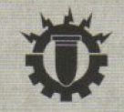

# 0135 百机队 Centurio Ordinatus

精校状态：中文行文已逐段精校，部分术语仍为暂定

分类：通用概念 / 帝国 Imperium / 机械神教 Adeptus Mechanicus

原文来源：https://www.bilibili.com/opus/1147921101848838196

原作者：帝国神选罐头

原文时间：2025年12月19日 10:00

[返回分类目录](目录.md) · [全书目录](../../目录.md)

<!-- A0135-B0001 -->
**英文原文**

The Centurio Ordinatus is a military agency of the Adeptus Mechanicus which oversees the construction, maintenance, and deployment of massive Ordinatus engines.

<!-- /A0135-B0001 -->

<!-- A0135-B0002 -->

原译文

百机队是机械神教的一个军事机构，负责监督大型将军炮引擎的建造、维护和部署。

**校订译文**

百机队是机械修会的军事机构，负责大型百机战争机器的建造、维护与部署。

**校注：** Ordinatus 是超重型战争机器系列专名，原稿在不同处作百机、将军炮、命令等；本批暂统一“百机战争机器”，组织 Centurio Ordinatus 仍为百机队，待核官方30K中文。

<!-- /A0135-B0002 -->

<!-- A0135-B0003 图片 -->

<!-- A0135-B0004 -->

原译文

Symbol of the Centurio Ordinatus 百机队标志

**校订译文**

Symbol of the Centurio Ordinatus 百机队标志

<!-- /A0135-B0004 -->

<!-- A0135-B0005 -->
**英文原文**

Rather than falling under the control of specific Titan or Skitarii Legions, all Ordinatus engines instead fall under the control of the Centurio Ordinatus and its commander, the Lord of the Centurion Ordinatus. The Centurio decides where and when these machines are deployed, if at all, since many of them are so ancient they require much preparation to go to war. When not in use Ordinatus are carefully maintained and are worshiped religiously by the Cult Mechanicus. Their crews are some of the most highly trained in the military forces of the Mechanicum, and they are only deployed to the most important campaigns.

<!-- /A0135-B0005 -->

<!-- A0135-B0006 -->

原译文

所有的将军炮引擎都由百机队及其指挥官百机队领主控制，而不是由特定的泰坦或护教军团控制。百夫长决定这些机械的部署地点和时间，如果有的话，因为其中许多机械非常古老，需要大量的准备才能投入战争。当不使用时，将军炮会被精心维护，并由机械教派虔诚地崇拜。他们的乘员是机械教军事部队中训练有素的人，他们只被部署到最重要的战役中。

**校订译文**

所有百机战争机器均由百机队及其指挥官——百机队领主——统一掌管，而非隶属特定泰坦军团或护教军团。百机队决定是否部署，以及部署时间与地点；许多机器极为古老，出征前需要大量准备。不使用时，它们会受到精心维护，并被机械教派奉为圣物。操作人员是机械教军队中训练最精良的一批，只参加最重要的战役。

<!-- /A0135-B0006 -->

本篇核心术语与暂定项

以下列出本篇出现的英文原形及核心术语表用词。同形词可能指不同对象，具体词义以本篇正文和校注为准；单复数、别名和仅见于图注的名称可能尚未列入。完整候选见[术语表](../../术语表/双语术语候选.csv)。

| 英文 | 采用中文 | 状态 |
| --- | --- | --- |
| Adeptus Mechanicus | 机械修会 | 官方已核对 |
| Mechanicum | 机械教 | 暂定·历史称谓 |
| Cult Mechanicus | 机械教派 | 暂定·概念区分 |
| Skitarii | 护教军 | 暂定·官方待核 |
| Centurio Ordinatus | 百机队 | 暂定·官方待核 |
| Titan | 泰坦 | 暂定·官方待核 |
| Ancient | 旗手 | 官方已核对 |
| Ordinatus | 百机战争机器 | 暂定·官方待核 |

