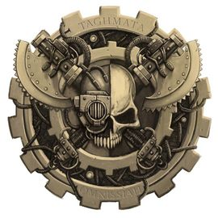

# 0136 机神禁卫军 Taghmata Omnissiah

精校状态：中文行文已逐段精校，部分术语仍为暂定

分类：通用概念 / 帝国 Imperium / 机械神教 Adeptus Mechanicus

原文来源：https://www.bilibili.com/opus/1150877641403793430

原作者：帝国神选罐头

原文时间：2025年12月27日 09:13

[返回分类目录](目录.md) · [全书目录](../../目录.md)

原篇名：机神禁卫 Taghmata Omnissiah

<!-- A0136-B0001 -->
**英文原文**

The Taghmata Omnissiah (translated from Lingua Technis as that which is divinely ordered for war) was a type of military operational force of the Adeptus Mechanicus during the Great Crusade and Horus Heresy.

<!-- /A0136-B0001 -->

<!-- A0136-B0002 -->

原译文

机神禁卫（从技术语言翻译为战争神圣修会）是大远征和荷鲁斯叛乱时期机械神教的一种军事行动部队。

**校订译文**

机神禁卫军是大远征与荷鲁斯之乱时期机械修会的一类军事作战组织。其技术之语名称 Taghmata Omnissiah 可释作“奉神意编组以赴战争者”。

**校注：** Taghmata 释义按“奉神意编组以战”处理，原译“战争神圣修会”误解 ordered。本批为保持既定译名沿用机神禁卫军，不表示帝皇禁军隶属此组织。

<!-- /A0136-B0002 -->

<!-- A0136-B0003 图片 -->

<!-- A0136-B0004 -->

原译文

Symbol of the Taghmata Omnissiah 机神禁卫标志

**校订译文**

Symbol of the Taghmata Omnissiah 机神禁卫军标志

<!-- /A0136-B0004 -->

<!-- A0136-B0005 -->
## Overview 概述

<!-- /A0136-B0005 -->

<!-- A0136-B0006 -->
**英文原文**

The "third arm" of the Mechanicum armed forces alongside the Collegia Titanica and Skitarii, the Taghmata Omnissiah was a type of feudal military organization enacted in times of war and urgency as Forge Worlds at this time did not maintain their own large standing armies. Rather, the Titan Legions were spread across the Great Crusade and sworn to a variety of other Imperial polities, while the Skitarii had their own secretive oaths to the Fabricator-General of Mars. The Taghmata represented the feudal power structure that each Forge World could muster in times of battle. This type of feudalized command was necessary, as at the time of the Heresy the Forge Worlds of the Mechanicum were each a kingdom in and of itself with their own complex hierarchies and traditions.

<!-- /A0136-B0006 -->

<!-- A0136-B0007 -->

原译文

机神禁卫是机械教武装部队的“第三武装”，与泰坦修会和护教军并肩作战，是一种在战争和紧急时期制定的封建军事组织，因为当时铸造世界没有维持自己的大型常备军。相反，泰坦军团在大远征中分散开来，并宣誓效忠于其他各种帝国组织，而护教军则对火星铸造将军有着自己的秘密誓言。禁卫代表了每个铸造世界在战斗中可以聚集的封建权力结构。这种封建化的命令是必要的，因为在叛乱时期，机械教的铸造世界本身就是一个王国，有着自己复杂的等级制度和传统。

**校订译文**

机神禁卫军与泰坦修会、护教军并列，是机械教的“第三支武装”。当时铸造世界没有自己的大型常备军：泰坦军团分散参与大远征，并向不同帝国势力宣誓效忠；护教军则对火星铸造将军负有秘密誓约。因此，战争或紧急情况下，各铸造世界会以封建征召方式组建机神禁卫军，汇集自身可动员的力量。荷鲁斯之乱时，每个铸造世界都如同独立王国，拥有复杂的等级与传统，这种封建指挥体制因而成为必要。

<!-- /A0136-B0007 -->

<!-- A0136-B0008 -->
**英文原文**

The Taghmata Omnissiah was made up of individual "Taghmas", each of which was ruled over by a Magos and their own personal armies and retainers. When the ruling power(s) of a Forge World called a Taghmata into being, it was the sworn duty of each Magos to provide such troops and assets as was demanded of them. In practice this meant a Taghmata could be greatly varying in size, dispostion, and scope. Before the Horus Heresy, they were primarily only mustered for purely defensive reasons.

<!-- /A0136-B0008 -->

<!-- A0136-B0009 -->

原译文

机神禁卫由单独的“禁卫”组成，每个人都由一个贤者和他们自己的私人军队和随从统治。当铸造世界的统治力量称之为禁卫时，每个贤者都有义务提供所需的部队和资产。在实践中，这意味着禁卫的大小、处置和范围可能会有很大的不同。在荷鲁斯叛乱之前，他们主要是出于纯粹的防御原因而召集的。

**校订译文**

机神禁卫军由各个 Taghma 构成；每个 Taghma 由一位贤者及其私军、随从组成。铸造世界的统治者下令征召时，各贤者有义务按要求提供兵力和资源。因此，整支军队的规模、配置与任务范围可能相差极大。荷鲁斯之乱以前，它们主要为防御目的而集结。

<!-- /A0136-B0009 -->

<!-- A0136-B0010 -->
**英文原文**

Once mobilized, a Taghmata included militant Tech-Priests, Cybernetica, Knights, Combat Servitors, Thallax, Myrmidons, Tech-Thralls, Ordinatus engines, and a wide variety of other miscellaneous forces at a Forge World's disposal. The Taghma controlled directly by the ruling Archmagos was known as the Prime Taghma, while those below it in rank were known as Lesser Taghma.

<!-- /A0136-B0010 -->

<!-- A0136-B0011 -->

原译文

一旦动员起来，禁卫包括激进的技术神甫、智控机兵、骑士、战斗机仆、死隶、辅军精锐、技术奴工、将军炮引擎，以及铸造世界可支配的各种其他杂项部队。由执政的大贤者直接控制的禁卫被称为禁卫之首，而级别低于它的人被称为低级禁卫。

**校订译文**

动员完成后，机神禁卫军可包含战斗技术祭司、智控机兵、骑士、战斗机仆、死隶战兵、辅军精锐、技术奴工、百机战争机器，以及铸造世界能调动的其他各种力量。统治大贤者直属的 Taghma 称为主军，其余较低等级的称为次军。

<!-- /A0136-B0011 -->

<!-- A0136-B0012 -->
**英文原文**

Cult Mechanicus Battle Congregations, or Covenants, may be organized by Tech-Priests to lead portions of the Taghmata Omnissiah.

<!-- /A0136-B0012 -->

<!-- A0136-B0013 -->

原译文

技术神甫可能会组织机械教派战斗修会或圣约，以领导机神禁卫的部分成员。

**校订译文**

技术祭司也可组织机械教派战斗集群，亦称圣约，统率机神禁卫军的一部分力量。

<!-- /A0136-B0013 -->

<!-- A0136-B0014 -->
## Organization 组织

<!-- /A0136-B0014 -->

<!-- A0136-B0015 -->
**英文原文**

Military forces and organizations that fall under the purview of the Taghmata Omnissiah include:

<!-- /A0136-B0015 -->

<!-- A0136-B0016 -->

原译文

隶属机神禁卫管辖的军事部队和组织包括：

**校订译文**

隶属机神禁卫军管辖的军事部队和组织包括：

<!-- /A0136-B0016 -->

<!-- A0136-B0017 -->

原译文

Magos Militant 军务贤者

**校订译文**

Magos Militant 军务贤者

<!-- /A0136-B0017 -->

<!-- A0136-B0018 -->

原译文

Legio Cybernetica 智控军团

**校订译文**

Legio Cybernetica 智控军团

<!-- /A0136-B0018 -->

<!-- A0136-B0019 -->

原译文

Knight Houses 骑士家族

**校订译文**

Knight Houses 骑士家族

<!-- /A0136-B0019 -->

<!-- A0136-B0020 -->

原译文

Centurio Ordinatus 百机队

**校订译文**

Centurio Ordinatus 百机队

<!-- /A0136-B0020 -->

<!-- A0136-B0021 -->

原译文

Ordo Reductor 源还修会

**校订译文**

Ordo Reductor 源还修会

<!-- /A0136-B0021 -->

<!-- A0136-B0022 -->

原译文

Auxilia Myrmidon 辅军精锐

**校订译文**

Auxilia Myrmidon 辅军精锐

<!-- /A0136-B0022 -->

<!-- A0136-B0023 -->
**英文原文**

Autokrator - Ground armor (including the Krios and Triaros), mobile artillery, and pioneer units.

<!-- /A0136-B0023 -->

<!-- A0136-B0024 -->

原译文

统御之主 - 地面装甲（包括克里奥斯和特里亚罗斯）、机动火炮和先锋部队。

**校订译文**

统御之主 - 地面装甲（包括克里奥斯和特里亚罗斯）、机动火炮和先锋部队。

<!-- /A0136-B0024 -->

<!-- A0136-B0025 -->
**英文原文**

Macrotechnia - Included Enginseers and Tech-Thralls

<!-- /A0136-B0025 -->

<!-- A0136-B0026 -->

原译文

技术宏枝 - 包括工造士和技术奴工

**校订译文**

技术宏枝 - 包括工造士和技术奴工

<!-- /A0136-B0026 -->

<!-- A0136-B0027 -->
**英文原文**

Munitoria Logis - Providers of wargear, equipment, Lexmechanics, and Servitors

<!-- /A0136-B0027 -->

<!-- A0136-B0028 -->

原译文

辅军逻辑士 - 战争装备、装备、思律机僧和机仆

**校订译文**

军需逻辑部——提供武器装备、思律机僧及机仆。

<!-- /A0136-B0028 -->

<!-- A0136-B0029 -->
**英文原文**

Lacrymaerta - Included indentured servants

<!-- /A0136-B0029 -->

<!-- A0136-B0030 -->

原译文

泪漫者 - 包括契约仆人

**校订译文**

泪漫者 - 包括契约仆人

<!-- /A0136-B0030 -->

<!-- A0136-B0031 -->
**英文原文**

Malagra - Enforcers of the Synod of Mars.

<!-- /A0136-B0031 -->

<!-- A0136-B0032 -->

原译文

马拉格拉 - 火星议会的执法者。

**校订译文**

马拉格拉 - 火星议会的执法者。

<!-- /A0136-B0032 -->

本篇核心术语与暂定项

以下列出本篇出现的英文原形及核心术语表用词。同形词可能指不同对象，具体词义以本篇正文和校注为准；单复数、别名和仅见于图注的名称可能尚未列入。完整候选见[术语表](../../术语表/双语术语候选.csv)。

| 英文 | 采用中文 | 状态 |
| --- | --- | --- |
| Adeptus Mechanicus | 机械修会 | 官方已核对 |
| Horus Heresy | 荷鲁斯之乱 | 官方已核对 |
| Mechanicum | 机械教 | 暂定·历史称谓 |
| Cult Mechanicus | 机械教派 | 暂定·概念区分 |
| Equipment | 装备 | 编辑用语已统一 |
| Forge World | 铸造世界 | 暂定·官方待核 |
| Great Crusade | 大远征 | 暂定·官方待核 |
| Horus | 荷鲁斯 | 暂定·官方待核 |
| Collegia Titanica | 泰坦修会 | 暂定·官方待核 |
| Battle Congregations | 战斗集群 | 暂定·官方待核 |
| Skitarii | 护教军 | 暂定·官方待核 |
| Enforcers | 地方执法者 | 暂定·官方待核 |
| Taghmata Omnissiah | 机神禁卫军 | 暂定·官方待核 |
| Omnissiah | 欧姆尼赛亚 | 暂定·官方待核 |
| Mars | 火星 | 暂定·官方待核 |
| Titan | 泰坦 | 暂定·官方待核 |
| Tech | 技术语 | 暂定·官方待核 |
| Fabricator-General | 铸造将军 | 暂定·官方待核 |
| Logis | 逻辑士 | 暂定·官方待核 |
| Ordinatus | 百机战争机器 | 暂定·官方待核 |
| Thallax | 死隶战兵 | 暂定·官方待核 |
| Tech-Thralls | 技术奴工 | 暂定·官方待核 |
| Fabricator | 铸造师 | 暂定·待核官方 |
| Titan Legions | 泰坦军团 | 暂定·官方待核 |
| Krios | 克里奥斯 | 暂定·官方待核 |
| Synod of Mars | 火星议会 | 暂定·官方待核 |

