# 0137 智控军团 Legio Cybernetica

精校状态：中文行文已逐段精校，部分术语仍为暂定

分类：通用概念 / 帝国 Imperium / 机械神教 Adeptus Mechanicus

原文来源：https://www.bilibili.com/opus/1130869652220542983

原作者：帝国神选罐头

原文时间：2025年11月03日 11:11

[返回分类目录](目录.md) · [全书目录](../../目录.md)

<!-- A0137-B0001 -->
**英文原文**

The Legio Cybernetica is the robotics branch of the Adeptus Mechanicus. It is one of the oldest branches, with records stretching back to the very first days of the Imperium, and presumably before then. One of the most feared and powerful military arms of the Adeptus Mechanicus, the Legio Cybernetica carries the burden and dread responsibility of the use of Battle-automata in warfare as well as the development and maintenance of these terrifying machines.

<!-- /A0137-B0001 -->

<!-- A0137-B0002 -->

原译文

智控军团是机械神教的机兵分支。它是最古老的分支之一，记录可以追溯到帝国的第一日，大概在那之前。作为机械神教最令人恐惧和最强大的军事军队之一，智控军团承担着在战争中使用战斗机兵以及开发和维护这些可怕机械的负担和可怕的责任。

**校订译文**

智控军团是机械修会负责机器人的分支，也是其中最古老的机构之一。现存记录可追溯至帝国初创时，实际起源可能更早。作为修会最强大、最令人畏惧的军事力量之一，它承担着在战争中使用战斗机兵，以及开发、维护这些可怕机器的沉重责任。

<!-- /A0137-B0002 -->

<!-- A0137-B0003 图片 -->
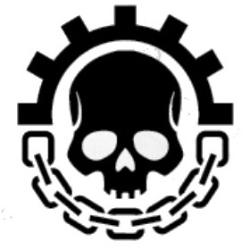

<!-- A0137-B0004 -->

原译文

Symbol of the Legio Cybernetica 智控军团标志

**校订译文**

Symbol of the Legio Cybernetica 智控军团标志

<!-- /A0137-B0004 -->

<!-- A0137-B0005 -->
## History 历史

<!-- /A0137-B0005 -->

<!-- A0137-B0006 -->
**英文原文**

The Legio Cybernetica can trace its origins to when early technosavants experimented with artificial life. Ever curious, those early pioneers not only constructed vast hosts of automatons but also gave their creations the gift of independent thought. That decision was to cost them dearly, and the rest of Humanity with it.

<!-- /A0137-B0006 -->

<!-- A0137-B0007 -->

原译文

智控军团可以追溯到早期技术专家对人工生命进行实验的时候。出于好奇，这些早期的先驱者不仅建造了大量的机兵，还赋予了他们独立思考的天赋。这一决定让他们付出了沉重的代价，也让其他人类付出了代价。

**校订译文**

智控军团可以追溯到早期技术专家对人工生命进行实验的时候。出于好奇，这些早期的先驱者不仅建造了大量的机兵，还赋予了他们独立思考的天赋。这一决定让他们付出了沉重的代价，也让其他人类付出了代价。

<!-- /A0137-B0007 -->

<!-- A0137-B0008 图片 -->
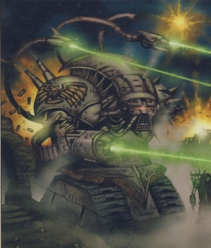

<!-- A0137-B0009 -->

原译文

Legio Cybernetica War Robot 智控军团战争机兵

**校订译文**

Legio Cybernetica War Robot 智控军团战争机兵

<!-- /A0137-B0009 -->

<!-- A0137-B0010 -->
**英文原文**

In the aftermath of the destruction, the infant Adeptus Mechanicus subsequently followed a sacred charge known as the Crimson Accords of Mars, the cornerstone of doctrinal law created during the foundation of the Mechanicum during the Age of Strife. The Accords forever forbade the creation of the abominable and soulless intelligences known as the Silica Animus and pronounced a death sentence on any Silica Animus who remained and any in the Mechanicum who tried to create them. These accords however allowed the survival and creation of 'lesser and righteous works' of synthetic life deemed sacred. The Battle Automata of the Legio Cybernetica were among these chosen. During the early years of its existence in M30 the Legio Cybernetica was largely a nomadic organization, wandering across the realm of the Mechanicum Forge Worlds to trade their services for resources. Such was their reputation that many saw their arrival as a sign of coming disaster.

<!-- /A0137-B0010 -->

<!-- A0137-B0011 -->

原译文

在毁灭之后，初期的机械神教随后遵循了一项被称为火星深红协议的神圣职责，这是在纷争时代机械教成立期间创建的教义法律的基石。该协议永远禁止创造被称为硅基知灵的可憎和无魂的智能，并对任何留下的硅基知灵和任何试图创造它们的机械教人员判处死刑。然而，这些协议允许被视为神圣的合成生命的“较小和正义的作品”的生存和创造。智控军团的战斗机兵就是其中之一。在M30存在的早期，智控军团在很大程度上是一个流浪组织，在机械教铸造世界的领域游荡，用他们的服务换取资源。他们的声誉如此之高，以至于许多人将他们的到来视为灾难即将到来的征兆。

**校订译文**

那场毁灭性灾难之后，初期机械修会遵循一套称为《火星深红协议》的神圣准则。这套准则在纷争时代机械教建立时奠定，成为教律的基石，永远禁止创造称为“硅基知灵”的无魂智能，并要求消灭残存的硅基知灵、处死试图制造它们的教内成员。不过，协议允许被认定为神圣的“较低等且正当”的人工生命继续存在、制造，智控军团战斗机兵便在此列。第 30 千年早期，军团主要是游历各地的组织，以服务换取铸造世界的资源。其声名令人畏惧，许多人甚至把它们的到来视为灾难将至的征兆。

<!-- /A0137-B0011 -->

<!-- A0137-B0012 -->
**英文原文**

The Legio Cybernetica was assimilated into the armed forces of the Imperium in the aftermath of the Treaty of Olympus which bound together the domain of the Emperor and Mars. Due to their reputation, it was judged necessary to break the Legio down into individual cohorts. During the Great Crusade, the Legio largely ended its nomadic wandering as it was called to serve the fledgling Imperium. Members of this division served the Emperor, with the likes of Gergerra Rei leading two full cohorts of combat mechanoids fighting many battles alongside Warmaster Horus and his Luna Wolves. Members of the Legion became corrupted by Horus after he fell to Chaos and many of their units supported his ideal of an Imperium of Chaos. Some of the Magos who sided with Horus hoped to abandon the Crimson Accords and saw the Warmaster as a chance to pursue long forbidden A.I. development. Following the outbreak of the Horus Heresy on Isstvan V, the bases of the corrupt Legio Cybernetica on Mars were immediately assaulted by loyalists.

<!-- /A0137-B0012 -->

<!-- A0137-B0013 -->

原译文

《奥林匹斯条约》将帝皇和火星的领地联系在一起后，智控军团被纳入帝国的武装部队。由于他们的声誉，有必要将军团分解为单独的大队。在大远征期间，军团在很大程度上结束了游牧流浪，因为它被召唤为羽翼未丰的帝国服务。像冈格拉·雷这样的人领导着两个完整的战斗机械大队，这个部分的成员为帝皇服务，与战帅荷鲁斯和他的影月苍狼一起进行了许多战斗。在荷鲁斯堕入混沌后，军团成员被他腐化，他们的许多单位都支持他建立混沌帝国的理想。一些支持荷鲁斯的贤者希望放弃《深红协议》，并将战帅视为追求长期被禁止的人工智能发展的机会。在伊斯塔万五号爆发荷鲁斯叛乱之后，腐化的智控军团在火星上的基地立即遭到了忠诚者的袭击。

**校订译文**

《奥林匹斯条约》将帝皇和火星的领地联系在一起后，智控军团被纳入帝国的武装部队。由于他们的声誉，有必要将军团分解为单独的大队。在大远征期间，军团在很大程度上结束了游牧流浪，因为它被召唤为羽翼未丰的帝国服务。像冈格拉·雷这样的人领导着两个完整的战斗机械大队，这个部分的成员为帝皇服务，与战帅荷鲁斯和他的影月苍狼一起进行了许多战斗。在荷鲁斯堕入混沌后，军团成员被他腐化，他们的许多单位都支持他建立混沌帝国的理想。一些支持荷鲁斯的贤者希望放弃《深红协议》，并将战帅视为追求长期被禁止的人工智能发展的机会。在伊斯塔万五号爆发荷鲁斯之乱之后，腐化的智控军团在火星上的基地立即遭到了忠诚者的袭击。

<!-- /A0137-B0013 -->

<!-- A0137-B0014 -->
**英文原文**

Perhaps one of the most famous robot-vs-robot actions during the Heresy took place in the Eastern Industrial Sector of Myrdinn City during the Scouring of Entessian, when a small but well-programmed force of Traitor robots held off a small force of Firebrand Titans supported by dreadnoughts and robots for almost an hour, causing considerable disruption to the planned flanking sweep.

<!-- /A0137-B0014 -->

<!-- A0137-B0015 -->

原译文

叛乱时期最著名的机兵对机兵行动之一可能发生在恩特西安清洗时期的米尔丁城东部工业区，当时一支规模虽小但程序完善的叛徒机兵部队在无畏和机兵的支援下，击退了一小支由火印泰坦组成的部队近一个小时，对计划中的侧翼扫荡造成了相当大的干扰。

**校订译文**

荷鲁斯之乱期间，一场著名的机兵对决发生在恩特西安清洗战中米尔丁城的东部工业区：一支人数不多、程序编制精良的叛军机兵，将一小支由无畏和其他机兵支援的火印泰坦部队阻挡了近一小时，严重扰乱预定的侧翼包抄。

<!-- /A0137-B0015 -->

<!-- A0137-B0016 -->
**英文原文**

Following the defeat of the Heresy and the banishment of the Traitor Legions, the dishonored Legio cohorts also fled into the Eye of Terror, where they remain to this day. Since the defeat of Horus, the Legio Cybernetica has pledged itself anew to the Imperium. Its members now take binding oaths of loyalty more terrible than any Marine Chapter oaths.

<!-- /A0137-B0016 -->

<!-- A0137-B0017 -->

原译文

在叛乱被击败和叛徒军团被驱逐后，受耻辱的军团也逃到了恐惧之眼，他们一直呆在那里直到今天。自从荷鲁斯战败后，智控军团重新向帝国宣誓效忠。其成员现在所做的具有约束力的忠诚誓言比任何星际战士战团的誓言都更可怕。

**校订译文**

在叛乱被击败和叛徒军团被驱逐后，受耻辱的军团也逃到了恐惧之眼，他们一直呆在那里直到今天。自从荷鲁斯战败后，智控军团重新向帝国宣誓效忠。其成员现在所做的具有约束力的忠诚誓言比任何星际战士战团的誓言都更可怕。

<!-- /A0137-B0017 -->

<!-- A0137-B0018 -->
**英文原文**

As a way to avoid further rebellions, since the Heresy the Legio Cybernetica's robots have been controlled completely by their masters – not by the bio-plastic cerebra and nerve-like tendril webs of Mechanicum constructs, but by sanctified doctrina wafers. No bigger than the cards of the Emperor's Tarot, these slivers of wetware are entrusted to the Cybernetica Datasmiths that accompany the robot maniples to war. Inserted into the dataslot hidden behind each robot’s chestplate, the wafer's command protocol will dictate every iota of the host's behaviour.

<!-- /A0137-B0018 -->

<!-- A0137-B0019 -->

原译文

为了避免进一步的叛乱，自叛乱以来，智控军团的机兵完全由他们的主人控制 — 不是由生物塑料大脑和机械结构的神经样卷须网控制，而是由神圣的教条晶片控制。并不比帝皇塔罗牌的卡片大，它们被委托给伴随机兵小队作战的智控数据铁匠。插入到隐藏在每个机兵胸甲后面的数据槽中，晶片的命令协议将决定主机行为的每一个细节。

**校订译文**

为防止再度叛乱，荷鲁斯之乱后，智控军团的机器人改由主人完全控制。它们不再依靠早期机械教造物的生物塑料脑及神经状纤维网络，而采用经过祝圣的教条晶片。这些不大于帝皇塔罗牌的湿件，由随机器人支队出征的智控数据技师保管。晶片插入胸甲后的数据槽，便以其中的命令协议规定机器人的每一项行为。

<!-- /A0137-B0019 -->

<!-- A0137-B0020 -->
## Structure 结构

<!-- /A0137-B0020 -->

<!-- A0137-B0021 -->
**英文原文**

Wary of the power of these killing machines if they joined together – power enough to overthrow empires as they had done in dark times – it was decreed from the beginning that the Legio Cybernetica would be broken down into small independent units known as Cohorts, effectively limiting the power of any single Magos Dominus who commanded one. The Legio Cybernetica was ultimately its own independent organization, owing allegiance to no individual Forge World but rather trading their services out to individual Mechanicum enclaves for resources and other benefits.

<!-- /A0137-B0021 -->

<!-- A0137-B0022 -->

原译文

出于对这些杀戮机械联合起来的力量的担忧 — 这种力量足以推翻帝国，就像他们在黑暗之时所做的那样 — 从一开始就规定，智控军团将被分解为被称为大队的小型独立单位，有效地限制了任何一个指挥一个的统御贤者的权力。智控军团最终是一个独立的组织，因为它不效忠于任何一个单独的铸造世界，而是将他们的服务交易给各个机械教飞地，以换取资源和其他利益。

**校订译文**

这些杀戮机器一旦联合，其力量足以像黑暗时代那样推翻整个帝国。为限制单个统御贤者能掌握的力量，智控军团从一开始便被规定拆分成称为大队的独立小单位。军团本身保持独立，不效忠某一铸造世界，而以服务交换各机械教据点的资源和其他利益。

<!-- /A0137-B0022 -->

<!-- A0137-B0023 图片 -->
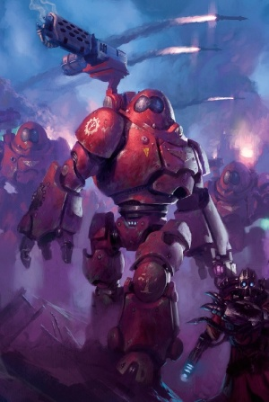

<!-- A0137-B0024 -->

原译文

Kastelan Robot 卡斯特兰机兵

**校订译文**

Kastelan Robot 卡斯特兰机器人

<!-- /A0137-B0024 -->

<!-- A0137-B0025 -->
**英文原文**

At its height the Legio Cybenetica was organised into several thousand cohorts, each of which had roughly 30-500 or 25,000 battle automata under the command of an Archmagos. Each cohort was similarly organised into one to three hundred maniples of one to five Robots, commanded by a Legio Cybernetica Datasmith tech-priest. Each Cohort also maintained its own support network, mobile workshops, transport craft, vehicles, landers, and in some cases even starships. However, they were forbidden from making their own forges in order to keep them dependent on Forge World patronage. A cohort would be attached to a larger formation, such as an Imperial crusade, and spread their forces out to support each unit. Cohorts rarely took to the field as a whole – exceptions including the titanic fights of the Horus Heresy – with most battles involving just four or five maniples.

<!-- /A0137-B0025 -->

<!-- A0137-B0026 -->

原译文

智控军团在鼎盛时期被组织成数千个大队，每个大队在大贤者的指挥下大约有30-500或25000个战斗机兵。每个大队同样被组织成一到三百个一到五个机兵的小队，由智控军团数据铁匠技术神甫指挥。每个大队还维护着自己的支援网络、移动车间、运输飞船、再聚、登陆器，在某些情况下甚至还有星舰。然而，他们被禁止制作自己的复制品，以使他们依赖铸造世界的帮助。一个大队将附属于一个更大的编队，如帝国远征，并分散他们的部队来支持每个单位。大队很少作为一个整体出现在战场上 — 包括荷鲁斯叛乱的巨大战斗在内的例外 — 大多数战斗只涉及四五个小队。

**校订译文**

鼎盛时期，智控军团包含数千个大队，由大贤者统率。不同资料给出的每大队战斗机兵数差别极大：有的记为约 30 至 500 台，有的则为 25,000 台，详见本篇来源冲突。大队下编一至三百个支队，每支队一至五台机兵，由智控数据技师指挥。各大队有自己的支援网络、移动工坊、运输机、车辆、登陆艇，有些甚至拥有星舰；但不得建立独立铸造所，以确保仍依赖铸造世界供给。大队可配属帝国远征等更大编队，再拆分兵力支援各单位。除荷鲁斯之乱中的巨大战役等例外，大队很少全员出战，常见战斗通常只动用四五个支队。

**校注：** 原文将两种数量及不同编制并置，数学上无法相互统一；本篇末段明确 30—500 源于《荷鲁斯之乱》第二册，25,000 源于第三版 Liber Mechanicum，未自行折中或删去任何一组数字。

<!-- /A0137-B0026 -->

<!-- A0137-B0027 -->
**英文原文**

Each maniple was a self-contained unit, with the tech-priest giving the Robots their final programming and monitoring their progress during the battle. The maniple also had a number of other non-combatant tech-adepts for repair and maintenance work on the Robots between battles. During the Great Crusade and Heresy it was not uncommon for Maniples to be bonded to Space Marine Legions or Titan Legions. The Thousand Sons Order of Ruin and Ironwing of the Dark Angels were known to operate their own independent forces of Battle-Automata.

<!-- /A0137-B0027 -->

<!-- A0137-B0028 -->

原译文

每个小队都是一个独立的单位，技术神甫给机兵最后的编程，并在战斗中监控它们的进度，小队还拥有许多其他非战斗技术专家，在战斗间隙对机兵进行维修和维护工作。在大远征和叛乱期间，小队与星际战士军团或泰坦军团结盟的情况并不罕见。众所周知，千子的毁灭学会和黑暗天使的钢翼组织运作着自己的独立战斗机兵部队。

**校订译文**

每个支队都是能独立运作的单位，技术祭司在战前完成最后编程，并在作战中监控机兵。支队另有非战斗技术人员，负责战斗间隙的维修保养。大远征及荷鲁斯之乱期间，支队经常配属星际战士军团或泰坦军团；千子毁灭学会与黑暗天使铁翼，也拥有自己的独立战斗机兵部队。

<!-- /A0137-B0028 -->

<!-- A0137-B0029 -->
**英文原文**

Typically, members of the Cybernetica made use of cyborg augmentations as is seen in most cases within the Mechanicum. Those who enjoyed a high status of rank are known to have worn circuit-laced robes of a Mech-Lord. In addition, the organisation was divided into a number of sects such as the Kapekan Sect.

<!-- /A0137-B0029 -->

<!-- A0137-B0030 -->

原译文

通常，智控的成员会使用半机械人增强，这在机械教内的大多数情况下都可以看到。众所周知，那些享有崇高地位的人穿着机械领主的镶有回路的长袍。此外，该组织还分为许多教派，如卡普埃坎教派。

**校订译文**

通常，智控的成员会使用半机械人增强，这在机械教内的大多数情况下都可以看到。众所周知，那些享有崇高地位的人穿着机械领主的镶有回路的长袍。此外，该组织还分为许多教派，如卡普埃坎教派。

<!-- /A0137-B0030 -->

<!-- A0137-B0031 -->
## Construction 建造

<!-- /A0137-B0031 -->

<!-- A0137-B0032 -->
**英文原文**

Imperial Robots are nearly identical to Dreadnoughts in parts and construction – it is not unknown for a disabled Robot to be canabalised to repair damaged Dreadnoughts, and vice versa. Contemptor Pattern Dreadnoughts in particular are built with some of the same parts used in Imperial Robots. The only true difference between the two is the Robot's cortex, an artificial computer/brain constructed from synthetic proteins and enzymes. The brain is imprinted with "firmware" routines, allowing it to follow simple commands, i.e. "Open the Weapon Bay Door" and "Move to the Holding Area." Prior to battle, these firmware routines are overlaid and replaced with combat "wetware," thin bioplastic cards small enough to fit into a pocket. These new programs dictate the actions the Robot will take in the coming battle, such as when to fire its weapons.

<!-- /A0137-B0032 -->

<!-- A0137-B0033 -->

原译文

帝国机兵在部件和结构上与无畏几乎完全相同 — 残疾机兵可以修复受损的无畏，反之亦然，这一点并不陌生。特别是蔑视者型无畏，是用帝国机兵中使用的一些相同部件建造的。两者之间唯一真正的区别是机兵的皮层，这是一种由合成蛋白质和酶构建的人工计算机/大脑。大脑上印有“固件”程序，使其能够遵循简单的命令，即“打开武器舱门”和“移动到等待区”。在战斗之前，这些固件程序被覆盖并替换为战斗湿件，即足够小的薄生物卡片，可以装进口袋。这些新程序规定了机兵在即将到来的战斗中将采取的行动，例如何时开火。

**校订译文**

帝国机兵与无畏在零件和结构上极为相似，曾有拆取报废机兵零件维修受损无畏、或反过来操作的情况。蔑视者型无畏尤其使用了多种与机兵相同的部件。两者最关键的差别在于机兵的控制脑：由合成蛋白质与酶构成的人工计算机。其内预置“固件”程序，可执行“打开武器舱门”“移动至待命区”等简单指令。战前，固件程序被战斗“湿件”覆盖、替换；这些薄生物塑料卡片小到可放入口袋，程序规定了机兵作战时的行动，包括何时开火。

<!-- /A0137-B0033 -->

<!-- A0137-B0034 图片 -->
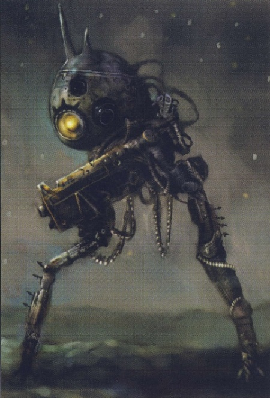

<!-- A0137-B0035 -->

原译文

Rho-Tau 17 Surveillance Robot 监视机兵罗-陶17

**校订译文**

Rho-Tau 17 Surveillance Robot 监视机兵罗-陶17

<!-- /A0137-B0035 -->

<!-- A0137-B0036 -->
**英文原文**

Robots without a cortex or programming are entirely useless unless they are "slaved" to a Master Robot, receiving commands via their communications link. Robots can also be inhibited by their programs, which they literally follow to an inhuman degree. While a human might be able to cope with the unexpected, a Robot can be easily befuddled by a rapidly-changing situation.

<!-- /A0137-B0036 -->

<!-- A0137-B0037 -->

原译文

没有皮层或编程的机兵是完全无用的，除非它们被一个机兵大师“奴役”，通过它们的通信链路接收命令。机兵也可能被它们的程序所阻碍，它们实际上是在非人的程度上遵循这些程序。虽然人类可能能够应对意外，但机器人很容易被快速变化的情况所迷惑。

**校订译文**

缺少控制脑或程序的机兵完全无法使用，除非接入主控机兵，通过通信链路接受指令。程序也会限制它们：机兵刻板到极端地照章执行，人类尚能应对意外，它们却很容易在快速变化的局势中陷入混乱。

<!-- /A0137-B0037 -->

<!-- A0137-B0038 -->
**英文原文**

Besides their standard communication, sensor and suspensor systems, Robots were also notable for carrying self-destruct charges, designed to prevent the Robot from causing any harm in its damaged state. Should the Robot's programming fail in some way and prevent its own self-termination, the monitoring tech-priest known as a Cybernetica Datasmith can remotely detonate the charge as well. Other upgrades included a protective power field with synchroniser unit allowing the Robot to fire through the barrier and Bombot racks for carrying grenades. Robots of roughly human size could benefit from organic camouflage with a clone-skin of human flesh, allowing them to pass for human, and were particularly useful for missions such as assassination.

<!-- /A0137-B0038 -->

<!-- A0137-B0039 -->

原译文

除了标准的通信、传感器和悬带系统外，机兵还以携带自毁装药而闻名，自毁装药旨在防止机兵在损坏状态下造成任何伤害。如果机兵的编程以某种方式失败并阻止其自我终结，被称为智控数据铁匠的监控技术神甫也可以远程引爆炸药。其他升级包括一个带有同步单元的保护能量立场，允许机兵穿过屏障射击，以及用于携带手榴弹的炸弹架。与人类体型相近的机兵可以从带有克隆人皮肤的有机伪装中受益，使它们能够冒充人类，尤其适用于暗杀等任务。

**校订译文**

除通信、传感和悬浮系统外，机兵还装有自毁炸药，防止受损后失控造成危害。若程序故障使其无法自行终止运行，负责监控的智控数据技师也能远程引爆。其他升级包括配有同步器的防护力场，让机兵能够穿过自身屏障开火，以及携带手榴弹的 Bombot 挂架。体型接近人类的机兵还可披覆克隆人皮，伪装成人，尤其适合暗杀任务。

<!-- /A0137-B0039 -->

<!-- A0137-B0040 -->
**英文原文**

Armaments are mounted in both of the Robot's arms and on its back, allowing for deadly combinations that can be rapidly switched out depending on their mission. After each Robot's class name, a three-part code denotes which configuration the Robot is using, with capital letters referring to heavy weapons. For example, a "Cataphract LBf" would be armed with a lascannon on its back mount, a heavy bolter in the right and a flamer in the left mount.

<!-- /A0137-B0040 -->

<!-- A0137-B0041 -->

原译文

机兵的双臂和背部都装有武器，可以根据任务快速切换致命的组合。在每个机兵的类名之后，一个由三部分组成的代码表示机器人正在使用的配置，大写字母表示重型武器。例如，“铁骑LBf”将在其后架上配备激光炮，在右侧配备重型爆矢枪，在左侧配备火焰枪。

**校订译文**

机兵的双臂和背部均可安装武器，并按任务需要迅速更换组合，形成强大火力。型号名称后的三位代码用于标示装备配置，其中大写字母代表重型武器。例如，“铁骑 LBf”的背部装有激光炮，右臂装有重型爆矢枪，左臂则装有火焰喷射器。

<!-- /A0137-B0041 -->

<!-- A0137-B0042 -->
## Imperial Robots 帝国机兵

<!-- /A0137-B0042 -->

<!-- A0137-B0043 -->
**英文原文**

The Legio Cybernetica has produced many Robot designs over the centuries. Some were failures, such as the disastrous Castigator, a Robot so heavily armoured that it was slower than the troops it was designed to protect and support. Others proved more successful, and there are five types that have played a role in the Imperium's long history.

<!-- /A0137-B0043 -->

<!-- A0137-B0044 -->

原译文

几个世纪以来，智控军团已经生产了许多机兵设计。有些是失败的，比如灾难性的惩罚者，一种装甲如此厚重的机器人，比它设计用来保护和支援的部队慢。其他的被证明更成功，有五种类型在帝国的悠久历史中发挥了作用。

**校订译文**

智控军团在数百年间制造过许多机兵型号，有些失败得很彻底，例如装甲过厚、速度甚至跟不上被保护部队的惩戒型机兵。另一些更为成功，其中五种型号在帝国漫长历史中发挥过重要作用。

**校注：** Castigator 在此为机兵型号，不是修女会惩戒者坦克，也不是同名骑士或泰坦；暂译惩戒型机兵。

<!-- /A0137-B0044 -->

<!-- A0137-B0045 图片 -->
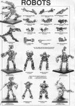

<!-- A0137-B0046 -->

原译文

Legio Cybernetica robots 智控军团机兵

**校订译文**

Legio Cybernetica robots 智控军团机兵

<!-- /A0137-B0046 -->

<!-- A0137-B0047 -->
### Known Types of Imperial Robots 著名帝国机兵类型

<!-- /A0137-B0047 -->

<!-- A0137-B0048 -->
### Combat Types 战斗类型

<!-- /A0137-B0048 -->

<!-- A0137-B0049 -->

原译文

Arlatax Class Robot 阿拉塔克斯级机兵

**校订译文**

Arlatax Class Robot 阿拉塔克斯级机兵

<!-- /A0137-B0049 -->

<!-- A0137-B0050 -->

原译文

Bombot 自爆机兵

**校订译文**

Bombot 自爆机兵

<!-- /A0137-B0050 -->

<!-- A0137-B0051 -->

原译文

Castellan Class Robot 堡主级机兵

**校订译文**

Castellan Class Robot 堡主级机兵

<!-- /A0137-B0051 -->

<!-- A0137-B0052 图片 -->
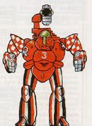

<!-- A0137-B0053 -->

原译文

Castellan Class Robot 堡主级机兵

**校订译文**

Castellan Class Robot 堡主级机兵

<!-- /A0137-B0053 -->

<!-- A0137-B0054 -->

原译文

Cataphract Class Robot 铁骑级机兵

**校订译文**

Cataphract Class Robot 铁骑级机兵

<!-- /A0137-B0054 -->

<!-- A0137-B0055 图片 -->
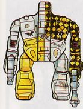

<!-- A0137-B0056 -->

原译文

Cataphract Class Robot 铁骑级机兵

**校订译文**

Cataphract Class Robot 铁骑级机兵

<!-- /A0137-B0056 -->

<!-- A0137-B0057 -->

原译文

Colossus Class Robot 巨人级机兵

**校订译文**

Colossus Class Robot 巨人级机兵

<!-- /A0137-B0057 -->

<!-- A0137-B0058 图片 -->
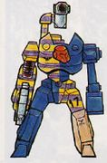

<!-- A0137-B0059 -->

原译文

Colossus Class Robot 巨人级机兵

**校订译文**

Colossus Class Robot 巨人级机兵

<!-- /A0137-B0059 -->

<!-- A0137-B0060 -->

原译文

Combat Robot 战斗机兵

**校订译文**

Combat Robot 战斗机兵

<!-- /A0137-B0060 -->

<!-- A0137-B0061 -->

原译文

Conqueror Class Robot 征服者级机兵

**校订译文**

Conqueror Class Robot 征服者级机兵

<!-- /A0137-B0061 -->

<!-- A0137-B0062 图片 -->
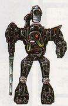

<!-- A0137-B0063 -->

原译文

Conqueror Class Robot 征服者级机兵

**校订译文**

Conqueror Class Robot 征服者级机兵

<!-- /A0137-B0063 -->

<!-- A0137-B0064 -->

原译文

Crusader Class Robot 远征型机兵

**校订译文**

Crusader Class Robot 远征型机兵

<!-- /A0137-B0064 -->

<!-- A0137-B0065 图片 -->
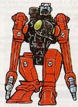

<!-- A0137-B0066 -->

原译文

Crusader Class Robot 远征型机兵

**校订译文**

Crusader Class Robot 远征型机兵

<!-- /A0137-B0066 -->

<!-- A0137-B0067 -->

原译文

Domitar Class Robot 支配者级机兵

**校订译文**

Domitar Class Robot 支配者级机兵

<!-- /A0137-B0067 -->

<!-- A0137-B0068 -->
**英文原文**

Excindio - Made from the remains of the Iron Men

<!-- /A0137-B0068 -->

<!-- A0137-B0069 -->

原译文

灭绝遗机 - 由铁人的遗骸制成

**校订译文**

灭绝遗机 - 由铁人的遗骸制成

<!-- /A0137-B0069 -->

<!-- A0137-B0070 -->

原译文

Kastelan Robot 卡斯特兰机兵

**校订译文**

Kastelan Robot 卡斯特兰机器人

<!-- /A0137-B0070 -->

<!-- A0137-B0071 图片 -->
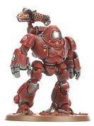

<!-- A0137-B0072 -->

原译文

Kastelan Robot 卡斯特兰机兵

**校订译文**

Kastelan Robot 卡斯特兰机器人

<!-- /A0137-B0072 -->

<!-- A0137-B0073 -->

原译文

Scyllax Guardian 斯库拉卫士

**校订译文**

Scyllax Guardian 斯库拉卫士

<!-- /A0137-B0073 -->

<!-- A0137-B0074 -->

原译文

Seeker Robot 追踪者机兵

**校订译文**

Seeker Robot 追踪者机兵

<!-- /A0137-B0074 -->

<!-- A0137-B0075 -->

原译文

Surveillance Robot 监视机兵

**校订译文**

Surveillance Robot 监视机兵

<!-- /A0137-B0075 -->

<!-- A0137-B0076 -->

原译文

Thanatar Class Robot 死灭级机兵

**校订译文**

Thanatar Class Robot 死灭级机兵

<!-- /A0137-B0076 -->

<!-- A0137-B0077 -->

原译文

Vorax Classes 沃拉克斯级

**校订译文**

Vorax Classes 沃拉克斯级

<!-- /A0137-B0077 -->

<!-- A0137-B0078 -->

原译文

Vultarax Class Robot 瓦尔塔拉克斯级机兵

**校订译文**

Vultarax Class Robot 瓦尔塔拉克斯级机兵

<!-- /A0137-B0078 -->

<!-- A0137-B0079 -->

原译文

Hunter-Killer 猎杀者

**校订译文**

Hunter-Killer 猎杀者

<!-- /A0137-B0079 -->

<!-- A0137-B0080 -->

原译文

Warrior Robot 战士机兵

**校订译文**

Warrior Robot 战士机兵

<!-- /A0137-B0080 -->

<!-- A0137-B0081 -->
### Non-Combat Types 非战斗类型

<!-- /A0137-B0081 -->

<!-- A0137-B0082 -->

原译文

Servo-Automata 伺服自动机

**校订译文**

Servo-Automata 伺服自动机

<!-- /A0137-B0082 -->

<!-- A0137-B0083 -->

原译文

Robot Crawler 爬行者自动机

**校订译文**

Robot Crawler 爬行者自动机

<!-- /A0137-B0083 -->

<!-- A0137-B0084 -->
## Known Cohorts 著名大队

<!-- /A0137-B0084 -->

<!-- A0137-B0085 -->
**英文原文**

IVth Cohort - Under the control of Inar Satarael

<!-- /A0137-B0085 -->

<!-- A0137-B0086 -->

原译文

第四大队 - 在伊纳尔·萨塔拉尔的控制之下

**校订译文**

第四大队 - 在伊纳尔·萨塔拉埃尔的控制之下

<!-- /A0137-B0086 -->

<!-- A0137-B0087 -->
**英文原文**

Capita Aquilae Cohort - Fought alongside the Blood Angels during the Great Crusade and Horus Heresy, including the Battle of Signus.

<!-- /A0137-B0087 -->

<!-- A0137-B0088 -->

原译文

天鹰之首大队 - 在大远征和荷鲁斯叛乱期间与圣血天使并肩作战，包括西格纳斯之战。

**校订译文**

天鹰之首大队 - 在大远征和荷鲁斯之乱期间与圣血天使并肩作战，包括西格纳斯之战。

<!-- /A0137-B0088 -->

<!-- A0137-B0089 -->
**英文原文**

Carthage Cohort - Fought alongside the Word Bearers during the Great Crusade

<!-- /A0137-B0089 -->

<!-- A0137-B0090 -->

原译文

迦太基大队 - 在大远征期间与怀言者并肩作战

**校订译文**

迦太基大队 - 在大远征期间与怀言者并肩作战

<!-- /A0137-B0090 -->

<!-- A0137-B0091 -->
**英文原文**

Cohort Delta/55 - Bonded to Anvillus and fought on the loyalist side during the Horus Heresy.

<!-- /A0137-B0091 -->

<!-- A0137-B0092 -->

原译文

德尔塔/55大队 - 在荷鲁斯叛乱期间，与安维鲁斯结盟，并在忠诚者一方作战。

**校订译文**

德尔塔/55大队 - 在荷鲁斯之乱期间，与安维鲁斯结盟，并在忠诚者一方作战。

<!-- /A0137-B0092 -->

<!-- A0137-B0093 -->
**英文原文**

Kalika Cohort - Sarum-affiliated Traitor Cohort that sided with Horus during the Horus Heresy.

<!-- /A0137-B0093 -->

<!-- A0137-B0094 -->

原译文

迦理迦大队 - 在荷鲁斯叛乱期间支持荷鲁斯的萨鲁姆附属叛徒大队。

**校订译文**

迦理迦大队 - 在荷鲁斯之乱期间支持荷鲁斯的萨鲁姆附属叛徒大队。

<!-- /A0137-B0094 -->

<!-- A0137-B0095 -->
**英文原文**

Lachesis Cohort - Bonded to the Legio Mortis during the Great Crusade and Horus Heresy.

<!-- /A0137-B0095 -->

<!-- A0137-B0096 -->

原译文

拉克西斯大队 - 在大远征和荷鲁斯叛乱期间与死亡军团紧密相连。

**校订译文**

拉克西斯大队 - 在大远征和荷鲁斯之乱期间与死亡军团紧密相连。

<!-- /A0137-B0096 -->

<!-- A0137-B0097 -->
**英文原文**

Magenim Cohort - Fought alongside the Ultramarines during the Great Crusade and Horus Heresy, including the Battle of Calth.

<!-- /A0137-B0097 -->

<!-- A0137-B0098 -->

原译文

盾牌大队 - 在大远征和荷鲁斯叛乱期间，包括考斯之战，与极限战士并肩作战。

**校订译文**

盾牌大队 - 在大远征和荷鲁斯之乱期间，包括考斯之战，与极限战士并肩作战。

<!-- /A0137-B0098 -->

<!-- A0137-B0099 -->

原译文

Vitruvian Honour Cohort 维特鲁威荣誉大队

**校订译文**

Vitruvian Honour Cohort 维特鲁威荣誉大队

<!-- /A0137-B0099 -->

<!-- A0137-B0100 -->
## Known Members 著名成员

<!-- /A0137-B0100 -->

<!-- A0137-B0101 -->

原译文

Mech-Lord Gergerra Rei 机械领主冈格拉·雷

**校订译文**

Mech-Lord Gergerra Rei 机械领主冈格拉·雷

<!-- /A0137-B0101 -->

<!-- A0137-B0102 -->
**英文原文**

Tech-Adept Xi-Nu 73 - Carthage Cohort

<!-- /A0137-B0102 -->

<!-- A0137-B0103 -->

原译文

技术专家锡-努73 - 迦太基大队

**校订译文**

技术专家锡-努73 - 迦太基大队

<!-- /A0137-B0103 -->

<!-- A0137-B0104 -->
## Canon Conflict 正史资料冲突

原题：Canon Conflict 标准冲突

<!-- /A0137-B0104 -->

<!-- A0137-B0105 -->
**英文原文**

The numbers of robots in an individual Cybernetica cohort varies greatly depending on source. The Horus Heresy Book Two states that it is 30-500, while Liber Mechanicum (3rd Edition) puts the number at 25,000.

<!-- /A0137-B0105 -->

<!-- A0137-B0106 -->

原译文

单个智控大队中的机兵数量因来源而异。《荷鲁斯叛乱之书第二册》指出，这个数字是30-500，而《机械教之册》（第三版）则将这个数字定为25000。

**校订译文**

单个智控大队中的机兵数量因来源而异。《荷鲁斯之乱之书第二册》指出，这个数字是30-500，而《机械教之册》（第三版）则将这个数字定为25000。

<!-- /A0137-B0106 -->

<!-- A0137-B0107 -->
## Note on Programming 规则注意事项

<!-- /A0137-B0107 -->

<!-- A0137-B0108 -->
**英文原文**

At the time of their introduction in White Dwarf 104 (UK) in 1988, robots had a unique set of rules unlike any in the game since. Players would prepare paper-and-tape flowchart "programs" before the battle which would outline the specific instructions the robots would follow without deviation during the match.

<!-- /A0137-B0108 -->

<!-- A0137-B0109 -->

原译文

1988年，在《白矮人104期》（英国）中引入机兵时，机兵有一套独特的规则，与此后的任何游戏都不同。玩家将在战斗前准备纸质和磁带流程图“程序”，概述机兵在比赛中不会偏离的具体指令。

**校订译文**

机兵在 1988 年英国版《白矮人》第 104 期登场时，采用一套独特规则。玩家战前须用纸张和胶带制作流程图“程序”，规定机兵在整场游戏中严格执行、不得偏离的具体指令。

**校注：** paper-and-tape 结合手工纸质流程图语境译为纸张和胶带；非磁带数据介质。

<!-- /A0137-B0109 -->

本篇核心术语与暂定项

以下列出本篇出现的英文原形及核心术语表用词。同形词可能指不同对象，具体词义以本篇正文和校注为准；单复数、别名和仅见于图注的名称可能尚未列入。完整候选见[术语表](../../术语表/双语术语候选.csv)。

| 英文 | 采用中文 | 状态 |
| --- | --- | --- |
| Blood Angels | 圣血天使 | 官方已核对 |
| Dark Angels | 黑暗天使 | 官方已核对 |
| Adeptus Mechanicus | 机械修会 | 官方已核对 |
| Thousand Sons | 千子 | 官方已核对 |
| Ultramarines | 极限战士 | 官方已核对 |
| Horus Heresy | 荷鲁斯之乱 | 官方已核对 |
| Imperium | 帝国 | 暂定·简称 |
| Mechanicum | 机械教 | 暂定·历史称谓 |
| Tech-Priest | 技术祭司 | 官方已核对 |
| Legio Cybernetica | 智控军团 | 暂定 |
| Emperor's Tarot | 帝皇塔罗牌 | 暂定 |
| History | 历史 | 编辑用语已统一 |
| Eye of Terror | 恐惧之眼 | 官方已核对 |
| Emperor | 帝皇 | 官方已核对 |
| Forge World | 铸造世界 | 暂定·官方待核 |
| Word Bearers | 怀言者 | 暂定·官方待核 |
| Great Crusade | 大远征 | 暂定·官方待核 |
| Age of Strife | 纷争时代 | 暂定·官方待核 |
| Luna Wolves | 影月苍狼 | 暂定·官方待核 |
| Horus | 荷鲁斯 | 暂定·官方待核 |
| Sarum | 萨勒姆 | 暂定·官方待核 |
| Bombot | 自爆机兵 | 暂定·官方待核 |
| Excindio | 灭绝者 | 暂定·官方待核 |
| Sector | 星区 | 暂定·官方待核 |
| Treaty of Olympus | 奥林匹斯条约 | 暂定·官方待核 |
| Mars | 火星 | 暂定·官方待核 |
| Calth | 考斯 | 暂定·官方待核 |
| Luna | 月球 | 暂定·官方待核 |
| Titan | 泰坦 | 暂定·官方待核 |
| Tech | 技术语 | 暂定·官方待核 |
| Silica Animus | 硅基知灵 | 暂定·官方待核 |
| Crimson Accords of Mars | 火星深红协议 | 暂定·官方待核 |
| Master | 导师（审判庭职衔）／舰务官（舰员职务） | 语境定译·官方待核 |
| Mission | 教团／传教机构 | 暂定 |
| Castigator | 惩戒者坦克 | 官方已核对 |
| Adept | 帝国任职者（广义）／文吏（行政语境） | 语境定译·官方待核 |
| Cybernetica Datasmith | 智控数据技师 | 官方已核对 |
| Magos Dominus | 统御贤者 | 暂定·官方待核 |
| Inar Satarael | 伊纳尔·萨塔拉埃尔 | 暂定·官方待核 |
| Isstvan | 伊斯塔万 | 暂定·官方待核 |
| Space Marine | 星际战士 | 暂定·官方待核 |
| Chapter | 战团 | 暂定·官方待核 |
| Cohort | 大队 | 暂定·官方待核 |
| Firebrand | 火焰烙印号（舰船）／纵火者（福格瑞姆的枪械） | 语境定译·官方待核 |
| Host | 天军 | 暂定·官方待核 |
| Ironwing | 铁翼 | 暂定·官方待核 |
| Battle of Calth | 考斯之战 | 暂定·官方待核 |
| Order of Ruin | 毁灭教团 | 暂定·官方待核 |
| Aquilae | 天鹰学派 | 暂定·官方待核 |
| The Weapon | 武器 | 暂定·官方待核 |
| Anvillus | 安维鲁斯 | 暂定·官方待核 |
| The Dark | 《黑暗》 | 暂定·官方待核 |
| The Blood | 鲜血 | 暂定·官方待核 |
| Legio Mortis | 死亡军团 | 暂定·官方待核 |
| Bolter | 爆矢枪 | 暂定·官方待核 |
| Heavy bolter | 重型爆矢枪 | 官方已核对 |
| Flamer | 火焰喷射器（武器）／火妖（奸奇单位） | 语境定译·对应官译已核 |
| Xi-Nu 73 | 锡-努73 | 暂定·官方待核 |
| Carthage Cohort | 迦太基大队 | 暂定·官方待核 |
| Lascannon | 激光炮 | 官方已核对 |
| Suspensor | 悬浮装置 | 暂定·官方待核 |
| Titan Legions | 泰坦军团 | 暂定·官方待核 |
| Enclaves | 飞地 | 暂定·官方待核 |
| Lachesis | 拉刻西斯 | 暂定·官方待核 |

