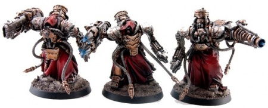

# 0138 辅军精锐 Auxilia Myrmidon

精校状态：中文行文已逐段精校，部分术语仍为暂定

分类：通用概念 / 帝国 Imperium / 机械神教 Adeptus Mechanicus

原文来源：https://www.bilibili.com/opus/1147594057264922626

原作者：帝国神选罐头

原文时间：编辑于 2025年12月18日 13:06

[返回分类目录](目录.md) · [全书目录](../../目录.md)

<!-- A0138-B0001 -->
**英文原文**

The Auxilia Myrmidon are a militant branch within the ranks of the Adeptus Mechanicus of the Imperium, known to be siege engineers and war savants.

<!-- /A0138-B0001 -->

<!-- A0138-B0002 -->

原译文

辅军精锐是帝国机械神教的等级中的一个军事分支，以攻城工程师和战争专家而闻名。

**校订译文**

辅军精锐是帝国机械修会的军事分支，成员以攻城工程和战争学识见长。

<!-- /A0138-B0002 -->

<!-- A0138-B0003 图片 -->

<!-- A0138-B0004 -->

原译文

Symbol of the Auxilia Myrmidon 辅军精锐标志

**校订译文**

Symbol of the Auxilia Myrmidon 辅军精锐标志

<!-- /A0138-B0004 -->

<!-- A0138-B0005 -->
## History 历史

<!-- /A0138-B0005 -->

<!-- A0138-B0006 -->
**英文原文**

The origins of the organization are traced to pre-Imperial times as they stood as part of the armed forces of the Mechanicum of Mars. According to legend, they were reported to have entered into the Calixis Sector during the Angevin Crusade for reasons of their own. Their duty was the protection of the Cult Mechanicus strongholds within that region of space. Their base of operations within that area is within the Lathes system, which serves as a mustering ground for the Myrmidons, who often are dispatched in small bands to reinforce the defences of the Mechanicus as well as to seek out and destroy their enemies. Whilst they are largely independent, they are linked to the Archmagi of The Lathes who serve as guarantors of their dominion.

<!-- /A0138-B0006 -->

<!-- A0138-B0007 -->

原译文

该组织的起源可以追溯到帝国时代之前，当时他们是火星机械教武装部队的一部分。据传说，他们在安茹远征期间因自身原因进入卡利西斯星区。他们的职责是保护该太空区域内的机械教派据点。他们在该地区的行动基地位于车床星系内，该星系是辅军精锐的集结地，他们经常被小规模派遣，以加强机械教的防御，并寻找和摧毁敌人。虽然他们在很大程度上是独立的，但他们与车床的大贤者有联系，后者是他们领土的担保人。

**校订译文**

该组织的起源可以追溯到帝国时代之前，当时他们是火星机械教武装部队的一部分。据传说，他们在安茹远征期间因自身原因进入卡利西斯星区。他们的职责是保护该太空区域内的机械教派据点。他们在该地区的行动基地位于车床星系内，该星系是辅军精锐的集结地，他们经常被小规模派遣，以加强机械教的防御，并寻找和摧毁敌人。虽然他们在很大程度上是独立的，但他们与车床的大贤者有联系，后者是他们领土的担保人。

<!-- /A0138-B0007 -->

<!-- A0138-B0008 -->
## Overview 概述

<!-- /A0138-B0008 -->

<!-- A0138-B0009 -->
**英文原文**

The Myrmidons are noted as being expert killers as well as weapon masters and destroyers. They are often sent at the behest of the Archmagi of Forge Worlds to accompany Explorator during their expeditions of dangerous sectors of space as well as aid in the capture of the most dangerous of Xenos specimens. Some of the members of the Auxilia Myrmidon are also sent on missions involving renegade Techpriests who are accused of the foulest of techno-heresies and are thus targeted with extreme prejudice. To aid them in their tasks, some of these Myrmidons are known to carry ancient and powerful weapons that are relics of the distant past.

<!-- /A0138-B0009 -->

<!-- A0138-B0010 -->

原译文

辅军精锐被认为是专家杀手以及武器大师和毁灭者。他们经常应铸造世界大贤者的要求被派去陪同探索者探索危险的太空区域，并协助捕获最危险的异型标本。辅军精锐的一些成员也被派往执行涉及变节技术神甫的任务，他们被指控犯有最肮脏的技术异端，因此成为格杀勿论的目标。为了帮助他们完成任务，这些辅军精锐中的一些人携带着古老而强大的武器，这些武器是遥远过去的遗物。

**校订译文**

辅军精锐是熟练的杀手、武器大师和毁灭专家。铸造世界大贤者常派他们护送探索者深入危险星域，或协助捕获最危险的异形标本。部分成员还负责追杀被控犯下严重技术异端罪行的叛离祭司，对目标采取格杀勿论的手段。为完成任务，他们中有人携带源自遥远过去的强大古代武器。

<!-- /A0138-B0010 -->

<!-- A0138-B0011 -->
**英文原文**

Members of the Auxilia Myrmidon are noted as being towering figures who possess numerous hard points for weapons of arcane design. They are great war makers with knowledge of siege craft, devastation and weaponry, such that few can match their abilities. Whilst they are few in number, they are heavily augmented with the most powerful of their ranks being nearly impossible to kill. They are a source of fear and awe amongst the worshipers of the Machine God and are cybernetically reconstructed to a level beyond that of Enginseers and precepts.

<!-- /A0138-B0011 -->

<!-- A0138-B0012 -->

原译文

辅军精锐的成员以高大的人物而闻名，他们拥有许多神秘设计武器的挂载点。他们是伟大的战争制造者，了解攻城技术、破坏和武器，很少有人能比得上他们的能力。虽然他们的人数很少，但他们的队伍中最强大的人几乎不可能被杀死。他们是万机神的崇拜者的恐惧和敬畏之源，并在智控上被重造到超越工造士和戒律者的水平。

**校订译文**

辅军精锐身躯高大，设有多个挂点，可安装设计深奥的武器。他们精通攻城、破坏与各类兵器，少有人能及。人数虽然不多，却经过大量改造，最强者几乎无法杀死。他们让万机神信众既恐惧又敬畏，机械改造程度也远超工造士与教导人员。

<!-- /A0138-B0012 -->

<!-- A0138-B0013 -->
## Ranks 等级

<!-- /A0138-B0013 -->

<!-- A0138-B0014 -->

原译文

Magos Myrmidax 精锐贤者

**校订译文**

Magos Myrmidax 精锐贤者

<!-- /A0138-B0014 -->

<!-- A0138-B0015 -->

原译文

Destructor 毁灭士

**校订译文**

Destructor 毁灭士

<!-- /A0138-B0015 -->

<!-- A0138-B0016 图片 -->

<!-- A0138-B0017 -->

原译文

Squad of Myrmidon Destructors 辅军精锐毁灭士小队

**校订译文**

Squad of Myrmidon Destructors 辅军精锐毁灭士小队

<!-- /A0138-B0017 -->

<!-- A0138-B0018 -->

原译文

Magos Militant 军务贤者

**校订译文**

Magos Militant 军务贤者

<!-- /A0138-B0018 -->

<!-- A0138-B0019 -->

原译文

Tribune / Magnus 保民官 / 伟大者

**校订译文**

Tribune / Magnus 护民官 / 伟大者

**校注：**  Tribune 此处在辅军精锐的等级列表中，沿护民官词根；不是在说帝皇禁军职衔。

<!-- /A0138-B0019 -->

<!-- A0138-B0020 -->

原译文

Centurius 百夫长

**校订译文**

Centurius 百夫长

<!-- /A0138-B0020 -->

<!-- A0138-B0021 -->

原译文

Secutor 追击士

**校订译文**

Secutor 追击士

<!-- /A0138-B0021 -->

本篇核心术语与暂定项

以下列出本篇出现的英文原形及核心术语表用词。同形词可能指不同对象，具体词义以本篇正文和校注为准；单复数、别名和仅见于图注的名称可能尚未列入。完整候选见[术语表](../../术语表/双语术语候选.csv)。

| 英文 | 采用中文 | 状态 |
| --- | --- | --- |
| Adeptus Mechanicus | 机械修会 | 官方已核对 |
| Imperium | 帝国 | 暂定·简称 |
| Mechanicum | 机械教 | 暂定·历史称谓 |
| Cult Mechanicus | 机械教派 | 暂定·概念区分 |
| Auxilia Myrmidon | 辅军精锐 | 暂定·官方待核 |
| Sector | 星区 | 暂定·官方待核 |
| Machine God | 万机神 | 暂定·官方待核 |
| Mars | 火星 | 暂定·官方待核 |
| Ancient | 旗手 | 官方已核对 |
| Destroyers | 毁灭者 | 暂定·官方待核 |
| Dominion | 主天使 | 暂定·官方待核 |
| Xenos | 异形 | 暂定·官方待核 |
| System | 星系（恒星系统） | 暂定·官方待核 |
| Calixis Sector | 卡利西斯星区 | 暂定·官方待核 |
| The Lathes | 拉特诸世界 | 暂定·官方待核 |
| Angevin Crusade | 安茹远征 | 暂定·官方待核 |

