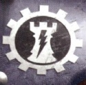

# 0140 源还修会 Ordo Reductor

精校状态：中文行文已逐段精校，部分术语仍为暂定

分类：通用概念 / 帝国 Imperium / 机械神教 Adeptus Mechanicus

原文来源：https://www.bilibili.com/opus/1147602788926095362

原作者：帝国神选罐头

原文时间：2025年12月18日 13:24

[返回分类目录](目录.md) · [全书目录](../../目录.md)

<!-- A0140-B0001 -->
**英文原文**

"Zero, zero, zero, zero..." - A Myrmidon's doleful chant of the single digit of death.

<!-- /A0140-B0001 -->

<!-- A0140-B0002 -->

原译文

“零，零，零，零……” — 辅军精锐悲伤地咏唱着死亡的个位数。

**校订译文**

“零，零，零，零……”——辅军精锐低沉哀婉地咏唱着象征死亡的单一数字。

<!-- /A0140-B0002 -->

<!-- A0140-B0003 -->
**英文原文**

The Ordo Reductor, also known as the Bringers of Blessed Ruin, is a military division of the Adeptus Mechanicus known for shock assaults, siege warfare, and blitzkrieg-style attacks. They worship the Omnissiah as Destruction Itself, as the Unmaker God.

<!-- /A0140-B0003 -->

<!-- A0140-B0004 -->

原译文

源还修会，也被称为受祝毁灭的使者，是机械神教的一个军事部门，以突击、攻城战和闪电战式袭击而闻名。他们崇拜欧姆尼赛亚作为毁灭本身，作为毁灭之神。

**校订译文**

源还修会又称“蒙福毁灭的使者”，是机械修会擅长突击、攻城和闪电战的军事分支。他们将欧姆尼赛亚崇奉为毁灭本身、拆解万物之神。

<!-- /A0140-B0004 -->

<!-- A0140-B0005 图片 -->

<!-- A0140-B0006 -->

原译文

Symbol of the Ordo Reductor 源还修会的标志

**校订译文**

Symbol of the Ordo Reductor 源还修会的标志

<!-- /A0140-B0006 -->

<!-- A0140-B0007 -->
## Overview 概述

<!-- /A0140-B0007 -->

<!-- A0140-B0008 -->
**英文原文**

Known to their fellow adherents in the Machine Cult as the 'Bringers of Blessed Ruin', the Ordo Reductor is a distinct and highly specialized military division of the Mechanicum. Theirs is the sacred role of un-maker, slaughterer and breaker; they embody the animus of the Omnissiah, its duality not as creator or embodiment of knowledge, but as destroyer and bringer of oblivion. Their given title, whose prefix was unusual for the servants of the Mechanicum, was invoked first by the great treaty between the Lords of Mars and the Emperor of Humanity, although their true and forgotten origins delve back into the dust and blood of the Age of Strife on the red world of their birth. By this order, a sub-clause of the very compact by which the alliance between the Mechanicum and Terra was sealed, was the Ordo Reductor created for the express purpose of sundering and destroying those who would stand against the Great Crusade. Where a new and terrible alien form of life was encountered that would not succumb to the Imperium's panoply of war, it would be the Biologis of the Ordo Reductor who would find a way to kill it, where a recalcitrant human techno-empire stood strong against the Great Crusade fleets, it would be the preceptors of the Ordo Reductor who observed and analysed their weapons and defences to find their weakness and, most famously, where a fortress stood seemingly impregnable, it would be the Ordo Reductor who would find a way to bring it low.

<!-- /A0140-B0008 -->

<!-- A0140-B0009 -->

原译文

在机械教派的追随者中，他们被称为“受祝毁灭的使者”，源还修会是机械教的一个独特而高度专业化的军事部门。他们扮演着毁灭者、屠杀者和破坏者的神圣角色；他们体现了欧姆尼赛亚之怒，它的二元性不是作为知识的创造者或化身，而是作为毁灭者和湮灭使者。他们的头衔，其前缀对于机械教的仆人来说是不寻常的，最初是由火星领主和人类帝皇之间的伟大协定援引的，尽管他们真实而被遗忘的起源可以追溯到他们出生的红色世界上的纷争时代的尘埃和鲜血。根据这一条令，机械教和泰拉之间同盟的契约的一个子条款是源还修会，其明确目的是分裂和摧毁那些对抗大远征的人。当遇到一种新的、可怕的异型生命形态，它不会屈服于帝国的全面战争时，源还修会的生物贤者会找到杀死它的方法，当一个顽固的人类技术帝国顽强地对抗大远征舰队时，源还修会的训导者会观察和分析他们的武器和防御，找出他们的弱点，最著名的是，当一座堡垒看似坚不可摧时，源还修会会找到一种方法让它倒下。

**校订译文**

在机械教其他信徒眼中，源还修会是“蒙福毁灭的使者”，一支独特且高度专业化的军事分支。他们承担拆解、屠戮与破坏的神圣职责，体现欧姆尼赛亚双重神性中的毁灭一面，而非创造或知识的一面。其称号中的 Ordo 前缀对机械教仆从而言十分特殊，首次见于火星领主与帝皇签订的盟约；但真正起源早已湮没，须追溯到纷争时代火星的尘土与鲜血之中。盟约附属条款正式设立源还修会，专门摧毁大远征之敌。若遭遇帝国现有武备杀不死的新型异形，修会的生物专家就负责找出致命弱点；若人类技术政权顽抗，其教导人员便分析对方武器与防御；而最为人熟知的职责，则是攻破那些看似坚不可摧的堡垒。

<!-- /A0140-B0009 -->

<!-- A0140-B0010 -->
**英文原文**

The Ordo Reductor's numbers however were always relatively few, accounting only for a handful of the most bellicose of the magos of Mars in the beginning, split from their forges and domains henceforth to serve the Great Crusade first and their feudal masters of the Mechanicum second in all things. Even as other Forge Worlds were contacted and brought into the fold, their numbers did not increase greatly and it is often said, and not without evidence, that those Tech-Priests and magos given up to the Ordo Reductor by their birth worlds or who were drawn to it of their own volition were often already seen as outcasts; either dangerously heretical in their leanings or overly-independent and perhaps psychologically unstable by their peers. However, within the fold of the Ordo Reductor were such individuals redeemed in the doctrine of the Cult of the Omnissiah and given righteous purpose in the service of the Mechanicum -as well as removed largely from the feudal politics of the Forge Worlds- and so while they became 'other' to those who remained directly under the shadow of Mars, they were not considered with the same levels of suspicion and often distrust as followed that parallel Mechanicum faction which also shared the battlefields of the Great Crusade with them, the Legio Cybernetica.

<!-- /A0140-B0010 -->

<!-- A0140-B0011 -->

原译文

然而，源还修会的人数总是相对较少，只占火星上最初最好战的贤者中的少数，他们从自己的铸造厂和领地分离出来，首先为大远征服务，其次为机械教的封建主人服务。即使其他铸造世界被联系并纳入其中，他们的数量也没有大幅增加，人们经常说，并非没有证据，那些被他们的出生世界交给源还修会的技术神甫和贤者，或者那些自愿被吸引到那里的人，往往已经被视为被抛弃的人；要么他们的倾向是危险的异端，要么他们过于独立，可能在同辈中心理不稳定。然而，在源还修会的圈子里，这些人在欧姆尼赛亚教派的教义中得到了救赎，并被赋予了为机械教服务的正义目的，并且在很大程度上摆脱了铸造世界的封建政治，因此，虽然他们成为了那些直接处于火星阴影下的人的“另类”，但他们并没有被认为与同样与他们共享大远征战场的机械教派系 — 智控军团 — 有着同样程度的怀疑和不信任。

**校订译文**

源还修会始终人数不多，起初只有少数火星上最好战的贤者。他们脱离原有铸造所与领地，此后凡事以大远征为先，以机械教封建领主的利益为次。即使更多铸造世界加入，成员数也未明显增加。许多被母星派来或自行加入的人，本已受同侪排斥：有人思想过于接近异端，有人过分独立，或被怀疑精神不稳。加入源还修会后，他们却能在欧姆尼赛亚教义中得到救赎，获得为机械教服务的正当目标，也远离了铸造世界的封建政治。因此，直接处于火星统治下的人虽视其为异类，却不像对待同样参加大远征的智控军团那样深怀猜忌。

<!-- /A0140-B0011 -->

<!-- A0140-B0012 -->
## Forces 部队

<!-- /A0140-B0012 -->

<!-- A0140-B0013 -->

原译文

Troops 部队

**校订译文**

Troops 部队

<!-- /A0140-B0013 -->

<!-- A0140-B0014 -->

原译文

Magos Reductor 源还贤者

**校订译文**

Magos Reductor 源还贤者

<!-- /A0140-B0014 -->

<!-- A0140-B0015 -->

原译文

Thallax 死隶

**校订译文**

Thallax 死隶战兵

<!-- /A0140-B0015 -->

<!-- A0140-B0016 -->

原译文

Scyllax Guardian Class Automata 斯库拉守卫者级自动机兵

**校订译文**

Scyllax Guardian Class Automata 斯库拉守卫者级自动机兵

<!-- /A0140-B0016 -->

<!-- A0140-B0017 -->

原译文

Thanatar Class Automata 死灭级机兵

**校订译文**

Thanatar Class Automata 死灭级机兵

<!-- /A0140-B0017 -->

<!-- A0140-B0018 -->

原译文

Domitar Class Automata 支配者级机兵

**校订译文**

Domitar Class Automata 支配者级机兵

<!-- /A0140-B0018 -->

<!-- A0140-B0019 -->

原译文

Vehicles 载具

**校订译文**

Vehicles 载具

<!-- /A0140-B0019 -->

<!-- A0140-B0020 -->

原译文

Land Raiders 兰德掠袭者

**校订译文**

Land Raiders 兰德掠袭者

<!-- /A0140-B0020 -->

<!-- A0140-B0021 -->

原译文

Ordo Reductor Artillery Tank 源还修会火炮坦克

**校订译文**

Ordo Reductor Artillery Tank 源还修会火炮坦克

<!-- /A0140-B0021 -->

<!-- A0140-B0022 -->

原译文

Minotaur 米诺陶

**校订译文**

Minotaur 米诺陶

<!-- /A0140-B0022 -->

<!-- A0140-B0023 -->

原译文

Atrax Siege Walker 漏斗网蛛攻城步行者

**校订译文**

Atrax Siege Walker 漏斗网蛛攻城步行者

<!-- /A0140-B0023 -->

<!-- A0140-B0024 -->

原译文

Siege Crucible 攻城熔炉

**校订译文**

Siege Crucible 攻城熔炉

<!-- /A0140-B0024 -->

<!-- A0140-B0025 -->
## Notable Members 著名成员

<!-- /A0140-B0025 -->

<!-- A0140-B0026 -->
**英文原文**

Calleb Decima - Magos

<!-- /A0140-B0026 -->

<!-- A0140-B0027 -->

原译文

卡莱布·德奇马 - 贤者

**校订译文**

卡莱布·德西玛——贤者。

<!-- /A0140-B0027 -->

<!-- A0140-B0028 -->
**英文原文**

Hieronyma - Magos Domina

<!-- /A0140-B0028 -->

<!-- A0140-B0029 -->

原译文

希罗尼马 - 统御贤者

**校订译文**

希罗尼马 - 统御贤者

<!-- /A0140-B0029 -->

本篇核心术语与暂定项

以下列出本篇出现的英文原形及核心术语表用词。同形词可能指不同对象，具体词义以本篇正文和校注为准；单复数、别名和仅见于图注的名称可能尚未列入。完整候选见[术语表](../../术语表/双语术语候选.csv)。

| 英文 | 采用中文 | 状态 |
| --- | --- | --- |
| Adeptus Mechanicus | 机械修会 | 官方已核对 |
| Imperium | 帝国 | 暂定·简称 |
| Mechanicum | 机械教 | 暂定·历史称谓 |
| Legio Cybernetica | 智控军团 | 暂定 |
| Emperor | 帝皇 | 官方已核对 |
| Great Crusade | 大远征 | 暂定·官方待核 |
| Age of Strife | 纷争时代 | 暂定·官方待核 |
| Terra | 泰拉 | 暂定·官方待核 |
| Ordo Reductor | 源还修会 | 暂定·官方待核 |
| Omnissiah | 欧姆尼赛亚 | 暂定·官方待核 |
| Redeemed | 被救赎者 | 暂定·官方待核 |
| Mars | 火星 | 暂定·官方待核 |
| Tech | 技术语 | 暂定·官方待核 |
| Destroyer | 毁灭者 | 暂定·官方待核 |
| Reductor | 基因提取器 | 暂定·官方待核 |
| Hieronyma | 希罗尼玛 | 暂定·官方待核 |
| Zero | 零世界 | 暂定·官方待核 |
| Magos Domina | 统御贤者 | 暂定·官方待核 |
| Calleb Decima | 卡莱布·德西玛 | 暂定·官方待核 |
| The Unmaker | 毁灭者 | 暂定·官方待核 |

