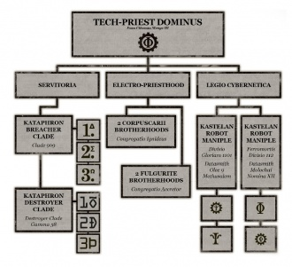

# 0145 机械教派战斗集群 Cult Mechanicus Battle Congregation

精校状态：中文行文已逐段精校，部分术语仍为暂定

分类：通用概念 / 帝国 Imperium / 机械神教 Adeptus Mechanicus

原文来源：https://www.bilibili.com/opus/1152805789616832514

原作者：帝国神选罐头

原文时间：2026年01月01日 13:55

[返回分类目录](目录.md) · [全书目录](../../目录.md)

原篇名：机械教派战斗修会 Cult Mechanicus Battle Congregation

<!-- A0145-B0001 -->
**英文原文**

Cult Mechanicus Battle Congregations are a type of military command utilized by Adeptus Mechanicus Tech-Priests.

<!-- /A0145-B0001 -->

<!-- A0145-B0002 -->

原译文

机械教派战斗修会是机械神教技术神甫使用的一种军事指挥。

**校订译文**

机械教派战斗集群，是机械修会技术祭司采用的一种军事指挥编制。

<!-- /A0145-B0002 -->

<!-- A0145-B0003 -->
## Overview 概述

<!-- /A0145-B0003 -->

<!-- A0145-B0004 -->
**英文原文**

Battle Congregations are the military force of the Tech-Priest hierarchies. The armed force typical of a Battle Congregation consists of a variety of forces from the myriad militant Mechanicum factions under the general command of a Tech-Priest Dominus. The makeup of the Congregation is heavily dependent on the strength of the Forge World and the Dominus' status in the labyrinthine hierarchy of the Mechanicum Priesthood. There are thousands of iterations.

<!-- /A0145-B0004 -->

<!-- A0145-B0005 -->

原译文

战斗修会是技术神甫等级制度的军事部队。战斗修会的典型武装部队由统御技术神甫总指挥下的无数机械教军事派系的各种部队组成。修会的构成在很大程度上取决于铸造世界的力量和统御神甫在机械教神甫迷宫般的等级制度中的地位。有数千次迭代。

**校订译文**

战斗集群是技术祭司阶层掌握的军事力量。典型集群在技术祭司主宰者统一指挥下，汇集机械教众多军事派系的部队。具体组成取决于铸造世界的实力，以及主宰者在复杂祭司等级中的地位，因而有数千种不同配置。

<!-- /A0145-B0005 -->

<!-- A0145-B0006 图片 -->

<!-- A0145-B0007 -->

原译文

A typical Cult Mechanicus Battle Congregation 典型的机械神教战斗修会

**校订译文**

A typical Cult Mechanicus Battle Congregation 典型的机械教派战斗集群

<!-- /A0145-B0007 -->

<!-- A0145-B0008 -->
**英文原文**

Nonetheless, a typical Cult Mechanicus Battle Congregation will consist of Battle-Servitors (including Kataphrons) and forces from the Legio Cybernetica, and the Electro-Priesthood

<!-- /A0145-B0008 -->

<!-- A0145-B0009 -->

原译文

尽管如此，一个典型的机械教派战斗修会将由战斗机仆（包括重型战斗机仆）和来自智控军团和电僧的部队组成

**校订译文**

一般而言，战斗集群包括卡塔弗隆等战斗机仆、智控军团部队与驭电祭司。

<!-- /A0145-B0009 -->

本篇核心术语与暂定项

以下列出本篇出现的英文原形及核心术语表用词。同形词可能指不同对象，具体词义以本篇正文和校注为准；单复数、别名和仅见于图注的名称可能尚未列入。完整候选见[术语表](../../术语表/双语术语候选.csv)。

| 英文 | 采用中文 | 状态 |
| --- | --- | --- |
| Adeptus Mechanicus | 机械修会 | 官方已核对 |
| Mechanicum | 机械教 | 暂定·历史称谓 |
| Cult Mechanicus | 机械教派 | 暂定·概念区分 |
| Tech-Priest | 技术祭司 | 官方已核对 |
| Legio Cybernetica | 智控军团 | 暂定 |
| Forge World | 铸造世界 | 暂定·官方待核 |
| Battle Congregations | 战斗集群 | 暂定·官方待核 |
| Electro-Priesthood | 驭电祭司团 | 暂定·官方待核 |
| Tech | 技术语 | 暂定·官方待核 |
| Tech-Priest Dominus | 技术祭司主宰者 | 官方已核对 |

