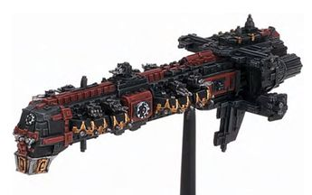

# 0146 星界君主 Basilikon Astra

精校状态：中文行文已逐段精校，部分术语仍为暂定

分类：通用概念 / 帝国 Imperium / 机械神教 Adeptus Mechanicus

原文来源：https://www.bilibili.com/opus/1143876041545089048

原作者：帝国神选罐头

原文时间：2025年12月08日 12:23

[返回分类目录](目录.md) · [全书目录](../../目录.md)

<!-- A0146-B0001 -->
**英文原文**

The void fleet of the Adeptus Mechanicus, officially known as the Basilikon Astra. The Adeptus Mechanicus maintains this fleet indepentent of the larger Imperial Navy, while also building and maintaining the ships of the wider Imperium.

<!-- /A0146-B0001 -->

<!-- A0146-B0002 -->

原译文

机械神教的虚空舰队，正式名称为星界君主。机械神教保持了这支舰队与更大的帝国海军的独立性，同时也建造和维护了大量帝国的船只。

**校订译文**

“星界君主”是机械修会虚空舰队的正式名称。修会在为整个帝国建造、维护舰船的同时，也维持着独立于帝国海军的自有舰队。

<!-- /A0146-B0002 -->

<!-- A0146-B0003 图片 -->

<!-- A0146-B0004 -->

原译文

Adeptus Mechanicus Cruiser 机械神教巡洋舰

**校订译文**

Adeptus Mechanicus Cruiser 机械修会巡洋舰

<!-- /A0146-B0004 -->

<!-- A0146-B0005 -->
## Overview 概述

<!-- /A0146-B0005 -->

<!-- A0146-B0006 -->
**英文原文**

The Cult Mechanicus believes knowledge to be the manifestation of divinity, and holds that anything embodying or containing knowledge is holy because of it. The vast foundries of the Adeptus Mechanicus are solely responsible for providing to the Imperium of Man all technical devices and machinery from mundane farm equipment to vast interstellar warships. The Basilikon Astra as a whole is officially separate from any individual Forge World, though they are still tied to them by dependence and ancient tradition.

<!-- /A0146-B0006 -->

<!-- A0146-B0007 -->

原译文

机械教派认为知识是神性的表现，并认为任何体现或包含知识的东西都是神圣的。机械教派的庞大铸造厂全权负责向人类帝国提供所有技术设备和机械，从普通的农业设备到巨大的星际战舰。星界君主作为一个整体正式与任何单独的铸造世界分开，尽管它们仍然因依赖和古老传统而与之相连。

**校订译文**

机械教派将知识视为神性的显现，认为体现或承载知识之物皆属神圣。机械修会的庞大铸造所为帝国提供从农具到星际战舰的各种设备。“星界君主”舰队整体上独立于任何单个铸造世界，但在供给关系与古老传统上，仍与这些世界紧密相连。

<!-- /A0146-B0007 -->

<!-- A0146-B0008 -->
**英文原文**

It is ordered in a strong hierarchy, but details on what form this takes are not made widely available to those who have not been so indoctrinated. Generally, more highly positioned tech-priests are expected to have more seniority and knowledge than lower ones, and are consequently more important as greater repositories of knowledge. After many decades of service, tech-priests may be elevated to the rank of Magos, from where they may begin service in one of the many sub-sect Divisios within the Cult Mechanicus. Held in high regard are the Magos Explorator. Obsessed with the Cult's Quest for Knowledge, they search high and low across the galaxy for lost Standard Template Constructs (STC) and ancient knowledge. A breed apart from regular techpriests, any Explorator or member of their team will willingly walk into forgotten catacombs, even at risk of death, for snippets of long-forgotten knowledge.

<!-- /A0146-B0008 -->

<!-- A0146-B0009 -->

原译文

它是按照一个强大的层次结构进行排序的，但关于它采取什么形式的细节并没有广泛提供给那些没有受过这种教育的人。一般来说，职位较高的技术神甫比职位较低的更有资历和知识，因此作为知识更为渊博者，他们更重要。经过几十年的服役，技术神甫可能会被提升到贤者的级别，从那里他们可以开始在机械教派内的许多分支之一服务。备受推崇的是探索贤者。他们痴迷于教派对知识的追求，在银河系中四处寻找丢失的标准模板构造（STC）和古代知识。除了常规的技术神甫，任何探索者或他们的团队成员都愿意走进被遗忘的地下墓穴，即使有死亡的风险，寻找被遗忘已久的知识片段。

**校订译文**

机械教体系等级森严，具体结构通常不向未入门者公开。高阶技术祭司通常资历更深、学识更多，作为知识载体也被视为更重要。服役数十年后，祭司可能晋升贤者，进入教派下属的众多分部之一。探索贤者尤其备受尊重，执著于追寻知识，在银河各地搜寻失落 STC 与古代学问。他们有别于普通祭司；为了几片早已遗忘的知识碎屑，探索者及其团队成员也愿冒死进入废弃地下墓穴。

<!-- /A0146-B0009 -->

<!-- A0146-B0010 -->
**英文原文**

Toward this end the Adeptus Mechanicus have at their disposal a large fleet of starships. Because the Quest for Knowledge can involve long, ardurous forays into unexplored space, it is important that they be heavily armed and armored. This is not only for their own protection from those who covet their technology but to engage in combat when necessary to secure vital data or artefacts that may prove crucial to the Quest. Though the total number of ships the Adeptus Mechanicus has at its disposal dispersed among its many forge worlds is far outnumbered by that of the Imperial Navy, it goes without saying that those responsible for all starship construction reserve for themselves among the most powerful and best-equipped warships encountered anywhere in the Imperium.

<!-- /A0146-B0010 -->

<!-- A0146-B0011 -->

原译文

为此，机械神教拥有一支庞大的星舰舰队。因为对知识的探索可能涉及对未探索空域的长期、艰苦的探索，所以他们必须全副武装和装甲。这不仅是为了保护他们自己免受那些觊觎他们技术的人的攻击，也是为了在必要时参与战斗，以保护可能对任务至关重要的重要数据或造物。尽管机械神教在其众多铸造世界中可支配的船只总数远远超过了帝国海军，但毫无疑问，那些负责所有星际飞船建造的人为自己保留了帝国中任何地方遇到的最强大、装备最好的战舰。

**校订译文**

为此，机械修会拥有庞大星舰队，足以长期深入未知空间。舰只武装与装甲强大，既防范觊觎技术的敌人，也可通过战斗夺取关键资料和造物。各铸造世界舰只总量虽远少于帝国海军，掌握星舰建造技术的机械修会，却会为自己保留帝国最强大、装备最精良的一批战舰。

<!-- /A0146-B0011 -->

<!-- A0146-B0012 -->
## Personnel 人员

<!-- /A0146-B0012 -->

<!-- A0146-B0013 -->
**英文原文**

Menial crew members aboard Basilikon Astra ships include the Navatoi, cyborgs outfitted for void-warfare. These low-grade crew members can be armed with low-yield plasma carbines which could be discharged more or less safely aboard a starship when performing minor boarding actions. They are typically lead by a navatos-alpha during these actions when boarding small or low-threat vessels.

<!-- /A0146-B0013 -->

<!-- A0146-B0014 -->

原译文

星界君主船上的卑微船员包括航行者，这是一种为虚空战而配置的半机械人。这些低级船员可以配备低产量的等离子卡宾枪，在执行较小的跳帮行动时，这些可以或多或少地安全地放到星舰上。在跳帮小型或低威胁战舰的这些行动中，他们通常由航行者阿尔法领导。

**校订译文**

舰队基层人员包括航行者：专为虚空战争改造的半机械舰员。他们可装备低威力等离子卡宾枪，在小规模跳帮行动中较安全地于舰内开火。登上小型或威胁较低的船只时，通常由一名航行者阿尔法率领。

**校注：** low-yield 指武器能量或威力较低，不是产量低；discharged 指开火，并非把武器放到船上。Navatoi 舰员不与 Navigator 导航员混同。

<!-- /A0146-B0014 -->

<!-- A0146-B0015 -->
## Fleet Composition 舰队组成

<!-- /A0146-B0015 -->

<!-- A0146-B0016 -->
**英文原文**

The fleets of the Adeptus Mechanicus are composed of types of vessel found in other Imperial fleets as well as more unique vessels, such as the near legendary Ark Mechanicus. A Mechanicus fleet is usually led by an Archmagos Explorator or Archmagos Veneratus.

<!-- /A0146-B0016 -->

<!-- A0146-B0017 -->

原译文

机械神教的舰队由其他帝国舰队中的战舰类型以及更独特的战舰组成，如近乎传奇的机械方舟。机械教舰队通常由探索大贤者或尊崇大贤者领导。

**校订译文**

机械修会的舰队由其他帝国舰队中的战舰类型以及更独特的战舰组成，如近乎传奇的机械方舟。机械教舰队通常由探索大贤者或尊崇大贤者领导。

<!-- /A0146-B0017 -->

本篇核心术语与暂定项

以下列出本篇出现的英文原形及核心术语表用词。同形词可能指不同对象，具体词义以本篇正文和校注为准；单复数、别名和仅见于图注的名称可能尚未列入。完整候选见[术语表](../../术语表/双语术语候选.csv)。

| 英文 | 采用中文 | 状态 |
| --- | --- | --- |
| Adeptus Mechanicus | 机械修会 | 官方已核对 |
| Imperium of Man | 人类帝国 | 官方已核对 |
| Imperium | 帝国 | 暂定·简称 |
| Imperial Navy | 帝国海军 | 暂定 |
| Cult Mechanicus | 机械教派 | 暂定·概念区分 |
| Equipment | 装备 | 编辑用语已统一 |
| Forge World | 铸造世界 | 暂定·官方待核 |
| Ark Mechanicus | 机械方舟 | 暂定·官方待核 |
| STC | 标准建造模板 | 暂定·官方待核 |
| Tech | 技术语 | 暂定·官方待核 |
| Ancient | 旗手 | 官方已核对 |
| Basilikon Astra | 星界君主舰队 | 暂定·官方待核 |
| sub-sect | 分教派 | 暂定·官方待核 |

