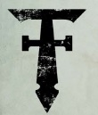
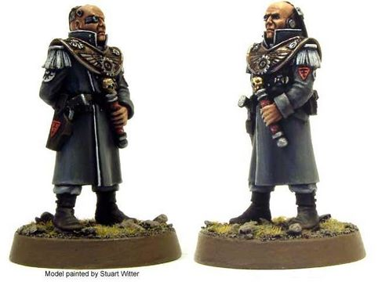
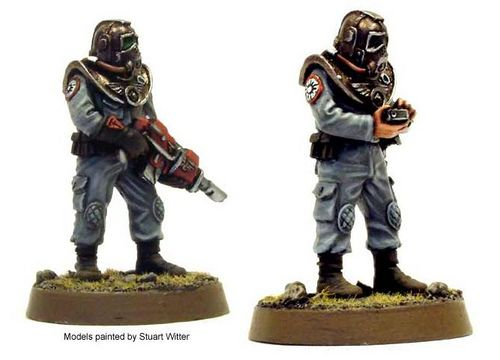

# 0148 泰坦修会 Collegia Titanica

精校状态：中文行文已逐段精校，部分术语仍为暂定

分类：通用概念 / 帝国 Imperium / 机械神教 Adeptus Mechanicus / 泰坦修会 Collegia Titanica

原文来源：https://www.bilibili.com/opus/1126745650350784537

原作者：帝国神选罐头

原文时间：编辑于 2025年10月26日 15:43

[返回分类目录](目录.md) · [全书目录](../../目录.md)

<!-- A0148-B0001 -->
**英文原文**

The Collegia Titanica is the section of the Adeptus Mechanicus that includes the Imperial Titans, the colossal god-machines. The Collegia is also known as the "Adeptus Titanicus" (a contraction of "Adeptus Mechanicus Collegia Titanica")

<!-- /A0148-B0001 -->

<!-- A0148-B0002 -->

原译文

泰坦修会是机械神教的一部分，其中包括帝国泰坦，巨大的神之机械。修会也被称为“泰坦修会”（机械神教泰坦修会的缩写）

**校订译文**

泰坦修会是机械修会下属、掌管帝国泰坦这些巨大神之机械的机构。它也称 Adeptus Titanicus，源自 Adeptus Mechanicus Collegia Titanica 的缩称。

<!-- /A0148-B0002 -->

<!-- A0148-B0003 图片 -->

<!-- A0148-B0004 -->

原译文

Collegia Titanica symbol 泰坦修会标志

**校订译文**

Collegia Titanica symbol 泰坦修会标志

<!-- /A0148-B0004 -->

<!-- A0148-B0005 -->
**英文原文**

Parent Agency:Adeptus Mechanicus

<!-- /A0148-B0005 -->

<!-- A0148-B0006 -->

原译文

隶属机构：机械神教

**校订译文**

隶属机构：机械修会

<!-- /A0148-B0006 -->

<!-- A0148-B0007 -->
**英文原文**

Headquarters:Various Forge Worlds

<!-- /A0148-B0007 -->

<!-- A0148-B0008 -->

原译文

总部：各个铸造世界

**校订译文**

总部：各个铸造世界

<!-- /A0148-B0008 -->

<!-- A0148-B0009 -->
**英文原文**

Leaders:Various Grand Masters

<!-- /A0148-B0009 -->

<!-- A0148-B0010 -->

原译文

领袖：各个大导师

**校订译文**

领袖：各个大导师

<!-- /A0148-B0010 -->

<!-- A0148-B0011 -->
**英文原文**

Armed Forces:Titan Legions, Secutarii

<!-- /A0148-B0011 -->

<!-- A0148-B0012 -->

原译文

武装部队：泰坦军团，泰坦禁卫

**校订译文**

武装部队：泰坦军团，泰坦禁卫

<!-- /A0148-B0012 -->

<!-- A0148-B0013 -->
**英文原文**

Established:Age of Strife

<!-- /A0148-B0013 -->

<!-- A0148-B0014 -->

原译文

建立：纷争时代

**校订译文**

建立：纷争时代

<!-- /A0148-B0014 -->

<!-- A0148-B0015 -->
## History 历史

<!-- /A0148-B0015 -->

<!-- A0148-B0016 -->
**英文原文**

The Collegia Titanica was formed before the Age of the Imperium, during the Age of Strife. It is thought that the first Titans were created during a terrible war on Mars against a debased caste of cabalistic heretics dubbed the Cy-Carnivora. Vast swathes of the Red Planet had fallen to the Cy-Carnivora Mekwrights, and it took the creation of Three Titan Orders to annihilate them. After defeating the Cy-Carnivora and other horrors of Old Night from the Red Planet, the Titan Legions became guardians of various Forges. It was during this time that they grew and took on their own unique characteristics and traits.

<!-- /A0148-B0016 -->

<!-- A0148-B0017 -->

原译文

泰坦修会成立于帝国时代之前的纷争时代。人们认为，第一批泰坦是在火星上与被称为科技食肉者的堕落种族神秘异端进行的一场可怕的战争中创造的。这颗红色行星的大片地区已经落入科技食肉者技术工匠手中，三个泰坦军团修会才将其消灭。在击败了来自红色行星的科技食肉者和其他旧夜的恐怖之后，泰坦军团成为了各个铸造厂的守护者。正是在这段时间里，他们成长并展现出自己独特的特点和特征。

**校订译文**

泰坦修会成立于帝国时代以前的纷争时代。据信，最早的泰坦诞生于火星对抗一群堕落秘教异端——科技食肉者——的惨烈战争。当时，科技食肉者的机械工匠已控制火星大片地区，直至三大泰坦修会建立，才被歼灭。扫除这些异端及旧夜遗留的其他恐怖后，各泰坦军团成为铸造所守卫，在此期间壮大，并形成各自的特色与传统。

<!-- /A0148-B0017 -->

<!-- A0148-B0018 -->
**英文原文**

After the Treaty of Olympus, the mighty war machines of the Collegia Titanica joined the Legio Astartes and Imperial Army in the Great Crusade to conquer much of the Galaxy. As this new Imperium expanded, the Adeptus Mechanicus took many worlds for themselves. These planets were settled and converted into Forge Worlds, and became the bases of new Titan Legions.

<!-- /A0148-B0018 -->

<!-- A0148-B0019 -->

原译文

《奥林匹斯条约》签订后，泰坦修会的强大战争机械加入了阿斯塔特军团和帝国军队的大远征，征服了银河系的大部分地区。随着这个新帝国的扩张，机械神教占领了许多世界。这些行星被安置并转化为铸造世界，成为新泰坦军团的基地。

**校订译文**

《奥林匹斯条约》签订后，泰坦修会的强大战争机器与阿斯塔特军团、帝国军一同投身大远征，征服银河广大地区。随着帝国扩张，机械修会取得许多世界，派人定居、改造成铸造世界，并建立新泰坦军团的基地。

<!-- /A0148-B0019 -->

<!-- A0148-B0020 -->
**英文原文**

During the Horus Heresy, part of the Collegia turned against the Imperium along with almost half of the Adeptus Mechanicus. The Traitor Titan Legions even took part in the Siege of the Imperial Palace. At the defeat of the rebellion, the rebel Titans were driven into the Eye of Terror, along with the rest of those who had sided with Horus.

<!-- /A0148-B0020 -->

<!-- A0148-B0021 -->

原译文

在荷鲁斯叛乱时期，部分修会成员与近一半的机械神教成员一起反对帝国。叛徒泰坦军团甚至参与了对皇宫的围攻。叛乱失败后，反叛的泰坦与其他支持荷鲁斯的人一起被驱入恐惧之眼。

**校订译文**

在荷鲁斯之乱时期，部分修会成员与近一半的机械修会成员一起反对帝国。叛徒泰坦军团甚至参与了对皇宫的围攻。叛乱失败后，反叛的泰坦与其他支持荷鲁斯的人一起被驱入恐惧之眼。

<!-- /A0148-B0021 -->

<!-- A0148-B0022 -->
## Organisation 组织

<!-- /A0148-B0022 -->

<!-- A0148-B0023 -->
**英文原文**

The Collegia has four divisions: Divisio Mandati, Divisio Telepathica, Divisio Investigatus, and most importantly, the Divisio Militaris which actually includes the Battle Titans. The Divisios are further divided into a number of "Legions" or "Orders": groupings of Titans such as the Fire Wasps Legion or War Griffons Legion. Each Legion is a self-contained unit headed by a high-ranking Princeps. Each Titan Legion has its own unit of Magos Autokratoris Tech-Priests who are charged with maintaining the Engines.

<!-- /A0148-B0023 -->

<!-- A0148-B0024 -->

原译文

修会有四个分部：命令分部、心灵分部、探查分部，和最重要的，军事分部实际上包括战斗泰坦。分部进一步分为许多“军团”或“修会”：泰坦军团，如火蜂军团或战争狮鹫军团。每个军团都是一个自给自足的单位，由一名高级首席领导。每个泰坦军团都有自己的独裁贤者技术神甫单位，负责维护引擎。

**校订译文**

泰坦修会分为四部：命令分部、心灵分部、探查分部，以及掌管战斗泰坦、最为重要的军事分部。各分部下辖多个军团或修会，例如火蜂军团和战争狮鹫军团。每个军团都是独立单位，由资深首席统领，并有自己的独裁贤者技术祭司团队维护泰坦。

<!-- /A0148-B0024 -->

<!-- A0148-B0025 图片 -->

<!-- A0148-B0026 -->

原译文

Titan Princeps 泰坦首席

**校订译文**

Titan Princeps 泰坦首席

<!-- /A0148-B0026 -->

<!-- A0148-B0027 -->
### Divisio Militaris 军事分部

<!-- /A0148-B0027 -->

<!-- A0148-B0028 -->
**英文原文**

The Orders or Legions of the Divisio Militaris (or more simply the Military Orders) are the main military forces of the Collegia, and each, as self-sufficient units, includes its own Princeps and Moderati, ground combat troops and support staff in addition to its Titans. Each Legion is based on its own Forge World — most Forge Worlds having one (or in some cases several) Titan Legions. Legion detachments are stationed throughout the galaxy, guarding vulnerable locations across the Imperium. Many Legions are stationed near the Eye of Terror, ready to combat their Chaotic counterparts.

<!-- /A0148-B0028 -->

<!-- A0148-B0029 -->

原译文

军事分部的修会或军团（或更简单地说是军事修会）是修会的主要军事力量，每个部队都是自给自足的单位，除了泰坦之外，还包括自己的首席和次级操作员、地面作战部队和支援人员。每个军团都基于自己的铸造世界 — 大多数铸造世界都有一个（或在某些情况下有几个）泰坦军团。军团分遣队驻扎在整个银河系，守卫着帝国中的脆弱地点。许多军团驻扎在恐惧之眼附近，准备与混沌对手作战。

**校订译文**

军事分部的修会或军团（或更简单地说是军事修会）是修会的主要军事力量，每个部队都是自给自足的单位，除了泰坦之外，还包括自己的首席和次级操作员、地面作战部队和支援人员。每个军团都基于自己的铸造世界 — 大多数铸造世界都有一个（或在某些情况下有几个）泰坦军团。军团分遣队驻扎在整个银河系，守卫着帝国中的脆弱地点。许多军团驻扎在恐惧之眼附近，准备与混沌对手作战。

<!-- /A0148-B0029 -->

<!-- A0148-B0030 图片 -->

<!-- A0148-B0031 -->

原译文

Titan Moderati 泰坦次级操作员

**校订译文**

Titan Moderati 泰坦次级操作员

<!-- /A0148-B0031 -->

<!-- A0148-B0032 -->
**英文原文**

Legion strength is typically around 50 operational engines. Battle losses can take centuries to replace, as the construction of a new Titan is a long and laborious process. The Warlord is the most commonly found class while the Imperator is by far the most formidable but an increasingly rare sight on battlefields. Though there have been rumours of a stronger class that existed during the Great Crusade (possibly the Apocalypse class). Titan Legions are deployed only in the most vital campaigns and on battlefields that will allow them the room to manoeuvre and unleash the full power of their colossal weaponry.

<!-- /A0148-B0032 -->

<!-- A0148-B0033 -->

原译文

军团的兵力通常约为50台可运行的引擎。战斗损失可能需要几个世纪才能弥补，因为建造新的泰坦是一个漫长而艰苦的过程。军阀是最常见的级别，而帝皇是迄今为止最可怕的级别，但在战场上越来越罕见。尽管有传言称，在大远征期间存在一个更强大的阶级（可能是启示录级）。泰坦军团只部署在最重要的战役和战场上，这将使他们有空间操纵和释放其巨大武器的全部力量。

**校订译文**

一个军团通常拥有约五十台可作战泰坦。建造泰坦极为漫长艰难，弥补战损可能需要数百年。军阀型最为常见，帝皇型则是最可怕、却日渐少见的一类。传闻大远征期间还存在更强大的型号，可能就是天启型。泰坦军团只参加最重要的战役，战场还须有足够空间供其机动、发挥巨型武器的全部威力。

**校注：** 此段对型号强弱、数量及罕见程度属于原条目概述，与不同时期新增型号不必强行对齐。

<!-- /A0148-B0033 -->

<!-- A0148-B0034 -->
**英文原文**

Every Titan Legion is divided into a number of Maniples, each of which is commanded by a Princeps Seniores and consists of around five Titans. There are countless Maniple variations, but the most common is known as the Axiom which consists of a Warlord Titan leader, a pair of Reavers for support, and a pack of two Warhounds for scouting.

<!-- /A0148-B0034 -->

<!-- A0148-B0035 -->

原译文

每个泰坦军团都被划分为多个支队，每个支队由一个首席长指挥，由大约五名泰坦组成。支队有无数种变体，但最常见的是公理，它由一架军阀泰坦领袖、一对用于支援的掠夺者和一组用于侦察的两只战犬组成。

**校订译文**

每个泰坦军团分为多个支队，每支队通常约五台泰坦，由一位首席长指挥。支队配置有无数变化，最常见的是“公理”编制：一台军阀领队，两台掠夺者提供支援，两台战犬负责侦察。

<!-- /A0148-B0035 -->

<!-- A0148-B0036 -->
### Divisio Mandati 命令分部

<!-- /A0148-B0036 -->

<!-- A0148-B0037 -->
**英文原文**

The Titan Orders of the Mandati are known as "Executive Orders". They travel in vast temple-spacecraft, responsible for bringing the Pax Imperia to independent human worlds. Each temple ship carries a small but potent number of the immense Emperor Titans, plus priests, regular troops, maintenance adepts and support personnel.

<!-- /A0148-B0037 -->

<!-- A0148-B0038 -->

原译文

泰坦修会命令分部被称为“行政修会”。他们乘坐巨大的圣殿飞船航行，负责将帝国和平带到独立的人类世界。每艘圣殿舰上都搭载着人数不多但力量强大的帝皇泰坦，以及牧师、正规军、维修专家和支援人员。

**校订译文**

命令分部下辖的泰坦修会称为“执行修会”。它们乘巨型圣殿舰航行，将帝国治下的和平带给尚独立的人类世界。每艘圣殿舰携带数量不多却威力巨大的帝皇级泰坦，以及教士、正规部队、维修人员和支援人员。

<!-- /A0148-B0038 -->

<!-- A0148-B0039 -->
**英文原文**

Each Emperor Titan is its own self-contained unit, carrying members of the Adeptus Arbites, the Inquisition and the Adeptus Terra. It is through this combination of persuasion and vast firepower that many worlds are brought into the fold of the Imperium.

<!-- /A0148-B0039 -->

<!-- A0148-B0040 -->

原译文

每个帝皇泰坦都是自己独立的单位，承载着法务部、宗教裁判所和中央政务部的成员。正是通过这种说服力和巨大火力的结合，许多世界被纳入了帝国的怀抱。

**校订译文**

每个帝皇泰坦都是自己独立的单位，承载着法务部、审判庭和中央政务部的成员。正是通过这种说服力和巨大火力的结合，许多世界被纳入了帝国的怀抱。

<!-- /A0148-B0040 -->

<!-- A0148-B0041 -->
**英文原文**

The elite of the Mandati's orders are known as "Missionary Orders" - they travel beyond the known areas of space, often accompanying Rogue Trader missions.

<!-- /A0148-B0041 -->

<!-- A0148-B0042 -->

原译文

命令分部的精英被称为“传教修会” - 他们旅行到已知的太空区域之外，通常伴随着行商浪人进行任务。

**校订译文**

命令分部的精英被称为“传教修会” - 他们旅行到已知的太空区域之外，通常伴随着行商浪人进行任务。

<!-- /A0148-B0042 -->

<!-- A0148-B0043 -->
### Divisio Telepathica 心灵分部

<!-- /A0148-B0043 -->

<!-- A0148-B0044 -->
**英文原文**

As a highly specialised Divisio, the Telepathica is somewhat smaller than the Mandati and Militaris Divisios. The Telepathica is responsible for the dreaded Psi-Titans. Its orders are the Telepath Orders such as the Ordo Sinister, each said to operate from a secret forge world near the heart of the Imperium.

<!-- /A0148-B0044 -->

<!-- A0148-B0045 -->

原译文

作为一个高度专业化的分部，心灵分部比命令和军事分部小一些。心灵分部负责可怕的灵能泰坦。它的修会是心灵修会，如噩兆修会，据说每个修会都在帝国中心附近的一个秘密铸造世界运作。

**校订译文**

作为一个高度专业化的分部，心灵分部比命令和军事分部小一些。心灵分部负责可怕的灵能泰坦。它的修会是心灵修会，如噩兆修会，据说每个修会都在帝国中心附近的一个秘密铸造世界运作。

<!-- /A0148-B0045 -->

<!-- A0148-B0046 -->
### Divisio Investigatus 探查分部

<!-- /A0148-B0046 -->

<!-- A0148-B0047 -->
**英文原文**

The Investigatus is the research division; its role is to construct the Titans of all the orders, and to engineer and test improvements in technology. All of the Investigatus orders are based on Mars, the capital Forge World. At times a research order takes part in battles in order to field test new designs.

<!-- /A0148-B0047 -->

<!-- A0148-B0048 -->

原译文

探查分部是研究部门；它的作用是建造所有修会的泰坦，并设计和测试技术改进。所有的探查修会都是基于火星，即首都铸造世界。有时，探查修会会参加战斗，以实地测试新设计。

**校订译文**

探查分部是研究部门；它的作用是建造所有修会的泰坦，并设计和测试技术改进。所有的探查修会都是基于火星，即首都铸造世界。有时，探查修会会参加战斗，以实地测试新设计。

<!-- /A0148-B0048 -->

<!-- A0148-B0049 -->
### Secutarii 泰坦禁卫

<!-- /A0148-B0049 -->

<!-- A0148-B0050 -->
**英文原文**

The Secutarii, also known as the Titan Guard, are an infantry force of the Collegia Titanica that accompanies its Titans into battle. These Skitarii warriors are meant to mop up survivors left in the Titans wake.

<!-- /A0148-B0050 -->

<!-- A0148-B0051 -->

原译文

泰坦禁卫，也被称为泰坦卫队，是泰坦修会的一支步兵部队，陪伴泰坦进入战斗。这些护教军战士旨在清除泰坦唤醒中留下的幸存者。

**校订译文**

泰坦禁卫又称泰坦卫队，是随泰坦出征的泰坦修会步兵。他们属于护教军，负责清剿泰坦推进后遗留的敌军幸存者。

<!-- /A0148-B0051 -->

本篇核心术语与暂定项

以下列出本篇出现的英文原形及核心术语表用词。同形词可能指不同对象，具体词义以本篇正文和校注为准；单复数、别名和仅见于图注的名称可能尚未列入。完整候选见[术语表](../../术语表/双语术语候选.csv)。

| 英文 | 采用中文 | 状态 |
| --- | --- | --- |
| Adeptus Mechanicus | 机械修会 | 官方已核对 |
| Imperial Army | 帝国军 | 暂定·官方待核 |
| Horus Heresy | 荷鲁斯之乱 | 官方已核对 |
| Inquisition | 审判庭 | 暂定 |
| Imperium | 帝国 | 暂定·简称 |
| Eye of Terror | 恐惧之眼 | 官方已核对 |
| Rogue Trader | 行商浪人 | 暂定 |
| Emperor | 帝皇 | 官方已核对 |
| Adeptus Terra | 中央政务部 | 暂定 |
| Adeptus Arbites | 法务部 | 暂定 |
| Forge World | 铸造世界 | 暂定·官方待核 |
| Great Crusade | 大远征 | 暂定·官方待核 |
| Age of Strife | 纷争时代 | 暂定·官方待核 |
| Terra | 泰拉 | 暂定·官方待核 |
| Horus | 荷鲁斯 | 暂定·官方待核 |
| Collegia Titanica | 泰坦修会 | 暂定·官方待核 |
| Skitarii | 护教军 | 暂定·官方待核 |
| Treaty of Olympus | 奥林匹斯条约 | 暂定·官方待核 |
| Age of the Imperium | 帝国时代 | 暂定·官方待核 |
| Old Night | 旧夜 | 暂定·官方待核 |
| Mars | 火星 | 暂定·官方待核 |
| Titan | 泰坦 | 暂定·官方待核 |
| Ordo Sinister | 噩兆修会 | 暂定·官方待核 |
| Tech | 技术语 | 暂定·官方待核 |
| Missionary | 传教士 | 暂定 |
| Magos Autokratoris | 独裁贤者 | 暂定·官方待核 |
| Princeps | 首席 | 暂定·官方待核 |
| Moderati | 次级操作员 | 暂定·官方待核 |
| Reavers | 劫掠者 | 官方已核对 |
| Warlord Titan | 战将级泰坦 | 官方已核对 |
| Titan Legions | 泰坦军团 | 暂定·官方待核 |

