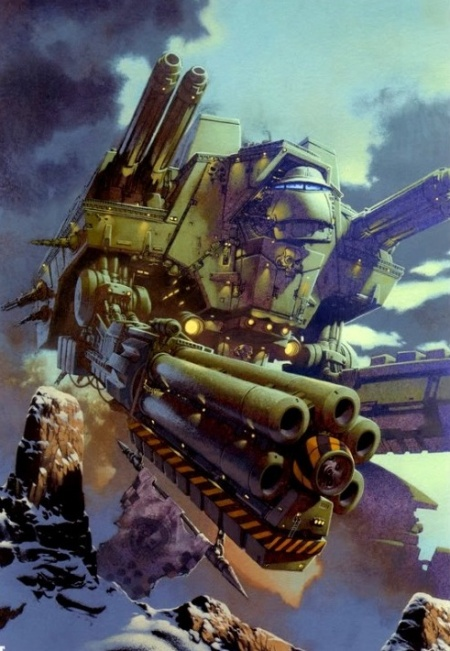
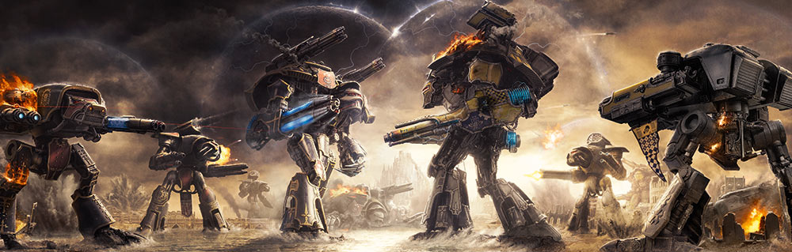
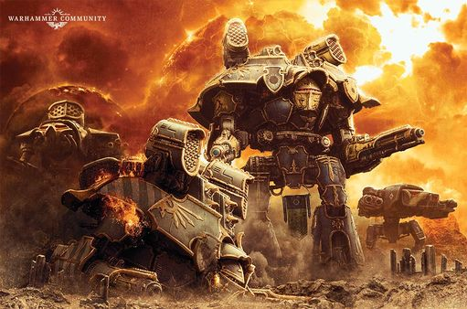
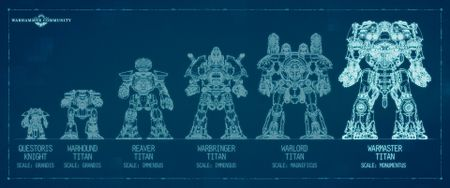
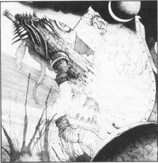

# 0149 帝国泰坦 Imperial Titan

精校状态：中文行文已逐段精校，部分术语仍为暂定

分类：通用概念 / 帝国 Imperium / 机械神教 Adeptus Mechanicus / 泰坦修会 Collegia Titanica

原文来源：https://www.bilibili.com/opus/1147593889741275144

原作者：帝国神选罐头

原文时间：2025年12月18日 12:50

[返回分类目录](目录.md) · [全书目录](../../目录.md)

<!-- A0149-B0001 -->
**英文原文**

Imperial Titans are the colossal god-machines of the Adeptus Mechanicus's Collegia Titanica.

<!-- /A0149-B0001 -->

<!-- A0149-B0002 -->

原译文

帝国泰坦是机械神教的泰坦修会的巨大神之机械。

**校订译文**

帝国泰坦是机械修会的泰坦修会的巨大神之机械。

<!-- /A0149-B0002 -->

<!-- A0149-B0003 图片 -->

<!-- A0149-B0004 -->

原译文

Warlord Titan 军阀泰坦

**校订译文**

Warlord Titan 战将级泰坦

<!-- /A0149-B0004 -->

<!-- A0149-B0005 -->
## Overview 概述

<!-- /A0149-B0005 -->

<!-- A0149-B0006 -->
**英文原文**

The Imperium's Titans are mechanical, humanoid-shaped war-machines; some Titan classes reaching up to a hundred feet in height. Their presence inspires nothing but terror - few enemies can stand against them - and only another Titan can equal their power. It is thought that the first Titans were developed on Mars during the Age of Strife in order to combat the Cy-Carnivora.

<!-- /A0149-B0006 -->

<!-- A0149-B0007 -->

原译文

帝国的泰坦是机械教的人形战争机器；一些泰坦类别的高度可达一百英尺。他们的存在只会引发恐惧 - 很少有敌人能对抗他们 - 只有另一个泰坦能与他们的力量相匹敌。据认为，第一批泰坦是在纷争时代在火星上开发的，目的是对抗科技食肉者。

**校订译文**

帝国的泰坦是机械教的人形战争机器；一些泰坦类别的高度可达一百英尺。他们的存在只会引发恐惧 - 很少有敌人能对抗他们 - 只有另一个泰坦能与他们的力量相匹敌。据认为，第一批泰坦是在纷争时代在火星上开发的，目的是对抗科技食肉者。

<!-- /A0149-B0007 -->

<!-- A0149-B0008 -->
**英文原文**

A human pilot, linked directly to the machine via a Throne Mechanicum, controls the movement of a Titan merely through thought. Titans are powered by plasma generators, as nothing else can provide the vast amount of energy required. Energy fields known as void shields are the Imperial Titan's first line of defense. The shields can absorb incoming damage until becoming overloaded. A Titan's limbs move using electrically-motivated fibre bundles which act as synthetic muscles.

<!-- /A0149-B0008 -->

<!-- A0149-B0009 -->

原译文

一名人类驾驶员通过机械王座直接与机器相连，仅通过思维控制泰坦的运动。泰坦由等离子发电机提供动力，因为没有其他东西可以提供所需的大量能量。被称为虚空盾的能量立场是帝国泰坦的第一道防线。护盾可以吸收到来的伤害，直到过载。泰坦的四肢通过电动纤维束移动，这些纤维束充当合成肌肉。

**校订译文**

人类驾驶员通过机械王座直接连接泰坦，以思维控制行动。泰坦由等离子发生器供能，因为其他能源无法满足其庞大需求。虚空盾是第一道防线，可吸收攻击，直到负荷过载；四肢则由电力驱动的纤维束带动，作用如同人工肌肉。

<!-- /A0149-B0009 -->

<!-- A0149-B0010 图片 -->

<!-- A0149-B0011 -->

原译文

Titans in battle during the Horus Heresy 荷鲁斯叛乱时期战斗中的泰坦

**校订译文**

Titans in battle during the Horus Heresy 荷鲁斯之乱时期战斗中的泰坦

<!-- /A0149-B0011 -->

<!-- A0149-B0012 图片 -->

<!-- A0149-B0013 -->
**英文原文**

Imperial Titans are transported world to world by Mechanicum-operated Conquesitus Arks and Heavy Transports and landed via Drop-vaults and Drop-Cathedrals.

<!-- /A0149-B0013 -->

<!-- A0149-B0014 -->

原译文

帝国泰坦由机械教操作的征服者方舟和重型运输机运送到世界各地，并通过空投秘库和空投大教堂降落。

**校订译文**

帝国泰坦由机械教运营的征服者方舟和重型运输舰在世界之间运送，再通过空降舱库与空降大教堂部署至地表。

<!-- /A0149-B0014 -->

<!-- A0149-B0015 -->
## Titan Classes & Variants 泰坦类别&变体

<!-- /A0149-B0015 -->

<!-- A0149-B0016 -->
**英文原文**

Titans are divided into a number of general types depending on their size and function. The Battle Titans are the most numerous and general type. Widely varying in size, they stand between 40 and 80 feet in height. Some types of Battle Titan have been built by the forces of Chaos over the years since the Heresy, or have been corrupted from their original design. These Titans are unique to the forces of the Traitor Titan Legions.

<!-- /A0149-B0016 -->

<!-- A0149-B0017 -->

原译文

泰坦根据其大小和功能分为许多常规类型。战斗泰坦是数量最多、最通用的类型。它们的大小差异很大，身高在40到80英尺之间。自叛乱以来，混沌部队已经建造了一些类型的战斗泰坦，或者已经从最初的设计中被腐化了。这些泰坦是叛徒泰坦军团所独有的。

**校订译文**

泰坦根据其大小和功能分为许多常规类型。战斗泰坦是数量最多、最通用的类型。它们的大小差异很大，身高在40到80英尺之间。自叛乱以来，混沌部队已经建造了一些类型的战斗泰坦，或者已经从最初的设计中被腐化了。这些泰坦是叛徒泰坦军团所独有的。

**校注：** 40—80 英尺为原文尺寸，且开头另写某些类型高达100英尺；泰坦尺寸跨资料差异较大，未凭记忆改成米或扩大高度。

<!-- /A0149-B0017 -->

<!-- A0149-B0018 -->
**英文原文**

Each general type of Titan is further divided into classes. The most basic class of Battle Titan is the Warlord. Finally, each class has a number of variants, determined by the weapons it mounts.

<!-- /A0149-B0018 -->

<!-- A0149-B0019 -->

原译文

每种类型的泰坦都被进一步划分为不同的类别。战斗泰坦的最基础级别是军阀。最后，每个类别都有许多变体，由其安装的武器决定。

**校订译文**

每种泰坦类型又细分为不同级别，例如战斗泰坦中的基础级别是战将级。各级别还会因搭载武器不同而分成多种变体。

<!-- /A0149-B0019 -->

<!-- A0149-B0020 图片 -->

<!-- A0149-B0021 -->

原译文

Titan size comparison 泰坦规模比较

**校订译文**

Titan size comparison 泰坦规模比较

<!-- /A0149-B0021 -->

<!-- A0149-B0022 -->
### Scout Titans 侦察泰坦

<!-- /A0149-B0022 -->

<!-- A0149-B0023 -->
### Imperial Classes 帝国类别

<!-- /A0149-B0023 -->

<!-- A0149-B0024 -->

原译文

Warhound Scout Titan 战犬侦查泰坦

**校订译文**

Warhound Scout Titan 战犬级侦察泰坦

<!-- /A0149-B0024 -->

<!-- A0149-B0025 -->

原译文

Jackal variant 豺狼变体

**校订译文**

Jackal variant 豺狼变体

<!-- /A0149-B0025 -->

<!-- A0149-B0026 -->

原译文

Mastiff variant 獒犬变体

**校订译文**

Mastiff variant 獒犬变体

<!-- /A0149-B0026 -->

<!-- A0149-B0027 -->

原译文

Wolf variant 野狼变体

**校订译文**

Wolf variant 野狼变体

<!-- /A0149-B0027 -->

<!-- A0149-B0028 -->

原译文

Rapier Scout Titan 猛禽侦察泰坦

**校订译文**

Rapier Scout Titan 刺剑侦察泰坦

<!-- /A0149-B0028 -->

<!-- A0149-B0029 -->

原译文

Dire Wolf Heavy Scout Titan 恐狼重型侦查泰坦

**校订译文**

Dire Wolf Heavy Scout Titan 恐狼重型侦察泰坦

<!-- /A0149-B0029 -->

<!-- A0149-B0030 -->
### Traitor Classes 叛徒类别

<!-- /A0149-B0030 -->

<!-- A0149-B0031 -->

原译文

Questor Scout Titan 司法官侦查泰坦

**校订译文**

Questor Scout Titan 司法官侦察泰坦

<!-- /A0149-B0031 -->

<!-- A0149-B0032 -->

原译文

Subjugator Scout Titan 镇压者侦查泰坦

**校订译文**

Subjugator Scout Titan 镇压者侦察泰坦

<!-- /A0149-B0032 -->

<!-- A0149-B0033 -->

原译文

Chaos Warhound Titan 混沌战犬泰坦

**校订译文**

Chaos Warhound Titan 混沌战犬级泰坦

<!-- /A0149-B0033 -->

<!-- A0149-B0034 -->
### Battle Titans 战斗泰坦

<!-- /A0149-B0034 -->

<!-- A0149-B0035 -->
### Imperial Classes 帝国类别

<!-- /A0149-B0035 -->

<!-- A0149-B0036 -->

原译文

Apocalypse Titan 天启泰坦

**校订译文**

Apocalypse Titan 天启泰坦

<!-- /A0149-B0036 -->

<!-- A0149-B0037 -->

原译文

Castigator 惩戒者

**校订译文**

Castigator 惩戒者坦克

**校注：** Castigator 在本篇为泰坦名，与 137 篇机兵、119 篇坦克及后续骑士型号同名；按语境区分。

<!-- /A0149-B0037 -->

<!-- A0149-B0038 -->

原译文

Komodo 科莫多

**校订译文**

Komodo 科莫多

<!-- /A0149-B0038 -->

<!-- A0149-B0039 -->

原译文

Carnivore 食肉者

**校订译文**

Carnivore 食肉者

<!-- /A0149-B0039 -->

<!-- A0149-B0040 -->

原译文

Mirage 幻影

**校订译文**

Mirage 幻影

<!-- /A0149-B0040 -->

<!-- A0149-B0041 -->

原译文

Nemesis Titan 复仇女神泰坦

**校订译文**

Nemesis Titan 复仇女神泰坦

<!-- /A0149-B0041 -->

<!-- A0149-B0042 -->

原译文

Punisher Titan 惩罚者泰坦

**校订译文**

Punisher Titan 惩罚者泰坦

<!-- /A0149-B0042 -->

<!-- A0149-B0043 -->

原译文

Executor Titan 执行者泰坦

**校订译文**

Executor Titan 执行者泰坦

<!-- /A0149-B0043 -->

<!-- A0149-B0044 -->

原译文

Reaver Battle Titan 掠夺者战斗泰坦

**校订译文**

Reaver Battle Titan 掠夺者级战斗泰坦

<!-- /A0149-B0044 -->

<!-- A0149-B0045 -->

原译文

Goth variant 哥特变体

**校订译文**

Goth variant 哥特变体

<!-- /A0149-B0045 -->

<!-- A0149-B0046 -->

原译文

Hun variant 匈变体

**校订译文**

Hun variant 匈变体

<!-- /A0149-B0046 -->

<!-- A0149-B0047 -->

原译文

Vandal variant 破坏者变体

**校订译文**

Vandal variant 汪达尔变体

<!-- /A0149-B0047 -->

<!-- A0149-B0048 -->

原译文

Warbringer Nemesis Class 战争使者报应级

**校订译文**

Warbringer Nemesis Class 战争使者型天罚级

**校注：** GW-09/GW-10第5页正式单位Warbringer Nemesis Titan官译战争使者型天罚级泰坦；本处级别名采用该官译词根。

<!-- /A0149-B0048 -->

<!-- A0149-B0049 -->

原译文

Warlord Battle Titan 军阀战斗泰坦

**校订译文**

Warlord Battle Titan 战将级战斗泰坦

<!-- /A0149-B0049 -->

<!-- A0149-B0050 -->

原译文

Death Bringer variant 死亡使者变体

**校订译文**

Death Bringer variant 死亡使者变体

<!-- /A0149-B0050 -->

<!-- A0149-B0051 -->

原译文

Eclipse variant 日蚀变体

**校订译文**

Eclipse variant 日蚀变体

<!-- /A0149-B0051 -->

<!-- A0149-B0052 -->

原译文

Nightgaunt variant 夜魇变体

**校订译文**

Nightgaunt variant 夜魇变体

<!-- /A0149-B0052 -->

<!-- A0149-B0053 -->
**英文原文**

Nemesis variant on the Warlord class considered a "fire support battle titan" or "heavy battle titan"

<!-- /A0149-B0053 -->

<!-- A0149-B0054 -->

原译文

军阀级中的复仇女神变体被认为是“火力支援战斗泰坦”或“重型战斗泰坦”

**校订译文**

战将级中的复仇女神变体被归类为“火力支援战斗泰坦”或“重型战斗泰坦”。

**校注：** 本处为Warlord内的Nemesis变体，并非独立Warbringer Nemesis Titan，暂保留现稿变体名复仇女神，明确两者不同。

<!-- /A0149-B0054 -->

<!-- A0149-B0055 -->

原译文

Psi-Titan variant 灵能泰坦变体

**校订译文**

Psi-Titan variant 灵能泰坦变体

<!-- /A0149-B0055 -->

<!-- A0149-B0056 -->

原译文

Warmaster Titan 战帅泰坦

**校订译文**

Warmaster Titan 战帅泰坦

<!-- /A0149-B0056 -->

<!-- A0149-B0057 -->

原译文

Warmaster Iconoclast Titan 战帅破像者泰坦

**校订译文**

Warmaster Iconoclast Titan 战帅破像者泰坦

<!-- /A0149-B0057 -->

<!-- A0149-B0058 -->

原译文

Siege Titan 攻城泰坦

**校订译文**

Siege Titan 攻城泰坦

<!-- /A0149-B0058 -->

<!-- A0149-B0059 -->

原译文

Warrior Titan 勇士泰坦

**校订译文**

Warrior Titan 勇士泰坦

<!-- /A0149-B0059 -->

<!-- A0149-B0060 -->
### Traitor Classes 叛徒类别

<!-- /A0149-B0060 -->

<!-- A0149-B0061 -->

原译文

Chaos Warlord Titan 混沌军阀泰坦

**校订译文**

Chaos Warlord Titan 混沌战将级泰坦

<!-- /A0149-B0061 -->

<!-- A0149-B0062 -->

原译文

Banelord 灾祸领主

**校订译文**

Banelord 灾祸领主

<!-- /A0149-B0062 -->

<!-- A0149-B0063 -->

原译文

Plaguelord 瘟疫领主

**校订译文**

Plaguelord 瘟疫领主

<!-- /A0149-B0063 -->

<!-- A0149-B0064 -->

原译文

Chaos Reaver Titan 混沌掠夺者泰坦

**校订译文**

Chaos Reaver Titan 混沌掠夺者级泰坦

<!-- /A0149-B0064 -->

<!-- A0149-B0065 -->
### Emperor Titans 帝皇泰坦

<!-- /A0149-B0065 -->

<!-- A0149-B0066 -->
### Imperial Classes 帝国类别

<!-- /A0149-B0066 -->

<!-- A0149-B0067 -->

原译文

Imperator 帝皇

**校订译文**

Imperator 帝皇

<!-- /A0149-B0067 -->

<!-- A0149-B0068 -->

原译文

Warmonger 好战者

**校订译文**

Warmonger 好战者

<!-- /A0149-B0068 -->

<!-- A0149-B0069 -->
## Crew 乘员

<!-- /A0149-B0069 -->

<!-- A0149-B0070 -->
**英文原文**

Each Titan is manned by a crew consisting of a single Princeps in command, assisted by Moderati, a Tactical Officer, a Chief Engineer, an engineering crew, and Servitors. The number of each is dependent on the type of Titan.

<!-- /A0149-B0070 -->

<!-- A0149-B0071 -->

原译文

每个泰坦都由一个由一名首席指挥的船员组成，并由节制者、一名战术军官、一名首席工程师、一名工程船员和机仆协助。每个的数量取决于泰坦的类型。

**校订译文**

每台泰坦由一名首席统领乘员组，辅以次级操作员、战术军官、总工程师、工程人员和机仆。各岗位人数随泰坦型号而异。

<!-- /A0149-B0071 -->

<!-- A0149-B0072 -->
**英文原文**

A Princeps commands his Titan through the MIU link to the Titan's "spirit," controlling the Titan's movements through his thoughts. The Titan becomes an extension of him; when damaged he feels pain; when victorious he feels elation. This link grows so strong that his mental health will slowly deteriorate when unlinked. Because of the immense power of a Titan's spirit, the Princeps must also possess the strongest of wills to survive such a link. He can assume direct control of any system, though it is usually aiming and fire control that is taken. Regardless, Titans must have both Princeps and crew to function. The Princeps' relation to the Titan is similar to that of a Space Marine within a Dreadnought; however Titans eventually form their own minds from centuries of experience. The link in some cases gets so strong that the Princeps becomes physically-integrated into the Titan, and cannot be removed until they die.

<!-- /A0149-B0072 -->

<!-- A0149-B0073 -->

原译文

一个首席通过MIU连接到泰坦的“机魂”来指挥他的泰坦，通过他的思想控制泰坦的运动。泰坦成为了他的延伸；当受到伤害时，他会感到疼痛；当他获胜时，他感到欣喜若狂。这种联系变得如此紧密，以至于当断开链接时，他的心理健康会慢慢恶化。由于泰坦机魂的巨大力量，首席也必须拥有最强的意志才能在这种联系中生存下来。他可以直接控制任何系统，尽管通常是瞄准和火控。无论如何，泰坦必须同时拥有首席和乘员才能发挥作用。首席与泰坦的关系类似于无畏内的星际战士；然而，泰坦最终通过几个世纪的经验形成了自己的思想。在某些情况下，这种联系变得如此之强，以至于首席在物理上与泰坦融为一体，直到他们死亡才能被移开。

**校订译文**

一个首席通过MIU连接到泰坦的“机魂”来指挥他的泰坦，通过他的思想控制泰坦的运动。泰坦成为了他的延伸；当受到伤害时，他会感到疼痛；当他获胜时，他感到欣喜若狂。这种联系变得如此紧密，以至于当断开链接时，他的心理健康会慢慢恶化。由于泰坦机魂的巨大力量，首席也必须拥有最强的意志才能在这种联系中生存下来。他可以直接控制任何系统，尽管通常是瞄准和火控。无论如何，泰坦必须同时拥有首席和乘员才能发挥作用。首席与泰坦的关系类似于无畏内的星际战士；然而，泰坦最终通过几个世纪的经验形成了自己的思想。在某些情况下，这种联系变得如此之强，以至于首席在物理上与泰坦融为一体，直到他们死亡才能被移开。

<!-- /A0149-B0073 -->

<!-- A0149-B0074 -->
**英文原文**

All Titans are fitted with ejector systems such that when the need arises, the crew may attempt to escape a destroyed or disabled Titan or prior to its imminent demise. This can happen based on the tactical assessment of the Princeps, or in an effort to escape impending catastrophic reactor explosion. The crew will move from their battlestations toward the cabin in the head, which then activates drives and anti-grav propulsors to eject from the body of the Titan. Priorly to this, the crew may attempt to switch-off the reactor of the Titan leaving it intact for salvage or recovery later. Alternatively they may attempt to rig the Titan's reactor to explode, denying it to the enemy, and thus triggering the ejector system. Should the ejector system be undamaged the head will fly away from the battlefield to safety, though a damaged ejector system may result in premature crashes, the crew landing in either friendly territory yet severely injured by the crash, landing in enemy territory and be captured or slain, or simply killed on impact with the ground. Should they survive and make a recovery, the crew may then seek to pilot another Titan should the Legio be able to provide them one.

<!-- /A0149-B0074 -->

<!-- A0149-B0075 -->

原译文

所有泰坦都装有弹射系统，以便在需要时，乘员可以尝试逃离被摧毁或残疾的泰坦，或在其即将死亡之前逃离。这可能是基于对首席的战术评估，也可能是为了躲避即将发生的灾难性反应堆爆炸。乘员将从他们的战斗站向头部的座舱移动，然后激活驱动器和反重力推进器，从泰坦的身体中弹出。在此之前，乘员可能会尝试关闭泰坦的反应堆，使其完好无损，以便以后进行抢救或回收。或者，他们可能会试图操纵泰坦的反应堆爆炸，阻止敌人得到，从而触发弹射系统。如果弹射系统没有损坏，头部将从战场飞到安全地带，尽管损坏的弹射系统可能会导致过早碰撞，乘员降落在友军领土上但因撞击而严重受伤，降落在敌方领土上并被俘虏或杀死，或者只是在撞击地面时被杀死。如果他们幸存下来并康复，乘员可能会寻求驾驶另一架泰坦，如果军团能够为他们提供一架。

**校订译文**

所有泰坦都装有弹射系统，以便乘员在机体瘫痪、毁损或即将毁灭时逃生。首席可依据战况下令撤离，也可能因反应堆即将爆炸而弃机。乘员离开战斗岗位，进入头部舱室，再启动驱动器与反重力推进器，将整个头部弹出。此前，他们可关闭反应堆，尽量保全残骸供日后回收；也可设置自爆，防止泰坦落入敌手。弹射系统完好时，头部能飞离战场；若受损，则可能提前坠毁，导致乘员重伤、落入敌境遭俘或被杀，甚至当场死亡。幸存且康复的乘员，若军团仍有可用泰坦，日后可能重新服役。

<!-- /A0149-B0075 -->

<!-- A0149-B0076 图片 -->

<!-- A0149-B0077 -->

原译文

the ejector system of a Titan's head 泰坦头部的弹射系统

**校订译文**

the ejector system of a Titan's head 泰坦头部的弹射系统

<!-- /A0149-B0077 -->

<!-- A0149-B0078 -->
**英文原文**

An example of such use was when Princeps Ferantha Krezoc was forced to use the Ejector System of the Gloria Vastator, following a rupture in its power plant. She ordered her moderati to accelerate the reactors destruction such that it would detonate the Titan and devastate the enemies surrounding it, and then for the crew to make their way into the head before ejection and flight to relative safety. In another instance, the Chaos Warlord Titan Omnia Sangui of Legio Vulpa was forced to eject after taking severe damage from Princeps Esha Ani Mohana commanding the Reaver Titan Domine Ex Venari as well as a group of other Reaver Titans.

<!-- /A0149-B0078 -->

<!-- A0149-B0079 -->

原译文

这种使用的一个例子是，在动力设备破裂后，首席费兰塔·克雷佐克被迫使用荣耀毁灭者的弹射系统。她命令节制者加快反应堆的毁灭，这样它就会引爆泰坦并摧毁周围的敌人，然后让乘员进入头部，然后弹射并飞行到相对安全的地方。在另一个例子中，鬼狐军团的混沌军阀泰坦全血号在受到首席埃莎·阿妮·莫哈纳指挥的掠夺者泰坦狩猎之主以及其他一群掠夺者泰坦的重伤后被迫弹射。

**校订译文**

例如，首席费兰塔·克雷佐克的“荣耀毁灭者”号动力装置破裂后，她不得不启动弹射程序。她先命次级操作员加速反应堆崩溃，让泰坦爆炸摧毁周围敌人，再让乘员撤入头部弹射，飞往相对安全之处。另一次，鬼狐军团的混沌战将级泰坦“全血”号，遭首席埃莎·阿妮·莫哈纳指挥的“狩猎之主”号及其他掠夺者级泰坦重创，也被迫弹射撤离。

<!-- /A0149-B0079 -->

<!-- A0149-B0080 -->
## Weapons 武器

<!-- /A0149-B0080 -->

<!-- A0149-B0081 -->
**英文原文**

Imperial Titans mount enormous complex weapons, from rapid-firing cannons that hurl a torrent of shells to sophisticated laser weapons to plasma weapons that unleash barely controlled energies. Each are capable of mass destruction that would devastate armies.

<!-- /A0149-B0081 -->

<!-- A0149-B0082 -->

原译文

帝国泰坦安装了巨大的复杂武器，从投射大量炮弹的速射炮到复杂的激光武器，再到释放几乎无法控制的能量的等离子武器。每个都有能力进行大规模杀伤，摧毁军队。

**校订译文**

帝国泰坦安装了巨大的复杂武器，从投射大量炮弹的速射炮到复杂的激光武器，再到释放几乎无法控制的能量的等离子武器。每个都有能力进行大规模杀伤，摧毁军队。

<!-- /A0149-B0082 -->

<!-- A0149-B0083 -->
**英文原文**

Imperial Titans may mount:

<!-- /A0149-B0083 -->

<!-- A0149-B0084 -->

原译文

帝国泰坦可能安装：

**校订译文**

帝国泰坦可能安装：

<!-- /A0149-B0084 -->

<!-- A0149-B0085 -->

原译文

Apocalypse Missile Launchers 天启导弹发射器

**校订译文**

Apocalypse Missile Launchers 天启导弹发射器

<!-- /A0149-B0085 -->

<!-- A0149-B0086 -->

原译文

Gatling Blasters 爆破者加特林炮

**校订译文**

Gatling Blasters 爆破者加特林炮

<!-- /A0149-B0086 -->

<!-- A0149-B0087 -->

原译文

Hellstorm Cannons 地狱风暴炮

**校订译文**

Hellstorm Cannons 地狱风暴炮

<!-- /A0149-B0087 -->

<!-- A0149-B0088 -->

原译文

Inferno Guns 炼狱炮

**校订译文**

Inferno Guns 炼狱炮

<!-- /A0149-B0088 -->

<!-- A0149-B0089 -->

原译文

Melta Cannons 热熔炮

**校订译文**

Melta Cannons 热熔炮

<!-- /A0149-B0089 -->

<!-- A0149-B0090 -->

原译文

Mine Dispenser Missiles 布雷导弹

**校订译文**

Mine Dispenser Missiles 布雷导弹

<!-- /A0149-B0090 -->

<!-- A0149-B0091 -->

原译文

Plasma Annihilators 等离子歼灭炮

**校订译文**

Plasma Annihilators 等离子歼灭炮

<!-- /A0149-B0091 -->

<!-- A0149-B0092 -->

原译文

Plasma Blastguns 等离子爆破炮

**校订译文**

Plasma Blastguns 等离子爆破炮

<!-- /A0149-B0092 -->

<!-- A0149-B0093 -->

原译文

Plasma Destructors 等离子毁灭炮

**校订译文**

Plasma Destructors 等离子毁灭炮

<!-- /A0149-B0093 -->

<!-- A0149-B0094 -->

原译文

Quake Cannons 地震炮

**校订译文**

Quake Cannons 地震炮

<!-- /A0149-B0094 -->

<!-- A0149-B0095 -->

原译文

Thermal Cannons 热能炮

**校订译文**

Thermal Cannons 热能炮

<!-- /A0149-B0095 -->

<!-- A0149-B0096 -->
**英文原文**

Titan close combat weapons: often in the form of giant Power fists or Chainswords

<!-- /A0149-B0096 -->

<!-- A0149-B0097 -->

原译文

泰坦近战武器：通常以巨大的动力拳或链锯剑的形式出现

**校订译文**

泰坦近战武器：通常以巨大的动力拳或链锯剑的形式出现

<!-- /A0149-B0097 -->

<!-- A0149-B0098 -->

原译文

Titan Vortex Missiles 泰坦涡旋导弹

**校订译文**

Titan Vortex Missiles 泰坦涡旋导弹

<!-- /A0149-B0098 -->

<!-- A0149-B0099 -->

原译文

Warp Missiles 次元导弹

**校订译文**

Warp Missiles 次元导弹

<!-- /A0149-B0099 -->

<!-- A0149-B0100 -->

原译文

Turbo-laser Destructors 涡轮激光破坏炮

**校订译文**

Turbo-laser Destructors 涡轮激光破坏炮

<!-- /A0149-B0100 -->

<!-- A0149-B0101 -->

原译文

Volcano Cannons 火山炮

**校订译文**

Volcano Cannons 火山炮

<!-- /A0149-B0101 -->

<!-- A0149-B0102 -->

原译文

Vulcan Mega-bolters 火神巨型爆矢炮

**校订译文**

Vulcan Mega-bolters 火神巨型爆矢炮

<!-- /A0149-B0102 -->

<!-- A0149-B0103 -->
## Equipment 装备

<!-- /A0149-B0103 -->

<!-- A0149-B0104 -->
**英文原文**

Titans can be fitted with non-weapon systems, to enhance and augment their performance.

<!-- /A0149-B0104 -->

<!-- A0149-B0105 -->

原译文

泰坦可以配备非武器系统，以提高和增强其性能。

**校订译文**

泰坦可以配备非武器系统，以提高和增强其性能。

<!-- /A0149-B0105 -->

<!-- A0149-B0106 -->
**英文原文**

Imperial Titans may mount:

<!-- /A0149-B0106 -->

<!-- A0149-B0107 -->

原译文

帝国泰坦可能安装

**校订译文**

帝国泰坦可能安装

<!-- /A0149-B0107 -->

<!-- A0149-B0108 -->
**英文原文**

Cameleoline - Reactive Cameleoline plating on the surface of a Titan can display a visual illusion of the background in real-time, hiding a titan from sight as well as obscuring other sensors and detection systems, protecting it from ranged fire from afar. This is no longer effective once an enemy has come into close combat with the Titan.

<!-- /A0149-B0108 -->

<!-- A0149-B0109 -->

原译文

卡美洛 - 泰坦表面的反应卡美洛镀层可以实时呈现背景的视觉错觉效果，将泰坦隐藏在视线之外，并遮挡其他传感器和检测系统，保护其免受远处的远程火力。一旦敌人与泰坦展开近距离战斗，这将不再有效。

**校订译文**

卡美洛 - 泰坦表面的反应卡美洛镀层可以实时呈现背景的视觉错觉效果，将泰坦隐藏在视线之外，并遮挡其他传感器和检测系统，保护其免受远处的远程火力。一旦敌人与泰坦展开近距离战斗，这将不再有效。

<!-- /A0149-B0109 -->

<!-- A0149-B0110 -->
**英文原文**

Jump Packs - Colossal jump boosters are capable of allowing Titans to leap over buildings and other Titans. Those from incapacitated enemies may be salvaged, but such jump packs are destroyed when a Titan suffers catastrophic reactor or leg damage

<!-- /A0149-B0110 -->

<!-- A0149-B0111 -->

原译文

跳跃背包 - 巨大的跳跃助推器能够让泰坦跳过建筑物和其他泰坦。那些来自丧失能力的敌人的跳跃背包可能会被打捞上来，但当泰坦遭受灾难性的反应堆或腿部损伤时，这些跳跃背包就会被摧毁

**校订译文**

跳跃背包 - 巨大的跳跃助推器能够让泰坦跳过建筑物和其他泰坦。那些来自丧失能力的敌人的跳跃背包可能会被打捞上来，但当泰坦遭受灾难性的反应堆或腿部损伤时，这些跳跃背包就会被摧毁

**校注：** 泰坦跳跃背包属于本条采用的资料设定，未据此扩大为所有现行泰坦型号均标配或都可选装。

<!-- /A0149-B0111 -->

<!-- A0149-B0112 -->
**英文原文**

COBRA - Command Override Battle Reaction Automation is a generic term for advanced Cogitators that allow the Titan's Machine spirit to fire faster than even their mortal crew could be able to.

<!-- /A0149-B0112 -->

<!-- A0149-B0113 -->

原译文

COBRA - 命令超控作战反应自控是高级沉思者的通用术语，它允许泰坦的机魂比它们的凡人乘员更快地开火。

**校订译文**

COBRA - 命令超控作战反应自控是高级沉思者的通用术语，它允许泰坦的机魂比它们的凡人乘员更快地开火。

<!-- /A0149-B0113 -->

<!-- A0149-B0114 -->
**英文原文**

Missile Relay - Missile Relays allow a Titan to guide launched missiles fired from allied Titans to home them on an enemy within range. This allows Titans more forward on the battlefield to accurately guide missiles fired by allies further to the rear, though all such missiles must be directed at a single titan. Chains of Titans with relays can be coordinated to allow highly accurate missile fire across large distances.

<!-- /A0149-B0114 -->

<!-- A0149-B0115 -->

原译文

导弹中继器 - 导弹中继器允许泰坦引导盟军泰坦发射的导弹，将其瞄准射程内的敌人。这使得泰坦在战场上更加前部，能够准确地将盟友发射的导弹引导到更远的后方，尽管所有这些导弹都必须指向一个泰坦。带有中继器的泰坦链可以协调，以实现远距离的高精度导弹发射。

**校订译文**

导弹中继器——使泰坦能够接力制导友方泰坦发射的导弹，将其引向自身射程内的敌人。位于前线的泰坦可精确引导后方友军射来的导弹，但这些导弹须共同攻击同一台敌方泰坦。多台配备中继器的泰坦还可组成接力链，实现远距离精确导弹打击。

<!-- /A0149-B0115 -->

<!-- A0149-B0116 -->
**英文原文**

"Ready. Jumping now... Position established, I see them and I see you." - Wilcox, Collegia Titanica Princeps, performing a jump with their Titan and coordinating with allies on the battlefield

<!-- /A0149-B0116 -->

<!-- A0149-B0117 -->

原译文

“准备好了。现在跳……位置确定了，我看到了他们，也看到了你。” - 威尔科克斯，泰坦修会首席，与他们的泰坦一起跳，并在战场上与盟友协调

**校订译文**

“准备就绪。现在起跳……已到位，我看见他们，也看见你了。”——泰坦修会首席威尔科克斯，驾驶泰坦跃进并与战场友军协调。

<!-- /A0149-B0117 -->

本篇核心术语与暂定项

以下列出本篇出现的英文原形及核心术语表用词。同形词可能指不同对象，具体词义以本篇正文和校注为准；单复数、别名和仅见于图注的名称可能尚未列入。完整候选见[术语表](../../术语表/双语术语候选.csv)。

| 英文 | 采用中文 | 状态 |
| --- | --- | --- |
| Adeptus Mechanicus | 机械修会 | 官方已核对 |
| Imperium | 帝国 | 暂定·简称 |
| Mechanicum | 机械教 | 暂定·历史称谓 |
| Age of Strife | 纷争时代 | 暂定·官方待核 |
| Collegia Titanica | 泰坦修会 | 暂定·官方待核 |
| Mars | 火星 | 暂定·官方待核 |
| Titan | 泰坦 | 暂定·官方待核 |
| Crash | 崩溃 | 暂定·官方待核 |
| Princeps | 首席 | 暂定·官方待核 |
| Moderati | 次级操作员 | 暂定·官方待核 |
| Space Marine | 星际战士 | 暂定·官方待核 |
| Nemesis | 复仇女神 | 暂定·官方待核 |
| Mortal | 凡人 | 暂定·官方待核 |
| Dreadnought | 无畏机甲 | 暂定·官方待核 |
| Reaver Titan | 掠夺者级泰坦 | 官方已核对 |
| Legio Vulpa | 鬼狐军团 | 暂定·官方待核 |
| Esha Ani Mohana | 艾莎·阿尼·莫哈娜 | 暂定·官方待核 |
| Warlord Titan | 战将级泰坦 | 官方已核对 |
| Cameleoline | 变色龙伪装材料 | 暂定·官方待核 |
| System | 星系（恒星系统） | 暂定·官方待核 |
| Laser Weapons | 激光武器 | 暂定·官方待核 |
| Plasma Weapons | 等离子武器 | 暂定·官方待核 |
| MIU | 思维驱动单元 | 暂定·官方待核 |
| Titan Legions | 泰坦军团 | 暂定·官方待核 |

