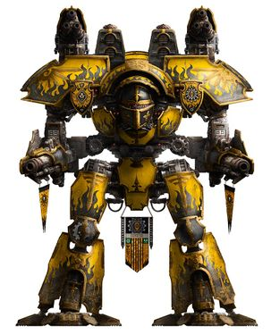
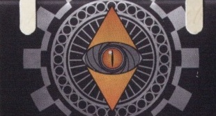
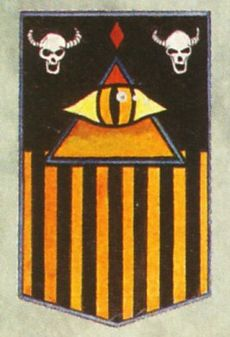
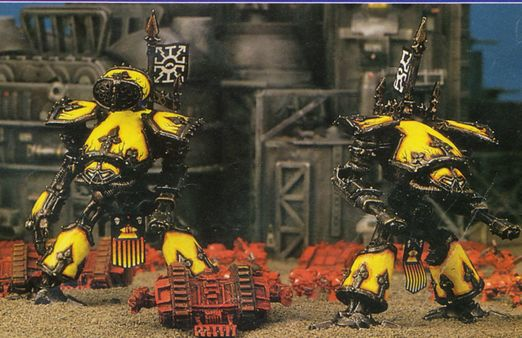
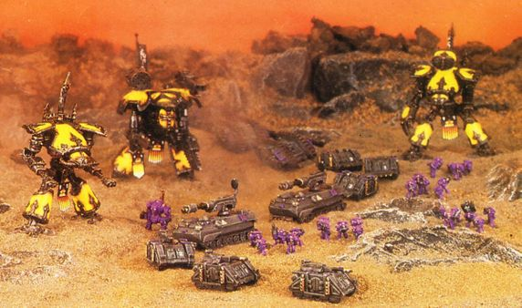
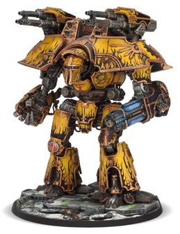
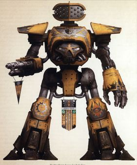
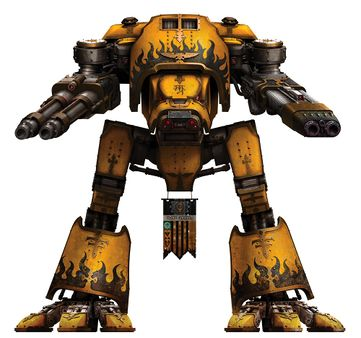

# 0150 愤怒者军团 Legio Fureans

精校状态：中文行文已逐段精校，部分术语仍为暂定

分类：通用概念 / 帝国 Imperium / 机械神教 Adeptus Mechanicus / 泰坦修会 Collegia Titanica

原文来源：https://www.bilibili.com/opus/1198770894674067457

原作者：帝国神选罐头

原文时间：2026年05月05日 10:43

[返回分类目录](目录.md) · [全书目录](../../目录.md)

<!-- A0150-B0001 图片 -->

<!-- A0150-B0002 -->

原译文

Colour Scheme 配色

**校订译文**

Colour Scheme 配色

<!-- /A0150-B0002 -->

<!-- A0150-B0003 -->
### Legion Info 军团信息

<!-- /A0150-B0003 -->

<!-- A0150-B0004 -->
**英文原文**

Name:Legio Fureans

<!-- /A0150-B0004 -->

<!-- A0150-B0005 -->

原译文

名称：愤怒者军团

**校订译文**

名称：愤怒者军团

<!-- /A0150-B0005 -->

<!-- A0150-B0006 -->
**英文原文**

Alternative name:Tiger Eyes

<!-- /A0150-B0006 -->

<!-- A0150-B0007 -->

原译文

别名：虎眼

**校订译文**

别名：虎眼

<!-- /A0150-B0007 -->

<!-- A0150-B0008 -->
**英文原文**

Affiliation:Chaos

<!-- /A0150-B0008 -->

<!-- A0150-B0009 -->

原译文

隶属：混沌

**校订译文**

隶属：混沌

<!-- /A0150-B0009 -->

<!-- A0150-B0010 -->
**英文原文**

Forge World:Originally Incaladion, now Eye of Terror

<!-- /A0150-B0010 -->

<!-- A0150-B0011 -->

原译文

铸造世界：最初因卡拉迪昂，现在恐惧之眼

**校订译文**

铸造世界：原驻因卡拉迪昂，后迁入恐惧之眼

<!-- /A0150-B0011 -->

<!-- A0150-B0012 -->
**英文原文**

Colours:Yellow/Black

<!-- /A0150-B0012 -->

<!-- A0150-B0013 -->

原译文

颜色：黄/黑

**校订译文**

颜色：黄/黑

<!-- /A0150-B0013 -->

<!-- A0150-B0014 -->
**英文原文**

Strength:110-140 Titans (pre-Heresy)

<!-- /A0150-B0014 -->

<!-- A0150-B0015 -->

原译文

力量：110-140架泰坦（叛乱前）

**校订译文**

兵力：110 至 140 台泰坦（荷鲁斯之乱前）

<!-- /A0150-B0015 -->

<!-- A0150-B0016 图片 -->

<!-- A0150-B0017 -->

原译文

Symbol 标志

**校订译文**

Symbol 标志

<!-- /A0150-B0017 -->

<!-- A0150-B0018 -->
**英文原文**

The Legio Fureans, or Tiger Eyes, are a Traitor Titan Legion who fell to Chaos during the Horus Heresy. The symbol of the Legio is a baleful eye which originally symbolized the Omnissiah's favour and wrath. After their treachery, the eye would become associated with the Eye of Horus.

<!-- /A0150-B0018 -->

<!-- A0150-B0019 -->

原译文

愤怒者军团，或虎眼，是一个叛徒泰坦军团，在荷鲁斯叛乱期间堕入混沌。军团的象征是一只恶意之眼，最初象征着欧姆尼塞亚的恩惠和愤怒。在他们背叛之后，这只眼睛与荷鲁斯之眼联系在一起。

**校订译文**

愤怒者军团，或虎眼，是一个叛徒泰坦军团，在荷鲁斯之乱期间堕入混沌。军团的象征是一只恶意之眼，最初象征着欧姆尼赛亚的恩惠和愤怒。在他们背叛之后，这只眼睛与荷鲁斯之眼联系在一起。

<!-- /A0150-B0019 -->

<!-- A0150-B0020 -->
## History 历史

<!-- /A0150-B0020 -->

<!-- A0150-B0021 -->
**英文原文**

Originally based on the Forge World of Incaladion, it was subject to constant wars and invasions before it was liberated by the forces of the Great Crusade. Founded by a Mechanicum Sleeper-Ark during the Age of Strife, the same stable Warp-currents that had succeeded in carrying the Mechanicum to the world were, as time progressed, to bring a host of dark voyagers. As a result, the Incaladion Mechanicum, separated by vast distance from Mars, evolved into a distinctive and highly warlike faction. Waves of xenos invasion spurred unusual avenues of technological development and the creation of vast fortified cities. Throughout this long and savage history, the Legio Fureans formed the principal military force of Incaladion's ruling Archmagos.

<!-- /A0150-B0021 -->

<!-- A0150-B0022 -->

原译文

它最初以因卡拉迪昂铸造世界为基地，在被大远征的部队解放之前，它经历了不断的战争和入侵。在纷争时代，由一艘机械教沉眠者方舟建立，随着时间的推移，成功将机械教带到世界上的稳定亚空间流也带来了许多黑暗之主的旅行者。因此，与火星相距甚远的因卡拉迪昂机械教进化成了一个独特而高度好战的派系。异型入侵的浪潮刺激了技术发展的不同寻常的途径，并建立了庞大的防御城市。在这漫长而野蛮的历史中，愤怒者军团组成了因卡拉迪昂的执政大贤者的主要军事部队。

**校订译文**

军团最初驻于因卡拉迪昂铸造世界。该世界在纷争时代由机械教沉眠方舟建立，直至大远征解放前始终饱受战争与入侵。曾将机械教顺利送达的稳定亚空间洋流，后来也为诸多危险旅客指明航路。远离火星的当地机械教因此形成独特而好战的传统，一波又一波异形侵袭催生非常规技术发展，以及巨型要塞城市。在这段漫长残酷的历史中，愤怒者军团始终是统治大贤者的主要军事力量。

<!-- /A0150-B0022 -->

<!-- A0150-B0023 图片 -->

<!-- A0150-B0024 -->

原译文

Legio Fureans Banner 愤怒者军团旗帜

**校订译文**

Legio Fureans Banner 愤怒者军团旗帜

<!-- /A0150-B0024 -->

<!-- A0150-B0025 -->
**英文原文**

Their more common name the "Tiger Eyes" also stemmed from this early period as a corruption of the name given to them by the feral tribes of the nearby world of Humardu, to whom the Titans truly were divine and terrible beings. Unlike some garrisoning Titan Legions before the Great Crusade, the Legio Fureans did not stand vigil as enforcers for petty empires of the Machine God's servants, but rather fought an unceasing war against a host of foes. For centuries the Legio Fureans unleashed their wrath against invading hordes of Ork marauders and the spiteful raids of Yldari corsairs, scavenging Tarellian war-packs and the colossal viscid horrors of meteor-brought Carnoplasm infestations from the Abyssal Reefs.

<!-- /A0150-B0025 -->

<!-- A0150-B0026 -->

原译文

他们更常见的名字“虎眼”也源于这个早期，这是附近胡马尔杜世界的蛮荒部落给他们起的名字的变体，对他们来说，泰坦是神圣而可怕的造物。与大远征前一些驻军的泰坦军团不同，愤怒者军团并没有作为万机神之仆的小帝国的执行者警戒，而是与许多敌人进行了一场不间断的战争。几个世纪以来，愤怒者军团对入侵的成群的欧克掠夺者和伊尔达里海盗的恶意袭击、清除塔雷利安战群和来自深渊礁的流星带来的血肉源质侵扰的巨大的黏稠恐怖。

**校订译文**

“虎眼”这一通称也源自早期，是邻近胡马尔杜世界蛮族部落对泰坦称呼的转变；在他们眼中，泰坦是真正神圣而可怖的存在。与大远征前某些为万机神仆从的小政权驻防维稳的军团不同，愤怒者军团始终与无数敌人交战。数百年来，他们不断迎击欧克蛮人劫掠者、伊尔达里海盗、四处搜掠的塔雷利安战群，以及由深渊礁陨星带来的巨大黏稠血肉源质怪物。

<!-- /A0150-B0026 -->

<!-- A0150-B0027 -->
**英文原文**

Around fifty years before the Great Crusade would finally reach Incaladion, after a particularly brutal series of incursions and raids, the Taghmata Omnissium - the feudal order upon which the defence and military hierarchy of a Forge World of the Mechanicum is based - finally broke down. In the ensuing strife, the Preceptor-General of Incaladion was assassinated and the Forge World split into warring or isolationist factions, bereft of central control or co-ordination, laying it open to invasion and the devastation which followed. By the time the Great Crusade's advance elements reached Incaladion, it was a global battleground, disported by a dozen different armies; Mechanicum, Renegade and xenos unleashing atomic fire and yet more savage weapons upon each other. During this time, overwhelmed and vastly outnumbered, the Tiger Eyes refused to retreat or retrench, and shattered its blade on foes uncounted until it became only a shadow of its former might.

<!-- /A0150-B0027 -->

<!-- A0150-B0028 -->

原译文

在大远征最终到达因卡拉迪昂的大约五十年前，经过一系列特别残酷的入侵和袭击，机神禁卫 — 机械教铸造世界的防御和军事等级制度所依据的封建秩序 — 终于崩溃了。在随后的冲突中，因卡拉迪昂的训诫将军被暗杀，铸造世界分裂成交战或孤立主义派别，失去了中央控制或协调，使其容易受到入侵和随之而来的破坏。当大远征的先头部队到达因卡拉迪昂时，它已经是一个全球性的战场，被十几支不同的军队所控制；机械教、变节者和异型互相释放原子烈焰和更野蛮的武器。在这段时间里，不堪重负，寡不敌众的虎眼拒绝撤退或紧缩开支，并在无数敌人中被粉碎了刀刃，直到它只剩下以前力量的影子。

**校订译文**

大远征抵达因卡拉迪昂约五十年前，接连残酷入侵终于使当地机神禁卫军所依托的封建防务体系崩溃。统辖的训导将军遭暗杀，铸造世界裂成相互交战或闭关自守的派系，失去统一协调，任由外敌入侵。当大远征先遣部队抵达时，整颗行星已成为十余支机械教、叛离者和异形军队争夺的战场，核火与更残酷武器交相轰击。虎眼在极端劣势下仍拒绝撤退或收缩战线，与无数敌人血战，损耗到只剩昔日力量的影子。

**校注：** 英文写 Taghmata Omnissium，与其他条目的 Taghmata Omnissiah 拼形不同，按上下文视为同一制度，保留原文待核。retrenched 指收缩战线，不是削减经费。

<!-- /A0150-B0028 -->

<!-- A0150-B0029 图片 -->

<!-- A0150-B0030 -->

原译文

Tiger Eyes Reaver Titans 虎眼掠夺者泰坦

**校订译文**

Tiger Eyes Reaver Titans 虎眼掠夺者级泰坦

<!-- /A0150-B0030 -->

<!-- A0150-B0031 -->
**英文原文**

After Imperial contact, it fell to the forces of the IV Legion to bear the brunt of the liberation campaign, with such supporting elements of the Legio Mortis and Skitarii. The resulting campaign was to prove the bloodiest in the IV Legion's history to that point, but after two solar years of guerrilla warfare, Incaladion joined the Imperium. After submitting to the Emperor, the Legio Fureans was quickly reconstituted and rearmed, with the deep Titan-forges beneath the planet's surface put to continuous operations to fuel a second birth for the Titan Legion. Travelling beyond Incaladion, the Legio Fureans pursued conflict with an aggressive fervour and tempo of battle seldom matched by any other Titan Legion of the period. The Legion fought in the Great Crusade, most notably in the War in the Shedim Drifts where they were defeated by a massive Eldar flanking attack.

<!-- /A0150-B0031 -->

<!-- A0150-B0032 -->

原译文

在帝国接触后，第四军团的部队在解放战役中首当其冲，并得到了死亡军团和护教军成员的支援。由此产生的战役被证明是第四军团历史上最血腥的战役，但在经历了两个太阳年的游击战后，因卡拉迪昂加入了帝国。在向帝皇屈服后，愤怒者军团很快被重组和重新武装，行星表面下的泰坦铸造厂持续运作，为泰坦军团的第二次诞生提供燃料。在因卡拉迪昂之外的地方，愤怒者军团以一种侵略性的狂热和战斗节奏追求纷争，这是当时任何其他泰坦军团都难以比拟的。军团参加了大远征，最著名的是邪灵漂流战争，在那里他们被一场大规模的灵族侧翼攻击击败。

**校订译文**

与帝国接触后，第四军团承担了解放战役的主要压力，得到死亡军团和护教军支援。这成为第四军团截至当时最血腥的战役；经过两太阳年游击战，因卡拉迪昂终于加入帝国。向帝皇效忠后，愤怒者军团迅速重组、补充装备，地下泰坦铸造所日夜运转，使军团重获新生。走出母星后，他们以罕有匹敌的热忱与作战节奏投入大远征。其著名战事包括邪灵漂流战争，在那里遭到灵族大规模侧翼突袭而败北。

<!-- /A0150-B0032 -->

<!-- A0150-B0033 -->
**英文原文**

When the Horus Heresy broke out, it was revealed immediately that the Legio Fureans had sided with the Warmaster Horus. It soon joined the new Dark Mechanicum. During the First Battle of Paramar the Legio Fureans joined with the Alpha Legion in invading the world of Paramar V. However they encountered a force of loyalist Iron Warriors and Legio Gryphonicus, emerging victorious but taking heavy losses. During the Siege of Terra the Legio Fureans were the first Traitor Titans to touch down on the Throneworld after the fall of the Lion's Gate Spaceport to Perturabo.

<!-- /A0150-B0033 -->

<!-- A0150-B0034 -->

原译文

当荷鲁斯叛乱爆发时，立即有消息称，愤怒者军团站在了战帅荷鲁斯一边。它很快加入了新的黑暗机械教。在第一次帕拉马尔之战中，愤怒者军团与阿尔法军团联手入侵了帕拉马尔五号世界。然而，他们遇到了忠诚派钢铁勇士和狮鹫军团，取得了胜利，但遭受了重大损失。在泰拉围城期间，愤怒者军团是狮门太空港落入佩图拉博手中后第一批登上王座世界的叛徒泰坦。

**校订译文**

当荷鲁斯之乱爆发时，立即有消息称，愤怒者军团站在了战帅荷鲁斯一边。它很快加入了新的黑暗机械教。在第一次帕拉马尔之战中，愤怒者军团与阿尔法军团联手入侵了帕拉马尔五号世界。然而，他们遇到了忠诚派钢铁勇士和狮鹫军团，取得了胜利，但遭受了重大损失。在泰拉围城期间，愤怒者军团是狮门太空港落入佩图拉博手中后第一批登上王座世界的叛徒泰坦。

<!-- /A0150-B0034 -->

<!-- A0150-B0035 -->
**英文原文**

Post-Heresy, the Tiger Eyes became one of the most active Traitor Titan Legions, fighting in many battles across the Imperium.

<!-- /A0150-B0035 -->

<!-- A0150-B0036 -->

原译文

叛乱后，虎眼军团成为最活跃的叛徒泰坦军团之一，在帝国各地的许多战斗中作战。

**校订译文**

叛乱后，虎眼军团成为最活跃的叛徒泰坦军团之一，在帝国各地的许多战斗中作战。

<!-- /A0150-B0036 -->

<!-- A0150-B0037 图片 -->

<!-- A0150-B0038 -->

原译文

Tiger Eyes battlegroup during the Heresy 叛乱期间的虎眼战斗群

**校订译文**

Tiger Eyes battlegroup during the Heresy 叛乱期间的虎眼战斗群

<!-- /A0150-B0038 -->

<!-- A0150-B0039 -->
## Known Engagements 已知交战

<!-- /A0150-B0039 -->

<!-- A0150-B0040 -->

原译文

???.M30: War in the Shedim Drifts 邪灵漂流战争

**校订译文**

???.M30: War in the Shedim Drifts 邪灵漂流战争

<!-- /A0150-B0040 -->

<!-- A0150-B0041 -->

原译文

006.M31: Invasion of Paramar V 帕拉马尔五号入侵

**校订译文**

006.M31: Invasion of Paramar V 帕拉马尔五号入侵

<!-- /A0150-B0041 -->

<!-- A0150-B0042 -->

原译文

006-013.M31: Battle of Beta-Garmon 贝塔-伽蒙之战

**校订译文**

006-013.M31: Battle of Beta-Garmon 贝塔—伽蒙之战

<!-- /A0150-B0042 -->

<!-- A0150-B0043 -->

原译文

014.M31: Siege of Terra 泰拉围城

**校订译文**

014.M31: Siege of Terra 泰拉围城

<!-- /A0150-B0043 -->

<!-- A0150-B0044 -->

原译文

565.M40: Third Aratean Incursion 第三次阿拉提安入侵

**校订译文**

565.M40: Third Aratean Incursion 第三次阿拉提安入侵

<!-- /A0150-B0044 -->

<!-- A0150-B0045 -->

原译文

Early M42: Battle of Nicomedua 尼科墨杜亚之战

**校订译文**

Early M42: Battle of Nicomedua 尼科墨杜亚之战

<!-- /A0150-B0045 -->

<!-- A0150-B0046 -->

原译文

M42: Nachmund Rift War 纳克蒙德裂隙战争

**校订译文**

M42: Nachmund Rift War 纳克蒙德裂隙战争

<!-- /A0150-B0046 -->

<!-- A0150-B0047 -->
## Assets 资产

<!-- /A0150-B0047 -->

<!-- A0150-B0048 -->
## Known Titans 已知泰坦

<!-- /A0150-B0048 -->

<!-- A0150-B0049 -->
### Warmaster Class 战帅级

<!-- /A0150-B0049 -->

<!-- A0150-B0050 -->

原译文

Cyra Bazhirr 西拉·巴希尔

**校订译文**

Cyra Bazhirr 西拉·巴希尔

<!-- /A0150-B0050 -->

<!-- A0150-B0051 -->
### Warlord Class 战将级

原题：Warlord Class 军阀级

<!-- /A0150-B0051 -->

<!-- A0150-B0052 图片 -->

<!-- A0150-B0053 -->

原译文

Warlord Titan 军阀泰坦

**校订译文**

Warlord Titan 战将级泰坦

<!-- /A0150-B0053 -->

<!-- A0150-B0054 -->

原译文

Alfaer Vyr 阿尔法尔·维尔

**校订译文**

Alfaer Vyr 阿尔法尔·维尔

<!-- /A0150-B0054 -->

<!-- A0150-B0055 -->

原译文

Altair Fajar 阿尔泰·法贾尔

**校订译文**

Altair Fajar 阿尔泰·法贾尔

<!-- /A0150-B0055 -->

<!-- A0150-B0056 -->
**英文原文**

Cyra Jal — Fought in the Battle of Beta-Garmon.

<!-- /A0150-B0056 -->

<!-- A0150-B0057 -->

原译文

西拉·贾尔 — 在贝塔·加蒙之战中作战。

**校订译文**

西拉·贾尔 — 在贝塔—伽蒙之战中作战。

<!-- /A0150-B0057 -->

<!-- A0150-B0058 -->
**英文原文**

Lyakarri — Destroyed in the Invasion of Paramar V.

<!-- /A0150-B0058 -->

<!-- A0150-B0059 -->

原译文

莱卡瑞 — 在帕拉马尔五号的入侵中被摧毁。

**校订译文**

莱卡瑞 — 在帕拉马尔五号的入侵中被摧毁。

<!-- /A0150-B0059 -->

<!-- A0150-B0060 -->

原译文

Ungulaxis 昂古拉克斯

**校订译文**

Ungulaxis 昂古拉克斯

<!-- /A0150-B0060 -->

<!-- A0150-B0061 -->
### Warbringer Nemesis-class 战争使者型天罚级

原题：Warbringer Nemesis-class 战争使者复仇女神级

<!-- /A0150-B0061 -->

<!-- A0150-B0062 -->

原译文

Calamitous Horizon 灾难视界

**校订译文**

Calamitous Horizon 灾难视界

<!-- /A0150-B0062 -->

<!-- A0150-B0063 -->
### Reaver Class 掠夺者级

<!-- /A0150-B0063 -->

<!-- A0150-B0064 图片 -->

<!-- A0150-B0065 -->

原译文

Reaver Titan 掠夺者泰坦

**校订译文**

Reaver Titan 掠夺者级泰坦

<!-- /A0150-B0065 -->

<!-- A0150-B0066 -->
**英文原文**

Leyaka Rakis — Mars Pattern.

<!-- /A0150-B0066 -->

<!-- A0150-B0067 -->

原译文

莱雅卡·拉基斯 — 火星型

**校订译文**

莱雅卡·拉基斯 — 火星型

<!-- /A0150-B0067 -->

<!-- A0150-B0068 -->
**英文原文**

Leyaka Varr — Fought in the Battle of Beta-Garmon.

<!-- /A0150-B0068 -->

<!-- A0150-B0069 -->

原译文

莱雅卡·瓦尔 — 在贝塔·加蒙之战中作战。

**校订译文**

莱雅卡·瓦尔 — 在贝塔—伽蒙之战中作战。

<!-- /A0150-B0069 -->

<!-- A0150-B0070 -->
### Warhound Class 战犬级

<!-- /A0150-B0070 -->

<!-- A0150-B0071 图片 -->

<!-- A0150-B0072 -->

原译文

Warhound Titan 战犬泰坦

**校订译文**

Warhound Titan 战犬级泰坦

<!-- /A0150-B0072 -->

<!-- A0150-B0073 -->
**英文原文**

Blood Hunger — Destroyed in the Invasion of Paramar V.

<!-- /A0150-B0073 -->

<!-- A0150-B0074 -->

原译文

嗜血 — 在帕拉马尔五号的入侵中被摧毁。

**校订译文**

嗜血 — 在帕拉马尔五号的入侵中被摧毁。

<!-- /A0150-B0074 -->

<!-- A0150-B0075 -->
**英文原文**

Caedus Ferox — Fought in the Invasion of Paramar V and the Third Aratean Incursion.

<!-- /A0150-B0075 -->

<!-- A0150-B0076 -->

原译文

卡杜斯·费罗克斯 — 在帕拉马尔五号入侵和第三次阿拉提安入侵中作战。

**校订译文**

卡杜斯·费罗克斯 — 在帕拉马尔五号入侵和第三次阿拉提安入侵中作战。

<!-- /A0150-B0076 -->

<!-- A0150-B0077 -->

原译文

Dahk Cynal 达克·西纳尔

**校订译文**

Dahk Cynal 达克·西纳尔

<!-- /A0150-B0077 -->

<!-- A0150-B0078 -->
**英文原文**

Iben Faruk — Fought in the Battle of Beta-Garmon.

<!-- /A0150-B0078 -->

<!-- A0150-B0079 -->

原译文

伊本·法鲁克 — 在贝塔·加蒙之战中作战。

**校订译文**

伊本·法鲁克 — 在贝塔—伽蒙之战中作战。

<!-- /A0150-B0079 -->

<!-- A0150-B0080 -->

原译文

Khara 卡拉

**校订译文**

Khara 卡拉

<!-- /A0150-B0080 -->

<!-- A0150-B0081 -->

原译文

Maeraka Hazn 马埃拉卡·哈兹恩

**校订译文**

Maeraka Hazn 马埃拉卡·哈兹恩

<!-- /A0150-B0081 -->

<!-- A0150-B0082 -->

原译文

Myphrit Hakim 迈菲特·哈基姆

**校订译文**

Myphrit Hakim 迈菲特·哈基姆

<!-- /A0150-B0082 -->

<!-- A0150-B0083 -->

原译文

Rahu 罗睺

**校订译文**

Rahu 罗睺

<!-- /A0150-B0083 -->

<!-- A0150-B0084 -->
## Personnel 人员

<!-- /A0150-B0084 -->

<!-- A0150-B0085 -->
**英文原文**

Anjana — Princeps Majoris. Commander of Leyaka Rakis.

<!-- /A0150-B0085 -->

<!-- A0150-B0086 -->

原译文

安贾娜 — 主首席，莱雅卡·拉基斯的指挥官

**校订译文**

安贾娜 — 主首席，莱雅卡·拉基斯的指挥官

<!-- /A0150-B0086 -->

<!-- A0150-B0087 -->
**英文原文**

Karali — Moderatus, Leyaka Varr.

<!-- /A0150-B0087 -->

<!-- A0150-B0088 -->

原译文

卡拉利 — 次级操作员，莱雅卡·瓦尔

**校订译文**

卡拉利 — 次级操作员，莱雅卡·瓦尔

<!-- /A0150-B0088 -->

本篇核心术语与暂定项

以下列出本篇出现的英文原形及核心术语表用词。同形词可能指不同对象，具体词义以本篇正文和校注为准；单复数、别名和仅见于图注的名称可能尚未列入。完整候选见[术语表](../../术语表/双语术语候选.csv)。

| 英文 | 采用中文 | 状态 |
| --- | --- | --- |
| Eldar | 灵族 | 暂定·语境区分 |
| Horus Heresy | 荷鲁斯之乱 | 官方已核对 |
| Warp | 亚空间 | 官方已核对 |
| Imperium | 帝国 | 暂定·简称 |
| Mechanicum | 机械教 | 暂定·历史称谓 |
| Dark Mechanicum | 黑暗机械教 | 暂定·官方待核 |
| History | 历史 | 编辑用语已统一 |
| Eye of Terror | 恐惧之眼 | 官方已核对 |
| Emperor | 帝皇 | 官方已核对 |
| Forge World | 铸造世界 | 暂定·官方待核 |
| Iron Warriors | 钢铁勇士 | 暂定·官方待核 |
| Great Crusade | 大远征 | 暂定·官方待核 |
| Age of Strife | 纷争时代 | 暂定·官方待核 |
| Terra | 泰拉 | 暂定·官方待核 |
| Horus | 荷鲁斯 | 暂定·官方待核 |
| Skitarii | 护教军 | 暂定·官方待核 |
| Enforcers | 地方执法者 | 暂定·官方待核 |
| Machine God | 万机神 | 暂定·官方待核 |
| Omnissiah | 欧姆尼赛亚 | 暂定·官方待核 |
| Mars | 火星 | 暂定·官方待核 |
| Titan | 泰坦 | 暂定·官方待核 |
| Princeps | 首席 | 暂定·官方待核 |
| Vigil | 警戒团（静默修女编制）／警戒堡（红蝎空间站）／守夜星（行星） | 语境定译·官方待核 |
| Ferox | 凶猛号 | 暂定·官方待核 |
| Baleful Eye | 恶意之眼号 | 暂定·官方待核 |
| Alpha Legion | 阿尔法军团 | 暂定·官方待核 |
| The Battle of Beta-Garmon | 贝塔-伽蒙之战 | 暂定·官方待核 |
| Marauders | 掠夺者 | 暂定·官方待核 |
| Host | 天军 | 暂定·官方待核 |
| Xenos | 异形 | 暂定·官方待核 |
| Principal | 首席（史洛斯职衔） | 暂定·官方待核 |
| Paramar V | 帕拉马尔五号 | 暂定·官方待核 |
| Legio Fureans | 愤怒者军团 | 暂定·官方待核 |
| Legio Gryphonicus | 狮鹫军团 | 暂定·官方待核 |
| Tiger Eyes | 虎眼军团 | 暂定·官方待核 |
| Bear | 熊 | 暂定·官方待核 |
| Incaladion | 因卡拉迪翁 | 暂定·官方待核 |
| Legio Mortis | 死亡军团 | 暂定·官方待核 |
| Corruption | 腐败 | 暂定·官方待核 |
| Beta | 贝塔号 | 暂定·官方待核 |
| Titan Legions | 泰坦军团 | 暂定·官方待核 |
| Lion's Gate Spaceport | 狮门太空港 | 暂定·官方待核 |
| Lion's Gate | 狮门 | 暂定·官方待核 |

