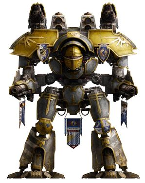
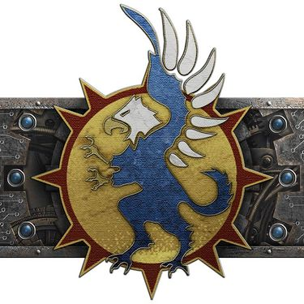
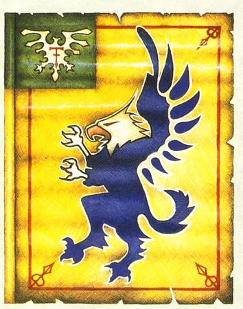
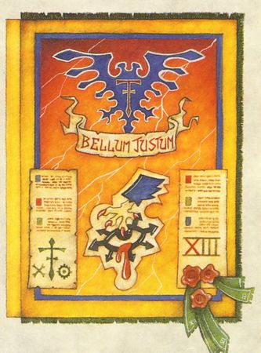
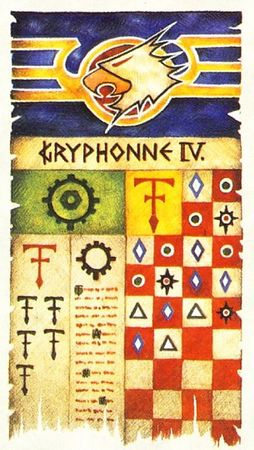
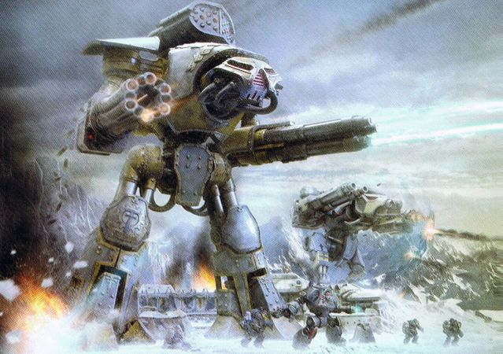
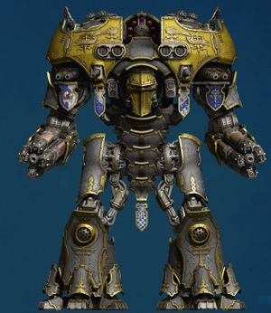
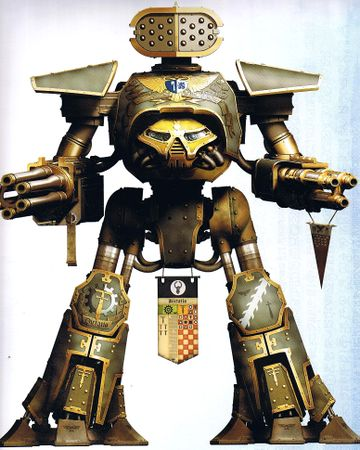
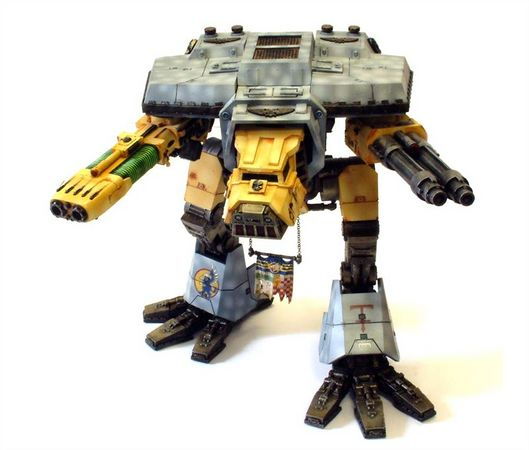

# 0151 狮鹫军团 Legio Gryphonicus

精校状态：中文行文已逐段精校，部分术语仍为暂定

分类：通用概念 / 帝国 Imperium / 机械神教 Adeptus Mechanicus / 泰坦修会 Collegia Titanica

原文来源：https://www.bilibili.com/opus/1198839227621572609

原作者：帝国神选罐头

原文时间：2026年05月05日 15:08

[返回分类目录](目录.md) · [全书目录](../../目录.md)

<!-- A0151-B0001 图片 -->

<!-- A0151-B0002 -->

原译文

Colour Scheme 配色

**校订译文**

Colour Scheme 配色

<!-- /A0151-B0002 -->

<!-- A0151-B0003 -->
### Legion Info 军团信息

<!-- /A0151-B0003 -->

<!-- A0151-B0004 -->
**英文原文**

Name:Legio Gryphonicus

<!-- /A0151-B0004 -->

<!-- A0151-B0005 -->

原译文

名称：狮鹫军团

**校订译文**

名称：狮鹫军团

<!-- /A0151-B0005 -->

<!-- A0151-B0006 -->
**英文原文**

Alternative name:War Griffons

<!-- /A0151-B0006 -->

<!-- A0151-B0007 -->

原译文

别名：战争狮鹫

**校订译文**

别名：战争狮鹫

<!-- /A0151-B0007 -->

<!-- A0151-B0008 -->
**英文原文**

Affiliation:Imperium

<!-- /A0151-B0008 -->

<!-- A0151-B0009 -->

原译文

隶属：帝国

**校订译文**

隶属：帝国

<!-- /A0151-B0009 -->

<!-- A0151-B0010 -->
**英文原文**

Founded:Pre-Great Crusade

<!-- /A0151-B0010 -->

<!-- A0151-B0011 -->

原译文

建立：大远征前

**校订译文**

建立：大远征前

<!-- /A0151-B0011 -->

<!-- A0151-B0012 -->
**英文原文**

Forge World:Gryphonne IV

<!-- /A0151-B0012 -->

<!-- A0151-B0013 -->

原译文

铸造世界：格里芬四号

**校订译文**

铸造世界：格里芬四号

<!-- /A0151-B0013 -->

<!-- A0151-B0014 -->
**英文原文**

Colours:Grey and gold

<!-- /A0151-B0014 -->

<!-- A0151-B0015 -->

原译文

颜色：灰色和金色

**校订译文**

颜色：灰色和金色

<!-- /A0151-B0015 -->

<!-- A0151-B0016 -->
**英文原文**

Strength:176 (start of Horus Heresy)

<!-- /A0151-B0016 -->

<!-- A0151-B0017 -->

原译文

力量：176（荷鲁斯叛乱开始）

**校订译文**

兵力：176 台泰坦（荷鲁斯之乱开始时）

<!-- /A0151-B0017 -->

<!-- A0151-B0018 图片 -->

<!-- A0151-B0019 -->

原译文

Symbol 标志

**校订译文**

Symbol 标志

<!-- /A0151-B0019 -->

<!-- A0151-B0020 -->
**英文原文**

The Legio Gryphonicus (aka the War Griffons) are a Titan Legion with an illustrious history. Born during the very founding of the Adeptus Mechanicus, the Legio Gryphonicus has seen action in many battles against Traitor Titan Legions since the Horus Heresy.

<!-- /A0151-B0020 -->

<!-- A0151-B0021 -->

原译文

狮鹫军团（又名战争狮鹫）是一支有着辉煌历史的泰坦军团。狮鹫军团诞生于机械神教成立之初，自荷鲁斯叛乱以来，它在许多与叛徒泰坦军团的战斗中都有过行动。

**校订译文**

狮鹫军团（又名战争狮鹫）是一支有着辉煌历史的泰坦军团。狮鹫军团诞生于机械修会成立之初，自荷鲁斯之乱以来，它在许多与叛徒泰坦军团的战斗中都有过行动。

<!-- /A0151-B0021 -->

<!-- A0151-B0022 -->
## Overview 概述

<!-- /A0151-B0022 -->

<!-- A0151-B0023 -->
**英文原文**

The War Griffons possess a martial culture which often hews closer to that of a Knight House compared to an average Titan Legion. The Legion's members strive for individual skill, with which they hope to bring glory to their bloodline. This can and has led to conflict between the Legion's Princeps; this, combined with the high value the War Griffons place on discipline, has led the Legion to develop a number of internal laws allowing for duels between its members.

<!-- /A0151-B0023 -->

<!-- A0151-B0024 -->

原译文

战争狮鹫拥有一种军事文化，与普通的泰坦军团相比，它往往更接近骑士家族。军团成员努力追求个人技能，希望以此为自己的血统带来荣耀。这可能并已经导致了军团的首席之间的冲突；这一点，再加上战争狮鹫对纪律的高度重视，促使军团制定了一系列内部法律，允许其成员之间进行决斗。

**校订译文**

战争狮鹫的尚武文化比一般泰坦军团更接近骑士家族，成员追求个人技艺，以为自身血脉增添荣耀。这种竞争曾引发首席之间的冲突；军团又极重纪律，因此制定一套内部法规，容许成员按规定决斗。

<!-- /A0151-B0024 -->

<!-- A0151-B0025 图片 -->

<!-- A0151-B0026 -->

原译文

Legio Banner 军团旗帜

**校订译文**

Legio Banner 军团旗帜

<!-- /A0151-B0026 -->

<!-- A0151-B0027 -->
## History 历史

<!-- /A0151-B0027 -->

<!-- A0151-B0028 -->
**英文原文**

The Legion was founded sometime during the Age of Strife and at the time was the primary tool of power of the pocket empire of Gryphonne IV. The planet itself had been colonized by Tech-priests from Mars. The legion became one of the largest and most well-equipped of the Great Crusade alongside the Legio Mortis, Legio Destructor, Legio Crucius and Legio Magna. It gained many battle-honours, most notably in the Rangdan Genocide and Ullanor Crusade. By the end of the Crusade, the Legio numbered some 176 Titans of various classes, with roughly half of these being Reavers. They also possessed an unusual number of Titan-Barques and transports operating under its own fealty and allegiance, which allowed it to operate largely independently when the need arose. This would serve them well in the coming Heresy.

<!-- /A0151-B0028 -->

<!-- A0151-B0029 -->

原译文

军团成立于纷争时代的某个时候，当时是格里芬四号的口袋帝国的主要权力工具。这颗行星本身曾被来自火星的技术神甫殖民。该军团与死亡军团、破坏者军团、折磨军团和宏伟军团一起成为大远征中规模最大、装备最精良的军团之一。它获得了许多战斗荣誉，最著名的是在冉丹种族灭绝和乌兰诺远征中。到远征结束时，军团拥有约176架不同级别的泰坦，其中大约一半是掠夺者。他们还拥有数量不寻常的泰坦舰和运输舰，在自己的忠诚和效忠下运作，这使得它在需要时基本上可以独立运作。这将在即将到来的叛乱中为他们服务。

**校订译文**

军团成立于纷争时代，是格里芬四号这一小型政权的主要权力支柱。当地最初由火星技术祭司殖民。大远征期间，军团与死亡、破坏者、折磨及宏伟等军团并列为规模最大、装备最好的泰坦军团之一，在冉丹灭绝战争、乌兰诺远征等战役中获誉。大远征结束时，它拥有约 176 台各型泰坦，其中近半为掠夺者。军团还直接掌握数量颇多的泰坦运输舰和其他运输舰，必要时能独立行动，这在随后的荷鲁斯之乱中极有价值。

<!-- /A0151-B0029 -->

<!-- A0151-B0030 -->
**英文原文**

When the Horus Heresy broke out, the Legion remained true to the Emperor. However, before the rebellion Horus had foreseen this decision and scattered the Legion across the galaxy under the pretense of their presence being necessary for many smaller campaigns. Warzones included the Ruin of Maerdan, Battle of Molech, the First Battle of Paramar, and the Battle of Beta-Garmon. The Legion took grievous damage during the Beta-Garmon campaign, and could only provide scant forces to the Siege of Terra. Throughout the war, the Legio Gryphonicus built a fierce hatred against the Legio Mortis.

<!-- /A0151-B0030 -->

<!-- A0151-B0031 -->

原译文

当荷鲁斯叛乱爆发时，军团仍然忠于帝皇。然而，在叛乱之前，荷鲁斯已经预见到了这一决定，以许多小型战役需要他们为借口，将军团分散到整个银河系。战区包括马尔丹毁灭、摩洛之战、第一次帕拉马尔之战和贝塔-伽蒙之战。在贝塔-伽蒙战役中，军团遭受了严重破坏，只能为泰拉围城提供少量部队。在整个战争期间，狮鹫军团对死亡军团建立了强烈的仇恨。

**校订译文**

当荷鲁斯之乱爆发时，军团仍然忠于帝皇。然而，在叛乱之前，荷鲁斯已经预见到了这一决定，以许多小型战役需要他们为借口，将军团分散到整个银河系。战区包括马尔丹毁灭、摩洛之战、第一次帕拉马尔之战和贝塔—伽蒙之战。在贝塔—伽蒙战役中，军团遭受了严重破坏，只能为泰拉围城提供少量部队。在整个战争期间，狮鹫军团对死亡军团建立了强烈的仇恨。

<!-- /A0151-B0031 -->

<!-- A0151-B0032 图片 -->

<!-- A0151-B0033 -->

原译文

Legio Gryphonicus 'Heresy Banner' 狮鹫军团‘叛乱旗帜’

**校订译文**

Legio Gryphonicus 'Heresy Banner' 狮鹫军团‘叛乱旗帜’

<!-- /A0151-B0033 -->

<!-- A0151-B0034 -->
**英文原文**

A battle group of the War Griffons Titans fought alongside the Gryphonne IV Skitarii forces that took part in the Castra Campaign where, with the help of the first batch of newly produced Leman Russ Conquerors, they encircled and trapped the traitor besiegers of Hive Castra Septus, eliminating the traitors within the pocket.

<!-- /A0151-B0034 -->

<!-- A0151-B0035 -->

原译文

一支由战争狮鹫泰坦组成的战斗群与参加卡斯特拉战役的格里芬四号护教军部队并肩作战，在第一批新产生的黎曼·鲁斯征服者的帮助下，他们包围并困住了巢都卡斯特拉七号的叛徒围攻者，消灭了口袋里的叛徒。

**校订译文**

卡斯特拉战役中，一个战争狮鹫泰坦战斗群与格里芬四号护教军并肩作战，得到首批新造黎曼鲁斯征服者坦克支援。他们反过来包围了正在围攻卡斯特拉七号巢都的叛军，并将包围圈内敌人全数消灭。

<!-- /A0151-B0035 -->

<!-- A0151-B0036 -->
**英文原文**

The War Griffons have over the millennia been instrumental in halting the Black Crusades of Abaddon the Despoiler that spewed from the Eye of Terror.

<!-- /A0151-B0036 -->

<!-- A0151-B0037 -->

原译文

数千年来，战争狮鹫在阻止恐惧之眼喷出的掠夺者阿巴顿的黑色远征方面发挥了重要作用。

**校订译文**

数千年来，战争狮鹫在阻止恐惧之眼喷出的掠夺者阿巴顿的黑色远征方面发挥了重要作用。

<!-- /A0151-B0037 -->

<!-- A0151-B0038 图片 -->

<!-- A0151-B0039 -->

原译文

Legio Gryphonicus Banner 狮鹫军团旗帜

**校订译文**

Legio Gryphonicus Banner 狮鹫军团旗帜

<!-- /A0151-B0039 -->

<!-- A0151-B0040 -->
**英文原文**

The Legion suffered a catastrophic defeat in 997.M41 when its Forge World of Gryphonne IV was overrun by Hive Fleet Leviathan. During the battle, the majority of the Legion was torn to pieces by swarms of Tyranid Hierophants and Tyrannofexes. However, a portion of the Legion survived the tragedy and was able to provide a total of eight Battle Titans to the Betalis Campaign against the Eldar. Some of its surviving Titans also took part in the defense of Cadia during the Thirteenth Black Crusade. The Fortress World was destroyed in that conflict, but the final fate of the Legio's Titans is unknown.

<!-- /A0151-B0040 -->

<!-- A0151-B0041 -->

原译文

997.M41，军团遭受了灾难性的失败，其格里芬四号铸造世界被虫巢舰队利维坦占领。在战斗中，军团的大部分成员被成群的泰伦教皇和暴虐兽撕成了碎片。然而，一部分军团在悲剧中幸存下来，并能够为贝塔利斯对抗灵族的战役提供总共八架战斗泰坦。在第十三次黑色远征期间，它的一些幸存的泰坦也参加了防御卡迪亚。要塞世界在那场冲突中被摧毁，但军团的泰坦的最终命运尚不清楚。

**校订译文**

997.M41，利维坦虫巢舰队攻陷格里芬四号，军团遭受灾难性失败，大部分泰坦被成群的泰伦教皇巨兽与暴虐兽撕碎。不过，仍有部分力量幸存，后来为对抗灵族的贝塔利斯战役提供了八台战斗泰坦。第十三次黑色远征中，一些幸存泰坦还参加卡迪亚防御；要塞世界最终被毁，它们的命运则不明确。

<!-- /A0151-B0041 -->

<!-- A0151-B0042 图片 -->

<!-- A0151-B0043 -->

原译文

Legio Gryphonicus in action on Betalis III 在贝塔利斯三号上行动的狮鹫军团

**校订译文**

Legio Gryphonicus in action on Betalis III 在贝塔利斯三号上行动的狮鹫军团

<!-- /A0151-B0043 -->

<!-- A0151-B0044 -->
## Heraldry 纹章

<!-- /A0151-B0044 -->

<!-- A0151-B0045 -->
**英文原文**

The Titans of the Legio Gryphonicus are primarily grey with yellow faceplates and gold decoration.

<!-- /A0151-B0045 -->

<!-- A0151-B0046 -->

原译文

狮鹫军团的泰坦主要是灰色的，有黄色的面甲和金色的装饰。

**校订译文**

狮鹫军团的泰坦主要是灰色的，有黄色的面甲和金色的装饰。

<!-- /A0151-B0046 -->

<!-- A0151-B0047 -->
**英文原文**

Legio Gryphonicus make use of symbols of chess pieces to denote a Titan's class on its honour banner(s) - a King for a Warmaster, a Queen for a Warlord, a Bishop for a Warbringer, a Knight for a Reaver or a Pawn for a Warhound.

<!-- /A0151-B0047 -->

<!-- A0151-B0048 -->

原译文

狮鹫军团在其荣誉旗帜上使用国际象棋的符号来表示泰坦的类别 — 国王代表战帅，王后代表军阀，主教代表战争使者，骑士代表掠夺者，或者兵代表战犬。

**校订译文**

狮鹫军团在泰坦荣誉旗帜上，以国际象棋棋子标示级别：王代表战帅，后代表战将，象代表战争使者，马代表掠夺者，兵代表战犬。

<!-- /A0151-B0048 -->

<!-- A0151-B0049 -->
## Assets 资产

<!-- /A0151-B0049 -->

<!-- A0151-B0050 -->
## Known Titans 已知泰坦

<!-- /A0151-B0050 -->

<!-- A0151-B0051 -->
### Imperator Class 帝皇级

<!-- /A0151-B0051 -->

<!-- A0151-B0052 -->
**英文原文**

Warscorn — Fought in the Battle of Beta-Garmon during the Horus Heresy.

<!-- /A0151-B0052 -->

<!-- A0151-B0053 -->

原译文

战争蔑视 — 在荷鲁斯叛乱时期的贝塔-伽蒙之战中作战。

**校订译文**

战争蔑视 — 在荷鲁斯之乱时期的贝塔—伽蒙之战中作战。

<!-- /A0151-B0053 -->

<!-- A0151-B0054 -->
### Warmonger Class 好战者级

<!-- /A0151-B0054 -->

<!-- A0151-B0055 -->
**英文原文**

Castellan Corda — Fought in the Siege of Terra against the forces of Legio Magna.

<!-- /A0151-B0055 -->

<!-- A0151-B0056 -->

原译文

堡主之弦 — 在泰拉围城中与死亡军团的部队作战。

**校订译文**

“堡主之弦”号——在泰拉围城中与宏伟军团交战。

<!-- /A0151-B0056 -->

<!-- A0151-B0057 -->
### Warmaster Class 战帅级

<!-- /A0151-B0057 -->

<!-- A0151-B0058 -->
**英文原文**

Aureum Castigator — Warmaster Titan, one of the roughly three in service with the legion at the start of the Horus Heresy.

<!-- /A0151-B0058 -->

<!-- A0151-B0059 -->

原译文

黄金惩戒者 — 战帅泰坦，荷鲁斯叛乱开始时在军团服役的大约三架之一。

**校订译文**

黄金惩戒者 — 战帅泰坦，荷鲁斯之乱开始时在军团服役的大约三架之一。

<!-- /A0151-B0059 -->

<!-- A0151-B0060 图片 -->

<!-- A0151-B0061 -->

原译文

Legio Gryphonicus Warmaster Titan Aurem Castigator 狮鹫军团战帅泰坦黄金惩戒者号

**校订译文**

Legio Gryphonicus Warmaster Titan Aurem Castigator 狮鹫军团战帅泰坦黄金惩戒者号

<!-- /A0151-B0061 -->

<!-- A0151-B0062 -->
### Warlord Class 战将级

原题：Warlord Class 军阀级

<!-- /A0151-B0062 -->

<!-- A0151-B0063 -->

原译文

Argent Monarch 银白君王

**校订译文**

Argent Monarch 银白君王

<!-- /A0151-B0063 -->

<!-- A0151-B0064 -->
**英文原文**

Argent Polemistes — Fought in the Siege of Terra against the forces of Legio Magna.

<!-- /A0151-B0064 -->

<!-- A0151-B0065 -->

原译文

银白斗士 — 在泰拉围城中与宏伟军团的部队作战。

**校订译文**

银白斗士 — 在泰拉围城中与宏伟军团的部队作战。

<!-- /A0151-B0065 -->

<!-- A0151-B0066 -->

原译文

Aurora Ferrum 极光之铁

**校订译文**

Aurora Ferrum 极光之铁

<!-- /A0151-B0066 -->

<!-- A0151-B0067 -->
**英文原文**

Bellus Shockatrice — Fought in the Siege of Terra against the forces of Legio Magna.

<!-- /A0151-B0067 -->

<!-- A0151-B0068 -->

原译文

美丽震撼 — 在泰拉围城中与宏伟军团的部队作战。

**校订译文**

美丽震撼 — 在泰拉围城中与宏伟军团的部队作战。

<!-- /A0151-B0068 -->

<!-- A0151-B0069 -->
**英文原文**

Iron Regent — Highly decorated during the Great Crusade where it battled Xenos Titans. During the Horus Heresy it fought in the Battle of Tallarn where it slew three enemy Reaver Titans and one Warlord Titan of the Legio Krytos.

<!-- /A0151-B0069 -->

<!-- A0151-B0070 -->

原译文

钢铁摄政 — 在大远征与异型泰坦作战期间获得了极高荣誉。在荷鲁斯叛乱期间，它在塔兰之战中作战，杀死了三架敌方掠夺者泰坦和一架力量军团的军阀泰坦。

**校订译文**

钢铁摄政 — 在大远征与异形泰坦作战期间获得了极高荣誉。在荷鲁斯之乱期间，它在塔兰之战中作战，杀死了三架敌方掠夺者级泰坦和一架力量军团的战将级泰坦。

<!-- /A0151-B0070 -->

<!-- A0151-B0071 -->
**英文原文**

Ostentio Contritio — Fought in the Battle of Tallarn.

<!-- /A0151-B0071 -->

<!-- A0151-B0072 -->

原译文

展示悔恨 — 在塔兰之战中作战。

**校订译文**

展示悔恨 — 在塔兰之战中作战。

<!-- /A0151-B0072 -->

<!-- A0151-B0073 -->
### Reaver Class 掠夺者级

<!-- /A0151-B0073 -->

<!-- A0151-B0074 图片 -->

<!-- A0151-B0075 -->

原译文

Reaver Titan 掠夺者泰坦

**校订译文**

Reaver Titan 掠夺者级泰坦

<!-- /A0151-B0075 -->

<!-- A0151-B0076 -->
**英文原文**

Aeterno Rex — Piloted by Princeps Usselus Kine during the Horus Heresy. Destroyed during the Ruin of Maerdan by two dozen Knight Lancers of House Perdaxia.

<!-- /A0151-B0076 -->

<!-- A0151-B0077 -->

原译文

永恒之王 — 荷鲁斯叛乱时期由乌瑟卢斯·凯恩首席驾驶。在马尔丹毁灭期间被佩达克西亚家族的二十多架长枪骑士摧毁。

**校订译文**

“永恒之王”号——荷鲁斯之乱期间由首席乌瑟卢斯·凯恩驾驶，在马尔丹毁灭战中被佩达克西亚家族的二十四台长枪骑士摧毁。

<!-- /A0151-B0077 -->

<!-- A0151-B0078 -->

原译文

Dictatio 口述

**校订译文**

Dictatio 口述

<!-- /A0151-B0078 -->

<!-- A0151-B0079 -->
**英文原文**

Dominatus Revok — Mars Pattern.\[Note 1\]

<!-- /A0151-B0079 -->

<!-- A0151-B0080 -->

原译文

统御废止 — 火星型。

**校订译文**

统御废止 — 火星型。

<!-- /A0151-B0080 -->

<!-- A0151-B0081 -->

原译文

Fidelis Natus 忠诚之子

**校订译文**

Fidelis Natus 忠诚之子

<!-- /A0151-B0081 -->

<!-- A0151-B0082 -->
**英文原文**

Invictus Nova — Ancient Reaver Class Titan created shortly after the Legion itself.

<!-- /A0151-B0082 -->

<!-- A0151-B0083 -->

原译文

不屈新星 — 在军团成立后不久创造的古代掠夺者级泰坦。

**校订译文**

不屈新星 — 在军团成立后不久创造的古代掠夺者级泰坦。

<!-- /A0151-B0083 -->

<!-- A0151-B0084 -->

原译文

Paladin Argentus 银白圣骑\[Note 1\]

**校订译文**

Paladin Argentus 银白圣骑\[Note 1\]

<!-- /A0151-B0084 -->

<!-- A0151-B0085 -->
**英文原文**

Southron Shield — Destroyed, First Battle of Paramar.

<!-- /A0151-B0085 -->

<!-- A0151-B0086 -->

原译文

南方之盾 — 被摧毁，第一次帕拉马尔之战。

**校订译文**

南方之盾 — 被摧毁，第一次帕拉马尔之战。

<!-- /A0151-B0086 -->

<!-- A0151-B0087 -->
### Warhound Class 战犬级

<!-- /A0151-B0087 -->

<!-- A0151-B0088 图片 -->

<!-- A0151-B0089 -->

原译文

Warhound Titan (Lucius Pattern) 战犬泰坦（卢修斯型）

**校订译文**

Warhound Titan (Lucius Pattern) 战犬级泰坦（卢修斯型）

<!-- /A0151-B0089 -->

<!-- A0151-B0090 -->

原译文

Celaritas Rex 透明之王\[Note 1\]

**校订译文**

Celaritas Rex 透明之王\[Note 1\]

**校注：** Celaritas Rex 的 Celaritas 可能为原名或异拼；原译“透明之王”缺乏本条英文说明支持，暂保留旧译待核对应资料，不自行按相似拉丁词定译。

<!-- /A0151-B0090 -->

<!-- A0151-B0091 -->

原译文

Gladius Lucida 光之剑\[Note 1\]

**校订译文**

Gladius Lucida 光之剑\[Note 1\]

<!-- /A0151-B0091 -->

<!-- A0151-B0092 -->

原译文

Magna Canis 巨犬

**校订译文**

Magna Canis 巨犬

<!-- /A0151-B0092 -->

<!-- A0151-B0093 -->
**英文原文**

Nobilis — Fought in the Ullanor Crusade and its Machine Spirit still seethes with a bestial hatred of xenos.

<!-- /A0151-B0093 -->

<!-- A0151-B0094 -->

原译文

高贵 — 在乌兰诺远征中战斗，其机魂仍然充满了对异型的野蛮仇恨。

**校订译文**

高贵 — 在乌兰诺远征中战斗，其机魂仍然充满了对异形的野蛮仇恨。

<!-- /A0151-B0094 -->

<!-- A0151-B0095 -->

原译文

Sanctus Venator 神圣猎手

**校订译文**

Sanctus Venator 神圣猎手

<!-- /A0151-B0095 -->

<!-- A0151-B0096 -->

原译文

Tempus Prima 时光之初

**校订译文**

Tempus Prima 时光之初

<!-- /A0151-B0096 -->

<!-- A0151-B0097 -->
**英文原文**

Venator Lux — Fought in the Ruin of Maerdan.

<!-- /A0151-B0097 -->

<!-- A0151-B0098 -->

原译文

光之猎手 — 在马尔丹毁灭中作战。

**校订译文**

光之猎手 — 在马尔丹毁灭中作战。

<!-- /A0151-B0098 -->

<!-- A0151-B0099 -->
### Other/Unknown Class 其他/未知类别

<!-- /A0151-B0099 -->

<!-- A0151-B0100 -->

原译文

Gloria Interitus 荣耀毁灭

**校订译文**

Gloria Interitus 荣耀毁灭

<!-- /A0151-B0100 -->

<!-- A0151-B0101 -->
**英文原文**

Indomat Celsior — Destroyed in the Siege of Terra.

<!-- /A0151-B0101 -->

<!-- A0151-B0102 -->

原译文

不屈崇高 — 在泰拉围城中被摧毁。

**校订译文**

不屈崇高 — 在泰拉围城中被摧毁。

<!-- /A0151-B0102 -->

<!-- A0151-B0103 -->
## Known Personnel 已知人员

<!-- /A0151-B0103 -->

<!-- A0151-B0104 -->
**英文原文**

Orun Faruq — Princeps of Gloria Interitus during the Horus Heresy.

<!-- /A0151-B0104 -->

<!-- A0151-B0105 -->

原译文

奥伦·法鲁克 — 荷鲁斯叛乱时期的荣耀毁灭号的首席。

**校订译文**

奥伦·法鲁克 — 荷鲁斯之乱时期的荣耀毁灭号的首席。

<!-- /A0151-B0105 -->

<!-- A0151-B0106 -->
## Trivia 琐事

<!-- /A0151-B0106 -->

<!-- A0151-B0107 -->
## Notes 注释

<!-- /A0151-B0107 -->

<!-- A0151-B0108 -->
**英文原文**

Note 1: One source labels these Titans' maniple as being from "The Divisio Militaris of the Legio Atarus". However, given that this section of the book is about the Legio Gryphonicus, the Titans are in Gryphonicus colours and displaying their symbol, and that the unit is stated to have fought in the First Battle of Paramar, the reference to the Legio Atarus is presumably a typographical error.

<!-- /A0151-B0108 -->

<!-- A0151-B0109 -->

原译文

注1：有消息称这些泰坦队伍来自“炎纹军团军事分部”。然而，鉴于这本书的这一部分是关于狮鹫军团的，泰坦是狮鹫的配色并展示着他们的标志，而且据说该单位参加了第一次帕拉马尔之战，因此提到炎纹军团可能是一个排版错误。

**校订译文**

注 1：一份资料将这些泰坦所属支队标为“炎纹军团军事分部”。但该书这一节讨论的是狮鹫军团，图中泰坦也采用狮鹫军团的配色和徽记，而且该支队被记为参加了第一次帕拉马尔之战。因此，原条目推测 Legio Atarus（炎纹军团）可能是排印错误。

**校注：** “炎纹军团为排印错误”是原条目的推断，现明确归属原作者，不冒充本稿独立证实。

<!-- /A0151-B0109 -->

本篇核心术语与暂定项

以下列出本篇出现的英文原形及核心术语表用词。同形词可能指不同对象，具体词义以本篇正文和校注为准；单复数、别名和仅见于图注的名称可能尚未列入。完整候选见[术语表](../../术语表/双语术语候选.csv)。

| 英文 | 采用中文 | 状态 |
| --- | --- | --- |
| Adeptus Mechanicus | 机械修会 | 官方已核对 |
| Eldar | 灵族 | 暂定·语境区分 |
| Horus Heresy | 荷鲁斯之乱 | 官方已核对 |
| Imperium | 帝国 | 暂定·简称 |
| History | 历史 | 编辑用语已统一 |
| Eye of Terror | 恐惧之眼 | 官方已核对 |
| Emperor | 帝皇 | 官方已核对 |
| Forge World | 铸造世界 | 暂定·官方待核 |
| Great Crusade | 大远征 | 暂定·官方待核 |
| Age of Strife | 纷争时代 | 暂定·官方待核 |
| Terra | 泰拉 | 暂定·官方待核 |
| Horus | 荷鲁斯 | 暂定·官方待核 |
| Skitarii | 护教军 | 暂定·官方待核 |
| Hive Fleet Leviathan | 利维坦虫巢舰队 | 暂定·官方待核 |
| Mars | 火星 | 暂定·官方待核 |
| Gryphonne IV | 格里芬四号 | 暂定·官方待核 |
| Tallarn | 塔兰 | 暂定·官方待核 |
| Cadia | 卡迪亚 | 暂定·官方待核 |
| Molech | 摩洛 | 暂定·官方待核 |
| Titan | 泰坦 | 暂定·官方待核 |
| Tech | 技术语 | 暂定·官方待核 |
| Castigator | 惩戒者坦克 | 官方已核对 |
| Ancient | 旗手 | 官方已核对 |
| Princeps | 首席 | 暂定·官方待核 |
| Ullanor | 乌兰诺 | 暂定·官方待核 |
| The Battle of Beta-Garmon | 贝塔-伽蒙之战 | 暂定·官方待核 |
| Founding | 建军 | 暂定·官方待核 |
| Despoiler | 劫掠者 | 暂定·官方待核 |
| Castellan | 堡主 | 官方已核对 |
| Xenos | 异形 | 暂定·官方待核 |
| Rangdan | 冉丹 | 暂定·官方待核 |
| Abaddon the Despoiler | 掠夺者阿巴顿 | 官方已核对 |
| Destructor | 破坏者（史洛斯类别） | 暂定·官方待核 |
| Reavers | 劫掠者 | 官方已核对 |
| Legio Gryphonicus | 狮鹫军团 | 暂定·官方待核 |
| Legio Magna | 宏伟军团 | 暂定·官方待核 |
| Fealty | 忠诚 | 暂定·官方待核 |
| Legio Atarus | 炎纹军团 | 暂定·官方待核 |
| Warlord Titan | 战将级泰坦 | 官方已核对 |
| Krytos | 克瑞托斯 | 暂定·官方待核 |
| Fortress World | 堡垒世界 | 暂定·官方待核 |
| Knight House | 骑士家族 | 暂定·官方待核 |
| Legio Mortis | 死亡军团 | 暂定·官方待核 |
| Beta | 贝塔号 | 暂定·官方待核 |
| Legio Crucius | 十字军团 | 暂定·官方待核 |
| Legio Krytos | 柯伊托斯军团 | 暂定·官方待核 |
| Argent | 圣银权杖 | 暂定·官方待核 |
| Titan Legions | 泰坦军团 | 暂定·官方待核 |
| Skitarii Forces | 护教军部队 | 暂定·官方待核 |

