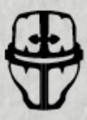
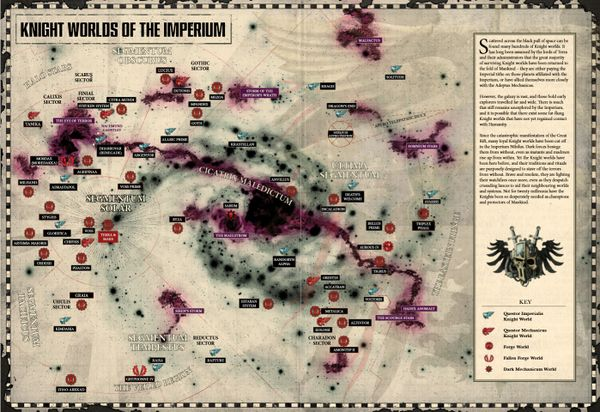
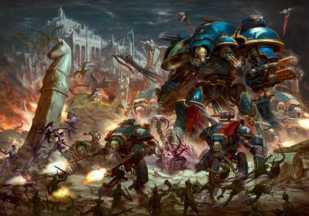
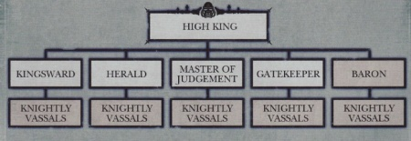
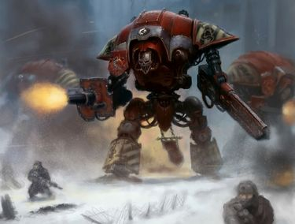
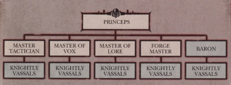
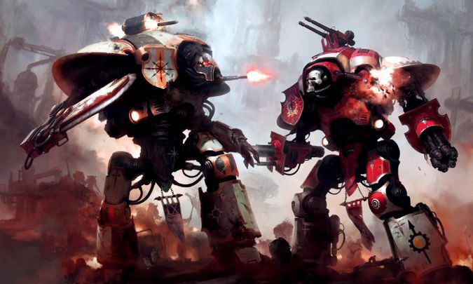
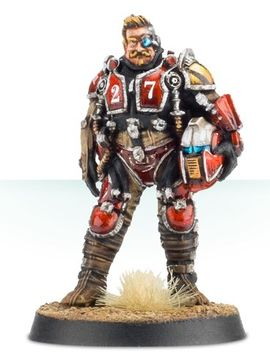

# 0152 帝国骑士 Imperial Knight

精校状态：中文行文已逐段精校，部分术语仍为暂定

分类：通用概念 / 帝国 Imperium / 机械神教 Adeptus Mechanicus / 帝国骑士 Imperial Knight

原文来源：https://www.bilibili.com/opus/1127938972676259840

原作者：帝国神选罐头

原文时间：2025年10月26日 13:39

[返回分类目录](目录.md) · [全书目录](../../目录.md)

<!-- A0152-B0001 -->
**英文原文**

Imperial Knights are towering bipedel engines of war that hail from feudal worlds of the Imperium known as Knight Worlds. Each Knight is piloted by a single Noble pilot from within the Throne Mechanicum. Knights which are sworn to the service of the Emperor are known as Questor Imperialis. Knights which are sworn to the Omnissiah are known as Questor Mechanicus. Knights themselves are operated from Knight Households, also known as Questoris Familia, located on Knight Worlds. Pilots of Knights are known as Knight Scions.

<!-- /A0152-B0001 -->

<!-- A0152-B0002 -->

原译文

帝国骑士是高耸的两足战争引擎，来自被称为骑士世界的帝国封建世界。每个骑士都由机械王座中的一名贵族驾驶员驾驶。宣誓为帝皇服务的骑士被称为帝国骑士。宣誓效忠欧姆尼赛亚的骑士被称为机械教骑士。骑士本身由骑士家族使用，也被称为骑士家族，位于骑士世界。骑士的驾驶员被称为骑士后裔。

**校订译文**

帝国骑士是高耸的双足战争机器，来自帝国封建制的“骑士世界”。每台骑士由一位贵族坐在机械王座上驾驶。效忠帝皇者称帝国骑士（Questor Imperialis），效忠欧姆尼赛亚者称机械教骑士（Questor Mechanicus）。骑士归属于骑士世界上的家族，英文亦称 Questoris Familia；驾驶员则称骑士后裔。

**校注：** Imperial Knights 是本篇机甲势力的总称；Questor Imperialis 专指效忠帝皇的一支。两词暂均沿用帝国骑士，相关句据效忠对象辨别，不以另造固定派名改变全书定译。

<!-- /A0152-B0002 -->

<!-- A0152-B0003 图片 -->

<!-- A0152-B0004 -->

原译文

Symbol of the Questor Imperialis 帝国骑士标志

**校订译文**

Symbol of the Questor Imperialis 帝国骑士标志

<!-- /A0152-B0004 -->

<!-- A0152-B0005 -->
## History 历史

<!-- /A0152-B0005 -->

<!-- A0152-B0006 -->
**英文原文**

The original Knight Worlds were founded during the Dark Age of Technology, settled by Humanity in its first great stellar exodus. In an event dubbed the Long March, over the course of decades colonization ships reached their pre-chosen worlds. When they arrived however, they found often lethal wildlife and plant-life alike, or devastating meteorological conditions. The founding materials for the colonists were the ship themselves, while they were able to flourish and expand thanks to STC machines. Among the creations of the STC during this time were the first Knight suits to defend against predators and hostile Xenos. The pilots for these suits were carefully chosen, but over extended exposure to their Throne Mechanicum console their concepts of practical self-defense and communal survival was replaced by ideas of authoritarianism, chivalry, and martial honor. Over the decades a feudal system formed, and those protected by the Knights increasingly became vassals to their masters. The armaments originally used for settlement and construction would instead be dedicated to the prosecution of war.

<!-- /A0152-B0006 -->

<!-- A0152-B0007 -->

原译文

最初的骑士世界是在黑暗技术时代建立的，人类在第一次大群星外流中定居下来。在一次被称为长远进军的事件中，几十年来，殖民船到达了他们预先选择的世界。然而，当他们到达时，他们经常发现致命的野生动物和植物，或者毁灭性的气象条件。殖民者的初始材料是船本身，而由于STC机器，他们能够蓬勃发展和扩张。在此期间，STC的发明包括第一套骑士战甲，用于防御掠食者和敌对的异型。这些战甲的驾驶员是经过精心挑选的，但过度长期暴露在他们的机械王座的抚慰下，他们实际的自卫和社区生存的概念被威权主义、骑士精神和军事荣誉的思想所取代。几十年来，封建制度逐渐形成，受骑士保护的人越来越多地成为他们主人的附庸。最初用于定居和建筑的武器将专门用于战争。

**校订译文**

最早的骑士世界建立于黑暗科技时代，源于人类首次大规模星际迁徙。被称为“长远进军”的殖民历程历时数十年，船队才抵达预选目的地，却常遭遇致命动植物或极端气候。殖民者拆解船只获取初期建材，并依靠 STC 设备逐渐繁荣扩张。最早的骑士机甲也是当时 STC 的产物，用于抵御猛兽和敌对异形。驾驶员经过严格挑选，但长期连接机械王座后，原本务实的自卫和群体生存观念，逐渐被威权统治、骑士精神与尚武荣誉取代。数十年间，封建制度形成，受骑士保护者变为附庸，原用于开拓定居点和建设的装备，也逐渐专用于战争。

<!-- /A0152-B0007 -->

<!-- A0152-B0008 图片 -->

<!-- A0152-B0009 -->

原译文

Knight Worlds across the galaxy 银河系中的骑士世界

**校订译文**

Knight Worlds across the galaxy 银河系中的骑士世界

<!-- /A0152-B0009 -->

<!-- A0152-B0010 -->
**英文原文**

Later during the Age of Strife, Mars sent out many expeditions of spacecraft, hoping to find remnants of human knowledge on other worlds. They found an anarchic galaxy where the ancient confederacy of interdependent human planets no longer existed. The human worlds discovered retained little of their old technology. They had devolved into feudal states ruled by aristocratic nobles who welcomed the Techpriests as long-awaited saviours. The Tech-priests settled among these feudal empires, or Knight Worlds, choosing planets that were mineral rich where they could rebuild their industries. They established contacts with the Knights, trading with their worlds and investigating the ancient ruins where surviving technology could still sometimes be found. The Knights provided manpower and security against enemies such as marauding Orks and land-hungry Eldar Exodites. In return the Tech-priests provided technical expertise and help rebuilding their planets.

<!-- /A0152-B0010 -->

<!-- A0152-B0011 -->

原译文

在纷争时代的后期，火星派出了许多飞船探索队，希望在其他行星上找到人类知识的遗迹。他们发现了一个无政府星系，在那里，相互依存的人类行星的古老联盟已不复存在。发现的人类世界几乎没有保留他们的旧技术。他们已经沦为高贵贵族统治的封建国家，他们欢迎技术神甫成为期待已久的救世主。技术神甫们在这些封建帝国或骑士世界中定居，选择矿产丰富的行星来重建他们的工业。他们与骑士建立了联系，与他们的世界进行贸易，并调查了古代遗迹，在那里有时仍然可以找到幸存的技术。骑士提供了人力和安全保障，以对抗掠夺的欧克和渴望土地的蛮荒灵族等敌人。作为回报，技术神甫提供了技术专长，并帮助重建他们的行星。

**校订译文**

纷争时代，火星派出许多探索船队，希望在其他世界找回人类知识遗存，却发现银河已陷入混乱，古老的星际互助联盟早已瓦解。许多人类世界只保存少量旧技术，退化为贵族统治的封建邦国，并将到来的技术祭司视为救星。祭司选择矿藏丰富的骑士世界定居、重建工业，与骑士贸易，勘查可能保存技术的古代遗迹。骑士提供劳动力及保护，抵御欧克蛮人劫掠者、争夺土地的蛮荒灵族等敌人；祭司则提供技术并协助重建。

<!-- /A0152-B0011 -->

<!-- A0152-B0012 -->
**英文原文**

Over the millennia the Forge Worlds became powerful and the Knight Worlds flourished under their wing. The Tech-priests and Knights became mutually dependent and each Forge World became the hub of an empire consisting of a Forge World and its surrounding Knight Worlds. The Knights learned much from the Tech-priests and their societies were gradually transformed into technically sophisticated cultures. Many of the Forge Worlds managed to maintain sporadic contact with each other, and the Tech-priests' obsession with knowledge ensured that discoveries on one world were distributed to others throughout the galaxy. The most important innovation that the Tech-priests brought to the Knight Worlds were the fighting machines called Knights. These machines were one-man versions of a Titan, much smaller and less powerful than a real Titan, but far better suited to the mobile style of warfare prevalent amongst the nobility of the Knight Worlds.

<!-- /A0152-B0012 -->

<!-- A0152-B0013 -->

原译文

几千年来，铸造世界变得强大，骑士世界在他们的庇护下蓬勃发展。技术神甫和骑士变得相互依赖，每个铸造世界都成为了由铸造世界及其周围的骑士世界组成的帝国的中心。骑士们从技术神甫那里学到了很多东西，他们的社会逐渐转变为技术复杂的文化。许多铸造世界设法保持了零星的联系，技术神甫对知识的痴迷确保了一个世界的发现被分发到整个银河系的其他世界。技术神甫给骑士世界带来的最重要的创新是被称为骑士的战斗机械。这些机械是泰坦的单人版本，比真正的泰坦小得多，也不那么强大，但更适合骑士世界贵族中流行的机动作战风格。

**校订译文**

几千年来，铸造世界变得强大，骑士世界在他们的庇护下蓬勃发展。技术祭司和骑士变得相互依赖，每个铸造世界都成为了由铸造世界及其周围的骑士世界组成的帝国的中心。骑士们从技术祭司那里学到了很多东西，他们的社会逐渐转变为技术复杂的文化。许多铸造世界设法保持了零星的联系，技术祭司对知识的痴迷确保了一个世界的发现被分发到整个银河系的其他世界。技术祭司给骑士世界带来的最重要的创新是被称为骑士的战斗机械。这些机械是泰坦的单人版本，比真正的泰坦小得多，也不那么强大，但更适合骑士世界贵族中流行的机动作战风格。

**校注：** 本段说技术祭司将骑士机甲引入当地，前段却说殖民初期已有 STC 骑士机甲。属于起源叙述差异，本篇末尾也说明旧版灵族起源说，未强行消除不同资料的拼接痕迹。

<!-- /A0152-B0013 -->

<!-- A0152-B0014 图片 -->

<!-- A0152-B0015 -->

原译文

Imperial Knight army battles Daemons 帝国骑士军队与恶魔战斗

**校订译文**

Imperial Knight army battles Daemons 帝国骑士军队与恶魔战斗

<!-- /A0152-B0015 -->

<!-- A0152-B0016 -->
**英文原文**

During the early Great Crusade, the Rogue Trader Militant Bastian Jeffers discovered the first Knight World and many were subsequently sought out and assimilated into the fledgling Imperium. Later during the Horus Heresy, many Knight Worlds and their Knight Houses pledged their banner to the traitorous Warmaster.

<!-- /A0152-B0016 -->

<!-- A0152-B0017 -->

原译文

在大远征早期，军事行商浪人巴斯蒂安·杰弗斯发现了第一个骑士世界，许多人随后被寻找并融入了羽翼未丰的帝国。后来，在荷鲁斯叛乱期间，许多骑士世界和他们的骑士家族将他们的旗帜献给了叛徒战帅。

**校订译文**

大远征初期，武装行商浪人巴斯蒂安·杰弗斯发现首个骑士世界，随后帝国搜寻并吸纳了更多骑士世界。荷鲁斯之乱期间，许多世界及其家族将战旗献给叛乱战帅。

<!-- /A0152-B0017 -->

<!-- A0152-B0018 -->
**英文原文**

In the current Age of the Imperium, these Knights fight alongside the Titans and form a reserve of troops which can be called up into the Titan Legions when required. Each Knight is piloted by a noble of the Knight Worlds, these worlds having maintained their feudal societies over the millennia. Indeed, the acquisition of technology enabled the warrior nobility to strengthen its position of power on their worlds. Some Knights do not owe allegiance to any House, and instead wander the galaxy as Freeblade Knights.

<!-- /A0152-B0018 -->

<!-- A0152-B0019 -->

原译文

在当前的帝国时代，这些骑士与泰坦并肩作战，组成了一支预备部队，可以在需要时被征召到泰坦军团。每个骑士都由骑士世界的一位贵族驾驶，这些世界几千年来一直保持着封建社会。事实上，技术的获得使战士贵族能够加强其在世界上的权力地位。有些骑士不效忠任何家族，而是作为自由之刃骑士在银河系中游荡。

**校订译文**

在当前的帝国时代，这些骑士与泰坦并肩作战，组成了一支预备部队，可以在需要时被征召到泰坦军团。每个骑士都由骑士世界的一位贵族驾驶，这些世界几千年来一直保持着封建社会。事实上，技术的获得使战士贵族能够加强其在世界上的权力地位。有些骑士不效忠任何家族，而是作为自由之刃骑士在银河系中游荡。

<!-- /A0152-B0019 -->

<!-- A0152-B0020 -->
## Society 社会

<!-- /A0152-B0020 -->

<!-- A0152-B0021 -->
**英文原文**

There are thousands of Knight houses across the Galaxy. The Knight Worlds operate under a strict feudal system, as well as a Code Chivalric and are typically sworn to either the Adeptus Terra or Adeptus Mechanicus. Each world is led by either a single or number of Knight Houses, whose ranks are made up of Nobles which pilot Knight suits into battle. the highest of these and lord of the ruling house is often referred to as a High King/Princeps. To become a Knight Pilot, one must undergo the grueling Ritual of Becoming. Houses can also have Chivalric Orders, which are insulated groups of Knights who have requirements to join them.

<!-- /A0152-B0021 -->

<!-- A0152-B0022 -->

原译文

银河系中有成千上万的骑士家族。骑士世界在严格的封建制度下运作，并实行骑士精神行为准则，通常宣誓效忠中央政务部或机械神教。每个世界都由一个或多个骑士家族领导，骑士家族的队伍由贵族组成，他们可以驾驶骑士机甲参加战斗。其中最高的统治者通常被称为至高王/首席。要成为一名骑士驾驶员，必须经历艰苦的成为仪式。家族也可以有骑士团，这是有加入要求的保护骑士小队。

**校订译文**

银河中存在数千骑士家族。骑士世界奉行严格封建制度与骑士准则，通常效忠中央政务部或机械修会。每个世界由一个或多个家族统治，贵族驾驶骑士机甲作战；最高统治家族的领袖常称至高王或首席。要成为骑士驾驶员，必须通过艰苦的成骑仪式。家族内部还可设骑士团，作为具有特定入团要求的封闭群体。

<!-- /A0152-B0022 -->

<!-- A0152-B0023 -->
### Questor Imperialis 帝国骑士

<!-- /A0152-B0023 -->

<!-- A0152-B0024 -->
**英文原文**

Knight Houses pledged directly to the Adeptus Terra, the Questor Imperialis, largely were forced to survive on their own during the Age of Strife and were rediscovered during the Great Crusade. Today, their societies are known for their feudal nature, emphasis on chivalrous codes of conduct, and prideful nature. They are fiercely independent and often will take part in extended Crusades across the stars to defend Humanity. Their Knight Worlds are more overtly organized along feudal lines, and often consist of several lesser Houses pledged to a ruling dynasty whose lord is akin to a Planetary Governor.

<!-- /A0152-B0024 -->

<!-- A0152-B0025 -->

原译文

骑士家族直接效忠中央政务部，帝国骑士，在纷争时代被迫独自生存，并在大远征期间被重新发现。今天，他们的社会以封建性质、强调骑士行为准则和骄傲本性而闻名。他们非常独立，经常会参加跨行星的远征，以保卫人类。他们的骑士世界更明显地按照封建路线组织，通常由几个较小的家族组成，这些家族向统治王朝宣誓，其领主类似于行星总督。

**校订译文**

直接效忠中央政务部的 Questor Imperialis 家族，多在纷争时代独力求生，直到大远征才被重新发现。它们保留鲜明的封建结构，重视骑士准则和家族尊严，极力维护独立，也会为保卫人类参加漫长星际远征。一个骑士世界往往由统治王朝统领多个小家族，其领主承担类似行星总督的职能。

<!-- /A0152-B0025 -->

<!-- A0152-B0026 图片 -->

<!-- A0152-B0027 -->

原译文

Organization of a Knightly House sworn to the Adeptus Terra 宣誓效忠于中央政务部的骑士家族的组织

**校订译文**

Organization of a Knightly House sworn to the Adeptus Terra 宣誓效忠于中央政务部的骑士家族的组织

<!-- /A0152-B0027 -->

<!-- A0152-B0028 -->
**英文原文**

Religiously, all of the Houses of the Questor Imperialis are members of the Imperial Cult and venerate the God-Emperor. Many Questor Imperialis Knightly courts include Ministorum clergy and their worlds are often dotted with Imperial cathedrals. The most pious of such Houses will commonly take part in Wars of Faith.

<!-- /A0152-B0028 -->

<!-- A0152-B0029 -->

原译文

在宗教上，帝国骑士家族的所有成员都是帝国教派的成员，并崇拜神皇。许多帝国骑士的骑士王庭包括国教神职人员，他们的世界经常点缀着帝国大教堂。这些家族中最虔诚的人通常会参加信仰战争。

**校订译文**

在宗教上，帝国骑士家族的所有成员都是帝皇信仰的成员，并崇拜神皇。许多帝国骑士的骑士王庭包括国教神职人员，他们的世界经常点缀着帝国大教堂。这些家族中最虔诚的人通常会参加信仰战争。

<!-- /A0152-B0029 -->

<!-- A0152-B0030 -->
**英文原文**

The territories of Questor Imperialis Houses are divided into fiefdoms, baronial realms, manor-states, and many other local terms. Their Knight Worlds are often home to several Knightly Houses, which all maintain their own territories and are pledged to the ruling greater house. These territories are often isolated to a single world, but may sometimes consist of small interplanetary empires. Most Houses maintain their own support forces, such as militas and fleets of transport ships. The logistical necessities of transporting, fielding, and maintaining gargantuan Knight suits mean these entourages are often the size of small armies.

<!-- /A0152-B0030 -->

<!-- A0152-B0031 -->

原译文

帝国骑士家族的领土分为封地、男爵领、庄园邦和许多其他地方术语。他们的骑士世界通常是几个骑士家族的所在地，这些骑士家族都拥有自己的领土，并承诺效忠于统治的大家族。这些领土通常与一个世界隔绝，但有时可能由小的星际帝国组成。大多数家族都有自己的支援部队，如民兵和运输船队。运输、部署和维护庞大的骑士机甲的后勤需求意味着这些随行人员的规模通常相当于小型军队。

**校订译文**

这些家族的领地有封地、男爵领、庄园邦等多种地方名称。一个世界通常住有多个家族，各掌领地，向统治的大族效忠。领地多局限于一颗行星，有时也组成小型跨行星政权。多数家族拥有民兵、运输舰队等支援力量；运输、部署和维护巨型骑士机甲所需后勤人员，规模往往足以组成一支小军队。

<!-- /A0152-B0031 -->

<!-- A0152-B0032 -->
### The Nobility 贵族

<!-- /A0152-B0032 -->

<!-- A0152-B0033 -->
**英文原文**

Questor Imperialis Houses are ruled by dynastic noble houses. The ruling nobles of these Great Houses usually style themselves along classic monarchical lines and their rulers maintain titles such as High King, High Queen, or Grand Master. Directly beneath these ruling Nobles are a number of Barons, which each rule a fief of territory. While all Barons owe allegiance to their king or queen, all are not equal and some have different ranks. The baronial rank of Kingsward protects his liege on the field and at court. A pair of crossed swords signify rank of Kingsward. Others may serve as the King's herald or the gatekeeper of his fortress. Each Baron in turn controls a number of Knightly Vassals, which operate alone or in formations known as lances. Knightly Vassals are often Bondsmen, which pilot smaller Armiger Pattern Knights.

<!-- /A0152-B0033 -->

<!-- A0152-B0034 -->

原译文

帝国骑士家族由王朝贵族家族统治。这些大家族的统治贵族通常按照经典的君主制风格行事，他们的统治者保持着诸如至高王、至高女王或大导师之类的头衔。在这些统治贵族的正下方是许多男爵，他们各自统治着一片领地。虽然所有男爵都效忠于他们的王或女王，但并非所有男爵都是平等的，有些男爵的级别也不同。王卫的男爵军衔在战场和宫廷中保护他的领主。一对交叉的剑象征着王卫的等级。其他人可能担任国王的传令官或堡垒的守门人。每个男爵依次控制着多个骑士封臣，这些封臣单独行动或以被称为长枪的编队行动。骑士封臣通常是侍从，他们驾驶较小的扈从型骑士。

**校订译文**

帝国骑士家族由世袭贵族统治，最高领袖常称至高王、至高女王或大导师。其下各男爵分别统辖封地，虽同向君主效忠，地位却不完全相同。有些获授“王卫”职衔，在战场与宫廷保护领主，以双剑交叉为标记；另一些担任传令官或堡垒守门人。各男爵又统辖骑士封臣，他们可以单独行动，也可编成骑士矛阵。封臣常为驾驶较小扈从型机甲的侍从。

<!-- /A0152-B0034 -->

<!-- A0152-B0035 -->
**英文原文**

Besides these broad titles and ranks, a number of lesser and more exotic Household ranks also exist. These include:

<!-- /A0152-B0035 -->

<!-- A0152-B0036 -->

原译文

除了这些宽泛的头衔和级别外，还存在一些较小和更奇异的家族等级。这些包括：

**校订译文**

除了这些宽泛的头衔和级别外，还存在一些较小和更奇异的家族等级。这些包括：

<!-- /A0152-B0036 -->

<!-- A0152-B0037 -->
**英文原文**

Seneschal - Masters of ceremony and martial tradition who stand at the apex of their order. They have proven themselves in both combat and command as well as the vicious dynastic struggles common in any Knight House.

<!-- /A0152-B0037 -->

<!-- A0152-B0038 -->

原译文

总管 - 仪式和军事传统的大师，站在他们骑士团的顶端。他们已经在战斗和指挥中证明了自己，以及在任何骑士家族中常见的恶性王朝斗争中。

**校订译文**

总管——主持礼仪、维护军事传统的权威，位居所属骑士团顶端；不仅在战斗与指挥中证明过自己，也须经受家族内部残酷的继承权斗争。

<!-- /A0152-B0038 -->

<!-- A0152-B0039 -->
**英文原文**

Arbalester - A Scion who excels at death and destruction at distance. Many view these Scions as unworthy or cowardly.

<!-- /A0152-B0039 -->

<!-- A0152-B0040 -->

原译文

弩手 - 擅长远距离死亡和毁灭的后裔。许多人认为这些后裔不值得或懦弱。

**校订译文**

弩手——擅长远程杀伤的骑士后裔，常被其他人视为怯懦、不配享有骑士荣誉。

<!-- /A0152-B0040 -->

<!-- A0152-B0041 -->
**英文原文**

Aucteller - Sacrificial Scions who are oath-sworn to strike down the foe's greatest warriors at the cost of their own life. During the Great Crusade such tactics were suppressed, but reemerged during the Horus Heresy.

<!-- /A0152-B0041 -->

<!-- A0152-B0042 -->

原译文

猎者 - 牺牲后裔，他们宣誓以自己的生命为代价，击败敌人最伟大的战士。在大远征期间，这种战术被压制，但在荷鲁斯叛乱期间重新出现。

**校订译文**

猎者——誓以自身性命为代价，击杀敌军最强战士的献身骑士。此类战术在大远征期间受到压制，荷鲁斯之乱时却再度出现。

<!-- /A0152-B0042 -->

<!-- A0152-B0043 -->
**英文原文**

Dolorus - Bestowed to the most famed beast slayers in the Household. Many of its members were known for their vicious fury, viewing life outside of a Knight suit as a pale and hollow thing. They are deployed in the forefront of every battle, with many of the more restless Scions going on to become Freeblades.

<!-- /A0152-B0043 -->

<!-- A0152-B0044 -->

原译文

痛苦 - 被授予家族中最著名的野兽杀手。许多成员以恶毒的愤怒而闻名，他们认为骑士机甲之外的生活是一种苍白而空洞的东西。他们被部署在每一场战斗的最前线，许多不安分的后裔将成为自由之刃。

**校订译文**

多洛鲁斯——授予家族中最负盛名的猎兽者的称号。他们常以凶猛狂怒著称，觉得机甲之外的生活苍白空虚，因此总被派往前线；其中许多不安分的后裔后来成为自由之刃。

<!-- /A0152-B0044 -->

<!-- A0152-B0045 -->
**英文原文**

Preceptor - Technological experts who have learned from the Sacristans. Besides having a deeper bond between man and machine, in battle they can operate complex augury and auspex equipment and serve as tactical coordination and battlefield communication specialists.

<!-- /A0152-B0045 -->

<!-- A0152-B0046 -->

原译文

训导者 — 向圣物保管者学习的技术专家。除了人与机械之间有更深的联系外，在战斗中，他们还可以操作复杂的占卜和鸟卜设备，并担任战术协调和战场通信专家。

**校订译文**

训导者——曾向圣物保管者学习的技术专家，与机甲联系更深，能操作复杂探测与鸟卜设备，负责战术协调和战场通信。

<!-- /A0152-B0046 -->

<!-- A0152-B0047 -->
**英文原文**

Uhlan - Followed by the most hot-blooded and impetuous Knights. In war, they seek to destroy the foe in close-range assaults. They are often used as advance scouts and reavers.

<!-- /A0152-B0047 -->

<!-- A0152-B0048 -->

原译文

枪骑士 - 紧随其后的是最热血沸腾、最冲动的骑士。在战争中，他们试图在近距离攻击中摧毁敌人。他们经常被用作先遣侦察兵和掠夺者。

**校订译文**

乌兰枪骑——最热血冲动的骑士选择的战斗之道，追求在近距离突击中摧毁敌人，常充当前出侦察兵和掠袭者。

<!-- /A0152-B0048 -->

<!-- A0152-B0049 -->
**英文原文**

Aspirant - Younger Scions who have taken apprenticeships with an older Knight. They represent the future of the Household, so any Knightly order is reluctant to field them all at once.

<!-- /A0152-B0049 -->

<!-- A0152-B0050 -->

原译文

有志者 — 年轻的后裔与年长的骑士一起当学徒。他们代表着家族的未来，所以任何骑士团都不愿意一下子把他们都送出去。

**校订译文**

候补骑士——拜资深骑士为师的年轻后裔。由于代表家族的未来，任何骑士团都不愿将他们一次全部投入战场。

<!-- /A0152-B0050 -->

<!-- A0152-B0051 -->
### The Commoners 平民

<!-- /A0152-B0051 -->

<!-- A0152-B0052 -->
**英文原文**

The bottom tier of society on any Knight World are its serf class, also referred to as commoners. These serve as labourers for their liege lords in exchange for protection. Their most common roles outside of physical labour are artisans, bonded militias, farmers, hunters, and builders.

<!-- /A0152-B0052 -->

<!-- A0152-B0053 -->

原译文

任何骑士世界的底层社会都是农奴阶级，也称为平民。这些人充当其领主的劳工，以换取保护。他们在体力劳动之外最常见的角色是工匠、担保民兵、农民、猎人和建筑者。

**校订译文**

骑士世界最底层是农奴，亦称平民，以为领主劳动换取保护。除一般劳役外，常见职责包括工匠、受役民兵、农夫、猎人和建筑工。

<!-- /A0152-B0053 -->

<!-- A0152-B0054 图片 -->

<!-- A0152-B0055 -->

原译文

Knights operating alongside Imperial Guard 与帝国卫队并肩作战的骑士

**校订译文**

Knights operating alongside Imperial Guard 与帝国卫队并肩作战的骑士

<!-- /A0152-B0055 -->

<!-- A0152-B0056 -->
**英文原文**

A sub-class also exists called the Drovers who looked after the animal herds, as the nobility would not soil their hands with such work. The Drovers used Drover Walkers, bipedal frames similar to those of their masters, but they were, by law, not armed with any weapons, despite the fact that they faced very serious threats in the form of predators and xenos raids. This forced the Drovers to rely on the Knights for protection, and created a dependency comfortable for the nobles, as it made revolt virtually impossible.

<!-- /A0152-B0056 -->

<!-- A0152-B0057 -->

原译文

还有一个名为放牧者的分类，负责照顾动物群，因为贵族们不会用这种工作弄脏他们的手。放牧者使用放牧步行者，这是一种类似于他们主人的双足框架，但根据法律，他们没有携带任何武器，尽管他们面临着掠食者和异型袭击的严重威胁。这迫使牧者依靠骑士团的保护，并为贵族创造了一个舒适的依赖，因为这使得叛乱几乎不可能。

**校订译文**

平民中另有牧人一类，专门照看牲畜，因为贵族不屑亲自从事此事。牧人使用类似骑士双足底盘的牧用步行机，却被法律禁止安装武器，即使面临猛兽和异形袭击也是如此。他们因此不得不依赖骑士保护；这种依赖令贵族安心，因为平民几乎无法发动叛乱。

<!-- /A0152-B0057 -->

<!-- A0152-B0058 -->
**英文原文**

In addition to the Knight war machines, every House has multiple men-at-arms in its employ, resembling Planetary Defence Forces, although possessing a much smaller amount of heavy equipment. On several worlds, artificers and technicians became the most important subjects of the warrior nobility. They maintained the Knight walkers, and over time styled themselves as a priesthood for the half-forgotten mysteries of technology called the Sacristans. They arbitrated between the Knight Houses and ensured that the headstrong nobles did not wipe out one another in bitter feuds by ritualising the values of Duty, Honour and Valour. With the acceptance of these values, the Knights became known as The Chivalry.

<!-- /A0152-B0058 -->

<!-- A0152-B0059 -->

原译文

除了骑士战争机械外，每个家族都有许多武装人员，类似于行星防御部队，尽管拥有的重型装备数量要少得多。在几个世界里，工匠和技术人员成为战士贵族最重要的臣民。他们保留了骑士步行者，随着时间的推移，他们将自己塑造成一个被称为圣物保管者的半遗忘的技术奥秘的祭司。他们在骑士团之间进行仲裁，并通过将责任、荣誉和勇气的价值观仪式化，确保任性的贵族不会在激烈的争斗中互相残杀。随着这些价值观的接受，骑士被称为骑士精神。

**校订译文**

除骑士机甲外，每个家族还有类似行星防卫军的武装家兵，但重装备少得多。在部分世界，负责维护机甲的工匠与技师成为贵族最重要的臣属，逐渐自称为“圣物保管者”，以祭司身份掌管半失传的技术奥秘。他们调解家族争端，将责任、荣誉和勇武礼仪化，防止刚愎贵族在仇斗中彼此毁灭。接受这些规范后，骑士阶层也被称为 The Chivalry，即骑士贵族阶层。

<!-- /A0152-B0059 -->

<!-- A0152-B0060 -->
**英文原文**

As well as the threat presented by hostile Houses, Knights had to conduct frequent battles against their worlds' indigenous predators. Hunting these beasts honed their martial skills into a deadly art. The Knights themselves would retire when they reached old age, passing their Battle Armour down to their heir, and in its stead donning the armour of a Knight Warden. They would then take the task of protecting the household and lending its members their advice. Knights formed family units to fight with the Titan Legions or alongside the Imperial Guard. Knights of a given house would be led by a noble holding the rank of a Lord, or the corresponding title of a Seneschal if he happened to be a Warden.

<!-- /A0152-B0060 -->

<!-- A0152-B0061 -->

原译文

除了敌对家族带来的威胁外，骑士们还必须经常与世界上的本土掠食者作战。狩猎这些野兽将他们的武艺磨练成了一门致命的技艺。骑士们自己会在年老时退役，将他们的战斗机甲传给他们的继承人，并换上守望骑士机甲。然后，他们将承担保护家族并向家族成员提供建议的任务。骑士们组成家族单位与泰坦军团或帝国卫队并肩作战。一个特定家族的骑士将由一位拥有领主头衔的贵族领导，或者如果他碰巧是一名总管，则由一位具有相应头衔的守望者领导。

**校订译文**

除与敌对家族交战外，骑士还常狩猎当地猛兽，借此磨炼杀敌技艺。年老后，他们将主战机甲传给继承人，改驾守望骑士，承担家族防卫和顾问职责。家族可组成部队，支援泰坦军团或帝国卫队。每支家族部队由拥有领主头衔的贵族统领；若领袖驾驶守望骑士，其相应头衔则为总管。

<!-- /A0152-B0061 -->

<!-- A0152-B0062 -->
### Questor Mechanicus 机械教骑士

<!-- /A0152-B0062 -->

<!-- A0152-B0063 -->
**英文原文**

Knight Houses sworn to the Adeptus Mechanicus are known as Questor Mechanicus. These usually were discovered directly by the Explorator Fleets of Martian Mechanicum either during the Age of Strife or Great Crusade. The rulers of these Knight Worlds traded resources and services with these newly arrived Tech-Priests, and in times bonds of service and alliances were formed. The Knight Houses greatly valued the technological support and knowledge the Mechanicum offered, while the Tech-Priests exploited Knight Worlds for resources, service, archaeotech, and in some cases even STCs.

<!-- /A0152-B0063 -->

<!-- A0152-B0064 -->

原译文

宣誓效忠机械神教的骑士家族被称为机械教骑士。这些通常是由火星机械教探索舰队在纷争时代或大远征期间直接发现的。这些骑士世界的统治者与这些新来的技术神甫交换资源和服务，有时形成了服务和联盟的纽带。骑士家族非常重视机械教提供的技术支援和知识，而技术神甫则利用骑士世界获取资源、服务、考古技术，在某些情况下甚至是STC。

**校订译文**

效忠机械修会的家族称为 Questor Mechanicus，即机械教骑士。它们多由火星探索者舰队在纷争时代或大远征期间发现。当地统治者起初与技术祭司交换资源、服务，日久形成盟约及效忠关系。家族珍视机械教的技术援助与知识；祭司则从骑士世界获取资源、人力、古代技术，有时甚至得到 STC。

<!-- /A0152-B0064 -->

<!-- A0152-B0065 图片 -->

<!-- A0152-B0066 -->

原译文

Organization of a Knightly House sworn to the Mechanicum 宣誓效忠于机械教的骑士家族的组织

**校订译文**

Organization of a Knightly House sworn to the Mechanicum 宣誓效忠于机械教的骑士家族的组织

<!-- /A0152-B0066 -->

<!-- A0152-B0067 -->
**英文原文**

Unlike the Questor Imperialis, which worship the Imperial Cult, those of the Questor Mechanicus venerate the Cult Mechanicus and the Omnissiah. Its members have the unmistakable influence of the Adeptus Mechanicus on their culture, and their Knight Worlds are often more industrial and urbanized compared to those of the Questor Imperialis.

<!-- /A0152-B0067 -->

<!-- A0152-B0068 -->

原译文

与崇拜帝国教派的帝国骑士不同，机械教骑士崇拜机械教派和欧姆尼赛亚。其成员对他们的文化有着明显的机械神教的影响，与帝国骑士相比，他们的骑士世界往往更加工业化和城市化。

**校订译文**

帝国骑士奉行帝皇信仰，机械教骑士则敬奉机械教派与欧姆尼赛亚。其文化深受机械修会影响，骑士世界也通常更加工业化、城市化。

<!-- /A0152-B0068 -->

<!-- A0152-B0069 -->
### The Nobility 贵族

<!-- /A0152-B0069 -->

<!-- A0152-B0070 -->
**英文原文**

The Nobles of the Questor Mechanicus are broadly similar to those of their Adeptus Terra counterparts. However instead of titles such as High King or Queen, these Nobles utilize Adeptus Mechanicus terms such as Princeps and in turn command lesser vassals, bondsmen, and serfs. These rulers are pledged to a greater Forge World, taking part in their defense in exchange for technology and resources, making Questor Mechanicus Houses particularly well-supplied. Besides these roles, their Nobles often take part in Explorator Fleets, Archaeotech crusades, or the protection of Mechanicum trade routes. Their courts will consist of Tech-Priests, who ensure the House's Sacristans are more powerful and influential than those of the Questor Imperialis.

<!-- /A0152-B0070 -->

<!-- A0152-B0071 -->

原译文

机械教骑士的贵族与他们的中央政务部贵族对应大致相似。然而，这些贵族并没有使用至高王或女王等头衔，而是使用了首席等机械神教术语，并反过来指挥较小的封臣、侍从和农奴。这些统治者承诺建立一个更大的铸造世界，参与他们的防御以换取技术和资源，使机械教骑士家族的供应特别充足。除了这些角色外，他们的贵族还经常参加探索舰队、考古技术远征或机械教贸易路线的保护。他们的王庭由技术神甫组成，他们将确保家族的圣物保管者比帝国骑士的更强大、更有影响力。

**校订译文**

机械教骑士贵族与效忠中央政务部的同类大体相似，但不用至高王、女王等称号，而采用首席等机械修会职衔，统率封臣、侍从与农奴。他们向更强大的铸造世界效忠，承担防卫，以换取技术和资源，因此装备补给特别充裕。他们还常参加探索者舰队、古代技术搜寻远征，或保护机械教贸易航线。宫廷中的技术祭司，也确保家族圣物保管者比帝国骑士同职人员拥有更大权势。

<!-- /A0152-B0071 -->

<!-- A0152-B0072 -->
**英文原文**

The Houses of the Questor Mechanicus are usually less autonomous than those of the Questor Imperialis and unlike with Houses sworn to the Adeptus Terra, Mechanicum-sworn Houses may be stationed with a Titan Legion permanently, where they act as vanguards, flanking support, and engagers of lesser foes. However Knightly Princeps are still driven by honour, their Nobles are rarely slaved to the will of their sworn Forge World's Tech-Priests. Sometimes this puts their nobles at odds with Tech-Priests, who demand more of the Knights than their vows of realty require.

<!-- /A0152-B0072 -->

<!-- A0152-B0073 -->

原译文

机械教骑士的家族通常不如帝国骑士的家族自治，与宣誓效忠中央政务部的家族不同，效忠机械教的家族可能永久驻扎在泰坦军团，在那里他们充当先锋、侧翼支援和小型敌人的交战者。然而，骑士首席仍然受到荣誉的驱使，他们的贵族很少受制于他们宣誓就职的铸造世界技术神甫的意志。有时，这会使他们的贵族与技术神甫产生分歧，技术神甫对骑士的要求比他们对不动产的誓言的要求更多。

**校订译文**

机械教骑士家族的自主程度通常较低，也可能长期配属泰坦军团，担任先锋、侧翼支援或处理较小目标。不过，骑士首席仍受荣誉驱使，贵族也很少完全听任所属铸造世界祭司摆布。祭司若提出超出效忠誓约的要求，双方就可能发生冲突。

**校注：** 原文 vows of realty 很可能是 vows of fealty 的笔误；结合前后效忠关系译为效忠誓约，不按房地产字面义解释。

<!-- /A0152-B0073 -->

<!-- A0152-B0074 -->
### The Commoners 平民

<!-- /A0152-B0074 -->

<!-- A0152-B0075 -->
**英文原文**

The serfs of Questor Mechanicus Houses will perform similar roles to those of their Adeptus Terra counterparts, acting as labourers, support, and militia. They often live in vast heavily polluted urban hive sprawls and slave away in manufactorums for their ruling Noble masters. It isn't uncommon for peasant villages to be displaced or grain tithes to the nobility be unexpectedly raised. Other tithes might consist of giving the dead to a local lord to feed their exotic hunting beasts.

<!-- /A0152-B0075 -->

<!-- A0152-B0076 -->

原译文

机械教骑士家族的农奴将饰演与中央政务部类似的角色，充当劳工、支援者和民兵。他们经常生活在污染严重的巨大巢都城市中，在工厂里为统治它们的贵族主人做奴隶。农民村庄流离失所或贵族的粮食什一税意外提高的情况并不罕见。其他什一税可能包括将死者交给当地领主，以喂养他们的外来狩猎动物。

**校订译文**

机械教骑士家族的农奴同样承担劳役、支援和民兵职责，常住在污染严重的巨型巢都，为贵族在工厂中苦役。村落遭强制迁移、粮食什一税突然加重并不罕见；其他贡赋甚至包括向领主交出死者遗体，用以喂养其珍异猎兽。

<!-- /A0152-B0076 -->

<!-- A0152-B0077 -->
### Household Grade 家族等级

<!-- /A0152-B0077 -->

<!-- A0152-B0078 -->
**英文原文**

The Household Grade is a rating used to classify the size of a Knight House by the number of operational Knights. House Vyronii was given the Household Rating of "Primus Belicosa", a rating denoting the high number of knights the house was able to field, when the estimate of fieldable knights was "500 or so". When a further audit was conducted the number was placed at "roughly 600", making it the largest Knight House known to be operating along the Eastern Fringe. Within months of beginning a supply relationship with agents of Warmaster Horus, House Makabius, a Secundus Grade household, swelled to "nearly 200 fully equipped Knights". At the outbreak of the Horus Heresy, House Orhlacc was believed to possess as many as 300 knights, placing it at the "higher end" of the Secundus rating. The Sons of Horus falsely claimed that House Ærthegn, a Tertius Grade household, had "around 100 Knight armours" which placed it "among the smaller Knight Households incorporated into the Imperium". It was later revealed that the true number was closer to 300, which rivalled some of the oldest Knight Households.

<!-- /A0152-B0078 -->

<!-- A0152-B0079 -->

原译文

家族等级是一种用于根据可使用的骑士的数量对骑士家族的规模进行分类的评级。 维隆尼家族被授予“一级善战”的家族评级，该评级表示该家族能够派出的骑士数量很多，而可派出的骑士估计为“500左右”。当进行进一步的审计时，这个数字被定为“大约600”，使其成为东部边缘地区已知的最大的骑士家族。在与战帅荷鲁斯的特工建立供应关系的几个月内，二级家族马卡比乌斯家族膨胀到“近200架装备齐全的骑士”。荷鲁斯叛乱爆发时，奥拉克家族被认为拥有多达300架骑士，处于第二等级的“高端”。荷鲁斯之子错误地声称，三级家族艾瑟恩家族拥有“约100架骑士机甲”，这使其“跻身于帝国中较小的骑士家族之列”。后来发现，真实数字接近300，与一些最古老的骑士家族不相上下。

**校订译文**

家族等级是一种用于根据可使用的骑士的数量对骑士家族的规模进行分类的评级。 维隆尼家族被授予“一级善战”的家族评级，该评级表示该家族能够派出的骑士数量很多，而可派出的骑士估计为“500左右”。当进行进一步的审计时，这个数字被定为“大约600”，使其成为东部边缘地区已知的最大的骑士家族。在与战帅荷鲁斯的特工建立供应关系的几个月内，二级家族马卡比乌斯家族膨胀到“近200架装备齐全的骑士”。荷鲁斯之乱爆发时，奥拉克家族被认为拥有多达300架骑士，处于第二等级的“高端”。荷鲁斯之子错误地声称，三级家族艾瑟恩家族拥有“约100架骑士机甲”，这使其“跻身于帝国中较小的骑士家族之列”。后来发现，真实数字接近300，与一些最古老的骑士家族不相上下。

**校注：** 各家族评级例示并未提供统一数值边界，且一等有不足三百台、二等有三百余台；原文各数字均保留，不推导严格分档。

<!-- /A0152-B0079 -->

<!-- A0152-B0080 -->
**英文原文**

House Taranis was considered the strongest of the Knight Houses, with 600 Knights, and held the Grade of "Primus (Maximus)". House Coldshroud, a Primus Grade household, possessed 389 knights at the outbreak of the Horus Heresy. House Terryn, a Primus Grade household, was capable of field "almost 300 knights". House Procon Vi, a Primus Grade household, was considered better categorized as two Secundus Grade houses. While possessing 447 knights, they were often fielded as two separate groups, with one of them containing roughly 215 knights. House Col'Khak, a Secundus Grade household, boasted a strength of 254 knights, even after the losses at Isstvan V. House Krast, a Primus Grade household, possessed 400 knights at the outbreak of the Horus Heresy. House Moritain, a Tertius Grade household, possessed 125 knights two decades before the Horus Heresy. House Zavora, a Secundus (Maxis) Grade household, was known to be at the higher end of its Grade strength. It possessed 383 operational knights with an additional 100 in storage due to a lack of scions.

<!-- /A0152-B0080 -->

<!-- A0152-B0081 -->

原译文

塔兰尼斯家族被认为是最强大的骑士家族，拥有600架骑士，并被授予“第一（最高）”等级。冷覆家族是一个一级家族，在荷鲁斯叛乱爆发时拥有389架骑士。特伦家族是一个一级的家族，能够派出“近300架骑士”。普罗孔家族是一个一级家族，被认为更适合归类为两个二级家族。虽然拥有447架骑士，但他们经常被分为两个独立的组，其中一个组大约有215架骑士。二级家族科尔'哈克家族拥有254架骑士，即使在伊斯塔万五号失利后也是如此。一级家族卡拉斯特家族在荷鲁斯叛乱爆发时拥有400架骑士。莫里坦家族是一个第三等级的家族，在荷鲁斯叛乱的20年前拥有125架骑士。扎沃拉家族是一个第二（最高）等级的家族，以在其等级强度的高端而闻名。它拥有383架可使用骑士，由于缺乏后裔，还额外储备了100架。

**校订译文**

塔兰尼斯家族被认为是最强大的骑士家族，拥有600架骑士，并被授予“第一（最高）”等级。冷覆家族是一个一级家族，在荷鲁斯之乱爆发时拥有389架骑士。特伦家族是一个一级的家族，能够派出“近300架骑士”。普罗孔·维家族是一个一级家族，被认为更适合归类为两个二级家族。虽然拥有447架骑士，但他们经常被分为两个独立的组，其中一个组大约有215架骑士。二级家族科尔'哈克家族拥有254架骑士，即使在伊斯塔万五号失利后也是如此。一级家族卡拉斯特家族在荷鲁斯之乱爆发时拥有400架骑士。莫里坦家族是一个第三等级的家族，在荷鲁斯之乱的20年前拥有125架骑士。扎沃拉家族是一个第二（最高）等级的家族，以在其等级强度的高端而闻名。它拥有383架可使用骑士，由于缺乏后裔，还额外储备了100架。

<!-- /A0152-B0081 -->

<!-- A0152-B0082 图片 -->

<!-- A0152-B0083 -->

原译文

Imperial Knight battles its Chaos counterparts 帝国骑士与混沌对应作战

**校订译文**

Imperial Knight battles its Chaos counterparts 帝国骑士与混沌骑士交战

<!-- /A0152-B0083 -->

<!-- A0152-B0084 -->
### Known Knight Houses 著名骑士家族

<!-- /A0152-B0084 -->

<!-- A0152-B0085 -->
**英文原文**

Notable Knight Houses include:

<!-- /A0152-B0085 -->

<!-- A0152-B0086 -->

原译文

著名骑士家族包括

**校订译文**

著名骑士家族包括

<!-- /A0152-B0086 -->

<!-- A0152-B0087 -->

原译文

Questor Imperialis 帝国骑士

**校订译文**

Questor Imperialis 帝国骑士

<!-- /A0152-B0087 -->

<!-- A0152-B0088 -->

原译文

House Terryn 特伦家族

**校订译文**

House Terryn 特伦家族

<!-- /A0152-B0088 -->

<!-- A0152-B0089 -->

原译文

House Griffith 格里菲斯家族

**校订译文**

House Griffith 格里菲斯家族

<!-- /A0152-B0089 -->

<!-- A0152-B0090 -->

原译文

House Cadmus 卡德摩斯家族

**校订译文**

House Cadmus 卡德摩斯家族

<!-- /A0152-B0090 -->

<!-- A0152-B0091 -->

原译文

House Hawkshroud 覆隼家族

**校订译文**

House Hawkshroud 覆隼家族

<!-- /A0152-B0091 -->

<!-- A0152-B0092 -->

原译文

House Degallio 德加利奥家族

**校订译文**

House Degallio 德加利奥家族

<!-- /A0152-B0092 -->

<!-- A0152-B0093 -->

原译文

House Draconis 德拉科家族

**校订译文**

House Draconis 德拉科家族

<!-- /A0152-B0093 -->

<!-- A0152-B0094 -->

原译文

House Mortan 莫坦家族

**校订译文**

House Mortan 莫坦家族

<!-- /A0152-B0094 -->

<!-- A0152-B0095 -->

原译文

House Orhlacc 奥拉克家族

**校订译文**

House Orhlacc 奥拉克家族

<!-- /A0152-B0095 -->

<!-- A0152-B0096 -->

原译文

House Vornherr 沃恩赫尔就在

**校订译文**

House Vornherr 沃恩赫尔家族

<!-- /A0152-B0096 -->

<!-- A0152-B0097 -->

原译文

House Vyronii 维隆尼家族

**校订译文**

House Vyronii 维隆尼家族

<!-- /A0152-B0097 -->

<!-- A0152-B0098 -->

原译文

Questor Mechanicus 机械教骑士

**校订译文**

Questor Mechanicus 机械教骑士

<!-- /A0152-B0098 -->

<!-- A0152-B0099 -->

原译文

House Taranis 塔兰尼斯家族

**校订译文**

House Taranis 塔兰尼斯家族

<!-- /A0152-B0099 -->

<!-- A0152-B0100 -->

原译文

House Krast 卡拉斯特家族

**校订译文**

House Krast 卡拉斯特家族

<!-- /A0152-B0100 -->

<!-- A0152-B0101 -->

原译文

House Raven 渡鸦家族

**校订译文**

House Raven 渡鸦家族

<!-- /A0152-B0101 -->

<!-- A0152-B0102 -->

原译文

House Col'Khak 科尔·哈克家族

**校订译文**

House Col'Khak 科尔·哈克家族

<!-- /A0152-B0102 -->

<!-- A0152-B0103 -->

原译文

House Coldshroud 冷覆家族

**校订译文**

House Coldshroud 冷覆家族

<!-- /A0152-B0103 -->

<!-- A0152-B0104 -->

原译文

House Hermetika 赫梅提卡家族

**校订译文**

House Hermetika 赫梅提卡家族

<!-- /A0152-B0104 -->

<!-- A0152-B0105 -->

原译文

House Moritain 莫里坦家族

**校订译文**

House Moritain 莫里坦家族

<!-- /A0152-B0105 -->

<!-- A0152-B0106 -->

原译文

House Procon Vi 普罗孔家族

**校订译文**

House Procon Vi 普罗孔·维家族

<!-- /A0152-B0106 -->

<!-- A0152-B0107 -->

原译文

House Zavora 扎沃拉家族

**校订译文**

House Zavora 扎沃拉家族

<!-- /A0152-B0107 -->

<!-- A0152-B0108 -->
## Knight Armour 骑士机甲

<!-- /A0152-B0108 -->

<!-- A0152-B0109 -->
**英文原文**

Knight armour, or Knight Suits, were originally developed long ago from STCs to allow for Human colonists to survive against the dangerous lifeforms of settled worlds during the Dark Age of Technology. Knight pilots require a specialized interface suit dubbed a Carapace Bodyglove in order to interface with the Throne Mechanicum of a Knight, which allows the user to operate the vehicle as an extension of their own body. Such a process is often stressful on the user, requiring Knights to train themselves for the process. Smaller Knights given to Bondsmen, such as Armigers, use a less advanced Helm Mechanicum to achieve this same effect. In order to interface with a Throne or Helm Mechanicum an individual must have an augmetic port at the base of their skull, a pre-frontal cranial cortex.

<!-- /A0152-B0109 -->

<!-- A0152-B0110 -->

原译文

骑士机甲，或称骑士战甲，最初是由STC在很久以前开发的，目的是让人类殖民者在黑暗技术时代对抗定居世界的危险生命形式。骑士驾驶员需要一套名为贴身甲壳的专用接口服，以便与骑士的机械王座接口，这允许使用者将载具作为自己身体的延伸来操作。这样的过程通常会给使用者带来压力，要求骑士们为这个过程训练自己。给侍从的较小骑士，如扈从，使用不太先进的机械头盔来达到同样的效果。为了与机械王座或头盔接口，个人必须在头骨底部有一个增强端口，即额前大脑皮层。

**校订译文**

骑士机甲源于黑暗科技时代的 STC 设计，原为帮助殖民者对抗危险生命而造。驾驶员穿着专用甲壳贴身接口服，与机械王座连接，将机甲作为自身延伸操纵。连接过程负担沉重，必须经过训练。侍从驾驶的小型机甲，如扈从型，使用较简化的机械头盔实现类似功能。无论连接王座还是头盔，都须植入颅部强化接口；原文对其具体位置与名称的描述存在疑点，详见校注。

**校注：** 原文为“at the base of their skull, a pre-frontal cranial cortex”，把颅底接口与前额叶皮层并置，解剖位置和术语关系不清。未擅定同位语，也未给出虚构具体解剖解释。

<!-- /A0152-B0110 -->

<!-- A0152-B0111 -->
**英文原文**

All amongst the Cult Mechanicus know an individual must undergo the Ritual of Becoming to fully integrate with their Knight in order to pilot it to its fullest potential. Although Knight suites can be piloted manually, able to move and use all the suite's armaments, a manually controlled Knight suite stands little chance against another Knight with a pilot joined with their machine.

<!-- /A0152-B0111 -->

<!-- A0152-B0112 -->

原译文

所有机械教派都知道，一个人必须经历成为仪式，才能与他们的骑士完全融合，才能充分发挥其潜力。虽然骑士机甲可以手动驾驶，能够移动和使用机甲的所有武器，但手动控制的骑士机甲在驾驶员与他们的机械结合的情况下，对抗另一位骑士的机会很小。

**校订译文**

机械教派明白，驾驶员须经历成骑仪式，与机甲完全融合，才能发挥其全部潜力。骑士也能手动控制、移动和使用武器，但对抗驾驶员与机体神经连接的骑士时，几乎没有胜算。

<!-- /A0152-B0112 -->

<!-- A0152-B0113 -->
**英文原文**

Controlling a Knight manually does not require interfacing with a Helm or Throne Mechanicum. These manual controls aren't entirely dissimilar to that of a Sentinel or other mechanical strider. This is typically done for mundane relocations of the suite. This is most often done by Sacristans to relocate the knight over short distances for maintenance duties. The armaments of knight suites were originally meant as a tools for constructing settlements rather than war. An example being an Armiger's chain-cleaver being meant for chopping and digging, rather than a cutting combat blade.

<!-- /A0152-B0113 -->

<!-- A0152-B0114 -->

原译文

手动控制骑士不需要与机械头盔或王座交互。这些手动控制装置与哨兵或其他机械阔步者并不完全不同。这通常是为机甲的日常移动而做的。这通常是由圣物保管者完成的，以便在短距离内重新安置骑士以执行维护任务。骑士机甲的武器最初是作为建造定居点而不是战争的工具。举个例子，扈从的链锯是用来砍和挖的，而不是用作切割战斗刃的。

**校订译文**

手动驾驶无需连接机械头盔或王座，控制方式与哨兵等步行机相似。圣物保管者通常用它进行日常短距挪动、维修移位。骑士武备原本是建设定居点的工具，例如扈从型的链锯劈刀起初用于砍伐和挖掘，而非近战杀敌。

<!-- /A0152-B0114 -->

<!-- A0152-B0115 -->
**英文原文**

Knight armour comes in a variety of forms, with the two most common types seen being the Knight Paladin and Knight Errant. These both use the same basic body form but are fitted with different weapons arrays. However, all Imperial Knights are protected by thick adamantium armour and potent field generators called Ion Shields. Most modern Imperial Knights utilize plasma energy cores for power, but older designs such as the Knight Magaera used the now little-understood Atomantic Reactor.

<!-- /A0152-B0115 -->

<!-- A0152-B0116 -->

原译文

骑士机甲有多种形式，最常见的两种类型是圣骑士和游侠骑士。它们都使用相同的基本体型，但配备了不同的武器阵列。然而，所有帝国骑士都受到厚厚的精金盔甲和强大的离子盾立场发生器的保护。大多数现代帝国骑士利用等离子能量核心来提供动力，但嫉恶骑士等较旧的设计使用了现在鲜为人知的原子反应堆。

**校订译文**

骑士机甲有多种形式，最常见的两种类型是圣堂骑士和游侠骑士。它们都使用相同的基本体型，但配备了不同的武器阵列。然而，所有帝国骑士都受到厚厚的精金盔甲和强大的离子盾力场发生器的保护。大多数现代帝国骑士利用等离子能量核心来提供动力，但复仇女神型巡游骑士等较旧的设计使用了现在鲜为人知的原子反应堆。

<!-- /A0152-B0116 -->

<!-- A0152-B0117 -->
**英文原文**

Other, much rarer, types of Knight armour are used on some Knight worlds. Amongst the heaviest types of Knight armour made by the forge worlds are the Crusader and the Castellan. Although slower than other suit types, these two benefit from substantially increased firepower and much thicker armour, and are instead used in a fire support role. The Lancer is a faster version of a standard Knight suit. These agile machines are used to outflank the enemy, scout out their defences and distract hostile forces while slower units get into position to attack. This type of armour is sophisticated and extremely difficult to manufacture, and its use is therefore usually reserved for rulers of knightly houses, or for Nobles that have proven themselves worthy of it in the fires of victory. However, while the Crusader, Castellan and Lancer are rightly revered, the Paladin and Errant’s perfectly balanced combination of speed, firepower and armour make them the supreme examples of Knight design.

<!-- /A0152-B0117 -->

<!-- A0152-B0118 -->

原译文

其他更为罕见的骑士机甲在一些骑士世界中使用。铸造世界制造的最重的骑士机甲类型包括远征和堡主骑士。虽然比其他类型的机甲慢，但这两种机甲受益于火力的大幅增加和更厚的装甲，而是用于火力支援。枪骑是标准骑士机甲的更快版本。这些敏捷的机械被用来包抄敌人，侦察他们的防御，分散敌军的注意力，而速度较慢的部队则进入攻击位置。这种机甲非常复杂，制造起来极其困难，因此通常只供骑士家族的统治者或在胜利之火中证明自己配得上它的贵族使用。然而，虽然远征、堡主和枪骑受到了应有的尊重，但圣骑士和游侠完美平衡的速度、火力和盔甲组合使他们成为骑士设计的最高典范。

**校订译文**

一些世界还有罕见型号。远征骑士与堡主骑士属于最重型的一类，虽速度较慢，却拥有更厚装甲和更强火力，承担火力支援。枪骑兵型角蝰骑士则强调速度与敏捷，用于包抄、侦察防御和牵制敌军，为较慢部队争取部署时间。其结构复杂、极难制造，通常只授予统治家族领袖或功勋卓著者。不过，圣堂骑士与游侠骑士在速度、火力、防护之间取得均衡，仍被视为设计典范。

<!-- /A0152-B0118 -->

<!-- A0152-B0119 -->
## Types of Knights 骑士种类

<!-- /A0152-B0119 -->

<!-- A0152-B0120 -->
### Questoris Pattern 巡游型

<!-- /A0152-B0120 -->

<!-- A0152-B0121 -->
**英文原文**

The most commonly seen pattern of Imperial Knight. Unless otherwise noted, all Questoris pattern Knights wield some combination of the same core set of weapons: rapid-fire battle cannons with heavy stubbers, avenger gatling cannons with heavy flamers, and/or thermal cannons for ranged arm weapons, reaper chainswords and/or thunderstrike gauntlets for melee arm weapons, a chest-mounted heavy stubber or meltagun, and potentially an ironstorm missile pod, twin icarus autocannons, or stormspear rocket pod mounted on the carapace.

<!-- /A0152-B0121 -->

<!-- A0152-B0122 -->

原译文

帝国骑士最常见的型号。除非另有说明，否则所有巡游型骑士都会使用相同核心武器的某种组合：带有重型伐木枪的速射战斗炮、带有重型火焰枪的复仇者加特林炮和/或用于远程武器的热线炮、用于近战武器的收割者链锯剑和/或雷击拳、胸前安装的重型伐木枪或热熔枪，以及可能安装在甲壳上的铁风暴导弹舱、双联伊卡洛斯自动炮或风暴矛火箭舱。

**校订译文**

帝国骑士最常见的型号。除非另有说明，否则所有巡游型骑士都会使用相同核心武器的某种组合：带有重机枪的速射战斗炮、带有重型火焰喷射器的复仇者加特林炮和/或用于远程武器的热能炮、用于近战武器的收割者链锯剑和/或雷击拳、胸前安装的重机枪或热熔枪，以及可能安装在甲壳上的铁风暴导弹舱、双联伊卡洛斯自动炮或风暴矛火箭舱。

<!-- /A0152-B0122 -->

<!-- A0152-B0123 -->
**英文原文**

Knight Crusader: Built to spearhead assaults and blow holes in the enemy lines, the Crusader is equipped with twin gun arms.

<!-- /A0152-B0123 -->

<!-- A0152-B0124 -->

原译文

远征骑士：远征是为在敌人的战线上发起攻击和突破而制造的，装备有双枪臂。

**校订译文**

远征骑士：远征是为在敌人的战线上发起攻击和突破而制造的，装备有双枪臂。

<!-- /A0152-B0124 -->

<!-- A0152-B0125 -->
**英文原文**

Knight Defender: Equipped with a powerful shield generator that can envelop nearby allies. They are also armed with a Plasma Executor and a Conversion Beam Obliterator

<!-- /A0152-B0125 -->

<!-- A0152-B0126 -->

原译文

防御者骑士：配备强大的护盾发生器，可以包围附近的盟友。他们还配备了等离子处刑炮和转换光束湮灭炮

**校订译文**

防御者骑士：配备强大的护盾发生器，可以包围附近的盟友。他们还配备了等离子处刑炮和转换光束湮灭炮

<!-- /A0152-B0126 -->

<!-- A0152-B0127 -->
**英文原文**

Knight Errant: Highly suited to attacking larger targets like Mega Gargants. They carry fearsome Thermal Cannons capable of easily vaporizing steel or flesh and a melee arm.

<!-- /A0152-B0127 -->

<!-- A0152-B0128 -->

原译文

游侠骑士：非常适合攻击大型目标，如超级加冈特。他们携带可怕的热线炮，能够轻易蒸发钢铁或血肉，以及近战手臂。

**校订译文**

游侠骑士：非常适合攻击大型目标，如超级加冈特。他们携带可怕的热能炮，能够轻易蒸发钢铁或血肉，以及近战手臂。

<!-- /A0152-B0128 -->

<!-- A0152-B0129 -->
**英文原文**

Knight Gallant: Melee type Knight equipped with both melee arms at once: a Reaper Chainsword and a Thunderstrike Gauntlet.

<!-- /A0152-B0129 -->

<!-- A0152-B0130 -->

原译文

勇武骑士：近战类型的骑士同时配备两个近战武器：收割者链锯剑和雷击拳。

**校订译文**

勇武骑士：近战类型的骑士同时配备两个近战武器：收割者链锯剑和雷击拳。

<!-- /A0152-B0130 -->

<!-- A0152-B0131 -->
**英文原文**

Knight Magaera: Designed as shock assault units, Knights Magaera have a melee arm consisting of a reaper chainsword or hekaton siege claw (which has an in-built twin rad cleanser) and a gun arm mounting a lightning cannon. The chest weapon is invariably a phased-plasma fusil.

<!-- /A0152-B0131 -->

<!-- A0152-B0132 -->

原译文

嫉恶骑士：设计为冲击突击部队，嫉恶骑士有一个近战手臂，由收割者链锯剑或赫卡顿攻城爪（内置双联辐射清除炮）和一个安装闪电炮的枪臂组成。胸部武器总是一种相位等离子步枪。

**校订译文**

复仇女神型巡游骑士——用于突击，近战臂装备收割者链锯剑或赫卡顿攻城爪，后者内置双联辐射清除器；射击臂安装闪电炮，胸部则配相位等离子铳。

<!-- /A0152-B0132 -->

<!-- A0152-B0133 -->
**英文原文**

Knight Paladin: The archetypal Knight, armed with a large-calibre rapid-fire battle cannon and heavy stubber and a melee arm.

<!-- /A0152-B0133 -->

<!-- A0152-B0134 -->

原译文

圣骑士：典型骑士，装备大口径速射战斗炮、重型伐木枪和近战手臂。

**校订译文**

圣堂骑士：典型骑士，装备大口径速射战斗炮、重机枪和近战手臂。

<!-- /A0152-B0134 -->

<!-- A0152-B0135 -->
**英文原文**

Knight Preceptor: Trainers and arms-masters. Armed with a Las-Impulsor and melee arm, and its chest weapon may be a multi-laser.

<!-- /A0152-B0135 -->

<!-- A0152-B0136 -->

原译文

训诫骑士：训练师和武器大师。配备激光冲击炮和近战手臂，其胸部武器可能是多管激光。

**校订译文**

教导骑士：训练师和武器大师。配备激光冲击炮和近战手臂，其胸部武器可能是多管激光。

<!-- /A0152-B0136 -->

<!-- A0152-B0137 -->
**英文原文**

Knight Styrix: Designed for wanton slaughter, Knights Styrix have a melee arm consisting of a reaper chainsword or hekaton siege claw (which has an in-built twin rad cleanser) and a gun arm mounting a volkite chieorovile. The chest weapon is invariably a graviton crusher.

<!-- /A0152-B0137 -->

<!-- A0152-B0138 -->

原译文

冥河骑士：冥河骑士专为肆意屠杀而设计，有一个近战手臂，由一把收割者链锯剑或赫卡顿攻城爪（内置双联辐射清除炮）和一个安装有爆燃邪光的枪臂组成。胸部武器总是重力破碎炮。

**校订译文**

冥河型巡游骑士——为大规模屠戮而设计，近战臂装备收割者链锯剑或内置双联辐射清除器的赫卡顿攻城爪；射击臂装备爆燃邪光炮，胸部装有重力粉碎器。

<!-- /A0152-B0138 -->

<!-- A0152-B0139 -->
**英文原文**

Knight Warden: Close-combat Knight equipped with an avenger gatling cannon and heavy flamer, as well as a melee arm.

<!-- /A0152-B0139 -->

<!-- A0152-B0140 -->

原译文

守望骑士：近战骑士，装备复仇者加特林炮和重型火焰枪，以及近战手臂。

**校订译文**

守望骑士：近战骑士，装备复仇者加特林炮和重型火焰喷射器，以及近战手臂。

<!-- /A0152-B0140 -->

<!-- A0152-B0141 -->
### Cerastus Pattern 角蝰型

原题：Cerastus Pattern 塞拉斯图斯型

<!-- /A0152-B0141 -->

<!-- A0152-B0142 -->
**英文原文**

Among the oldest patterns of Imperial Knight, the Cerastus is faster and more heavily protected, but a far rarer sight on the battlefield.

<!-- /A0152-B0142 -->

<!-- A0152-B0143 -->

原译文

在帝国骑士最古老的型号中，塞拉斯图斯更快，保护更严密，但在战场上更罕见。

**校订译文**

在帝国骑士最古老的型号中，塞拉斯图斯更快，保护更严密，但在战场上更罕见。

<!-- /A0152-B0143 -->

<!-- A0152-B0144 -->
**英文原文**

Knight Acheron: Designed to engage foes at close range with heavy Flamers and Chainswords.

<!-- /A0152-B0144 -->

<!-- A0152-B0145 -->

原译文

冥府骑士：设计用于用重型火焰枪和链锯剑近距离与敌人交战。

**校订译文**

黄泉型角蝰骑士：设计用于用重型火焰喷射器和链锯剑近距离与敌人交战。

<!-- /A0152-B0145 -->

<!-- A0152-B0146 -->
**英文原文**

Knight Atrapos: Designed to combat Heretek and Xenos war engines.

<!-- /A0152-B0146 -->

<!-- A0152-B0147 -->

原译文

索命骑士：专为对抗技术异端和异型战争引擎而设计。

**校订译文**

命运女神型角蝰骑士：专为对抗技术异端和异形战争引擎而设计。

<!-- /A0152-B0147 -->

<!-- A0152-B0148 -->
**英文原文**

Knight Castigator: Designed to take down hordes of lesser foes with its Castigator Bolt Cannon.

<!-- /A0152-B0148 -->

<!-- A0152-B0149 -->

原译文

惩戒骑士：旨在用其惩戒者爆矢炮击败成群的小型敌人。

**校订译文**

惩戒者型角蝰骑士：旨在用其惩戒者爆矢炮击败成群的小型敌人。

<!-- /A0152-B0149 -->

<!-- A0152-B0150 -->
**英文原文**

Knight Lancer: Design for melee combat, armed with a Cerastus Shock Lance and Ion Gauntlet Shield.

<!-- /A0152-B0150 -->

<!-- A0152-B0151 -->

原译文

枪骑士：专为近战设计，配备塞拉斯图斯震荡长枪和离子臂铠盾牌。

**校订译文**

枪骑兵型角蝰骑士：专为近战设计，配备塞拉斯图斯震荡长枪和离子臂铠盾牌。

<!-- /A0152-B0151 -->

<!-- A0152-B0152 -->
### Dominus Pattern 统御型

<!-- /A0152-B0152 -->

<!-- A0152-B0153 -->
**英文原文**

A larger type of Knight based around heavy firepower.

<!-- /A0152-B0153 -->

<!-- A0152-B0154 -->

原译文

一种以重型火力为基础的更大类型的骑士。

**校订译文**

一种以重型火力为基础的更大类型的骑士。

<!-- /A0152-B0154 -->

<!-- A0152-B0155 -->
**英文原文**

Knight Castellan: Designed for destroying enemies at long range. Armed with a Volcano Lance and Plasma Decimator on each arm. Its carapace is armed with two Shieldbreaker Missiles or Siegebreaker Cannons as well as two twin-Melta Guns.

<!-- /A0152-B0155 -->

<!-- A0152-B0156 -->

原译文

堡主骑士：专为远程摧毁敌人而设计。每只手臂上都配备了火山炮和等离子屠戮炮。它的甲壳装备了两枚破盾导者弹或攻城炮，以及两门双联热熔枪。

**校订译文**

堡主骑士——擅长远程歼敌，双臂分别装备火山长矛和等离子屠戮炮。背甲安装破盾导弹或攻城炮，另有两组双联热熔枪。

**校注：** 英文 a Volcano Lance and Plasma Decimator on each arm 表面有歧义，按两种臂载武器分别分配的句意译出；不译成每只手臂同时装两种主炮。

<!-- /A0152-B0156 -->

<!-- A0152-B0157 -->
**英文原文**

Knight Valiant: Designed for fighting at closer range than the Castellan. Equipped with a Thundercoil Harpoon and Conflagration Cannon as well as carapace-mounted Shieldbreaker Missiles and Siegebreaker Cannons and two twin-Melta Guns.

<!-- /A0152-B0157 -->

<!-- A0152-B0158 -->

原译文

英勇骑士：专为比堡主更近距离的战斗而设计。装备有雷圈鱼叉和烈焰炮，以及装在甲壳上的破盾者导弹和攻城炮，以及两门双联热熔枪。

**校订译文**

英勇骑士：专为比堡主更近距离的战斗而设计。装备有雷圈鱼叉和烈焰炮，以及装在甲壳上的破盾者导弹和攻城炮，以及两门双联热熔枪。

<!-- /A0152-B0158 -->

<!-- A0152-B0159 -->
### Acastus Pattern 阿卡斯托斯型

<!-- /A0152-B0159 -->

<!-- A0152-B0160 -->
**英文原文**

The largest and among the most destructive types of Imperial Knights, they are nearly the size of a Scout Titan.

<!-- /A0152-B0160 -->

<!-- A0152-B0161 -->

原译文

他们是帝国骑士中体型最大、最具破坏性的类型之一，几乎和侦察泰坦一样大。

**校订译文**

他们是帝国骑士中体型最大、最具破坏性的类型之一，几乎和侦察泰坦一样大。

<!-- /A0152-B0161 -->

<!-- A0152-B0162 -->
**英文原文**

Knight Asterius: Armed with a pair of twin Conversion Beam Cannons. Additional weaponry includes a back-mounted Karacnos Mortar Battery and two Volkite Culverins.

<!-- /A0152-B0162 -->

<!-- A0152-B0163 -->

原译文

牛头怪骑士：装备了一对双联转换光束炮。其他武器包括一个背装式卡拉克诺斯臼炮阵列和两个爆燃长炮。

**校订译文**

牛头怪型阿卡斯托斯骑士：装备了一对双联转换光束炮。其他武器包括一个背装式卡拉克诺斯臼炮阵列和两个爆燃长炮。

<!-- /A0152-B0163 -->

<!-- A0152-B0164 -->
**英文原文**

Knight Porphyrion: Armed with Twin-Linked Magma Lascannons, either a carapace-mounted Ironstorm Missile Pods or Helios Defense Missiles, as well as a pair of Autocannons, Lascannons, or Irrad-Cleansers.

<!-- /A0152-B0164 -->

<!-- A0152-B0165 -->

原译文

巨人王骑士：配备双联巨型激光炮，以及安装在甲壳上的铁风暴导弹舱或赫利俄斯防御导弹，以及一对自动炮、激光炮或辐射清除炮。

**校订译文**

巨人王型阿卡斯托斯骑士——装备双联熔岩激光炮，背甲安装铁风暴导弹舱或赫利俄斯防御导弹，另配一对自动炮、激光炮或辐射清除器。

<!-- /A0152-B0165 -->

<!-- A0152-B0166 -->
### Armiger Pattern 扈从型

<!-- /A0152-B0166 -->

<!-- A0152-B0167 -->
**英文原文**

A smaller type of Knight suit piloted by lower-born individuals, they are fast-moving, close-ranged fire support for larger Knights.

<!-- /A0152-B0167 -->

<!-- A0152-B0168 -->

原译文

一种由低出身的人驾驶的较小类型的骑士机甲，它们是为较大的骑士机甲提供快速移动、近距离火力支援。

**校订译文**

一种由低出身的人驾驶的较小类型的骑士机甲，它们是为较大的骑士机甲提供快速移动、近距离火力支援。

<!-- /A0152-B0168 -->

<!-- A0152-B0169 -->
**英文原文**

Knight Helverin: Designed to lay down blistering hails of heavy fire while running rings around the enemy’s forces. Armed with Helverin Autocannons and heavy stubbers or meltaguns.

<!-- /A0152-B0169 -->

<!-- A0152-B0170 -->

原译文

赫尔威林骑士：设计用于在敌人部队周围奔跑时，倾泻出密集猛烈的炮火。装备赫尔威林自动炮和重型伐木枪或热熔枪。

**校订译文**

护卫侍从：设计用于在敌人部队周围奔跑时，倾泻出密集猛烈的炮火。装备赫尔威林自动炮和重机枪或热熔枪。

<!-- /A0152-B0170 -->

<!-- A0152-B0171 -->

原译文

Knight Moirax 穆伊拉克骑士

**校订译文**

Knight Moirax 天命型侍从

<!-- /A0152-B0171 -->

<!-- A0152-B0172 -->
**英文原文**

Knight Warglaive: Armed with a Reaper Chainsword and Thermal Spears.

<!-- /A0152-B0172 -->

<!-- A0152-B0173 -->

原译文

战刃骑士：手持收割者链锯剑和热能矛。

**校订译文**

战刃侍从：手持收割者链锯剑和热能矛。

<!-- /A0152-B0173 -->

<!-- A0152-B0174 -->
### Praetorian Pattern 禁卫型

<!-- /A0152-B0174 -->

<!-- A0152-B0175 -->
**英文原文**

A common type of Imperial Knight, which holds its own in both melee and ranged combat.

<!-- /A0152-B0175 -->

<!-- A0152-B0176 -->

原译文

一种常见的帝国骑士，在近战和远程战斗中都有自己的风格。

**校订译文**

常见骑士机甲型号，在近战与远程交锋中都能有效作战。

<!-- /A0152-B0176 -->

<!-- A0152-B0177 -->
**英文原文**

Knight Sabre: Armed with a Multi-Melta, a vicious close assault weapon and an Imperial Shock Lance

<!-- /A0152-B0177 -->

<!-- A0152-B0178 -->

原译文

长剑骑士：配备多管热熔、凶猛的近身攻击武器和帝国震荡长枪

**校订译文**

马刀骑士——装备多管热熔、强力近战武器及帝国震荡长枪。

<!-- /A0152-B0178 -->

<!-- A0152-B0179 -->
**英文原文**

Knight Scimitar: Armed with a Battle Cannon, a vicious close assault weapon and an Imperial Shock Lance

<!-- /A0152-B0179 -->

<!-- A0152-B0180 -->

原译文

弯刀骑士：配备战斗炮、凶猛的近身攻击武器和帝国震荡长枪

**校订译文**

弯刀骑士：配备战斗炮、凶猛的近身攻击武器和帝国震荡长枪

<!-- /A0152-B0180 -->

<!-- A0152-B0181 -->
**英文原文**

Knight Claymore: Armed with a Autocannon, a vicious close assault weapon and an Imperial Shock Lance

<!-- /A0152-B0181 -->

<!-- A0152-B0182 -->

原译文

阔剑骑士：配备自动炮、凶猛的近身攻击武器和帝国震荡长枪

**校订译文**

阔剑骑士：配备自动炮、凶猛的近身攻击武器和帝国震荡长枪

<!-- /A0152-B0182 -->

<!-- A0152-B0183 -->
### Centurion Pattern 百夫长型

<!-- /A0152-B0183 -->

<!-- A0152-B0184 -->
**英文原文**

A fast and highly mobile Imperial Knight suit, which is best used as a scout.

<!-- /A0152-B0184 -->

<!-- A0152-B0185 -->

原译文

一种快速且高度机动的帝国骑士机甲，最适合用作侦察兵。

**校订译文**

一种快速且高度机动的帝国骑士机甲，最适合用作侦察兵。

<!-- /A0152-B0185 -->

<!-- A0152-B0186 -->
**英文原文**

Knight Hunter: Armed with a Battle Cannon and Bolters

<!-- /A0152-B0186 -->

<!-- A0152-B0187 -->

原译文

猎手骑士：配备战斗炮和爆矢枪

**校订译文**

猎手骑士：配备战斗炮和爆矢枪

<!-- /A0152-B0187 -->

<!-- A0152-B0188 -->
**英文原文**

Knight Striker: Armed with a Lascannon

<!-- /A0152-B0188 -->

<!-- A0152-B0189 -->

原译文

打击骑士：装备激光炮

**校订译文**

打击骑士：装备激光炮

<!-- /A0152-B0189 -->

<!-- A0152-B0190 -->
### Trycholus Pattern 特里科卢斯型

<!-- /A0152-B0190 -->

<!-- A0152-B0191 -->
**英文原文**

A bullish Imperial Knight suit, which serves as a walking siege engine.

<!-- /A0152-B0191 -->

<!-- A0152-B0192 -->

原译文

一架不错的帝国骑士机甲，可以作为行走的攻城引擎。

**校订译文**

一种壮硕强悍、充当步行攻城机器的帝国骑士机甲。

<!-- /A0152-B0192 -->

<!-- A0152-B0193 -->
### Other Titles 其他头衔

<!-- /A0152-B0193 -->

<!-- A0152-B0194 -->
**英文原文**

Knight Baron: The leader of a contingent of Knights with razor-sharp warrior skills. As a sign of status every Baron has a custom-made Knight suit. Most Barons' suits are armed with power lances and rapid-fire battlecannons.

<!-- /A0152-B0194 -->

<!-- A0152-B0195 -->

原译文

男爵骑士：拥有敏锐战士技能的骑士分队的领导者。作为地位的象征，每个男爵都有一套定制的骑士机甲。大多数男爵的机甲都配备了动力长枪和速射战斗炮。

**校订译文**

男爵骑士：拥有敏锐战士技能的骑士分队的领导者。作为地位的象征，每个男爵都有一套定制的骑士机甲。大多数男爵的机甲都配备了动力长枪和速射战斗炮。

<!-- /A0152-B0195 -->

<!-- A0152-B0196 -->
**英文原文**

Knight Seneschal: A ceremonial role (rather than a specific model of Knight armor) that works closely alongside the ruling Lord of a Knightly House.

<!-- /A0152-B0196 -->

<!-- A0152-B0197 -->

原译文

总管骑士：一个仪式角色（而不是骑士机甲的特定型号），与骑士家族的统治领主密切合作。

**校订译文**

总管骑士：一个仪式角色（而不是骑士机甲的特定型号），与骑士家族的统治领主密切合作。

<!-- /A0152-B0197 -->

<!-- A0152-B0198 -->
## Transportation 运输

<!-- /A0152-B0198 -->

<!-- A0152-B0199 -->
**英文原文**

Knights are typically deployed onto planetary surfaces via a variety of specialized transports such as Macro Landers, Cathedrum Invasion Landers, and Drop-keeps.

<!-- /A0152-B0199 -->

<!-- A0152-B0200 -->

原译文

骑士通常通过各种专用运输工具部署在行星表面，如大型登陆舰、教堂入侵登陆舰和空降堡。

**校订译文**

骑士通常通过各种专用运输工具部署在行星表面，如大型登陆舰、教堂入侵登陆舰和空降堡。

<!-- /A0152-B0200 -->

<!-- A0152-B0201 图片 -->

<!-- A0152-B0202 -->

原译文

Knight pilot 骑士驾驶员

**校订译文**

Knight pilot 骑士驾驶员

<!-- /A0152-B0202 -->

<!-- A0152-B0203 -->
## Notable Knight Scions 著名骑士后裔

<!-- /A0152-B0203 -->

<!-- A0152-B0204 -->
**英文原文**

Hekhtur — The Chainbreaker

<!-- /A0152-B0204 -->

<!-- A0152-B0205 -->

原译文

赫克图尔 — 链锯破坏者

**校订译文**

赫克图尔——断链者。

<!-- /A0152-B0205 -->

<!-- A0152-B0206 -->
**英文原文**

Raf Maven — Knight of House Taranis

<!-- /A0152-B0206 -->

<!-- A0152-B0207 -->

原译文

拉夫·马文 — 塔兰尼斯家族骑士

**校订译文**

拉夫·马文 — 塔兰尼斯家族骑士

<!-- /A0152-B0207 -->

<!-- A0152-B0208 -->
**英文原文**

Soberan — Knight of House Taranis

<!-- /A0152-B0208 -->

<!-- A0152-B0209 -->

原译文

索贝兰 — 塔兰尼斯家族骑士

**校订译文**

索贝兰 — 塔兰尼斯家族骑士

<!-- /A0152-B0209 -->

<!-- A0152-B0210 -->
**英文原文**

Solaria — Knight of House Varlock

<!-- /A0152-B0210 -->

<!-- A0152-B0211 -->

原译文

索拉利亚 — 瓦洛克家族骑士

**校订译文**

索拉利亚 — 瓦洛克家族骑士

<!-- /A0152-B0211 -->

<!-- A0152-B0212 -->
**英文原文**

Tybalt — High King of House Terryn

<!-- /A0152-B0212 -->

<!-- A0152-B0213 -->

原译文

提伯特 — 特伦家族至高位

**校订译文**

提伯特——特伦家族至高王。

<!-- /A0152-B0213 -->

<!-- A0152-B0214 -->
## Artefacts and Relics 造物和遗物

<!-- /A0152-B0214 -->

<!-- A0152-B0215 -->
**英文原文**

Banner of Macharius Triumphant - Banner

<!-- /A0152-B0215 -->

<!-- A0152-B0216 -->

原译文

胜利机械之旗 - 旗帜

**校订译文**

马卡里亚凯旋旗——战旗。

**校注：** GW-10 第26页有 Banner of Macharius Triumphant，GW-09 同页新增分遣队、强化条目不同，暂据英文音译马卡里亚凯旋旗，未把“白银怒火战旗”强行配对。

<!-- /A0152-B0216 -->

<!-- A0152-B0217 -->
**英文原文**

Helm of the Nameless Warrior - Faceplate

<!-- /A0152-B0217 -->

<!-- A0152-B0218 -->

原译文

无名战士之盔 - 面甲

**校订译文**

无名战士之盔 - 面甲

<!-- /A0152-B0218 -->

<!-- A0152-B0219 -->
**英文原文**

Mark of the Omnissiah - Repairing Device

<!-- /A0152-B0219 -->

<!-- A0152-B0220 -->

原译文

欧姆尼赛亚之徽 - 维修设备

**校订译文**

欧姆尼赛亚之徽 - 维修设备

<!-- /A0152-B0220 -->

<!-- A0152-B0221 -->
**英文原文**

Ravager - Reaper Chainsword

<!-- /A0152-B0221 -->

<!-- A0152-B0222 -->

原译文

掠夺者 - 收割者链锯剑

**校订译文**

掠夺者 - 收割者链锯剑

<!-- /A0152-B0222 -->

<!-- A0152-B0223 -->
**英文原文**

Sanctuary - Ion Shield

<!-- /A0152-B0223 -->

<!-- A0152-B0224 -->

原译文

圣地 - 离子盾

**校订译文**

圣地 - 离子盾

<!-- /A0152-B0224 -->

<!-- A0152-B0225 -->
**英文原文**

The Paragon Gauntlet - Thunderstrike Gauntlet

<!-- /A0152-B0225 -->

<!-- A0152-B0226 -->

原译文

典范臂铠 - 雷击拳

**校订译文**

典范臂铠 - 雷击拳

<!-- /A0152-B0226 -->

<!-- A0152-B0227 -->
## Trivia 琐事

<!-- /A0152-B0227 -->

<!-- A0152-B0228 -->
### Conflicting sources 来源冲突

<!-- /A0152-B0228 -->

<!-- A0152-B0229 -->
**英文原文**

When Knights were introduced in White Dwarf 126, they originated during the Dark Age of Technology from agricultural worlds whose human inhabitants had copied farming techniques learned from Eldar Exodites already present on them. The humans began utilising combat walkers invented by the Eldar and referred to them as "Knights". In a period referred to by the Exodites as The Coming of Men, the xenos and the human colonists clashed in a number of bloody conflicts as the Eldar Knights sought to protect their homes from the colonists.

<!-- /A0152-B0229 -->

<!-- A0152-B0230 -->

原译文

当骑士在《白矮人第126期》中被引入时，他们起源于黑暗技术时代，来自农业世界，那里的人类居民复制了从他们行星上已经存在的蛮荒灵族那里学到的农业技术。人类开始使用灵族发明的战斗步行者，并称之为“骑士”。在一个被蛮荒灵族称为“人类的到来”的时期，异型和人类殖民者发生了一系列血腥冲突，因为灵族骑士试图保护他们的家园免受殖民者的侵害。

**校订译文**

当骑士在《白矮人第126期》中被引入时，他们起源于黑暗科技时代，来自农业世界，那里的人类居民复制了从他们行星上已经存在的蛮荒灵族那里学到的农业技术。人类开始使用灵族发明的战斗步行者，并称之为“骑士”。在一个被蛮荒灵族称为“人类的到来”的时期，异形和人类殖民者发生了一系列血腥冲突，因为灵族骑士试图保护他们的家园免受殖民者的侵害。

<!-- /A0152-B0230 -->

<!-- A0152-B0231 -->
**英文原文**

When these planets were cut off in the Age of Strife a warrior aristocracy rose to prominence amongst its human populations, mimicking the lifestyle of the Eldar Clans. These planets were rediscovered by Rogue Trader Jeffers and brought into the newborn Imperium of Man. Most often Knight Worlds became affiliated with a particular Imperial Titan Forge World, supplying it with food and raw materials, whilst its Sacristans would fall under the control of the Adeptus Mechanicus. Other Knight Worlds were left with a large degree of autonomy, required only to produce food and obey the call to arms when it was given.

<!-- /A0152-B0231 -->

<!-- A0152-B0232 -->

原译文

当这些行星在纷争时代被切断时，一个战士贵族在其人口中崛起，模仿灵族氏族的生活方式。这些行星被行商浪人杰弗斯重新发现，并被带入了新生的人类帝国。大多数情况下，骑士世界与一个特定的帝国泰坦铸造世界建立了联系，为其提供食物和原材料，而其圣物保管者将落入机械神教的控制之下。其他骑士世界则拥有很大程度的自主权，只需要生产食物，并在收到时服从武装号召。

**校订译文**

纷争时代使这些行星与外界隔绝后，当地人类中兴起模仿灵族氏族生活方式的战士贵族阶层。行商浪人杰弗斯重新发现它们，并将其纳入新生帝国。许多骑士世界附属于某个拥有泰坦军团的铸造世界，提供食物和原材料，其圣物保管者也归机械修会控制。另一些世界则保有较大自治，只须生产粮食，并在接到征召时出兵。

<!-- /A0152-B0232 -->

<!-- A0152-B0233 -->
### Development History 发展历史

<!-- /A0152-B0233 -->

<!-- A0152-B0234 -->
**英文原文**

Imperial Knights were present early in Warhammer 40,000's lore, first being mentioned in materials for the Epic game line. However they would not be playable as their own faction in Warhammer 40,000 proper until the release of Codex: Imperial Knights in 2014 for the 6th Edition.

<!-- /A0152-B0234 -->

<!-- A0152-B0235 -->

原译文

帝国骑士在《战锤40000》的传说中很早就出现了，最初是在《史诗》游戏系列的材料中提到的。然而，在2014年第6版《圣典:帝国骑士》发布之前，他们无法在《战锤40000》中作为自己的派系进行游戏。

**校订译文**

帝国骑士在《战锤40000》的传说中很早就出现了，最初是在《史诗》游戏系列的材料中提到的。然而，在2014年第6版《圣典:帝国骑士》发布之前，他们无法在《战锤40000》中作为自己的派系进行游戏。

<!-- /A0152-B0235 -->

<!-- A0152-B0236 -->
**英文原文**

In White Dwarf 4 (2014) did Jervis Johnson, Jes Goodwin, Dale Stringer and Tom Walton talk to Adam Troke about the thinking and design decision behind their modern incarnation.

<!-- /A0152-B0236 -->

<!-- A0152-B0237 -->

原译文

在《白矮人第四期》（2014）中，杰维斯·约翰逊、杰斯·古德温、戴尔·斯特林格和汤姆·沃尔顿与亚当·特罗克谈论了他们现代化身背后的思考和设计决策。

**校订译文**

在《白矮人第四期》（2014）中，杰维斯·约翰逊、杰斯·古德温、戴尔·斯特林格和汤姆·沃尔顿与亚当·特罗克谈论了他们现代化身背后的思考和设计决策。

<!-- /A0152-B0237 -->

<!-- A0152-B0238 -->
**英文原文**

In White Dwarf 5 (2014) did Tammy Nicholls and Owen Barnes talk to Adam Troke about the development of the modern incarnation of the Imperial Knights heraldry and honour markings.

<!-- /A0152-B0238 -->

<!-- A0152-B0239 -->

原译文

在《白矮星人第五期》（2014）中，塔米·尼科尔斯和欧文·巴恩斯与亚当·特罗克讨论了帝国骑士纹章和荣誉标记的现代化身的发展。

**校订译文**

在《白矮人第五期》（2014）中，塔米·尼科尔斯和欧文·巴恩斯与亚当·特罗克讨论了帝国骑士纹章和荣誉标记的现代化身的发展。

<!-- /A0152-B0239 -->

本篇核心术语与暂定项

以下列出本篇出现的英文原形及核心术语表用词。同形词可能指不同对象，具体词义以本篇正文和校注为准；单复数、别名和仅见于图注的名称可能尚未列入。完整候选见[术语表](../../术语表/双语术语候选.csv)。

| 英文 | 采用中文 | 状态 |
| --- | --- | --- |
| Adeptus Mechanicus | 机械修会 | 官方已核对 |
| Imperial Guard | 帝国卫队 | 暂定·语境区分 |
| Eldar | 灵族 | 暂定·语境区分 |
| Orks | 欧克蛮人 | 官方已核对 |
| Chainsword | 链锯剑 | 官方已核对 |
| Horus Heresy | 荷鲁斯之乱 | 官方已核对 |
| Imperium of Man | 人类帝国 | 官方已核对 |
| Imperium | 帝国 | 暂定·简称 |
| Mechanicum | 机械教 | 暂定·历史称谓 |
| Cult Mechanicus | 机械教派 | 暂定·概念区分 |
| Dark Age of Technology | 黑暗科技时代 | 暂定 |
| Equipment | 装备 | 编辑用语已统一 |
| Rogue Trader | 行商浪人 | 暂定 |
| Obliterator | 泯灭者 | 官方已核对 |
| Emperor | 帝皇 | 官方已核对 |
| Adeptus Terra | 中央政务部 | 暂定 |
| Forge World | 铸造世界 | 暂定·官方待核 |
| Rating | 普通水手 | 暂定·官方待核 |
| Great Crusade | 大远征 | 暂定·官方待核 |
| Age of Strife | 纷争时代 | 暂定·官方待核 |
| Terra | 泰拉 | 暂定·官方待核 |
| Horus | 荷鲁斯 | 暂定·官方待核 |
| STC | 标准建造模板 | 暂定·官方待核 |
| Sons of Horus | 荷鲁斯之子 | 暂定·官方待核 |
| Questor Imperialis | 帝国骑士 | 暂定·官方待核 |
| Imperial Cult | 帝皇信仰 | 暂定·官方待核 |
| Explorator Fleets | 探索者舰队 | 暂定·官方待核 |
| Eastern Fringe | 东部边缘 | 暂定·官方待核 |
| Omnissiah | 欧姆尼赛亚 | 暂定·官方待核 |
| Age of the Imperium | 帝国时代 | 暂定·官方待核 |
| Deeper | 深人 | 暂定·官方待核 |
| Mars | 火星 | 暂定·官方待核 |
| Titan | 泰坦 | 暂定·官方待核 |
| Acheron | 黄泉星 | 暂定·官方待核 |
| Feudal Worlds | 封建世界 | 暂定·官方待核 |
| Knight Worlds | 骑士世界 | 暂定·官方待核 |
| Tech | 技术语 | 暂定·官方待核 |
| Master | 导师（审判庭职衔）／舰务官（舰员职务） | 语境定译·官方待核 |
| Castigator | 惩戒者坦克 | 官方已核对 |
| Ancient | 旗手 | 官方已核对 |
| Knight Castellan | 堡主骑士 | 官方已核对 |
| Knight Crusader | 远征骑士 | 官方已核对 |
| Knight Errant | 游侠骑士 | 官方已核对 |
| Knight Gallant | 勇武骑士 | 官方已核对 |
| Knight Paladin | 圣堂骑士 | 官方已核对 |
| Knight Preceptor | 教导骑士 | 官方已核对 |
| Knight Valiant | 英勇骑士 | 官方已核对 |
| Knight Warden | 守望骑士 | 官方已核对 |
| Princeps | 首席 | 暂定·官方待核 |
| Lance | 骑士矛阵 | 暂定·官方待核 |
| Questor Mechanicus | 机械教骑士 | 暂定·官方待核 |
| Ritual of Becoming | 成骑仪式 | 暂定·官方待核 |
| Aspirant | 候补骑士 | 暂定·官方待核 |
| Uhlan | 乌兰枪骑 | 暂定·官方待核 |
| Dolorus | 多洛鲁斯 | 暂定·官方待核 |
| House Procon Vi | 普罗孔·维家族 | 暂定·官方待核 |
| Banner of Macharius Triumphant | 马卡里亚凯旋旗 | 暂定·官方待核 |
| Founding | 建军 | 暂定·官方待核 |
| Isstvan | 伊斯塔万 | 暂定·官方待核 |
| Herald | 传令官 | 暂定·官方待核 |
| Scout | 侦察兵 | 暂定·官方待核 |
| Predators | 掠食者 | 暂定·官方待核 |
| Impulsor | 脉冲战车（载具）／冲击者（小队名） | 语境定译·载具官译已核 |
| Nameless | 无名者 | 暂定·官方待核 |
| Remnants | 残骸 | 暂定·官方待核 |
| Castellan | 堡主 | 官方已核对 |
| Exodus | 伊克索底斯 | 暂定·官方待核 |
| Xenos | 异形 | 暂定·官方待核 |
| Flamers | 火妖（奸奇单位）／火焰喷射器（武器） | 语境定译·对应官译已核 |
| Fusil | 相位火枪 | 暂定·官方待核 |
| Reavers | 劫掠者 | 官方已核对 |
| Ravager | 破坏者飞艇 | 官方已核对 |
| Imperialis | 帝国徽记 | 暂定·官方待核 |
| The Newborn | 新生者 | 暂定·官方待核 |
| Primus | 领军 | 官方已核对 |
| Missile Pods | 导弹巢 | 暂定·官方待核 |
| Jes Goodwin | 杰斯·古德温 | 暂定·官方待核 |
| Reaper | 收割者号 | 暂定·官方待核 |
| Grand Master | 大导师 | 暂定·官方待核 |
| Hekaton | 赫卡顿号 | 暂定·官方待核 |
| Newborn | 新血 | 暂定·官方待核 |
| The Crusader | 十字军号 | 暂定·官方待核 |
| Gun | 甘 | 暂定·官方待核 |
| The Dark | 《黑暗》 | 暂定·官方待核 |
| System | 星系（恒星系统） | 暂定·官方待核 |
| Las-Impulsor | 激光脉冲炮 | 暂定·官方待核 |
| Knight World | 骑士世界 | 暂定·官方待核 |
| Knight House | 骑士家族 | 暂定·官方待核 |
| Rogue Trader Militant | 军务行商浪人 | 暂定·官方待核 |
| Bastian Jeffers | 巴斯蒂安·杰弗斯 | 暂定·官方待核 |
| Long March | 长征 | 暂定·官方待核 |
| Helios | 赫利俄斯 | 暂定·官方待核 |
| Macharius | 马卡里乌斯 | 暂定·官方待核 |
| Avenger | 复仇者号 | 暂定·官方待核 |
| Battle Cannon | 战斗炮 | 暂定·官方待核 |
| Missile Pod | 导弹巢 | 暂定·官方待核 |
| Rocket Pod | 火箭吊舱 | 暂定·官方待核 |
| Autocannon | 自动炮 | 暂定·官方待核 |
| Karacnos | 卡拉克诺斯 | 暂定·官方待核 |
| House Col'Khak | 科尔’哈克家族 | 暂定·官方待核 |
| House Moritain | 莫里坦家族 | 暂定·官方待核 |
| claw | 利爪分队 | 暂定·官方待核 |
| Heavy stubber | 重机枪 | 官方已核对 |
| Bolt | 爆矢 | 暂定·官方待核 |
| Castigator Bolt Cannon | 惩戒者爆矢加农炮 | 暂定·官方待核 |
| Conflagration Cannon | 焚灭加农炮 | 暂定·官方待核 |
| Flamer | 火焰喷射器（武器）／火妖（奸奇单位） | 语境定译·对应官译已核 |
| House Terryn | 泰林家族 | 暂定·官方待核 |
| Heavy flamer | 重型火焰喷射器 | 官方已核对 |
| Meltagun | 热熔枪 | 官方已核对 |
| Multi-melta | 多管热熔 | 官方已核对 |
| Graviton Crusher | 重力粉碎器 | 暂定·官方待核 |
| Plasma Decimator | 等离子屠戮者 | 暂定·官方待核 |
| Phased-Plasma Fusil | 相位等离子轻步枪 | 暂定·官方待核 |
| Jervis Johnson | 杰维斯·约翰逊 | 暂定·官方待核 |
| Lascannon | 激光炮 | 官方已核对 |
| Volkite Chieorovile | 爆燃邪光 | 暂定·官方待核 |
| Auspex | 鸟卜仪 | 暂定·官方待核 |
| Epic | 史诗 | 暂定·官方待核 |
| Titan Legions | 泰坦军团 | 暂定·官方待核 |

