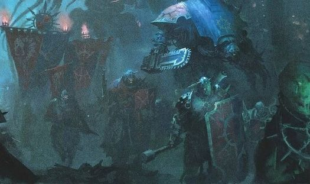

# 0153 骑士家族卫队 Knight Household Guard

精校状态：中文行文已逐段精校，部分术语仍为暂定

分类：通用概念 / 帝国 Imperium / 机械神教 Adeptus Mechanicus / 帝国骑士 Imperial Knight

原文来源：https://www.bilibili.com/opus/1147920496231186432

原作者：帝国神选罐头

原文时间：2025年12月19日 09:57

[返回分类目录](目录.md) · [全书目录](../../目录.md)

<!-- A0153-B0001 -->
**英文原文**

Knight Household Guards, or also known as Militias, are the warrior troops of Knight Houses and Chaos Knight Houses.

<!-- /A0153-B0001 -->

<!-- A0153-B0002 -->

原译文

骑士家族卫队，也称为民兵，是骑士家族和混沌骑士家族的战士部队。

**校订译文**

骑士家族卫队，也称为民兵，是骑士家族和混沌骑士家族的战士部队。

<!-- /A0153-B0002 -->

<!-- A0153-B0003 图片 -->

<!-- A0153-B0004 -->

原译文

Chaos Knight Household Guards 混沌骑士家族卫队

**校订译文**

Chaos Knight Household Guards 混沌骑士家族卫队

<!-- /A0153-B0004 -->

<!-- A0153-B0005 -->
## Description 描述

<!-- /A0153-B0005 -->

<!-- A0153-B0006 -->
**英文原文**

Raised from a Knight World's population or from allied Forge Worlds, Household Guards aid in defending their Knight Houses' Homeworlds and can also accompany them into battle. While they do resemble Planetary Defence Forces, Household Guards possess a much smaller amount of heavy equipment.

<!-- /A0153-B0006 -->

<!-- A0153-B0007 -->

原译文

从骑士世界的人口或盟友铸造世界长大的，家族卫队帮助保卫他们骑士家族的家园世界，也可以陪伴他们进入战斗。虽然他们确实类似于行星防御部队，但家族卫队拥有的重型装备要少得多。

**校订译文**

家族卫队从骑士世界居民或盟友铸造世界人员中征募，负责保卫家族母星，也可随骑士出征。他们与行星防卫军相似，但拥有的重装备少得多。

<!-- /A0153-B0007 -->

<!-- A0153-B0008 -->
**英文原文**

Some Knight Houses are capable of fielding large numbers of Household Guard formations, which go by various names. High Kings and Barons can have their own personal Household Guard, which can result in their warriors having different uniforms and weaponry, than those who serve the entire Knight House.

<!-- /A0153-B0008 -->

<!-- A0153-B0009 -->

原译文

一些骑士家族能够部署大量的家族卫队编队，这些编队有各种各样的名字。至高王和男爵可以拥有自己的私人家族卫队，这可能会导致他们的战士与为整个骑士家族服务的战士拥有不同的制服和武器。

**校订译文**

一些骑士家族能部署规模庞大的卫队，其部队名称各不相同。至高王和男爵也可拥有私人卫队，服装和武备可能不同于为整个家族效力的部队。

<!-- /A0153-B0009 -->

<!-- A0153-B0010 -->
## Imperial Knight Household Guard 帝国骑士家族卫队

<!-- /A0153-B0010 -->

<!-- A0153-B0011 -->
**英文原文**

Genebound - Birth - House Khord

<!-- /A0153-B0011 -->

<!-- A0153-B0012 -->

原译文

基因义务 - 裔 - 霍尔德家族

**校订译文**

基因缚誓者；编制称“裔”；隶属霍尔德家族。

**校注：** 英文列表为部队名称、编制称谓、所属家族三项；Birth、Vigil、Following、Chain、Fang 是当地编制称谓，未据此臆定人数。名称译法均暂定；Joviann 为专名，不直接认定指太阳系木星。

<!-- /A0153-B0012 -->

<!-- A0153-B0013 -->
**英文原文**

Joviann Watchmen - Vigil - House Barragon

<!-- /A0153-B0013 -->

<!-- A0153-B0014 -->

原译文

木星守望者 - 守夜人 - 巴拉贡家族

**校订译文**

乔维安守望者；编制称“守夜队”；隶属巴拉贡家族。

<!-- /A0153-B0014 -->

<!-- A0153-B0015 -->
**英文原文**

Netsmen - Squadron - House Hasburg

<!-- /A0153-B0015 -->

<!-- A0153-B0016 -->

原译文

网人 - 中队 - 哈斯堡家族

**校订译文**

网人；编制为中队；隶属哈斯堡家族。

<!-- /A0153-B0016 -->

<!-- A0153-B0017 -->
**英文原文**

Palatial Guard - Cohort - House Callivant

<!-- /A0153-B0017 -->

<!-- A0153-B0018 -->

原译文

宫廷卫队 - 大队 - 卡利万特家族

**校订译文**

宫廷卫队；编制为大队；隶属卡利万特家族。

<!-- /A0153-B0018 -->

<!-- A0153-B0019 -->
**英文原文**

Sacristan Guard - High King Bryce of House Griffith

<!-- /A0153-B0019 -->

<!-- A0153-B0020 -->

原译文

圣器守司卫队 - 格里菲斯家族的至高王布莱斯

**校订译文**

圣物保管者卫队；效忠格里菲斯家族至高王布莱斯。

<!-- /A0153-B0020 -->

<!-- A0153-B0021 -->
**英文原文**

Yeomen - Following - House Hawkshroud

<!-- /A0153-B0021 -->

<!-- A0153-B0022 -->

原译文

自由民 - 追随者 - 鹰覆家族

**校订译文**

自由民；编制称“扈从队”；隶属覆隼家族。

<!-- /A0153-B0022 -->

<!-- A0153-B0023 -->
## Chaos Knight Household Guard 混沌骑士家族卫队

<!-- /A0153-B0023 -->

<!-- A0153-B0024 -->
**英文原文**

Immortals - Battalion - House Mandrakor

<!-- /A0153-B0024 -->

<!-- A0153-B0025 -->

原译文

不朽者 - 营 - 曼德拉科尔家族

**校订译文**

不朽者；编制为营；隶属曼德拉科尔家族。

<!-- /A0153-B0025 -->

<!-- A0153-B0026 -->
**英文原文**

Indentured Militia - Chain - House Khomentis

<!-- /A0153-B0026 -->

<!-- A0153-B0027 -->

原译文

契约民兵 - 链条 - 科门蒂斯家族

**校订译文**

契约民兵；编制称“链”；隶属科门蒂斯家族。

<!-- /A0153-B0027 -->

<!-- A0153-B0028 -->
**英文原文**

Iron Guard - Regiment - House Khymere

<!-- /A0153-B0028 -->

<!-- A0153-B0029 -->

原译文

钢铁卫队 - 兵团 - 凯米尔家族

**校订译文**

钢铁卫队；编制为团；隶属凯米尔家族。

<!-- /A0153-B0029 -->

<!-- A0153-B0030 -->
**英文原文**

Night Watchmen - Phalanx - House Black

<!-- /A0153-B0030 -->

<!-- A0153-B0031 -->

原译文

夜晚守望者 - 方阵 - 布莱克家族

**校订译文**

夜间守望者；编制为方阵；隶属布莱克家族。

<!-- /A0153-B0031 -->

<!-- A0153-B0032 -->
**英文原文**

Wyrm-guard - Fang - House Lucaris

<!-- /A0153-B0032 -->

<!-- A0153-B0033 -->

原译文

妖龙卫队 - 獠牙 - 卢卡里斯家族

**校订译文**

妖龙卫队；编制称“獠牙”；隶属卢卡里斯家族。

<!-- /A0153-B0033 -->

本篇核心术语与暂定项

以下列出本篇出现的英文原形及核心术语表用词。同形词可能指不同对象，具体词义以本篇正文和校注为准；单复数、别名和仅见于图注的名称可能尚未列入。完整候选见[术语表](../../术语表/双语术语候选.csv)。

| 英文 | 采用中文 | 状态 |
| --- | --- | --- |
| Equipment | 装备 | 编辑用语已统一 |
| Phalanx | 山阵号 | 暂定 |
| Sacristan | 圣物保管者（骑士职务）／萨克里斯坦（世界） | 语境定译·官方待核 |
| House Hawkshroud | 覆隼家族 | 暂定·官方待核 |
| Genebound | 基因缚誓者 | 暂定·官方待核 |
| Joviann Watchmen | 乔维安守望者 | 暂定·官方待核 |
| Vigil | 警戒团（静默修女编制）／警戒堡（红蝎空间站）／守夜星（行星） | 语境定译·官方待核 |
| Cohort | 大队 | 暂定·官方待核 |
| Immortals | 不朽者 | 官方已核对 |
| Knight World | 骑士世界 | 暂定·官方待核 |
| Knight House | 骑士家族 | 暂定·官方待核 |
| House Griffith | 格里菲斯家族 | 暂定·官方待核 |

