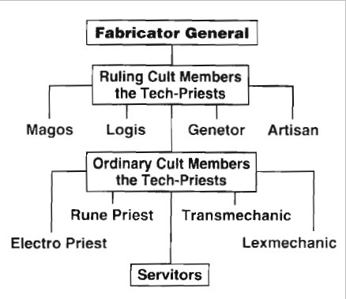

# 0155 技术祭司 Tech-priest

精校状态：中文行文已逐段精校，部分术语仍为暂定

分类：通用概念 / 帝国 Imperium / 机械神教 Adeptus Mechanicus / 帝国骑士 Imperial Knight

原文来源：https://www.bilibili.com/opus/1144638149141463042

原作者：帝国神选罐头

原文时间：2025年12月10日 13:40

[返回分类目录](目录.md) · [全书目录](../../目录.md)

原篇名：技术神甫 Tech-priest

<!-- A0155-B0001 -->
**英文原文**

A Tech-priest is an Adept of the Adeptus Mechanicus. They are the members of the Cult Mechanicus, a priesthood which forms a hierarchy of technicians, scientists, and religious leaders. The Tech-priests provide the rest of the Imperium with its technicians and engineers.

<!-- /A0155-B0001 -->

<!-- A0155-B0002 -->

原译文

技术神甫是机械神教的专家。他们是机械教派的成员，这是一个由技术人员、科学家和宗教领袖组成的等级制度。技术神甫为帝国的其他部分提供技术人员和工程师。

**校订译文**

技术祭司是机械修会的专业人员，属于由技术人员、科学家与宗教领袖组成的机械教派等级体系。他们为帝国其他机构提供技术人员和工程师。

<!-- /A0155-B0002 -->

<!-- A0155-B0003 图片 -->

<!-- A0155-B0004 -->

原译文

Tech-priest 技术神甫

**校订译文**

Tech-priest 技术祭司

<!-- /A0155-B0004 -->

<!-- A0155-B0005 -->
**英文原文**

Though their bodies often incorporate many mechanical components, Tech-priests are human or abhuman, and often use slave-machine Servitors to carry out heavy and monotonous labour for them.

<!-- /A0155-B0005 -->

<!-- A0155-B0006 -->

原译文

虽然他们的身体经常包含许多机械部件，但技术神甫是人或亚人，经常使用奴隶机器机仆为他们进行繁重而单调的劳动。

**校订译文**

虽然他们的身体经常包含许多机械部件，但技术祭司是人或亚人，经常使用奴隶机器机仆为他们进行繁重而单调的劳动。

<!-- /A0155-B0006 -->

<!-- A0155-B0007 -->
## Overview 概述

<!-- /A0155-B0007 -->

<!-- A0155-B0008 -->
**英文原文**

Tech-Priests are Adepts of the Cult Mechanicus. The premiere engineers and technological specialists in the Imperium, they accompany nearly every branch of the Imperium to maintain machinery. Tech-Priests will provide religious rites, anti-corruption wards, and repairs to Machine Spirits to any machine they are qualified to oversee.

<!-- /A0155-B0008 -->

<!-- A0155-B0009 -->

原译文

技术神甫是机械教派的专家。作为帝国首屈一指的工程师和技术专家，他们几乎陪伴帝国的每一个分支来维护机器。技术神甫将为他们有资格监督的任何机器提供宗教仪式、反腐化保护和机魂维修。

**校订译文**

技术祭司是机械教派的专家，也是帝国首屈一指的工程师与技术人员。他们几乎随行于帝国所有机构，负责维护机器；对于自己有资格监管的机器，他们举行宗教仪式、防范腐化，并维护机魂。

<!-- /A0155-B0009 -->

<!-- A0155-B0010 图片 -->

<!-- A0155-B0011 -->

原译文

Tech-Priest 技术神甫

**校订译文**

Tech-Priest 技术祭司

<!-- /A0155-B0011 -->

<!-- A0155-B0012 -->
**英文原文**

The term ‘Tech-Priest’ covers a broad category of thousands of different roles. Genetors probe the mysteries of the biological, creating ever stranger cyborgs and slaughtering xenos by the thousand in order to excise yet more secrets. Artisans create and restore truly wondrous weapons of war, from ornate gamma pistols to the mind-boggling immensity of the Ark Mechanicus. Magi of all stripes pursue esoteric agendas as likely to end in triumph as they are disaster. Across the galaxy Transmechanics, Lexmechanics, Enginseers, Secutors, Trifactors, Myrmidons and Technoshamans labor alongside the wider Imperium to bolster Humanity’s war machine. Within the Adeptus Mechanicus the ranks become even more esoteric. Each Fabricator Locum can call upon Magi Technicus, Metallurgicus, Alchemys, Cogitatrices, Pedanticum, Tech-assassins, hive monitors and Holy Requisitioners, who in turn can command a body of fabricators minoris, Fulgurites, Corpuscarii, overseers, underseers, stasis clerks, and techno-dervishes. To even begin to comprehend the towering edifice of the Cult Mechanicus takes far more processing power than the human brain can provide. When speaking with a tech priest, it can be beneficial to instead take into account the subtlety of each magos’ specialisation and address them accordingly. Ignorantly addressing a magos simply as a tech-priest could carry a demeaning aspect, due to how bluntly broad a category it is.

<!-- /A0155-B0012 -->

<!-- A0155-B0013 -->

原译文

“技术神甫”一词涵盖了数千种不同角色的广泛类别。基因士探索生物学的奥秘，创造出越来越怪异的半机械人，屠杀成千上万的异型，以消除更多的秘密。铸造士创造并修复了真正奇妙的战争武器，从华丽的伽马手枪到令人难以置信的机械方舟。形形色色的圣贤士追求深奥的议程，既可能以胜利告终，也可能以灾难告终。在整个银河系，传讯机僧、思律机僧、工造士、追击士、辅军精锐和技术萨满与更广泛的帝国并肩作战，以支持人类的战争机器。在机械神教内部，等级变得更加深奥。每个铸造代理都可以召唤技术贤者、冶炼贤者、炼金贤者、沉思贤者、迂究贤者、技术刺客、巢都监督者和神圣探求者，他们反过来可以指挥一个由铸造下属组成的团体、雷岩电僧、法身电僧、监督者、监督员、停滞书记员和技术苦行僧。甚至要开始理解机械神教的高耸建筑，需要比人脑提供的处理能力多得多的处理能力。当与技术神甫交谈时，考虑到每个贤者的专业化的微妙之处并相应地解决这些问题可能是有益的。由于这是一个非常宽泛的类别，简单地将一个贤者称为技术神甫可能会带有贬低的意味。

**校订译文**

“技术祭司”涵盖数千种不同职责。基因士探索生物奥秘，创造愈发奇异的半机械生命，并屠杀大量异形以剖取更多秘密。铸造士制造、修复神奇的战争武器，从精致的伽马手枪到巨大得令人难以置信的机械方舟。各种贤者追求深奥目标，既可能成功，也可能酿成灾难。银河各地的传讯机僧、思律机僧、工造士、追击士、三联技师、辅军精锐和技术萨满，与帝国各机构协作，维持人类战争机器的运转。机械修会内部的等级更为晦涩：每位铸造代理都可调用技术、冶金、炼金、计算及学究等领域的贤者，以及技术刺客、巢都监查员和神圣征调员；这些人又统辖次级铸造师、电岩与科普斯卡驭电祭司、各级监工、静滞书记员和技术苦行僧。即便只想初步理解这一庞大体系，也需要远超人脑的处理能力。与技术祭司交谈时，最好了解其专业细分，并使用相应称谓。对一位贤者只笼统称“技术祭司”，可能因称谓过于宽泛而显得轻慢。

**校注：** 原译漏列 Trifactors，暂补“三联技师”；原文 excise secrets 为比喻性表述，按从异形肉体剖取秘密理解，不译为消除秘密。

<!-- /A0155-B0013 -->

<!-- A0155-B0014 -->
**英文原文**

Tech-Priests are often fast-grown in vats, infused with a instinctual level of knowledge due to data uplinks during their gestation. Members are born already post-adolescence and are promptly put to work.

<!-- /A0155-B0014 -->

<!-- A0155-B0015 -->

原译文

技术神甫通常在缸中快速成长，由于在孕育期间的数据上行链路，他们被灌输了本能的知识水平。成员们在青春期后出生，并迅速投入工作。

**校订译文**

技术祭司通常在培养缸中加速发育，并通过孕育期间的数据连接灌输知识，使之成为本能。他们离开培养缸时已过青春期，随即投入工作。

<!-- /A0155-B0015 -->

<!-- A0155-B0016 图片 -->

<!-- A0155-B0017 -->

原译文

Squat Tech Priest 矮人技术神甫

**校订译文**

Squat Tech Priest 斯夸特技术祭司

<!-- /A0155-B0017 -->

<!-- A0155-B0018 -->
## Equipment 装备

<!-- /A0155-B0018 -->

<!-- A0155-B0019 -->
**英文原文**

The personal equipment and wargear of a Tech-Priest varies greatly and can consist of anything from standard weaponry to more exotic pieces of Archaeotech. However typical wargear includes their Mechadendrites and an Omnissian Axe which acts as a badge of office. Tech-Priests of militant orders such as a Dominus are equipped with more radical weaponry such as Eradication Rays, Macrostubbers, Phosphor Serpenta, and Volkite Blasters. They are also typically protected by a Refractor Field. Standard Tech-Priest Enginseers are equipped with less exotic weapons, such as a Laspistol and Servo-arms. Tech-priests also have internal computational systems capable of running trillions of calculations in a few seconds.

<!-- /A0155-B0019 -->

<!-- A0155-B0020 -->

原译文

技术神甫的个人装备和战争装备差异很大，可以包括从标准武器到更奇特的考古技术的任何东西。然而，典型的战争装备包括他们的机械触须和作为职位徽章的欧姆尼赛亚之斧。统御贤者等军事组织的技术神甫配备了更激进的武器，如根除射线、宏伐木枪、磷火蛇铳和爆燃爆破枪。他们通常也受到折射立场的保护。标准技术神甫工造士配备了不那么奇特的武器，如激光手枪和伺服臂。技术神甫也有内部计算系统，能够在几秒钟内运行数万亿次计算。

**校订译文**

技术祭司的个人装备差异极大，从普通武器到罕见的古代技术装置都有。常见装备包括机械触须，以及象征职务的欧姆尼赛亚之斧。主宰者等战斗修会成员使用更激进的武备，如根除射线、宏型短管枪、磷火蛇铳和爆燃爆破枪，并常有折射力场保护。普通技术祭司机械教士的装备较朴素，如激光手枪和伺服臂。技术祭司的体内计算系统，还能在数秒内完成数万亿次运算。

<!-- /A0155-B0020 -->

<!-- A0155-B0021 图片 -->

<!-- A0155-B0022 -->

原译文

Tech-Priest 技术神甫

**校订译文**

Tech-Priest 技术祭司

<!-- /A0155-B0022 -->

<!-- A0155-B0023 -->
## Hierarchy 等级制度

<!-- /A0155-B0023 -->

<!-- A0155-B0024 -->
### Fabricator-General 铸造将军

<!-- /A0155-B0024 -->

<!-- A0155-B0025 -->
**英文原文**

Every Forge World maintains a ruling Fabricator-General and their subordinate Fabricator Locum. However, it is the Fabricator-General of Mars that is the leader of the Adeptus Mechanicus, and as the Magos Mechanicus is also the head of its Cult Mechanicus. He also invariably holds a position on the High Lords of Terra. Accordingly his subordinate and second-in-command is the Fabricator Locum of Mars.

<!-- /A0155-B0025 -->

<!-- A0155-B0026 -->

原译文

每个铸造世界都有一个执政的铸造将军和他们的下属铸造代理。然而，正是火星的铸造将军是机械神教的领导者，而作为机械教的贤者也是其机械教派的首领。他也总是在泰拉的高领主中占有一席之地。因此，他的下属和二把手是火星铸造代理。

**校订译文**

每个铸造世界由铸造将军及其下属铸造代理统治。其中，火星铸造将军领导整个机械修会，并以“机械教贤者”的身份担任机械教派之首，始终在泰拉高领主中占有一席。火星铸造代理则是其副手。

<!-- /A0155-B0026 -->

<!-- A0155-B0027 图片 -->

<!-- A0155-B0028 -->

原译文

The Tech Priest hierarchy 技术神甫等级制度

**校订译文**

The Tech Priest hierarchy 技术祭司等级制度

<!-- /A0155-B0028 -->

<!-- A0155-B0029 -->
### The Ruling Priesthood 统治祭司阶层

原题：The Ruling Priesthood 执政神甫

<!-- /A0155-B0029 -->

<!-- A0155-B0030 -->

原译文

Forge Master 铸造大师

**校订译文**

Forge Master 铸造大师

<!-- /A0155-B0030 -->

<!-- A0155-B0031 -->

原译文

Magos 圣贤士(贤者)

**校订译文**

Magos 贤者

<!-- /A0155-B0031 -->

<!-- A0155-B0032 -->

原译文

Logis 逻辑士

**校订译文**

Logis 逻辑士

<!-- /A0155-B0032 -->

<!-- A0155-B0033 -->

原译文

Genetor 基因士

**校订译文**

Genetor 基因士

<!-- /A0155-B0033 -->

<!-- A0155-B0034 -->

原译文

Artisan 铸造士

**校订译文**

Artisan 铸造士

<!-- /A0155-B0034 -->

<!-- A0155-B0035 -->
### The Ordinary Priesthood 普通祭司阶层

原题：The Ordinary Priesthood 普通神甫

<!-- /A0155-B0035 -->

<!-- A0155-B0036 -->

原译文

Cybernetica Datasmith 智控数据铁匠

**校订译文**

Cybernetica Datasmith 智控数据技师

<!-- /A0155-B0036 -->

<!-- A0155-B0037 -->

原译文

Electro-priest 电僧

**校订译文**

Electro-priest 驭电祭司

<!-- /A0155-B0037 -->

<!-- A0155-B0038 -->

原译文

Enginseer 工造士

**校订译文**

Enginseer 工造士

**校注：** 单独职衔 Enginseer 暂沿用工造士；完整兵种名 Tech-Priest Enginseer 则采用 GW 官方“技术祭司机械教士”，保留词条层级差别。

<!-- /A0155-B0038 -->

<!-- A0155-B0039 -->

原译文

Lexmechanic 思律机僧

**校订译文**

Lexmechanic 思律机僧

<!-- /A0155-B0039 -->

<!-- A0155-B0040 -->

原译文

Rune Priest 如尼机僧

**校订译文**

Rune Priest 如尼机僧

<!-- /A0155-B0040 -->

<!-- A0155-B0041 -->
**英文原文**

Sacristan - special Tech-Priests of Imperial Knights

<!-- /A0155-B0041 -->

<!-- A0155-B0042 -->

原译文

圣物保管者 - 帝国骑士的特殊技术神甫

**校订译文**

圣物保管者 - 帝国骑士的特殊技术祭司

<!-- /A0155-B0042 -->

<!-- A0155-B0043 -->

原译文

Transmechanic 传讯机僧

**校订译文**

Transmechanic 传讯机僧

<!-- /A0155-B0043 -->

<!-- A0155-B0044 -->

原译文

Techseer 技术先知

**校订译文**

Techseer 技术先知

<!-- /A0155-B0044 -->

<!-- A0155-B0045 -->

原译文

Techsorcist 技术巫师

**校订译文**

Techsorcist 技术驱魔师

<!-- /A0155-B0045 -->

<!-- A0155-B0046 -->

原译文

Reclaimator 回收士

**校订译文**

Reclaimator 回收士

<!-- /A0155-B0046 -->

<!-- A0155-B0047 -->

原译文

Lectro-Maester 源力大师

**校订译文**

Lectro-Maester 源力大师

<!-- /A0155-B0047 -->

<!-- A0155-B0048 -->

原译文

Manipulus 随军神甫

**校订译文**

Manipulus 操纵者

<!-- /A0155-B0048 -->

<!-- A0155-B0049 图片 -->

<!-- A0155-B0050 -->

原译文

Tech-Priest Manipulus 随军技术神甫

**校订译文**

Tech-Priest Manipulus 技术祭司操纵者

<!-- /A0155-B0050 -->

<!-- A0155-B0051 -->

原译文

Servitor Underseer 机仆监督者

**校订译文**

Servitor Underseer 机仆监督者

<!-- /A0155-B0051 -->

<!-- A0155-B0052 -->
### Tech Adept 技术专家

<!-- /A0155-B0052 -->

<!-- A0155-B0053 -->
**英文原文**

Tech Adepts, tech-adepts or Tech-Priest Adepts, are adept grade members of the Martian priesthood. They are skilled in one or more disciplines. These individuals are fully initiated acolytes of the Cult Mechanicus and form the bulk of its ordained priesthood. Through rune and hammer, the Tech-Adepts are the wards of the arcane and they guard their knowledge jealously.

<!-- /A0155-B0053 -->

<!-- A0155-B0054 -->

原译文

技术专家，技术熟手或技术神甫专家，是火星神甫的专家等级成员。他们精通一个或多个知识领域。这些人是机械教派的完全追随者，构成了其大部分被授予圣职的神甫。通过符文和锤子，技术专家是神秘的守护者，他们小心翼翼地保护着自己的知识。

**校订译文**

技术专家（Tech Adept，亦写作 tech-adept 或 Tech-Priest Adept）是火星祭司体系中具备专家等级的成员，精通一个或多个领域。他们由完成入门仪式的机械教派侍僧晋升而来，构成获授圣职的祭司主体。他们以符文与锤守护技术奥秘，严守自身知识，不容他人染指。

<!-- /A0155-B0054 -->

<!-- A0155-B0055 -->
**英文原文**

Tech-Adepts can be lumped together with some of the lower ranking Tech-Priests of the Martian cult. Although lower ranking, they can still command coteries of thralls, menials, and servitors that serve the Cult of the Machine, if they have the rescources. Although typically assigned maintenance and construction duties by their masters, there are a variety of specialist Tech-Adepts. Adepts of varying degrees also have the potential to control and command a myriad of powerful arcane weapons, automata, and battlegear depending on their own skill and resources.

<!-- /A0155-B0055 -->

<!-- A0155-B0056 -->

原译文

技术专家可以与火星教派中一些级别较低的技术神甫归为一类。虽然级别较低，但如果他们有资源的话，他们仍然可以指挥一群为机械教派服务的奴工、仆人和机仆。虽然通常由他们的主人分配维护和施工任务，但也有各种各样的专业技术专家。不同程度的专家也有可能根据自己的技能和资源控制和指挥无数强大的神秘武器、自动机兵和战斗装备。

**校订译文**

技术专家通常归入火星教派较低阶的技术祭司。尽管地位不高，只要资源允许，仍能统领成群的奴工、杂役和机仆。他们通常由上级指派维修和建设工作，也有各种专业分工。不同等级的专家可凭自身技能与资源，操控多种强大神秘武器、自动机兵及战斗装备。

<!-- /A0155-B0056 -->

<!-- A0155-B0057 -->
### Acolytum 侍僧

<!-- /A0155-B0057 -->

<!-- A0155-B0058 -->
**英文原文**

Tech acolyta (plural), or acolytum (singular), are unranked members of the Cult Mechanicus that are still learning the lower mysteries of the Machine God. Acolyta are typically intellectually-promising youths or young adults of a Forge World. They are typically set apart from the common rabble to begin their study of the mysteries. What mysteries they eventually specialise in can differ depending who their tech-priest master or mistress is at the time. There is also some degree of autonomy, at least in the latter stages of an individual's studies, to choose who the tech-priest they study under is.

<!-- /A0155-B0058 -->

<!-- A0155-B0059 -->

原译文

技术侍僧（复数）或侍僧（单数）是机械教派中未分配等级的成员，他们仍在学习万机神的较低奥秘。侍僧通常是有智力前途的年轻人或铸造世界的年轻人。他们通常从普通民众中脱颖而出，开始研究这些奥秘。他们最终专攻的奥秘可能因当时他们的技术神甫主人或女主人是谁而异。至少在个人学习的后期阶段，也有一定程度的自主权，可以选择他们在其下学习的技术神甫是谁。

**校订译文**

技术侍僧的英文复数为 tech acolyta，单数为 acolytum，指尚未获授等级、仍在学习万机神初阶奥秘的机械教派成员。他们通常是铸造世界上聪慧的少年或青年，从普通民众中选出后开始学习。最终专攻的领域，往往取决于所从学的技术祭司；至少在学习后期，他们也有一定自主权，可以选择导师。

<!-- /A0155-B0059 -->

<!-- A0155-B0060 -->
## Notable Tech-Priests 著名技术祭司

原题：Notable Tech-Priests 著名技术神甫

<!-- /A0155-B0060 -->

<!-- A0155-B0061 -->

原译文

Almarax 阿尔马拉克斯

**校订译文**

Almarax 阿尔马拉克斯

<!-- /A0155-B0061 -->

<!-- A0155-B0062 -->

原译文

Aldebrac Vingh 奥尔德布拉克·文

**校订译文**

Aldebrac Vingh 奥尔德布拉克·文

<!-- /A0155-B0062 -->

<!-- A0155-B0063 -->

原译文

Belisarius Cawl 贝利撒留·考尔

**校订译文**

Belisarius Cawl 贝利萨留斯·考尔

<!-- /A0155-B0063 -->

<!-- A0155-B0064 -->
**英文原文**

Callias Rhoda - Xenarite

<!-- /A0155-B0064 -->

<!-- A0155-B0065 -->

原译文

卡利亚斯·罗达 - 异务派

**校订译文**

卡利亚斯·罗达 - 异技派

<!-- /A0155-B0065 -->

<!-- A0155-B0066 -->
**英文原文**

Dagnus-Zek, Tech-Priest Enginseer, took part in Lammas Campaign, was attached to Valstadt 13th Armoured Regiment

<!-- /A0155-B0066 -->

<!-- A0155-B0067 -->

原译文

达格努斯·泽克，技术神甫工造士，参加了拉姆斯战役，隶属于瓦尔施塔特第13装甲兵团

**校订译文**

达格努斯·泽克——技术祭司机械教士，隶属瓦尔施塔特第13装甲团，参加了拉姆斯战役。

<!-- /A0155-B0067 -->

<!-- A0155-B0068 -->

原译文

Daedalosus 代达罗斯

**校订译文**

Daedalosus 代达罗斯

<!-- /A0155-B0068 -->

<!-- A0155-B0069 -->

原译文

Eyrotellamax 埃罗泰拉马克斯

**校订译文**

Eyrotellamax 埃罗泰拉马克斯

<!-- /A0155-B0069 -->

<!-- A0155-B0070 -->

原译文

Faustinius 法斯蒂尼乌斯

**校订译文**

Faustinius 弗斯蒂尼乌斯

<!-- /A0155-B0070 -->

<!-- A0155-B0071 -->

原译文

Fedorovich 费奥多罗维奇

**校订译文**

Fedorovich 费奥多罗维奇

<!-- /A0155-B0071 -->

<!-- A0155-B0072 -->

原译文

Galleus Malthirion 加列乌斯·马尔西里昂

**校订译文**

Galleus Malthirion 加列乌斯·马尔西里昂

<!-- /A0155-B0072 -->

<!-- A0155-B0073 -->

原译文

Garba Mojaro 加尔巴·莫哈罗

**校订译文**

Garba Mojaro 加尔巴·莫哈罗

<!-- /A0155-B0073 -->

<!-- A0155-B0074 -->

原译文

Hadron Omega-7-7 强子·欧米伽-7-7

**校订译文**

Hadron Omega-7-7 哈德隆·欧米伽—7—7

<!-- /A0155-B0074 -->

<!-- A0155-B0075 -->
**英文原文**

Hieronomus Tezla - a radical Xenarite Techpriest

<!-- /A0155-B0075 -->

<!-- A0155-B0076 -->

原译文

希罗诺默斯·特兹拉 - 激进的异务派技术神甫

**校订译文**

希罗诺穆兹·特兹拉——激进的异技派技术祭司。

<!-- /A0155-B0076 -->

<!-- A0155-B0077 -->

原译文

Ipluvien Maximal 伊普卢维恩·马克西马尔

**校订译文**

Ipluvien Maximal 伊普卢维恩·马克西马尔

<!-- /A0155-B0077 -->

<!-- A0155-B0078 -->

原译文

Jeremet Lyterix 杰雷梅特·莱泰里克斯

**校订译文**

Jeremet Lyterix 杰雷梅特·莱泰里克斯

<!-- /A0155-B0078 -->

<!-- A0155-B0079 -->

原译文

Jung 荣格

**校订译文**

Jung 荣格

<!-- /A0155-B0079 -->

<!-- A0155-B0080 -->

原译文

Kappa-Nu AX77446 卡帕-13 AX77446

**校订译文**

Kappa-Nu AX77446 卡帕—努 AX77446

<!-- /A0155-B0080 -->

<!-- A0155-B0081 -->

原译文

Katrellophil Hess 卡特雷洛菲尔·赫斯

**校订译文**

Katrellophil Hess 卡特雷洛菲尔·赫斯

<!-- /A0155-B0081 -->

<!-- A0155-B0082 -->

原译文

Kayex-8 凯克斯-8

**校订译文**

Kayex-8 凯克斯-8

<!-- /A0155-B0082 -->

<!-- A0155-B0083 -->
**英文原文**

Larsen van der Grauss - Lectro-Maester

<!-- /A0155-B0083 -->

<!-- A0155-B0084 -->

原译文

拉尔森·范·德·格罗斯 - 源力大师

**校订译文**

拉尔森·范·德·格罗斯 - 源力大师

<!-- /A0155-B0084 -->

<!-- A0155-B0085 -->

原译文

Lunete 鲁内特

**校订译文**

Lunete 鲁内特

<!-- /A0155-B0085 -->

<!-- A0155-B0086 -->

原译文

Molox 莫洛克斯

**校订译文**

Molox 莫洛克斯

<!-- /A0155-B0086 -->

<!-- A0155-B0087 -->

原译文

Phaeton Laurentis 法顿·劳伦蒂斯

**校订译文**

Phaeton Laurentis 法顿·劳伦蒂斯

<!-- /A0155-B0087 -->

<!-- A0155-B0088 -->

原译文

Reditus 雷迪图斯

**校订译文**

Reditus 雷迪图斯

<!-- /A0155-B0088 -->

<!-- A0155-B0089 -->

原译文

Satavic Yuel 萨塔维克·约尔

**校订译文**

Satavic Yuel 萨塔维克·约尔

<!-- /A0155-B0089 -->

<!-- A0155-B0090 -->

原译文

Scaevola 斯凯沃拉

**校订译文**

Scaevola 斯凯沃拉

<!-- /A0155-B0090 -->

<!-- A0155-B0091 -->

原译文

Schlan 施兰

**校订译文**

Schlan 施兰

<!-- /A0155-B0091 -->

<!-- A0155-B0092 -->

原译文

Solomon Abbadon 所罗门·阿巴顿

**校订译文**

Solomon Abbadon 所罗门·阿巴顿

<!-- /A0155-B0092 -->

<!-- A0155-B0093 -->

原译文

Talin Sherax 塔林·谢拉克斯

**校订译文**

Talin Sherax 塔林·谢拉克斯

<!-- /A0155-B0093 -->

<!-- A0155-B0094 -->

原译文

Vethorel 维托雷尔

**校订译文**

Vethorel 维索雷尔

<!-- /A0155-B0094 -->

<!-- A0155-B0095 -->

原译文

Veriliad 维里利亚德

**校订译文**

Veriliad 维里利亚德

<!-- /A0155-B0095 -->

<!-- A0155-B0096 -->

原译文

Videx 维迪克斯

**校订译文**

Videx 维迪克斯

<!-- /A0155-B0096 -->

<!-- A0155-B0097 -->

原译文

Vidrillian 维德里安

**校订译文**

Vidrillian 维德里安

<!-- /A0155-B0097 -->

<!-- A0155-B0098 -->

原译文

Yeltrix 耶尔特里克斯

**校订译文**

Yeltrix 耶尔特里克斯

<!-- /A0155-B0098 -->

<!-- A0155-B0099 -->

原译文

Xaulus Sigma-9 克索卢斯·西格玛-9

**校订译文**

Xaulus Sigma-9 克索卢斯·西格玛-9

<!-- /A0155-B0099 -->

<!-- A0155-B0100 -->
## Known Tech-Adepts 已知技术专家

<!-- /A0155-B0100 -->

<!-- A0155-B0101 -->

原译文

Mu Grentille 穆·格伦蒂勒

**校订译文**

Mu Grentille 穆·格伦蒂勒

<!-- /A0155-B0101 -->

<!-- A0155-B0102 -->

原译文

Silas Varian 西拉斯·瓦里安

**校订译文**

Silas Varian 西拉斯·瓦里安

<!-- /A0155-B0102 -->

<!-- A0155-B0103 -->
**英文原文**

Qvo - Tech-Adept of Belisarius Cawl.

<!-- /A0155-B0103 -->

<!-- A0155-B0104 -->

原译文

邱弗 - 贝利撒留·考尔的技术专家

**校订译文**

克沃——贝利萨留斯·考尔麾下的技术专家。

<!-- /A0155-B0104 -->

<!-- A0155-B0105 -->

原译文

Lakius Danzager 拉基乌斯·丹扎格尔

**校订译文**

Lakius Danzager 拉基乌斯·丹扎格尔

<!-- /A0155-B0105 -->

本篇核心术语与暂定项

以下列出本篇出现的英文原形及核心术语表用词。同形词可能指不同对象，具体词义以本篇正文和校注为准；单复数、别名和仅见于图注的名称可能尚未列入。完整候选见[术语表](../../术语表/双语术语候选.csv)。

| 英文 | 采用中文 | 状态 |
| --- | --- | --- |
| Adeptus Mechanicus | 机械修会 | 官方已核对 |
| Imperium | 帝国 | 暂定·简称 |
| Cult Mechanicus | 机械教派 | 暂定·概念区分 |
| Tech-Priest | 技术祭司 | 官方已核对 |
| Equipment | 装备 | 编辑用语已统一 |
| Forge World | 铸造世界 | 暂定·官方待核 |
| Abhuman | 亚人 | 暂定·官方待核 |
| Ark Mechanicus | 机械方舟 | 暂定·官方待核 |
| Terra | 泰拉 | 暂定·官方待核 |
| High Lords of Terra | 泰拉高领主 | 暂定·官方待核 |
| Machine God | 万机神 | 暂定·官方待核 |
| Mars | 火星 | 暂定·官方待核 |
| Tech | 技术语 | 暂定·官方待核 |
| Master | 导师（审判庭职衔）／舰务官（舰员职务） | 语境定译·官方待核 |
| Acolytum | 侍僧（智库学徒）／技术侍僧（机械教派） | 语境定译·官方待核 |
| Adept | 帝国任职者（广义）／文吏（行政语境） | 语境定译·官方待核 |
| Fabricator-General | 铸造将军 | 暂定·官方待核 |
| Belisarius Cawl | 贝利萨留斯·考尔 | 官方已核对 |
| Tech-Priest Enginseer | 技术祭司机械教士 | 官方已核对 |
| Fabricator Locum | 铸造代理 | 暂定·官方待核 |
| Enginseer | 工造士 | 暂定·官方待核 |
| Qvo | 克沃 | 暂定·官方待核 |
| Hieronomus Tezla | 希罗诺穆兹·特兹拉 | 暂定·官方待核 |
| Sacristan | 圣物保管者（骑士职务）／萨克里斯坦（世界） | 语境定译·官方待核 |
| Refractor Field | 折射力场 | 暂定·官方待核 |
| Xenos | 异形 | 暂定·官方待核 |
| Acolyta | 侍僧 | 暂定·官方待核 |
| Menials | 杂役 | 暂定·官方待核 |
| Corruption | 腐败 | 暂定·官方待核 |
| Fabricator | 铸造师 | 暂定·待核官方 |
| Mechadendrites | 机械触须 | 暂定·官方待核 |

