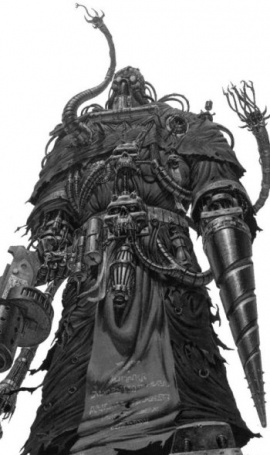

# 0156 贤者 Magi

精校状态：中文行文已逐段精校，部分术语仍为暂定

分类：通用概念 / 帝国 Imperium / 机械神教 Adeptus Mechanicus / 帝国骑士 Imperial Knight

原文来源：https://www.bilibili.com/opus/1177589254160646160

原作者：帝国神选罐头

原文时间：编辑于 2026年07月24日 16:29

[返回分类目录](目录.md) · [全书目录](../../目录.md)

原篇名：圣贤士 Magi

<!-- A0156-B0001 -->
**英文原文**

A Magos (sg. Magos, pl. Magi) is a high ranking member of the Adeptus Mechanicus, and is a devoted disciple of the principles associated with the Machine God. These individuals have perfected as well as refined their field of expertise making them masters of a certain discipline.

<!-- /A0156-B0001 -->

<!-- A0156-B0002 -->

原译文

贤者（贤者，圣贤士）是机械神教的高级成员，是万机神相关法则的忠实信徒。这些人完善了他们的专业领域，使他们成为某一学科的大师。

**校订译文**

贤者（单数 Magos，复数 Magi）是机械修会的高级成员，虔诚信奉万机神相关法则。他们已精研自身专业，成为某一学科的大师。

<!-- /A0156-B0002 -->

<!-- A0156-B0003 图片 -->

<!-- A0156-B0004 -->

原译文

Symbol of the Magi order 圣贤士修会标志

**校订译文**

Symbol of the Magi order 贤者修会标志

<!-- /A0156-B0004 -->

<!-- A0156-B0005 -->
## Overview 概述

<!-- /A0156-B0005 -->

<!-- A0156-B0006 -->
**英文原文**

The Magos' dedication has led to their sacrificing great portions of their body in order to emulate the sacred form of the machine. After decades of service, a Magos has replaced many of his organs and limbs with superior cybernetic implants. As is fitting with the Cult Mechanicus, these replacement limbs and organs never tire or grow weak with age, thus highlighting the greatness of the Machine. Most devout of all is the Rite of Clear Thought, which replaces one hemisphere of the brain with augments to suppress irrational cognition.

<!-- /A0156-B0006 -->

<!-- A0156-B0007 -->

原译文

贤者的奉献精神导致他们牺牲了身体的大部分，以模仿机器的神圣形态。经过几十年的服役，贤者已经用高级智控植入物替换了他的许多器官和四肢。与机械教派相匹配，这些替换的肢体和器官永远不会随着年龄的增长而疲劳或衰弱，从而突显了机械的伟大。最虔诚的是清晰思维仪式，它用增强代替大脑的一个半球，以抑制非理性认知。

**校订译文**

贤者出于虔诚，舍弃身体的大部分，以模仿机器的神圣形态。数十年服役后，他们往往已用先进机械植入物替换许多器官与肢体。依机械教派的观念，这些替代物不会疲倦或随年龄衰弱，彰显机械的伟大。最虔诚者还会接受清晰思维仪式，以机械增强装置替换一侧大脑半球，抑制非理性认知。

<!-- /A0156-B0007 -->

<!-- A0156-B0008 图片 -->

<!-- A0156-B0009 -->

原译文

Magos Delphan Gruss 贤者德尔凡·格鲁斯

**校订译文**

Magos Delphan Gruss 贤者德尔芬·格鲁斯

<!-- /A0156-B0009 -->

<!-- A0156-B0010 -->
**英文原文**

These senior Tech-Priests attend the Machine Altars of the Forge Worlds which contain the sum of knowledge of the Adeptus Mechanicus which in turn represents the will of the Omnissiah.

<!-- /A0156-B0010 -->

<!-- A0156-B0011 -->

原译文

这些高级技术神甫参加铸造世界的机械祭坛，其中包含机械神教的知识总和，这反过来又代表了欧姆尼赛亚的意志。

**校订译文**

这些高级技术祭司侍奉铸造世界的机械祭坛；祭坛汇集机械修会的全部知识，而这些知识被视为欧姆尼赛亚意志的体现。

<!-- /A0156-B0011 -->

<!-- A0156-B0012 -->
## Ranks 等级

<!-- /A0156-B0012 -->

<!-- A0156-B0013 -->
**英文原文**

The offices and titles of the Magos are shifting and complex. Such is their authority that many senior Tech-Priests will adjust their rank in times of war, becoming a Tech-Priest Dominus.

<!-- /A0156-B0013 -->

<!-- A0156-B0014 -->

原译文

贤者的职务和头衔正在变化和复杂。这就是他们的权威，许多高级技术神甫会在战争时期调整他们的等级，成为统御技术神甫。

**校订译文**

贤者的职务与头衔繁复多变。他们权力广泛，许多高级技术祭司可在战时调整身份，担任技术祭司主宰者。

<!-- /A0156-B0014 -->

<!-- A0156-B0015 -->
**英文原文**

The following Magi ranks are known:

<!-- /A0156-B0015 -->

<!-- A0156-B0016 -->

原译文

已知以下圣贤士等级：

**校订译文**

已知以下贤者等级：

<!-- /A0156-B0016 -->

<!-- A0156-B0017 -->
**英文原文**

Prime Hermeticon - Highest rank

<!-- /A0156-B0017 -->

<!-- A0156-B0018 -->

原译文

赫尔墨斯首席 - 最高级别

**校订译文**

赫尔墨斯首席 - 最高级别

<!-- /A0156-B0018 -->

<!-- A0156-B0019 -->

原译文

Lord Dogma 教条之主

**校订译文**

Lord Dogma 教条之主

<!-- /A0156-B0019 -->

<!-- A0156-B0020 -->

原译文

Veneratus 尊崇

**校订译文**

Veneratus 尊崇

<!-- /A0156-B0020 -->

<!-- A0156-B0021 -->

原译文

Mechae Moribundus 终末机械

**校订译文**

Mechae Moribundus 终末机械

<!-- /A0156-B0021 -->

<!-- A0156-B0022 -->

原译文

Invictus Acquisitor 常胜征服者

**校订译文**

Invictus Acquisitor 常胜求知者

**校注：** Acquisitor 指获取、收集者，原译征服者混同 conqueror。暂译常胜求知者，仍待正式职衔译名核实。

<!-- /A0156-B0022 -->

<!-- A0156-B0023 -->

原译文

Gerontocrat 统御长者

**校订译文**

Gerontocrat 统御长者

<!-- /A0156-B0023 -->

<!-- A0156-B0024 -->
**英文原文**

Data-Predator - Lowest rank

<!-- /A0156-B0024 -->

<!-- A0156-B0025 -->

原译文

数据掠夺者 - 最低级别

**校订译文**

数据掠夺者 - 最低级别

<!-- /A0156-B0025 -->

<!-- A0156-B0026 -->
**英文原文**

Magi that have mastered their respective field are known as an Archmagos. Another overseer rank whose exact position in the hierarchy is unknown is known as an Overseer-Imperator.

<!-- /A0156-B0026 -->

<!-- A0156-B0027 -->

原译文

掌握了各自领域的圣贤士被称为大贤者。另一个在等级制度中确切位置未知的监督者级别被称为监督者统帅。

**校订译文**

精通自身领域的贤者称为大贤者。另有一种监督职衔称监督者统帅，其在等级体系中的确切位置不明。

<!-- /A0156-B0027 -->

<!-- A0156-B0028 -->
## The Orders of the High Tech-Arcana 高级技术奥秘修会

<!-- /A0156-B0028 -->

<!-- A0156-B0029 -->
**英文原文**

The various disciplines and specializations of Magi are known as the Orders of High-Tech Arcana. Almost every Forge World has representatives of these orders and they wield much power within the Mechanicum. While there exist many hundreds of orders of tech-arcana, seven of these dominated the politics of the Mechanicum at least at the time of the Great Crusade. These were:

<!-- /A0156-B0029 -->

<!-- A0156-B0030 -->

原译文

圣贤士的各种学科和专业领域被称为高级技术奥秘修会。几乎每个铸造世界都有这些组织的代表，他们在机械教内拥有很大的权力。虽然存在数百个技术奥秘修会，但其中七种至少在大远征时期主导了机械教的政治事务。这些是：

**校订译文**

贤者的各种学科和专业领域被称为高级技术奥秘修会。几乎每个铸造世界都有这些组织的代表，他们在机械教内拥有很大的权力。虽然存在数百个技术奥秘修会，但其中七种至少在大远征时期主导了机械教的政治事务。这些是：

<!-- /A0156-B0030 -->

<!-- A0156-B0031 -->
**英文原文**

Archimandrite - Most prestigious of the orders who practice Cybertheurgy.

<!-- /A0156-B0031 -->

<!-- A0156-B0032 -->

原译文

技术牧首 - 最有声望的修会，训练智控神术师。

**校订译文**

技术牧首——施行智控神术的修会中最负盛名者。

<!-- /A0156-B0032 -->

<!-- A0156-B0033 -->

原译文

Lacrymaerta 拉克瑞玛塔

**校订译文**

Lacrymaerta 拉克瑞玛塔

<!-- /A0156-B0033 -->

<!-- A0156-B0034 -->

原译文

Myrmidax 精锐御首

**校订译文**

Myrmidax 精锐御首

<!-- /A0156-B0034 -->

<!-- A0156-B0035 -->

原译文

Malagra 马拉格拉

**校订译文**

Malagra 马拉格拉

<!-- /A0156-B0035 -->

<!-- A0156-B0036 -->

原译文

Reductor 源还

**校订译文**

Reductor 源还

<!-- /A0156-B0036 -->

<!-- A0156-B0037 -->

原译文

Cybernetica 智控

**校订译文**

Cybernetica 智控

<!-- /A0156-B0037 -->

<!-- A0156-B0038 -->

原译文

Macrotek 宏技

**校订译文**

Macrotek 宏技

<!-- /A0156-B0038 -->

<!-- A0156-B0039 -->

原译文

Others include:其他包括：

**校订译文**

Others include:其他包括：

<!-- /A0156-B0039 -->

<!-- A0156-B0040 -->
**英文原文**

Adnector Concillium - Maintain the Golden Throne

<!-- /A0156-B0040 -->

<!-- A0156-B0041 -->

原译文

统合议会- 维护黄金王座

**校订译文**

统合议会- 维护黄金王座

<!-- /A0156-B0041 -->

<!-- A0156-B0042 -->

原译文

Magos Activator 催化贤者

**校订译文**

Magos Activator 催化贤者

<!-- /A0156-B0042 -->

<!-- A0156-B0043 -->

原译文

Magos Alchemys 炼金贤者

**校订译文**

Magos Alchemys 炼金贤者

<!-- /A0156-B0043 -->

<!-- A0156-B0044 -->
**英文原文**

Magos Autokratoris - Oversee Titan maintenance

<!-- /A0156-B0044 -->

<!-- A0156-B0045 -->

原译文

独裁贤者 - 监督泰坦的维护

**校订译文**

独裁贤者 - 监督泰坦的维护

**校注：** Magos Autokratoris 沿用独裁贤者，与军事指挥职衔 Magos Dominus 统御贤者区分。

<!-- /A0156-B0045 -->

<!-- A0156-B0046 -->

原译文

Magos Auxilia 辅军贤者

**校订译文**

Magos Auxilia 辅军贤者

<!-- /A0156-B0046 -->

<!-- A0156-B0047 -->
**英文原文**

Magos Biologis/Magos Genetor - Specialized in biological systems

<!-- /A0156-B0047 -->

<!-- A0156-B0048 -->

原译文

生物贤者/基因贤者 - 专门研究生物系统

**校订译文**

生物贤者/基因贤者 - 专门研究生物系统

<!-- /A0156-B0048 -->

<!-- A0156-B0049 -->

原译文

Magos Biologis Neuralis 神经生物贤者

**校订译文**

Magos Biologis Neuralis 神经生物贤者

<!-- /A0156-B0049 -->

<!-- A0156-B0050 -->

原译文

Magos Biologis Xenologis 异型生物贤者

**校订译文**

Magos Biologis Xenologis 异形生物贤者

<!-- /A0156-B0050 -->

<!-- A0156-B0051 -->

原译文

Magos Cartographicus 制图贤者

**校订译文**

Magos Cartographicus 制图贤者

<!-- /A0156-B0051 -->

<!-- A0156-B0052 -->

原译文

Magos Cordantor 统协贤者

**校订译文**

Magos Cordantor 统协贤者

<!-- /A0156-B0052 -->

<!-- A0156-B0053 -->
**英文原文**

Magos Dominus - Military commander

<!-- /A0156-B0053 -->

<!-- A0156-B0054 -->

原译文

统御贤者 - 军事指挥官

**校订译文**

统御贤者 - 军事指挥官

<!-- /A0156-B0054 -->

<!-- A0156-B0055 -->

原译文

Magos Esotericus 秘传贤者

**校订译文**

Magos Esotericus 秘传贤者

<!-- /A0156-B0055 -->

<!-- A0156-B0056 -->

原译文

Magos-Ethericus 以太贤者

**校订译文**

Magos-Ethericus 以太贤者

<!-- /A0156-B0056 -->

<!-- A0156-B0057 -->
**英文原文**

Magos Executor Fetial - Ambassador, go-between, arranger: purposefuly uses only subtle augmetics to appear reassuring and comfortable with non-Mechanicus.

<!-- /A0156-B0057 -->

<!-- A0156-B0058 -->

原译文

执交贤者 - 大使、中间人、组织者：有目的地只使用微妙的增强，让非机械教的人感到安心和舒适。

**校订译文**

执交贤者——担任大使、居间人和协调者。他们刻意只采用不显眼的机械增强，让机械教之外的人感到安心自在。

<!-- /A0156-B0058 -->

<!-- A0156-B0059 -->
**英文原文**

Magos Explorator - Seeks out data for the Quest for Knowledge

<!-- /A0156-B0059 -->

<!-- A0156-B0060 -->

原译文

探索贤者 - 为追求知识寻找数据

**校订译文**

探索贤者 - 为追求知识寻找数据

<!-- /A0156-B0060 -->

<!-- A0156-B0061 -->

原译文

Magos-Fissilum 裂光贤者

**校订译文**

Magos-Fissilum 裂光贤者

<!-- /A0156-B0061 -->

<!-- A0156-B0062 -->

原译文

Magos Geologis 地质贤者

**校订译文**

Magos Geologis 地质贤者

<!-- /A0156-B0062 -->

<!-- A0156-B0063 -->

原译文

Magos Gladius 短剑贤者

**校订译文**

Magos Gladius 短剑贤者

<!-- /A0156-B0063 -->

<!-- A0156-B0064 -->
**英文原文**

Magos-Haptic - Charged with the care and optimisation of Serberys Corps Cybercanid mounts.

<!-- /A0156-B0064 -->

<!-- A0156-B0065 -->

原译文

感触贤者 - 负责瑟贝瑞斯兵团智控犬坐骑的护理和优化。

**校订译文**

感触贤者——负责照料、优化塞波利斯兵团的机械犬坐骑。

<!-- /A0156-B0065 -->

<!-- A0156-B0066 -->

原译文

Magos Hesphestari 神铸贤者

**校订译文**

Magos Hesphestari 神铸贤者

<!-- /A0156-B0066 -->

<!-- A0156-B0067 -->

原译文

Magos Immateria 无形贤者

**校订译文**

Magos Immateria 无形贤者

<!-- /A0156-B0067 -->

<!-- A0156-B0068 -->
**英文原文**

Magos Interrogus - Specializes in interrogation

<!-- /A0156-B0068 -->

<!-- A0156-B0069 -->

原译文

问询贤者 - 擅长审讯

**校订译文**

问询贤者 - 擅长审讯

<!-- /A0156-B0069 -->

<!-- A0156-B0070 -->
**英文原文**

Magos Juris - Interested in preventing heretek tech-heresy from corrupting the pure knowledge of the Omnissiah. Many speculate that the Magos Juris are agents of the secretive Lords Dragon. These individuals are akin to the Witch-hunters of the Ordo Hereticus but focus on tech-heresy.

<!-- /A0156-B0070 -->

<!-- A0156-B0071 -->

原译文

法律贤者 - 有兴趣防止异端技术异端腐化欧姆尼赛亚的纯粹知识。许多人猜测，法律贤者是神秘的龙之领主的代理人。这些人类似于讨逆修会的猎巫人，但专注于技术异端。

**校订译文**

律法贤者——致力于防止技术异端玷污欧姆尼赛亚的纯粹知识。许多人猜测，他们是神秘的龙领主的代理人。他们类似异端审判庭的猎巫人，但专门对付技术异端。

<!-- /A0156-B0071 -->

<!-- A0156-B0072 -->

原译文

Magos Lachrimallus 咒泪贤者

**校订译文**

Magos Lachrimallus 咒泪贤者

<!-- /A0156-B0072 -->

<!-- A0156-B0073 -->

原译文

Magos Lictanex 利克塔内克斯贤者

**校订译文**

Magos Lictanex 利克塔内克斯贤者

<!-- /A0156-B0073 -->

<!-- A0156-B0074 -->
**英文原文**

Magos Logi - Uses statistics to predict the future trends and expenditures

<!-- /A0156-B0074 -->

<!-- A0156-B0075 -->

原译文

逻辑贤者 - 使用统计数据预测未来趋势和开支

**校订译文**

逻辑贤者 - 使用统计数据预测未来趋势和开支

<!-- /A0156-B0075 -->

<!-- A0156-B0076 -->

原译文

Magos Metallurgicus 冶金贤者

**校订译文**

Magos Metallurgicus 冶金贤者

<!-- /A0156-B0076 -->

<!-- A0156-B0077 -->

原译文

Magos Ordinatos 机工贤者

**校订译文**

Magos Ordinatos 机工贤者

<!-- /A0156-B0077 -->

<!-- A0156-B0078 -->

原译文

Magos Perscrutor 审查贤者

**校订译文**

Magos Perscrutor 审查贤者

<!-- /A0156-B0078 -->

<!-- A0156-B0079 -->

原译文

Magos Physic 物理贤者

**校订译文**

Magos Physic 物理贤者

<!-- /A0156-B0079 -->

<!-- A0156-B0080 -->
**英文原文**

Magos Prime - Specialized for front-line combat

<!-- /A0156-B0080 -->

<!-- A0156-B0081 -->

原译文

首席贤者 - 专门用于前线战斗

**校订译文**

首席贤者 - 专门用于前线战斗

<!-- /A0156-B0081 -->

<!-- A0156-B0082 -->

原译文

Magos Provender 粮草贤者

**校订译文**

Magos Provender 粮草贤者

<!-- /A0156-B0082 -->

<!-- A0156-B0083 -->
**英文原文**

Magos Psykana - Specialized in crafting warp artifice

<!-- /A0156-B0083 -->

<!-- A0156-B0084 -->

原译文

灵能贤者 - 专门设计亚空间诡计

**校订译文**

灵能贤者——专门制作亚空间造物。

<!-- /A0156-B0084 -->

<!-- A0156-B0085 -->
**英文原文**

Magos Reductor - Specialized in siege warfare

<!-- /A0156-B0085 -->

<!-- A0156-B0086 -->

原译文

源还贤者 - 擅长攻城战

**校订译文**

源还贤者 - 擅长攻城战

<!-- /A0156-B0086 -->

<!-- A0156-B0087 -->

原译文

Magos Technicus 技术贤者

**校订译文**

Magos Technicus 技术贤者

<!-- /A0156-B0087 -->

<!-- A0156-B0088 -->

原译文

Magos Terminus 终末贤者

**校订译文**

Magos Terminus 终末贤者

<!-- /A0156-B0088 -->

<!-- A0156-B0089 -->

原译文

Magos Veneratus 尊崇贤者

**校订译文**

Magos Veneratus 尊崇贤者

<!-- /A0156-B0089 -->

<!-- A0156-B0090 -->

原译文

Magos Vulpaxis 回收贤者

**校订译文**

Magos Vulpaxis 回收贤者

<!-- /A0156-B0090 -->

<!-- A0156-B0091 -->
## Notable Magi 著名贤者

原题：Notable Magi 著名圣贤士

<!-- /A0156-B0091 -->

<!-- A0156-B0092 -->

原译文

Archmagos Esotericus Sigulus Herstoffen 秘传大贤者西格鲁斯·赫托芬

**校订译文**

Archmagos Esotericus Sigulus Herstoffen 秘传大贤者西格鲁斯·赫托芬

<!-- /A0156-B0092 -->

<!-- A0156-B0093 -->

原译文

Archmagos Domina Erane Shurol 统御大贤者埃兰·舒罗尔

**校订译文**

Archmagos Domina Erane Shurol 统御大贤者埃兰·舒罗尔

<!-- /A0156-B0093 -->

<!-- A0156-B0094 -->

原译文

Archmagos Dominus Belisarius Cawl 统御大贤者贝利撒留·考尔

**校订译文**

Archmagos Dominus Belisarius Cawl 统御大贤者贝利萨留斯·考尔

<!-- /A0156-B0094 -->

<!-- A0156-B0095 -->

原译文

Archmagos Prime Draykavac 首席大贤者德拉卡瓦克

**校订译文**

Archmagos Prime Draykavac 首席大贤者德拉卡瓦克

<!-- /A0156-B0095 -->

<!-- A0156-B0096 -->

原译文

Archmagos Prime Hyakintos Myhr 首席大贤者海金托斯·迈尔

**校订译文**

Archmagos Prime Hyakintos Myhr 首席大贤者海金托斯·迈尔

<!-- /A0156-B0096 -->

<!-- A0156-B0097 -->

原译文

Archmagos Prime Inar Satarael 首席大贤者伊纳尔·萨塔瑞尔

**校订译文**

Archmagos Prime Inar Satarael 首席大贤者伊纳尔·萨塔拉埃尔

<!-- /A0156-B0097 -->

<!-- A0156-B0098 -->

原译文

Archmagos Xan-Ebon 大贤者赞-埃本

**校订译文**

Archmagos Xan-Ebon 大贤者赞-埃本

<!-- /A0156-B0098 -->

<!-- A0156-B0099 -->
**英文原文**

Archmagos Lexell Kotov - Led the Kotov Crusade to recover the Breath of the Gods.

<!-- /A0156-B0099 -->

<!-- A0156-B0100 -->

原译文

大贤者列克谢尔·科托夫 - 领导科托夫远征以收回诸神之息。

**校订译文**

大贤者列克谢尔·科托夫 - 领导科托夫远征以收回诸神之息。

<!-- /A0156-B0100 -->

<!-- A0156-B0101 -->
**英文原文**

Archmagos Uchultor L'au - Deimos

<!-- /A0156-B0101 -->

<!-- A0156-B0102 -->

原译文

大贤者乌丘托尔·劳 - 火卫二

**校订译文**

大贤者乌丘托尔·劳 - 迪莫斯

**校注：**  Deimos 按全书统一暂定为迪莫斯，原稿火卫二留对照；同名天体。

<!-- /A0156-B0102 -->

<!-- A0156-B0103 -->
**英文原文**

High-Magos Alchemys Hieronymus - raised a bio-heresy on the Forge World Artemia Majoris

<!-- /A0156-B0103 -->

<!-- A0156-B0104 -->

原译文

高级炼金贤者希罗尼穆斯 - 在铸造世界阿尔忒弥娅主星上提出了一种生物异端

**校订译文**

高级炼金贤者希罗尼穆斯——在铸造世界阿尔忒弥娅主星上进行生物异端活动。

<!-- /A0156-B0104 -->

<!-- A0156-B0105 -->

原译文

High Magos Zadakine Volta 高级贤者扎达基内·沃尔塔

**校订译文**

High Magos Zadakine Volta 高级贤者扎达基内·沃尔塔

<!-- /A0156-B0105 -->

<!-- A0156-B0106 -->

原译文

Magos Antigonus 贤者安提戈努斯

**校订译文**

Magos Antigonus 贤者安提戈努斯

<!-- /A0156-B0106 -->

<!-- A0156-B0107 -->

原译文

Magos Arcotholitis 贤者阿尔科索利蒂斯

**校订译文**

Magos Arcotholitis 贤者阿尔科索利蒂斯

<!-- /A0156-B0107 -->

<!-- A0156-B0108 -->

原译文

Magos Arkhan Land 贤者阿坎·兰德

**校订译文**

Magos Arkhan Land 贤者阿坎·兰德

<!-- /A0156-B0108 -->

<!-- A0156-B0109 -->

原译文

Magos Bure 贤者布雷

**校订译文**

Magos Bure 贤者布雷

<!-- /A0156-B0109 -->

<!-- A0156-B0110 -->

原译文

Magos Chen Phi-8 贤者陈21-8

**校订译文**

Magos Chen Phi-8 贤者陈·斐—8

<!-- /A0156-B0110 -->

<!-- A0156-B0111 -->

原译文

Magos Delphan Gruss 贤者德尔凡·格鲁斯

**校订译文**

Magos Delphan Gruss 贤者德尔芬·格鲁斯

<!-- /A0156-B0111 -->

<!-- A0156-B0112 -->

原译文

Magos Ekaterina Mal-Volos 贤者叶卡特琳娜·马尔-沃洛斯

**校订译文**

Magos Ekaterina Mal-Volos 贤者叶卡特琳娜·马尔-沃洛斯

<!-- /A0156-B0112 -->

<!-- A0156-B0113 -->

原译文

Magos Elizah Kaudge (heretic) 贤者伊莱扎·考吉（异端）

**校订译文**

Magos Elizah Kaudge (heretic) 贤者伊莱扎·考吉（异端）

<!-- /A0156-B0113 -->

<!-- A0156-B0114 -->

原译文

Magos Felicia Tayber 贤者费利西亚·泰伯

**校订译文**

Magos Felicia Tayber 贤者菲莉希亚·泰伯尔

<!-- /A0156-B0114 -->

<!-- A0156-B0115 -->

原译文

Magos Geard Bure 贤者格尔德·布勒

**校订译文**

Magos Geard Bure 贤者格尔德·布勒

<!-- /A0156-B0115 -->

<!-- A0156-B0116 -->

原译文

Magos Gerantor 贤者杰兰托

**校订译文**

Magos Gerantor 贤者杰兰托

<!-- /A0156-B0116 -->

<!-- A0156-B0117 -->

原译文

Magos Grombrindal 贤者格罗姆布林达尔

**校订译文**

Magos Grombrindal 贤者格罗姆布林达尔

<!-- /A0156-B0117 -->

<!-- A0156-B0118 -->

原译文

Magos Hammerweld 贤者锤焊

**校订译文**

Magos Hammerweld 贤者锤焊

<!-- /A0156-B0118 -->

<!-- A0156-B0119 -->

原译文

Magos Herrode 贤者赫罗德

**校订译文**

Magos Herrode 贤者赫罗德

<!-- /A0156-B0119 -->

<!-- A0156-B0120 -->

原译文

Magos Iapetus Borgovda 贤者亚佩图斯·博尔戈夫达

**校订译文**

Magos Iapetus Borgovda 贤者亚佩图斯·博尔戈夫达

<!-- /A0156-B0120 -->

<!-- A0156-B0121 -->
**英文原文**

Magos Klarn — Mechanicus representative to Cadian high command

<!-- /A0156-B0121 -->

<!-- A0156-B0122 -->

原译文

贤者克拉恩 — 卡迪安高级指挥部机械教代表

**校订译文**

贤者克拉恩 — 卡迪安高级指挥部机械教代表

<!-- /A0156-B0122 -->

<!-- A0156-B0123 -->
**英文原文**

Magos K-T B0U/M4N — Made first ever detailed pict-capture of the Eye of Terror possible

<!-- /A0156-B0123 -->

<!-- A0156-B0124 -->

原译文

贤者K-T B0U/M4N — 使首次详细拍摄恐惧之眼成为可能

**校订译文**

贤者K-T B0U/M4N — 使首次详细拍摄恐惧之眼成为可能

<!-- /A0156-B0124 -->

<!-- A0156-B0125 -->

原译文

Magos Morias Leuze 贤者莫里亚斯·勒兹

**校订译文**

Magos Morias Leuze 贤者莫里亚斯·勒兹

<!-- /A0156-B0125 -->

<!-- A0156-B0126 -->
**英文原文**

Magos Nalax - His whole life was dedicated to the recovery of scraps of blueprints and ordering information about the Macharius (Heavy Tank)

<!-- /A0156-B0126 -->

<!-- A0156-B0127 -->

原译文

贤者纳拉克斯 - 他的一生都致力于回收有关马卡里乌斯（重型坦克）的蓝图碎片和组合信息

**校订译文**

贤者纳拉克斯——毕生致力于搜集马卡里亚重型坦克的蓝图残片，并拼合相关信息。

<!-- /A0156-B0127 -->

<!-- A0156-B0128 -->

原译文

Magos Paladius 贤者帕拉迪乌斯

**校订译文**

Magos Paladius 贤者帕拉迪乌斯

<!-- /A0156-B0128 -->

<!-- A0156-B0129 -->

原译文

Magos Passax 贤者帕萨克

**校订译文**

Magos Passax 贤者帕萨克

<!-- /A0156-B0129 -->

<!-- A0156-B0130 -->

原译文

Magos Theraton 贤者塞拉顿

**校订译文**

Magos Theraton 贤者塞拉顿

<!-- /A0156-B0130 -->

<!-- A0156-B0131 -->

原译文

Magos Theta Heironyma 贤者西塔·希罗尼玛

**校订译文**

Magos Theta Heironyma 贤者西塔·希罗尼玛

<!-- /A0156-B0131 -->

<!-- A0156-B0132 -->

原译文

Magos Varnak 贤者瓦尔纳克

**校订译文**

Magos Varnak 贤者瓦尔纳克

<!-- /A0156-B0132 -->

<!-- A0156-B0133 -->

原译文

Magos Vianco Locard 贤者维亚科·洛卡德

**校订译文**

Magos Vianco Locard 贤者维安科·洛卡德

<!-- /A0156-B0133 -->

<!-- A0156-B0134 -->

原译文

Magos Zeta-041 贤者泽塔-041

**校订译文**

Magos Zeta-041 贤者泽塔-041

<!-- /A0156-B0134 -->

<!-- A0156-B0135 -->

原译文

Magos Artisan Hyus N'dai 工匠贤者休斯·恩'代

**校订译文**

Magos Artisan Hyus N'dai 工匠贤者休斯·恩'代

<!-- /A0156-B0135 -->

<!-- A0156-B0136 -->

原译文

Magos Auxilia Chastiol Illustri 辅军贤者夏斯提奥·伊卢斯特里

**校订译文**

Magos Auxilia Chastiol Illustri 辅军贤者夏斯提奥·伊卢斯特里

<!-- /A0156-B0136 -->

<!-- A0156-B0137 -->

原译文

Magos Dominus Gerg Zhokuv 统御贤者格尔格·卓库夫

**校订译文**

Magos Dominus Gerg Zhokuv 统御贤者格尔格·卓库夫

<!-- /A0156-B0137 -->

<!-- A0156-B0138 -->

原译文

Magos Dominus Faustinius 统御贤者弗斯蒂尼乌斯

**校订译文**

Magos Dominus Faustinius 统御贤者弗斯蒂尼乌斯

<!-- /A0156-B0138 -->

<!-- A0156-B0139 -->

原译文

Magos Explorator Cumin 探索贤者卡明

**校订译文**

Magos Explorator Cumin 探索贤者卡明

<!-- /A0156-B0139 -->

<!-- A0156-B0140 -->

原译文

Magos Explorator Vardoman Plosk 探索贤者瓦尔多曼·普洛斯科

**校订译文**

Magos Explorator Vardoman Plosk 探索贤者瓦尔多曼·普洛斯科

<!-- /A0156-B0140 -->

<!-- A0156-B0141 -->

原译文

Magos Explorator Vettius Telok 探索贤者维提乌斯·特洛克

**校订译文**

Magos Explorator Vettius Telok 探索贤者维提乌斯·特洛克

<!-- /A0156-B0141 -->

<!-- A0156-B0142 -->

原译文

Magos Geologis Mendel Gathabosis 地质贤者门德尔·加塔博西斯

**校订译文**

Magos Geologis Mendel Gathabosis 地质贤者门德尔·加塔博西斯

<!-- /A0156-B0142 -->

<!-- A0156-B0143 -->

原译文

Magos Reductor Calleb Decima 源还贤者卡莱布·德西玛

**校订译文**

Magos Reductor Calleb Decima 源还贤者卡莱布·德西玛

<!-- /A0156-B0143 -->

本篇核心术语与暂定项

以下列出本篇出现的英文原形及核心术语表用词。同形词可能指不同对象，具体词义以本篇正文和校注为准；单复数、别名和仅见于图注的名称可能尚未列入。完整候选见[术语表](../../术语表/双语术语候选.csv)。

| 英文 | 采用中文 | 状态 |
| --- | --- | --- |
| Adeptus Mechanicus | 机械修会 | 官方已核对 |
| Warp | 亚空间 | 官方已核对 |
| Mechanicum | 机械教 | 暂定·历史称谓 |
| Cult Mechanicus | 机械教派 | 暂定·概念区分 |
| Tech-Priest | 技术祭司 | 官方已核对 |
| Eye of Terror | 恐惧之眼 | 官方已核对 |
| Forge World | 铸造世界 | 暂定·官方待核 |
| Magos Biologis | 生物贤者 | 暂定·官方待核 |
| Great Crusade | 大远征 | 暂定·官方待核 |
| Ordo Hereticus | 异端审判庭 | 用户指定 |
| Adnector Concillium | 统合议会 | 暂定·官方待核 |
| Golden Throne | 黄金王座 | 暂定·官方待核 |
| Machine God | 万机神 | 暂定·官方待核 |
| Omnissiah | 欧姆尼赛亚 | 暂定·官方待核 |
| Genetor | 基因士 | 暂定·官方待核 |
| Deimos | 迪莫斯 | 暂定·官方待核 |
| Titan | 泰坦 | 暂定·官方待核 |
| Tech | 技术语 | 暂定·官方待核 |
| Clear | 清明 | 暂定·官方待核 |
| Tech-Priest Dominus | 技术祭司主宰者 | 官方已核对 |
| Magos Dominus | 统御贤者 | 暂定·官方待核 |
| Magos Autokratoris | 独裁贤者 | 暂定·官方待核 |
| Magos Juris | 律法贤者 | 暂定·官方待核 |
| Serberys Corps | 塞波利斯兵团 | 暂定·官方待核 |
| Overseer | 监督者 | 暂定·官方待核 |
| Reductor | 基因提取器 | 暂定·官方待核 |
| Archimandrite | 技术牧首 | 暂定·官方待核 |
| Artemia Majoris | 阿尔泰米亚主星 | 暂定·官方待核 |
| Macharius | 马卡里乌斯 | 暂定·官方待核 |
| Breath of the Gods | 众神之息 | 暂定·官方待核 |
| Klarn | 克拉恩 | 暂定·官方待核 |
| Lords Dragon | 火龙领主 | 暂定·官方待核 |
| Augmetics | 机械增强体 | 暂定·官方待核 |

