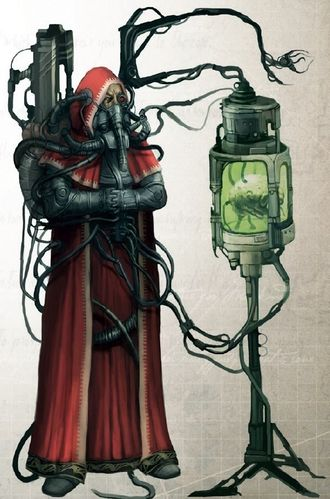
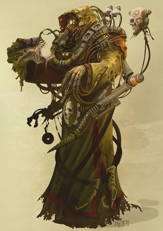
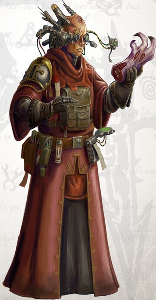

# 0157 基因士 Genetor

精校状态：中文行文已逐段精校，部分术语仍为暂定

分类：通用概念 / 帝国 Imperium / 机械神教 Adeptus Mechanicus / 帝国骑士 Imperial Knight

原文来源：https://www.bilibili.com/opus/1178326034352701441

原作者：帝国神选罐头

原文时间：2026年03月11日 08:26

[返回分类目录](目录.md) · [全书目录](../../目录.md)

<!-- A0157-B0001 -->
**英文原文**

Genetors are one of the Holy Orders that make up the ruling priesthood of the Adeptus Mechanicus, specializing in genetics. Some sources state that the term 'Genetor' is synonymous with the Magos Biologis (sometimes Divisionis Biologis or Divisio Biologis), while some place 'Magos Biologis' as a title within the wider Genetor Order, or within the Magi Order. They are very common among the Mechanicus and often accompany Imperial forces involved in the exploration of new worlds. They are dedicated to the study of biology and organic anatomy and are heavily represented among the Mechanicus, possibly due to the Mechanicum’s experiences with mutants on Mars during the Age of Strife.

<!-- /A0157-B0001 -->

<!-- A0157-B0002 -->

原译文

基因士是组成机械神教的执政神甫之一，专门从事遗传学研究。一些资料指出，“基因士”一词与生物贤者同义（有时是生物分部或生物部门），而另一些资料则将“生物贤者”作为更广泛的基因士修会或圣贤士修会中的一个头衔。他们在机械教中很常见，经常伴随着参与探索新世界的帝国部队。他们致力于生物学和有机解剖学的研究，在机械教中占有重要地位，这可能是由于机械教在纷争时代与火星上的变种人有过接触。

**校订译文**

基因士修会是构成机械修会统治祭司阶层的神圣修会之一，专门研究遗传学。有些资料将“基因士”与“生物贤者”等同，后者有时亦称 Divisionis Biologis 或 Divisio Biologis；另一些则将生物贤者视为基因士修会或贤者修会内部的职衔。他们在机械教中十分常见，常随帝国部队探索新世界，专研生物学与有机解剖学。其成员众多，可能与纷争时代机械教在火星同变种人打交道的经历有关。

<!-- /A0157-B0002 -->

<!-- A0157-B0003 图片 -->

<!-- A0157-B0004 -->

原译文

Genetor 基因士

**校订译文**

Genetor 基因士

<!-- /A0157-B0004 -->

<!-- A0157-B0005 -->
## Overview 概述

<!-- /A0157-B0005 -->

<!-- A0157-B0006 -->
**英文原文**

The Order commonly studies biological systems; those of the xenos in order to defeat them, those of the human in order to improve them. It is one of the few institutions in the Imperium, alongside the Inquisition's Ordo Xenos, permitted to study xenos and regularly examine alien species. They have established covert research facilities such as the Anphelion Base in conjunction with the Ordo Xenos to study the Tyranid race, taking any opportunity to capture and study the creatures in order to devise a way to counter their organic weaponry and super-adaptability. Members frequently accompany exploration fleets, sometimes even forming their own Genetor explorator teams, to test the populations of rediscovered worlds for mutation outside of the prescribed norms.

<!-- /A0157-B0006 -->

<!-- A0157-B0007 -->

原译文

修会通常研究生物系统；为了打败异型而学习异型的知识，为了改进人类而学习人类的知识。它是帝国中为数不多的机构之一，与审判庭的攘外修会一起，被允许研究异型并定期检查外来物种。他们建立了秘密研究设施，如安菲隆基地，与攘外修会合作研究泰伦种族，抓住任何机会捕捉和研究这些生物，以设计一种对抗其有机武器和超适应性的方法。成员们经常陪同探索者，有时甚至组建自己的基因士探索者小队，测试重新发现的世界的种群是否发生了超出规定标准的突变。

**校订译文**

修会研究生物系统：研究异形，是为了击败它们；研究人类，则是为了改进人类。它与异形审判庭一样，属于帝国少数获准研究异形、经常检验异形物种的机构。他们与异形审判庭合作建立安菲隆基地等秘密设施，研究泰伦虫族，抓住一切机会捕获标本，设法对抗其生物武器和超强适应能力。成员常随探索舰队行动，有时也组成独立的基因士探索队，检查重新发现的世界上居民的变异是否超出规定标准。

<!-- /A0157-B0007 -->

<!-- A0157-B0008 图片 -->

<!-- A0157-B0009 -->

原译文

Symbol of the Genetor Order 基因士修会的标志

**校订译文**

Symbol of the Genetor Order 基因士修会的标志

<!-- /A0157-B0009 -->

<!-- A0157-B0010 -->
## Creations and Armoury 创造与军械库

<!-- /A0157-B0010 -->

<!-- A0157-B0011 -->
**英文原文**

The Magos Biologis have been involved in the creation of many of the Imperium's genetically modified entities used by different branches. It was an Adaptus Mechanicus geno-lab that was used to develop the Cursed Founding on Incunabla, possibly in conjunction with the Thorian faction of the Inquisition. Some examples of the Order's creations are:

<!-- /A0157-B0011 -->

<!-- A0157-B0012 -->

原译文

生物贤者参与了帝国不同分支使用的许多转基因实体的创造。这是一个机械神教基因实验室，可能与审判庭的托尔派合作，用于开发因库纳布拉的诅咒建军。修会的创造的一些例子是：

**校订译文**

生物贤者参与制造了帝国各机构使用的许多基因改造生物。因库纳布拉上的机械修会基因实验室曾用于诅咒建军的研发，可能还与审判庭的托尔派合作。该修会的造物包括：

<!-- /A0157-B0012 -->

<!-- A0157-B0013 -->
**英文原文**

Gland Warriors of the Imperial Guard

<!-- /A0157-B0013 -->

<!-- A0157-B0014 -->

原译文

帝国卫队的腺体战士

**校订译文**

帝国卫队的腺体战士

<!-- /A0157-B0014 -->

<!-- A0157-B0015 -->
**英文原文**

Horses of the Death Riders of Krieg

<!-- /A0157-B0015 -->

<!-- A0157-B0016 -->

原译文

克里格死亡骑兵的马

**校订译文**

克里格死亡骑兵的马

<!-- /A0157-B0016 -->

<!-- A0157-B0017 -->
**英文原文**

Raptors of the Raven Guard Legion

<!-- /A0157-B0017 -->

<!-- A0157-B0018 -->

原译文

暗鸦守卫军团的猛禽

**校订译文**

暗鸦守卫军团的猛禽

<!-- /A0157-B0018 -->

<!-- A0157-B0019 -->
**英文原文**

Sicarian Infiltrators of the Skitarii

<!-- /A0157-B0019 -->

<!-- A0157-B0020 -->

原译文

护教军的短刃渗透者

**校订译文**

护教军的斯卡里亚渗透者。

<!-- /A0157-B0020 -->

<!-- A0157-B0021 -->
**英文原文**

The Transfigured – mutants created by renegade a Magos Biologis

<!-- /A0157-B0021 -->

<!-- A0157-B0022 -->

原译文

变形者 - 由叛徒生物贤者创造的变种人

**校订译文**

变形者 - 由叛徒生物贤者创造的变种人

<!-- /A0157-B0022 -->

<!-- A0157-B0023 -->
**英文原文**

Equipment created includes:

<!-- /A0157-B0023 -->

<!-- A0157-B0024 -->

原译文

创造的设备包括：

**校订译文**

创造的设备包括：

<!-- /A0157-B0024 -->

<!-- A0157-B0025 -->
**英文原文**

Artifico-Biologis, 0.5 I Hypo Pistol

<!-- /A0157-B0025 -->

<!-- A0157-B0026 -->

原译文

人工生物学，0.5 I 低手枪

**校订译文**

人工生物型 0.5 I 注射手枪。

**校注：** 原文型号写作 Artifico-Biologis, 0.5 I Hypo Pistol。Hypo 按皮下注射器械理解；0.5 I 的末字符保留原样，未擅改为容量单位 L。

<!-- /A0157-B0026 -->

<!-- A0157-B0027 -->

原译文

Gill Filter 及耳过滤器

**校订译文**

Gill Filter 鳃式过滤器

<!-- /A0157-B0027 -->

<!-- A0157-B0028 -->

原译文

Helispex Engine 赫利斯佩克斯引擎

**校订译文**

Helispex Engine 赫利斯佩克斯引擎

<!-- /A0157-B0028 -->

<!-- A0157-B0029 -->

原译文

Hermetic Infusion 密封输液

**校订译文**

Hermetic Infusion 密封输液

<!-- /A0157-B0029 -->

<!-- A0157-B0030 -->

原译文

Hunting Lance Poison Tip 狩猎长枪毒药尖

**校订译文**

Hunting Lance Poison Tip 狩猎长枪毒枪尖

<!-- /A0157-B0030 -->

<!-- A0157-B0031 -->

原译文

Ration Grubs 食物口粮

**校订译文**

Ration Grubs 口粮幼虫

<!-- /A0157-B0031 -->

<!-- A0157-B0032 -->

原译文

Redole Re-breather 雷多尔再呼吸器

**校订译文**

Redole Re-breather 雷多尔再呼吸器

<!-- /A0157-B0032 -->

<!-- A0157-B0033 -->

原译文

Rite of Setesh 塞特什仪式

**校订译文**

Rite of Setesh 塞特什仪式

<!-- /A0157-B0033 -->

<!-- A0157-B0034 -->

原译文

Spectorin Coral Paste 斯佩克托林珊瑚膏

**校订译文**

Spectorin Coral Paste 斯佩克托林珊瑚膏

<!-- /A0157-B0034 -->

<!-- A0157-B0035 -->

原译文

Transgenic Grafting 转基因移植

**校订译文**

Transgenic Grafting 转基因移植

<!-- /A0157-B0035 -->

<!-- A0157-B0036 -->
**英文原文**

Vore-weapon – created by renegade Biologis

<!-- /A0157-B0036 -->

<!-- A0157-B0037 -->

原译文

吞食武器 — 由叛徒生物贤者创造

**校订译文**

吞食武器 — 由叛徒生物贤者创造

<!-- /A0157-B0037 -->

<!-- A0157-B0038 -->
## Offices and Titles 职位和头衔

<!-- /A0157-B0038 -->

<!-- A0157-B0039 -->
**英文原文**

Several specialties and titles are used within the Order:

<!-- /A0157-B0039 -->

<!-- A0157-B0040 -->

原译文

修会中使用了几个专长和头衔：

**校订译文**

修会中使用了几个专长和头衔：

<!-- /A0157-B0040 -->

<!-- A0157-B0041 -->
**英文原文**

The Ruling Priesthood (Tech-priests):

<!-- /A0157-B0041 -->

<!-- A0157-B0042 -->

原译文

执政神甫（技术神甫）：

**校订译文**

统治祭司阶层（技术祭司）：

<!-- /A0157-B0042 -->

<!-- A0157-B0043 -->

原译文

Arch-chymist 大化学士

**校订译文**

Arch-chymist 大化学士

<!-- /A0157-B0043 -->

<!-- A0157-B0044 -->

原译文

Arch-Genetor 大基因士

**校订译文**

Arch-Genetor 大基因士

<!-- /A0157-B0044 -->

<!-- A0157-B0045 -->

原译文

Biologis Adept 生物专家

**校订译文**

Biologis Adept 生物专家

<!-- /A0157-B0045 -->

<!-- A0157-B0046 -->

原译文

Corpus Illuminator 人体启明者

**校订译文**

Corpus Illuminator 人体启明者

<!-- /A0157-B0046 -->

<!-- A0157-B0047 -->

原译文

Genetor Extremis 极端基因士

**校订译文**

Genetor Extremis 极端基因士

<!-- /A0157-B0047 -->

<!-- A0157-B0048 -->

原译文

Grand Parasite 大寄生士

**校订译文**

Grand Parasite 大寄生士

<!-- /A0157-B0048 -->

<!-- A0157-B0049 -->

原译文

Magos Biologis 生物贤者

**校订译文**

Magos Biologis 生物贤者

<!-- /A0157-B0049 -->

<!-- A0157-B0050 -->
**英文原文**

Magos Biologis Extremis – Magi serving as Ship's Surgeon on capital ships of the Imperial Navy.

<!-- /A0157-B0050 -->

<!-- A0157-B0051 -->

原译文

极端生物贤者 - 在帝国海军主力舰上担任舰船外科医生的服役圣贤士。

**校订译文**

极端生物贤者——在帝国海军主力舰上担任舰医的贤者。

<!-- /A0157-B0051 -->

<!-- A0157-B0052 -->
**英文原文**

Magos Biologis Neuralis – Magi who work on the mind.

<!-- /A0157-B0052 -->

<!-- A0157-B0053 -->

原译文

神经生物贤者 - 致力于思维的圣贤士。

**校订译文**

神经生物贤者——研究心智的贤者。

<!-- /A0157-B0053 -->

<!-- A0157-B0054 -->
**英文原文**

Magos Genetus – An exalted Genetor rank

<!-- /A0157-B0054 -->

<!-- A0157-B0055 -->

原译文

基因贤者 - 地位高的圣贤士等级

**校订译文**

基因贤者——基因士中的高阶职衔。

<!-- /A0157-B0055 -->

<!-- A0157-B0056 -->
**英文原文**

Magos Xenologis – Xenobiologists, sometimes known as members of the Xenos Biologis.

<!-- /A0157-B0056 -->

<!-- A0157-B0057 -->

原译文

异型贤者 - 异型生物学家，有时被称为异型生物学家的成员。

**校订译文**

异形贤者——异形生物学家，有时被称为异形生物部门（Xenos Biologis）的成员。

<!-- /A0157-B0057 -->

<!-- A0157-B0058 图片 -->

<!-- A0157-B0059 -->

原译文

Magos Xenologis 异型贤者

**校订译文**

Magos Xenologis 异形贤者

<!-- /A0157-B0059 -->

<!-- A0157-B0060 -->

原译文

Metasurgeon 元外科医生

**校订译文**

Metasurgeon 元外科医生

<!-- /A0157-B0060 -->

<!-- A0157-B0061 -->

原译文

Xeno Genetor Adept 异型基因士专家

**校订译文**

Xeno Genetor Adept 异形基因士专家

<!-- /A0157-B0061 -->

<!-- A0157-B0062 -->

原译文

Ordained Laity:授职平信徒：

**校订译文**

Ordained Laity:授职平信徒：

<!-- /A0157-B0062 -->

<!-- A0157-B0063 -->
**英文原文**

Lay Biologis Adept – Those who have been initiated into the lesser mysteries of the Machine Cult. Verispex Adepts of the Adeptus Arbites are often trained by the Biologis.

<!-- /A0157-B0063 -->

<!-- A0157-B0064 -->

原译文

生物平信徒专家 -那些已经开始接触机械教派低级奥秘的人。法务部的真视者专家通常由生物学家训练。

**校订译文**

生物平信徒专家——获准学习机械教派初阶奥秘的人。法务部的真视者专家常由生物学专家培训。

<!-- /A0157-B0064 -->

<!-- A0157-B0065 图片 -->

<!-- A0157-B0066 -->

原译文

Verispex Adept 真视者专家

**校订译文**

Verispex Adept 真视者专家

<!-- /A0157-B0066 -->

<!-- A0157-B0067 -->
## Doctrine 教义

<!-- /A0157-B0067 -->

<!-- A0157-B0068 -->
**英文原文**

Members of the Order engage in the Quest for Knowledge as other Tech Priests, though differ in that they regard flesh not as inferior to metal, but instead as a different type of machine.

<!-- /A0157-B0068 -->

<!-- A0157-B0069 -->

原译文

修会成员与其他技术神甫一样参与了对知识的探索，尽管他们的不同之处在于，他们并不认为血肉不如金属，而是将其视为一种不同类型的机械。

**校订译文**

修会成员与其他技术祭司一样参与了对知识的探索，尽管他们的不同之处在于，他们并不认为血肉不如金属，而是将其视为一种不同类型的机械。

<!-- /A0157-B0069 -->

<!-- A0157-B0070 -->
**英文原文**

Like other dogmas, different philosophies interpret this ideology differently. Notable factions are:

<!-- /A0157-B0070 -->

<!-- A0157-B0071 -->

原译文

与其他教义一样，不同的派系对这一思想的解释也不同。值得注意的派系有：

**校订译文**

与其他教义一样，不同的派系对这一思想的解释也不同。值得注意的派系有：

<!-- /A0157-B0071 -->

<!-- A0157-B0072 -->
**英文原文**

Apexists – The search to find the perfect form, which is strengthened via adversity. Based on a pre-Imperial scholar's writings.

<!-- /A0157-B0072 -->

<!-- A0157-B0073 -->

原译文

顶点存在 — 寻找完美的形态，通过逆境得到加强。基于一位前帝国学者的著作。

**校订译文**

顶点派——依据一位帝国建立前的学者著作，寻找经由逆境磨炼而成的完美形态。

<!-- /A0157-B0073 -->

<!-- A0157-B0074 -->
**英文原文**

Carnicula – A splinter sect of the Hippocrasians, the Carnicula look to lengthen the lifespan of vat-grown constructs.

<!-- /A0157-B0074 -->

<!-- A0157-B0075 -->

原译文

血肉延寿— 希波克拉底学派的一个分支，血肉延寿希望延长缸裔构筑的寿命。

**校订译文**

血肉延寿派——希波克拉底派的分支，致力于延长培养缸造物的寿命。

<!-- /A0157-B0075 -->

<!-- A0157-B0076 -->
**英文原文**

Circle Varnak – A sect spread across the Eastern Fringe dedicated to the destruction of the Tyranids following the fall of Tyran.

<!-- /A0157-B0076 -->

<!-- A0157-B0077 -->

原译文

瓦纳克之环 - 一个遍布东部边缘的派系，致力于在泰兰陷落后摧毁泰伦。

**校订译文**

瓦尔纳克之环——分布于东部边缘的派系，在泰兰陷落后致力于消灭泰伦虫族。

<!-- /A0157-B0077 -->

<!-- A0157-B0078 -->
**英文原文**

Companions of Vogel – Forced genetic augmentation is needed to strengthen humanity. A young and radical philosophy, as it implies the human form is somehow insufficient alone.

<!-- /A0157-B0078 -->

<!-- A0157-B0079 -->

原译文

沃格尔的伙伴 — 需要强制基因扩增来加强人类。一个年轻而激进的派系，因为它暗示着人类形态本身是不足的。

**校订译文**

沃格尔之友——主张通过强制基因增强来强化人类。这一思想新近出现且十分激进，因为它暗示人类形体本身有所欠缺。

<!-- /A0157-B0079 -->

<!-- A0157-B0080 -->
**英文原文**

Divisio Genetor – A faction within the Lathe Worlds fascinated by the Lathesmasters’ biological properties.

<!-- /A0157-B0080 -->

<!-- A0157-B0081 -->

原译文

分支基因士 - 车床世界中的一个派系，对车床之主的生物特性着迷。

**校订译文**

基因分部——拉特诸世界中的派系，痴迷于拉特主人的生物特性。

**校注：** Lathe Worlds 为地点专名，采用暂定音译拉特诸世界，避免把 Lathesmasters 当普通车床管理员。

<!-- /A0157-B0081 -->

<!-- A0157-B0082 -->
**英文原文**

Dread Biologis – Members of the Heretek Magi of Forge Polix in the Screaming Vortex.

<!-- /A0157-B0082 -->

<!-- A0157-B0083 -->

原译文

生物恐惧 - 尖叫漩涡中波利克斯铸造厂的技术异端圣贤士成员。

**校订译文**

恐怖生物学派——尖叫漩涡中波利克斯铸造厂的技术异端贤者。

<!-- /A0157-B0083 -->

<!-- A0157-B0084 -->
**英文原文**

Hippocrasian Sect – Study of the transition between life and death. Based in the Calixis Sector on the Hippocrasian Agglomeration orbiting Morwen VI.

<!-- /A0157-B0084 -->

<!-- A0157-B0085 -->

原译文

希波克拉底学派 - 研究生与死之间的过渡。基于卡利西斯星区围绕莫温六号的希波克拉底集群。

**校订译文**

希波克拉底派——研究生与死的过渡，驻于卡利西斯星区、环绕莫温六号运行的希波克拉底聚合体。

<!-- /A0157-B0085 -->

<!-- A0157-B0086 -->
**英文原文**

Incunablis order - Members of this genetor order were present on and survived the fall of Gryphonne IV.

<!-- /A0157-B0086 -->

<!-- A0157-B0087 -->

原译文

古版修会 - 格里芬四号陷落时，这一基因士修会的成员在场并幸存下来。

**校订译文**

因库纳布利斯修会——该基因士修会部分成员身处格里芬四号陷落现场，却幸存了下来。

<!-- /A0157-B0087 -->

<!-- A0157-B0088 -->
**英文原文**

Organicists – A wide ranging faction affiliated to the Carnicula.

<!-- /A0157-B0088 -->

<!-- A0157-B0089 -->

原译文

有机论者 - 一个隶属于血肉延寿的广泛派别。

**校订译文**

有机论者——与血肉延寿派有关联、分布广泛的派系。

<!-- /A0157-B0089 -->

<!-- A0157-B0090 -->
**英文原文**

Primus Humanum – The human form is a pure vessel for knowledge, the Emperor is the ideal version of this. The oldest of the three main factions in the Calixis Sector.

<!-- /A0157-B0090 -->

<!-- A0157-B0091 -->

原译文

原初人类 — 人类形态是一个纯粹的知识容器，帝皇是这个的理想版本。卡利西斯星区三个主要派系中最古老的一个。

**校订译文**

人类至上派——相信人类形体是知识的纯净容器，帝皇则是这一理想的完美体现。它是卡利西斯星区三大派系中最古老的一支。

<!-- /A0157-B0091 -->

<!-- A0157-B0092 -->
## Known Genetors or Magos Biologis 已知基因士或生物贤者

<!-- /A0157-B0092 -->

<!-- A0157-B0093 -->
**英文原文**

237089 — Cybertheurge Archmagos Genetor on Alecto

<!-- /A0157-B0093 -->

<!-- A0157-B0094 -->

原译文

237089 — 阿勒克图的智控神术基因士大贤者

**校订译文**

237089 — 阿勒克图的智控神术基因士大贤者

<!-- /A0157-B0094 -->

<!-- A0157-B0095 -->
**英文原文**

Bassili — M31. Primus Cogenitor, Third District on Constanix II

<!-- /A0157-B0095 -->

<!-- A0157-B0096 -->

原译文

巴锡里 — M31.首席共基因士，康斯坦尼克斯二号第三区

**校订译文**

巴锡里 — M31.首席共基因士，康斯坦尼克斯二号第三区

<!-- /A0157-B0096 -->

<!-- A0157-B0097 -->
**英文原文**

Carantine — M31. Part of the Wardens of the Pharos

<!-- /A0157-B0097 -->

<!-- A0157-B0098 -->

原译文

卡兰汀 — M31. 灯塔守望者的一部分

**校订译文**

卡兰汀——第31千年的人物，法罗斯灯塔守望者成员。

<!-- /A0157-B0098 -->

<!-- A0157-B0099 -->

原译文

Cassia 卡西亚

**校订译文**

Cassia 卡西亚

<!-- /A0157-B0099 -->

<!-- A0157-B0100 -->

原译文

Crystavayne 克里斯塔维恩

**校订译文**

Crystavayne 克里斯塔维恩

<!-- /A0157-B0100 -->

<!-- A0157-B0101 -->

原译文

Dominus 多米努什

**校订译文**

Dominus 多米努什

<!-- /A0157-B0101 -->

<!-- A0157-B0102 -->

原译文

Eldon Urquidex 埃尔登·厄奎德克斯

**校订译文**

Eldon Urquidex 埃尔登·厄奎德克斯

<!-- /A0157-B0102 -->

<!-- A0157-B0103 -->

原译文

Emmanael Cort 埃曼纽尔·科尔特

**校订译文**

Emmanael Cort 埃曼纽尔·科尔特

<!-- /A0157-B0103 -->

<!-- A0157-B0104 -->
**英文原文**

Korland – Cort's apprenctice

<!-- /A0157-B0104 -->

<!-- A0157-B0105 -->

原译文

科兰德 - 科尔特的学徒

**校订译文**

科兰德 - 科尔特的学徒

<!-- /A0157-B0105 -->

<!-- A0157-B0106 -->

原译文

Erlon Klute 埃尔隆·克鲁特

**校订译文**

Erlon Klute 埃尔隆·克鲁特

<!-- /A0157-B0106 -->

<!-- A0157-B0107 -->
**英文原文**

Firax – M31. Third District on Constanix II

<!-- /A0157-B0107 -->

<!-- A0157-B0108 -->

原译文

菲拉克斯 - M31.康斯坦尼克斯二号第三区

**校订译文**

菲拉克斯 - M31.康斯坦尼克斯二号第三区

<!-- /A0157-B0108 -->

<!-- A0157-B0109 -->

原译文

Gammat Triskellian 伽马特·特里斯凯利安

**校订译文**

Gammat Triskellian 伽马特·特里斯凯利安

<!-- /A0157-B0109 -->

<!-- A0157-B0110 -->

原译文

Gormal Vinctal 戈尔马尔·文克塔尔

**校订译文**

Gormal Vinctal 戈尔马尔·文克塔尔

<!-- /A0157-B0110 -->

<!-- A0157-B0111 -->
**英文原文**

Halix Redole - Infamous Magos Genetus associated with the Organicists faction

<!-- /A0157-B0111 -->

<!-- A0157-B0112 -->

原译文

哈利克斯·雷多尔 - 臭名昭著的基因贤者，与有机论者派系有关联

**校订译文**

哈利克斯·雷多尔 - 臭名昭著的基因贤者，与有机论者派系有关联

<!-- /A0157-B0112 -->

<!-- A0157-B0113 -->
**英文原文**

Haran Serpens – Tech-Lord. Forged a cure for the Haze Plague on Farrakin.

<!-- /A0157-B0113 -->

<!-- A0157-B0114 -->

原译文

哈兰·瑟彭斯 - 技术领主。铸造了解决法拉金的瘟疫之雾的方法。

**校订译文**

哈兰·瑟彭斯——技术领主，研制出法拉金雾霾瘟疫的疗法。

<!-- /A0157-B0114 -->

<!-- A0157-B0115 -->

原译文

Heironym Rottle 希罗尼姆·罗特尔

**校订译文**

Heironym Rottle 希罗尼姆·罗特尔

<!-- /A0157-B0115 -->

<!-- A0157-B0116 -->

原译文

Heydrich Vogel 海德里希·沃格尔

**校订译文**

Heydrich Vogel 海德里希·沃格尔

<!-- /A0157-B0116 -->

<!-- A0157-B0117 -->
**英文原文**

Iyrzek – Magos Genetus who synthesised Infiltriol Enamel

<!-- /A0157-B0117 -->

<!-- A0157-B0118 -->

原译文

伊尔泽克 - 合成渗透珐琅的基因贤者

**校订译文**

伊尔泽克 - 合成渗透珐琅的基因贤者

<!-- /A0157-B0118 -->

<!-- A0157-B0119 -->
**英文原文**

Jarv Advent – Senior Xenobiologist in the service of the Inquisition, was one of the first to recognise the threat of the Genestealers.

<!-- /A0157-B0119 -->

<!-- A0157-B0120 -->

原译文

贾维·阿德文特 - 为审判庭服役的高级异型生物学家，是最早认识到基因窃取者威胁的人之一。

**校订译文**

贾维·阿德文特 - 为审判庭服役的高级异形生物学家，是最早认识到基因窃取者威胁的人之一。

<!-- /A0157-B0120 -->

<!-- A0157-B0121 -->
**英文原文**

Kharib - Magos Biologis in Hive Tertium. Joined Inquisitor Grendyl's warband to study ways to stop Nurgle's blight in the hive city.

<!-- /A0157-B0121 -->

<!-- A0157-B0122 -->

原译文

卡里布 - 第三巢都中的生物贤者。加入审判官格伦迪尔的战斗小组，研究如何阻止在巢都城市的纳垢枯萎病。

**校订译文**

卡里布——第三巢都的生物贤者，加入审判官格伦迪尔的战帮，研究遏止巢都内纳垢疫病的方法。

<!-- /A0157-B0122 -->

<!-- A0157-B0123 -->

原译文

Moroe 莫罗埃

**校订译文**

Moroe 莫罗埃

<!-- /A0157-B0123 -->

<!-- A0157-B0124 -->
**英文原文**

Nexin Orlandriaz – One of the primary architects of the Raptor project.

<!-- /A0157-B0124 -->

<!-- A0157-B0125 -->

原译文

尼克辛·奥兰德里亚兹 - 猛禽项目的主要设计师之一。

**校订译文**

尼克辛·奥兰德里亚兹 - 猛禽项目的主要设计师之一。

<!-- /A0157-B0125 -->

<!-- A0157-B0126 -->

原译文

Veltranx 维特兰克斯

**校订译文**

Veltranx 维特兰克斯

<!-- /A0157-B0126 -->

<!-- A0157-B0127 -->
**英文原文**

Vianco Locard – Specializes in the study of Tyranids.

<!-- /A0157-B0127 -->

<!-- A0157-B0128 -->

原译文

维亚科·洛卡德 - 专门研究泰伦。

**校订译文**

维安科·洛卡德——专研泰伦虫族。

<!-- /A0157-B0128 -->

<!-- A0157-B0129 -->

原译文

Vintillius 文提利乌斯

**校订译文**

Vintillius 文提利乌斯

<!-- /A0157-B0129 -->

<!-- A0157-B0130 -->

原译文

Zardos Vyakai 扎尔多斯·维凯

**校订译文**

Zardos Vyakai 扎尔多斯·维凯

<!-- /A0157-B0130 -->

本篇核心术语与暂定项

以下列出本篇出现的英文原形及核心术语表用词。同形词可能指不同对象，具体词义以本篇正文和校注为准；单复数、别名和仅见于图注的名称可能尚未列入。完整候选见[术语表](../../术语表/双语术语候选.csv)。

| 英文 | 采用中文 | 状态 |
| --- | --- | --- |
| Adeptus Mechanicus | 机械修会 | 官方已核对 |
| Imperial Guard | 帝国卫队 | 暂定·语境区分 |
| Tyranids | 泰伦虫族 | 官方已核对 |
| Inquisition | 审判庭 | 暂定 |
| Inquisitor | 审判官 | 官方已核对 |
| Imperium | 帝国 | 暂定·简称 |
| Imperial Navy | 帝国海军 | 暂定 |
| Mechanicum | 机械教 | 暂定·历史称谓 |
| Nurgle | 纳垢 | 官方已核对 |
| Equipment | 装备 | 编辑用语已统一 |
| Emperor | 帝皇 | 官方已核对 |
| Adeptus Arbites | 法务部 | 暂定 |
| Alecto | 阿勒克图 | 暂定·官方待核 |
| Magos Biologis | 生物贤者 | 暂定·官方待核 |
| The Order | 秩序 | 暂定·官方待核 |
| Age of Strife | 纷争时代 | 暂定·官方待核 |
| Skitarii | 护教军 | 暂定·官方待核 |
| Ordo Xenos | 异形审判庭 | 用户指定 |
| Sector | 星区 | 暂定·官方待核 |
| Eastern Fringe | 东部边缘 | 暂定·官方待核 |
| Gland Warriors | 腺体战士 | 暂定·官方待核 |
| Genetor | 基因士 | 暂定·官方待核 |
| Mars | 火星 | 暂定·官方待核 |
| Gryphonne IV | 格里芬四号 | 暂定·官方待核 |
| Pharos | 灯塔 | 暂定·官方待核 |
| Tech | 技术语 | 暂定·官方待核 |
| Incunabla | 因库纳布拉 | 暂定 |
| Adept | 帝国任职者（广义）／文吏（行政语境） | 语境定译·官方待核 |
| Sicarian Infiltrators | 斯卡里亚渗透者 | 官方已核对 |
| Vianco Locard | 维安科·洛卡德 | 暂定·官方待核 |
| Carnicula | 血肉延寿派 | 暂定·官方待核 |
| Apexists | 顶点派 | 暂定·官方待核 |
| Companions of Vogel | 沃格尔之友 | 暂定·官方待核 |
| Circle Varnak | 瓦尔纳克之环 | 暂定·官方待核 |
| Divisio Genetor | 基因分部 | 暂定·官方待核 |
| Dread Biologis | 恐怖生物学派 | 暂定·官方待核 |
| Hippocrasian Sect | 希波克拉底派 | 暂定·官方待核 |
| Incunablis order | 因库纳布利斯修会 | 暂定·官方待核 |
| Primus Humanum | 人类至上派 | 暂定·官方待核 |
| Lathe Worlds | 拉特诸世界 | 暂定·官方待核 |
| Companions | 近侍 | 暂定·官方待核 |
| Raven Guard | 暗鸦守卫 | 官方已核 |
| Founding | 建军 | 暂定·官方待核 |
| Raptors | 猛禽 | 暂定·官方待核 |
| Xenos | 异形 | 暂定·官方待核 |
| Tyran | 泰兰 | 暂定·官方待核 |
| Primus | 领军 | 官方已核对 |
| Nexin Orlandriaz | 内克辛·奥兰德里亚兹 | 暂定·官方待核 |
| Constanix II | 康斯坦尼克斯二号 | 暂定·官方待核 |
| Screaming Vortex | 尖啸旋涡 | 暂定·官方待核 |
| Calixis Sector | 卡利西斯星区 | 暂定·官方待核 |
| Hive City | 巢都城市 | 暂定·官方待核 |
| Krieg | 克里格 | 暂定·官方待核 |
| Forge Polix | 铸造波利克斯 | 暂定·官方待核 |
| Haran | 哈兰 | 暂定·官方待核 |
| Infiltriol | 渗透涂剂 | 暂定·官方待核 |
| Iyrzek | 伊尔泽克 | 暂定·官方待核 |

