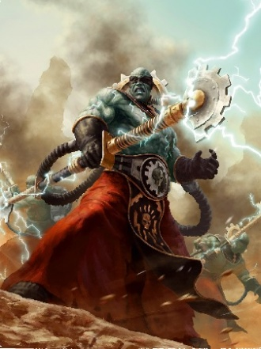

# 0158 驭电祭司 Electro-priest

精校状态：中文行文已逐段精校，部分术语仍为暂定

分类：通用概念 / 帝国 Imperium / 机械神教 Adeptus Mechanicus / 帝国骑士 Imperial Knight

原文来源：https://www.bilibili.com/opus/1147597978587889703

原作者：帝国神选罐头

原文时间：2025年12月18日 13:06

[返回分类目录](目录.md) · [全书目录](../../目录.md)

原篇名：电僧 Electro-priest

<!-- A0158-B0001 -->
**英文原文**

Electro-priests, also known as Luminen or the sparks of life are a rank of Tech Priest within the Adeptus Mechanicus. They are fanatically devoted to the -Motive Force, a third of the Omnissiah's trinity, believing that all life and motion owes its continued existence to that ineffable divinity.

<!-- /A0158-B0001 -->

<!-- A0158-B0002 -->

原译文

电僧，也被称为流明或生命火花，是机械神教中的技术神甫。他们狂热地致力于源力，这是欧姆尼赛亚三位一体的三分之一，相信所有的生命和运动都归功于那种无法形容的神性。

**校订译文**

驭电祭司亦称“流明”或“生命火花”，是机械修会技术祭司的一种。他们狂热崇拜源力——欧姆尼赛亚三位一体的一部分，相信一切生命与运动都依赖这一不可言喻的神性而延续。

<!-- /A0158-B0002 -->

<!-- A0158-B0003 图片 -->

<!-- A0158-B0004 -->

原译文

Electro-Priest 电僧

**校订译文**

Electro-Priest 驭电祭司

<!-- /A0158-B0004 -->

<!-- A0158-B0005 -->
## Overview 概述

<!-- /A0158-B0005 -->

<!-- A0158-B0006 -->
**英文原文**

Electro-priests are fanatic cult warriors, responsible for supporting other Tech-priest warriors in battle. Their skins are engraved with a metallic electoo circuit which spirals around their bodies and interfaces with their minds, allowing them to build up a tremendous current of electrical energy. Electro-Priests are capable of channeling energy through anything they touch. Cybernetic grafts in their nervous system allow them to channel electrical energy through their copper-etched palms, the charge building quickly as the Electro-Priest works himself into an ecstatic frenzy. At the heights of their religious mania, the truly devout can destroy enemies of the Machine God with bolts of living lightning.

<!-- /A0158-B0006 -->

<!-- A0158-B0007 -->

原译文

电僧是狂热的教派战士，负责在战斗中支援其他技术神甫战士。他们的皮肤上雕刻着金属源力回路，该电路围绕着他们的身体盘旋，与他们的思想相接，使他们能够建立巨大的电流。电僧能够通过他们接触到的任何东西引导能量。他们神经系统中的智控移植使他们能够通过铜蚀刻的手掌输送电能，当电僧陷入出神狂热时，电荷迅速积聚。在宗教狂热的顶峰，真正虔诚的人可以用活闪电摧毁万机神的敌人。

**校订译文**

驭电祭司是狂热的宗教战士，在战场上支援其他技术祭司。他们的皮肤刻有环绕全身、连接心智的金属电纹回路，能够积蓄惊人电能。神经系统中的机械移植物，让他们通过蚀有铜纹的手掌，将能量导入接触到的一切。随着祭司陷入狂喜，电荷迅速积聚；宗教狂热达到顶点时，最虔诚者能释放宛如活物的闪电，摧毁万机神的敌人。

<!-- /A0158-B0007 -->

<!-- A0158-B0008 -->
**英文原文**

The electrical power surging through the Electro-Priests is so strong that their eyes literally burst and melt, a phenomenon the order knows as the Omnissiah's Tears.

<!-- /A0158-B0008 -->

<!-- A0158-B0009 -->

原译文

通过电僧的电力是如此之强，以至于他们的眼睛真的爆裂并融化了，这一现象被该修会称为欧姆尼赛亚之泪。

**校订译文**

通过驭电祭司的电力是如此之强，以至于他们的眼睛真的爆裂并融化了，这一现象被该修会称为欧姆尼赛亚之泪。

<!-- /A0158-B0009 -->

<!-- A0158-B0010 -->
**英文原文**

Long ago, the Electro-Priests were divided into two factions known as Corpuscarii and Fulgurite. The forefathers of the Corpuscarii focused their worship upon the Machine God – they believed his light should be brought to the galaxy and expended great resources in subsequent Crusades. Meanwhile, those who would become the Fulgurites were aghast at the cost and were jealously protective of the Motive Force. The two factions have battled many times in what has become known as the Conduit Wars. Even surface of Mars is burned in some places reflecting this bitter confrontation. A particularly brutal round of fighting known as the Elucidan Schism raged for centuries.

<!-- /A0158-B0010 -->

<!-- A0158-B0011 -->

原译文

很久以前，电僧被分为两个派别，即法身和雷岩。法身的祖先将他们的崇拜集中在万机神身上 — 他们相信他的光应该被带到银河系，并在随后的远征中消耗了大量资源。与此同时，那些将成为雷岩的人对代价感到震惊，并小心翼翼地保护着源力。这两个派系在所谓的管道战争中进行了多次战斗。甚至火星表面的一些地方也被烧毁，反映了这种激烈的对抗。一轮特别残酷的战斗被称为阐明分裂，持续了几个世纪。

**校订译文**

很久以前，驭电祭司分为科普斯卡与电岩两派。科普斯卡的先辈将崇拜重心置于万机神，认为应将祂的光明传播至整个银河，为此在远征中耗费巨量资源。电岩派的先辈却震惊于这种消耗，极力守护源力。两派多次爆发被称为导流战争的冲突，连火星地表至今也有因此烧焦的区域。其中一轮尤为惨烈的冲突称埃卢西丹分裂，持续了数百年。

<!-- /A0158-B0011 -->

<!-- A0158-B0012 -->
**英文原文**

As Electro-priests enter battle they chant Cult litanies, building up their electric energy and driving themselves into a frenzy of destruction. They are protected by powerful Voltagheist Fields.

<!-- /A0158-B0012 -->

<!-- A0158-B0013 -->

原译文

当电僧进入战斗时，他们会吟唱教派祷文，积聚电能，并将自己推向疯狂的毁灭。他们受到强大的电魂立场的保护。

**校订译文**

驭电祭司踏入战场时高唱教派祷文，积蓄电能，令自己陷入毁灭的狂热。他们受到强大电魂力场的保护。

<!-- /A0158-B0013 -->

<!-- A0158-B0014 -->
**英文原文**

Electro-priests also bear an extreme version of electoos and are metallic strips bonded subdermally to enable the tech-priests to channel limited amounts of energy.

<!-- /A0158-B0014 -->

<!-- A0158-B0015 -->

原译文

电僧也带有极端版本的源力回路，是皮下粘合的金属条，使技术神甫能够输送有限的能量。

**校订译文**

驭电祭司植有强化到极致的电纹：金属条嵌在皮下，使技术祭司能够传导一定量的能量。

**校注：** 英文语法有残缺，按电纹由皮下金属条构成理解；此处 limited 与前文巨大电能表述有张力，保留为一定量，不扩大其能力。

<!-- /A0158-B0015 -->

<!-- A0158-B0016 -->
## Praetor Electrolid 电体执行官

<!-- /A0158-B0016 -->

<!-- A0158-B0017 -->
**英文原文**

Praetor Electrolids are high-ranking members of the Electro-Priesthood.

<!-- /A0158-B0017 -->

<!-- A0158-B0018 -->

原译文

电体执行官是电僧的高级成员。

**校订译文**

电体执行官是驭电祭司的高级成员。

<!-- /A0158-B0018 -->

<!-- A0158-B0019 -->
## Corpuscarii Electro-Priests 科普斯卡驭电祭司

原题：Corpuscarii Electro-Priests 法身电僧

<!-- /A0158-B0019 -->

<!-- A0158-B0020 -->
**英文原文**

Literally filled with the Motive Force, the Corpuscarii spread the blessing of illumination in the name of the Machine God. Blazing with lightning, electrosurgically prepared for the unimaginable power coursing through what was once their veins, a Corpuscarii Electro-Priest discharges incredible, sparking bursts of thrumming energy, shaking apart enemies in an ecstatic religious fervour.

<!-- /A0158-B0020 -->

<!-- A0158-B0021 -->

原译文

从字面上看，法身充满了源力，以万机神的名义传播了启明的祝福。发出闪电般的光芒，为曾经流经他们血管的难以想象的力量做好了电外科学的准备的法身电僧，释放出令人难以置信，闪烁爆发的能量，在出神的宗教狂热中撼动敌人。

**校订译文**

科普斯卡驭电祭司体内充盈源力，以万机神之名传播光明的祝福。他们经过电外科改造，让难以想象的力量流过原本的血管。周身闪电迸耀，双手释放火花四射、震鸣不息的能量，在宗教狂喜中将敌人震碎。

<!-- /A0158-B0021 -->

<!-- A0158-B0022 图片 -->

<!-- A0158-B0023 -->

原译文

Corpuscarii Electro-Priest 法身电僧

**校订译文**

Corpuscarii Electro-Priest 科普斯卡驭电祭司

<!-- /A0158-B0023 -->

<!-- A0158-B0024 -->
**英文原文**

The Corpuscarii Electro-Priest comes armed with a pair of Electrostatic Gauntlets.

<!-- /A0158-B0024 -->

<!-- A0158-B0025 -->

原译文

法身电僧配备了一副静电臂铠。

**校订译文**

科普斯卡驭电祭司配备了一副静电臂铠。

<!-- /A0158-B0025 -->

<!-- A0158-B0026 -->
## Fulgurite Electro-Priests 电岩驭电祭司

原题：Fulgurite Electro-Priests 雷岩电僧

<!-- /A0158-B0026 -->

<!-- A0158-B0027 -->
**英文原文**

These Electro-Priests belong to the Brotherhood of Petrified Light and exist to tear the life energy from the galaxy, particularly the bio-electricity that animates the living. Surrounded by a protective veil of lightning, clutching Electroleech Staves, the Fulgurite Electro-Priests believe that there is no greater blasphemy than the waste of energy. Striding into battle at the height of religious mania, they are capable of draining the very bioelectricity from their foes, storing it in powerful capacitors as the enemy drops to the ground, cold and inert as stone. This stolen energy will later be used to power their holy march across the galaxy, everything behind them falling into permanent darkness. They are even able to drain warmachines of its power.

<!-- /A0158-B0027 -->

<!-- A0158-B0028 -->

原译文

这些电僧属于震撼之光兄弟会，他们的存在是为了从银河系中夺走生命能量，特别是赋予生命活力的生物电。被闪电的保护罩所包围，紧握着吸电法杖，雷岩电僧相信，没有什么比浪费能量更渎神的了。在宗教狂热的高峰投入战斗，他们能够从敌人身上抽走生物电，当敌人倒地时，将其储存在强大的电容器中，就像石头一样冰冷和无行动能力。这些被夺的能量稍后将用于为他们穿越银河系的神圣行军提供动力，他们身后的一切都将陷入永久的黑暗。他们甚至能够耗尽战争机器的力量。

**校订译文**

电岩驭电祭司属于石化之光兄弟会，致力于从银河中收回生命能量，尤其是维系生物活动的生物电。他们握紧吸电法杖，周身笼罩闪电形成的防护幕，坚信浪费能量是最大的亵渎。在宗教狂热中投入战斗时，他们能抽干敌人的生物电，储入强大电容器；敌人随即倒地，冰冷僵硬如石。夺来的能量将支撑他们横跨银河的神圣进军，身后的一切则陷入永恒黑暗。他们甚至能抽干战争机器的能源。

<!-- /A0158-B0028 -->

<!-- A0158-B0029 图片 -->

<!-- A0158-B0030 -->

原译文

Fulgurite Electro-Priest 雷岩电僧

**校订译文**

Fulgurite Electro-Priest 电岩驭电祭司

<!-- /A0158-B0030 -->

本篇核心术语与暂定项

以下列出本篇出现的英文原形及核心术语表用词。同形词可能指不同对象，具体词义以本篇正文和校注为准；单复数、别名和仅见于图注的名称可能尚未列入。完整候选见[术语表](../../术语表/双语术语候选.csv)。

| 英文 | 采用中文 | 状态 |
| --- | --- | --- |
| Adeptus Mechanicus | 机械修会 | 官方已核对 |
| Tech-Priest | 技术祭司 | 官方已核对 |
| The Order | 秩序 | 暂定·官方待核 |
| The Brotherhood | 兄弟会 | 暂定·官方待核 |
| Electro-Priesthood | 驭电祭司团 | 暂定·官方待核 |
| Machine God | 万机神 | 暂定·官方待核 |
| Omnissiah | 欧姆尼赛亚 | 暂定·官方待核 |
| Fulgurite | 雷击石 | 暂定·官方待核 |
| Brotherhood | 兄弟会 | 暂定·官方待核 |
| Mars | 火星 | 暂定·官方待核 |
| Tech | 技术语 | 暂定·官方待核 |
| Veil | 韦尔 | 暂定·官方待核 |
| Fulgurite Electro-Priests | 电岩驭电祭司 | 官方已核对 |
| Electro-priest | 驭电祭司 | 暂定·官方待核 |
| Conduit Wars | 导流战争 | 暂定·官方待核 |
| Elucidan Schism | 埃卢西丹分裂 | 暂定·官方待核 |
| Brotherhood of Petrified Light | 石化之光兄弟会 | 暂定·官方待核 |
| Praetor | 执政官 | 暂定·官方待核 |
| Bear | 熊 | 暂定·官方待核 |
| System | 星系（恒星系统） | 暂定·官方待核 |
| Electoos | 源力回路 | 暂定·官方待核 |
| The Conduit | 导管 | 暂定·官方待核 |

