# 0159 机仆 Servitor

精校状态：中文行文已逐段精校，部分术语仍为暂定

分类：通用概念 / 帝国 Imperium / 机械神教 Adeptus Mechanicus / 帝国骑士 Imperial Knight

原文来源：https://www.bilibili.com/opus/1033597847068475400

原作者：帝国神选罐头

原文时间：编辑于 2025年09月24日 12:41

[返回分类目录](目录.md) · [全书目录](../../目录.md)

<!-- A0159-B0001 -->
**英文原文**

Servitors are mindless drones of flesh and metal used to carry out simple, manual tasks. They are one of the few tolerated forms of robotics in the Imperium as they are simply surgically enhanced cyborgs, not true artificial intelligence.

<!-- /A0159-B0001 -->

<!-- A0159-B0002 -->

原译文

机仆是无意识的，由肉体和金属组成的机器人，用于执行简单的任务。它们是帝国中为数不多的可容忍的机器人形式之一，因为它们只是通过手术增强的半机械人，而不是真正的人工智能。

**校订译文**

机仆是无意识的，由肉体和金属组成的机器人，用于执行简单的任务。它们是帝国中为数不多的可容忍的机器人形式之一，因为它们只是通过手术增强的半机械人，而不是真正的人工智能。

<!-- /A0159-B0002 -->

<!-- A0159-B0003 图片 -->
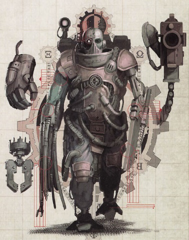

<!-- A0159-B0004 -->

原译文

Servitor with possible attachments 机仆及其可能配件

**校订译文**

Servitor with possible attachments 机仆及其可能配件

<!-- /A0159-B0004 -->

<!-- A0159-B0005 -->
## Overview 概述

<!-- /A0159-B0005 -->

<!-- A0159-B0006 -->
**英文原文**

While many are vat-grown, often a criminal, particularly one who has offended the Cult Mechanicus, will be sentenced to "Servitude Imperpituis" and will be handed over to the Tech-priests to be mind-wiped, reprogrammed, and cybernetically-enhanced to serve some specific, rudimentary function. Servitors are mindless, possessing only the most basic of instincts. Their brains are programmed to perform only the task they were designed for. In rare cases, physical trauma may cause fragments of the servitors' previous human personality to resurface. The altered and fragmented brain of a Servitor functions poorly unless constantly supervised. Most will go into a state of mindlock, babbling incoherent nonsense as the Servitor tries to assert some form of awareness.

<!-- /A0159-B0006 -->

<!-- A0159-B0007 -->

原译文

虽然许多人是快速生长的，但通常一名罪犯，特别是冒犯了机械神教的罪犯，将被判处“永恒奴役”，并将被移交给技术神甫进行思维清除、重新编程和智控增强，以服务于一些特定的、基本的功能。机仆是没有意识的，只拥有最基本的本能。他们的大脑被编程为只执行他们被设计的任务。在极少数情况下，身体创伤可能会导致机仆以前的人格碎片重新出现。除非不断监督，否则机仆的大脑会发生改变和分裂，功能很差。大多数机仆会进入一种思维锁定状态，在机仆试图断言某种形式的意识时胡言乱语。

**校订译文**

许多机仆在培养缸中长成，也常由罪犯制成，尤其是冒犯机械教派的人。这些罪犯被判“永恒奴役”，交给技术祭司抹去心智、重新编程并施以机械改造，执行特定的简单工作。机仆没有独立心智，仅保留最基本本能，大脑只能执行预设任务。极少数情况下，身体创伤会使其旧人格碎片重新浮现。机仆的大脑已经改造、支离破碎，缺乏持续监管便难以正常运作；多数会陷入心智锁闭，一面试图恢复某种意识，一面语无伦次地呓语。

<!-- /A0159-B0007 -->

<!-- A0159-B0008 图片 -->
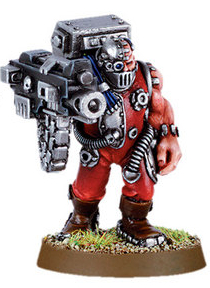

<!-- A0159-B0009 -->

原译文

Gun Servitor armed with an implanted Heavy Bolter 装有植入型重型爆矢枪的枪炮机仆

**校订译文**

Gun Servitor armed with an implanted Heavy Bolter 装有植入型重型爆矢枪的枪炮机仆

<!-- /A0159-B0009 -->

<!-- A0159-B0010 -->
**英文原文**

Servitors are created by the Adeptus Mechanicus, and supplied to departments of the Adeptus Terra such as the Administratum, and to the Inquisition. Servitors make up the vast bulk of the population of Mars and other Forge Worlds, where they fulfill the role of workers.

<!-- /A0159-B0010 -->

<!-- A0159-B0011 -->

原译文

机仆由机械神教创造，并提供给中央部政务部的部门，如内务部和审判庭。机仆占火星和其他铸造世界人口的绝大部分，他们在那里扮演着工人的角色。

**校订译文**

机仆由机械修会制造，供给内政部等中央政务部机构，以及审判庭。它们占火星与其他铸造世界人口的绝大多数，承担劳动者的角色。

<!-- /A0159-B0011 -->

<!-- A0159-B0012 图片 -->
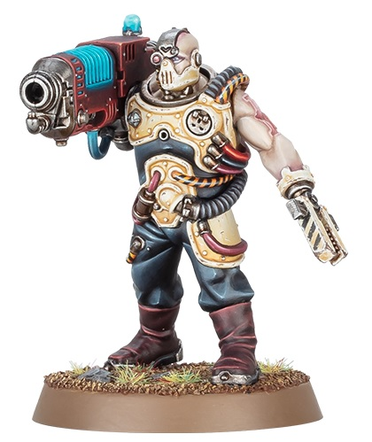

<!-- A0159-B0013 -->

原译文

Servitor with Plasma Gun 装备等离子枪的机仆

**校订译文**

Servitor with Plasma Gun 装备等离子枪的机仆

<!-- /A0159-B0013 -->

<!-- A0159-B0014 -->
**英文原文**

There are many types of Servitor, each designed for a certain task. Typical Servitors are "Technomats" which operate and service machines, "Holomats" which act as holographic recordists, "Lexomats" which are like human computers with tremendous calculating powers, and "Drones" which are living robots—stupid and essentially mindless slaves ideal for menial work and little else.

<!-- /A0159-B0014 -->

<!-- A0159-B0015 -->

原译文

有许多类型的机仆，每种都是为特定任务设计的。典型的机仆是操作和服务机器的技术机仆，充当全息记录员的全息机仆、像具有巨大计算能力的人类计算机一样的计算机仆，以及作为活的机器人的奴工—愚蠢且本质上没有意识的奴隶，非常适合做卑微的工作，几乎没有其他工作。

**校订译文**

机仆分为许多类型，各自执行特定任务。常见的有操作、维护机器的技术机仆，负责全息记录的全息机仆，拥有惊人计算能力、如同人体计算机的计算机仆，以及作为活体机器人的奴工。最后一种迟钝且基本没有意识，适于杂役，几乎不能承担其他工作。

<!-- /A0159-B0015 -->

<!-- A0159-B0016 -->
**英文原文**

Servitors are often used to carry out the more dangerous or laborious duties, such as heavy mining. They also accompany Tech-priest Enginseers on the battlefield with the Imperial Guard, as well as Space Marine Techmarines. These types aid in the repair of vehicles or sometimes carry large and dangerous weapons such as plasma cannons. For both forces, the Servitors are practically identical cybernetically, although the servitors of some Space Marine Chapters are created from failed Marine Initiates. Perhaps the most feared of all the Servitors are the Praetorian Servitors, a class of heavily armed and armoured Servitor created from Ogryn stock that are deployed by the Adeptus Mechanicus to guard the Tech-priests and temples dedicated to the Machine God.

<!-- /A0159-B0016 -->

<!-- A0159-B0017 -->

原译文

机仆通常用于执行更危险或更费力的任务，如重型采矿。他们还陪同技术神甫工造士与帝国卫队以及星际战士技术军士一起在战场上作战。这些机仆有助于维修车辆，有时还携带大型危险武器，如等离子炮。对于这两支部队来说，机仆在智控上几乎完全相同，尽管一些星际战士战团的机仆是用死去的星际战士新兵创造的。也许所有机仆中最令人恐惧的是禁卫机仆，这是一类全副武装和盔甲的机仆，用欧格林部队创造，由机械神教部署，守卫技术神甫和供奉万机神的神殿。

**校订译文**

机仆常承担重型采矿等危险或繁重工作，也随帝国卫队的技术祭司机械教士、星际战士的科技战士上战场，协助维修载具，有时携带等离子炮等大型危险武器。两类部队使用的机仆，机械改造基本相同；部分星际战士战团会把未能通过选拔的新兵改成机仆。最令人畏惧的或许是禁卫机仆：它们由欧格林改造，拥有厚重装甲与强大武备，由机械修会部署，保护技术祭司和万机神神殿。

**校注：** failed Marine Initiates 指选拔或改造未成功的新兵，不能凭 failed 推定为已经死去的人。

<!-- /A0159-B0017 -->

<!-- A0159-B0018 -->
**英文原文**

In theory any living thing with a sufficiently-developed nervous system can be converted into a Servitor, as evidenced by Servo-Raptors, Psyber-Eagles, and the Black Gobbo gretchin, but it is generally considered a sin against the Omnissiah to create them from sapient xenos. This has not, however, stopped a number of Magos from doing so despite their professed loyalty to the Mechanicus. House Delaque builds Spektors from Piscean brains, Vettius Telok commanded Servitors made of Orks, and Explorator Magos Caul went so far as to retrofit his Servitors with Tau weapons, communications systems, and even anti-grav suspensors.

<!-- /A0159-B0018 -->

<!-- A0159-B0019 -->

原译文

理论上，任何具有足够发达的神经系统的生物都可以转化为机仆，如伺服猛禽、灵能猎鹰和黑戈布屁精所证明的那样，但用聪明的异型创造它们通常被认为是对欧姆尼赛亚的亵渎。然而，这并没有阻止许多贤者这样做，尽管他们声称忠于机械神教。德拉奎家族用双鱼座的大脑建造了斯派托斯，维提乌斯·泰洛克指挥了由欧克制成的机仆，探索贤者科尔甚至用钛武器、通信系统，甚至反重力悬架改装了他的机仆。

**校订译文**

理论上，任何神经系统足够发达的生物都能改成机仆，伺服猛禽、灵能鹰与屁精黑戈布便是例子。不过，以有智慧的异形制造机仆，通常被视为亵渎欧姆尼赛亚。即使如此，一些自称忠于机械教的贤者仍会这样做：德拉奎家族以皮斯基安的大脑制造斯派托斯；维提乌斯·特洛克指挥欧克蛮人制成的机仆；探索贤者科尔甚至为机仆加装钛族武器、通信系统和反重力悬浮装置。

**校注：** Caul 不是 Cawl；此人暂沿用科尔，不与贝利萨留斯·考尔合并。

<!-- /A0159-B0019 -->

<!-- A0159-B0020 -->
**英文原文**

Servitors are extremely resistant to daemonic possession, utterly immune to the temptations of Daemons. However, with great effort, demonic possession of servitors is still possible, though daemons will find such hosts provide little in the way of succor and sustenance, as servitors lack much in the way of the emotions that normally sustain them.

<!-- /A0159-B0020 -->

<!-- A0159-B0021 -->

原译文

机仆对恶魔的占据具有极强的抵抗力，完全不受恶魔的诱惑。然而，经过巨大的努力，恶魔仍然有可能拥有机仆，尽管机仆会发现这些宿主提供的援助和养料很少，因为机仆们极度缺乏通常能够支撑它们的情感。

**校订译文**

机仆对恶魔附身抵抗力极强，完全不受恶魔诱惑。不过，恶魔付出巨大努力后，仍可能占据机仆。这样的宿主却难以提供多少滋养，因为它们缺少恶魔赖以维生的情绪。

<!-- /A0159-B0021 -->

<!-- A0159-B0022 -->
## Servitor Classes 机仆种类

<!-- /A0159-B0022 -->

<!-- A0159-B0023 -->
**英文原文**

Technical Servitors are a common sight in the Imperium; they are not intended for combat but are very useful in assisting battlefield operations. These are referred to as "mono-tasks", being physically changed and augmented to perform a specific function. Commonly they are used as load lifters and cranes, but more exotic mono-tasks include the heavy weapon mount and the mobile weapons rack. These are the standard Servitors that accompany a Tech-priest.

<!-- /A0159-B0023 -->

<!-- A0159-B0024 -->

原译文

技术机仆在帝国中很常见；它们不是用于战斗的，但在协助战场作战方面非常有用。被称为单任务机仆，在物理上被改变和增强以执行特定的功能。它们通常被用作负载升降机和起重机，但更奇异的单任务机仆包括重型武器架和移动武器架。这些是陪同技术神甫的标准机仆。

**校订译文**

技术机仆在帝国中很常见；它们不是用于战斗的，但在协助战场作战方面非常有用。被称为单任务机仆，在物理上被改变和增强以执行特定的功能。它们通常被用作负载升降机和起重机，但更奇异的单任务机仆包括重型武器架和移动武器架。这些是陪同技术祭司的标准机仆。

<!-- /A0159-B0024 -->

<!-- A0159-B0025 -->
**英文原文**

Golem Servitors are normally put to work at ports and can be equipped with thick pincer-hands.

<!-- /A0159-B0025 -->

<!-- A0159-B0026 -->

原译文

魔像机仆通常在港口工作，可以配备厚重的钳手。

**校订译文**

魔像机仆通常在港口工作，可以配备厚重的钳手。

<!-- /A0159-B0026 -->

<!-- A0159-B0027 图片 -->
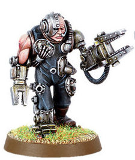

<!-- A0159-B0028 -->

原译文

Technical Servitor with arm implants that function as vices 带有手臂植入物的技术机仆，其功能类似于台钳

**校订译文**

Technical Servitor with arm implants that function as vices 带有手臂植入物的技术机仆，其功能类似于台钳

<!-- /A0159-B0028 -->

<!-- A0159-B0029 -->
**英文原文**

Servitor Pilots are designed to pilot Imperial aircraft and vehicles.

<!-- /A0159-B0029 -->

<!-- A0159-B0030 -->

原译文

机仆驾驶员旨在驾驶帝国飞机和车辆。

**校订译文**

机仆驾驶员旨在驾驶帝国飞机和车辆。

<!-- /A0159-B0030 -->

<!-- A0159-B0031 -->
**英文原文**

Combat Servitors are armed with highly effective combat weaponry and programmed with basic weapon routines in order to use them.

<!-- /A0159-B0031 -->

<!-- A0159-B0032 -->

原译文

战斗机仆配备了高效的战斗武器，并编程了基本的武器程序，以便使用它们。

**校订译文**

战斗机仆配备了高效的战斗武器，并编程了基本的武器程序，以便使用它们。

<!-- /A0159-B0032 -->

<!-- A0159-B0033 图片 -->
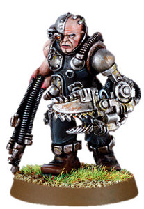

<!-- A0159-B0034 -->

原译文

Combat Servitor with an electro-flail and a small chainsword 装备电能鞭和小型链锯剑的战斗机仆

**校订译文**

Combat Servitor with an electro-flail and a small chainsword 装备电能鞭和小型链锯剑的战斗机仆

<!-- /A0159-B0034 -->

<!-- A0159-B0035 -->
**英文原文**

Arco-Eviscerators are a type of Combat Servitor.

<!-- /A0159-B0035 -->

<!-- A0159-B0036 -->

原译文

电弧开膛者是一种战斗机仆。

**校订译文**

电弧开膛者是一种战斗机仆。

<!-- /A0159-B0036 -->

<!-- A0159-B0037 -->
**英文原文**

Gun Servitors are military-grade units that are equipped with enhanced sensors, programmed with targeting cants and fitted with heavy weaponry.

<!-- /A0159-B0037 -->

<!-- A0159-B0038 -->

原译文

枪炮机仆是军用级单位，配备了增强的传感器，用瞄准密语编程，并配备了重型武器。

**校订译文**

枪炮机仆是军用级单位，配备了增强的传感器，用瞄准密语编程，并配备了重型武器。

<!-- /A0159-B0038 -->

<!-- A0159-B0039 图片 -->
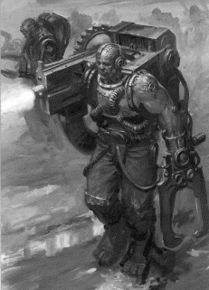

<!-- A0159-B0040 -->

原译文

Gun Servitor 枪炮机仆

**校订译文**

Gun Servitor 枪炮机仆

<!-- /A0159-B0040 -->

<!-- A0159-B0041 -->
**英文原文**

H-Grade Combat Servitor - Ogryn Combat Servitors, that can be used by the Astra Militarum

<!-- /A0159-B0041 -->

<!-- A0159-B0042 -->

原译文

高级战斗机仆 - 欧格林战斗机仆，可供星界军部队使用

**校订译文**

H 级战斗机仆——可供星界军使用的欧格林战斗机仆。

<!-- /A0159-B0042 -->

<!-- A0159-B0043 -->
**英文原文**

Herakli - Large Combat Servitors used by Adeptus Mechanicus armies.

<!-- /A0159-B0043 -->

<!-- A0159-B0044 -->

原译文

赫拉克利 - 机械神教军队使用的大型机仆。

**校订译文**

赫拉克利 - 机械修会军队使用的大型机仆。

<!-- /A0159-B0044 -->

<!-- A0159-B0045 -->
**英文原文**

Kataphron Battle Servitor — Powerful war Servitors used by the Adeptus Mechanicus.

<!-- /A0159-B0045 -->

<!-- A0159-B0046 -->

原译文

重型战斗机仆 — 机械神教使用的强大战争机仆。

**校订译文**

卡塔弗隆战斗机仆 — 机械修会使用的强大战争机仆。

<!-- /A0159-B0046 -->

<!-- A0159-B0047 -->
**英文原文**

Kill-Servitors - A type of Mutant Combat Servitor used by the Dark Mechanicum.

<!-- /A0159-B0047 -->

<!-- A0159-B0048 -->

原译文

杀戮机仆 - 黑暗机械教使用的一种变种战斗机仆。

**校订译文**

杀戮机仆 - 黑暗机械教使用的一种变种战斗机仆。

<!-- /A0159-B0048 -->

<!-- A0159-B0049 -->
**英文原文**

Dog Servitor are Dogs that have been turned into Servitors.

<!-- /A0159-B0049 -->

<!-- A0159-B0050 -->

原译文

机仆犬是指已经变成机仆的狗。

**校订译文**

机仆犬是指已经变成机仆的狗。

<!-- /A0159-B0050 -->

<!-- A0159-B0051 -->

原译文

Gunhounds 枪炮猎犬

**校订译文**

Gunhounds 枪炮猎犬

<!-- /A0159-B0051 -->

<!-- A0159-B0052 -->
**英文原文**

Industrial Servitors have been modified with rigs to lift loads, drill rocks or smash ore in one of the Imperium's countless industrial complexes.

<!-- /A0159-B0052 -->

<!-- A0159-B0053 -->

原译文

工业机仆已经过改装，可以在帝国无数的工业建筑群中提升载荷、钻探岩石或粉碎矿石。

**校订译文**

工业机仆已经过改装，可以在帝国无数的工业建筑群中提升载荷、钻探岩石或粉碎矿石。

<!-- /A0159-B0053 -->

<!-- A0159-B0054 -->
**英文原文**

Heavy Repair Servitors are fused with specialized repair gear.

<!-- /A0159-B0054 -->

<!-- A0159-B0055 -->

原译文

重型维修机仆与专门的维修设备融合在一起。

**校订译文**

重型维修机仆与专门的维修设备融合在一起。

<!-- /A0159-B0055 -->

<!-- A0159-B0056 -->
**英文原文**

Medical Servitors (also known as Med-Servitors or Medicae-Servitor) are programmed to provide medical care.

<!-- /A0159-B0056 -->

<!-- A0159-B0057 -->

原译文

医疗机仆（也称为治疗机仆或医护机仆）被编程为提供医疗服务。

**校订译文**

医疗机仆（也称为治疗机仆或医护机仆）被编程为提供医疗服务。

<!-- /A0159-B0057 -->

<!-- A0159-B0058 -->
**英文原文**

Cogitator Core Servitor - A forbidden form of Servitor used by House Van Saar on Necromunda. They are produced by taking the Cogitator systems from Necromunda's many monitoring and regulating systems and splicing them into a standard Servitor brain.

<!-- /A0159-B0058 -->

<!-- A0159-B0059 -->

原译文

沉思者核心机仆 - 凡萨尔家族在涅克罗蒙达上使用的一种被禁止的机仆形式。它们是通过从涅克罗蒙达的许多监测和调节系统中提取沉思者系统，并将其拼接到标准的机仆大脑中而产生的。

**校订译文**

沉思者核心机仆 - 凡萨尔家族在涅克罗蒙达上使用的一种被禁止的机仆形式。它们是通过从涅克罗蒙达的许多监测和调节系统中提取沉思者系统，并将其拼接到标准的机仆大脑中而产生的。

<!-- /A0159-B0059 -->

<!-- A0159-B0060 -->
**英文原文**

Cenobyte Servitors (also — Cenobite Servitors) assist the Chaplains of the Black Templars. They are used to carry relics into battle and intone prayers to the God-Emperor, as well as all other jobs given to normal servitors. It is known that the Neophytes of the Black Templars who failed their duty became Cenobyte Servitors.

<!-- /A0159-B0060 -->

<!-- A0159-B0061 -->

原译文

修士机仆（也称为隐修机仆）协助黑色圣堂的牧师。它们被用来携带圣物进入战场，向神皇祈祷，以及给普通机仆的所有其他工作。众所周知，未能履行职责的黑色圣堂的新进者成为了修士机仆。

**校订译文**

修士机仆（英文亦写作 Cenobite Servitors）协助黑色圣堂的教士，负责携圣物上阵、吟诵赞颂神皇的祷文，也承担普通机仆的其他工作。已知黑色圣堂未尽职责的新兵会被改成修士机仆。

<!-- /A0159-B0061 -->

<!-- A0159-B0062 图片 -->
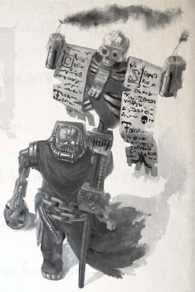

<!-- A0159-B0063 -->

原译文

Cenobyte Servitor with a Black Templar standard 配备黑色圣堂旗帜的修士机仆

**校订译文**

Cenobyte Servitor with a Black Templar standard 配备黑色圣堂旗帜的修士机仆

<!-- /A0159-B0063 -->

<!-- A0159-B0064 -->
**英文原文**

The Samech Redemption Servitor is a pattern designed to scavenge the wastes of Samech, and are relatively autonomous, with the ability to self-repair and an instinct to seek out valuable technology, powered mainly through Transmuter Cores. Creation of a Redemption Servitor involves heavy replacement of the neck, arm, and leg joints with pivots that provide almost 360 degree rotation, a torso with four additional limbs, creating a squat arachnid profile and most models also use epidermal armour plating. Although its design varies with the forge of manufacture, it incorporates several pieces of Samech’s electro-magnetic wargear.

<!-- /A0159-B0064 -->

<!-- A0159-B0065 -->

原译文

萨米奇赎罪机仆是一种旨在清除萨米奇废物的型号，相对自主，具有自我修复的能力和寻找有价值技术的本能，主要通过变速核心提供动力。创造一个赎罪机仆需要用重型枢轴替换颈部、手臂和腿部关节，提供近360度的旋转，躯干有四个额外的肢体，形成一个蹲下的蛛形纲动物轮廓，大多数型号还使用表皮的装甲板。尽管其设计因制造工艺而异，但它融合了萨米奇的几件电磁战争装备。

**校订译文**

萨米奇赎罪机仆专为在萨米奇荒原中拾荒而造，主要由转化核心供能，具有较高自主性、自我修复能力，以及搜寻宝贵技术的本能。颈部和四肢关节大量换成近乎可旋转360度的枢轴，躯干另增四肢，整体低矮如蛛，多数还植有表皮装甲板。设计随制造铸造厂而异，但都采用萨米奇的若干电磁武备。

<!-- /A0159-B0065 -->

<!-- A0159-B0066 -->
**英文原文**

The Standard Configuration has a techxorcism cannon usually installed in the chest and fired through the gullet for neutralising other technological enemies and scavenging machines that may not be completely inert. In order to reach and disassemble precarious wreckage, also containing an auxiliary magnetic repulsion system that allows them to traverse unstable structures and its spindly limbs are capable of puncturing steel.

<!-- /A0159-B0066 -->

<!-- A0159-B0067 -->

原译文

标准配置有一门技术驱魔炮，通常安装在胸部，通过管道发射，用于中和其他技术敌人和可能未完全失去动力的拾荒机器。为了拾取和拆卸不稳定的残骸，还包含一个辅助磁排斥系统，使它们能够穿过不稳定的结构，其细长的肢体能够刺穿钢铁。

**校订译文**

标准型通常在胸腔内安装技术驱魔炮，经咽喉开火，用于制服其他机械敌人，也便于回收尚未完全停止运作的机器。为抵近并拆解危险残骸，它们装有辅助磁斥系统，能攀越不稳固的结构；细长肢体足以刺穿钢铁。

<!-- /A0159-B0067 -->

<!-- A0159-B0068 -->
**英文原文**

Guardian Configuration servitors have their plasma cutters replaced with other armaments. Solid ammunition weapons with an extended ammo feed stored in the servitor’s hollow chest cavity. With more two climbing spindles affixed with chain or power weapons.

<!-- /A0159-B0068 -->

<!-- A0159-B0069 -->

原译文

守护者配置机仆将等离子切割枪替换为其他武器。有着扩展弹药供给的实弹武器，弹药储存在机仆的中空胸腔中。另外还有两根上升主轴，上面配备了链锯武器或动力武器。

**校订译文**

守卫型以其他武器替换等离子切割器。实弹武器通过延长供弹机构，从机仆中空胸腔内的弹药储藏供弹；另有两条攀爬肢装上链锯或动力武器。

<!-- /A0159-B0069 -->

<!-- A0159-B0070 -->
**英文原文**

The Retriever Configuration is designed for live capture, provided the target can be recovered from the servitor afterwards. They are usually mounted with a webber on its exterior, and a primitive auspex package is often added for tracking bio-signs.

<!-- /A0159-B0070 -->

<!-- A0159-B0071 -->

原译文

回收器配置专为实时捕获而设计，前提是目标可以在事后从机仆身上恢复。它们通常在外部安装一个网状物，并且通常会添加一个原始的鸟卜仪盒来跟踪生物标记。

**校订译文**

捕获型用于活捉目标，前提是事后还能从机仆那里取回俘虏。它们通常在体外安装蛛网枪，还常配简易鸟卜仪组件追踪生命信号。

<!-- /A0159-B0071 -->

<!-- A0159-B0072 -->
**英文原文**

Skulker Configuration servitors are equipped for the express purpose of causing terror and disruption in Imperial populations. It is claimed that such versions have enhanced vox units that produce a range of unhallowed cries. The units are also frequently described as being rusty and in poor repair.

<!-- /A0159-B0072 -->

<!-- A0159-B0073 -->

原译文

潜伏者配置机仆装备的明确目的是在帝国公民中制造恐怖和混乱。据称，这些版本增强了音阵单元，可以产生一系列亵渎的哭声。这些装置也经常被描述为嘶哑的和维修不良的。

**校订译文**

潜伏型专门用于在帝国民众中制造恐惧与混乱。据称，它们强化过的通讯装置能发出各种不洁哀嚎，机体也常被描述为锈迹斑斑、失修破败。

<!-- /A0159-B0073 -->

<!-- A0159-B0074 -->
**英文原文**

Ecclesiarchal Servitors are exclusively used by the Sisters of Battle. They are specially modified by the Adeptus Mechanicus to suit the Sisters' needs and are dispatched first into combat zones to provide essential infrastructure for the Sister's campaigns; as well as providing maintenance for damaged vehicles and buildings. The Ecclesiarchal Servitor also has the ability to dismantle enemy fortifications, using its deep knowledge of structural engineering to cause extreme damage to enemy buildings.

<!-- /A0159-B0074 -->

<!-- A0159-B0075 -->

原译文

国教机仆仅供战斗修女使用。它们由机械神教专门改装，以满足修女的需求，并首先被派往战区，为修女的战役提供必要的基础设施；以及为受损的车辆和建筑物提供维护。国教机仆也有能力拆除敌人的防御工事，利用其深厚的结构工程知识对敌人的建筑造成极大的破坏。

**校订译文**

国教机仆仅供战斗修女使用。它们由机械修会专门改装，以满足修女的需求，并首先被派往战区，为修女的战役提供必要的基础设施；以及为受损的车辆和建筑物提供维护。国教机仆也有能力拆除敌人的防御工事，利用其深厚的结构工程知识对敌人的建筑造成极大的破坏。

<!-- /A0159-B0075 -->

<!-- A0159-B0076 图片 -->
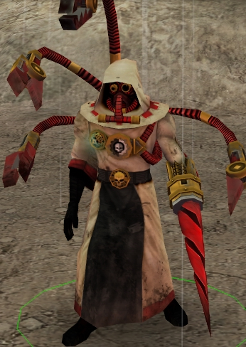

<!-- A0159-B0077 -->

原译文

Ecclesiarchal Servitor 国教机仆

**校订译文**

Ecclesiarchal Servitor 国教机仆

<!-- /A0159-B0077 -->

<!-- A0159-B0078 -->
**英文原文**

Macro Servitors are extremely large and are invaluable tools on archeological digs or journeys into underground tombs. Their drills and chainblades are also very handy in fights.

<!-- /A0159-B0078 -->

<!-- A0159-B0079 -->

原译文

巨型机仆非常大，是考古挖掘或地下墓穴之旅的宝贵工具。他们的钻头和链锯刃在战斗中也很方便。

**校订译文**

巨型机仆非常大，是考古挖掘或地下墓穴之旅的宝贵工具。他们的钻头和链锯刃在战斗中也很方便。

<!-- /A0159-B0079 -->

<!-- A0159-B0080 图片 -->
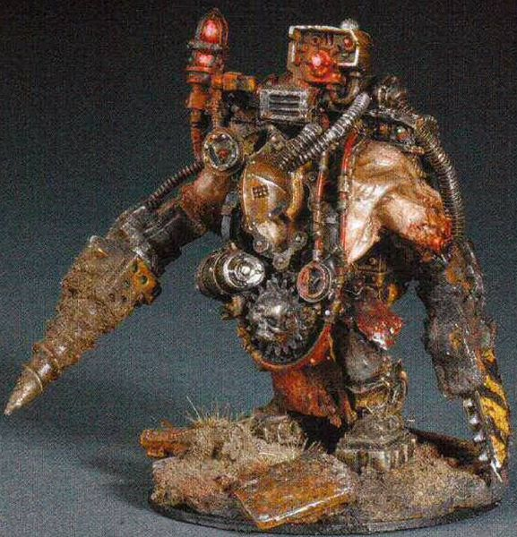

<!-- A0159-B0081 -->

原译文

Macro Servitor 巨型机仆

**校订译文**

Macro Servitor 巨型机仆

<!-- /A0159-B0081 -->

<!-- A0159-B0082 -->
**英文原文**

Munitorum Servitors are used by the Departmento Munitorum in countless menial ways. They are also sent to serve Enginseers in the Astra Militarum. There the Servitors used their industrial servo-arms to help with repairs and to also attack any foe that gets near them.

<!-- /A0159-B0082 -->

<!-- A0159-B0083 -->

原译文

军务机仆被军务部部以无数卑微的方式使用。他们也被派往星界军服役。在那里，机仆使用他们的工业伺服臂来帮助维修，并攻击任何靠近他们的敌人。

**校订译文**

军务机仆为军务部承担各类杂役，也被派往星界军，协助工造士。它们用工业伺服臂修理装备，也会攻击靠近的敌人。

<!-- /A0159-B0083 -->

<!-- A0159-B0084 -->
**英文原文**

Runner-Servitor used by Imperial Army Regiments to gather bins filled with spent lasgun powercells. The Servitors would then drag the bins away to recharge the powercells with a Charger Maw, before returning them to the Regiment's Troopers.

<!-- /A0159-B0084 -->

<!-- A0159-B0085 -->

原译文

帝国陆军用来收集装满报废激光枪能量电池的箱子的传递机仆。然后，机仆会把箱子拖走，用充能器给电池充电，然后把它们还给陆军团的士兵。

**校订译文**

传递机仆——供帝国军各团使用，收集装满耗尽电量的激光枪能量电池的箱子，将其拖去，利用充能巨口重新充电，再送回士兵手中。

<!-- /A0159-B0085 -->

<!-- A0159-B0086 -->
**英文原文**

Servitor Imps are made from diminutive Human bodies, though they are still able to carry heavy objects.

<!-- /A0159-B0086 -->

<!-- A0159-B0087 -->

原译文

机仆小鬼是由矮小的人体制成的，尽管它们仍然能够携带重物。

**校订译文**

机仆小鬼是由矮小的人体制成的，尽管它们仍然能够携带重物。

<!-- /A0159-B0087 -->

<!-- A0159-B0088 图片 -->
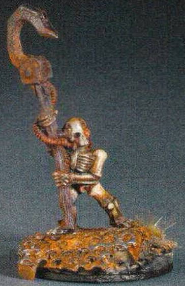

<!-- A0159-B0089 -->

原译文

Servitor Imp 机仆小鬼

**校订译文**

Servitor Imp 机仆小鬼

<!-- /A0159-B0089 -->

<!-- A0159-B0090 -->
**英文原文**

Xenolinguitor Servitors are designed to translate Xeno texts and write down the translations for the Imperium use.

<!-- /A0159-B0090 -->

<!-- A0159-B0091 -->

原译文

异型语机仆旨在翻译异型文本并写下翻译供帝国使用。

**校订译文**

异形语机仆旨在翻译异形文本并写下翻译供帝国使用。

<!-- /A0159-B0091 -->

<!-- A0159-B0092 -->
**英文原文**

Servo-scrutinary Familiars are employed as parts of Enhanced Surveillance Systems.

<!-- /A0159-B0092 -->

<!-- A0159-B0093 -->

原译文

伺服审查变异者被用作增强监控系统的一部分。

**校订译文**

伺服侦察使魔——增强监视系统的组成部分。

<!-- /A0159-B0093 -->

<!-- A0159-B0094 -->
**英文原文**

Squat Servitor - Squats that have been converted into Servitors.

<!-- /A0159-B0094 -->

<!-- A0159-B0095 -->

原译文

矮人机仆 - 已转换为机仆的矮人。

**校订译文**

斯夸特机仆——由斯夸特改造的机仆。

<!-- /A0159-B0095 -->

<!-- A0159-B0096 图片 -->
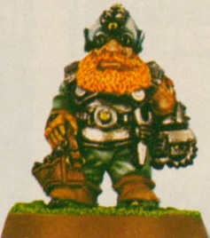

<!-- A0159-B0097 -->

原译文

Squat Servitor 矮人机仆

**校订译文**

Squat Servitor 斯夸特机仆

<!-- /A0159-B0097 -->

<!-- A0159-B0098 -->
**英文原文**

Choir Servitors are skinny, limbless cyborgs with concealed the mechanical workings to keep them half-alive. Iron plates are bolted over their eye-sockets and vox-amp grilles are fixed over their mouths. Their heads are linked with ribbed cables connecting their singing in perfect synchronicity. Other models include a variant hardwired into a massive mechanical steam organ.

<!-- /A0159-B0098 -->

<!-- A0159-B0099 -->

原译文

唱诗班机仆是瘦骨嶙峋、没有四肢的半机械人，他们隐藏着机械装置，以保持半存活状态。铁板用螺栓固定在他们的眼窝上，音阵放大格栅固定在他们嘴上。他们的头与肋状电缆相连，完美同步地连接着他们的歌声。其他型号包括一种硬连线到大型机械蒸汽机中的变体。

**校订译文**

唱诗机仆是瘦削、无肢的半机械人，隐蔽的机械系统使其保持半生状态。眼窝上钉着铁板，嘴部装有扩音格栅；头部由带棱纹的缆线连接，使歌声完全同步。另有型号被直接接入巨大的机械蒸汽管风琴。

<!-- /A0159-B0099 -->

<!-- A0159-B0100 -->
**英文原文**

Servitor-Ogryn - Ogryns that have been converted into Servitors.

<!-- /A0159-B0100 -->

<!-- A0159-B0101 -->

原译文

欧格林机仆 - 已转换为机仆的欧格林。

**校订译文**

欧格林机仆 - 已转换为机仆的欧格林。

<!-- /A0159-B0101 -->

<!-- A0159-B0102 -->

原译文

H-Grade Combat Servitor 高级战斗机仆

**校订译文**

H-Grade Combat Servitor H 级战斗机仆

<!-- /A0159-B0102 -->

<!-- A0159-B0103 图片 -->
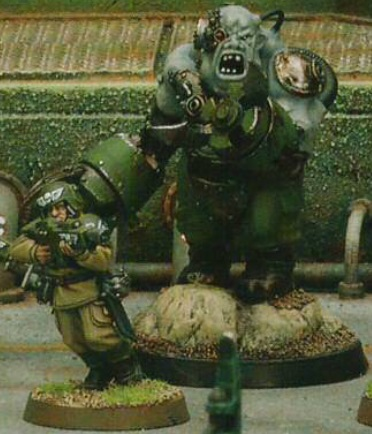

<!-- A0159-B0104 -->

原译文

H-Grade Combat Servitor 高级战斗机仆

**校订译文**

H-Grade Combat Servitor H 级战斗机仆

<!-- /A0159-B0104 -->

<!-- A0159-B0105 -->

原译文

Ogryn Kataphron Destroyer‎ 欧格林重型破坏者

**校订译文**

Ogryn Kataphron Destroyer‎ 欧格林铁甲破坏者

**校注：** Kataphron Destroyer 官译铁甲破坏者；这里带 Ogryn 限定的变种全称是据官译组合，非独立核实官译。

<!-- /A0159-B0105 -->

<!-- A0159-B0106 图片 -->
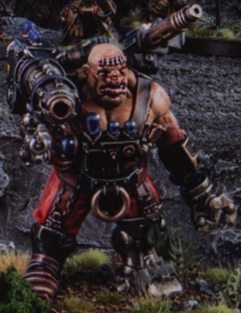

<!-- A0159-B0107 -->

原译文

Ogryn Kataphron Destroyer 欧格林重型破坏者

**校订译文**

Ogryn Kataphron Destroyer 欧格林铁甲破坏者

<!-- /A0159-B0107 -->

<!-- A0159-B0108 -->

原译文

Praetorian Servitor 禁卫机仆

**校订译文**

Praetorian Servitor 禁卫机仆

<!-- /A0159-B0108 -->

<!-- A0159-B0109 -->
**英文原文**

Heavenly Host - Similar to Cherub's

<!-- /A0159-B0109 -->

<!-- A0159-B0110 -->

原译文

天堂之主 - 类似于智天使

**校订译文**

天军——类似智天使。

<!-- /A0159-B0110 -->

<!-- A0159-B0111 -->

原译文

Servo-rat 伺服鼠

**校订译文**

Servo-rat 伺服鼠

<!-- /A0159-B0111 -->

<!-- A0159-B0112 -->

原译文

Space Marine Servitor 星际战士机仆

**校订译文**

Space Marine Servitor 星际战士机仆

<!-- /A0159-B0112 -->

<!-- A0159-B0113 -->

原译文

Aspirant Servitor 有志者机仆

**校订译文**

Aspirant Servitor 候选者机仆

<!-- /A0159-B0113 -->

<!-- A0159-B0114 -->
**英文原文**

Thrall-Servitor of the Space Wolves

<!-- /A0159-B0114 -->

<!-- A0159-B0115 -->

原译文

太空野狼的束缚机仆

**校订译文**

太空野狼的束缚机仆

<!-- /A0159-B0115 -->

<!-- A0159-B0116 -->
**英文原文**

Gretchin Servitor - Xenos Servitors made from the Gretchin species

<!-- /A0159-B0116 -->

<!-- A0159-B0117 -->

原译文

屁精机仆 - 由屁精物种制成的异型机仆

**校订译文**

屁精机仆 - 由屁精物种制成的异形机仆

<!-- /A0159-B0117 -->

<!-- A0159-B0118 -->

原译文

Servo-Raptor 伺服猛禽

**校订译文**

Servo-Raptor 伺服猛禽

<!-- /A0159-B0118 -->

<!-- A0159-B0119 -->

原译文

Tractoris Servitor 牵引机仆

**校订译文**

Tractoris Servitor 牵引机仆

<!-- /A0159-B0119 -->

<!-- A0159-B0120 -->

原译文

Hunter Servitor 猎手机仆

**校订译文**

Hunter Servitor 猎手机仆

<!-- /A0159-B0120 -->

<!-- A0159-B0121 -->

原译文

Servitor-strider 机仆步行机

**校订译文**

Servitor-strider 机仆步行机

<!-- /A0159-B0121 -->

<!-- A0159-B0122 -->

原译文

Feral Servitor 野蛮机仆

**校订译文**

Feral Servitor 野蛮机仆

<!-- /A0159-B0122 -->

<!-- A0159-B0123 -->

原译文

Ratting servitor 莱特林机仆

**校订译文**

Ratting servitor 莱特林机仆

**校注：** 英文 Ratting servitor 可能为 Ratling 的拼写错误；原译莱特林暂保留，需查原出处，不将英文静默改字。

<!-- /A0159-B0123 -->

<!-- A0159-B0124 -->
**英文原文**

Obliviate - a type of servitor utterly devoid of cognition, left a soulless automata. The Mechanicum was forced to accept it as a form of Tech-Heresy due to the pressure of Adeptus Ministorum and Ordo Hereticus, abhorred with the destruction of the soul.

<!-- /A0159-B0124 -->

<!-- A0159-B0125 -->

原译文

遗忘者 - 一种完全没有认知的机仆，留下了一个没有灵魂的机兵。由于国教和讨逆修会的压力，机械神教被迫接受它作为一种技术异端，他们憎恨灵魂的毁灭。

**校订译文**

遗忘者——认知能力被彻底抹除、沦为无魂自动机的机仆。国教会与异端审判庭憎恶这种毁灭灵魂的做法，迫使机械教承认它属于技术异端。

**校注：** 原文写 Mechanicum 而非 Adeptus Mechanicus，依文本保留机械教；recognise as heresy 的施受关系已修正为承认该技术属异端，并非接纳此种机仆。

<!-- /A0159-B0125 -->

<!-- A0159-B0126 -->
**英文原文**

Janus Simulacrum - a type of servitor with only the barest use of organic tissue, it's operation steered away from the living cortex towards a cogitator. Although used only as a pecularity in the wealthiest's collections some more irate tried to bring its cogitator towards sentience and awareness, their ambition answered in their doom from the Cult Mechanicus, which does not tread lightly around the threat of AI.

<!-- /A0159-B0126 -->

<!-- A0159-B0127 -->

原译文

杰纳斯拟像是一种只使用最少量的有机组织的机仆，它的运行并非由活体大脑皮层操控，而是由沉思者引导。尽管它仅作为奇珍异品出现在最富有的人的收藏中，但仍有一些更加狂热的人试图让其沉思者产生感知和意识。他们的野心最终以厄运告终，因为机械神教对于人工智能的威胁绝不姑息。

**校订译文**

杰纳斯拟像是一种只使用最少量的有机组织的机仆，它的运行并非由活体大脑皮层操控，而是由沉思者引导。尽管它仅作为奇珍异品出现在最富有的人的收藏中，但仍有一些更加狂热的人试图让其沉思者产生感知和意识。他们的野心最终以厄运告终，因为机械修会对于人工智能的威胁绝不姑息。

<!-- /A0159-B0127 -->

<!-- A0159-B0128 -->
**英文原文**

Archivids - Spindly constructs that resemble the arachnids of ancient Terra, designed to torture and extract data from prisoners.

<!-- /A0159-B0128 -->

<!-- A0159-B0129 -->

原译文

归档者 — 类似于古代泰拉蜘蛛的细长结构，旨在折磨囚犯并从中获取数据。

**校订译文**

归档者 — 类似于古代泰拉蜘蛛的细长结构，旨在折磨囚犯并从中获取数据。

<!-- /A0159-B0129 -->

<!-- A0159-B0130 -->
**英文原文**

Excruciator Servitor - Designed to torture and extract data from prisoners.

<!-- /A0159-B0130 -->

<!-- A0159-B0131 -->

原译文

刑讯机仆 - 旨在折磨囚犯并从中获取数据。

**校订译文**

刑讯机仆 - 旨在折磨囚犯并从中获取数据。

<!-- /A0159-B0131 -->

<!-- A0159-B0132 -->
## Notable Servitors 著名机仆

<!-- /A0159-B0132 -->

<!-- A0159-B0133 -->
**英文原文**

X-101

<!-- /A0159-B0133 -->

<!-- A0159-B0134 -->

原译文

Ismael de Roeven 伊斯梅尔·德·罗文

**校订译文**

Ismael de Roeven 伊斯梅尔·德·罗文

<!-- /A0159-B0134 -->

<!-- A0159-B0135 -->

原译文

Signa-IX 西尼亚四号

**校订译文**

Signa-IX 西尼亚九号

<!-- /A0159-B0135 -->

<!-- A0159-B0136 -->

原译文

The first Black Gobbo 第一黑戈布

**校订译文**

The first Black Gobbo 第一黑戈布

<!-- /A0159-B0136 -->

<!-- A0159-B0137 图片 -->
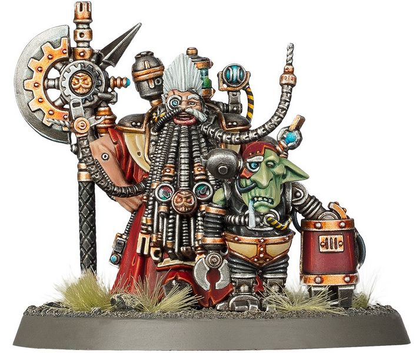

<!-- A0159-B0138 -->

原译文

The first Black Gobbo as a Gretchin Servitor 屁精机仆第一黑戈布

**校订译文**

The first Black Gobbo as a Gretchin Servitor 屁精机仆第一黑戈布

<!-- /A0159-B0138 -->

<!-- A0159-B0139 -->
**英文原文**

0049-X//33-I

<!-- /A0159-B0139 -->

本篇核心术语与暂定项

以下列出本篇出现的英文原形及核心术语表用词。同形词可能指不同对象，具体词义以本篇正文和校注为准；单复数、别名和仅见于图注的名称可能尚未列入。完整候选见[术语表](../../术语表/双语术语候选.csv)。

| 英文 | 采用中文 | 状态 |
| --- | --- | --- |
| Black Templars | 黑色圣堂 | 官方已核对 |
| Space Wolves | 太空野狼 | 官方已核对 |
| Adeptus Mechanicus | 机械修会 | 官方已核对 |
| Astra Militarum | 星界军 | 官方已核对 |
| Imperial Guard | 帝国卫队 | 暂定·语境区分 |
| Imperial Army | 帝国军 | 暂定·官方待核 |
| Orks | 欧克蛮人 | 官方已核对 |
| Ogryn | 欧格林 | 官方已核对 |
| Inquisition | 审判庭 | 暂定 |
| Imperium | 帝国 | 暂定·简称 |
| Mechanicum | 机械教 | 暂定·历史称谓 |
| Cult Mechanicus | 机械教派 | 暂定·概念区分 |
| Tech-Priest | 技术祭司 | 官方已核对 |
| Dark Mechanicum | 黑暗机械教 | 暂定·官方待核 |
| Servitor | 机仆 | 暂定 |
| Administratum | 内政部 | 暂定 |
| Emperor | 帝皇 | 官方已核对 |
| Adeptus Terra | 中央政务部 | 暂定 |
| Adeptus Ministorum | 国教会 | 暂定 |
| Departmento Munitorum | 军务部 | 暂定 |
| Mutant | 变种人 | 暂定·官方待核 |
| Necromunda | 涅克罗蒙达 | 暂定·官方待核 |
| House Van Saar | 凡·萨尔家族 | 暂定·官方待核 |
| Gretchin | 屁精 | 官方已核对 |
| Terra | 泰拉 | 暂定·官方待核 |
| Sisters of Battle | 战斗修女 | 暂定·官方待核 |
| Ordo Hereticus | 异端审判庭 | 用户指定 |
| Machine God | 万机神 | 暂定·官方待核 |
| Omnissiah | 欧姆尼赛亚 | 暂定·官方待核 |
| Squats | 矮人 | 暂定·官方待核 |
| Mars | 火星 | 暂定·官方待核 |
| Servitor-Ogryn | 欧格林机仆 | 暂定·官方待核 |
| H-Grade Combat Servitor | H 级战斗机仆 | 暂定·官方待核 |
| Tech | 技术语 | 暂定·官方待核 |
| Cenobite | 共修修士 | 暂定 |
| Ancient | 旗手 | 官方已核对 |
| Praetorian | 禁卫兵 | 暂定·官方待核 |
| Kataphron Battle Servitor | 卡塔弗隆战斗机仆 | 暂定·官方待核 |
| Cenobyte Servitors | 修士机仆 | 暂定·官方待核 |
| Samech Redemption Servitor | 萨米奇赎罪机仆 | 暂定·官方待核 |
| Heavenly Host | 天军 | 暂定·官方待核 |
| Obliviate | 遗忘者 | 暂定·官方待核 |
| Space Marine | 星际战士 | 暂定·官方待核 |
| Raptors | 猛禽 | 暂定·官方待核 |
| The Black Templars | 黑色圣堂 | 暂定·官方待核 |
| Medicae | 医疗工 | 暂定·官方待核 |
| Initiates | 进阶者 | 官方已核 |
| Powers | 能天使 | 暂定·官方待核 |
| Host | 天军 | 暂定·官方待核 |
| Xenos | 异形 | 暂定·官方待核 |
| Chaplains | 教士 | 暂定·官方待核 |
| Janus | 雅努斯 | 暂定·官方待核 |
| Gun | 甘 | 暂定·官方待核 |
| The Dark | 《黑暗》 | 暂定·官方待核 |
| System | 星系（恒星系统） | 暂定·官方待核 |
| Samech | 萨姆西 | 暂定·官方待核 |
| Webber | 射网枪 | 暂定·官方待核 |
| The Altered | 变化者 | 暂定·官方待核 |
| Cants | 坎茨语 | 暂定·官方待核 |
| Power Weapons | 动力武器 | 暂定·官方待核 |
| Auspex | 鸟卜仪 | 暂定·官方待核 |
| Unhallowed | 渎圣号 | 暂定·官方待核 |
| The Wastes | 大荒地 | 暂定·官方待核 |
| Piscean | 皮斯凯恩族 | 暂定·官方待核 |
| House Delaque | 德拉奎家族 | 暂定·官方待核 |

