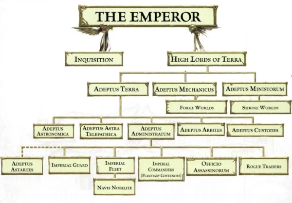

# 0160 中央政务部 Adeptus Terra

精校状态：中文行文已逐段精校，部分术语仍为暂定

分类：通用概念 / 帝国 Imperium / 中央政务部 Adeptus Terra

原文来源：https://www.bilibili.com/opus/1070767086727331845

原作者：帝国神选罐头

原文时间：编辑于 2025年06月01日 13:20

[返回分类目录](目录.md) · [全书目录](../../目录.md)

<!-- A0160-B0001 -->
**英文原文**

The Adeptus Terra, also known as the Priesthood of Earth, is the central organisation of the Imperium, to which most of the Imperium's other official departments and organisations belong. Only the Ecclesiarchy, Adeptus Mechanicus, and the Inquisition are not formally a part of the Adeptus Terra, while the Space Marines are only loosely affiliated.

<!-- /A0160-B0001 -->

<!-- A0160-B0002 -->

原译文

中央政务部，也称为地球祭司，是帝国的核心组织，帝国的大多数其他官方部门和组织都属于这个组织。只有国教、机械神教和审判庭没有正式成为中央政务部的一部分，而星际战士只是松散的附属机构。

**校订译文**

中央政务部，也称为泰拉教士团，是帝国的核心组织，帝国的大多数其他官方部门和组织都属于这个组织。只有国教、机械修会和审判庭没有正式成为中央政务部的一部分，而星际战士只是松散的附属机构。

<!-- /A0160-B0002 -->

<!-- A0160-B0003 图片 -->

<!-- A0160-B0004 -->

原译文

Symbol of the Adeptus Terra 中央政务部标志

**校订译文**

Symbol of the Adeptus Terra 中央政务部标志

<!-- /A0160-B0004 -->

<!-- A0160-B0005 -->
## Overview 概述

<!-- /A0160-B0005 -->

<!-- A0160-B0006 -->
**英文原文**

The Adeptus Terra is an umbrella organisation, and not really an organisation in itself, as each of its divisions functions largely autonomously. The most powerful individual in the Adeptus Terra (and if not in theory, then in practice, the entire Imperium) is the Master of the Administratum.

<!-- /A0160-B0006 -->

<!-- A0160-B0007 -->

原译文

中央政务部是一个伞式组织，本身并不是一个真正的组织，因为它的每个部门在很大程度上都是自主运作的。在中央政务部（如果不是在理论上，那么在实践中，整个帝国）中权力最大的个人是内务部长。

**校订译文**

中央政务部是各机构的统合体系，而非统一运作的单一组织，旗下各部门基本自主运行。内政部之主是其中权力最大的人；即使理论上并非如此，实际权势也可能冠于整个帝国。

<!-- /A0160-B0007 -->

<!-- A0160-B0008 -->
**英文原文**

Membership to any of the various agencies of the Adeptus Terra is coveted by many of the commoners of the Imperium seeking to obtain a better life for both themselves and their families as even low-level membership comes with it exclusive privileges not given to normal Imperial citizens. At the same time the Priesthood is viewed with a large amount of fear and suspicion by the Imperial populace, who pray it will never infringe upon their lives or their worlds. The gaze of the Adeptus Terra often carries with it the chance of being swept up in endless wars or liquidated in pogroms instituted by overly zealous bureaucrats.

<!-- /A0160-B0008 -->

<!-- A0160-B0009 -->

原译文

帝国的许多平民都渴望成为中央政务部各种机构的成员，他们寻求为自己和家人获得更好的生活，因为即使是低级别的成员也会获得普通帝国公民所没有的特权。与此同时，帝国民众对地球祭司充满了恐惧和怀疑，他们祈祷地球祭司永远不会侵犯他们的生活或世界。中央政务部的凝视往往伴随着被卷入无休止的战争或被过于狂热的官僚发动的大屠杀所清算的机会。

**校订译文**

许多帝国平民渴望加入中央政务部的机构，改善自己与家人的生活，因为低阶成员也享有普通公民得不到的特权。与此同时，民众又对泰拉教士团充满恐惧与猜疑，祈祷它永远别介入自己的生活或所在世界。一旦被中央政务部盯上，就可能卷入无休止的战争，或死于狂热官僚发动的清洗屠杀。

<!-- /A0160-B0009 -->

<!-- A0160-B0010 图片 -->

<!-- A0160-B0011 -->

原译文

Organisation of the Imperial government 帝国政府组织

**校订译文**

Organisation of the Imperial government 帝国政府组织

<!-- /A0160-B0011 -->

<!-- A0160-B0012 -->
### Organization 组织

<!-- /A0160-B0012 -->

<!-- A0160-B0013 -->
**英文原文**

The following are all formally part of the Adeptus Terra

<!-- /A0160-B0013 -->

<!-- A0160-B0014 -->

原译文

以下都是中央政务部的正式组成部分

**校订译文**

以下都是中央政务部的正式组成部分

<!-- /A0160-B0014 -->

<!-- A0160-B0015 -->

原译文

Adeptus Administratum 内务部

**校订译文**

Adeptus Administratum 内政部

<!-- /A0160-B0015 -->

<!-- A0160-B0016 -->

原译文

Departmento Munitorum 军务部

**校订译文**

Departmento Munitorum 军务部

<!-- /A0160-B0016 -->

<!-- A0160-B0017 -->

原译文

Imperial Guard 帝国卫队

**校订译文**

Imperial Guard 帝国卫队

<!-- /A0160-B0017 -->

<!-- A0160-B0018 -->

原译文

Ordo Tempestus 风暴军

**校订译文**

Ordo Tempestus 风暴军

<!-- /A0160-B0018 -->

<!-- A0160-B0019 -->

原译文

Departmento Exacta 记校部

**校订译文**

Departmento Exacta 记校部

<!-- /A0160-B0019 -->

<!-- A0160-B0020 -->

原译文

Officio Assassinorum 刺客庭

**校订译文**

Officio Assassinorum 刺客庭

<!-- /A0160-B0020 -->

<!-- A0160-B0021 -->

原译文

Estate Imperium 帝国档案局

**校订译文**

Estate Imperium 帝国档案局

<!-- /A0160-B0021 -->

<!-- A0160-B0022 -->

原译文

Imperial Fleet 帝国舰队

**校订译文**

Imperial Fleet 帝国舰队

<!-- /A0160-B0022 -->

<!-- A0160-B0023 -->

原译文

Imperial Navy 帝国海军

**校订译文**

Imperial Navy 帝国海军

<!-- /A0160-B0023 -->

<!-- A0160-B0024 -->

原译文

Merchant Fleet 商船舰队

**校订译文**

Merchant Fleet 商船舰队

<!-- /A0160-B0024 -->

<!-- A0160-B0025 -->

原译文

Civil Fleet 民用船队

**校订译文**

Civil Fleet 民用船队

<!-- /A0160-B0025 -->

<!-- A0160-B0026 -->

原译文

Navis Nobilite 导航者宗族

**校订译文**

Navis Nobilite 导航员家族

<!-- /A0160-B0026 -->

<!-- A0160-B0027 -->

原译文

Departmento Colonia 殖民部

**校订译文**

Departmento Colonia 殖民部

<!-- /A0160-B0027 -->

<!-- A0160-B0028 -->

原译文

Officio Logisticarum 后勤部

**校订译文**

Officio Logisticarum 后勤部

<!-- /A0160-B0028 -->

<!-- A0160-B0029 -->

原译文

Officio Medicae 医疗部

**校订译文**

Officio Medicae 医疗部

<!-- /A0160-B0029 -->

<!-- A0160-B0030 -->

原译文

Officio Agricultae 农业部

**校订译文**

Officio Agricultae 农业部

<!-- /A0160-B0030 -->

<!-- A0160-B0031 -->

原译文

Logis Strategos 情报部

**校订译文**

Logis Strategos 情报部

<!-- /A0160-B0031 -->

<!-- A0160-B0032 -->

原译文

Astra Cartographica 星图会

**校订译文**

Astra Cartographica 星图会

<!-- /A0160-B0032 -->

<!-- A0160-B0033 -->

原译文

Templars Psykologis 灵能圣殿

**校订译文**

Templars Psykologis 灵能圣殿

<!-- /A0160-B0033 -->

<!-- A0160-B0034 -->

原译文

Officio Sabatorum 破袭庭

**校订译文**

Officio Sabatorum 破袭庭

<!-- /A0160-B0034 -->

<!-- A0160-B0035 -->

原译文

Planetary Governors/Lords 行星总督/领主

**校订译文**

Planetary Governors/Lords 行星总督/领主

<!-- /A0160-B0035 -->

<!-- A0160-B0036 -->

原译文

Rogue Traders 行商浪人

**校订译文**

Rogue Traders 行商浪人

<!-- /A0160-B0036 -->

<!-- A0160-B0037 -->

原译文

Adeptus Astra Telepathica 星语庭

**校订译文**

Adeptus Astra Telepathica 星语庭

<!-- /A0160-B0037 -->

<!-- A0160-B0038 -->

原译文

Sisters of Silence 寂静修女

**校订译文**

Sisters of Silence 寂静修女

<!-- /A0160-B0038 -->

<!-- A0160-B0039 -->

原译文

Adeptus Arbites 法务部

**校订译文**

Adeptus Arbites 法务部

<!-- /A0160-B0039 -->

<!-- A0160-B0040 -->

原译文

Adeptus Astronomica 星炬庭

**校订译文**

Adeptus Astronomica 星炬庭

<!-- /A0160-B0040 -->

<!-- A0160-B0041 -->

原译文

Adeptus Custodes 禁军修会

**校订译文**

Adeptus Custodes 帝皇禁军

<!-- /A0160-B0041 -->

<!-- A0160-B0042 -->

原译文

Adeptus Fidicius 税务部

**校订译文**

Adeptus Fidicius 税务部

<!-- /A0160-B0042 -->

<!-- A0160-B0043 -->

原译文

Adeptus Astartes 阿斯塔特修会

**校订译文**

Adeptus Astartes 阿斯塔特修会

<!-- /A0160-B0043 -->

<!-- A0160-B0044 -->

原译文

Synopticon 监察部

**校订译文**

Synopticon 监察部

<!-- /A0160-B0044 -->

<!-- A0160-B0045 -->

原译文

Logos Historica Verita 历史真理部

**校订译文**

Logos Historica Verita 历史真理部

<!-- /A0160-B0045 -->

<!-- A0160-B0046 -->

原译文

Officio Communicatus 通信部

**校订译文**

Officio Communicatus 通信部

<!-- /A0160-B0046 -->

<!-- A0160-B0047 -->

原译文

Officio Propagandum 宣传部

**校订译文**

Officio Propagandum 宣传部

<!-- /A0160-B0047 -->

<!-- A0160-B0048 -->
## Notes 注释

<!-- /A0160-B0048 -->

<!-- A0160-B0049 -->
**英文原文**

Codex Imperialis (Background Book) does not place the Officio Assassinorum under the Adeptus Administratum, but it does list the Adeptus Mechanicus as part of the Adeptus Terra.

<!-- /A0160-B0049 -->

<!-- A0160-B0050 -->

原译文

《帝国圣典》（背景书）没有将刺客庭置于内务部之下，但它确实将机械神教列为中央政务部的一部分。

**校订译文**

《帝国圣典》（背景书）没有将刺客庭置于内政部之下，但它确实将机械修会列为中央政务部的一部分。

<!-- /A0160-B0050 -->

本篇核心术语与暂定项

以下列出本篇出现的英文原形及核心术语表用词。同形词可能指不同对象，具体词义以本篇正文和校注为准；单复数、别名和仅见于图注的名称可能尚未列入。完整候选见[术语表](../../术语表/双语术语候选.csv)。

| 英文 | 采用中文 | 状态 |
| --- | --- | --- |
| Space Marines | 星际战士 | 官方已核对 |
| Adeptus Mechanicus | 机械修会 | 官方已核对 |
| Inquisition | 审判庭 | 暂定 |
| Imperium | 帝国 | 暂定·简称 |
| Administratum | 内政部 | 暂定 |
| Adeptus Administratum | 内政部 | 暂定 |
| Adeptus Terra | 中央政务部 | 暂定 |
| Priesthood of Earth | 泰拉教士团 | 暂定 |
| Ecclesiarchy | 国教会 | 暂定 |
| Officio Assassinorum | 刺客庭 | 暂定·官方待核 |
| Terra | 泰拉 | 暂定·官方待核 |
| Master | 导师（审判庭职衔）／舰务官（舰员职务） | 语境定译·官方待核 |
| Master of the Administratum | 内政部之主 | 暂定·官方待核 |
| Imperialis | 帝国徽记 | 暂定·官方待核 |
| Codex Imperialis | 帝国圣典 | 暂定·官方待核 |

