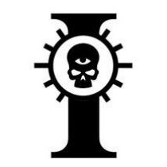

# 0162 星炬庭 Adeptus Astronomica

精校状态：中文行文已逐段精校，部分术语仍为暂定

分类：通用概念 / 帝国 Imperium / 中央政务部 Adeptus Terra

原文来源：https://www.bilibili.com/opus/1144260660123664387

原作者：帝国神选罐头

原文时间：2025年12月09日 13:15

[返回分类目录](目录.md) · [全书目录](../../目录.md)

<!-- A0162-B0001 -->
**英文原文**

The Adeptus Astronomica are members of the Imperial Adeptus Terra who maintain the psychic beacon known as the Astronomican, used by Navigators.

<!-- /A0162-B0001 -->

<!-- A0162-B0002 -->

原译文

星炬庭是帝国中央政务部的成员，他们维护着被称为星炬的灵能灯塔，供导航者使用。

**校订译文**

星炬庭隶属帝国中央政务部，负责维护供导航员使用的灵能灯塔——星炬。

<!-- /A0162-B0002 -->

<!-- A0162-B0003 图片 -->

<!-- A0162-B0004 -->

原译文

Adeptus Astronomica symbol 星炬庭标志

**校订译文**

Adeptus Astronomica symbol 星炬庭标志

<!-- /A0162-B0004 -->

<!-- A0162-B0005 -->
**英文原文**

Parent Agency:Adeptus Terra

<!-- /A0162-B0005 -->

<!-- A0162-B0006 -->

原译文

隶属机构：中央政务部

**校订译文**

隶属机构：中央政务部

<!-- /A0162-B0006 -->

<!-- A0162-B0007 -->
**英文原文**

Headquarters:Forbidden Fortress, Terra

<!-- /A0162-B0007 -->

<!-- A0162-B0008 -->

原译文

总部：禁地堡垒，泰拉

**校订译文**

总部：禁地堡垒，泰拉

<!-- /A0162-B0008 -->

<!-- A0162-B0009 -->
**英文原文**

Leader:Master of the Astronomican Lucius Throde

<!-- /A0162-B0009 -->

<!-- A0162-B0010 -->

原译文

领袖：星炬大师卢修斯·斯罗德

**校订译文**

领袖：星炬大师卢修斯·斯罗德

<!-- /A0162-B0010 -->

<!-- A0162-B0011 -->
**英文原文**

Established:M30

<!-- /A0162-B0011 -->

<!-- A0162-B0012 -->

原译文

建立时间：M30

**校订译文**

建立时间：M30

<!-- /A0162-B0012 -->

<!-- A0162-B0013 -->
## Duties 职责

<!-- /A0162-B0013 -->

<!-- A0162-B0014 -->
**英文原文**

The Astronomica works closely with the Adeptus Astra Telepathica and recruits from their ranks.

<!-- /A0162-B0014 -->

<!-- A0162-B0015 -->

原译文

星炬庭与星语庭密切合作，并从他们的队伍中招募人员。

**校订译文**

星炬庭与星语庭密切合作，并从他们的队伍中招募人员。

<!-- /A0162-B0015 -->

<!-- A0162-B0016 -->
**英文原文**

The Adeptus Astronomica is largely composed of psykers; its non-psykers are hereditary servants. The process of constantly transmitting mental energy ultimately destroys these psykers, though there are always more to take their place. This act, however, allows Imperial ships to travel through the perils of the warp at great speeds. The organization is based in Terra's Forbidden Fortress, where even Judges and Inquisitors must receive invitation to enter. The task of the Adeptus Astronomica is to train the young psykers they receive from the Adeptus Astra Telepathica, so that they can serve in the Chamber of the Astronomican. The whole organisation is basically a training institute run by a class of older members known as Instructors. Some of the Instructors are given the title High Instructor and given control of a certain area of teaching. The day to day tasks such as maintenance are taken care of by a body of administrative functionaries.

<!-- /A0162-B0016 -->

<!-- A0162-B0017 -->

原译文

星炬庭主要由灵能者组成；它的非灵能者是世袭的仆人。不断传递精神能量的过程最终会摧毁这些灵能者，尽管总会有更多的人取代他们的位置。然而，这一行动允许帝国船只以极快的速度穿越亚空间的危险。该组织位于泰拉的禁地堡垒，即使是法官和审判官也必须收到进入邀请。星炬庭的任务是训练他们从星语庭获得的年轻灵能者，以便他们可以在星炬大厅服务。整个组织基本上是一个由一群被称为讲师的年长成员经营的培训机构。一些讲师被授予至高讲师的称号，并被赋予对某一教学领域的控制权。日常任务，如维护，由一组行政人员负责。

**校订译文**

星炬庭主要由灵能者组成，非灵能者则是世袭仆役。持续输出精神能量最终会耗尽灵能者的生命，但总有人补上空缺。正是这种牺牲，使帝国船舰能高速穿越危机四伏的亚空间。该机构设于泰拉禁地堡垒，连法务部法官和审判官也须受邀才能进入。它负责训练星语庭送来的年轻灵能者，让他们能在星炬大厅服役；整个组织基本是一所训练机构，由称为讲师的年长成员主持。部分讲师晋升至高讲师，负责特定教学领域；维护等日常事务则交给行政人员。

<!-- /A0162-B0017 -->

<!-- A0162-B0018 -->
## Organization & Recruitment 组织&招募

<!-- /A0162-B0018 -->

<!-- A0162-B0019 -->
**英文原文**

The overall head of the Adeptus Astronomica is the Master of the Astronomican, who represents the organization as a High Lord of Terra. In terms of composition, the organisation has an administrative elite along with a large pool of young trainees who will one day become part of the corps of ten thousand that power the Astronomican. These trainees are taught to release their psychic potential by way of mental exercises which is a process that takes a few months. Afterwards, they are called into the psychic battery in the Hall of the Astronomicon and can be called at any time as old members either die or fail. In this state, the trainees rarely last more than two or three months with a hundred dying every day whilst within the spherical chamber. This process sees their very lifeforce being slowly drained away by strange apparatus at the focal point of the great spherical hall. Though these individuals sadly give their lives away, it is the ultimate sacrifice needed for Humanity's continued survival. Due to their duties, members of the Adeptus Astronomica are rarely seen off Terra though its leaders who are responsible for the continued use of the Astronomican are allowed to travel freely. Similar to the Adeptus Mechanicus, this organisation is a monastic order and its members wear clothing similar to religious devotees, which are blue and hooded. Those fully trained members have their heads shaven and are ready to receive the neural implants which will one day drain their lifeforce to power the Astronomican.

<!-- /A0162-B0019 -->

<!-- A0162-B0020 -->

原译文

星炬庭的总负责人是星炬大师，他代表该组织成为泰拉高领主。就组成而言，该组织有一个行政精英和一大批年轻学员，他们总有一天会成为为星炬提供能量的万人队伍的一部分。这些受训者被教导通过精神练习来释放他们的灵能潜力，这是一个需要几个月的过程。之后，他们被召集到星炬大厅的灵能电池中，当老成员死亡或衰退时，他们可以随时被召集。在这种状态下，受训者很少坚持超过两三个月，每天都有一百人在球形大厅内死亡。在这个过程中，他们的生命力被大球形大厅焦点处的奇怪装置慢慢耗尽。尽管这些人悲哀地献出了自己的生命，但这是人类持续生存所需的最终牺牲。由于他们的职责，星炬庭的成员很少离开泰拉，尽管负责继续使用星炬的领袖被允许自由航行。与机械神教类似，该组织是一个修道院组织，其成员穿着类似于宗教信徒的蓝色连帽服装。那些受过充分训练的成员剃了光头，准备接受神经植入物，这将有一天耗尽他们的生命力，为星炬提供能量。

**校订译文**

星炬庭由星炬大师统领，他以泰拉高领主身份代表该机构。组织内有行政骨干和大量年轻学员，后者将陆续加入为星炬供能的万人队伍。学员用数月学习精神练习，释放灵能潜力；训练完成后，随时可能被征召填补死去或衰竭者的位置，成为星炬大厅中的灵能电池。投入供能后，他们极少撑过两三个月；球形大厅每天约有一百人死亡，其生命力被大厅焦点处的神秘装置缓缓抽尽。原文将这种献身视为人类生存所需的最终牺牲。职责所限，星炬庭成员很少离开泰拉，负责维持星炬运作的领袖却可自由旅行。与机械修会相似，它具有修会性质，成员穿蓝色连帽袍；完成训练者剃去头发，准备接受神经植入物，终有一天藉此献出生命，为星炬供能。

<!-- /A0162-B0020 -->

<!-- A0162-B0021 -->
**英文原文**

Young psykers are initiated into the Astronomica as Acolytes. They are taught not just how to use and control their psychic powers but are introduced to the Lore of the Astronomican. They learn the value of their lives, study philosophy and are gradually brought to an inner understanding of the universe and the nature of the warp. Those who achieve this mystic state become the Chosen and are eventually called to serve in the Chamber of the Astronomican. The status of Chosen is considered a great honour. To fall short of attaining this goal is not a failure; rather they go on to become Instructors or are absorbed as administrative functionaries in the Forbidden Fortress. Those who do make it to Chosen status, often Space Marine Librarians or Sanctioned Psykers of the Imperial Guard are considered above the Instructors and even the Master of the Astronomican. Their heads are shaven and they wear yellow robes and the scarlet badge of the Chosen. The rest of their lives are spent in prayer and contemplation until they are called to serve in the Chamber of the Astronomican. Like the Psykers sacrificed before the Throne, the Chosen are in time killed in service to the Emperor.

<!-- /A0162-B0021 -->

<!-- A0162-B0022 -->

原译文

年轻的灵能者作为侍僧进入星炬庭。他们不仅被教导如何使用和控制自己的灵能力量，还被介绍了星炬传说。他们学习生命的价值，学习哲学，逐渐对宇宙和亚空间的本质有了内在的理解。那些达到这种神秘状态的人成为受选者，最终被召唤到星炬大厅服务。受选者的地位被认为是一种巨大的荣誉。未能实现这一目标并非失败；相反，他们要么继续成为讲师，要么被吸收为禁地堡垒的行政官员。那些确实达到了受选状态的人，通常是星际战士智库或帝国卫队的受选灵能者，被认为高于讲师，甚至是星炬大师。他们剃光头，穿着黄色长袍和受选者的猩红徽章。他们的余生都在祈祷和沉思中度过，直到他们被召唤到星炬大厅服务。就像在王座前牺牲的灵能者一样，受选者在为帝皇服务时也会被及时杀死。

**校订译文**

年轻灵能者以侍僧身份加入星炬庭，学习运用、控制灵能，以及有关星炬的知识。他们研习生命的价值与哲学，逐渐从内心理解宇宙和亚空间的本质。达到这种神秘境界者成为“受选者”，最终应召进入星炬大厅服役。获选是极大荣誉，未能获选也不算失败：他们可成为讲师，或在禁地堡垒担任行政人员。按本条原文，受选者常出自星际战士智库或帝国卫队合法灵能者，地位高于讲师，乃至星炬大师。他们剃光头发，穿黄色长袍、佩猩红徽章，在祈祷与冥思中等待召唤。就像献祭于王座前的灵能者一样，受选者最终也会在服侍帝皇的过程中死去。

**校注：** 英文直接称受选者 often Space Marine Librarians or Sanctioned Psykers of the Imperial Guard，与本篇青年学员选拔叙述及常见机构划分存在疑点。按原文保留，不擅删星际战士智库；Sanctioned 不应再译受选，以免与 Chosen 混淆。

<!-- /A0162-B0022 -->

<!-- A0162-B0023 -->
**英文原文**

For a thousand days the great barge of the Adeptus Astronomica sailed towards Earth. In the thirteen holds, each as cavernous as a temple nave, our human cargo sent up a great wailing and moaning. There were over two thousand souls bound for service: Men, women and children; young and old; the sick and the sound. Only the children did not know. But I am a psyker like them, and I know their pain. I felt the chains as if they were upon my own limbs. I know their fate, they had been tested and found wanting, they were too vulnerable, too dangerous to live. I am a guardian of the Adeptus Astronomica. Souls such as these I carry to the Emperor's table.

<!-- /A0162-B0023 -->

<!-- A0162-B0024 -->

原译文

一千天以来，星炬庭的大驳船一直驶向地球。在十三个货舱里，每个货舱都像圣堂中殿一样的洞穴般巨大，我们的货物发出了巨大的哀嚎和呻吟。有两千多人要去服役：男人、女人和孩子；幼和老；疾病和健康。只有孩子们不知道。但我和他们一样是灵能者，我知道他们的痛苦。我感觉到那些锁链，就好像它们在我自己的四肢上。我知道他们的命运，他们经历了考验，发现自己缺乏，他们太脆弱，太危险，无法生存。我是星炬庭的守护者。我把这样的灵魂带到帝皇的餐桌上。

**校订译文**

星炬庭的巨型驳船驶向泰拉，航程已过一千日。十三座货舱，每座都像圣堂中殿般空旷；我们载运的人类货物在其中哀号呻吟。两千多条性命将去服役：男人、女人和孩子，老人与少年，病弱者与健全者。只有孩子还不知情。我和他们一样是灵能者，知道他们的痛苦；那锁链仿佛也缠在我的四肢上。我知道他们的命运：他们受过检验，却未能合格。他们太脆弱，也太危险，不能让他们活下去。我是星炬庭的守护者，负责将这样的灵魂送上帝皇的餐桌。

<!-- /A0162-B0024 -->

本篇核心术语与暂定项

以下列出本篇出现的英文原形及核心术语表用词。同形词可能指不同对象，具体词义以本篇正文和校注为准；单复数、别名和仅见于图注的名称可能尚未列入。完整候选见[术语表](../../术语表/双语术语候选.csv)。

| 英文 | 采用中文 | 状态 |
| --- | --- | --- |
| Adeptus Mechanicus | 机械修会 | 官方已核对 |
| Imperial Guard | 帝国卫队 | 暂定·语境区分 |
| Psyker | 灵能者 | 官方已核对 |
| Astronomican | 星炬 | 暂定 |
| Adeptus Astronomica | 星炬庭 | 暂定 |
| Adeptus Astra Telepathica | 星语庭 | 暂定 |
| Warp | 亚空间 | 官方已核对 |
| Emperor | 帝皇 | 官方已核对 |
| Adeptus Terra | 中央政务部 | 暂定 |
| Terra | 泰拉 | 暂定·官方待核 |
| Navigators | 导航员 | 官方已核对 |
| Lucius | 卢修斯 | 暂定·官方待核 |
| Master | 导师（审判庭职衔）／舰务官（舰员职务） | 语境定译·官方待核 |
| Mystic | 神秘者 | 暂定·官方待核 |
| Space Marine | 星际战士 | 暂定·官方待核 |
| Powers | 能天使 | 暂定·官方待核 |
| Chamber of the Astronomican | 星炬大厅 | 暂定·官方待核 |

