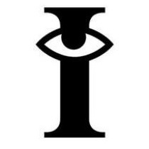
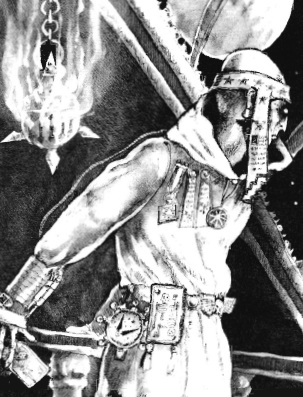

# 0163 星语庭 Adeptus Astra Telepathica

精校状态：中文行文已逐段精校，部分术语仍为暂定

分类：通用概念 / 帝国 Imperium / 中央政务部 Adeptus Terra / 星语庭 Adeptus Astra Telepathica

原文来源：https://www.bilibili.com/opus/1143884897744584705

原作者：帝国神选罐头

原文时间：2025年12月08日 12:57

[返回分类目录](目录.md) · [全书目录](../../目录.md)

<!-- A0163-B0001 -->
**英文原文**

The Adeptus Astra Telepathica is an organization of the Adeptus Terra, responsible for the recruitment and training of psykers into the service of the Imperium. The Adeptus Astra Telepathica trains the majority of Imperial psykers, which become known as Sanctioned Psykers.

<!-- /A0163-B0001 -->

<!-- A0163-B0002 -->

原译文

星语庭是中央政务部的一个组织，负责招募和训练灵能者为帝国服务。星语庭训练了大多数帝国灵能者，这些灵能者被称为合法灵能者。

**校订译文**

星语庭是中央政务部的一个组织，负责招募和训练灵能者为帝国服务。星语庭训练了大多数帝国灵能者，这些灵能者被称为合法灵能者。

<!-- /A0163-B0002 -->

<!-- A0163-B0003 图片 -->

<!-- A0163-B0004 -->

原译文

Adeptus Astra Telepathica symbol 星语庭标志

**校订译文**

Adeptus Astra Telepathica symbol 星语庭标志

<!-- /A0163-B0004 -->

<!-- A0163-B0005 -->
**英文原文**

Parent Agency:Adeptus Terra

<!-- /A0163-B0005 -->

<!-- A0163-B0006 -->

原译文

隶属机构：中央政务部

**校订译文**

隶属机构：中央政务部

<!-- /A0163-B0006 -->

<!-- A0163-B0007 -->
**英文原文**

Headquarters:Obsidian Keep, Terra

<!-- /A0163-B0007 -->

<!-- A0163-B0008 -->

原译文

总部：黑曜石城堡，泰拉

**校订译文**

总部：黑曜石城堡，泰拉

<!-- /A0163-B0008 -->

<!-- A0163-B0009 -->
**英文原文**

Leader:Master Zlatad Aph Kerapliades

<!-- /A0163-B0009 -->

<!-- A0163-B0010 -->

原译文

领袖：大师兹拉塔·阿什·克拉皮亚斯

**校订译文**

领袖：大师兹拉塔·阿什·克拉皮亚斯

<!-- /A0163-B0010 -->

<!-- A0163-B0011 -->
**英文原文**

Armed Forces:Sisters of Silence, Black Sentinels

<!-- /A0163-B0011 -->

<!-- A0163-B0012 -->

原译文

武装部队：寂静修女，黑色哨兵

**校订译文**

武装部队：寂静修女，黑色哨兵

<!-- /A0163-B0012 -->

<!-- A0163-B0013 -->
**英文原文**

Established:M30

<!-- /A0163-B0013 -->

<!-- A0163-B0014 -->

原译文

成立时间：M30

**校订译文**

成立时间：M30

<!-- /A0163-B0014 -->

<!-- A0163-B0015 -->
## Overview 概述

<!-- /A0163-B0015 -->

<!-- A0163-B0016 -->
**英文原文**

The Adeptus Astra Telepathica is divided into a recruitment body (the League of Black Ships) and a training body (the Scholastia Psykana). These two are united under the Master of the Adeptus Astra Telepathica and his advisory council of several hundred senior officials from the two divisions. They are responsible for the specially trained Astrotelepaths who use their mysterious powers to communicate with others of their kind across vast interstellar distances which separates the worlds of the Imperium. The Astra Telepathica is also known to operate a special decryption and internal affairs branch known as the Cryptaesthesians. During the Great Crusade the Astra Telepathica also operated a unit of Blank psyker-hunters who manned the Black Ships known as the Departmento Investigates, otherwise known as the Sisters of Silence. The numbers of the Silent Sisterhood dwindled as a result of the Horus Heresy but active units have been observed at the end of the 41st Millennium.

<!-- /A0163-B0016 -->

<!-- A0163-B0017 -->

原译文

星语庭分为招募机构（黑船联盟）和培训机构（灵能学院）。这两个部门在星语庭大师及其由两个部门的数百名高级官员组成的顾问议会的领导下联合起来。他们负责专门训练星语者，他们利用自己的神秘力量在分隔帝国世界的巨大星际距离上与同类进行交流。星语庭还运行着一个特殊的解密和内政分支，称为隐知会。在大远征期间，星语庭还运行着一支由空白者灵能者猎手组成的部队，他们驾驶着被称为纠察部的黑船，也被称为寂静修女。由于荷鲁斯叛乱，寂静修女会的数量减少了，但在第41个千年末观察到了活跃的单位。

**校订译文**

星语庭分为招募机构黑船联盟与训练机构灵能学院，由星语庭大师和来自两部门的数百名高官所组成的顾问议会统领。他们负责培养星语者，使其用神秘力量跨越帝国诸世界之间的遥远距离，与同类通信。星语庭另设负责解密与内部事务的隐知会。大远征时期，它还有一支由空白者组成的灵能猎手部队，称纠察部，亦即寂静修女，负责值守黑船。荷鲁斯之乱使修女会人数锐减，但第41千年末仍有活动部队的记录。

<!-- /A0163-B0017 -->

<!-- A0163-B0018 -->
**英文原文**

Their ranks consist of psychic servants of the Imperium and these psykers have undergone the Soul Binding ritual with the Emperor. This process passes on some of the Emperor's strength of will into his servants, thus protecting them from evil, psychically attuned enemies. The ritual ultimately results in blindness though there are a rare few Astropaths who are judged strong enough to warrant them not taking part in the Soul Binding. These individuals are considered the lucky ones, as they do not have to partake in the agonising process as most Astropaths.

<!-- /A0163-B0018 -->

<!-- A0163-B0019 -->

原译文

他们的队伍由帝国的灵能仆人组成，这些灵能者已经与帝皇进行了灵魂结合仪式。这个过程将帝皇的一些意志力量传递给他的仆人，从而保护他们免受邪恶的、熟悉灵能的敌人的伤害。这种仪式最终导致失明，尽管很少有星语者被认为足够强大，可以保证他们不参加灵魂结合。这些人被认为是幸运的，因为他们不必像大多数星语者那样参与痛苦的过程。

**校订译文**

这些为帝国效力的灵能者接受与帝皇相联的灵魂结合仪式，获得祂一部分意志力量，抵御邪恶灵能敌人的侵害。仪式最终会导致失明。极少数星语者被认为足够强大，可以免予参加；他们因此被视为幸运儿，无需像绝大多数同僚那样承受仪式的痛苦。

**校注：** 本段将机构成员概括为已灵魂结合的灵能者，与其他处说明星语庭还包括非灵能人员等范围不完全吻合，保留原文概述并标注。

<!-- /A0163-B0019 -->

<!-- A0163-B0020 -->
**英文原文**

It is through the righteous persecution of the Inquisition, combined with the careful testing of the Coven Masters of the Adeptus Astra Telepathica which purges any deviant mutations that are commonly associated with those beings that develop psychic potential. Under Imperial edict, the Adeptus Astra Telepathica are allowed their own operatives but they were prohibited from serving as wardens aboard their own vessels. This is because it was far too easy for a malignant psyker to coerce the mind of another telepath. Thus, they used the Sisters of Battle or Inquisitorial Storm Troopers to serve as custodians aboard the Black Ships where their faith protected them from the predations of the mind-witches they guarded. Meanwhile, highly trained Black Sentinels were used to guard important Telepathica facilities.

<!-- /A0163-B0020 -->

<!-- A0163-B0021 -->

原译文

这是通过对审判庭的正义迫害，结合星语者的巫会大师的仔细测试，净化了通常与那些发展出灵能潜力的生物相关的任何异常突变。根据帝国法令，星语庭被允许拥有自己的特工，但他们被禁止在自己的船上担任看守者。这是因为对于一个恶意的灵能者来说，强迫另一个传心者的思想太容易了。因此，他们使用战斗修女或审判庭风暴兵作为黑船上的看守者，在那里他们的信仰保护他们免受他们所保护的心灵女巫的掠食。与此同时，训练有素的黑色哨兵被用来守卫重要的星语庭设施。

**校订译文**

帝国通过审判庭自诩正义的追捕，以及星语庭巫会大师的严密检验，清除灵能觉醒者常见的异常变异。帝国法令允许星语庭拥有自己的行动人员，却禁止他们在本机构船上担任狱卒，因为恶意灵能者太容易控制另一名传心者的心智。因此，黑船使用战斗修女或审判庭风暴兵看守囚犯，以其信仰抵御受押心灵巫师的侵袭。重要的星语庭设施则由训练有素的黑色哨兵守卫。

<!-- /A0163-B0021 -->

<!-- A0163-B0022 -->
**英文原文**

Before the end of the Horus Heresy, this division within the Imperium held the City of Sight as its headquarters where psykers were taken to its mindhalls for testing. Inside these iron clad halls, the psykers took their first steps in the soul binding ritual and further recruitment into the astropathic choirs. Today, palace complex of Astra Telepathica is called Obsidian Keep, though it is unknown if this is simply part of the City of Sight or a new location entirely.

<!-- /A0163-B0022 -->

<!-- A0163-B0023 -->

原译文

在荷鲁斯叛乱结束之前，帝国内部的这个部门将视界之城作为其总部，在那里，灵能者被带到其心灵大厅进行测试。在这些铁甲大厅里，灵能者迈出了灵魂结合仪式的第一步，并进一步招募到了星语唱诗班。如今，星语者的宫殿建筑群被称为黑曜石城堡，但尚不清楚这是视界之城的一部分还是一个全新的地点。

**校订译文**

荷鲁斯之乱结束前，星语庭以视界之城为总部，将灵能者带入铁壁环绕的心灵大厅接受检验，开始灵魂结合仪式的初步步骤，再选入星语唱诗团。后来的星语庭宫殿群称为黑曜石城堡，但尚不清楚它是视界之城的一部分，还是另建于新址。

<!-- /A0163-B0023 -->

<!-- A0163-B0024 -->
**英文原文**

Due to their duties, the Adeptus Astra Telepathica works in conjunction with the Adeptus Astronomica. Much of the strange properties of the warp remained a mystery to the research theologians of this organisation.

<!-- /A0163-B0024 -->

<!-- A0163-B0025 -->

原译文

由于他们的职责，星语庭与星炬庭合作。对于该组织的研究神学家来说，亚空间的许多奇怪特性仍然是一个谜。

**校订译文**

由于他们的职责，星语庭与星炬庭合作。对于该组织的研究神学家来说，亚空间的许多奇怪特性仍然是一个谜。

<!-- /A0163-B0025 -->

<!-- A0163-B0026 -->
## History 历史

<!-- /A0163-B0026 -->

<!-- A0163-B0027 -->
**英文原文**

The Adeptus Astra Telepathica was first formed by the Emperor in preparation for the Great Crusade. Constructing the massive Astronomican, the Astra Telepathica was at this time mandated by the Emperor to maintain and run the massive machine (though this duty has since fallen to the Adeptus Astronomica). Thus the Astra Telepathica played a key role in the Great Crusade, as without their psychic light humanity could have never been unified. In addition, the Astra Telepathica was instrumental in rounding up the rogue psykers and "Witch-Kings" which had plagued Terra since the Age of Strife.

<!-- /A0163-B0027 -->

<!-- A0163-B0028 -->

原译文

星语庭最初是由帝皇为准备大远征而成立的。星语庭建造了巨大的星炬，当时帝皇授权它维护和运行这台巨大的机器（尽管这一职责后来落到了星炬庭的肩上）。因此，星语庭在大远征中发挥了关键作用，因为没有他们的灵能之光，人类永远不会统一。此外，星语庭在抓捕自纷争时代以来一直困扰泰拉的非法灵能者和“巫王”方面发挥了重要作用。

**校订译文**

星语庭最初是由帝皇为准备大远征而成立的。星语庭建造了巨大的星炬，当时帝皇授权它维护和运行这台巨大的机器（尽管这一职责后来落到了星炬庭的肩上）。因此，星语庭在大远征中发挥了关键作用，因为没有他们的灵能之光，人类永远不会统一。此外，星语庭在抓捕自纷争时代以来一直困扰泰拉的非法灵能者和“巫王”方面发挥了重要作用。

<!-- /A0163-B0028 -->

<!-- A0163-B0029 图片 -->

<!-- A0163-B0030 -->

原译文

Adept of the Adeptus Astra Telepathica 星语庭的专家

**校订译文**

Adept of the Adeptus Astra Telepathica 星语庭的专家

<!-- /A0163-B0030 -->

<!-- A0163-B0031 -->
**英文原文**

At the time of the Great Crusade, the Adeptus Astra Telepathica had a militant arm - the Sisters of Silence - who manned the Black Ships and searched for emerging psykers. An additional force known as the Black Sentinels provided security for Astropathic facilities in the Sol System. After the Horus Heresy the Sisters of Silence largely died out as an order save their role as guardians of the Black Ships, though a single fortress of Sisters of Silence was encountered by the Imperium during the War of the Beast. Since the beginning of the Indomitus Crusade, the Sisters of Silence have been fully restored by order of Roboute Guilliman.

<!-- /A0163-B0031 -->

<!-- A0163-B0032 -->

原译文

在大远征时期，星语庭有一个激进的军事部队 — 寂静修女，她们掌管着黑船，寻找新出现的灵能者。另一支名为黑色哨兵的部队为太阳系中的星语庭设施提供安全保障。在荷鲁斯叛乱之后，寂静修女作为一个修会基本上消失了，以挽救她们作为黑船守护者的角色，尽管帝国在野兽战争期间遇到了一座寂静修女堡垒。自不屈远征开始以来，寂静修女在罗伯特·基里曼的命令下完全恢复。

**校订译文**

大远征时期，星语庭的军事分支寂静修女负责黑船，并搜寻新近觉醒的灵能者；黑色哨兵则保护太阳系中的星语设施。荷鲁斯之乱后，修女会除继续担任黑船守卫外，作为一个组织几乎消亡；不过，野兽战争期间，帝国曾发现一座寂静修女堡垒。不屈远征开始后，罗保特·基里曼下令全面重建修女会。

<!-- /A0163-B0032 -->

<!-- A0163-B0033 -->
**英文原文**

During Goge Vandire's Reign of Blood, he quickly ascended to total control of the Imperium. However, he was unable to gain control of the Adeptus Astra Telepathica, since its Master, Lord Phaedrus, was a potent psyker and thus not swayed by Vandire's charisma. This allowed Phaedrus to see through Vandire's deceit and machinations. This was troublesome for Vandire, who was used to staying one step ahead of his opponents. Assassinating Phaedrus would not solve the problem, since Phaedrus's successor would likely be an equally powerful psyker. Instead, Vandire used a Culexus Assassin to rob the psyker of his abilities whilst using a life support system to keep him alive. Robbed of his power and prevented from killing himself, Lord Phaedrus agreed to follow Goge Vandire on the condition that the loss of his psychic abilities be kept secret. Thus was Vandire able to subvert the Adeptus Astra Telepathica.

<!-- /A0163-B0033 -->

<!-- A0163-B0034 -->

原译文

在高戈·范迪尔的血腥统治期间，他很快就完全控制了帝国。然而，他无法控制星语庭，因为它的大师菲德洛斯领主是一名强大的灵能者，因此不受范迪尔魅力的影响。这让菲德洛斯看穿了范迪尔的欺骗和阴谋。这对范迪尔来说很麻烦，他习惯于领先对手一步。刺杀菲德洛斯并不能解决问题，因为菲德洛斯的继任者可能是一名同样强大的灵能者。相反，范迪尔使用了一名邱利萨斯刺客来剥夺灵能者的能力，同时使用生命维持系统来维持他的生命。菲德洛斯领主被剥夺了力量，并被阻止自杀，他同意追随高戈·范迪尔，条件是对他的灵能能力的丧失保密。因此，范迪尔能够策反星炬庭。

**校订译文**

在高戈·范迪尔的血腥统治期间，他很快就完全控制了帝国。然而，他无法控制星语庭，因为它的大师菲德洛斯领主是一名强大的灵能者，因此不受范迪尔魅力的影响。这让菲德洛斯看穿了范迪尔的欺骗和阴谋。这对范迪尔来说很麻烦，他习惯于领先对手一步。刺杀菲德洛斯并不能解决问题，因为菲德洛斯的继任者可能是一名同样强大的灵能者。相反，范迪尔使用了一名丘里克斯刺客来剥夺灵能者的能力，同时使用生命维持系统来维持他的生命。菲德洛斯领主被剥夺了力量，并被阻止自杀，他同意追随高戈·范迪尔，条件是对他的灵能能力的丧失保密。因此，范迪尔能够控制星语庭。

<!-- /A0163-B0034 -->

<!-- A0163-B0035 -->
**英文原文**

In the Age of the Imperium, the destruction of the planet Tyran led to the growing discovery of the extragalactic aliens that became known as the Tyranids. Among the mounting evidence being assembled included scraps of tissue from the Thandros Telepathica Matrix. Following the re-emergence of the world of Toreus after it was engulfed in a Warp rift, a team of archeodiviners were dispatched to the planet where they were overwhelmed by the Chaotic taint who all died from exposure to it.

<!-- /A0163-B0035 -->

<!-- A0163-B0036 -->

原译文

在帝国时代，泰兰行星的毁灭导致了越来越多的银河系外异型的发现，这些异型被称为泰伦虫族。在收集的越来越多的证据中，包括坦德罗斯星语矩阵的结构碎片。在托勒斯世界被亚空间裂隙吞噬后重新出现后，一组古卜者被派往这个行星，在那里他们被混沌的污染所淹没，所有人都因接触到它而死亡。

**校订译文**

帝国时代，泰兰行星毁灭后，人们不断发现有关后来被称为泰伦虫族的银河外异形的线索。其中包括从坦德罗斯星语矩阵取得的生物组织碎片。另一事件中，托勒斯世界被亚空间裂隙吞噬后重新出现，一队古卜者奉命前往，却全都因暴露于当地强烈的混沌污染而死亡。

<!-- /A0163-B0036 -->

<!-- A0163-B0037 -->
**英文原文**

Following the creation of the Great Rift the light of the Astronomican temporarily went out and a scream of Chaos enveloped much of the galaxy. In the ensuing mayhem known as The Blackness, enormous numbers of Astropaths went mad.

<!-- /A0163-B0037 -->

<!-- A0163-B0038 -->

原译文

大裂隙形成后，星炬之光暂时熄灭，混沌的尖啸笼罩了银河系的大部分地区。在随后被称为黑暗的混乱中，大量的星语者发疯了。

**校订译文**

大裂隙形成后，星炬之光暂时熄灭，混沌的尖啸笼罩了银河系的大部分地区。在随后被称为黑暗的混乱中，大量的星语者发疯了。

<!-- /A0163-B0038 -->

<!-- A0163-B0039 -->
## Conflicting Sources 来源冲突

<!-- /A0163-B0039 -->

<!-- A0163-B0040 -->
**英文原文**

While older lore stated that Inquisitorial Stormtroopers and Sisters of Battle were used to guard the Black Ships after the Horus Heresy, recent sources state the Sisters of Silence never lost their custodianship of the vessels.

<!-- /A0163-B0040 -->

<!-- A0163-B0041 -->

原译文

虽然古老的传说称，在荷鲁斯叛乱之后，审判庭风暴兵和战斗修女被用来守卫黑船，但最近的消息来源称，寂静修女从未失去对战舰的监护权。

**校订译文**

较早设定称，荷鲁斯之乱后黑船由审判庭风暴兵与战斗修女守卫；较新资料则称，寂静修女从未失去对黑船的看守权。

<!-- /A0163-B0041 -->

本篇核心术语与暂定项

以下列出本篇出现的英文原形及核心术语表用词。同形词可能指不同对象，具体词义以本篇正文和校注为准；单复数、别名和仅见于图注的名称可能尚未列入。完整候选见[术语表](../../术语表/双语术语候选.csv)。

| 英文 | 采用中文 | 状态 |
| --- | --- | --- |
| Tyranids | 泰伦虫族 | 官方已核对 |
| Psyker | 灵能者 | 官方已核对 |
| Roboute Guilliman | 罗保特·基里曼 | 官方已核对 |
| Horus Heresy | 荷鲁斯之乱 | 官方已核对 |
| Astronomican | 星炬 | 暂定 |
| Adeptus Astronomica | 星炬庭 | 暂定 |
| Adeptus Astra Telepathica | 星语庭 | 暂定 |
| Scholastia Psykana | 灵能学院 | 暂定 |
| Warp | 亚空间 | 官方已核对 |
| Great Rift | 大裂隙 | 官方已核对 |
| Inquisition | 审判庭 | 暂定 |
| Imperium | 帝国 | 暂定·简称 |
| Indomitus | 不屈学派 | 暂定·学派语境 |
| Emperor | 帝皇 | 官方已核对 |
| Adeptus Terra | 中央政务部 | 暂定 |
| Goge Vandire | 高戈·范迪尔 | 暂定·官方待核 |
| Great Crusade | 大远征 | 暂定·官方待核 |
| Age of Strife | 纷争时代 | 暂定·官方待核 |
| Terra | 泰拉 | 暂定·官方待核 |
| Horus | 荷鲁斯 | 暂定·官方待核 |
| Sisters of Battle | 战斗修女 | 暂定·官方待核 |
| Sisters of Silence | 寂静修女 | 暂定·官方待核 |
| Indomitus Crusade | 不屈远征 | 暂定·官方待核 |
| League of Black Ships | 黑船联盟 | 暂定·官方待核 |
| Inquisitorial Stormtroopers | 审判庭风暴兵 | 暂定·官方待核 |
| Black Sentinels | 黑色哨兵 | 暂定·官方待核 |
| Age of the Imperium | 帝国时代 | 暂定·官方待核 |
| Blank | 空白者 | 暂定·官方待核 |
| Master | 导师（审判庭职衔）／舰务官（舰员职务） | 语境定译·官方待核 |
| Culexus Assassin | 丘里克斯刺客 | 官方已核对 |
| Sol | 太阳系 | 暂定·官方待核 |
| Powers | 能天使 | 暂定·官方待核 |
| The Beast | 野兽 | 暂定·官方待核 |
| Tyran | 泰兰 | 暂定·官方待核 |
| The Blackness | 黑暗期 | 暂定·官方待核 |
| Cryptaesthesians | 隐感者 | 暂定·官方待核 |
| City of Sight | 视界之城 | 暂定·官方待核 |
| System | 星系（恒星系统） | 暂定·官方待核 |
| Reign of Blood | 血腥统治 | 暂定·官方待核 |
| The Loss | 失落 | 暂定·官方待核 |
| Sol System | 太阳系 | 暂定·官方待核 |
| The City of Sight | 视界之城 | 暂定·官方待核 |

