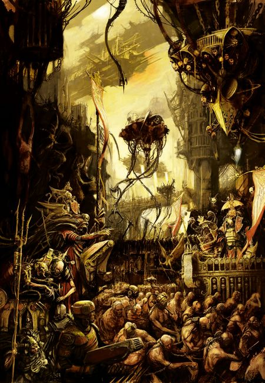
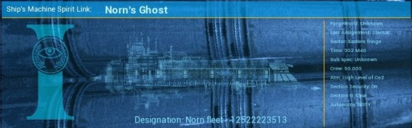

# 0165 黑船联盟 League of Black Ships

精校状态：中文行文已逐段精校，部分术语仍为暂定

分类：通用概念 / 帝国 Imperium / 中央政务部 Adeptus Terra / 星语庭 Adeptus Astra Telepathica

原文来源：https://www.bilibili.com/opus/1144233030592757763

原作者：帝国神选罐头

原文时间：编辑于 2025年12月09日 13:10

[返回分类目录](目录.md) · [全书目录](../../目录.md)

<!-- A0165-B0001 -->
**英文原文**

"I knew their fate, they had been tested and found wanting, they were too vulnerable, too dangerous to live. Souls such as these I carry to the Emperor's table." - Captain of a Black Ship

<!-- /A0165-B0001 -->

<!-- A0165-B0002 -->

原译文

“我知道他们的命运，他们已经过考验，被发现缺乏，他们太脆弱，太危险，无法生存。我把这样的灵魂带到帝皇的餐桌上。” - 黑船船长

**校订译文**

“我知道他们的命运：他们受过检验，却未能合格。他们太脆弱，也太危险，不能让他们活下去。我负责将这样的灵魂送上帝皇的餐桌。”——一位黑船舰长

<!-- /A0165-B0002 -->

<!-- A0165-B0003 -->
**英文原文**

The League of Black Ships (sometimes spelled Blackship) is one of the two primary divisions of the Adeptus Astra Telepathica, the other being the Scholastia Psykana.

<!-- /A0165-B0003 -->

<!-- A0165-B0004 -->

原译文

黑船联盟（有时拼写为黑船）是星语庭的两个主要分支之一，另一个是灵能学院。

**校订译文**

黑船联盟是星语庭的两大分支之一，另一个是灵能学院。其英文名称中的 Black Ships 有时连写为 Blackship。

<!-- /A0165-B0004 -->

<!-- A0165-B0005 -->
**英文原文**

Parent Agency:Adeptus Astra Telepathica

<!-- /A0165-B0005 -->

<!-- A0165-B0006 -->

原译文

隶属机构：星语庭

**校订译文**

隶属机构：星语庭

<!-- /A0165-B0006 -->

<!-- A0165-B0007 -->
**英文原文**

Headquarters:Magdan Orbital Construct, Sol System

<!-- /A0165-B0007 -->

<!-- A0165-B0008 -->

原译文

总部：马丹轨道结构，太阳系

**校订译文**

总部：马加丹轨道设施，太阳系。

**校注：** 元数据写 Magdan，正文写 Magadan；按同一基地统一暂译马加丹，原英文两种拼写均保留。

<!-- /A0165-B0008 -->

<!-- A0165-B0009 -->
**英文原文**

Leader:Mistress of the Black Fleet

<!-- /A0165-B0009 -->

<!-- A0165-B0010 -->

原译文

领袖：黑色舰队女主人

**校订译文**

领袖：黑色舰队女主事

<!-- /A0165-B0010 -->

<!-- A0165-B0011 -->
**英文原文**

Established:M30

<!-- /A0165-B0011 -->

<!-- A0165-B0012 -->

原译文

成立时间：M30

**校订译文**

成立时间：M30

<!-- /A0165-B0012 -->

<!-- A0165-B0013 -->
## Overview 概述

<!-- /A0165-B0013 -->

<!-- A0165-B0014 -->
**英文原文**

The League of Black Ships forms the recruiting division, consisting of a substantial fleet charged with the ceaseless collection and transportation of psykers from across the Galaxy to be brought to Terra. Independent of the Imperial Navy, they are the second-largest fleet in the galaxy. There are many thousands of Black Ships, but only the highest-ranking adepts in the Adeptus Astra Telepathica know the true scale of the fleet and the vast scope of its operations. The Black Fleet itself is based in the Magadan Orbital Construct in the Sol System. They are not to be confused with the Black Ships of the Inquisition.

<!-- /A0165-B0014 -->

<!-- A0165-B0015 -->

原译文

黑船联盟组建了招募部，由一支庞大的舰队组成，负责从银河系各地不断收集和运输灵能者，将其带到泰拉。独立于帝国海军，他们是银河系中第二大舰队。有成千上万的黑船，但只有星语庭的最高级别专家才知道舰队的真实规模及其广阔的业务范围。黑色舰队本身位于太阳系的马加丹轨道结构中。他们不应该和审判庭的黑船混淆。

**校订译文**

黑船联盟是星语庭的招募分支，由庞大舰队组成，不停从银河各处收集、运送灵能者至泰拉。它独立于帝国海军，是银河第二大舰队。黑船数以千计，但只有星语庭最高阶官员知晓确切规模与活动范围。舰队以太阳系的马加丹轨道设施为基地，须与审判庭黑船区分。

<!-- /A0165-B0015 -->

<!-- A0165-B0016 图片 -->

<!-- A0165-B0017 -->

原译文

The Black Ships delivering their tithes 黑船交付他们的什一税

**校订译文**

The Black Ships delivering their tithes 黑船交付他们的什一税

<!-- /A0165-B0017 -->

<!-- A0165-B0018 -->
**英文原文**

Reporting directly to the Master of the Adeptus Astra Telepathica, the Black Ships are feared transports filled with mournful psykers held in cavernous, psi-shielded holds to be taken back to Terra to feed the voracious psychic appetite of the Emperor. Black Ships are technologically advanced vessels covered in anti-psychic wardings and constructed from a psychically resistant ebony metal. The Black Ships themselves are overseen by a member of the Chamber Astra of the Sisters of Silence, under the Mistress of the Black Fleet.

<!-- /A0165-B0018 -->

<!-- A0165-B0019 -->

原译文

黑船直接向星语庭大师报告，它们是令人恐惧的运输工具，里面装满了悲伤的灵能者，被关在洞穴般的灵能屏蔽舱内，将被带回泰拉，以满足帝皇贪婪的灵能欲望。黑船是一种技术先进的战舰，上面覆盖着反灵能保护罩，由具有灵能抵抗能力的乌木金属制成。黑船本身由黑色舰队女主人领导的寂静修女的星界大厅的一名成员监督。

**校订译文**

黑船直接向星语庭大师负责，是令人畏惧的运输舰。哀痛的灵能者被关在宽阔的灵能屏蔽舱中，运回泰拉，以满足帝皇庞大的灵能需求。舰体由抗灵能的乌黑金属建成，遍布反灵能防护符阵，技术十分先进。每艘黑船由寂静修女星界厅的一名成员监管，统归黑色舰队女主事领导。

<!-- /A0165-B0019 -->

<!-- A0165-B0020 -->
**英文原文**

The Black Ship fleet travels constantly throughout the Imperium. Each Imperial world is visited every hundred years or so by a Black Ship. When a Black Ship nears a planet, its governor is instructed to prepare the customary levy - a tithe of psykers. The psykers on a world are collected by local Adeptus Administratum forces, such as probators of the Adeptus Arbites, and placed in a holding facility of the Adeptus Astra Telepathica. A Sanctum Psykana is a well defended, ancient monastery-prison protected by great Geller-field engines where those with psychic talents are held until a ship comes for them to take them to Holy Terra.

<!-- /A0165-B0020 -->

<!-- A0165-B0021 -->

原译文

黑船舰队在帝国中不断航行。每一百年左右，一艘黑船就会造访一次每个帝国世界。当一艘黑船接近一颗行星时，它的总督被指示准备习惯性的征税 — 十分之一的灵能者。世界上的灵能者被当地的内务部部队收集，如法务部的检验员，并被放置在星语庭的拘留设施中。灵能圣所是一座防御严密的古老修道院监狱，由大盖勒力场引擎保护，那些有灵能天赋的人被关押在那里，直到有船来接他们去神圣泰拉。

**校订译文**

黑船在帝国境内不断巡航，每个帝国世界约百年迎来一次造访。船舰临近时，行星总督奉命准备例行贡赋——灵能者什一税。当地内政部系统的部队，包括原文所举的法务部调查员，负责搜捕灵能者，将其拘禁于星语庭设施。灵能圣所便是这样的古老修道院监狱，防御严密，有大型盖勒力场引擎保护；灵能者在此等待黑船，将他们带往神圣泰拉。

**校注：** tithe 在此为贡赋类别名，不提供准确人数比例；原译“十分之一的灵能者”凭词源擅定比例，已改。原文把法务部人员作为当地内务部部队示例，机构隶属关系不据此另行改定。

<!-- /A0165-B0021 -->

<!-- A0165-B0022 -->
**英文原文**

Once the levy has been collected, the Black Ship's captain makes an initial evaluation of their cargo before proceeding to the next world in their circuit. When the ship is full it returns to Terra and the psykers are transferred to the Scholastica Psykana before the ship leaves again to continue in its eternal search. Should a world be declared abandoned by the Administratum, however, the Black Ships will stop visiting it. It is common for Inquisitors to travel on board these ships, as this gives them a good opportunity to investigate a planet's potential for psychically-based corruption.

<!-- /A0165-B0022 -->

<!-- A0165-B0023 -->

原译文

征收税款后，黑船的船长在前往下一个世界之前，会对货物进行初步评估。当船满载时，它返回泰拉，灵能者被转移到灵能学院，然后船再次离开继续其永恒的搜索。然而，如果一个世界被内务部宣布放弃，黑船将停止访问它。审判官乘坐这些船航行是很常见的，因为这给了他们一个很好的机会来调查一个行星上基于灵能的腐化的可能性。

**校订译文**

收齐灵能者贡赋后，黑船舰长对受押人员初作评估，再驶向巡回路线上的下一世界。满载后便返回泰拉，将灵能者交给灵能学院，然后再次出航，继续无休止的搜寻。若内政部宣布放弃某个世界，黑船便停止到访。审判官常搭乘黑船，借机调查行星上潜在的灵能腐化。

<!-- /A0165-B0023 -->

<!-- A0165-B0024 -->
**英文原文**

Due to the Great Rift's creation, the supply chain of the League of Black Ships has recently been severely interrupted and Imperial worlds that have been cut off from having their Imperial Tithes taken by the Black Ships are now forced to implement their own restraints upon their populations of untrained psykers.

<!-- /A0165-B0024 -->

<!-- A0165-B0025 -->

原译文

由于大裂隙的形成，黑船联盟的供应链最近被严重中断，被黑船取走了帝国什一税的帝国世界现在被迫对未经训练的灵能者实施自己的限制。

**校订译文**

大裂隙形成后，黑船联盟的输送体系受到严重破坏。黑船无法抵达、灵能者什一税无法征收的帝国世界，被迫自行约束当地未经训练的灵能者。

<!-- /A0165-B0025 -->

<!-- A0165-B0026 -->
### Crew 船员

<!-- /A0165-B0026 -->

<!-- A0165-B0027 -->
**英文原文**

"I counted twenty thousand souls bound for service. Men, women and children. Young and old. The sick and the sound. I sensed their pain and felt their chains as if bound about my own body. But the decision was not mine to take, to separate those who would live from those who must die. I am a guardian of the Adeptus. Souls such as these I carry to the Emperor’s table.” - from the confession of a unknown Adept

<!-- /A0165-B0027 -->

<!-- A0165-B0028 -->

原译文

“我数了数，有两万个灵魂要去服役。男人、女人和儿童。无论老和幼。疾病和健康。我感觉到了他们的痛苦，感觉到他们的锁链仿佛被束缚在我自己的身体上。但这个决定不是我的，把那些活下来的人和那些必须死去的人分开。我是庭的守护者。这样的灵魂我会带到帝皇的餐桌上。” — 一位不知名的专家的忏悔

**校订译文**

“我数过，将有两万条性命去服役：男人、女人和孩子，老人与少年，病弱者与健全者。我感知他们的痛苦，那锁链仿佛也缠在我身上。但判定谁能活、谁必须死，并非我的职责。我是帝国机构的守护者，负责将这样的灵魂送上帝皇的餐桌。”——一位无名官员的告解

<!-- /A0165-B0028 -->

<!-- A0165-B0029 -->
**英文原文**

Due to their complicated mission, Black Ships maintain a crew several times higher than similar-sized vessels of the Imperial Navy. Only those with the strength of mind to withstand the constant soul-numbing despair that permeates the Black Ship may crew it, so mentally traumatic is such duty. The most vital crew of the Black Ships are the Sisters of Silence, who are well-suited to combat any psychic threat they encounter. However, the majority of the crew are standard humans, and the captains and other senior officers of the Black Ships are senior adepts of the Adeptus Astra Telepathica. As for the rest of the ships' crews, they are indentured workers drafted from a number of Imperial worlds situated relatively close to Terra. The Astra Telepathica have ancient contracts with these worlds, ensuring a steady flow of suitable recruits in return for exemption from Imperial Tithes. The mortal crews of Black Ships are well-trained and equipped with highly secretive exotic anti-psyker weaponry.

<!-- /A0165-B0029 -->

<!-- A0165-B0030 -->

原译文

由于任务复杂，黑船的船员人数是帝国海军类似规模战舰的数倍。只有那些有足够的灵能力量来承受渗透在黑船上的持续的灵魂麻木的绝望的人才能成为船员，所以精神创伤就是这样的责任。黑船上最重要的船员是寂静修女，她们非常适合对抗他们遇到的任何灵能威胁。然而，大多数船员都是普通人，黑船的船长和其他高级官员都是星语庭的高级专家。至于其余的船员，他们是从距离泰拉相对较近的一些帝国世界征召的契约工人。星语庭与这些世界有着古老的契约，确保了合适的新成员的稳定流动，以换取对帝国什一税的豁免。黑船的凡人船员训练有素，配备了高度隐秘的奇异的反灵能者武器。

**校订译文**

黑船任务复杂，船员人数是同等大小帝国海军舰艇的数倍。船上弥漫着令人灵魂麻木的绝望，服役造成巨大精神创伤，唯有意志坚韧者能够承受。寂静修女是其中最关键的成员，善于应对灵能威胁；但多数船员仍是普通人。舰长与其他高级军官来自星语庭，其余则从泰拉附近若干帝国世界征召为契约劳工。星语庭依古老契约，免除这些世界的帝国什一税，换取源源不断的合适人选。黑船凡人船员训练有素，配备高度保密的特殊反灵能武器。

<!-- /A0165-B0030 -->

<!-- A0165-B0031 -->
**英文原文**

All crews that serve aboard the Black Ship fleet are rigorously tested and scrutinised for any latent psychic abilities or sensitivities and are regularly mind-scrubbed to purge any taint or infection. All crew is chosen for a lack of psychic ability, with the Sisters of Silence being full blanks, while the rest are at least below Sigma grade on the Imperial Assignment, though those below Tau grade are preferred. The Navigator Houses of Granicus, MacPherson, and Ptolemy work exclusively for the Astra Telepathica and are the only Navigators allowed to work aboard the Black Ships. Generally, few other Imperial agents, besides Inquisitors, are permitted aboard these dread vessels, but occasionally Space Marines, Sisters of Battle, or higher-ranking members of the Adeptus Terra may be accommodated at the discretion of the Black Ship's captain.

<!-- /A0165-B0031 -->

<!-- A0165-B0032 -->

原译文

所有在黑船舰队服役的船员都经过严格的测试和审查，以确定是否有任何潜在的灵能能力或敏感性，并定期洗脑以清除任何污染或感染。所有船员都是因为缺乏灵能能力而被选中的，寂静修女是空白者，而其余船员在帝国分配中至少低于西格玛级，尽管低于钛级的船员更受欢迎。格拉尼库斯、麦克弗森和托勒密导航者家族专门为星语庭工作，是唯一允许在黑船上工作的导航者。一般来说，除了审判官外，很少有其他帝国特工被允许登上这些可怕的战舰，但偶尔星际战士、战斗修女或中央政务部的高级成员可能会被黑船的船长酌情安排。

**校订译文**

黑船船员皆须严格检验潜在灵能与敏感性，并定期接受心智清洗，以消除污染。选人标准是缺乏灵能：寂静修女是真正的空白者，其余人员至少须低于帝国灵能评级的西格玛级，更理想的是低于陶级。格拉尼库斯、麦克弗森和托勒密三个导航员家族专为星语庭服务，只有他们的导航员获准在黑船任职。除审判官外，其他帝国行动人员很少能登舰；但舰长可酌情接待星际战士、战斗修女或中央政务部高官。

**校注：** Tau 是希腊字母灵能评级，译陶级；不是钛族。导航员本身属于特殊灵能人群，与“所有船员缺乏灵能”的概括存在例外关系，按原文同时保留。

<!-- /A0165-B0032 -->

<!-- A0165-B0033 图片 -->

<!-- A0165-B0034 -->

原译文

Black Ship anchored in orbit of Ystrad 黑船停泊在伊斯特拉德的轨道上

**校订译文**

Black Ship anchored in orbit of Ystrad 黑船停泊在伊斯特拉德的轨道上

<!-- /A0165-B0034 -->

<!-- A0165-B0035 -->
## Known Black Ships 已知黑船

<!-- /A0165-B0035 -->

<!-- A0165-B0036 -->

原译文

Aegis of Truth 真理之盾

**校订译文**

Aegis of Truth 真理之盾

<!-- /A0165-B0036 -->

<!-- A0165-B0037 -->

原译文

Aeria Gloris 苍穹荣耀

**校订译文**

Aeria Gloris 苍穹荣耀

<!-- /A0165-B0037 -->

<!-- A0165-B0038 -->
**英文原文**

Enduring Abundance — Took part in the Second Battle of Terra under the command of the Custodes.

<!-- /A0165-B0038 -->

<!-- A0165-B0039 -->

原译文

持久丰饶 — 在禁军的指挥下参加了第二次泰拉之战。

**校订译文**

持久丰饶 — 在禁军的指挥下参加了第二次泰拉之战。

<!-- /A0165-B0039 -->

<!-- A0165-B0040 -->

原译文

Honour Haltis 荣耀霍尔蒂斯

**校订译文**

Honour Haltis 荣耀霍尔蒂斯

<!-- /A0165-B0040 -->

<!-- A0165-B0041 -->

原译文

Lamentation 哀歌

**校订译文**

Lamentation 哀歌

<!-- /A0165-B0041 -->

<!-- A0165-B0042 -->

原译文

Norn's Ghost 诺恩幽灵

**校订译文**

Norn's Ghost 诺恩幽灵

<!-- /A0165-B0042 -->

<!-- A0165-B0043 图片 -->

<!-- A0165-B0044 -->

原译文

The Black Ship known as Norn's Ghost 被称为诺恩幽灵的黑船

**校订译文**

The Black Ship known as Norn's Ghost 被称为诺恩幽灵的黑船

<!-- /A0165-B0044 -->

<!-- A0165-B0045 -->

原译文

Psythanatos 灵能死亡

**校订译文**

Psythanatos 灵能死亡

<!-- /A0165-B0045 -->

<!-- A0165-B0046 -->
**英文原文**

Validus — Lost to the Warp.

<!-- /A0165-B0046 -->

<!-- A0165-B0047 -->

原译文

坚不可摧 — 迷失在亚空间

**校订译文**

坚不可摧 — 迷失在亚空间

<!-- /A0165-B0047 -->

<!-- A0165-B0048 -->

原译文

White Sun 白日

**校订译文**

White Sun 白日

<!-- /A0165-B0048 -->

<!-- A0165-B0049 -->
## Trivia 琐事

<!-- /A0165-B0049 -->

<!-- A0165-B0050 -->
### Notes 注释

<!-- /A0165-B0050 -->

<!-- A0165-B0051 -->
**英文原文**

Note 1: The Quote used in Dark Heresy: Ascension similar to a quote found in the 40k 6th edition rulebook:

<!-- /A0165-B0051 -->

<!-- A0165-B0052 -->

原译文

注1：《黑暗异端：升格》中使用的引文类似于40k第6版规则书中的引文：

**校订译文**

注1：《黑暗异端：升格》中使用的引文类似于40k第6版规则书中的引文：

<!-- /A0165-B0052 -->

<!-- A0165-B0053 -->
**英文原文**

For a thousand days the great barge of the Adeptus Astronomica sailed towards Earth. In the thirteen holds, each as cavernous as a temple nave, our human cargo sent up a great wailing and moaning. There were over two thousand souls bound for service: Men, women and children; young and old; the sick and the sound. Only the children did not know. But I am a psyker like them, and I know their pain. I felt the chains as if they were upon my own limbs. I know their fate, they had been tested and found wanting, they were too vulnerable, too dangerous to live. I am a guardian of the Adeptus Astronomica. Souls such as these I carry to the Emperor's table.

<!-- /A0165-B0053 -->

<!-- A0165-B0054 -->

原译文

一千天以来，星炬庭的大驳船一直驶向地球。在十三个货舱里，每个都像圣堂正厅一样的洞穴般，我们的货物发出了巨大的哀嚎和呻吟。有两千多人要去服役：男人、女人和孩子；老和幼；疾病和健康。只有孩子们不知道。但我和他们一样是灵能者，我知道他们的痛苦。我感觉到那些锁链，就好像它们在我自己的四肢上。我知道他们的命运，他们经历了考验，发现自己缺乏，他们太脆弱，太危险，无法生存。我是星炬庭的守护者。我把这样的灵魂带到帝皇的餐桌上。

**校订译文**

星炬庭的巨型驳船驶向泰拉，航程已过一千日。十三座货舱，每座都像圣堂中殿般空旷；我们载运的人类货物在其中哀号呻吟。两千多条性命将去服役：男人、女人和孩子，老人与少年，病弱者与健全者。只有孩子还不知情。我和他们一样是灵能者，知道他们的痛苦；那锁链仿佛也缠在我的四肢上。我知道他们的命运：他们受过检验，却未能合格。他们太脆弱，也太危险，不能让他们活下去。我是星炬庭的守护者，负责将这样的灵魂送上帝皇的餐桌。

**校注：** 此段与第162篇末引文相同，统一译文。其两千多人、叙述者自称灵能者，与本篇另一引文的两万人、黑船船员标准不同；属于所给资料的版本差异，未合并数字。

<!-- /A0165-B0054 -->

本篇核心术语与暂定项

以下列出本篇出现的英文原形及核心术语表用词。同形词可能指不同对象，具体词义以本篇正文和校注为准；单复数、别名和仅见于图注的名称可能尚未列入。完整候选见[术语表](../../术语表/双语术语候选.csv)。

| 英文 | 采用中文 | 状态 |
| --- | --- | --- |
| Space Marines | 星际战士 | 官方已核对 |
| Psyker | 灵能者 | 官方已核对 |
| Adeptus Astronomica | 星炬庭 | 暂定 |
| Adeptus Astra Telepathica | 星语庭 | 暂定 |
| Scholastia Psykana | 灵能学院 | 暂定 |
| Navigator | 导航员 | 官方已核对 |
| Warp | 亚空间 | 官方已核对 |
| Great Rift | 大裂隙 | 官方已核对 |
| Inquisition | 审判庭 | 暂定 |
| Imperium | 帝国 | 暂定·简称 |
| Imperial Navy | 帝国海军 | 暂定 |
| Administratum | 内政部 | 暂定 |
| Adeptus Administratum | 内政部 | 暂定 |
| Emperor | 帝皇 | 官方已核对 |
| Adeptus Terra | 中央政务部 | 暂定 |
| Adeptus Arbites | 法务部 | 暂定 |
| Terra | 泰拉 | 暂定·官方待核 |
| Sisters of Battle | 战斗修女 | 暂定·官方待核 |
| Sisters of Silence | 寂静修女 | 暂定·官方待核 |
| Navigators | 导航员 | 官方已核对 |
| League of Black Ships | 黑船联盟 | 暂定·官方待核 |
| Assignment | 灵能分级 | 暂定·官方待核 |
| Master | 导师（审判庭职衔）／舰务官（舰员职务） | 语境定译·官方待核 |
| Mission | 教团／传教机构 | 暂定 |
| Ancient | 旗手 | 官方已核对 |
| Adept | 帝国任职者（广义）／文吏（行政语境） | 语境定译·官方待核 |
| Chamber Astra | 星界厅 | 暂定·官方待核 |
| Mistress of the Black Fleet | 黑色舰队女主事 | 暂定·官方待核 |
| Magadan Orbital Construct | 马加丹轨道设施 | 暂定·官方待核 |
| Imperial Assignment | 帝国灵能评级 | 暂定·官方待核 |
| Sol | 太阳系 | 暂定·官方待核 |
| Captain | 连长 | 暂定·官方待核 |
| Mortal | 凡人 | 暂定·官方待核 |
| Sanctum | 圣所星 | 暂定·官方待核 |
| Ptolemy | 托勒密 | 暂定·官方待核 |
| System | 星系（恒星系统） | 暂定·官方待核 |
| Corruption | 腐败 | 暂定·官方待核 |
| Sol System | 太阳系 | 暂定·官方待核 |

