# 0168 寂静修女 Sisters of Silence

精校状态：中文行文已逐段精校，部分术语仍为暂定

分类：通用概念 / 帝国 Imperium / 中央政务部 Adeptus Terra / 星语庭 Adeptus Astra Telepathica

原文来源：https://www.bilibili.com/opus/1060007798545317956

原作者：帝国神选罐头

原文时间：编辑于 2025年11月28日 09:07

[返回分类目录](目录.md) · [全书目录](../../目录.md)

<!-- A0168-B0001 -->
**英文原文**

The Sisters of Silence, also known as the Anathema Psykana or Silent Sisterhood, are an ancient, anti-psychic militant order. They are the militant arm of the Adeptus Astra Telepathica and are internally referred to as the organization's Departmento Investigates. However, their affiliation with this body is largely symbolic, and in truth they are an autonomous military force answering directly to the Emperor and the Lord Commander of the Imperium. Together with the Adeptus Custodes they represented the Talons of the Emperor, with the Sisters as the left hand of the Emperor. Fragmenting after the Horus Heresy, they were brought back under Imperial control by Roboute Guilliman in M42. Their ranks consist entirely of blanks.

<!-- /A0168-B0001 -->

<!-- A0168-B0002 -->

原译文

寂静修女，也被称为诅咒灵能者或寂静修女会，是一个古老的反灵能武装组织。她们是星语庭的激进分支，在内部被称为组织的纠察部。然而，她们与这个机构的关系在很大程度上是象征性的，事实上，她们是一支直接向帝皇和领主指挥官负责的自主军事力量。她们与禁军一起代表帝皇之爪，修女们代表帝皇的左手。在荷鲁斯叛乱之后，她们四分五裂，在M42中被罗伯特·基里曼带回帝国控制之下。她们的队伍完全由无魂者组成。

**校订译文**

寂静修女亦称巫咒修女会（Anathema Psykana）或寂静修女会，是古老的反灵能武装修会。她们名义上是星语庭的军事分支，内部称纠察部，但这种隶属关系主要是象征性的；实际上，她们拥有军事自主权，直接听命于帝皇和帝国最高统帅。她们与帝皇禁军合称“帝皇之爪”，其中修女代表帝皇的左手。荷鲁斯之乱后，修女会分崩离析，第42千年由罗保特·基里曼重新纳入帝国统辖。其成员全部是空白者。

**校注：** Anathema Psykana 的单位全称 Anathema Psykana Rhino 在 GW09/10 第3页对应巫咒犀牛装甲车；机构别称暂据此译巫咒修女会，未将其误认为灵能者群体。

<!-- /A0168-B0002 -->

<!-- A0168-B0003 图片 -->
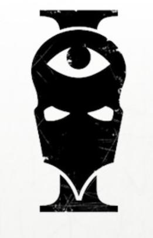

<!-- A0168-B0004 -->

原译文

Sisters of Silence symbol 寂静修女标志

**校订译文**

Sisters of Silence symbol 寂静修女标志

<!-- /A0168-B0004 -->

<!-- A0168-B0005 -->
**英文原文**

Parent Agency:Adeptus Astra Telepathica

<!-- /A0168-B0005 -->

<!-- A0168-B0006 -->

原译文

隶属机构：星语庭

**校订译文**

隶属机构：星语庭

<!-- /A0168-B0006 -->

<!-- A0168-B0007 -->
**英文原文**

Headquarters:Somnus Citadel, Luna

<!-- /A0168-B0007 -->

<!-- A0168-B0008 -->

原译文

总部：月球索莫纳斯城堡

**校订译文**

总部：月球索莫纳斯城堡

<!-- /A0168-B0008 -->

<!-- A0168-B0009 -->
**英文原文**

Leader:Sister-Commander Asurma

<!-- /A0168-B0009 -->

<!-- A0168-B0010 -->

原译文

领袖：修女指挥官阿苏玛

**校订译文**

领袖：修女指挥官阿苏玛

<!-- /A0168-B0010 -->

<!-- A0168-B0011 -->
**英文原文**

Established:M30

<!-- /A0168-B0011 -->

<!-- A0168-B0012 -->

原译文

成立时间：M30

**校订译文**

成立时间：M30

<!-- /A0168-B0012 -->

<!-- A0168-B0013 -->
## Overview 概述

<!-- /A0168-B0013 -->

<!-- A0168-B0014 -->
**英文原文**

The Sisters of Silence have a long history, originally operating from the Somnus Citadel on Luna. They are an all-female order in much the same way as the Adepta Sororitas; the major difference is that the Sisters are all blanks. Recruited from Untouchable stock, the Sisters are anathema to psykers. Their very presence disrupts psychic activity and they are presumed to have been immune to most forms of psychic assault. The main purpose of the Sisters of Silence is therefore to seek out and apprehend psykers. As warrior-investigators they were involved in all aspects of the capture and transportation of psychic individuals and are still found among the crew of the Black Ships.

<!-- /A0168-B0014 -->

<!-- A0168-B0015 -->

原译文

寂静修女有着悠久的历史，最初在月球上的索莫纳斯城堡运作。她们是一个完全由女性组成的团体，与修女会的方式大致相同；主要区别在于，寂静修女都是无魂者。是从不可接触者中招募来的，她们是灵能者的诅咒。她们的存在扰乱了灵能活动，她们被认为对大多数形式的灵能攻击免疫。因此，寂静修女的主要目的是寻找和逮捕灵能者。作为战斗调查者，她们参与了抓捕和运送灵能者的各个方面，至今仍在黑船船员中发现。

**校订译文**

寂静修女历史悠久，最初以月球索莫纳斯城堡为基地。她们与战斗修女会一样是全女性组织，但关键区别是全员均为空白者。她们从不可接触者中征募，天生克制灵能者：仅仅在场便会干扰灵能活动，据信能免疫大多数灵能攻击。她们的主要职责是搜寻、逮捕灵能者，兼具战士与调查员身份，参与抓捕、押运各环节，至今仍在黑船上服役。

<!-- /A0168-B0015 -->

<!-- A0168-B0016 图片 -->
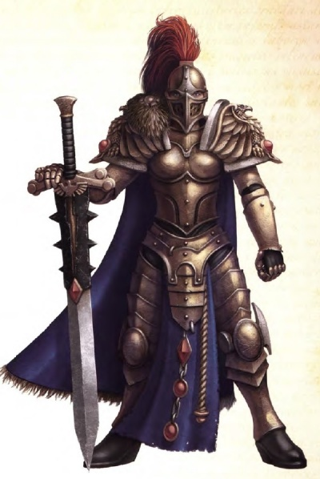

<!-- A0168-B0017 -->

原译文

Vigilator of the Silent Sisterhood 寂静修女守望者

**校订译文**

Vigilator of the Silent Sisterhood 寂静修女警戒修女

<!-- /A0168-B0017 -->

<!-- A0168-B0018 -->
**英文原文**

While nominally part of the Adeptus Astra Telepathica, in truth the Sisters of Silence answer directly to the Emperor. This allows them to operate on worlds usually immune to the Imperial Tithe, such as those belonging to the Ecclesiarchy or Adeptus Mechanicus. They also are known to be deployed against large covens of rogue psykers or Chaos Space Marine sorcerers.

<!-- /A0168-B0018 -->

<!-- A0168-B0019 -->

原译文

虽然名义上是星语庭的一部分，但事实上，寂静修女直接向帝皇负责。这使她们能够在通常不受帝国铁蹄影响的世界上进行操作，例如属于国教教会或机械神教的世界。众所周知，它们也被部署用于对付大型非法灵能者女巫会或混沌星际战士巫师。

**校订译文**

寂静修女虽名义隶属星语庭，实际直接听命于帝皇，因此可以在通常免缴帝国什一税的世界行动，包括国教会或机械修会所属世界。她们也会被派去对付大型非法灵能者巫会或混沌星际战士巫师。

<!-- /A0168-B0019 -->

<!-- A0168-B0020 -->
## History 历史

<!-- /A0168-B0020 -->

<!-- A0168-B0021 -->
**英文原文**

The origins of the Sisters of Silence are shrouded in mystery. However, it is said that they first appeared during the early Great Crusade when the Primaris Psykers of the Astra Telepathica proved unable to properly control captured Psykers. A better solution was needed, and from this conundrum was born the Silent Sisterhood. An incident known as the Cataclysm of Pentacanaes may be tied to their formation. Others say that the origins of the Silent Sisterhood go back further to a lost agency of the Dark Age of Technology.

<!-- /A0168-B0021 -->

<!-- A0168-B0022 -->

原译文

寂静修女的起源笼罩在神秘之中。然而，据说它们最早出现在大远征早期，当时星语庭的初选灵能者被证明无法正确控制被俘的灵能者。需要一个更好的解决方案，从这个难题中诞生了寂静修女会。一场被称为佩塔卡纳斯之灾的事件可能与它的形成有关。其他人说，寂静修女会的起源可以追溯到黑暗技术时代的一个失落的机构。

**校订译文**

寂静修女的起源不明。据说，大远征早期，星语庭的灵能导师无法有效控制受押灵能者，帝国需要其他办法，修女会由此诞生。佩塔卡纳斯之灾可能与其创立有关。另有说法将其起源追溯至黑暗科技时代一个已失落的机构。

<!-- /A0168-B0022 -->

<!-- A0168-B0023 图片 -->

<!-- A0168-B0024 -->

原译文

Horus Heresy-era Sisters of Silence Icon 荷鲁斯叛乱前寂静修女图标

**校订译文**

Horus Heresy-era Sisters of Silence Icon 荷鲁斯之乱时期的寂静修女标志

<!-- /A0168-B0024 -->

<!-- A0168-B0025 -->
**英文原文**

During the years of the Great Crusade, a cadre of Sisters were dispatched by the Emperor to aid the Death Guard in an attack on a Jorgall cylinder ship. Once there, they managed to wound a Jorgall mutant Psyker and capture it for transport to Terra.

<!-- /A0168-B0025 -->

<!-- A0168-B0026 -->

原译文

在大远征的几年里，帝皇派遣了一批修女来协助死亡守卫袭击一艘乔格尔圆筒船。一到那里，他们设法打伤了一个乔加尔突变灵能者，并将其捕获并运送到泰拉。

**校订译文**

大远征期间，帝皇派出一支修女队伍，协助死亡守卫攻击乔格尔圆筒船。她们成功击伤一名乔格尔变种灵能者，将其捕获并运回泰拉。

<!-- /A0168-B0026 -->

<!-- A0168-B0027 -->
**英文原文**

The major base of operations for the Sisterhood was the Somnus Citadel on Luna, which was maintained by the ancient Selenite Cults. The Sisterhood, while nominally under the control of the Astra Telepathica, quickly became a personal force associated with the Emperor himself. Along with the Custodes the Sisters of Silence were the only military force of the Imperium permitted to walk freely within the inner Imperial Palace, the sovereign domain of the Emperor.

<!-- /A0168-B0027 -->

<!-- A0168-B0028 -->

原译文

修女会的主要行动基地是月球上的索莫纳斯城堡，由古代赛琳娜教派维护。修女会虽然名义上由星语庭控制，但很快成为与帝皇本人相关的私人部队。与禁军一样，寂静修女是帝国唯一获准在帝皇的主权领域—内殿内自由行走的军事部队。

**校订译文**

修女会的主要行动基地是月球上的索莫纳斯城堡，由古代赛琳娜教派维护。修女会虽然名义上由星语庭控制，但很快成为与帝皇本人相关的私人部队。与禁军一样，寂静修女是帝国唯一获准在帝皇的主权领域—内殿内自由行走的军事部队。

<!-- /A0168-B0028 -->

<!-- A0168-B0029 -->
**英文原文**

The Sisters of Silence participated in some of the major actions of the Horus Heresy, including the defense of the Imperial Palace. They were perhaps most successful during the assault on Prospero, where a force of Sisters were deployed to provide specialised support for the attacking Space Wolves Legion. Due to their Untouchable nature, the Sisters were proof against the psychic attacks of the defending Thousand Sons Legion and provided a stable bulwark for the assault to be anchored upon. The Sisters of Silence were also vital in preventing Terra from being overrun by Daemons during the War Within the Webway. The Sisters of Silence took part in the final defense of Terra, with Sister Commander Jenetia Krole falling to Khârn of the World Eaters.

<!-- /A0168-B0029 -->

<!-- A0168-B0030 -->

原译文

寂静修女参与了荷鲁斯叛乱的一些重大行动，包括保卫皇宫。她们可能在袭击普罗斯佩罗期间最为成功，在那里部署了一支修女部队，为进攻的太空野狼军团提供专业支持。由于她们不可接触者的天性，修女们抵御了防守者千子军团的灵能攻击，并为攻击提供了稳定的堡垒。寂静修女在防止泰拉在网道战争期间被恶魔占领方面也起到了至关重要的作用。寂静修女参加了泰拉的最后防御，修女指挥官珍提亚·科勒落入了吞世者的卡恩手中。

**校订译文**

寂静修女参与荷鲁斯之乱的多场重大战事，包括保卫皇宫。她们在普罗斯佩罗进攻战中的表现尤为突出：凭借不可接触者的天性，抵御千子的灵能攻击，为太空野狼提供特种支援，成为进攻力量稳固的支点。在网道战争中，她们也为阻止恶魔涌入泰拉发挥关键作用。泰拉最终防御战期间，修女指挥官珍提亚·科勒战死于吞世者卡恩之手。

<!-- /A0168-B0030 -->

<!-- A0168-B0031 -->
### Post-Heresy 叛乱后

<!-- /A0168-B0031 -->

<!-- A0168-B0032 -->
**英文原文**

After the Warmaster’s rebellion was halted at Terra and the Emperor was interred upon his Golden Throne, the Sisters of Silence found themselves without direction. Many were slain or lost forever, scattered and stranded across a war-ravaged galaxy. Undaunted by the sudden lack of guidance, they went abroad into the wider Imperium to continue their work. There amongst the stars they hunted savants and witches with unstinting fervour; some as part of the Adeptus Astra Telepathica, some as lone but loyal agents who eventually settled within the teeming hordes of Humanity. In some rare cases, these hunters learned to suppress their uncanny auras to some degree, and in living alongside others begot their own bloodlines. None of these would-be settlers ever stayed in one place for long, for the Pariah gene is not named idly. Wherever the Sisters of Silence sought out new lives, they were hounded into exile once more by those that hated them for their intrinsic otherness. Still, not all were reviled or burned as witches. The offspring of these few had children of their own, and over the generations, the genetic peculiarity of the Silent Sisterhood found its way further into the vast spread of the human race. The exception was the Chamber Astra, which operated the Black Ships and continued to operate uninterrupted. Many believed the Sisters to have disbanded or gone extinct, though this was never the case.

<!-- /A0168-B0032 -->

<!-- A0168-B0033 -->

原译文

在战帅的叛乱在泰拉被制止，帝皇被安葬在他的黄金王座上后，寂静修女发现自己没有方向。许多人被杀或永远失踪，分散在饱受战争蹂躏的星系中。她们毫不畏惧突然缺乏指导，前往更广阔的帝国继续她们的工作。在那里，她们在群星之间不遗余力地追捕学者和女巫；有些是星语庭的一部分，有些是孤独但忠诚的特工，最终定居在人类拥挤的部落中。在一些罕见的情况下，这些猎手学会了在一定程度上抑制她们不可接触者的光环，并在与他人共同生活时诞生了自己的血统。这些潜在的定居者从未在一个地方呆过很长时间，因为被遗弃者基因并不是随便命名的。无论寂静修女们在哪里寻找新的生活，她们都会再次被那些因为她们内在的差异而憎恨她们的人流放。尽管如此，并不是所有人都被当作女巫辱骂或烧死。这些少数人的后代有了自己的孩子，经过几代人的传承，寂静修女会的遗传特性在人类的广泛传播中得到了进一步的体现。唯一的例外是星界厅，该部门经营着黑船，并继续不间断地运营。许多人认为修女会已经解散或灭绝，尽管事实并非如此。

**校订译文**

战帅叛乱在泰拉败亡、帝皇被安置于黄金王座后，寂静修女失去了指引。许多人战死或永远失踪，其余散落在饱受战争蹂躏的银河各地。她们仍深入帝国继续工作，以不减的热忱追捕灵能术士；有些留在星语庭，有些成为独行的忠诚行动者，最终融入人类社会。极少数猎手学会压制部分异常气场，与他人共同生活并留下血脉。但这种定居很少长久：“Pariah”一词意味着遭排斥者，名称并非偶然。她们天生的异样总会招来憎恶，使其再度流亡。不过，并非所有人都遭辱骂或被当女巫烧死；幸存者的后代继续繁衍，使修女会的遗传特性逐代传播至更广泛的人群。星界厅是例外，它始终管理黑船，从未中断运作。许多人以为修女会已解散或灭绝，事实却并非如此。

**校注：** Pariah 含社会排斥义，原文借词名解释不断被驱逐的遭遇；正文保留原词及语义，生物属性并未因此另作科学推定。

<!-- /A0168-B0033 -->

<!-- A0168-B0034 图片 -->
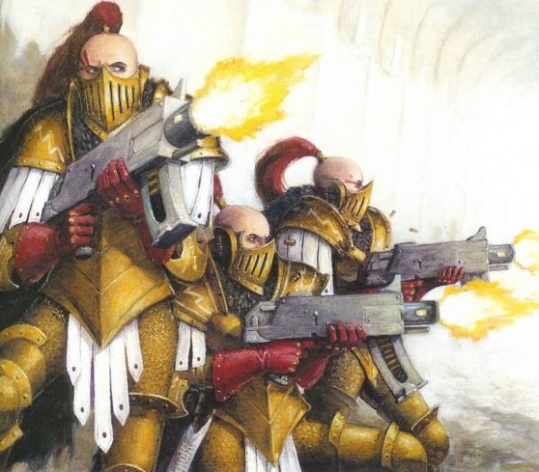

<!-- A0168-B0035 -->

原译文

The Sisters of Silence 寂静修女

**校订译文**

The Sisters of Silence 寂静修女

<!-- /A0168-B0035 -->

<!-- A0168-B0036 -->
**英文原文**

The Sisters of Silence have banded together but rarely since their devolution at the end of the Horus Heresy. Due perhaps to the uneasy nature caused by being in the presence Blanks, they were cast out of the Adeptus Terra sometime after the Heresy. By M32, only a single force of fifty Sisters were known by Imperial authorities, dwelling on the world of Nadiries. These stated that the Imperium had discarded them out of mistrust following the Heresy. Despite being fiercely loyal to the Emperor and Primarchs, this last bastion of the Sisterhood expressed disdain for the modern Imperium, stating they would rather see it burn than be of aid. Nonetheless, Lord Commander of the Imperium Koorland was able to convince them to help against the Orks during the War of the Beast. By the 41st Millennium the remaining Sisters were largely forgotten by the Imperium, their sparse and virtually unfunded Chambers operating from several Black Ships. They continued to serve in their role, but without recognition or resupply. Sister Atarine Hestia was vital in keeping the dying Sisterhood together. In their absence, remnants of the Selenites tended the Somnus Citadel, calling themselves the Fellowship.

<!-- /A0168-B0036 -->

<!-- A0168-B0037 -->

原译文

寂静修女已经联合起来，自从荷鲁斯叛乱结束后，她们很少联合起来。也许是因为在无魂者面前引起的不安，她们在叛乱之后的某个时候被赶出了中央政务部。到M32时，帝国当局只知道一支由五十名修女组成的部队，驻扎在纳迪里斯世界。这些人表示，帝国在叛乱之后出于不信任而抛弃了她们。尽管对帝皇和原体非常忠诚，但修女会的最后一个堡垒表达了对当下帝国的蔑视，表示她们宁愿看到它被烧毁，也不愿提供帮助。尽管如此，帝国领主指挥官库兰德还是说服她们在野兽战争期间帮助对抗欧克。到了第41个千年，剩下的修女们基本上被帝国遗忘了，她们稀疏且几乎没有资金的房间由几艘黑船运作。她们继续履行职责，但没有得到承认或补给。阿塔琳·赫斯提亚修女在将垂死的修女会团结在一起方面发挥了至关重要的作用。在她们缺席的情况下，赛琳娜教派的残余势力照料着索莫纳斯城堡，称自己为姐妹会。

**校订译文**

荷鲁斯之乱末期组织解体后，寂静修女很少再大规模集结。或许因为空白者的存在令人不安，她们在战后某时被逐出中央政务部。到第32千年，帝国当局只知道纳迪里斯世界上尚有一支五十人的部队。她们称帝国战后因猜忌而抛弃自己；尽管忠于帝皇与原体，却蔑视当时的帝国，宁愿看它燃烧也不愿援手。帝国最高统帅库兰德最终仍说服她们，在野兽战争中协助对抗欧克蛮人。第41千年时，幸存修女基本被遗忘，稀少且几乎得不到资助的各厅仅以少数黑船为基地，继续服役，却没有正式认可或补给。阿塔琳·赫斯提亚修女为维系垂危的组织贡献甚大。修女缺席期间，赛琳娜教派的遗民照看索莫纳斯城堡，自称同盟会。

<!-- /A0168-B0037 -->

<!-- A0168-B0038 -->
### Renaissance 复兴

<!-- /A0168-B0038 -->

<!-- A0168-B0039 -->
**英文原文**

The situation for the Sisterhood changed dramatically with the rebirth of Roboute Guilliman. At the end of the 41st Millennium a surviving group of Sisters of Silence appeared on Luna during the last stage of the Terran Crusade. These Sisters were from their few remaining strongholds across the galaxy, called back to Terra due to the Thirteenth Black Crusade at the behest of the desperate High Lords. In truth however, they had been secretly gathered perhaps years in advance by Captain-General of the Adeptus Custodes Trajann Valoris, who foresaw trouble. Alongside Custodes from Terra these Sisters proved vital in the defeat of Magnus in the battle. After the return of Roboute Guilliman, he issued the Dispensatus Anathema, declaring that the remaining strongholds of the Sisters of Silence be gathered and expanded. He sent many emissaries across the galaxy, discovering lost Sisters strongholds and issuing his summons to Terra. He went on to re-garrison the Somnus Citadel on Luna. When the great muster at Terra was complete, 3,000 Sisters had assembled and were deployed as the Vigil Indomitus, taking part in Guilliman's new Indomitus Crusade. Since the Dispensatus Anathema the Sisterhood has been greatly expanded and new Vigils once thought lost have been rediscovered by Crusade forces. The Sisters have returned to the frontlines, forming Orders and Vigils in every Segmentum and often operating in fleet-based forces for the Indomitus Crusade.

<!-- /A0168-B0039 -->

<!-- A0168-B0040 -->

原译文

随着罗伯特·基里曼的重生，修女会的情况发生了巨大的变化。第41个千年末，在泰拉远征的最后阶段，一群幸存的寂静修女出现在月球上。这些修女来自银河系仅存的几个据点，在绝望的高领主的命令下，由于第十三次黑色远征，她们被召回了泰拉。然而，事实上，她们可能是提前几年由禁军总司令图拉真·瓦洛里斯秘密召集的，他预见到了麻烦。与泰拉的禁军一起，这些修女在战斗中击败了马格努斯。在罗伯特·基里曼返回后，他发布了诅咒赦令，宣布寂静修女的剩余据点将被聚集和扩大。他派遣了许多使者穿越银河系，发现了失落的修女据点，并向泰拉发出了召唤。他继续在月球上重新驻扎索莫纳斯城堡。当泰拉的大集结完成时，3000名修女聚集在一起，被部署为不屈守夜人，参加了基里曼的新不屈远征。自从诅咒赦令以来，修女会得到了极大的扩展，远征重新发现了曾经被认为失落的新守夜人。修女们已经回到了前线，在每个星域都形成了修会和守夜人，并经常在不屈远征的舰队部队中行动。

**校订译文**

罗保特·基里曼复生后，修女会的处境大为改变。第41千年末，泰拉远征最后阶段，一批幸存修女出现在月球。她们从银河中仅存的据点奉召返回，应对第十三次黑色远征造成的危局。表面上是绝望的高领主召她们回援，实际上，预见危机的禁军元帅图拉真·瓦洛瑞斯可能早在数年前便已秘密召集她们。她们与泰拉禁军协作，为击败马格努斯发挥关键作用。基里曼归来后颁布《巫咒赦令》，要求整合、扩充修女据点，并遣使遍搜银河，召回失联修女，重新驻防月球索莫纳斯城堡。泰拉集结结束时，已有三千名修女组成不屈警戒团，参加不屈远征。此后，修女会不断扩充，远征部队也找回了其他一度被认定失落的警戒团。修女重返前线，在每个星域建立修会与警戒团，常以随舰队作战的形式参加远征。

<!-- /A0168-B0040 -->

<!-- A0168-B0041 -->
**英文原文**

The new Sisters of Silence fleets have used their null abilities in conjunction with the Navis Nobilite to penetrate the new fierce Warp Storms that ravaged the Imperium.

<!-- /A0168-B0041 -->

<!-- A0168-B0042 -->

原译文

新的寂静修女舰队与导航者家族一起使用了他们的虚无能力，穿透了肆虐帝国的新的猛烈亚空间风暴。

**校订译文**

重建后的寂静修女舰队利用自身的反灵能能力，与导航员家族合作，穿越肆虐帝国的新生猛烈亚空间风暴。

<!-- /A0168-B0042 -->

<!-- A0168-B0043 图片 -->
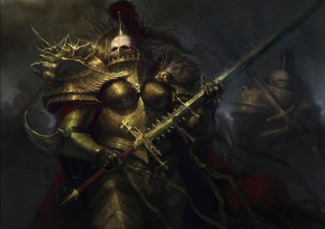

<!-- A0168-B0044 -->

原译文

The Sisters of Silence 寂静修女

**校订译文**

The Sisters of Silence 寂静修女

<!-- /A0168-B0044 -->

<!-- A0168-B0045 -->
### Notable Battles 著名战斗

<!-- /A0168-B0045 -->

<!-- A0168-B0046 -->
### Heresy-era 荷鲁斯之乱时期

原题：Heresy-era 叛乱前

<!-- /A0168-B0046 -->

<!-- A0168-B0047 -->

原译文

Great Crusade 大远征

**校订译文**

Great Crusade 大远征

<!-- /A0168-B0047 -->

<!-- A0168-B0048 -->

原译文

Mariposa Campaign 蝴蝶战役

**校订译文**

Mariposa Campaign 马里波萨战役

<!-- /A0168-B0048 -->

<!-- A0168-B0049 -->

原译文

Battle of Iota Horologi 时钟座九号之战

**校订译文**

Battle of Iota Horologi 时钟座约塔之战

<!-- /A0168-B0049 -->

<!-- A0168-B0050 -->

原译文

Horus Heresy 荷鲁斯叛乱

**校订译文**

Horus Heresy 荷鲁斯之乱

<!-- /A0168-B0050 -->

<!-- A0168-B0051 -->

原译文

Battle of Prospero 普罗斯佩罗之战

**校订译文**

Battle of Prospero 普罗斯佩罗之战

<!-- /A0168-B0051 -->

<!-- A0168-B0052 -->

原译文

War Within the Webway 网道战争

**校订译文**

War Within the Webway 网道战争

<!-- /A0168-B0052 -->

<!-- A0168-B0053 -->

原译文

Jarrazr Incursion 贾拉扎尔入侵

**校订译文**

Jarrazr Incursion 贾拉扎尔入侵

<!-- /A0168-B0053 -->

<!-- A0168-B0054 -->

原译文

Siege of Terra 泰拉围城

**校订译文**

Siege of Terra 泰拉围城

<!-- /A0168-B0054 -->

<!-- A0168-B0055 -->
### Post-Heresy era 荷鲁斯之乱后

原题：Post-Heresy era 叛乱后前期

<!-- /A0168-B0055 -->

<!-- A0168-B0056 -->

原译文

War of the Beast 野兽战争

**校订译文**

War of the Beast 野兽战争

<!-- /A0168-B0056 -->

<!-- A0168-B0057 -->
### Era Indomitus 不屈时代

原题：Era Indomitus 不屈前期

<!-- /A0168-B0057 -->

<!-- A0168-B0058 -->

原译文

Sack of the Lion's Gate 狮门劫掠

**校订译文**

Sack of the Lion's Gate 狮门劫掠

<!-- /A0168-B0058 -->

<!-- A0168-B0059 -->

原译文

Battle of Luna 月球之战

**校订译文**

Battle of Luna 月球之战

<!-- /A0168-B0059 -->

<!-- A0168-B0060 -->

原译文

Battle of Vorlese 沃勒斯之战

**校订译文**

Battle of Vorlese 沃勒斯之战

<!-- /A0168-B0060 -->

<!-- A0168-B0061 -->

原译文

Indomitus Crusade 不屈远征

**校订译文**

Indomitus Crusade 不屈远征

<!-- /A0168-B0061 -->

<!-- A0168-B0062 -->

原译文

Invasion of the Stygius Sector 冥河星区入侵

**校订译文**

Invasion of the Stygius Sector 冥河星区入侵

<!-- /A0168-B0062 -->

<!-- A0168-B0063 -->

原译文

Sack of Khassedur 卡瑟杜尔劫掠

**校订译文**

Sack of Khassedur 卡瑟杜尔劫掠

<!-- /A0168-B0063 -->

<!-- A0168-B0064 -->

原译文

The Battle of the Stygius Gilt 镀金冥河之战

**校订译文**

The Battle of the Stygius Gilt 镀金冥河之战

<!-- /A0168-B0064 -->

<!-- A0168-B0065 -->

原译文

The Battle of Raukos 劳科斯之战

**校订译文**

The Battle of Raukos 劳科斯之战

<!-- /A0168-B0065 -->

<!-- A0168-B0066 -->

原译文

The Plague Wars 瘟疫战争

**校订译文**

The Plague Wars 瘟疫战争

<!-- /A0168-B0066 -->

<!-- A0168-B0067 -->

原译文

War of the Spider 蜘蛛战争

**校订译文**

War of the Spider 蜘蛛战争

<!-- /A0168-B0067 -->

<!-- A0168-B0068 -->

原译文

Unthinkable War 匪思战争

**校订译文**

Unthinkable War 匪思战争

<!-- /A0168-B0068 -->

<!-- A0168-B0069 -->
## Communication 交流

<!-- /A0168-B0069 -->

<!-- A0168-B0070 -->
**英文原文**

Each Sister swears an oath of silence known as the Oath of Tranquility upon being nominated for Sisterhood; before this, when they are novices, they are allowed to converse normally. The oath of silence prevents them from speaking the terrible knowledge they learn to hunt their prey, while also ensuring they never speak clemency for their foes. Amongst their other duties novices sometimes act as interpreters between senior Sisters and other agents of the Imperium. Full Sisters converse in their own sign language, but there is at least one example of them being conversant in other forms of sign-communication, such as Astartes battle-signage, voidsys, and graph-binarc.

<!-- /A0168-B0070 -->

<!-- A0168-B0071 -->

原译文

每位修女在被提名为修女会成员时，都会宣誓保持沉默，称为“宁静誓言”；在此之前，当她们还是新人时，她们可以正常交谈。寂静誓言阻止了她们说出她们学会狩猎猎物的可怕知识，同时也确保了她们永远不会对敌人说宽恕之言。在她们的其他职责中，新人有时会担任资深修女和帝国其他特工之间的翻译官。所有修女用自己的手语交谈，但至少有一个例子表明她们熟悉其他形式的手语交流，如阿斯塔特战斗手势、虚空手势和二进制手势。

**校订译文**

每位修女正式入会时，都须立下名为“宁静誓言”的缄默誓约；此前，见习者仍可正常说话。沉默能防止她们泄露狩猎时学到的可怕知识，也确保她们永不向敌人许诺宽恕。见习者还会担任资深修女与帝国其他人员之间的翻译。正式修女用专属手语交流，也有记载证明她们能使用阿斯塔特战斗手势、虚空手势和二进制手势等其他体系。

<!-- /A0168-B0071 -->

<!-- A0168-B0072 -->
### Sign Language 手语

<!-- /A0168-B0072 -->

<!-- A0168-B0073 -->
**英文原文**

ThoughtMark - A symbolic sign-language that uses small gestures and conveys complex ideas and subtlety.

<!-- /A0168-B0073 -->

<!-- A0168-B0074 -->

原译文

思考手势 - 一种象征性的手语，使用小手势传达复杂的想法和微妙之处。

**校订译文**

思考手势 - 一种象征性的手语，使用小手势传达复杂的想法和微妙之处。

<!-- /A0168-B0074 -->

<!-- A0168-B0075 -->
**英文原文**

BattleMark - A symbolic sign-language used in combat. Less flexible than ThoughtMark, it is also less ambiguous and its larger gestures can be seen from farther away. This makes it a better choice for a command language on the field of battle.

<!-- /A0168-B0075 -->

<!-- A0168-B0076 -->

原译文

战斗手势 - 战斗中使用的象征性手语。它不如思考手势灵活，也不那么模糊，从更远的地方可以看到它更大的手势。这使得它成为战场上命令语言的更好选择。

**校订译文**

战斗手势 - 战斗中使用的象征性手语。它不如思考手势灵活，也不那么模糊，从更远的地方可以看到它更大的手势。这使得它成为战场上命令语言的更好选择。

<!-- /A0168-B0076 -->

<!-- A0168-B0077 -->
**英文原文**

Orsköde - A machine readable version of ThoughtMark.

<!-- /A0168-B0077 -->

<!-- A0168-B0078 -->

原译文

奥尔斯码 - 思考手势的机器可读版本。

**校订译文**

奥尔斯码 - 思考手势的机器可读版本。

<!-- /A0168-B0078 -->

<!-- A0168-B0079 -->
**英文原文**

On occasions that a senior Sister needs to communicate in a complex manner with those outside their Order, they will use a Proloquor, an acolyte who has yet to take the vow of tranquility.

<!-- /A0168-B0079 -->

<!-- A0168-B0080 -->

原译文

当高级修女需要以复杂的方式与修会以外的人沟通时，她们会使用代言者，一个尚未接受宁静誓言的助手。

**校订译文**

当高级修女需要以复杂的方式与修会以外的人沟通时，她们会使用代言者，一个尚未接受宁静誓言的助手。

<!-- /A0168-B0080 -->

<!-- A0168-B0081 -->
## Organization 组织

<!-- /A0168-B0081 -->

<!-- A0168-B0082 -->
**英文原文**

At the time of the Great Crusade and Horus Heresy the Sisterhood was overseen by three general officers: the Sister Commander, the Mistress of the Black Fleet, and the Nemesis Praxia. Below these were four distinct groups. The first was the Chamber of Vigilance, the largest of all the Sisters orders which acted as garrisons and collectors of the Great Tithe. Second was Chamber of Oblivion which operated battlefield units led by Oblivion Knights and Knights-centura. Next was the Chamber of Judgement which fielded the dreaded silent judges of the Excruciatus. The fourth was the Chamber Astra, which captained and guarded the Black Ships. Unlike the rest of the Silent Sisterhood, the Chamber Astra never was scattered or abandoned after the Heresy.

<!-- /A0168-B0082 -->

<!-- A0168-B0083 -->

原译文

在大远征和荷鲁斯叛乱时期，修女会由三名军官监督：修女指挥官、黑船之主和复仇践行者。下面是四个不同的群体。第一个是警戒厅，是所有修女会中最大的一个，担任大什一税的驻军和收集者。第二个是遗忘厅，它经营着由遗忘骑士和百人骑士领导的战场部队。接下来是审判厅，它派出了可怕的受难者寂静法官。第四个是星界厅，它是黑船的船长和守卫者。与寂静修女会的其他成员不同，星界厅在叛乱之后从未被驱逐或遗弃。

**校订译文**

大远征与荷鲁斯之乱时期，修女会由三位最高军官统领：修女指挥官、黑色舰队女主事和复仇践行者。其下分四厅：警戒厅规模最大，负责驻防和征收大什一税；湮灭厅辖战场部队，由湮灭骑士与百骑长率领；审判厅派出刑讯者中的寂静法官；星界厅则负责指挥、守卫黑船。与其他部门不同，星界厅在战后从未被打散或弃置。

<!-- /A0168-B0083 -->

<!-- A0168-B0084 -->
**英文原文**

The largest primary operating unit of the Sisterhood is a Vigil, which contained approximately 1,000 sisters. The exact size of the Sisterhood at the end of Great Crusade is not known, though it numbered in the tens of thousands.\[10b\] Currently the Vigil Indomitus, the largest Vigil of the modern Sisterhood, consists of over 3,000 warriors.

<!-- /A0168-B0084 -->

<!-- A0168-B0085 -->

原译文

修女会最大的主要运营单位是守夜人组织，其中约有1000名修女。大远征结束时修女会的确切规模尚不清楚，尽管它的数量在数万。目前，不屈守夜人是现在修女会中最大的守夜人组织，由3000多名战士组成。

**校订译文**

修女会最大的基本行动单位称警戒团，通常约有一千名修女。大远征末期的总人数不详，但达数万人。本条所述时期，不屈警戒团是重建后最大的警戒团，拥有三千余名战士。

**校注：** Vigil 作为编制暂译警戒团，参考 GW09/10 第3页分遣队 Null Maiden Vigil 虚无之女警戒团；普通编制仍按暂定登记。

<!-- /A0168-B0085 -->

<!-- A0168-B0086 -->
**英文原文**

While each Vigil varies in identity, traditions, and history, they are all divided into a number of Cadres, and each cadre is given a unique designation before taking up the Vigil's historic hues. The Cadres are company level-bodies, though it is rare for them to ever fight as one. Instead they undertake specific duties, such as investigating non-compliance with the Great Tithe, hunting down rogue psykers, or cleansing a region of psykers.

<!-- /A0168-B0086 -->

<!-- A0168-B0087 -->

原译文

虽然每个守夜人组织在身份、传统和历史上都有所不同，但她们都被分为许多核心队，每个核心队在呈现守夜人的历史色彩之前都被赋予了独特的称号。核心是连级机构，但很少作为一个整体战斗。相反，她们承担着具体的职责，例如调查不遵守大什一税的行为，追捕非法灵能者，或清理灵能者地区。

**校订译文**

各警戒团的身份、传统和历史不同，但都分成若干骨干连。每连拥有独立番号，沿用所属警戒团的传统配色。骨干连约为连级编制，却很少整体作战，通常分别调查拒缴大什一税的事件、追捕非法灵能者，或清除某一区域内的灵能者。

<!-- /A0168-B0087 -->

<!-- A0168-B0088 -->
### Ranks 等级

<!-- /A0168-B0088 -->

<!-- A0168-B0089 -->
**英文原文**

Acolyte — Uninitiated trainees that came in three ranks

<!-- /A0168-B0089 -->

<!-- A0168-B0090 -->

原译文

侍从 — 来自三个等级的初学者

**校订译文**

侍僧——尚未正式入会的学员，分为三个等级。

<!-- /A0168-B0090 -->

<!-- A0168-B0091 -->
**英文原文**

Novice-Sister — An aspirant, that has not taken the Vow of Tranquility.

<!-- /A0168-B0091 -->

<!-- A0168-B0092 -->

原译文

见习修女 — 一个有志者，没有接受宁静誓言。

**校订译文**

见习修女——尚未立下宁静誓言的候选者。

<!-- /A0168-B0092 -->

<!-- A0168-B0093 -->
**英文原文**

Null Maiden — A sister that has taken the Vow of Tranquility. They operated in three types of squads known as Seeker, Prosecutor, and Vigilator

<!-- /A0168-B0093 -->

<!-- A0168-B0094 -->

原译文

虚无修女 — 一个许下宁静誓言的修女。他们分为三类小队，分别称为追踪者、控诉者和守望者

**校订译文**

虚无之女——已立下宁静誓言的修女。她们组成追寻者、审判修女或警戒修女小队。

<!-- /A0168-B0094 -->

<!-- A0168-B0095 图片 -->
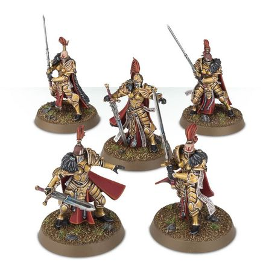

<!-- A0168-B0096 -->

原译文

Vigilators squad 守望者小队

**校订译文**

Vigilators squad 警戒修女小队

<!-- /A0168-B0096 -->

<!-- A0168-B0097 图片 -->
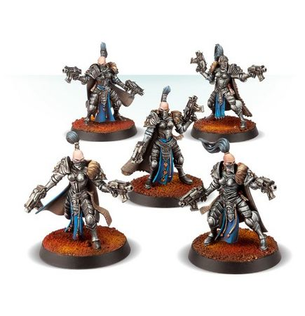

<!-- A0168-B0098 -->

原译文

Prosecutors squad 控诉者小队

**校订译文**

Prosecutors squad 审判修女小队

<!-- /A0168-B0098 -->

<!-- A0168-B0099 图片 -->
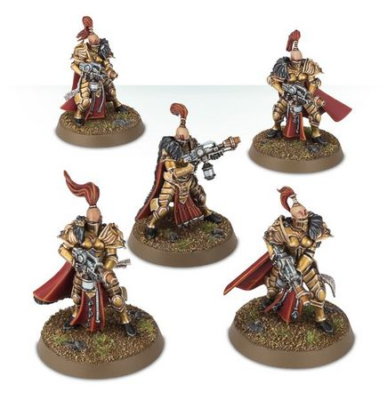

<!-- A0168-B0100 -->

原译文

Witchseekers squad 猎巫人小队

**校订译文**

Witchseekers squad 寻巫修女小队

<!-- /A0168-B0100 -->

<!-- A0168-B0101 -->
**英文原文**

Sister Superior — Squad Leader.

<!-- /A0168-B0101 -->

<!-- A0168-B0102 -->

原译文

上级修女 — 小队领袖

**校订译文**

上级修女 — 小队领袖

<!-- /A0168-B0102 -->

<!-- A0168-B0103 -->
**英文原文**

Aquilai Astra — pilots and ship crews

<!-- /A0168-B0103 -->

<!-- A0168-B0104 -->

原译文

星界天鹰 — 飞行员和船员

**校订译文**

星界天鹰 — 飞行员和船员

<!-- /A0168-B0104 -->

<!-- A0168-B0105 -->
**英文原文**

Oblivion Knight — high ranking Sisters who lead the Witchseekers on their missions. These are blanks that have developed their null-abilities to the point of making any use of psychic powers in their presence hazardous to the user. These warriors are not tasked with overseeing the Black Ships, but rather seek out and destroy powerful Psykers.

<!-- /A0168-B0105 -->

<!-- A0168-B0106 -->

原译文

遗忘骑士 — 带猎巫人执行任务的高级修女。这些无魂者已经发展出它们的虚无能力，以至于在它们面前使用任何灵能力量都会对使用者造成危险。这些战士的任务不是监督黑船，而是寻找并摧毁强大的灵能者。

**校订译文**

湮灭骑士——率领寻巫修女执行任务的高阶修女。她们的反灵能能力已强到足以令附近任何灵能施展者陷入危险。她们主要搜寻、消灭强大灵能者，而非监管黑船。

**校注：** Oblivion Knight 的中文湮灭骑士可在 GW09/10 第3页强化名称核对。此处是历史职衔，用同词译名统一，但证据本身来自强化条目。

<!-- /A0168-B0106 -->

<!-- A0168-B0107 -->
**英文原文**

Knight-Centura — The most experienced and veteran Oblivion Knights who serve as battlefield commanders for the Silent Sisterhood.

<!-- /A0168-B0107 -->

<!-- A0168-B0108 -->

原译文

百人骑士 — 最有经验和老练的遗忘骑士，担任寂静修女会的战场指挥官。

**校订译文**

百骑长 — 最有经验和老练的湮灭骑士，担任寂静修女会的战场指挥官。

<!-- /A0168-B0108 -->

<!-- A0168-B0109 -->
**英文原文**

Knight Abyssal — Higher rank. commands multiple squads of sisters.

<!-- /A0168-B0109 -->

<!-- A0168-B0110 -->

原译文

深渊骑士 — 更高级别。指挥多个修女小队。

**校订译文**

深渊骑士 — 更高级别。指挥多个修女小队。

<!-- /A0168-B0110 -->

<!-- A0168-B0111 -->
**英文原文**

Knight-Excubiator - Rank of the Chamber Astra. The commanding security officer of a Black Ship.

<!-- /A0168-B0111 -->

<!-- A0168-B0112 -->

原译文

警戒骑士 — 星界厅的等级。黑船的指挥安全的军官。

**校订译文**

警戒骑士——星界厅职衔，担任黑船的安全主管。

<!-- /A0168-B0112 -->

<!-- A0168-B0113 -->
**英文原文**

Witchseeker Pursuivant — High ranking sister (above that of Oblivion Knight).

<!-- /A0168-B0113 -->

<!-- A0168-B0114 -->

原译文

猎巫人随从 — 高级修女（高于遗忘骑士）。

**校订译文**

寻巫传令官——高阶修女，位阶高于湮灭骑士。

<!-- /A0168-B0114 -->

<!-- A0168-B0115 -->
**英文原文**

Nemesis Praxia — One of the three most senior ranks, overseeing the Sisterhoods acquired lore and training new recruits.

<!-- /A0168-B0115 -->

<!-- A0168-B0116 -->

原译文

复仇践行者 — 三个最高级的职位之一，负责监督修女会获得知识并培训新兵。

**校订译文**

复仇践行者——三大最高职衔之一，负责管理修女会积累的知识与培训新兵。

<!-- /A0168-B0116 -->

<!-- A0168-B0117 -->
**英文原文**

Mistress of the Black Fleet — One of the three most senior ranks, charged with commanding and overseeing the League of Black Ships.

<!-- /A0168-B0117 -->

<!-- A0168-B0118 -->

原译文

黑船之主 — 三个最高级职位之一，负责指挥和监督黑船联盟。

**校订译文**

黑色舰队女主事 — 三个最高级职位之一，负责指挥和监督黑船联盟。

<!-- /A0168-B0118 -->

<!-- A0168-B0119 -->
**英文原文**

Sister-Commander — One of the three most senior ranks. The general commander of the Sisters of Silence. Also referred to as Knight-Commander or Vigil-Commander.

<!-- /A0168-B0119 -->

<!-- A0168-B0120 -->

原译文

修女指挥官 — 三个最高级的职位之一。寂静修女的总司令。也被称为骑士指挥官或守夜人指挥官。

**校订译文**

修女指挥官 — 三个最高级的职位之一。寂静修女的总司令。也被称为骑士指挥官或警戒团指挥官。

<!-- /A0168-B0120 -->

<!-- A0168-B0121 -->
### Specialist Roles 特殊角色

<!-- /A0168-B0121 -->

<!-- A0168-B0122 -->
**英文原文**

Excruciatus — The hunters, investigators, and secret police of the Silent Sisterhood who serve within the Chamber of Judgement. They deal primarily with those who seek to shelter and harbor Psykers. The lower rank of the Excruciatus are known as Questora while the most senior squad commanders are dubbed Silent Judge. Excruciatus wear red coats and ruby implants on their eyes and are said to require personally burning 100 witches before attaining this position.

<!-- /A0168-B0122 -->

<!-- A0168-B0123 -->

原译文

受难者 — 寂静修女会的猎手、审查者和秘密警察，在审判厅内服务。他们主要处理那些寻求避难所和庇护灵能者的人。受难者的下级被称为拷问官，而最高级的小队指挥官则被称为寂静法官。受难者穿着红色外套，眼睛上镶嵌着红宝石，据说需要亲自烧死100名女巫才能达到这个位置。

**校订译文**

刑讯者——隶属审判厅的猎手、调查员与秘密警察，主要对付窝藏、庇护灵能者的人。下级称拷问官，最高阶小队指挥官称寂静法官。她们穿红衣，在眼部植入红宝石装置；据说须亲手烧死一百名巫师，才能获此职。

<!-- /A0168-B0123 -->

<!-- A0168-B0124 -->
**英文原文**

Knight Vestal - Battlefield medics.

<!-- /A0168-B0124 -->

<!-- A0168-B0125 -->

原译文

灶神骑士 - 战场医务人员。

**校订译文**

灶神骑士 - 战场医务人员。

<!-- /A0168-B0125 -->

<!-- A0168-B0126 -->
**英文原文**

Eradicator - Veterans who lead the vanguard of larger assaults.

<!-- /A0168-B0126 -->

<!-- A0168-B0127 -->

原译文

根除者 - 领导更大规模攻击的先锋老兵。

**校订译文**

根除者 - 领导更大规模攻击的先锋老兵。

<!-- /A0168-B0127 -->

<!-- A0168-B0128 -->
**英文原文**

Prosecutor - Basic foot soldiers.

<!-- /A0168-B0128 -->

<!-- A0168-B0129 -->

原译文

控诉者 - 基层步兵。

**校订译文**

审判修女 - 基层步兵。

<!-- /A0168-B0129 -->

<!-- A0168-B0130 -->
**英文原文**

Vigilator - Deployed to identify and excise key components of an enemy force at close quarters.

<!-- /A0168-B0130 -->

<!-- A0168-B0131 -->

原译文

守望者 - 部署用于近距离识别和消灭敌军的关键组成部分。

**校订译文**

警戒修女——在近战中锁定、消灭敌方部队的关键目标。

<!-- /A0168-B0131 -->

<!-- A0168-B0132 -->
**英文原文**

Pursuer — Cyber-Mastiff and beast handlers

<!-- /A0168-B0132 -->

<!-- A0168-B0133 -->

原译文

追击者 — 智控獒犬和驯兽师

**校订译文**

追击者——机械獒犬操控员与驯兽师。

<!-- /A0168-B0133 -->

<!-- A0168-B0134 -->
**英文原文**

Silent Furies - Jetbike riders dispatched by the Chamber of Judgement to hunt down and capture Rogue Psykers.

<!-- /A0168-B0134 -->

<!-- A0168-B0135 -->

原译文

无声愤怒 - 由审判厅派遣的喷气摩托骑手追捕并捕获非法灵能者。

**校订译文**

寂静复仇女神——审判厅派出的喷气摩托骑手，负责追捕非法灵能者。

<!-- /A0168-B0135 -->

<!-- A0168-B0136 -->
**英文原文**

Firebrand - Purgation units tasked with widespread destruction.

<!-- /A0168-B0136 -->

<!-- A0168-B0137 -->

原译文

火印 - 负责大规模破坏的扫荡部队。

**校订译文**

火印 - 负责大规模破坏的扫荡部队。

<!-- /A0168-B0137 -->

<!-- A0168-B0138 -->
**英文原文**

Subjugator - Jetbike riders that act as scouts.

<!-- /A0168-B0138 -->

<!-- A0168-B0139 -->

原译文

镇压者 - 充当侦察兵的喷气摩托骑手。

**校订译文**

镇压者 - 充当侦察兵的喷气摩托骑手。

<!-- /A0168-B0139 -->

<!-- A0168-B0140 -->
**英文原文**

Sanctioner - Chamber of Vigilance specialists who identify and eliminate troublesome agitators as well as Rogue Psykers.

<!-- /A0168-B0140 -->

<!-- A0168-B0141 -->

原译文

制裁者 - 警戒厅专家，负责识别和消除麻烦的煽动者以及非法灵能者。

**校订译文**

制裁者 - 警戒厅专家，负责识别和消除麻烦的煽动者以及非法灵能者。

<!-- /A0168-B0141 -->

<!-- A0168-B0142 -->
**英文原文**

Expurgator - Cover up the activities of the Silent Sisterhood

<!-- /A0168-B0142 -->

<!-- A0168-B0143 -->

原译文

驱逐者 - 掩盖寂静修女会的行动

**校订译文**

抹除者——负责掩盖修女会的行动。

<!-- /A0168-B0143 -->

<!-- A0168-B0144 -->
### Known Vigils 著名警戒团

原题：Known Vigils 著名守夜人

<!-- /A0168-B0144 -->

<!-- A0168-B0145 -->
### Known Cadres 著名骨干连

原题：Known Cadres 著名核心队

<!-- /A0168-B0145 -->

<!-- A0168-B0146 -->

原译文

Argent Lynx 白银山猫

**校订译文**

Argent Lynx 白银山猫

<!-- /A0168-B0146 -->

<!-- A0168-B0147 图片 -->
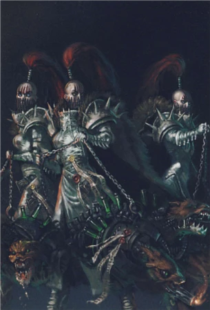

<!-- A0168-B0148 -->

原译文

Argent Lynx Cadre Prosecutor Squad 白银山猫核心队控诉者小队

**校订译文**

Argent Lynx Cadre Prosecutor Squad 白银山猫骨干连审判修女小队

<!-- /A0168-B0148 -->

<!-- A0168-B0149 -->

原译文

Brazen Sabre 黄铜长剑

**校订译文**

Brazen Sabre 黄铜军刀

<!-- /A0168-B0149 -->

<!-- A0168-B0150 -->

原译文

Excrutiatus 受难者

**校订译文**

Excrutiatus 刑讯者

**校注：** 原文此处 Excrutiatus 拼写与正文 Excruciatus 不同，暂视为同一名称异拼，不改英文。

<!-- /A0168-B0150 -->

<!-- A0168-B0151 -->

原译文

Frost Spider 寒霜蜘蛛

**校订译文**

Frost Spider 寒霜蜘蛛

<!-- /A0168-B0151 -->

<!-- A0168-B0152 -->

原译文

Frost Wolves 霜狼

**校订译文**

Frost Wolves 霜狼

<!-- /A0168-B0152 -->

<!-- A0168-B0153 -->

原译文

Raptor Guard 猛禽守卫

**校订译文**

Raptor Guard 猛禽守卫

<!-- /A0168-B0153 -->

<!-- A0168-B0154 -->

原译文

Raven's Claw 鸦爪

**校订译文**

Raven's Claw 鸦爪

<!-- /A0168-B0154 -->

<!-- A0168-B0155 图片 -->
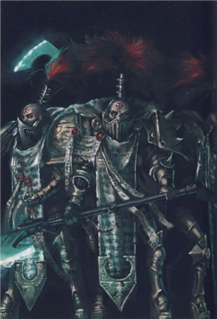

<!-- A0168-B0156 -->

原译文

Raven's Claw Cadre Assault Squad 鸦爪核心队突击小队

**校订译文**

Raven's Claw Cadre Assault Squad 鸦爪骨干连突击小队

<!-- /A0168-B0156 -->

<!-- A0168-B0157 -->

原译文

Ice Serpents 冰蛇

**校订译文**

Ice Serpents 冰蛇

<!-- /A0168-B0157 -->

<!-- A0168-B0158 -->

原译文

Silver Osprey 银色鱼鹰

**校订译文**

Silver Osprey 银色鱼鹰

<!-- /A0168-B0158 -->

<!-- A0168-B0159 -->

原译文

Steel Foxes 钢狐

**校订译文**

Steel Foxes 钢狐

<!-- /A0168-B0159 -->

<!-- A0168-B0160 -->

原译文

Storm Dagger 风暴匕首

**校订译文**

Storm Dagger 风暴匕首

<!-- /A0168-B0160 -->

<!-- A0168-B0161 -->

原译文

White Asps 白色蝰蛇

**校订译文**

White Asps 白色蝰蛇

<!-- /A0168-B0161 -->

<!-- A0168-B0162 -->

原译文

White Falcons 白色猎鹰

**校订译文**

White Falcons 白色猎鹰

<!-- /A0168-B0162 -->

<!-- A0168-B0163 -->

原译文

White Talon 白色利爪

**校订译文**

White Talon 白色利爪

<!-- /A0168-B0163 -->

<!-- A0168-B0164 -->

原译文

White Tigers 白虎

**校订译文**

White Tigers 白虎

<!-- /A0168-B0164 -->

<!-- A0168-B0165 -->

原译文

Winter Crows 白鸦

**校订译文**

Winter Crows 冬鸦

<!-- /A0168-B0165 -->

<!-- A0168-B0166 -->
## Recruitment and Training 招募与训练

<!-- /A0168-B0166 -->

<!-- A0168-B0167 -->
**英文原文**

The Sisterhood recruits Blanks from a great many sources, which vary from Vigil to Vigil. Some have ended up among the Imperial Tithe, their worlds eager to be rid of the pariahs. Others are handed over by the Inquisition or Rogue Traders. Rumors persist that the Sisterhood themselves maintain genetically stable bloodlines of Pariahs, breeding new Sisters for recruitment.

<!-- /A0168-B0167 -->

<!-- A0168-B0168 -->

原译文

修女会从许多来源招募无魂者，这些来源因守夜人而异。有些人最终加入了帝国什一税，他们的世界渴望摆脱被遗弃者。其他人则由审判庭或行商浪人移交。有传言称，修女会本身保持着被遗弃者基因稳定的血统，繁殖了新的修女以供招募。

**校订译文**

修女会通过多种渠道招募空白者，各警戒团做法不同。有些被本星居民迫不及待地作为帝国什一税送走，以摆脱这些遭排斥者；另一些由审判庭或行商浪人移交。还有持续流传的说法称，修女会维系着遗传稳定的无魂者血脉，自行繁育未来成员。

<!-- /A0168-B0168 -->

<!-- A0168-B0169 -->
**英文原文**

Once recruited, aspiring Sisters known as Proloquors begin gruelling training and a range lesser duties. Only once they have proven themselves worthy of the Sisterhood's high standards are they inducted fully. Upon becoming a full member they take the Vow of Tranquility, never speaking again.

<!-- /A0168-B0169 -->

<!-- A0168-B0170 -->

原译文

一旦被招募，被称为代言者的有志者修女就开始了艰苦的训练和较轻的任务。只有当他们证明自己配得上修女会的高标准时，他们才会被完全接纳。成为正式成员后，他们接受宁静誓言，再也不说话了。

**校订译文**

入选后，候选修女称为代言者，开始艰苦训练并承担各类基层职责。只有达到修女会的严格标准，才可正式入会；届时立下宁静誓言，从此不再说话。

<!-- /A0168-B0170 -->

<!-- A0168-B0171 -->
## Equipment 装备

<!-- /A0168-B0171 -->

<!-- A0168-B0172 -->
**英文原文**

Clad in their iconic Vratine Armour, Sisters of Silence operated a variety of weaponry based around their mission of Psyker-hunting. Their primary close ranged weapon was the Executioner Greatblade or Power Axe while others carried Bolters and Flamers. They also frequently utilized Psyk-out Grenades. For transportation and fast attack, the Sisters of Silence were known to ride into battle on Grav-Rhinos, Kharon Pattern Acquisitors, Dividers, and Jetbikes.

<!-- /A0168-B0172 -->

<!-- A0168-B0173 -->

原译文

身着标志性的瓦拉庭盔甲，寂静修女围绕他们的灵能者狩猎任务使用了各种武器。他们的主要近距武器是刽子手大剑或动力斧，而其他人则携带爆矢枪和火焰枪。他们还经常使用祛灵手榴弹。为了运输和快速进攻，寂静修女会驾驶反重力犀牛、卡戎型收获者、分割者和喷气摩托投入战斗。

**校订译文**

寂静修女身着标志性的瓦拉庭护甲，按猎捕灵能者的任务需要配备武器。主要近战武器是处决者巨刃或动力斧，其他人使用爆矢枪、火焰喷射器，并常携祛灵手雷。她们也乘坐反重力犀牛、卡戎型收获者、分割者及喷气摩托，以便运输或快速突击。

<!-- /A0168-B0173 -->

<!-- A0168-B0174 -->
**英文原文**

In the Age of the Dark Imperium, much of the advanced weaponry and technology wielded by the Silent Sisterhood has since been lost. This includes psi-negation and disruption technology as well as anti-gravity vessels said to be fashioned by the Emperor himself. It is one of the primary goals of current Sister-Commander Asurma to reclaim this lost technology.

<!-- /A0168-B0174 -->

<!-- A0168-B0175 -->

原译文

在黑暗帝国时代，寂静修女会掌握的许多先进武器和技术已经丢失。这包括灵能否定和破坏技术，以及据说由帝皇亲自打造的反重力舰。回收这项丢失的技术是现任修女指挥官阿苏玛的主要目标之一。

**校订译文**

到了黑暗帝国时代，寂静修女会失去了许多先进武器与技术，包括灵能抑制和干扰技术，以及据说由帝皇亲造的反重力载具。修女指挥官阿苏玛的一大目标，就是找回这些失落技术。

<!-- /A0168-B0175 -->

<!-- A0168-B0176 -->
## Notable Sisters of Silence 著名寂静修女

<!-- /A0168-B0176 -->

<!-- A0168-B0177 -->
### Heresy-era 荷鲁斯之乱时期

原题：Heresy-era 叛乱前

<!-- /A0168-B0177 -->

<!-- A0168-B0178 -->
**英文原文**

Jenetia Krole — Knight-Commander

<!-- /A0168-B0178 -->

<!-- A0168-B0179 -->

原译文

珍提亚·科勒 — 骑士指挥官

**校订译文**

珍提亚·科勒 — 骑士指挥官

<!-- /A0168-B0179 -->

<!-- A0168-B0180 图片 -->
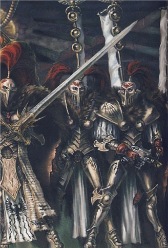

<!-- A0168-B0181 -->

原译文

Janetia Krole with Raptor Squad 珍提亚·科勒与猛禽小队

**校订译文**

Janetia Krole with Raptor Squad 珍提亚·科勒与猛禽小队

<!-- /A0168-B0181 -->

<!-- A0168-B0182 -->
**英文原文**

Varonika Sulath — Mistress of the Black Fleet

<!-- /A0168-B0182 -->

<!-- A0168-B0183 -->

原译文

瓦罗尼卡·苏拉斯 — 黑船之主

**校订译文**

瓦罗尼卡·苏拉斯 — 黑色舰队女主事

<!-- /A0168-B0183 -->

<!-- A0168-B0184 -->
**英文原文**

Ebon Naroda — Nemesis Praxia

<!-- /A0168-B0184 -->

<!-- A0168-B0185 -->

原译文

埃邦·纳罗达 — 复仇践行者

**校订译文**

埃邦·纳罗达 — 复仇践行者

<!-- /A0168-B0185 -->

<!-- A0168-B0186 -->
**英文原文**

Aphone - Raptor Guard

<!-- /A0168-B0186 -->

<!-- A0168-B0187 -->

原译文

阿丰 - 猛禽守卫

**校订译文**

阿丰 - 猛禽守卫

<!-- /A0168-B0187 -->

<!-- A0168-B0188 -->
**英文原文**

Celia Harroda — Witchseeker Pursuivant

<!-- /A0168-B0188 -->

<!-- A0168-B0189 -->

原译文

塞莉娅·哈罗德 — 猎巫人随从

**校订译文**

塞莉娅·哈罗德——寻巫传令官。

<!-- /A0168-B0189 -->

<!-- A0168-B0190 -->
**英文原文**

Gresselda Vym — Witchseeker Pursuivant

<!-- /A0168-B0190 -->

<!-- A0168-B0191 -->

原译文

格蕾塞尔达·维姆 — 猎巫人随从

**校订译文**

格蕾塞尔达·维姆——寻巫传令官。

<!-- /A0168-B0191 -->

<!-- A0168-B0192 -->
**英文原文**

Amendera Kendel — Oblivion Knight, Storm Dagger Cadre

<!-- /A0168-B0192 -->

<!-- A0168-B0193 -->

原译文

阿蒙德菈·肯德尔 — 遗忘骑士，风暴匕首核心队

**校订译文**

阿蒙德菈·肯德尔 — 湮灭骑士，风暴匕首骨干连

<!-- /A0168-B0193 -->

<!-- A0168-B0194 -->
**英文原文**

Kaeria Casryn — Oblivion Knight, Steel Foxes Cadre

<!-- /A0168-B0194 -->

<!-- A0168-B0195 -->

原译文

凯莉娅·卡斯琳 — 遗忘骑士，钢狐核心队

**校订译文**

凯莉娅·卡斯琳 — 湮灭骑士，钢狐骨干连

<!-- /A0168-B0195 -->

<!-- A0168-B0196 -->
**英文原文**

Melaena Verdath — Silent Judge

<!-- /A0168-B0196 -->

<!-- A0168-B0197 -->

原译文

梅莱娜·维尔达斯 — 寂静法官

**校订译文**

梅莱娜·维尔达斯 — 寂静法官

<!-- /A0168-B0197 -->

<!-- A0168-B0198 图片 -->
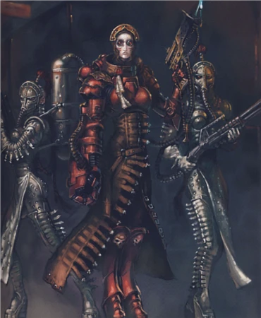

<!-- A0168-B0199 -->

原译文

Melaena Verdath with Extraction Squad 梅莱娜·维尔达斯与提取小队

**校订译文**

Melaena Verdath with Extraction Squad 梅莱娜·维尔达斯与提取小队

<!-- /A0168-B0199 -->

<!-- A0168-B0200 -->
**英文原文**

Emrilia Herkaaze — Sister-Excruciatus

<!-- /A0168-B0200 -->

<!-- A0168-B0201 -->

原译文

艾米莉亚·赫卡兹 — 受难者修女

**校订译文**

艾米莉亚·赫卡兹 — 刑讯者修女

<!-- /A0168-B0201 -->

<!-- A0168-B0202 -->
**英文原文**

Calistis Merovin — Knight-Centura

<!-- /A0168-B0202 -->

<!-- A0168-B0203 -->

原译文

卡丽斯蒂斯·梅洛文 — 百人骑士

**校订译文**

卡丽斯蒂斯·梅洛文 — 百骑长

<!-- /A0168-B0203 -->

<!-- A0168-B0204 -->
**英文原文**

Leilani Mollitas — Sister-in-Waiting

<!-- /A0168-B0204 -->

<!-- A0168-B0205 -->

原译文

莱菈尼·莫利塔斯 — 侍从修女

**校订译文**

莱菈尼·莫利塔斯 — 侍从修女

<!-- /A0168-B0205 -->

<!-- A0168-B0206 -->
**英文原文**

Kannita Yel — Null Maiden

<!-- /A0168-B0206 -->

<!-- A0168-B0207 -->

原译文

卡妮塔·耶尔 — 虚无修女

**校订译文**

卡妮塔·耶尔 — 虚无之女

<!-- /A0168-B0207 -->

<!-- A0168-B0208 -->
**英文原文**

Euphemia King — Vigilator Mistress

<!-- /A0168-B0208 -->

<!-- A0168-B0209 -->

原译文

尤菲米亚·金 — 守望者之主

**校订译文**

尤菲米亚·金——警戒修女主事。

<!-- /A0168-B0209 -->

<!-- A0168-B0210 -->
### Post-Heresy 叛乱后

<!-- /A0168-B0210 -->

<!-- A0168-B0211 -->
**英文原文**

Asurma — Sister-Commander

<!-- /A0168-B0211 -->

<!-- A0168-B0212 -->

原译文

阿苏玛 — 修女指挥官

**校订译文**

阿苏玛 — 修女指挥官

<!-- /A0168-B0212 -->

<!-- A0168-B0213 -->
**英文原文**

Aphone — Commander

<!-- /A0168-B0213 -->

<!-- A0168-B0214 -->

原译文

阿丰 — 指挥官

**校订译文**

阿丰 — 指挥官

<!-- /A0168-B0214 -->

<!-- A0168-B0215 -->
**英文原文**

Bellas — Commander

<!-- /A0168-B0215 -->

<!-- A0168-B0216 -->

原译文

贝菈斯 — 指挥官

**校订译文**

贝菈斯 — 指挥官

<!-- /A0168-B0216 -->

<!-- A0168-B0217 -->
**英文原文**

Kavalanera Brassanas — Knight Abyssal of Purgatory Squad

<!-- /A0168-B0217 -->

<!-- A0168-B0218 -->

原译文

卡瓦莱涅菈·布拉桑那斯 — 炼狱小队的深渊骑士

**校订译文**

卡瓦莱涅菈·布拉桑那斯 — 炼狱小队的深渊骑士

<!-- /A0168-B0218 -->

<!-- A0168-B0219 -->
**英文原文**

Dessima — Knight-Centura

<!-- /A0168-B0219 -->

<!-- A0168-B0220 -->

原译文

德西玛 — 百人骑士

**校订译文**

德西玛 — 百骑长

<!-- /A0168-B0220 -->

<!-- A0168-B0221 -->

原译文

Atarine Hestia 阿塔琳·赫斯提亚

**校订译文**

Atarine Hestia 阿塔琳·赫斯提亚

<!-- /A0168-B0221 -->

<!-- A0168-B0222 -->

原译文

Tanau Aleya 塔娜奥·阿蕾娅

**校订译文**

Tanau Aleya 塔瑙·阿莱亚

**校注：** Aleya 官译阿莱亚（GW09/10 第3页）；全名 Tanau Aleya 中 Tanau 暂音译塔瑙。

<!-- /A0168-B0222 -->

<!-- A0168-B0223 -->
**英文原文**

Ordela Grendoth — Oblivion Knight

<!-- /A0168-B0223 -->

<!-- A0168-B0224 -->

原译文

奥德菈·格伦多斯 — 遗忘骑士

**校订译文**

奥德菈·格伦多斯 — 湮灭骑士

<!-- /A0168-B0224 -->

<!-- A0168-B0225 -->
**英文原文**

Asheera Voi — Oblivion Knight

<!-- /A0168-B0225 -->

<!-- A0168-B0226 -->

原译文

阿什耶拉·沃伊 — 遗忘骑士

**校订译文**

阿什耶拉·沃伊 — 湮灭骑士

<!-- /A0168-B0226 -->

<!-- A0168-B0227 -->
**英文原文**

Phyllia Torunda — Knight-Excubitor of the Chamber Astra.

<!-- /A0168-B0227 -->

<!-- A0168-B0228 -->

原译文

菲利亚·托伦达 — 星界厅的警戒骑士

**校订译文**

菲利亚·托伦达 — 星界厅的警戒骑士

<!-- /A0168-B0228 -->

<!-- A0168-B0229 -->
**英文原文**

Syreniel - Oblivion Knight of the Palatine Vigilators

<!-- /A0168-B0229 -->

<!-- A0168-B0230 -->

原译文

西瑞妮尔 - 宫廷守望者的遗忘骑士

**校订译文**

西瑞妮尔 - 宫廷守望者的湮灭骑士

<!-- /A0168-B0230 -->

<!-- A0168-B0231 -->
## Trivia 琐事

<!-- /A0168-B0231 -->

<!-- A0168-B0232 -->
**英文原文**

Orsköde is similar in function to real world Morse Code.

<!-- /A0168-B0232 -->

<!-- A0168-B0233 -->

原译文

奥尔斯码在功能上与现实世界的莫尔斯码相似。

**校订译文**

奥尔斯码在功能上与现实世界的莫尔斯码相似。

<!-- /A0168-B0233 -->

本篇核心术语与暂定项

以下列出本篇出现的英文原形及核心术语表用词。同形词可能指不同对象，具体词义以本篇正文和校注为准；单复数、别名和仅见于图注的名称可能尚未列入。完整候选见[术语表](../../术语表/双语术语候选.csv)。

| 英文 | 采用中文 | 状态 |
| --- | --- | --- |
| Space Wolves | 太空野狼 | 官方已核对 |
| Adepta Sororitas | 修女会 | 官方已核对 |
| Adeptus Custodes | 帝皇禁军 | 官方已核对 |
| Adeptus Mechanicus | 机械修会 | 官方已核对 |
| Death Guard | 死亡守卫 | 官方已核对 |
| Thousand Sons | 千子 | 官方已核对 |
| World Eaters | 吞世者 | 官方已核对 |
| Orks | 欧克蛮人 | 官方已核对 |
| Psyker | 灵能者 | 官方已核对 |
| Roboute Guilliman | 罗保特·基里曼 | 官方已核对 |
| Horus Heresy | 荷鲁斯之乱 | 官方已核对 |
| Adeptus Astra Telepathica | 星语庭 | 暂定 |
| Warp | 亚空间 | 官方已核对 |
| Inquisition | 审判庭 | 暂定 |
| Imperium | 帝国 | 暂定·简称 |
| Dark Age of Technology | 黑暗科技时代 | 暂定 |
| Webway | 网道 | 暂定 |
| Indomitus | 不屈学派 | 暂定·学派语境 |
| History | 历史 | 编辑用语已统一 |
| Emperor | 帝皇 | 官方已核对 |
| Adeptus Terra | 中央政务部 | 暂定 |
| Ecclesiarchy | 国教会 | 暂定 |
| Navis Nobilite | 导航员家族 | 暂定·官方待核 |
| Mutant | 变种人 | 暂定·官方待核 |
| Great Crusade | 大远征 | 暂定·官方待核 |
| Compliance | 归顺；纳入帝国统治 | 暂定·官方待核 |
| Terra | 泰拉 | 暂定·官方待核 |
| Horus | 荷鲁斯 | 暂定·官方待核 |
| Cyber-Mastiff | 智控獒犬 | 暂定·官方待核 |
| Sisters of Silence | 寂静修女 | 暂定·官方待核 |
| Dark Imperium | 黑暗帝国 | 暂定·官方待核 |
| Indomitus Crusade | 不屈远征 | 暂定·官方待核 |
| Lord Commander of the Imperium | 帝国最高统帅 | 暂定·官方待核 |
| League of Black Ships | 黑船联盟 | 暂定·官方待核 |
| Golden Throne | 黄金王座 | 暂定·官方待核 |
| Segmentum | 星域 | 暂定·官方待核 |
| Luna | 月球 | 暂定·官方待核 |
| Untouchable | 不可接触者 | 暂定·官方待核 |
| Pariah | 贱民 | 暂定·官方待核 |
| pariah gene | 贱民基因 | 暂定·官方待核 |
| Jenetia Krole | 珍提亚·科勒 | 暂定·官方待核 |
| Amendera Kendel | 阿蒙德菈·肯德尔 | 暂定·官方待核 |
| Leilani Mollitas | 莱菈尼·莫利塔斯 | 暂定·官方待核 |
| Thoughtmark | 思想印记 | 暂定·官方待核 |
| Imperial Tithe | 帝国什一税 | 暂定·官方待核 |
| Mission | 教团／传教机构 | 暂定 |
| Palatine | 宫廷官 | 官方已核对 |
| Ancient | 旗手 | 官方已核对 |
| Knight-Centura | 百骑长 | 官方已核对 |
| Trajann Valoris | 图拉真·瓦洛瑞斯 | 官方已核对 |
| Vigilators | 警戒修女 | 官方已核对 |
| Witchseekers | 寻巫修女 | 官方已核对 |
| Oblivion Knight | 湮灭骑士 | 官方已核对 |
| Aspirant | 候补骑士 | 暂定·官方待核 |
| Anathema Psykana | 巫咒修女会 | 暂定·官方待核 |
| Chamber Astra | 星界厅 | 暂定·官方待核 |
| Mistress of the Black Fleet | 黑色舰队女主事 | 暂定·官方待核 |
| Vigil | 警戒团（静默修女编制）／警戒堡（红蝎空间站）／守夜星（行星） | 语境定译·官方待核 |
| Vigil Indomitus | 不屈警戒团 | 暂定·官方待核 |
| Cadre | 骨干连（寂静修女）／核心队（钛族） | 语境定译·钛族词根参考 |
| Excruciatus | 刑讯者 | 暂定·官方待核 |
| Witchseeker Pursuivant | 寻巫传令官 | 暂定·官方待核 |
| Silent Furies | 寂静复仇女神 | 暂定·官方待核 |
| Null Maiden | 虚无之女 | 暂定·官方待核 |
| Captain-General | 禁军元帅 | 暂定·官方待核 |
| Lord Commander | 领主指挥官 | 暂定·官方待核 |
| Khârn | 卡恩 | 暂定·官方待核 |
| Seeker | 追踪者 | 暂定·官方待核 |
| Space Marine | 星际战士 | 暂定·官方待核 |
| Captain | 连长 | 暂定·官方待核 |
| Veteran | 老兵 | 暂定·官方待核 |
| Eradicator | 根除者 | 暂定·官方待核 |
| Vanguard | 先锋 | 暂定·官方待核 |
| Nemesis | 复仇女神 | 暂定·官方待核 |
| Rhinos | 犀牛 | 暂定·官方待核 |
| Remnants | 残骸 | 暂定·官方待核 |
| Firebrand | 火焰烙印号（舰船）／纵火者（福格瑞姆的枪械） | 语境定译·官方待核 |
| Powers | 能天使 | 暂定·官方待核 |
| Flamers | 火妖（奸奇单位）／火焰喷射器（武器） | 语境定译·对应官译已核 |
| The Beast | 野兽 | 暂定·官方待核 |
| Koorland | 库兰德 | 暂定·官方待核 |
| Bulwark | 壁垒号 | 暂定·官方待核 |
| The Anathema | 被诅咒者 | 暂定·官方待核 |
| Calistis Merovin | 卡利斯提斯·梅罗文 | 暂定·官方待核 |
| Cataclysm of Pentacanaes | 佩塔卡纳斯之灾 | 暂定·官方待核 |
| Proloquor | 传言者 | 暂定·官方待核 |
| Raptor Guard | 猛禽卫队 | 暂定·官方待核 |
| Kaeria Casryn | 凯莉娅·卡斯琳 | 暂定·官方待核 |
| Steel Foxes Cadre | 钢狐核心队 | 暂定·官方待核 |
| Somnus Citadel | 索莫纳斯城堡 | 暂定·官方待核 |
| The Dark | 《黑暗》 | 暂定·官方待核 |
| Kavalanera Brassanas | 卡瓦莱涅菈·布拉桑那斯 | 暂定·官方待核 |
| Nadiries | 纳迪里斯 | 暂定·官方待核 |
| Syreniel | 西瑞妮尔 | 暂定·官方待核 |
| Jorgall | 乔格尔 | 暂定·官方待核 |
| Terran Crusade | 泰拉远征 | 暂定·官方待核 |
| Ordela Grendoth | 奥德菈·格伦多斯 | 暂定·官方待核 |
| Jetbike | 喷气摩托 | 暂定·官方待核 |

