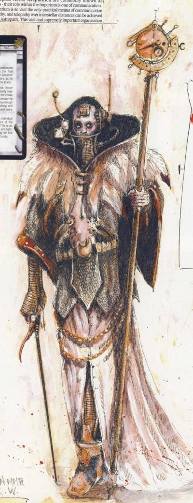

# 0169 星语者 Astropath

精校状态：中文行文已逐段精校，部分术语仍为暂定

分类：通用概念 / 帝国 Imperium / 中央政务部 Adeptus Terra / 星语庭 Adeptus Astra Telepathica

原文来源：https://www.bilibili.com/opus/1056407769834323972

原作者：帝国神选罐头

原文时间：编辑于 2026年07月05日 17:57

[返回分类目录](目录.md) · [全书目录](../../目录.md)

<!-- A0169-B0001 -->
**英文原文**

An Astropath (portmanteau of "astro" and "telepath") is a specially-trained psychic servant of the Imperium belonging to the Adeptus Astra Telepathica. Capable of sending and receiving psychic messages across interstellar space, they form the Imperium's vast communications network, and are vital for keeping its widely scattered worlds connected.

<!-- /A0169-B0001 -->

<!-- A0169-B0002 -->

原译文

星语者（“天体”和“精神感应”的合成词）是属于星语庭的帝国经过特殊训练的灵能仆人。他们能够在星际空间发送和接收灵能信息，构成了帝国庞大的通信网络，对于保持其广泛分散的世界的连接至关重要。

**校订译文**

星语者是隶属星语庭、受过专门训练的帝国灵能人员。英文 Astropath 由 astro（星体）与 telepath（传心者）合成。他们能够跨越星际空间收发灵能讯息，构成帝国庞大的通信网络，使散布各处的世界保持联系。

<!-- /A0169-B0002 -->

<!-- A0169-B0003 图片 -->

<!-- A0169-B0004 -->

原译文

Astropath 星语者

**校订译文**

Astropath 星语者

<!-- /A0169-B0004 -->

<!-- A0169-B0005 -->
## History 历史

<!-- /A0169-B0005 -->

<!-- A0169-B0006 -->
**英文原文**

The history of the Astropaths has been filled with strife.

<!-- /A0169-B0006 -->

<!-- A0169-B0007 -->

原译文

星语者的历史充满了冲突。

**校订译文**

星语者的历史充满了冲突。

<!-- /A0169-B0007 -->

<!-- A0169-B0008 -->
**英文原文**

In 888.M32 an event known as the Astropath Wars took place.

<!-- /A0169-B0008 -->

<!-- A0169-B0009 -->

原译文

888.M32发生了一场被称为星语战争的事件。

**校订译文**

888.M32发生了一场被称为星语战争的事件。

<!-- /A0169-B0009 -->

<!-- A0169-B0010 -->
**英文原文**

In 401.M34 an event known as The Howling killed over a billion Astropaths.

<!-- /A0169-B0010 -->

<!-- A0169-B0011 -->

原译文

401.M34，一场名为嚎叫的事件导致超过十亿名星语者死亡。

**校订译文**

401.M34，一场名为嚎叫的事件导致超过十亿名星语者死亡。

<!-- /A0169-B0011 -->

<!-- A0169-B0012 -->
**英文原文**

In 777.M41, arcane divinations of Astropaths of House Locus allowed the Ordo Malleus to locate the Daemon World Goreswirl located deep within the Eye of Terror. This led to a Grey Knights Strike Cruiser being dispatched to eliminate the Daemon Prince Bloodthunderer where a contingent of Grey Knights manage to reach the planetary surface in order to battle the various daemonic inhabitants.

<!-- /A0169-B0012 -->

<!-- A0169-B0013 -->

原译文

777.M41，洛库斯家族星语者那些神秘的占卜，使得圣锤修会得以定位到位于恐惧之眼深处的恶魔世界流血旋涡。这导致了一艘灰骑士打击巡洋舰被派遣去消灭恶魔王子血雷神，在那里，一支灰骑士分遣队设法到达行星表面，与各种恶魔作战。

**校订译文**

777.M41，洛库斯家族星语者的神秘占卜，使恶魔审判庭定位了恐惧之眼深处的恶魔世界血涡。一艘灰骑士打击巡洋舰随即奉命前去消灭恶魔亲王血雷者；灰骑士分遣队成功抵达地表，与当地各类恶魔交战。

<!-- /A0169-B0013 -->

<!-- A0169-B0014 -->
**英文原文**

In 999.M41 a mysterious, massive signal pleading for help from Segmentum Pacificus wiped out numerous Astropathic Choirs.

<!-- /A0169-B0014 -->

<!-- A0169-B0015 -->

原译文

999.M41年，一个神秘的、巨大的信号，恳求太平星域的帮助，消灭了无数的星语唱诗班。

**校订译文**

999.M41，一道来自太平星域、神秘而强大的求救信号摧毁了许多星语唱诗团。

<!-- /A0169-B0015 -->

<!-- A0169-B0016 -->
**英文原文**

At the end of the 41st Millennium, the Noctis Aeterna temporarily severed Astropathic communication and saw enormous numbers of Astropaths die or be consumed by madness.

<!-- /A0169-B0016 -->

<!-- A0169-B0017 -->

原译文

在第41个千年结束时，永恒之夜暂时切断了星语通信，大量星语者死亡或被疯狂吞噬。Astropaths are psykers collected by the Imperium's Blackships, whose powers are considerable, but who lack the mental strength to resist the dangers of the Warp.星语者是帝国黑船收集的灵能者，他们的力量相当可观，但缺乏抵抗亚空间危险的精神力量。They are trained at the Adeptus Astra Telepathica, where they undergo years of training (taught how to use the Emperor's Tarot, how to cast horoscopes, and the practices of cheiromancy and augury of all kinds) and extensive indoctrination. At the end of this period, they undergo a techno-arcane ritual, known as Soul Binding. They prepare for months, fasting and praying; then they are brought a hundred at a time in procession to the Emperor's Palace and the ritual takes place: they kneel before the Emperor and he himself (being the only psyker powerful enough to complete such a task) reshapes their very minds.他们在星语庭接受训练，在那里他们接受了多年的训练（教授如何使用帝皇塔罗牌，如何投射星象，以及各种手相术和占卜的联系）和广泛的灌输。在这一时期结束时，他们会经历一种被称为灵魂结合的技术奥秘仪式。他们做几个月准备，禁食祈祷；然后，他们一次一百人的被带到帝皇的宫殿并开始仪式：他们在帝皇面前跪下，他自己（是唯一一个有能力完成这项任务的灵能者）重塑了他们的心灵。

**校订译文**

第41千年末，永恒之夜暂时切断星语通信，大量星语者死亡或陷入疯狂。

Astropaths are psykers collected by the Imperium's Blackships, whose powers are considerable, but who lack the mental strength to resist the dangers of the Warp.

星语者来自帝国黑船收集的灵能者。他们力量可观，却缺乏足够坚韧的心智，无法独力抵抗亚空间危险。

They are trained at the Adeptus Astra Telepathica, where they undergo years of training (taught how to use the Emperor's Tarot, how to cast horoscopes, and the practices of cheiromancy and augury of all kinds) and extensive indoctrination. At the end of this period, they undergo a techno-arcane ritual, known as Soul Binding. They prepare for months, fasting and praying; then they are brought a hundred at a time in procession to the Emperor's Palace and the ritual takes place: they kneel before the Emperor and he himself (being the only psyker powerful enough to complete such a task) reshapes their very minds.

他们在星语庭接受多年训练与严格教化，学习帝皇塔罗牌、星盘推算、手相术及各种占卜方法。最后须接受称为灵魂结合的技术秘仪。他们先花数月斋戒祈祷，再每批一百人列队进入皇宫，跪在帝皇面前。只有帝皇具备完成此事的力量，由祂亲自重塑他们的心智。

<!-- /A0169-B0017 -->

<!-- A0169-B0018 图片 -->

<!-- A0169-B0019 -->

原译文

Astropath 星语者

**校订译文**

Astropath 星语者

<!-- /A0169-B0019 -->

<!-- A0169-B0020 -->
**英文原文**

On one side, Soul Binding shapes their powers, allowing them to safely interact with the Warp and to broadcast messages through it and preventing them from being tainted by the Warp: they resist easier than other psykers to daemonic possession and daemons' powers and they are even less prone to the Perils of the Warp. In fact, after the ritual they are linked to the Emperor and their new abilities are a result of the combination of their powers with a fraction of the Emperor's.

<!-- /A0169-B0020 -->

<!-- A0169-B0021 -->

原译文

一方面，灵魂结合塑造了他们的力量，使他们能够安全地与亚空间互动，并通过亚空间传播信息，防止他们被亚空间污染：他们比其他灵能者更容易抵抗恶魔的占据和力量，他们更不容易受到亚空间的危险。事实上，在仪式之后，他们与帝皇链接在一起，他们的新能力是他们的力量与帝皇的一小部分力量相结合的结果。

**校订译文**

一方面，灵魂结合塑造星语者的力量，让他们能较安全地接触亚空间、借其传讯，并增强抵御污染的能力。他们比其他灵能者更能抵抗恶魔附身与力量，也较少遭遇亚空间反噬。这是因为仪式将他们与帝皇相联，使自身灵能融入祂的一小部分力量。

<!-- /A0169-B0021 -->

<!-- A0169-B0022 -->
**英文原文**

On the other side, Soul Binding is not an absolutely safe measure, so Astropaths still face the risk of succumbing to daemons. In addition, during the ritual they must endure several hours of agony, resulting in real trauma. In general, all have their personalities altered to some extent. Touching the mind of the God-Emperor himself is also such an intense sensory experience that it completely overloads their sensory organs, to the point that some of the Astropaths are killed or driven insane during the process. Those who survive are permanently blinded and most of them even suffer from nerve damage, which results in a loss of smell, touch or hearing. Although blinded, Astropaths make up for their sensory lacks with the help of their psychic abilities: they develop a sort of "near-sense", which means that few of them choose to have mechanical eyes implanted

<!-- /A0169-B0022 -->

<!-- A0169-B0023 -->

原译文

另一方面，灵魂结合并不是一种绝对安全的措施，所以星语者仍然面临着屈服于恶魔的风险。此外，在仪式中，他们必须忍受几个小时的痛苦，导致真正的精神创伤。总的来说，所有人的性格都在一定程度上发生了变化。触摸神皇本人的心灵也是一种强烈的感官体验，它完全超载了他们的感官，以至于一些星语者在这个过程中被杀死或精神错乱。那些幸存下来的人会永久失明，他们中的大多数甚至会遭受神经损伤，导致嗅觉、触觉或听力丧失。虽然失明，但星语者在灵能能力的帮助下弥补了他们的感官缺陷：他们发展出一种“近感”，这意味着他们中很少有人选择植入机械眼

**校订译文**

另一方面，灵魂结合并不能确保安全，星语者仍可能屈服于恶魔。仪式持续数小时，造成剧烈痛苦与深刻创伤，几乎所有人的性格都会改变。接触神皇心智的体验强烈到足以使感官彻底过载，有人在过程中死去或疯狂。幸存者永久失明，多数还因神经损伤失去嗅觉、触觉或听觉。但他们会发展出一种灵能“近感”，弥补感官缺失，因此很少选择植入机械眼。

<!-- /A0169-B0023 -->

<!-- A0169-B0024 -->
## Psychic abilities 灵能能力

<!-- /A0169-B0024 -->

<!-- A0169-B0025 -->
**英文原文**

Although Psychic powers are in fact limitless, Astropaths usually develop some techniques along three major disciplines: telepathy, divination and telekinesis.

<!-- /A0169-B0025 -->

<!-- A0169-B0026 -->

原译文

尽管灵能力量实际上是无限的，但星语者通常会沿着三个主要学派发展一些技术：传心系、预言系和念动系。

**校订译文**

尽管灵能力量实际上是无限的，但星语者通常会沿着三个主要学派发展一些技术：传心系、预言系和念动系。

<!-- /A0169-B0026 -->

<!-- A0169-B0027 -->
**英文原文**

Telepathy is the art of mental communication and influence and is the most important power possessed by Astropaths. With telepathy one can contact any other mind in order to provide it with information; it can be used as a mere mean of communication, or as a form of domination and control.

<!-- /A0169-B0027 -->

<!-- A0169-B0028 -->

原译文

传心系是一种精神交流和影响的艺术，是星语者所拥有的最重要的力量。通过心灵感应，人们可以联系任何其他心灵，为其提供信息；它可以仅仅作为一种交流手段，也可以作为一种统御和控制的形式。

**校订译文**

传心系是一种精神交流和影响的艺术，是星语者所拥有的最重要的力量。通过心灵感应，人们可以联系任何其他心灵，为其提供信息；它可以仅仅作为一种交流手段，也可以作为一种统御和控制的形式。

<!-- /A0169-B0028 -->

<!-- A0169-B0029 -->
**英文原文**

Divination deals with time flow. With it, a psyker can retrieve information thanks to a thorough reading of the traces people and their actions leave in the Warp. It can be used to perceive someone's personality and goals or to collect hints to be interpreted about future, present and past events. To put these powers into action, the most widely used medium is the Emperor's Tarot; instead, some psykers indulge in more barbaric rituals, such as reading the entrails or casting bones.

<!-- /A0169-B0029 -->

<!-- A0169-B0030 -->

原译文

预言系涉及时间流。有了它，灵能者可以通过彻底读取人们及其行动在亚空间中留下的痕迹来检索信息。它可以用来感知某人的个性和目标，或者收集关于未来、现在和过去事件的提示。为了将这些力量付诸行动，最广泛使用的媒介是帝皇塔罗牌；相反，一些灵能者沉迷于更野蛮的仪式，比如阅读内脏或铸造骨头。

**校订译文**

预言系涉及时间流动。灵能者仔细解读人物及其行动在亚空间留下的痕迹，从中获取信息，窥见其性格、目标，或收集过去、现在与未来事件的线索。帝皇塔罗牌是最常用的施术媒介，也有人采用更野蛮的仪式，如察看内脏、抛骨占卜。

<!-- /A0169-B0030 -->

<!-- A0169-B0031 -->
**英文原文**

Telekinesis makes a tool out of a mind and turns thoughts into force. The forces produced in such a way by the psyker can be used to lift and move objects (weight, speed and precision depending on psyker's abilities and techniques), to protect from attacks or even to deal damage.

<!-- /A0169-B0031 -->

<!-- A0169-B0032 -->

原译文

念动系使思想成为一种工具，并将想法转化为力量。灵能者以这种方式产生的力可用于提升和移动物体（重量、速度和精度取决于灵能者的能力和技术），以防护攻击甚至造成伤害。Astral Telepathy 星语感应Astropaths' long-range communication ability (astro-telecommunication) is superior to that of common telepaths. In fact, after Soul Binding Astropaths are able to use the whole Warp as a medium and communicate with others of their kin, being in fact the only psykers capable of doing so. The whole process of sending and receiving messages cannot be done instantly, but requires concentration, meditation and freedom from distraction: a message can take up to five hours to be sent at an interstellar distance. In order to prevent the Warp from changing or damaging data, messages are quantified and encrypted during sending; however, even if precautions are taken, messages still suffer from disturbances.星语者的远程通信能力（星语通信）优于普通心灵感应者。事实上，在灵魂结合之后，星语者能够使用整个亚空间作为媒介并与他们的同类进行交流，实际上是唯一能够这样做的灵能者。发送和接收信息的整个过程不能立即完成，但需要集中注意力、冥想和专心：在星际距离发送信息可能需要长达五个小时。为了防止亚空间更改或损坏数据，在发送过程中对消息进行量化和加密；然而，即使采取了预防措施，信息仍然会受到干扰。A message travels through the Warp in a time whose length depends on target's distance: messages sent to targets belonging to the same orbit are received instantly, while Astropaths in the same system or in a nearby one are reached in minutes; on the other hand, communications between Subsectors require hours, those between Sectors take weeks, and inter-Segmentum messages reach their destination in months.信息在一段时间内通过亚空间，其长度取决于目标的距离：发送给属于同一轨道的目标的信息会立即被接收，而同一星系或附近星系中的星语会在几分钟内到达；另一方面，分区之间的通信需要数小时，星区之间的需要数周，而星域间消息需要数月才能到达目的地。In order to enhance their own chances of sending messages in a fast and secure way, Astropaths form Astropathic Choirs - a method established during the Forging. In a Choir, each chorister lends a fraction of his or her power to the choir which it is used like a wave to buoy the message into the warp. In this way, even Astropaths that are not strong enough to achieve a communication alone can prove useful if gathered together; it is, however, known that weaker Astropaths participating a Choir are exposed to a higher risk of Warp perils. Astropathic Choirs are commonly found in Astropathic Relays, a kind of techno-arcane installation placed on major vessels or stars: they are facilities conceived to aid and boost Astropaths' powers. Relays are usually equipped with improved detection devices (i.e. Dispersal Scoops) and Warp protection devices (i.e. Hexagrammatic Wardings).为了提高他们自己以快速和安全的方式发送信息的机会，星语者组建了星语合唱诗班 — 这是在锻造中建立的一种方法。在唱诗班中，每个唱诗班成员都会将他或她的一小部分力量给唱诗班，就像波浪一样，将信息传递到亚空间中。通过这样，即使是不足以单独实现通信的星语者，如果聚集在一起，也可以证明是有用的；然而，众所周知，参加唱诗班的较弱的星语者面临更高的亚空间危险风险。星语中继器通常出现在星语唱诗班中，这是一种放置在主要战舰或行星上的技术奥秘装置：它们是旨在帮助和增强星语者力量的设施。中继器通常配备有改进的检测装置（即分散铲）和亚空间保护装置（即六芒防护）。The Imperium stands as a coherent entity thanks to Astropath networks; their availability is thus vital for any activity that requires communication and coordination - be it an administrative issue or a military one. So, the Imperium has a great demand for Astropaths and they can be found nearly everywhere. Being the most important ones, they account for the vast majority (over 90%) of psykers who serve the Imperium.由于星语网络，帝国成为一个连贯的实体；因此，他们有效性对于任何需要沟通和协调的活动都至关重要，无论是行政问题还是军事问题。因此，帝国对星语者有很大的需求，他们几乎可以在任何地方找到。作为最重要的，他们占为帝国服务的灵能者的绝大多数（超过90%）。Those rare individuals who climb the ranks of the Adeptus Astra Telepathica are placed in charge of Astropathic facilities and choirs. Some are even made itinerant emissaries, officials of their Adeptus or servants of the Inquisition, Imperial Guard or Imperial Navy. Astropaths are also prized by Rogue Traders, since they are capable not only of sending messages at great distances, but also getting in touch with Xenos; serving Rogue Traders, Astropaths' responsibilities are even higher, because they are often no more than a handful in a fleet - possibly one for each vessel.那些罕见的攀登星语庭的等级的人被任命为星语设施和唱诗班的负责人。有些人甚至被任命为巡回密使、审判庭、帝国卫队或帝国海军部门的官员或仆人。星语者也受到行商浪人的珍视，因为它们不仅能够远距离发送信息，还能与异型取得联系；为行商浪人服务，星语者的责任甚至更高，因为他们通常只不过是舰队中的少数人 — 可能每艘船一个。An Astropath's uniform is a hooded robe or habit and a waist-belt. They keep their personal belongings in a sling bag, often adorned with religious motifs. Green (or any variation of it) is the colour that symbolises the appartenance to the Astropath status. Despite this, other colours have been known, such as the orange-red robes of Alen the Seer.星语者的制服是连帽长袍或长袍和腰带。他们把个人物品放在一个吊带包里，通常装饰着宗教图案。绿色（或其任何变体）是象征星语者从属的颜色。尽管如此，人们还知道其他颜色，比如先知艾伦的橙红色长袍。As a result of the Soul Binding ritual, Astropaths are, as a rule, blind. Their blindness can affect their eyes in different ways, from disturbing whitened globes to scarred empty eye sockets. Some Astropaths without eyes use dark plasflex hemispheres to cover their empty eye sockets.作为灵魂结合仪式的结果，星语者通常是盲的。他们的失明会以不同的方式影响他们的眼睛，从令人不安的白色眼球到伤痕累累的空眼眶。一些没有眼睛的星语者使用深色的塑料柔性半球体来覆盖他们的空眼窝。Even if they endure Warp risks thanks to the Soul Binding ritual, Astropaths are often taken to madness since they are over-exposed to gruesome visions and haunted by eerie presages about the future, so they appear as tormented wretches on the verge of doom.即使他们因为灵魂结合仪式而忍受了亚空间的风险，星语者也经常被带到疯狂的境地，因为他们过度暴露在可怕的幻觉中，并被关于未来的可怕预兆所困扰，所以他们看起来像是处于厄运边缘的受折磨的可怜虫。

**校订译文**

念动系将心智化为工具、思想化为力量，用于抬起和移动物体、抵御攻击，乃至伤害敌人。能移动的重量、速度与精度，取决于施术者的能力和技巧。

Astral Telepathy 星语感应

Astropaths' long-range communication ability (astro-telecommunication) is superior to that of common telepaths. In fact, after Soul Binding Astropaths are able to use the whole Warp as a medium and communicate with others of their kin, being in fact the only psykers capable of doing so. The whole process of sending and receiving messages cannot be done instantly, but requires concentration, meditation and freedom from distraction: a message can take up to five hours to be sent at an interstellar distance. In order to prevent the Warp from changing or damaging data, messages are quantified and encrypted during sending; however, even if precautions are taken, messages still suffer from disturbances.

星语者的远程星语通信强于普通传心者。灵魂结合后，他们可以将整个亚空间作为媒介，与同类交流，是唯一能够如此通信的灵能者。收发过程无法瞬间完成，必须专注、冥思、不受干扰；向星际距离外发出一则讯息，可能需要长达五小时。讯息发送时须量化、加密，以免亚空间篡改或破坏内容，但即便采取预防措施，仍会受到干扰。

A message travels through the Warp in a time whose length depends on target's distance: messages sent to targets belonging to the same orbit are received instantly, while Astropaths in the same system or in a nearby one are reached in minutes; on the other hand, communications between Subsectors require hours, those between Sectors take weeks, and inter-Segmentum messages reach their destination in months.

讯息在亚空间中的传播时间取决于距离。同一轨道内可即时收到，同一恒星系或邻近恒星系通常需数分钟；次星区之间需数小时，星区之间需数周，跨星域通信则可能数月才抵达。

In order to enhance their own chances of sending messages in a fast and secure way, Astropaths form Astropathic Choirs - a method established during the Forging. In a Choir, each chorister lends a fraction of his or her power to the choir which it is used like a wave to buoy the message into the warp. In this way, even Astropaths that are not strong enough to achieve a communication alone can prove useful if gathered together; it is, however, known that weaker Astropaths participating a Choir are exposed to a higher risk of Warp perils. Astropathic Choirs are commonly found in Astropathic Relays, a kind of techno-arcane installation placed on major vessels or stars: they are facilities conceived to aid and boost Astropaths' powers. Relays are usually equipped with improved detection devices (i.e. Dispersal Scoops) and Warp protection devices (i.e. Hexagrammatic Wardings).

为提高快速、安全送达讯息的机会，星语者组成星语唱诗团，这一方法创立于锻造时代。各成员贡献一部分力量，如波浪般托起讯息，送入亚空间。因此，单独无法完成通信的弱小星语者，也能通过合力发挥作用，但他们在合唱中遭遇亚空间危险的风险更高。唱诗团通常驻于星语中继站，即设置在大型船舰或星体上的技术秘仪设施，用以辅助、增强星语者力量。中继站常配强化探测装置，如扩散收集器，以及六芒防护等亚空间防护装置。

The Imperium stands as a coherent entity thanks to Astropath networks; their availability is thus vital for any activity that requires communication and coordination - be it an administrative issue or a military one. So, the Imperium has a great demand for Astropaths and they can be found nearly everywhere. Being the most important ones, they account for the vast majority (over 90%) of psykers who serve the Imperium.

星语网络使帝国得以维持为一个整体。一切需要通信与协调的行政、军事活动都离不开它，因此帝国对星语者需求极大，他们几乎无处不在。按本条数字，他们占为帝国效力的灵能者总数九成以上。

Those rare individuals who climb the ranks of the Adeptus Astra Telepathica are placed in charge of Astropathic facilities and choirs. Some are even made itinerant emissaries, officials of their Adeptus or servants of the Inquisition, Imperial Guard or Imperial Navy. Astropaths are also prized by Rogue Traders, since they are capable not only of sending messages at great distances, but also getting in touch with Xenos; serving Rogue Traders, Astropaths' responsibilities are even higher, because they are often no more than a handful in a fleet - possibly one for each vessel.

少数在星语庭晋升者会掌管星语设施与唱诗团；有些担任巡回使节、星语庭官员，或为审判庭、帝国卫队、帝国海军服务。行商浪人也珍视星语者，因为他们既能远距传讯，也能与异形沟通。在行商浪人麾下，星语者责任尤其重大：一支舰队通常只有寥寥数人，可能每舰仅一人。

An Astropath's uniform is a hooded robe or habit and a waist-belt. They keep their personal belongings in a sling bag, often adorned with religious motifs. Green (or any variation of it) is the colour that symbolises the appartenance to the Astropath status. Despite this, other colours have been known, such as the orange-red robes of Alen the Seer.

星语者穿连帽长袍或修士袍，系腰带，以常饰宗教图案的挎包收纳私人物品。绿色及其变色象征星语者身份，但也有其他衣色，例如先知艾伦的橙红长袍。

As a result of the Soul Binding ritual, Astropaths are, as a rule, blind. Their blindness can affect their eyes in different ways, from disturbing whitened globes to scarred empty eye sockets. Some Astropaths without eyes use dark plasflex hemispheres to cover their empty eye sockets.

灵魂结合通常使星语者失明。眼部后果各异，从骇人的发白眼球，到布满疤痕的空眼窝都有；有些失去眼睛者用深色柔塑半球罩遮住眼窝。

Even if they endure Warp risks thanks to the Soul Binding ritual, Astropaths are often taken to madness since they are over-exposed to gruesome visions and haunted by eerie presages about the future, so they appear as tormented wretches on the verge of doom.

即使灵魂结合帮助他们承受亚空间危险，星语者仍常因目睹过多可怖景象、受未来凶兆纠缠而疯狂。他们因此看上去像饱受折磨、徘徊于毁灭边缘的可怜人。

**校注：** 原英文 stars 直译恒星，与常见中继站部署语境有疑点，暂以星体表述并保留英文。发送需五小时与传播跨星域需数月是不同阶段，未将两者合并成同一个耗时。For­ging 指历史锻造时代，不是制造工序。

<!-- /A0169-B0032 -->

<!-- A0169-B0033 -->

原译文

Alen the Seer 先知艾伦

**校订译文**

Alen the Seer 先知艾伦

<!-- /A0169-B0033 -->

<!-- A0169-B0034 -->
**英文原文**

Cistar — assigned to the Iron Hands. M31.

<!-- /A0169-B0034 -->

<!-- A0169-B0035 -->

原译文

西斯塔 — 分配给钢铁之手。M31。

**校订译文**

西斯塔 — 分配给钢铁之手。M31。

<!-- /A0169-B0035 -->

<!-- A0169-B0036 -->
**英文原文**

Lady Evida Kilnestriskiya — served the Imperial Fists during the Great Crusade.

<!-- /A0169-B0036 -->

<!-- A0169-B0037 -->

原译文

埃维达·基尔内斯特里基亚女士 — 在大远征期间为帝国之拳服务。

**校订译文**

埃维达·基尔内斯特里基亚女士 — 在大远征期间为帝国之拳服务。

<!-- /A0169-B0037 -->

<!-- A0169-B0038 -->
**英文原文**

Gartrafal — died in 633.M41.

<!-- /A0169-B0038 -->

<!-- A0169-B0039 -->

原译文

加特拉法尔 — 死于633.M41。

**校订译文**

加特拉法尔 — 死于633.M41。

<!-- /A0169-B0039 -->

<!-- A0169-B0040 -->
**英文原文**

Gulbrecht — Astropath-Terminus. M41.

<!-- /A0169-B0040 -->

<!-- A0169-B0041 -->

原译文

古勒布雷赫特 — 终点星语者。M41。

**校订译文**

古勒布雷赫特 — 终点星语者。M41。

<!-- /A0169-B0041 -->

<!-- A0169-B0042 -->
**英文原文**

Helicta Chemin — serves the Imperial Fists. M42.

<!-- /A0169-B0042 -->

<!-- A0169-B0043 -->

原译文

赫利克塔·舍曼 — 为帝国之拳服务。M42。

**校订译文**

赫利克塔·舍曼 — 为帝国之拳服务。M42。

<!-- /A0169-B0043 -->

<!-- A0169-B0044 -->
**英文原文**

Icthyad — Astropath Secundus.

<!-- /A0169-B0044 -->

<!-- A0169-B0045 -->

原译文

伊克西亚德 — 次席星语者

**校订译文**

伊克西亚德 — 次席星语者

<!-- /A0169-B0045 -->

<!-- A0169-B0046 -->
**英文原文**

Illiyan Nastase — a half-Human, half-Eldar Imperial Astropath who was stationed with the Ultramarines

<!-- /A0169-B0046 -->

<!-- A0169-B0047 -->

原译文

伊利扬·纳斯塔斯 — 一个半人半灵族帝国星语者，驻扎在极限战士

**校订译文**

伊利扬·纳斯塔斯——具有人类与灵族混合血统的帝国星语者，曾派驻极限战士。

**校注：** 此条反映旧版人物设定，保留混血星语者身份；不凭其他版本中的同名人物改写。

<!-- /A0169-B0047 -->

<!-- A0169-B0048 -->
**英文原文**

Ing Mae Sing — 63rd Expeditionary Fleet, died in M31.

<!-- /A0169-B0048 -->

<!-- A0169-B0049 -->

原译文

英梅辛 — 第63远征舰队，死于M31。

**校订译文**

英梅辛 — 第63远征舰队，死于M31。

<!-- /A0169-B0049 -->

<!-- A0169-B0050 -->
**英文原文**

Jarron Leeter — Master of Astropaths of the Blood Angels in late M41

<!-- /A0169-B0050 -->

<!-- A0169-B0051 -->

原译文

贾伦·利特 — M41晚期圣血天使星语者大师

**校订译文**

贾伦·利特 — M41晚期圣血天使星语者大师

<!-- /A0169-B0051 -->

<!-- A0169-B0052 -->
**英文原文**

Jessiah — Astropath-Terminus, active in M39

<!-- /A0169-B0052 -->

<!-- A0169-B0053 -->

原译文

杰赛亚 — 终点星语者，在M39活动

**校订译文**

杰赛亚 — 终点星语者，在M39活动

<!-- /A0169-B0053 -->

<!-- A0169-B0054 -->

原译文

Kai Zulane 凯·祖兰

**校订译文**

Kai Zulane 凯·祖兰

<!-- /A0169-B0054 -->

<!-- A0169-B0055 -->
**英文原文**

Karaldi — Adept, served on the Rogue Trader Cruiser Oceanid

<!-- /A0169-B0055 -->

<!-- A0169-B0056 -->

原译文

卡拉尔迪 — 专家，曾服役于行商浪人巡洋舰俄刻阿尼得斯号

**校订译文**

卡拉尔迪 — 专家，曾服役于行商浪人巡洋舰俄刻阿尼得斯号

<!-- /A0169-B0056 -->

<!-- A0169-B0057 -->
**英文原文**

Karisan — Master, served on the Rogue Trader Cruiser Oceanid

<!-- /A0169-B0057 -->

<!-- A0169-B0058 -->

原译文

卡里桑 — 大师，曾服役于行商浪人巡洋舰俄刻阿尼得斯号

**校订译文**

卡里桑 — 大师，曾服役于行商浪人巡洋舰俄刻阿尼得斯号

<!-- /A0169-B0058 -->

<!-- A0169-B0059 -->
**英文原文**

Magwen — Astropath Prime

<!-- /A0169-B0059 -->

<!-- A0169-B0060 -->

原译文

马格温 — 首席星语者

**校订译文**

马格温 — 首席星语者

<!-- /A0169-B0060 -->

<!-- A0169-B0061 -->
**英文原文**

Mastraen — Astropath Prime

<!-- /A0169-B0061 -->

<!-- A0169-B0062 -->

原译文

马斯特伦 — 首席星语者

**校订译文**

马斯特伦 — 首席星语者

<!-- /A0169-B0062 -->

<!-- A0169-B0063 -->

原译文

Nemo Zhi-Meng 尼莫·志-明

**校订译文**

Nemo Zhi-Meng 尼莫·志梦

**校注：** Zhi-Meng 原译志明将 Meng 写为 Ming 的常见中文对应，现暂音译志梦；汉字原名尚无官方证据。

<!-- /A0169-B0063 -->

<!-- A0169-B0064 -->
**英文原文**

Seth — served on the Rogue Trader Cruiser Fairlight

<!-- /A0169-B0064 -->

<!-- A0169-B0065 -->

原译文

赛斯 — 曾在行商浪人巡洋舰公平之光号上服役

**校订译文**

赛斯 — 曾在行商浪人巡洋舰公平之光号上服役

<!-- /A0169-B0065 -->

<!-- A0169-B0066 -->
**英文原文**

Thervillion VanShen — Master Astropath

<!-- /A0169-B0066 -->

<!-- A0169-B0067 -->

原译文

瑟维利恩·万慎 — 星语者大师

**校订译文**

瑟维利恩·万慎 — 星语者大师

<!-- /A0169-B0067 -->

<!-- A0169-B0068 -->
**英文原文**

Valle — active during the Kalidar War

<!-- /A0169-B0068 -->

<!-- A0169-B0069 -->

原译文

瓦莱 — 活跃于卡利达战争期间

**校订译文**

瓦莱 — 活跃于卡利达战争期间

<!-- /A0169-B0069 -->

<!-- A0169-B0070 -->
**英文原文**

Varrus — assigned to Watch Station Arkhas in the Jericho Reach

<!-- /A0169-B0070 -->

<!-- A0169-B0071 -->

原译文

瓦鲁斯 — 被派往杰里科河段的阿卡斯观察站

**校订译文**

瓦鲁斯——派驻杰里科疆域的阿卡斯守望站。

<!-- /A0169-B0071 -->

<!-- A0169-B0072 -->

原译文

Volquan Sark 沃尔泉·萨克

**校订译文**

Volquan Sark 沃尔泉·萨克

<!-- /A0169-B0072 -->

<!-- A0169-B0073 -->

原译文

Yerl 耶尔

**校订译文**

Yerl 耶尔

<!-- /A0169-B0073 -->

<!-- A0169-B0074 -->
**英文原文**

Zarneck — part of the retinue of Inquisitor Solomon Lok and transmitted the log to Lord Varius, Lok's superior

<!-- /A0169-B0074 -->

<!-- A0169-B0075 -->

原译文

扎内克 — 是审判官所罗门·洛克的随从，将日志传送给了洛克的上级 — 瓦里乌斯领主。

**校订译文**

扎内克 — 是审判官所罗门·洛克的随从，将日志传送给了洛克的上级 — 瓦里乌斯领主。

<!-- /A0169-B0075 -->

本篇核心术语与暂定项

以下列出本篇出现的英文原形及核心术语表用词。同形词可能指不同对象，具体词义以本篇正文和校注为准；单复数、别名和仅见于图注的名称可能尚未列入。完整候选见[术语表](../../术语表/双语术语候选.csv)。

| 英文 | 采用中文 | 状态 |
| --- | --- | --- |
| Blood Angels | 圣血天使 | 官方已核对 |
| Grey Knights | 灰骑士 | 官方已核对 |
| Eldar | 灵族 | 暂定·语境区分 |
| Psyker | 灵能者 | 官方已核对 |
| Astropath | 星语者 | 官方已核对 |
| Divination | 预知学派 | 官方已核对 |
| Telekinesis | 念动学派 | 官方已核对 |
| Telepathy | 感应学派 | 官方已核对 |
| Ultramarines | 极限战士 | 官方已核对 |
| Adeptus Astra Telepathica | 星语庭 | 暂定 |
| Warp | 亚空间 | 官方已核对 |
| Inquisitor | 审判官 | 官方已核对 |
| Imperium | 帝国 | 暂定·简称 |
| Emperor's Tarot | 帝皇塔罗牌 | 暂定 |
| History | 历史 | 编辑用语已统一 |
| Eye of Terror | 恐惧之眼 | 官方已核对 |
| Rogue Trader | 行商浪人 | 暂定 |
| Ordo Malleus | 恶魔审判庭 | 用户指定 |
| Imperial Fists | 帝国之拳 | 暂定 |
| Emperor | 帝皇 | 官方已核对 |
| Daemon Prince | 恶魔亲王 | 官方已核对 |
| Great Crusade | 大远征 | 暂定·官方待核 |
| Iron Hands | 钢铁之手 | 暂定·官方待核 |
| Segmentum Pacificus | 太平星域 | 暂定·官方待核 |
| Segmentum | 星域 | 暂定·官方待核 |
| Master | 导师（审判庭职衔）／舰务官（舰员职务） | 语境定译·官方待核 |
| Adept | 帝国任职者（广义）／文吏（行政语境） | 语境定译·官方待核 |
| Strike Cruiser | 打击巡洋舰 | 暂定·官方待核 |
| Powers | 能天使 | 暂定·官方待核 |
| Jericho Reach | 杰里科疆域 | 暂定·官方待核 |
| Locus | 基卫 | 官方已核对 |
| Terminus | 终点站 | 暂定·官方待核 |
| Goreswirl | 戈雷斯维尔 | 暂定·官方待核 |
| The Blood | 鲜血 | 暂定·官方待核 |
| Solomon Lok | 所罗门·洛克 | 暂定·官方待核 |
| Solomon | 所罗门 | 暂定·官方待核 |
| Noctis Aeterna | 永恒之夜 | 暂定·官方待核 |

