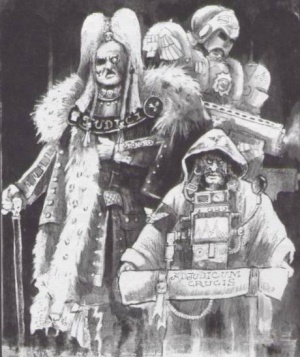
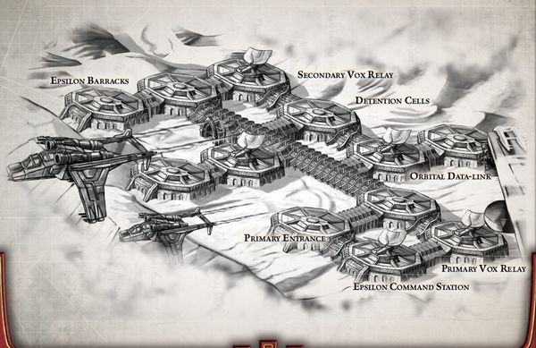
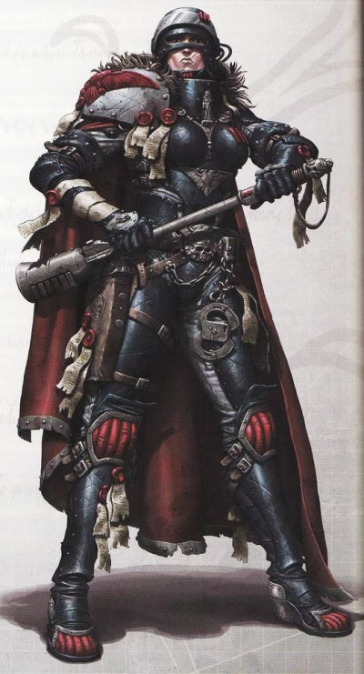

# 0170 法务部 Adeptus Arbites

精校状态：中文行文已逐段精校，部分术语仍为暂定

分类：通用概念 / 帝国 Imperium / 中央政务部 Adeptus Terra / 法务部 Adeptus Arbites

原文来源：https://www.bilibili.com/opus/1070767211298160679

原作者：帝国神选罐头

原文时间：2025年05月25日 12:03

[返回分类目录](目录.md) · [全书目录](../../目录.md)

<!-- A0170-B0001 -->
**英文原文**

The Adeptus Arbites are the police force of the Adeptus Terra, devoted to enforcing Imperial law throughout the entire Imperium. Utterly dedicated and without mercy, the Arbites are feared throughout the galaxy, for they are the agents of a harsh law, where failure and incompetence are crimes, and the only punishment is death. Arbites are empowered to act as judge, jury and executioner – citizens have no rights, and only members of the Priesthood of Terra or the Inquisition could claim anything so elaborate as a trial.

<!-- /A0170-B0001 -->

<!-- A0170-B0002 -->

原译文

法务部是中央政务部的警察部队，致力于在整个帝国执行帝国律法。法务部全心全意，毫不留情，在整个银河系都令人恐惧，因为他们是严酷律法的代理人，失败和无能是犯罪，唯一的惩罚是死刑。法务部有权作为法官、陪审员和处刑者 — 公民没有权利，只有泰拉祭司或审判庭的成员才能要求审判这样复杂的事情。

**校订译文**

法务部是中央政务部的警察力量，在整个帝国执行帝国律法。他们忠于职守、毫不容情，是银河各地畏惧的严法执行者：依这种法律，失败与无能皆可成罪，惩罚唯有死亡。法务部兼具法官、陪审者与行刑者的权力；普通公民没有权利，只有泰拉教士团或审判庭成员，才能要求正式审判这般繁复的程序。

**校注：** 原文以极端概述方式称唯一刑罚为死刑；其他篇章记述劳役等惩罚，不能据此抹去全书制度差异。

<!-- /A0170-B0002 -->

<!-- A0170-B0003 图片 -->

<!-- A0170-B0004 -->

原译文

Adeptus Arbites symbol 法务部标志

**校订译文**

Adeptus Arbites symbol 法务部标志

<!-- /A0170-B0004 -->

<!-- A0170-B0005 -->
**英文原文**

Parent Agency:Adeptus Terra

<!-- /A0170-B0005 -->

<!-- A0170-B0006 -->

原译文

隶属机构：中央政务部

**校订译文**

隶属机构：中央政务部

<!-- /A0170-B0006 -->

<!-- A0170-B0007 -->
**英文原文**

Headquarters:Hall of Judgement, Terra

<!-- /A0170-B0007 -->

<!-- A0170-B0008 -->

原译文

总部：审判大厅，泰拉

**校订译文**

总部：审判大厅，泰拉

<!-- /A0170-B0008 -->

<!-- A0170-B0009 -->
**英文原文**

Leader:Grand Provost Marshal

<!-- /A0170-B0009 -->

<!-- A0170-B0010 -->

原译文

领导者：宪兵大元帅

**校订译文**

领导者：宪兵大元帅

<!-- /A0170-B0010 -->

<!-- A0170-B0011 -->
**英文原文**

Military Forces:Arbitrators

<!-- /A0170-B0011 -->

<!-- A0170-B0012 -->

原译文

军事力量：仲裁员

**校订译文**

军事力量：仲裁官

<!-- /A0170-B0012 -->

<!-- A0170-B0013 -->
**英文原文**

Established:M30

<!-- /A0170-B0013 -->

<!-- A0170-B0014 -->

原译文

成立时间：M30

**校订译文**

成立时间：M30

<!-- /A0170-B0014 -->

<!-- A0170-B0015 -->
## History 历史

<!-- /A0170-B0015 -->

<!-- A0170-B0016 -->
**英文原文**

The Adeptus Arbites date from at least the Great Crusade, when compliant worlds had Lord Marshal's Offices installed to deal with 'non-local' matters. During the Horus Heresy, the Grand Provost Marshal of the Arbites was part of the War Council.

<!-- /A0170-B0016 -->

<!-- A0170-B0017 -->

原译文

法务部至少可以追溯到大远征时期，当时服从的世界设立了元帅领主办公室来处理“非本地”事务。在荷鲁斯叛乱时期，法务部的宪兵大元帅是战争议会的一员。

**校订译文**

法务部至少可追溯至大远征时期。归顺世界设立领主元帅署，处理超出本地范围的事务。荷鲁斯之乱时，宪兵大元帅还在战争议会中占有一席。

<!-- /A0170-B0017 -->

<!-- A0170-B0018 图片 -->

<!-- A0170-B0019 -->

原译文

Arbitrator 仲裁员

**校订译文**

Arbitrator 仲裁官

<!-- /A0170-B0019 -->

<!-- A0170-B0020 -->
**英文原文**

During the War of the Beast, the significant Arbites garrison on Terra saw heavy action against the Ork Attack Moon over the Throneworld. The Arbites took catastrophic losses in the failed Proletarian Crusade, and its surviving Terran contingent struggled to maintain order on Terra as upheavals caused by the Greenskin presence broke out.

<!-- /A0170-B0020 -->

<!-- A0170-B0021 -->

原译文

在野兽战争期间，泰拉上重要的法务部驻军看到了王座世界上空的欧克攻击月亮的激烈行动。法务部在失败的工人远征中遭受了灾难性的损失，随着绿皮的存在引发的动荡爆发，其幸存的泰拉分遣队努力维持地上的秩序。

**校订译文**

野兽战争期间，泰拉规模庞大的法务部驻军激烈对抗悬于王座世界上空的欧克攻击月亮。失败的平民远征令他们伤亡惨重；绿皮威胁引发各地动荡，幸存部队只能竭力维持泰拉秩序。

<!-- /A0170-B0021 -->

<!-- A0170-B0022 -->
**英文原文**

During the Age of Apostasy, the Adeptus Arbites fell under the control of Goge Vandire.

<!-- /A0170-B0022 -->

<!-- A0170-B0023 -->

原译文

在叛教时代，法务部落入高戈·范迪尔的控制之下。

**校订译文**

在叛教时代，法务部落入高戈·范迪尔的控制之下。

<!-- /A0170-B0023 -->

<!-- A0170-B0024 -->
**英文原文**

Following The Blackness, the Arbites struggled to contain the situation on Terra as Chaos Cults activated across the planet and billions more of starving and maddened citizens rioted. Ultimately, most of the Arbites stations were overrun as only the Imperial Palace complex remained secure. Order was eventually restored following the Battle of Lion's Gate and the arrival of Roboute Guilliman. The Arbites later aided Guilliman in his purge of Imperial bureaucracy that became known as the Primarch's Scourge.

<!-- /A0170-B0024 -->

<!-- A0170-B0025 -->

原译文

在至暗时刻之后，法务部努力控制泰拉上的局势，因为混沌邪教在全球各地活动，数十亿饥饿和疯狂的公民暴动。最终，由于只有皇宫建筑群仍然安全，大多数法务部据点都被占领了。在狮门之战和罗伯特·基里曼的到来之后，秩序最终得以恢复。法务部后来帮助基里曼肃清帝国官僚机构，即所谓的原体之灾。

**校订译文**

在至暗时刻之后，法务部努力控制泰拉上的局势，因为混沌邪教在全球各地活动，数十亿饥饿和疯狂的公民暴动。最终，由于只有皇宫建筑群仍然安全，大多数法务部据点都被占领了。在狮门之战和罗保特·基里曼的到来之后，秩序最终得以恢复。法务部后来帮助基里曼肃清帝国官僚机构，即所谓的原体之灾。

<!-- /A0170-B0025 -->

<!-- A0170-B0026 -->
## Overview 概述

<!-- /A0170-B0026 -->

<!-- A0170-B0027 -->
**英文原文**

The ends justifies the means.

<!-- /A0170-B0027 -->

<!-- A0170-B0028 -->

原译文

结果证明手段正当。

**校订译文**

结果证明手段正当。

<!-- /A0170-B0028 -->

<!-- A0170-B0029 -->
**英文原文**

High Justicar Prateus

<!-- /A0170-B0029 -->

<!-- A0170-B0030 -->

原译文

高级仲裁官普拉提乌斯

**校订译文**

高级仲裁官普拉提乌斯

<!-- /A0170-B0030 -->

<!-- A0170-B0031 -->
### Jurisdiction 管辖权

<!-- /A0170-B0031 -->

<!-- A0170-B0032 -->
**英文原文**

The Adeptus Arbites enforce the Lex Imperialis, embodied within the great Book of Judgement. Their organisation represents the soldiers and police of the Adeptus Terra. Each of the Imperium's worlds has its own government, laws, and its own local police forces to enforce those laws. The Arbites concern themselves only with the enforcement of the broader laws to which the entire Imperium is subject; the common duty of the Arbites is overseeing that the Governor of each world is regularly paying his planet's Tithe. In the event of a rogue Governor or a major revolt which threatens Imperial rule, the Arbites will brutally intervene to restore order, though a planetary coup headed up by someone who will fulfill their duties to the Imperium will merely be observed, as a successful revolt by such a one just means that a weak ruler has been replaced.

<!-- /A0170-B0032 -->

<!-- A0170-B0033 -->

原译文

法务部执行帝国律法，体现在伟大的审判之书中。他们的组织代表了中央政务部的士兵和警察。帝国的每个世界都有自己的政府、法律和自己的地方警察部队来执行这些法律。法务部只关心整个帝国所服从的更广泛法律的执行；法务部的共同职责是监督每个世界的统治者定期支付其星球的什一税。如果出现反叛的总督或威胁帝国统治的重大叛乱，法务部将残酷干预以恢复秩序，然而，若一场由承诺履行对帝国职责之人领导的行星政变发生，法务部只会予以观望，因为此类人物成功发动的叛乱仅意味着一位无能的统治者被取代。

**校订译文**

法务部执行帝国律法，体现在伟大的审判之书中。他们的组织代表了中央政务部的士兵和警察。帝国的每个世界都有自己的政府、法律和自己的地方警察部队来执行这些法律。法务部只关心整个帝国所服从的更广泛法律的执行；法务部的共同职责是监督每个世界的统治者定期支付其星球的什一税。如果出现反叛的总督或威胁帝国统治的重大叛乱，法务部将残酷干预以恢复秩序，然而，若一场由承诺履行对帝国职责之人领导的行星政变发生，法务部只会予以观望，因为此类人物成功发动的叛乱仅意味着一位无能的统治者被取代。

<!-- /A0170-B0033 -->

<!-- A0170-B0034 图片 -->

<!-- A0170-B0035 -->

原译文

Arbites battles a Defiler 法务部与亵渎者作战

**校订译文**

Arbites battles a Defiler 法务部与污染者作战

<!-- /A0170-B0035 -->

<!-- A0170-B0036 -->
**英文原文**

As a result of their constant oversight, the presence of Arbites are often a source of discontent for Governors, but something they must nonetheless tolerate. The Arbites do not trouble themselves with murder, theft, abuse, or slavery unless those things are majorly affecting production quotas, system or subsector economies, or involve non-violent interactions with xenos. Instead they monitor the number of people being sent to serve in the Astra Militarum; how efficiently unsanctioned psykers and mutants are being rounded up; whether those who foment rebellion are being shut down before they can spread their message; and if dangerous narcotics are taking hold of the population of a world. Void ships belonging to merchants, and even Rogue traders can be boarded by Arbites with no notice - sometimes, just to instill fear into their hearts, but most times to genuinely search for forbidden cargo.

<!-- /A0170-B0036 -->

<!-- A0170-B0037 -->

原译文

由于他们不断的监督，法务部的存在往往是总督不满的根源，但他们必须容忍这一点。法务部不会为谋杀、盗窃、虐待或奴役而烦恼，除非这些事情主要影响生产配额、系统或子部门经济，或者涉及与异型的非暴力互动。相反，他们监测被派往星界军服役的人数；非法灵能者和变种人被围捕的效率有多高；煽动叛乱的人是否在传播信息之前就被终结了；危险的毒品是否正在控制世界人口。法务部可以在没有通知的情况下登上属于商人甚至行商浪人的虚空舰 — 有时只是为了在他们的心中灌输恐惧，但大多数时候是为了真正寻找违禁货物。

**校订译文**

持续监督使法务部常令总督不满，却又不得不容忍。谋杀、盗窃、虐待和奴役通常不在法务部关注之列，除非严重影响生产配额、恒星系或次星区经济，或涉及同异形的非敌对往来。他们关注的是征入星界军的人数、搜捕非法灵能者与变种人的效率、是否及时制止煽动者传播叛乱思想，以及危险毒品是否控制了当地人口。法务部可以不经预告，登上商人乃至行商浪人的船舰；有时仅为震慑，大多则为搜查违禁货物。

<!-- /A0170-B0037 -->

<!-- A0170-B0038 -->
### Organisation 组织

<!-- /A0170-B0038 -->

<!-- A0170-B0039 -->
**英文原文**

The overall leader of the Adeptus Arbites is the Grand Provost Marshal, who represents the organization on the Senatorum Imperialis and oversees the organization at the Hall of Judgement on Terra. Below him are the Marshals of the Court which oversee galaxy-spanning precincts. Below the Marshals of the Court, the Arbites are internally divided into two subgroups; Judges, who deal with legal matters and the application of ten thousand years of case law and its precedents, and Arbitrators, the militant arm of the Arbites who perform the work necessary to apprehend and punish those who break the Emperor's laws. Senior Arbites fulfill both roles, with Judges getting their hands dirty, and Arbitrators learning to preside over lengthy court trials.

<!-- /A0170-B0039 -->

<!-- A0170-B0040 -->

原译文

法务部的总领袖是宪兵大元帅，在帝国参议院代表该组织，并在泰拉审判大厅监督该组织。在他下面是负责监管银河系各区的法庭执法官。在法庭执法官之下，法务部在内部分为两个小组；法官，处理法律事务和万年判例法及其先例的应用，以及仲裁员，法务部的武装力量，他们执行必要的工作，逮捕和惩罚那些违反帝皇法律的人。高级法务部人员同时扮演着这两个角色，法官们把手弄脏了，仲裁员学会了主持漫长的法庭审判。

**校订译文**

宪兵大元帅统领法务部，在帝国元老院代表该机构，并于泰拉审判大厅主持事务。其下的法庭元帅管理遍布银河的辖区，再下分为两类人员：法官负责法律事务，解释、应用万年来积累的判例；仲裁官则构成武装力量，逮捕、惩处违背帝皇律法者。资深人员兼具两种职责，法官也会亲赴行动，仲裁官也须学习主持冗长审判。

<!-- /A0170-B0040 -->

<!-- A0170-B0041 图片 -->

<!-- A0170-B0042 -->

原译文

Adeptus Arbites 法务部

**校订译文**

Adeptus Arbites 法务部

<!-- /A0170-B0042 -->

<!-- A0170-B0043 -->
**英文原文**

The Adeptus Arbites maintains a presence on almost every Imperial world, headquartered in fortified Precinct-Fortresses also known as Courthouses. The courthouses are equipped to be self-sufficient and to support a complete Arbites army. They consist of armouries, dungeons, barracks, firing ranges, scriptories, archives, warehouses, kitchens, gymnasia and garages. Courthouses are sometimes a world's only connection with the rest of the Imperium.

<!-- /A0170-B0043 -->

<!-- A0170-B0044 -->

原译文

法务部几乎在每个帝国世界都有存在，总部设在设防的分区堡垒，也被称为法院大楼。法院大楼的装备可以自给自足，并支持一支完整的法务部军队。它们包括军械库、地牢、营房、射击场、抄写室、档案馆、仓库、厨房、体育馆和车库。法院大楼有时是世界上与帝国其他地区的唯一联系。

**校订译文**

法务部几乎驻扎于每个帝国世界，以设防的警区堡垒为基地，又称法庭。它们能够自给自足，支撑一支完整的法务部军队，内部设军械库、地牢、营房、靶场、抄写室、档案馆、仓库、厨房、训练馆与车库。有时，这样的法庭是一个世界与帝国其他地区的唯一联系。

<!-- /A0170-B0044 -->

<!-- A0170-B0045 图片 -->

<!-- A0170-B0046 -->

原译文

Typical Precinct-Fortress of the Adeptus Arbites 典型的法务部分区堡垒

**校订译文**

Typical Precinct-Fortress of the Adeptus Arbites 典型的法务部警区堡垒

<!-- /A0170-B0046 -->

<!-- A0170-B0047 -->
### Personnel 全体人员

<!-- /A0170-B0047 -->

<!-- A0170-B0048 -->
**英文原文**

The women and men of the Adeptus Arbites are utterly devoted to their task and without mercy to those who break the Lex Imperialis. Arbites are usually recruited through the Schola Progenium, often those who have displayed great force of will and brute strength.

<!-- /A0170-B0048 -->

<!-- A0170-B0049 -->

原译文

法务部的男女们全心全意地致力于他们的任务，对那些打破帝国法律的人毫不留情。法务部通常通过忠嗣学院招募，通常是那些表现出强大意志力和力量的人。

**校订译文**

法务部的男女们全心全意地致力于他们的任务，对那些打破帝国法律的人毫不留情。法务部通常通过忠嗣学院招募，通常是那些表现出强大意志力和力量的人。

<!-- /A0170-B0049 -->

<!-- A0170-B0050 -->
### Equipment 装备

<!-- /A0170-B0050 -->

<!-- A0170-B0051 -->
**英文原文**

The Adeptus Arbites are equipped to fight a minor war, but their main role is maintaining order. A single precinct courthouse functions as a base for a complete and fully-equipped army, capable of fielding vehicles. In combat Arbitrators wear carapace armour. Heavy gloves and boots protect the hands and feet, while the head is encased within an all-enclosing helmet equipped with a rebreather.

<!-- /A0170-B0051 -->

<!-- A0170-B0052 -->

原译文

法务部有能力打一场小规模的战争，但他们的主要作用是维持秩序。一个单一的分区法院作为一支装备齐全的军队的基地，能够部署车辆。在战斗中，仲裁员穿着甲壳甲。厚重的手套和靴子保护着手脚，而头部则被包裹在一个装有呼吸器的全封闭头盔中。

**校订译文**

法务部有能力打一场小规模的战争，但他们的主要作用是维持秩序。一个单一的警区法庭作为一支装备齐全的军队的基地，能够部署车辆。在战斗中，仲裁官穿着甲壳甲。厚重的手套和靴子保护着手脚，而头部则被包裹在一个装有呼吸器的全封闭头盔中。

<!-- /A0170-B0052 -->

<!-- A0170-B0053 图片 -->

<!-- A0170-B0054 -->

原译文

female arbitrator 女性仲裁员

**校订译文**

female arbitrator 女性仲裁官

<!-- /A0170-B0054 -->

<!-- A0170-B0055 -->
**英文原文**

Standard personal weaponry is the Arbites combat shotgun, boltgun, grenade launcher, suppression shield and the power maul. Several types of grenades are used, both lethal and incapacitating. Some Patrol groups and Enforcers may use Cyber-Mastiffs to hunt down and catch criminal fugitives who attempt to escape.

<!-- /A0170-B0055 -->

<!-- A0170-B0056 -->

原译文

标准的个人武器是法务部战斗霰弹枪、霰弹枪、榴弹发射器、镇压盾和动力槌。使用了几种类型的手榴弹，既有致命又有致残。一些巡逻队和执法人员可能会使用网络獒来追捕和抓捕试图逃跑的犯罪逃犯。

**校订译文**

标准个人武器包括法务部战斗霰弹枪、爆矢枪、榴弹发射器、镇压盾与动力槌，另有杀伤性或制敌失能的多种手雷。一些巡逻队与执法人员还使用机械獒犬追捕逃犯。

**校注：** boltgun 原译重复为霰弹枪，已改爆矢枪；incapacitating 指制敌失能，不特指永久致残。

<!-- /A0170-B0056 -->

<!-- A0170-B0057 -->
**英文原文**

The Arbites also make use of a wide range of vehicles, such as Rhinos, Repressors, Chimeras, Leman Russ Battle Tanks, as well as aircraft like the Valkyrie and the Brawler T8. They also make use of Tarantula automated turrets for crowd control, riot suppression, and defending their precincts.

<!-- /A0170-B0057 -->

<!-- A0170-B0058 -->

原译文

法务部还使用各种各样的车辆，如犀牛、镇压者、奇美拉、黎曼鲁斯战斗坦克，以及瓦尔基里和斗殴者T8等飞机。他们还利用狼蛛自动炮塔来控制人群、镇压骚乱和保卫他们的分区。

**校订译文**

法务部还使用各种各样的车辆，如犀牛战车、镇压者、奇美拉、黎曼鲁斯战斗坦克，以及女武神炮艇和斗殴者T8等飞机。他们还利用狼蛛自动炮塔来控制人群、镇压骚乱和保卫辖区。

<!-- /A0170-B0058 -->

<!-- A0170-B0059 -->
**英文原文**

The Arbites also maintain a small fleet of patrol craft and counter-insurgency vessels, most notably among these the Punisher Class Strike Cruiser. The Arbites fleet also operates logistical vessels, transports, and other support craft such as Prison Barges.

<!-- /A0170-B0059 -->

<!-- A0170-B0060 -->

原译文

法务部还拥有一支由巡逻艇和反叛乱船只组成的小型舰队，其中最著名的是惩罚级打击巡洋舰。法务部舰队还使用后勤船只、运输船和其他支援船只，如监狱驳船。

**校订译文**

法务部还拥有一支由巡逻艇和反叛乱船只组成的小型舰队，其中最著名的是惩罚级打击巡洋舰。法务部舰队还使用后勤船只、运输船和其他支援船只，如监狱驳船。

<!-- /A0170-B0060 -->

<!-- A0170-B0061 -->
## Notable Arbites 著名法务部成员

<!-- /A0170-B0061 -->

<!-- A0170-B0062 -->
**英文原文**

Wiertalla - Lord Marshal, during the Great Crusade and one of the original founders of the Adeptus Arbites

<!-- /A0170-B0062 -->

<!-- A0170-B0063 -->

原译文

维塔利亚 - 大远征期间的元帅领主，也是法务部的创始人之一

**校订译文**

维塔利亚 - 大远征期间的领主元帅，也是法务部的创始人之一

<!-- /A0170-B0063 -->

<!-- A0170-B0064 -->
**英文原文**

Uwoma Kandawire - Grand Provost Marshal

<!-- /A0170-B0064 -->

<!-- A0170-B0065 -->

原译文

乌玛·坎德怀尔 - 宪兵大元帅

**校订译文**

乌玛·坎德怀尔 - 宪兵大元帅

<!-- /A0170-B0065 -->

<!-- A0170-B0066 -->
**英文原文**

Harr Rantal — Grand Provost Marshal

<!-- /A0170-B0066 -->

<!-- A0170-B0067 -->

原译文

哈尔·兰塔尔 — 宪兵大元帅

**校订译文**

哈尔·兰塔尔 — 宪兵大元帅

<!-- /A0170-B0067 -->

<!-- A0170-B0068 -->
**英文原文**

Aveliza Drachmar — Grand Provost Marshal

<!-- /A0170-B0068 -->

<!-- A0170-B0069 -->

原译文

阿维丽萨·德拉克玛尔 — 宪兵大元帅

**校订译文**

阿维丽萨·德拉克玛尔 — 宪兵大元帅

<!-- /A0170-B0069 -->

<!-- A0170-B0070 -->
**英文原文**

Vernor Zeck — Grand Provost Marshal

<!-- /A0170-B0070 -->

<!-- A0170-B0071 -->

原译文

弗纳·泽克 — 宪兵大元帅

**校订译文**

弗纳·泽克 — 宪兵大元帅

<!-- /A0170-B0071 -->

<!-- A0170-B0072 -->

原译文

Galatea Haas 加拉提亚·哈斯

**校订译文**

Galatea Haas 加拉提亚·哈斯

<!-- /A0170-B0072 -->

<!-- A0170-B0073 -->

原译文

Godwyn Fischig 古德温·费希格

**校订译文**

Godwyn Fischig 古德温·费希格

<!-- /A0170-B0073 -->

<!-- A0170-B0074 -->

原译文

Shira Lucina Calpurnia 希拉·卢奇纳·卡尔普尼亚

**校订译文**

Shira Lucina Calpurnia 希拉·卢奇纳·卡尔普尼亚

<!-- /A0170-B0074 -->

<!-- A0170-B0075 -->

原译文

Goreman 戈尔曼

**校订译文**

Goreman 戈尔曼

<!-- /A0170-B0075 -->

<!-- A0170-B0076 -->

原译文

Judge Traggat 特拉加特法官

**校订译文**

Judge Traggat 特拉加特法官

<!-- /A0170-B0076 -->

<!-- A0170-B0077 -->

原译文

Barbaretta 巴尔巴雷塔

**校订译文**

Barbaretta 巴尔巴雷塔

<!-- /A0170-B0077 -->

<!-- A0170-B0078 -->

原译文

Lucretia Bravus 卢克雷蒂娅・布拉武斯

**校订译文**

Lucretia Bravus 卢克雷蒂娅·布拉武斯

<!-- /A0170-B0078 -->

<!-- A0170-B0079 -->

原译文

Esad Wire 埃斯德.威尔

**校订译文**

Esad Wire 埃斯德·威尔

<!-- /A0170-B0079 -->

<!-- A0170-B0080 -->

原译文

Virgil Ortega 维吉尔·奥特加

**校订译文**

Virgil Ortega 维吉尔·奥特加

<!-- /A0170-B0080 -->

<!-- A0170-B0081 -->

原译文

Jeremiah Pavo 耶利米·帕沃

**校订译文**

Jeremiah Pavo 耶利米·帕沃

<!-- /A0170-B0081 -->

<!-- A0170-B0082 -->

原译文

Orrik Von Darnus 奥里克·冯·达努斯

**校订译文**

Orrik Von Darnus 奥里克·冯·达努斯

<!-- /A0170-B0082 -->

<!-- A0170-B0083 -->

原译文

Leukala Mhal 卢卡拉·姆哈尔

**校订译文**

Leukala Mhal 卢卡拉·姆哈尔

<!-- /A0170-B0083 -->

<!-- A0170-B0084 -->

原译文

Ottmar Kord 奥特马尔·科德

**校订译文**

Ottmar Kord 奥特马尔·科德

<!-- /A0170-B0084 -->

<!-- A0170-B0085 -->

原译文

Cartur Umenedies 卡图尔·梅内迪斯

**校订译文**

Cartur Umenedies 卡图尔·梅内迪斯

<!-- /A0170-B0085 -->

<!-- A0170-B0086 -->
**英文原文**

Skalka - Magister of the world Taros

<!-- /A0170-B0086 -->

<!-- A0170-B0087 -->

原译文

斯卡尔卡 - 塔罗斯世界法官

**校订译文**

斯卡尔卡 - 塔罗斯世界法官

<!-- /A0170-B0087 -->

<!-- A0170-B0088 -->
## Adeptus Arbites in Warhammer 40,000 在战锤40,000中的法务部

<!-- /A0170-B0088 -->

<!-- A0170-B0089 -->
**英文原文**

The Adeptus Arbites are one of the original components of the Warhammer 40,000 universe (although undoubtedly inspired by Judge Dredd).

<!-- /A0170-B0089 -->

<!-- A0170-B0090 -->

原译文

法务部是战锤40,000宇宙的原始组成部分之一（尽管无疑受到了特警判官的启发）。

**校订译文**

法务部是战锤40,000宇宙的原始组成部分之一（尽管无疑受到了特警判官的启发）。

<!-- /A0170-B0090 -->

<!-- A0170-B0091 -->
**英文原文**

In Realm of Chaos: Slaves to Darkness (1988), the Arbites squads could be used as an auxiliary force in Ordo Malleus/Grey Knights army lists.

<!-- /A0170-B0091 -->

<!-- A0170-B0092 -->

原译文

在混沌领域：黑暗之奴（1988）中，法务部小队可以作为圣锤修会/灰骑士军队名单中的辅助部队。

**校订译文**

在《混沌领域：黑暗之奴》（1988）中，法务部小队可作为恶魔审判庭／灰骑士军队编成表的辅助部队。

<!-- /A0170-B0092 -->

<!-- A0170-B0093 -->
**英文原文**

In the Codex Army Lists booklet included in the Second Edition starter set (1993), they could be taken as allies from the "Imperial Agents" army list, as part of Space Marine and Imperial Guard armies.

<!-- /A0170-B0093 -->

<!-- A0170-B0094 -->

原译文

在第二版入门版（1993年）中包含的生圣典军队名单册中，他们可以作为“帝国特工”军队名单的盟友，作为星际战士和帝国卫队的一部分。

**校订译文**

第二版入门套装（1993）附带《圣典军队编成表》小册，允许星际战士与帝国卫队军队从“帝国特勤”编成表中选择法务部作为盟军。

<!-- /A0170-B0094 -->

<!-- A0170-B0095 -->
**英文原文**

During Third Edition the Adeptus Arbites had an official army list found in The Citadel Journal 29 (1998).

<!-- /A0170-B0095 -->

<!-- A0170-B0096 -->

原译文

在第三版期间，阿庇特人在城堡杂志第29期（1998年）上有一份官方军队名单。

**校订译文**

第三版期间，《Citadel Journal》第29期（1998）刊载了法务部的官方军队编成表。

<!-- /A0170-B0096 -->

<!-- A0170-B0097 -->
**英文原文**

In Codex: Witch Hunters (3rd Edition) they appear in Ordo Hereticus armies, represented by Inquisition Storm Troopers using the option of replacing their Hellguns with shotguns.

<!-- /A0170-B0097 -->

<!-- A0170-B0098 -->

原译文

在圣典：猎巫人（第3版）中，他们出现在圣锤修会军队中，由审判庭风暴部队代表，他们可以选择用霰弹枪代替地狱枪。

**校订译文**

《圣典：猎巫人》第三版中，法务部可加入异端审判庭军队，以将地狱枪换为霰弹枪的审判庭风暴兵表示。

<!-- /A0170-B0098 -->

<!-- A0170-B0099 -->
**英文原文**

in Codex: Grey Knights (5th Edition) and Codex: Inquisition (6th Edition), they could be represented as Inquisitorial Henchman warbands, using Warrior Acolytes.

<!-- /A0170-B0099 -->

<!-- A0170-B0100 -->

原译文

在圣典：灰骑士（第5版）和圣典：审判庭（第6版）中，他们可以被表示为使用战士侍僧的审判庭仆从战帮。

**校订译文**

在圣典：灰骑士（第5版）和圣典：审判庭（第6版）中，他们可以被表示为使用战士侍僧的审判庭仆从战帮。

<!-- /A0170-B0100 -->

<!-- A0170-B0101 -->
**英文原文**

In Seventh Edition, Inquisitors were removed from the Grey Knights and so the only way remains to use Inquisition. One could also use Astra Militarum' Veterans with shotguns and the grenadier doctrine, and the demolitions doctrine on some to represent breaching squads. This also gave the opportunity to use the rules of a Lord Commissar with power maul and carapace armour to represent Judges.

<!-- /A0170-B0101 -->

<!-- A0170-B0102 -->

原译文

在第七版中，审判官从灰骑士规则体系中移除，因此唯一能使用审判庭单位的方式得以保留。玩家也可以使用星界军的老兵部队，为其配备霰弹枪并选择掷弹兵战术，同时为部分单位选择爆破战术，以此来代表破坏小队。这也让玩家有机会使用带有动力槌和甲壳甲的政委领主规则来代表法官。

**校订译文**

第七版把审判官从灰骑士军队编成中移除，因此若沿用上述方式表示法务部，只能选择审判庭规则。另一方案是用星界军老兵，配霰弹枪与掷弹兵条令；部分再选爆破条令，以表示破门小队。法官则可用配备动力槌和甲壳甲的政委领主规则表示。

<!-- /A0170-B0102 -->

本篇核心术语与暂定项

以下列出本篇出现的英文原形及核心术语表用词。同形词可能指不同对象，具体词义以本篇正文和校注为准；单复数、别名和仅见于图注的名称可能尚未列入。完整候选见[术语表](../../术语表/双语术语候选.csv)。

| 英文 | 采用中文 | 状态 |
| --- | --- | --- |
| Grey Knights | 灰骑士 | 官方已核对 |
| Astra Militarum | 星界军 | 官方已核对 |
| Imperial Guard | 帝国卫队 | 暂定·语境区分 |
| Boltgun | 爆矢枪 | 官方已核对 |
| Commissar | 政委 | 官方已核对 |
| Roboute Guilliman | 罗保特·基里曼 | 官方已核对 |
| Horus Heresy | 荷鲁斯之乱 | 官方已核对 |
| Inquisition | 审判庭 | 暂定 |
| Imperium | 帝国 | 暂定·简称 |
| Ordo Malleus | 恶魔审判庭 | 用户指定 |
| Emperor | 帝皇 | 官方已核对 |
| Primarch | 原体 | 官方已核对 |
| Adeptus Terra | 中央政务部 | 暂定 |
| Adeptus Arbites | 法务部 | 暂定 |
| Slavery | 奴隶制 | 编辑用语已统一 |
| Age of Apostasy | 叛教时代 | 暂定·官方待核 |
| Goge Vandire | 高戈·范迪尔 | 暂定·官方待核 |
| Schola Progenium | 忠嗣学院 | 暂定·官方待核 |
| Great Crusade | 大远征 | 暂定·官方待核 |
| Terra | 泰拉 | 暂定·官方待核 |
| Murder | 谋杀 | 暂定·官方待核 |
| Horus | 荷鲁斯 | 暂定·官方待核 |
| Enforcers | 地方执法者 | 暂定·官方待核 |
| Lex Imperialis | 帝国律法 | 暂定·官方待核 |
| Ordo Hereticus | 异端审判庭 | 用户指定 |
| Arbitrators | 仲裁官 | 暂定·官方待核 |
| Subsector | 次星区 | 暂定·官方待核 |
| Realm of Chaos: Slaves to Darkness | 混沌领域：黑暗之奴 | 暂定·官方待核 |
| Realm of Chaos | 混沌领域 | 暂定·官方待核 |
| Slaves to Darkness | 黑暗之奴 | 暂定·官方待核 |
| Taros | 塔罗斯 | 暂定·官方待核 |
| Book of Judgement | 审判之书 | 暂定·官方待核 |
| Witch Hunters | 猎巫者 | 暂定 |
| Primarch's Scourge | 原体之灾 | 暂定·官方待核 |
| Grand Provost Marshal | 宪兵大元帅 | 暂定·官方待核 |
| Lord Marshal | 领主元帅 | 暂定·官方待核 |
| Space Marine | 星际战士 | 暂定·官方待核 |
| Rhinos | 犀牛 | 暂定·官方待核 |
| Strike Cruiser | 打击巡洋舰 | 暂定·官方待核 |
| Monitor | 监视者 | 暂定·官方待核 |
| Valkyrie | 女武神炮艇 | 官方已核对 |
| Xenos | 异形 | 暂定·官方待核 |
| The Beast | 野兽 | 暂定·官方待核 |
| Imperialis | 帝国徽记 | 暂定·官方待核 |
| The Blackness | 黑暗期 | 暂定·官方待核 |
| Marshal | 元帅 | 官方已核对 |
| Justicar | 仲裁官 | 暂定·官方待核 |
| Uwoma Kandawire | 乌沃玛·坎达维尔 | 暂定·官方待核 |
| Harr Rantal | 哈尔·兰塔尔 | 暂定·官方待核 |
| Attack Moon | 战斗月亮 | 暂定·官方待核 |
| Mercy | 仁慈 | 暂定·官方待核 |
| Vernor Zeck | 弗纳·泽克 | 暂定·官方待核 |
| Proletarian Crusade | 无产远征 | 暂定·官方待核 |
| System | 星系（恒星系统） | 暂定·官方待核 |
| War Council | 战争议会 | 暂定·官方待核 |
| Power Maul | 动力槌 | 暂定·官方待核 |
| Combat shotgun | 战斗霰弹枪 | 暂定·官方待核 |
| Shotgun | 霰弹枪 | 暂定·官方待核 |
| Grenade launcher | 榴弹发射器 | 暂定·官方待核 |
| Codex Army Lists | 军表圣典 | 暂定·官方待核 |
| Grenade | 手榴弹 | 暂定·官方待核 |
| Carapace Armour | 甲壳盔甲 | 暂定·官方待核 |
| Punisher Class Strike Cruiser | 惩罚者级打击巡洋舰 | 暂定·官方待核 |
| Lion's Gate | 狮门 | 暂定·官方待核 |

