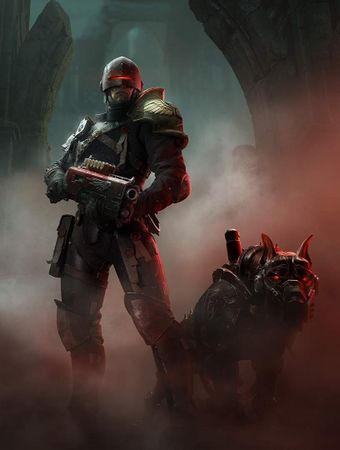
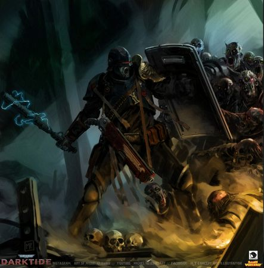

# 0171 仲裁官 Arbitrator

精校状态：中文行文已逐段精校，部分术语仍为暂定

分类：通用概念 / 帝国 Imperium / 中央政务部 Adeptus Terra / 法务部 Adeptus Arbites

原文来源：https://www.bilibili.com/opus/1149778396060844036

原作者：帝国神选罐头

原文时间：2025年12月24日 10:07

[返回分类目录](目录.md) · [全书目录](../../目录.md)

原篇名：仲裁员 Arbitrator

<!-- A0171-B0001 -->
**英文原文**

The Arbitrators are the militant arm of the Adeptus Arbites. Apprehending and punishing those who break the Emperor's laws, Arbitrators are fanatically devoted and well-armed. These brutal enforcers of the Lex Imperialis are typically housed in their planets Precinct-Fortress.

<!-- /A0171-B0001 -->

<!-- A0171-B0002 -->

原译文

仲裁员是法务部的军事武装。逮捕和惩罚那些违反帝皇的法律的人，仲裁员是狂热献身和全副武装的。这些帝国律法的残酷执行者通常被安置在他们的行星警区堡垒中。

**校订译文**

仲裁官是法务部的武装力量，逮捕、惩处违背帝皇律法者。他们信念狂热、装备精良，通常驻于所在行星的警区堡垒，是帝国律法的残酷执行者。

<!-- /A0171-B0002 -->

<!-- A0171-B0003 图片 -->

<!-- A0171-B0004 -->

原译文

Arbitrator and their R-VR Cyber-Mastiff 仲裁员和他们的R-VR智控獒犬

**校订译文**

Arbitrator and their R-VR Cyber-Mastiff 仲裁官和他们的R-VR机械獒犬

<!-- /A0171-B0004 -->

<!-- A0171-B0005 -->
## Ranks of Arbitrators 仲裁官等级

原题：Ranks of Arbitrators 仲裁员等级

<!-- /A0171-B0005 -->

<!-- A0171-B0006 -->
**英文原文**

Lord Marshal or Justicar - Highest rank

<!-- /A0171-B0006 -->

<!-- A0171-B0007 -->

原译文

领主元帅或审判者 - 最高等级

**校订译文**

领主元帅或审判者 - 最高等级

<!-- /A0171-B0007 -->

<!-- A0171-B0008 -->

原译文

Marshal or Magistrate 元帅或执法官

**校订译文**

Marshal or Magistrate 元帅或执法官

<!-- /A0171-B0008 -->

<!-- A0171-B0009 -->

原译文

Proctor, Proctor-Exactant or Intelligencer 监督员，强征监督员或情报员

**校订译文**

Proctor, Proctor-Exactant or Intelligencer 监督员，强征监督员或情报员

<!-- /A0171-B0009 -->

<!-- A0171-B0010 -->

原译文

Arbitrator 仲裁员

**校订译文**

Arbitrator 仲裁官

<!-- /A0171-B0010 -->

<!-- A0171-B0011 -->

原译文

Investigator 调查员

**校订译文**

Investigator 调查员

<!-- /A0171-B0011 -->

<!-- A0171-B0012 -->

原译文

Regulator 监管者

**校订译文**

Regulator 监管者

<!-- /A0171-B0012 -->

<!-- A0171-B0013 -->

原译文

Enforcer 执法者

**校订译文**

Enforcer 执法者

<!-- /A0171-B0013 -->

<!-- A0171-B0014 -->
**英文原文**

Trooper - Lowest rank

<!-- /A0171-B0014 -->

<!-- A0171-B0015 -->

原译文

骑警 - 最低等级

**校订译文**

警员——最低等级。

**校注：** Trooper 在此仅表示最下级警员，不含骑乘意义；骑警 Mounties 在后文明列。

<!-- /A0171-B0015 -->

<!-- A0171-B0016 -->
## Types of Arbitrators 仲裁官类型

原题：Types of Arbitrators 仲裁员类型

<!-- /A0171-B0016 -->

<!-- A0171-B0017 -->
**英文原文**

There are numerous ranks and roles within the Arbitrators:

<!-- /A0171-B0017 -->

<!-- A0171-B0018 -->

原译文

仲裁员中有许多级别和角色：

**校订译文**

仲裁官中有许多级别和角色：

<!-- /A0171-B0018 -->

<!-- A0171-B0019 图片 -->

<!-- A0171-B0020 -->

原译文

Arbitrator 仲裁员

**校订译文**

Arbitrator 仲裁官

<!-- /A0171-B0020 -->

<!-- A0171-B0021 -->
**英文原文**

Chasteners: involves the interrogation of prisoners.

<!-- /A0171-B0021 -->

<!-- A0171-B0022 -->

原译文

惩戒者：涉及对囚犯的审讯。

**校订译文**

惩戒者：涉及对囚犯的审讯。

<!-- /A0171-B0022 -->

<!-- A0171-B0023 -->
**英文原文**

Cyber-Mastiff Handler or Leashmasters even acting for the Arbites, these usually are adepts of Mechanicus

<!-- /A0171-B0023 -->

<!-- A0171-B0024 -->

原译文

智控獒犬驯兽师和锁链大师即使为法务部行动，其通常也是机械神教的专家。

**校订译文**

机械獒犬操控员，亦称牵犬师，虽为法务部服务，通常仍是机械教成员。

<!-- /A0171-B0024 -->

<!-- A0171-B0025 -->
**英文原文**

Detectives - apprehend cyber-criminals through the computer matrices of the Administratum

<!-- /A0171-B0025 -->

<!-- A0171-B0026 -->

原译文

警探 - 通过内务部的计算机矩阵逮捕网络罪犯

**校订译文**

警探 - 通过内政部的计算机矩阵逮捕网络罪犯

<!-- /A0171-B0026 -->

<!-- A0171-B0027 -->
**英文原文**

Detective-Espionist work with espionage-operations, able to control over webs of spies, informants and agents

<!-- /A0171-B0027 -->

<!-- A0171-B0028 -->

原译文

间谍警探从事间谍活动，能够控制间谍、线人和特工的网络

**校订译文**

间谍警探从事间谍活动，能够控制间谍、线人和特工的网络

<!-- /A0171-B0028 -->

<!-- A0171-B0029 -->
**英文原文**

Detective-Surveillor specialize in stalking and observing either lawbreakers or suspected lawbreakers and are apt with all kinds of technical devices

<!-- /A0171-B0029 -->

<!-- A0171-B0030 -->

原译文

监视警探擅长跟踪和观察违法者或涉嫌违法者，并擅长使用各种技术设备

**校订译文**

监视警探擅长跟踪和观察违法者或涉嫌违法者，并擅长使用各种技术设备

<!-- /A0171-B0030 -->

<!-- A0171-B0031 -->

原译文

Enforcer 执法者

**校订译文**

Enforcer 执法者

<!-- /A0171-B0031 -->

<!-- A0171-B0032 -->
**英文原文**

Exaction Squads elite team of Arbitrators charged with securing a target and not allowing anyone to stand in their way

<!-- /A0171-B0032 -->

<!-- A0171-B0033 -->

原译文

强征小队精英仲裁员团队负责保护目标，不允许任何人阻挡他们

**校订译文**

强征小队——仲裁官精锐队伍，负责拿下目标，不容任何人阻拦。

<!-- /A0171-B0033 -->

<!-- A0171-B0034 -->
**英文原文**

Execution teams hound the guilty through barren wastes and labyrinthine tunnels

<!-- /A0171-B0034 -->

<!-- A0171-B0035 -->

原译文

强征小队猎犬通过荒芜的荒地和迷宫般的隧道追捕罪犯

**校订译文**

处决小队——穿越荒原和迷宫般的隧道，追猎罪犯。

<!-- /A0171-B0035 -->

<!-- A0171-B0036 -->
**英文原文**

Patrol groups: prowl the dangerous under-sections of city hives

<!-- /A0171-B0036 -->

<!-- A0171-B0037 -->

原译文

巡逻小队：在巢都城市的危险区域巡逻

**校订译文**

巡逻队——巡视巢都危险的下层区域。

<!-- /A0171-B0037 -->

<!-- A0171-B0038 -->
**英文原文**

Shock troops break up vicious queue wars which often develop outside government buildings

<!-- /A0171-B0038 -->

<!-- A0171-B0039 -->

原译文

突击部队化解在政府建筑外频发的恶性排队冲突

**校订译文**

突击部队化解在政府建筑外频发的恶性排队冲突

<!-- /A0171-B0039 -->

<!-- A0171-B0040 -->
**英文原文**

Vigilant - Shotgun wielding infantry

<!-- /A0171-B0040 -->

<!-- A0171-B0041 -->

原译文

警戒者 - 挥舞霰弹枪的步兵

**校订译文**

警戒者——持霰弹枪的步兵。

<!-- /A0171-B0041 -->

<!-- A0171-B0042 -->
**英文原文**

Subductor - Riot control infantry

<!-- /A0171-B0042 -->

<!-- A0171-B0043 -->

原译文

压制者 - 防爆步兵

**校订译文**

冲覆者——负责防暴的步兵。

**校注：** 完整兵种 Subductor Squad 官译冲覆者小队，GW09/10 第24页；个体称呼据此作冲覆者。

<!-- /A0171-B0043 -->

<!-- A0171-B0044 -->

原译文

Gunner 枪手

**校订译文**

Gunner 枪手

<!-- /A0171-B0044 -->

<!-- A0171-B0045 -->
**英文原文**

Malocator - Bio-Trackers

<!-- /A0171-B0045 -->

<!-- A0171-B0046 -->

原译文

邪恶定位者 - 生物追踪者

**校订译文**

寻恶者——生物追踪人员。

<!-- /A0171-B0046 -->

<!-- A0171-B0047 -->
**英文原文**

Revelatum - Scanner specialists

<!-- /A0171-B0047 -->

<!-- A0171-B0048 -->

原译文

揭示者 - 扫描专家

**校订译文**

揭示者 - 扫描专家

<!-- /A0171-B0048 -->

<!-- A0171-B0049 -->
**英文原文**

Vox-Signifier - Communications Specialists

<!-- /A0171-B0049 -->

<!-- A0171-B0050 -->

原译文

音阵标记者 - 通信专家

**校订译文**

音阵标记者 - 通信专家

<!-- /A0171-B0050 -->

<!-- A0171-B0051 -->
**英文原文**

Chirurgant - Medics

<!-- /A0171-B0051 -->

<!-- A0171-B0052 -->

原译文

警医 - 医生

**校订译文**

警医 - 医生

<!-- /A0171-B0052 -->

<!-- A0171-B0053 -->
**英文原文**

Snatch squads apprehend targets for interrogation

<!-- /A0171-B0053 -->

<!-- A0171-B0054 -->

原译文

缉拿小队逮捕目标进行审讯

**校订译文**

缉拿小队逮捕目标进行审讯

<!-- /A0171-B0054 -->

<!-- A0171-B0055 -->
**英文原文**

Verispex: provide forensic evidence in a crime scene

<!-- /A0171-B0055 -->

<!-- A0171-B0056 -->

原译文

真视者：在犯罪现场提供法庭证据

**校订译文**

真视者——勘验犯罪现场，提供法证证据。

<!-- /A0171-B0056 -->

<!-- A0171-B0057 -->
**英文原文**

Slate-Agent: Undercover operative used to collect intelligence on criminal and rebel elements

<!-- /A0171-B0057 -->

<!-- A0171-B0058 -->

原译文

名单特工：用于收集犯罪和反叛分子情报的卧底特工

**校订译文**

名单特工：用于收集犯罪和反叛分子情报的卧底特工

<!-- /A0171-B0058 -->

<!-- A0171-B0059 -->
**英文原文**

Suffering Marshal: Hunters of fugitives, they often deliver Imperial judgement when they have caught up with their prey

<!-- /A0171-B0059 -->

<!-- A0171-B0060 -->

原译文

折磨元帅：逃亡者的猎人，当他们抓住猎物时，他们经常做出帝国的审判

**校订译文**

折磨元帅：逃亡者的猎人，当他们抓住猎物时，他们经常做出帝国的审判

<!-- /A0171-B0060 -->

<!-- A0171-B0061 -->
**英文原文**

Mounties: Mounted troops on horse effective at controlling angry crowds. Many Imperial denizens have never seen a horse before, yet to see them bearing down with Shock Lances is enough to strike fear into the hearts of rowdy rioters.

<!-- /A0171-B0061 -->

<!-- A0171-B0062 -->

原译文

骑警：骑乘部队，能有效控制愤怒的人群。许多帝国居民以前从未见过马，但看到他们用震荡长枪逼近足以让吵闹的暴徒感到恐惧。

**校订译文**

骑警：骑乘部队，能有效控制愤怒的人群。许多帝国居民以前从未见过马，但看到他们用震荡长枪逼近足以让吵闹的暴徒感到恐惧。

<!-- /A0171-B0062 -->

<!-- A0171-B0063 -->
**英文原文**

In Calixis Sector the Lord Marshal Goreman has authorised his subordinates to pass titles of their own on their subordinates. Arbitrator who excels in interrogating might be called "Tongue-Cutter" or "Mindscour", for example.

<!-- /A0171-B0063 -->

<!-- A0171-B0064 -->

原译文

在卡利西斯星区，领主元帅戈尔曼已授权其下属将自己的头衔传给下属。例如，擅长审讯的仲裁员可能会被称为“切舌者”或“搜脑者”。

**校订译文**

卡利西斯星区的领主元帅戈尔曼允许部下自行给下属授予称号。例如，擅长审讯的仲裁官可能被称为“割舌者”或“搜脑者”。

<!-- /A0171-B0064 -->

<!-- A0171-B0065 -->
## Equipment 装备

<!-- /A0171-B0065 -->

<!-- A0171-B0066 -->
**英文原文**

Arbitrators are well-armed to fight a small scale war. They are commonly equipped with Carapace armour and weaponry such as Shotguns, Grenade Launchers, Suppression Shields, and Power Mauls. They also make use of Rhino, Chimera, and Repressor armored vehicles.

<!-- /A0171-B0066 -->

<!-- A0171-B0067 -->

原译文

仲裁员装备精良，可以打一场小规模的战争。他们通常配备甲壳盔甲和武器，如霰弹枪、榴弹发射器、镇压盾和动力槌。他们还使用犀牛、奇美拉和镇压者装甲载具。

**校订译文**

仲裁官装备精良，可以打一场小规模的战争。他们通常配备甲壳盔甲和武器，如霰弹枪、榴弹发射器、镇压盾和动力槌。他们还使用犀牛、奇美拉和镇压者装甲载具。

<!-- /A0171-B0067 -->

<!-- A0171-B0068 图片 -->

<!-- A0171-B0069 -->

原译文

Arbitrator 仲裁员

**校订译文**

Arbitrator 仲裁官

<!-- /A0171-B0069 -->

<!-- A0171-B0070 -->
## Notable Arbitrators 著名仲裁官

原题：Notable Arbitrators 著名仲裁员

<!-- /A0171-B0070 -->

<!-- A0171-B0071 -->
**英文原文**

Jamahl Byzantane - Marshal

<!-- /A0171-B0071 -->

<!-- A0171-B0072 -->

原译文

贾马尔·拜占庭 - 元帅

**校订译文**

贾马尔·拜赞坦——元帅。

**校注：** Byzantane 是此人的姓，未确认指地名拜占庭，改为暂定音译拜赞坦。

<!-- /A0171-B0072 -->

<!-- A0171-B0073 -->
**英文原文**

Kae Drusil - Senior Arbitrator

<!-- /A0171-B0073 -->

<!-- A0171-B0074 -->

原译文

凯·德鲁西尔 - 高级仲裁员

**校订译文**

凯·德鲁西尔 - 高级仲裁官

<!-- /A0171-B0074 -->

<!-- A0171-B0075 -->
**英文原文**

Leukala Mhal - Senior Arbitrator

<!-- /A0171-B0075 -->

<!-- A0171-B0076 -->

原译文

莱卡拉·马尔 - 高级仲裁员

**校订译文**

卢卡拉·姆哈尔——高级仲裁官。

<!-- /A0171-B0076 -->

<!-- A0171-B0077 -->
**英文原文**

Jaanyi - Detective

<!-- /A0171-B0077 -->

<!-- A0171-B0078 -->

原译文

雅尼 - 警探

**校订译文**

雅尼 - 警探

<!-- /A0171-B0078 -->

<!-- A0171-B0079 -->
**英文原文**

Galatea Haas - Proctor and temporary High Lord

<!-- /A0171-B0079 -->

<!-- A0171-B0080 -->

原译文

加拉蒂亚·哈斯 - 监督员和临时高领主

**校订译文**

加拉提亚·哈斯——监督员，曾暂任高领主。

<!-- /A0171-B0080 -->

<!-- A0171-B0081 -->
**英文原文**

Germaine Macks - Arbitrator

<!-- /A0171-B0081 -->

<!-- A0171-B0082 -->

原译文

杰曼·麦克斯 - 仲裁员

**校订译文**

杰曼·麦克斯 - 仲裁官

<!-- /A0171-B0082 -->

<!-- A0171-B0083 -->
## Conflicting sources 来源冲突

<!-- /A0171-B0083 -->

<!-- A0171-B0084 -->
**英文原文**

Detective is used in Codex Imperialis to describe computer-agents that tracks cyber-criminals. In much later works from Fantasy Flight Games detectives are branched into subgroups presented earlier but there is no specific sub-group for the 2nd Edition era detective.

<!-- /A0171-B0084 -->

<!-- A0171-B0085 -->

原译文

警探在帝国圣典中用于描述追踪网络罪犯的计算机特工。在幻翔游戏的后期作品中，警探被分为之前介绍过的子组，但第二版时期的警探没有特定的子组。

**校订译文**

《帝国圣典》中的警探指追踪网络罪犯的计算机行动人员。Fantasy Flight Games 后来的作品把警探划分为前述若干类别，却没有专门对应第二版警探的分支。

<!-- /A0171-B0085 -->

本篇核心术语与暂定项

以下列出本篇出现的英文原形及核心术语表用词。同形词可能指不同对象，具体词义以本篇正文和校注为准；单复数、别名和仅见于图注的名称可能尚未列入。完整候选见[术语表](../../术语表/双语术语候选.csv)。

| 英文 | 采用中文 | 状态 |
| --- | --- | --- |
| Chimera | 奇美拉 | 官方已核对 |
| Administratum | 内政部 | 暂定 |
| Emperor | 帝皇 | 官方已核对 |
| Adeptus Arbites | 法务部 | 暂定 |
| Cyber-Mastiff | 智控獒犬 | 暂定·官方待核 |
| Enforcers | 地方执法者 | 暂定·官方待核 |
| Lex Imperialis | 帝国律法 | 暂定·官方待核 |
| Arbitrators | 仲裁官 | 暂定·官方待核 |
| Sector | 星区 | 暂定·官方待核 |
| Rhino | 犀牛战车 | 官方已核对 |
| Arbitrator | 仲裁官 | 暂定·官方待核 |
| Precinct-Fortress | 警区堡垒 | 暂定·官方待核 |
| Lord Marshal | 领主元帅 | 暂定·官方待核 |
| Subductor | 冲覆者 | 暂定·官方待核 |
| Malocator | 寻恶者 | 暂定·官方待核 |
| Operative | 特工 | 暂定·官方待核 |
| Imperialis | 帝国徽记 | 暂定·官方待核 |
| Marshal | 元帅 | 官方已核对 |
| Vigilant | 维吉兰特 | 暂定·官方待核 |
| Justicar | 仲裁官 | 暂定·官方待核 |
| Subordinates | 属役 | 暂定·官方待核 |
| Germaine Macks | 杰曼·麦克斯 | 暂定·官方待核 |
| Calixis Sector | 卡利西斯星区 | 暂定·官方待核 |
| Shotgun | 霰弹枪 | 暂定·官方待核 |
| Codex Imperialis | 帝国圣典 | 暂定·官方待核 |
| Scanner | 扫描仪 | 暂定·官方待核 |
| Grenade | 手榴弹 | 暂定·官方待核 |
| Carapace Armour | 甲壳盔甲 | 暂定·官方待核 |
| Repressor | 镇压者装甲车 | 暂定·官方待核 |

