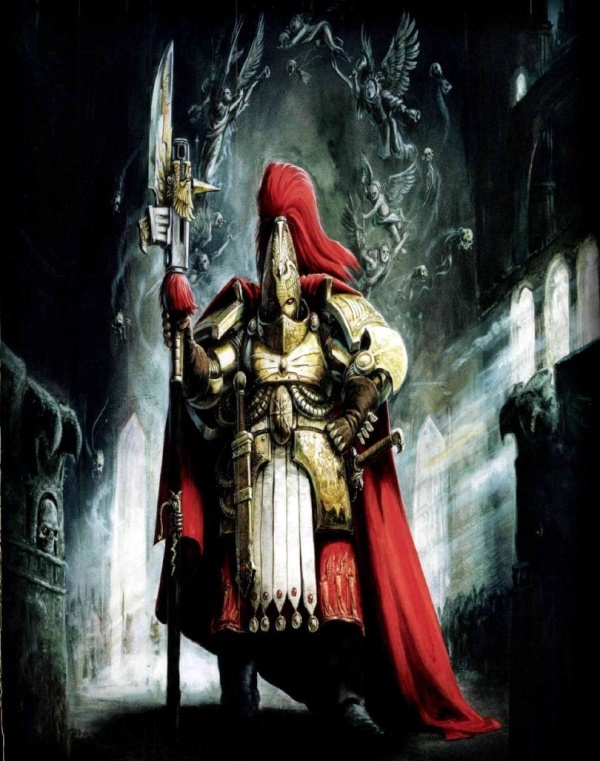
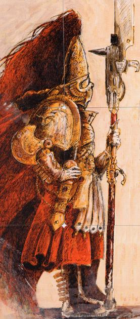
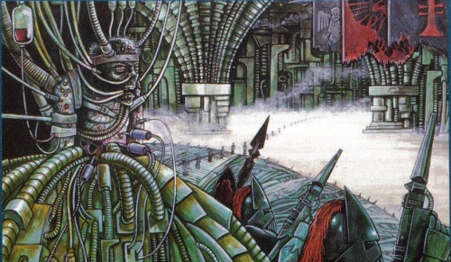
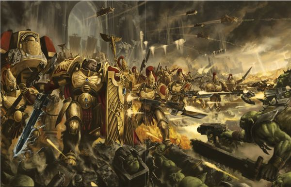
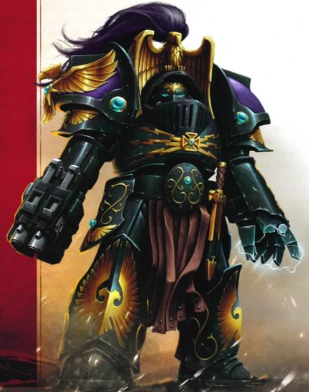
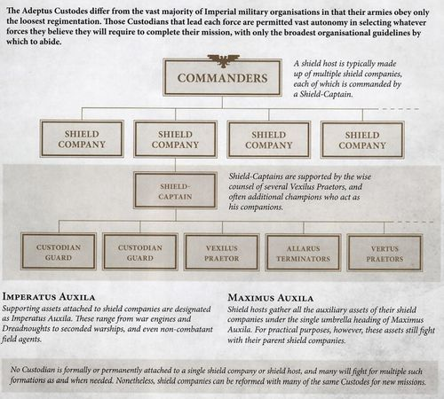
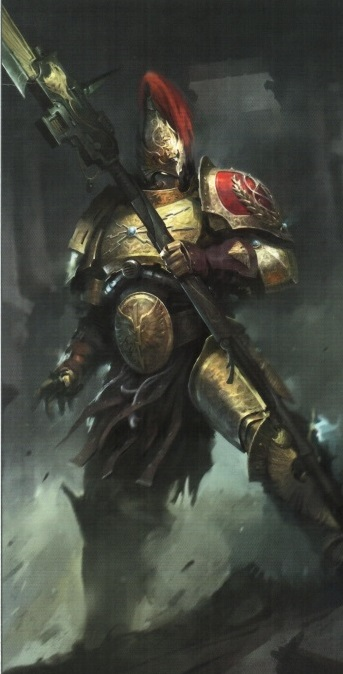
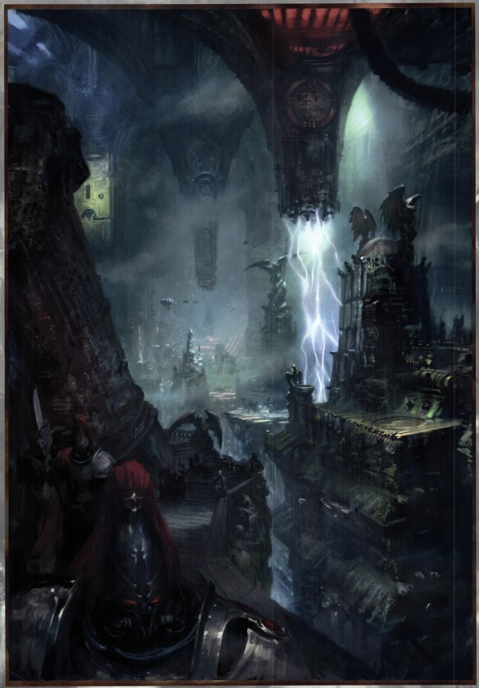
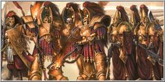
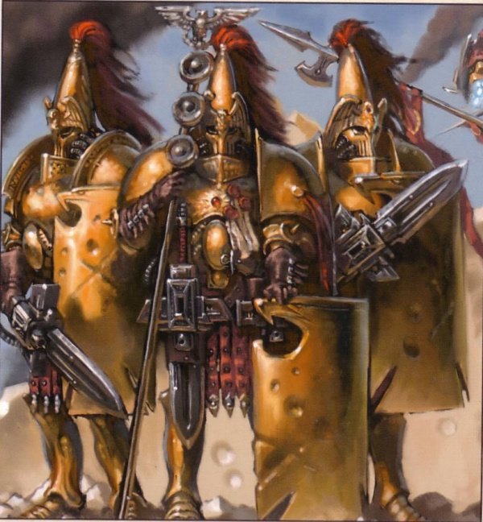

# 0172 帝皇禁军 Adeptus Custodes

精校状态：中文行文已逐段精校，部分术语仍为暂定

分类：通用概念 / 帝国 Imperium / 中央政务部 Adeptus Terra / 禁军修会 Adeptus Custodes

原文来源：https://www.bilibili.com/opus/1067201576701001747

原作者：帝国神选罐头

原文时间：编辑于 2025年06月24日 22:07

[返回分类目录](目录.md) · [全书目录](../../目录.md)

原篇名：禁军修会 Adeptus Custodes

<!-- A0172-B0001 -->
**英文原文**

The Adeptus Custodes, renowned as the Golden Legion, the Brotherhood of Demigods, the Golden Brotherhood, and a host of other titles (The Custodian Guard, The Guardians, the Emperor’s Saints, the Watchers of The Throne, The Thousand Companions, The Ten Thousand), but most commonly known as Custodians, are the guardians of the Imperial Palace and the Golden Throne, as well as the personal bodyguard to the Emperor. Due to the vast size of the Imperial Palace, the Custodes always act as a defensive army.

<!-- /A0172-B0001 -->

<!-- A0172-B0002 -->

原译文

禁军修会被称为黄金军团、半神兄弟会、黄金兄弟会和许多其他头衔（禁军卫队、守护者、帝皇圣徒、王座守望、千伙团、万夫团），但最常见的是禁军，是帝国皇宫和黄金王座的守护者，也是帝皇的私人护卫。由于皇宫的巨大规模，禁军总是充当防御部队。

**校订译文**

帝皇禁军又称黄金军团、半神兄弟会、黄金兄弟会，另有禁军卫队、守护者、帝皇圣徒、王座守望者、千名近侍、万夫团等称号，通常简称禁军。他们守卫皇宫与黄金王座，是帝皇的私人护卫。由于皇宫幅员极其辽阔，禁军也始终承担一支防卫军队的职责。

<!-- /A0172-B0002 -->

<!-- A0172-B0003 图片 -->

<!-- A0172-B0004 -->

原译文

Adeptus Custodes 禁军修会

**校订译文**

Adeptus Custodes 帝皇禁军

<!-- /A0172-B0004 -->

<!-- A0172-B0005 -->
**英文原文**

Parent Agency:Adeptus Terra

<!-- /A0172-B0005 -->

<!-- A0172-B0006 -->

原译文

总部机构：中央政务部

**校订译文**

隶属机构：中央政务部。

<!-- /A0172-B0006 -->

<!-- A0172-B0007 -->
**英文原文**

Headquarters:Tower of Hegemon, Terra

<!-- /A0172-B0007 -->

<!-- A0172-B0008 -->

原译文

总部：泰拉，霸权之塔

**校订译文**

总部：泰拉，霸权之塔

<!-- /A0172-B0008 -->

<!-- A0172-B0009 -->
**英文原文**

Leader:Captain-General Trajann Valoris

<!-- /A0172-B0009 -->

<!-- A0172-B0010 -->

原译文

领袖：图拉真·瓦洛里斯元帅

**校订译文**

领袖：禁军元帅图拉真·瓦洛瑞斯。

<!-- /A0172-B0010 -->

<!-- A0172-B0011 -->
**英文原文**

Established:Unification Wars-era

<!-- /A0172-B0011 -->

<!-- A0172-B0012 -->

原译文

成立：统一战争时期

**校订译文**

成立：统一战争时期

<!-- /A0172-B0012 -->

<!-- A0172-B0013 -->
**英文原文**

Together with the Sisters of Silence they represented the Talons of the Emperor as the right hand of the Emperor. For much of their history the Custodes rarely left the Imperial Palace and even more rarely left Terra. It is the Adeptus Custodes that decide who may enter the throne room of the Emperor, and when. Such is their authority in this matter that Space Marines and Inquisitors must kneel before them. Custodians are the mightiest of mankind's warriors. They are to the Space Marines what those transhuman warriors are to common Guardsmen, an elevated elite whose raw strength and willpower are wholly insurmountable.

<!-- /A0172-B0013 -->

<!-- A0172-B0014 -->

原译文

他们与寂静修女一起为帝皇之爪，代表为帝皇右手。在他们的大部分历史中，禁军很少离开皇宫，更很少离开泰拉。决定谁可以进入帝皇的王座厅，以及何时进入的是禁军。这就是他们在这件事上的权力，星际战士和审判官必须跪在他们面前。禁军是人类最强大的战士。对于星际战士来说，他们就像那些超人战士对于普通卫队一样，是一支高贵的精英，他们的真实力量和意志力是完全不可逾越的。

**校订译文**

禁军与寂静修女合称帝皇之爪，其中禁军代表帝皇的右手。在漫长历史中，他们很少离开皇宫，更少离开泰拉。谁能进入帝皇王座厅、何时进入，都由禁军决定；在此事上，他们权威如此之高，星际战士和审判官也须向其下跪。禁军被描述为人类最强大的战士：禁军与星际战士之间的差距，犹如星际战士与普通卫兵之间的差距。他们是更高一层的精锐，力量与意志强大得难以企及。

<!-- /A0172-B0014 -->

<!-- A0172-B0015 图片 -->

<!-- A0172-B0016 -->

原译文

Custodian of the Adeptus Custodes 禁军修会卫士

**校订译文**

Custodian of the Adeptus Custodes 帝皇禁军卫士

<!-- /A0172-B0016 -->

<!-- A0172-B0017 -->
## History 历史

<!-- /A0172-B0017 -->

<!-- A0172-B0018 -->
**英文原文**

The Adeptus Custodes were known originally as the Legio Custodes or Custodian Guard. The original Custodians were the first genetically and psychologically altered warriors to appear in the Emperor's armies during the Terran Unification Wars, where they served as the Emperor's personal bodyguard. The original recruits of the Custodes were from the offspring of Terran nobility. The first known appearance of the Custodes was early in the Unification Wars during the fall of the Techno-Barbarian fortress at Nas'sau. However, the origins of the Custodian Guard are shrouded in myth and legend. During the Great Crusade, the Custodes always kept a contingent with the Emperor for his protection, but also traveled individually as envoys. The Emperor valued the Custodians above all his other warriors, and while he was willing to expend countless servants he was always hesitant to bleed his Praetorians. After the Emperor's internment in the Golden Throne, the Adeptus Custodes took a limited role as protectors of the Imperial Palace, as ordered by Roboute Guilliman in the Edict of Restraint.

<!-- /A0172-B0018 -->

<!-- A0172-B0019 -->

原译文

禁军修会最初被称为禁军军团或禁军卫队。最初的禁军是第一批在泰拉统一战争期间出现在帝皇军队中的基因和灵能改造的战士，他们担任帝皇的私人护卫。禁军最初的新兵来自泰拉贵族的后代。据了解，禁军的首次出现是在统一战争早期，当时纳斯’苏的技术蛮人堡垒沦陷。然而，禁军的起源却笼罩在神话传说之中。在大远征期间，季军总是与帝皇保持一支队伍以保护他，但也作为使者单独行动。帝皇把禁军看得比其他所有战士都重要，虽然他愿意花费无数的仆人，但他总是犹豫要不要让他的禁军流血。在帝皇被囚禁在黄金王座之后，按照罗伯特·吉利曼在限制敕令中的命令，禁军作为皇宫的保护者发挥了有限的作用。

**校订译文**

帝皇禁军最初称禁军军团或禁军卫队。泰拉统一战争期间，他们作为帝皇贴身护卫出现，是其军队中最早接受基因与心理改造的战士。最初从泰拉贵族子女中征募，最早已知记录见于统一战争早期、纳斯绍技术蛮人堡垒陷落时；更深的起源则埋在神话传说中。大远征期间，始终有一支禁军随侍帝皇，也有人独自担任使节。帝皇重视他们胜过其他战士，虽可牺牲无数仆役，却总不愿让自己的禁卫流血。帝皇被安置于黄金王座后，罗保特·基里曼颁布《限制敕令》，将禁军职责限于守护皇宫。

**校注：** psychologically 是心理改造，原译误作灵能改造；internment 在此结合上下文为安置于王座，不能理解为囚犯遭拘禁。

<!-- /A0172-B0019 -->

<!-- A0172-B0020 图片 -->

<!-- A0172-B0021 -->

原译文

Custodian Guard c.M31 M31禁军卫士

**校订译文**

Custodian Guard c.M31 M31禁军卫队

<!-- /A0172-B0021 -->

<!-- A0172-B0022 -->
**英文原文**

The Custodes were equipped with the best power armour of the age, and had access to the most highly advanced weaponry and vehicles of the Imperium, including designs that were not permitted to the Space Marine Legions. After the end of the Horus Heresy and the enthronement of the Emperor, the Custodes were said to have changed the colour of their cloaks from red to black to symbolise the darkness that had fallen over their order. By the end of the 41st Millennium with the reappearance of Roboute Guilliman, the Custodes abandoned their shrouds of shame and were seen again wearing their traditional red garments.

<!-- /A0172-B0022 -->

<!-- A0172-B0023 -->

原译文

禁军配备了当时最好的动力盔甲，并可以使用帝国最先进的武器和载具，包括星际战士不允许的设计。荷鲁斯叛乱结束和帝皇登座后，据说禁军将斗篷的颜色从红色改为黑色，以象征笼罩他们秩序的黑暗。到第41个千年结束时，随着罗伯特·基里曼的再次出现，禁军放弃了他们的耻辱斗篷，再次穿着他们传统的红色服装。

**校订译文**

禁军使用当时最优秀的动力护甲，以及帝国最先进的武器与载具，其中包括禁止星际战士军团使用的设计。据说，荷鲁斯之乱结束、帝皇登上王座后，他们将红色斗篷换为黑色，象征笼罩组织的黑暗。第41千年末，基里曼重返帝国，禁军才脱下耻辱的黑袍，再度穿上传统红衣。

<!-- /A0172-B0023 -->

<!-- A0172-B0024 -->
**英文原文**

During the Age of Apostasy, the Adeptus Custodes reemerged briefly during the siege of the Ecclesiarchal Palace of Terra in the reign of Goge Vandire. During this time, the Custodes attempted to make their way towards Vandire, halted only by the Brides of the Emperor, who Vandire had convinced to become his personal bodyguards. After a long and otherwise fruitless discussion, the Custodes convinced the leader of the Brides, Alicia Dominica, to return with them to the presence of the Emperor. What happened during that moment is unknown, but the effects resulted in the Brides of the Emperor rebelling against Vandire, ending his reign once and for all.

<!-- /A0172-B0024 -->

<!-- A0172-B0025 -->

原译文

在叛教时代，在高戈·范迪尔统治期间，禁军修会在泰拉的国教皇宫被围困期间短暂重新出现。在这段时间里，禁军试图向范迪尔前进，只有帝皇新娘阻止了他们，范迪尔说服了她们成为他的私人护卫。经过漫长而徒劳的讨论，禁军说服新娘的领袖艾丽西亚·多米尼克与他们一起回到帝皇面前。那一刻发生了什么尚不清楚，但其影响导致了帝皇新娘反抗范迪尔，一劳永逸地结束了他的统治。

**校订译文**

叛教时代，高戈·范迪尔统治下的泰拉国教宫殿遭围攻，禁军曾短暂再现。试图接近范迪尔的禁军，被其贴身护卫帝皇新娘拦下。漫长交涉虽大多无果，最终仍说服新娘领袖艾丽西亚·多米尼克随他们觐见帝皇。觐见时发生了什么，无人知晓；此后帝皇新娘转而反抗范迪尔，彻底终结了他的统治。

<!-- /A0172-B0025 -->

<!-- A0172-B0026 图片 -->

<!-- A0172-B0027 -->

原译文

The Custodians ring the Golden Throne 环绕黄金王座的禁军

**校订译文**

The Custodians ring the Golden Throne 环绕黄金王座的禁军

<!-- /A0172-B0027 -->

<!-- A0172-B0028 -->
**英文原文**

Centuries later during the Terran Crusade, Custodes arrived to reinforce the reborn Roboute Guilliman as he battled the Thousand Sons on Luna. Shortly after, Terra was besieged by Daemons, proving to many Custodes that they had been wanting and let the threat of the Archenemy arrive on the Emperor's doorstep. Later, the Custodes permitted Guilliman to enter the Emperor's Throneroom alone for an entire day. The reappearance of a Son of the Emperor galvanised the Custodes, and behind closed doors Guilliman and Captain-General Trajann Valoris amended the Edict of Restraint and modified the role of the Custodes that would see many of them journey across the Galaxy on Crusades. Now members of the Custodes will bring war to the enemies of mankind, while the Companions oversee the safety of the Emperor's mortal form.

<!-- /A0172-B0028 -->

<!-- A0172-B0029 -->

原译文

几个世纪后，在泰拉远征期间，禁军抵达增援重生的罗伯特·基里曼，他在月球上与千子作战。不久之后，泰拉被恶魔围困，向许多禁军证明他们一直想要让头号敌人的威胁到达帝皇的家门口。后来，禁军允许基里曼独自进入帝皇的王座厅一整天。帝皇子嗣的再次出现激励了禁军，基里曼和图拉真·瓦洛里斯元帅秘密的修改了限制敕令，并修改了禁军的角色，他们中的许多人将在远征中穿越银河系。现在，禁军的成员将为人类之敌带来战争，而伙友则监督帝皇垂死之身的安全。

**校订译文**

数世纪后，泰拉远征期间，禁军赶到月球，支援正在与千子交战的复生基里曼。不久，恶魔围攻泰拉，许多禁军由此意识到自己未尽职责，竟让宿敌威胁逼至帝皇门前。随后，他们允许基里曼独自在王座厅停留一整天。帝皇之子的归来令禁军振奋；基里曼与禁军元帅图拉真·瓦洛瑞斯秘密商议，修订《限制敕令》，让许多禁军得以远征银河。此后，禁军主动将战火带向人类之敌，近侍则继续守护帝皇的肉身。

**校注：** had been wanting 指未达职责要求、存在失职，不表示一直想让敌人逼近。原文“数世纪后”与叛教时代到第41千年的跨度亦有疑点，时间表达忠实保留。

<!-- /A0172-B0029 -->

<!-- A0172-B0030 -->
**英文原文**

The Adeptus Custodes are so revered that it is deemed heresy for the Administratum to record them ever losing a battle. Thus, it is officially recorded that any warzone the Custodes are deployed to is an Imperial victory, even before they arrive.

<!-- /A0172-B0030 -->

<!-- A0172-B0031 -->

原译文

禁军修会是如此受人尊敬，以至于内务部记录他们输掉一场战斗被视为异端。因此，官方记录显示，即使在禁军到达之前，他们部署到的任何战区都是帝国的胜利。

**校订译文**

帝皇禁军地位崇高到这种程度：内政部若记载他们战败，便会被视为异端。因此，禁军奉命前往的战区，甚至在他们抵达之前，就已在官方记录中列为帝国胜利。

<!-- /A0172-B0031 -->

<!-- A0172-B0032 -->
### Combat History 战斗历史

<!-- /A0172-B0032 -->

<!-- A0172-B0033 -->
### Unification Era 统一战争时期

<!-- /A0172-B0033 -->

<!-- A0172-B0034 -->

原译文

Battle of Maulland Sen 莫兰森之战

**校订译文**

Battle of Maulland Sen 莫兰森之战

<!-- /A0172-B0034 -->

<!-- A0172-B0035 -->

原译文

Battle for Vilifactor's fortress 维利法特要塞之战

**校订译文**

Battle for Vilifactor's fortress 维利法特要塞之战

<!-- /A0172-B0035 -->

<!-- A0172-B0036 -->
**英文原文**

Battle on the red fields of Primasalia with iron fiends

<!-- /A0172-B0036 -->

<!-- A0172-B0037 -->

原译文

在普里马萨利亚的红域上与铁恶魔作战

**校订译文**

在普里马萨利亚的红域上与铁恶魔作战

<!-- /A0172-B0037 -->

<!-- A0172-B0038 -->

原译文

Palace Coup 皇宫政变

**校订译文**

Palace Coup 皇宫政变

<!-- /A0172-B0038 -->

<!-- A0172-B0039 -->
### Great Crusade 大远征

<!-- /A0172-B0039 -->

<!-- A0172-B0040 -->

原译文

Pacification of Ophelia VII 奥菲利亚七号平定

**校订译文**

Pacification of Ophelia VII 奥菲利亚七号平定

<!-- /A0172-B0040 -->

<!-- A0172-B0041 -->

原译文

Proximan Betrayal 普罗西莫背叛

**校订译文**

Proximan Betrayal 普罗西莫背叛

<!-- /A0172-B0041 -->

<!-- A0172-B0042 -->

原译文

Battle of Gorro 戈罗之战

**校订译文**

Battle of Gorro 戈罗之战

<!-- /A0172-B0042 -->

<!-- A0172-B0043 -->

原译文

Battle of Gyros-Thravian 杰罗斯-萨洛维安之战

**校订译文**

Battle of Gyros-Thravian 杰罗斯-萨洛维安之战

<!-- /A0172-B0043 -->

<!-- A0172-B0044 -->

原译文

Battle of 47-16 47-16之战

**校订译文**

Battle of 47-16 47-16之战

<!-- /A0172-B0044 -->

<!-- A0172-B0045 -->
**英文原文**

Styxian Overmancers — Adeptus Custodes fought on its hellish fastness

<!-- /A0172-B0045 -->

<!-- A0172-B0046 -->

原译文

冥河主宰 — 禁军在其地狱般的堡垒上战斗

**校订译文**

冥河主宰 — 禁军在其地狱般的堡垒上战斗

<!-- /A0172-B0046 -->

<!-- A0172-B0047 -->
**英文原文**

Fighting with the false empire of Pureblood Kings

<!-- /A0172-B0047 -->

<!-- A0172-B0048 -->

原译文

与纯血国王的虚假帝国作战

**校订译文**

与纯血国王的虚假帝国作战

<!-- /A0172-B0048 -->

<!-- A0172-B0049 -->

原译文

Coldharvest Campaign 寒冷收割战役

**校订译文**

Coldharvest Campaign 寒冷收割战役

<!-- /A0172-B0049 -->

<!-- A0172-B0050 -->

原译文

Ullanor Crusade 乌兰诺远征

**校订译文**

Ullanor Crusade 乌兰诺远征

<!-- /A0172-B0050 -->

<!-- A0172-B0051 -->
### Horus Heresy 荷鲁斯之乱

原题：Horus Heresy 荷鲁斯叛乱

<!-- /A0172-B0051 -->

<!-- A0172-B0052 -->

原译文

Burning of Prospero 普罗斯佩罗之焚

**校订译文**

Burning of Prospero 普罗斯佩罗之焚

<!-- /A0172-B0052 -->

<!-- A0172-B0053 -->
**英文原文**

Drop Site Massacre - A small squad of Custodes under Aquillon were slain by the Word Bearers

<!-- /A0172-B0053 -->

<!-- A0172-B0054 -->

原译文

登陆点大屠杀 - 阿奎隆手下的一小队禁军被怀言者杀害

**校订译文**

登陆点大屠杀 - 阿奎隆手下的一小队禁军被怀言者杀害

<!-- /A0172-B0054 -->

<!-- A0172-B0055 -->
**英文原文**

First Siege of Cthonia - Three sodalities of the Legio Custodes took part in the battle.

<!-- /A0172-B0055 -->

<!-- A0172-B0056 -->

原译文

第一次科索尼亚围城 — 禁军军团的三个友伴会参加了这场战斗。

**校订译文**

第一次科索尼亚围城 — 禁军军团的三个友伴会参加了这场战斗。

<!-- /A0172-B0056 -->

<!-- A0172-B0057 -->

原译文

Battle of Signus Prime 西格纳斯主星之战

**校订译文**

Battle of Signus Prime 西格纳斯主星之战

<!-- /A0172-B0057 -->

<!-- A0172-B0058 -->

原译文

War Within the Webway 网道战争

**校订译文**

War Within the Webway 网道战争

<!-- /A0172-B0058 -->

<!-- A0172-B0059 -->

原译文

Axandrian Incident 阿克桑德里安事件

**校订译文**

Axandrian Incident 阿克桑德里安事件

<!-- /A0172-B0059 -->

<!-- A0172-B0060 -->

原译文

Battle of Terra 泰拉之战

**校订译文**

Battle of Terra 泰拉之战

<!-- /A0172-B0060 -->

<!-- A0172-B0061 -->

原译文

Great Scouring 大清洗

**校订译文**

Great Scouring 大清洗

<!-- /A0172-B0061 -->

<!-- A0172-B0062 -->
### Post-Heresy 叛乱后

<!-- /A0172-B0062 -->

<!-- A0172-B0063 -->

原译文

Eldar raid on the Imperial Palace 帝国皇宫灵族突袭

**校订译文**

Eldar raid on the Imperial Palace 帝国皇宫灵族突袭

<!-- /A0172-B0063 -->

<!-- A0172-B0064 -->

原译文

Purging of Trynnect 特林内克特清洗

**校订译文**

Purging of Trynnect 特林内克特清洗

<!-- /A0172-B0064 -->

<!-- A0172-B0065 -->

原译文

Siege of the Eternity Gate 永恒之门围攻

**校订译文**

Siege of the Eternity Gate 永恒之门围攻

<!-- /A0172-B0065 -->

<!-- A0172-B0066 -->

原译文

Battle of Dakhorth 达霍斯特之战

**校订译文**

Battle of Dakhorth 达霍斯特之战

<!-- /A0172-B0066 -->

<!-- A0172-B0067 -->

原译文

War for the Andromax System 安德洛马克斯星系战争

**校订译文**

War for the Andromax System 安德洛马克斯星系战争

<!-- /A0172-B0067 -->

<!-- A0172-B0068 -->

原译文

Waaagh! Deffbringa 死亡使者的Waaagh！

**校订译文**

Waaagh! Deffbringa 死亡使者的Waaagh！

<!-- /A0172-B0068 -->

<!-- A0172-B0069 -->

原译文

Defense of Tyborial 泰博瑞尔防御

**校订译文**

Defense of Tyborial 泰博瑞尔防御

<!-- /A0172-B0069 -->

<!-- A0172-B0070 -->

原译文

Waaagh! Zagstomp 快脚的Waaagh！

**校订译文**

Waaagh! Zagstomp 快脚的Waaagh！

<!-- /A0172-B0070 -->

<!-- A0172-B0071 -->

原译文

Years of Madness 疯狂年代

**校订译文**

Years of Madness 疯狂年代

<!-- /A0172-B0071 -->

<!-- A0172-B0072 -->

原译文

Battle of Luna 月球之战

**校订译文**

Battle of Luna 月球之战

<!-- /A0172-B0072 -->

<!-- A0172-B0073 -->
**英文原文**

Battle of Lion's Gate and subsequently fighting against other Chaos Cults on Terra

<!-- /A0172-B0073 -->

<!-- A0172-B0074 -->

原译文

狮门之战，随后在泰拉上与其他混沌邪教作战

**校订译文**

狮门之战，随后在泰拉上与其他混沌邪教作战

<!-- /A0172-B0074 -->

<!-- A0172-B0075 -->
### Era Indomitus 不屈时代

原题：Era Indomitus 不屈期间

<!-- /A0172-B0075 -->

<!-- A0172-B0076 -->

原译文

Primarch's Scourge 原体之灾

**校订译文**

Primarch's Scourge 原体之灾

<!-- /A0172-B0076 -->

<!-- A0172-B0077 -->

原译文

Battling the Hexarchy's Coup 与六人联盟政变作战

**校订译文**

Battling the Hexarchy's Coup 与六人联盟政变作战

<!-- /A0172-B0077 -->

<!-- A0172-B0078 -->

原译文

Battle of Othana V 奥萨纳五号之战

**校订译文**

Battle of Othana V 奥萨纳五号之战

<!-- /A0172-B0078 -->

<!-- A0172-B0079 -->

原译文

Battle of San Leor 圣莱奥尔之战

**校订译文**

Battle of San Leor 圣莱奥尔之战

<!-- /A0172-B0079 -->

<!-- A0172-B0080 -->

原译文

Battle of the Ophelia System 奥菲利亚星系之战

**校订译文**

Battle of the Ophelia System 奥菲利亚星系之战

<!-- /A0172-B0080 -->

<!-- A0172-B0081 -->

原译文

Purging of the Wyrms of the Ur-Tendril 乌尔悬臂的妖龙净化

**校订译文**

Purging of the Wyrms of the Ur-Tendril 乌尔悬臂的妖龙净化

<!-- /A0172-B0081 -->

<!-- A0172-B0082 -->

原译文

Defense of Vostagraad 沃斯塔拉德防御

**校订译文**

Defense of Vostagraad 沃斯塔拉德防御

<!-- /A0172-B0082 -->

<!-- A0172-B0083 -->

原译文

Victorium Crusade 胜利远征

**校订译文**

Victorium Crusade 胜利远征

<!-- /A0172-B0083 -->

<!-- A0172-B0084 -->

原译文

Battle of Loqe II 洛可二号之战

**校订译文**

Battle of Loqe II 洛可二号之战

<!-- /A0172-B0084 -->

<!-- A0172-B0085 -->

原译文

Battle for the Aspis System 蝰蛇星系之战

**校订译文**

Battle for the Aspis System 阿斯庇斯恒星系之战

<!-- /A0172-B0085 -->

<!-- A0172-B0086 -->

原译文

Indomitus Crusade 不屈远征

**校订译文**

Indomitus Crusade 不屈远征

<!-- /A0172-B0086 -->

<!-- A0172-B0087 -->

原译文

Battle of Vorlese 沃勒斯之战

**校订译文**

Battle of Vorlese 沃勒斯之战

<!-- /A0172-B0087 -->

<!-- A0172-B0088 -->

原译文

Battle of Gathalamor 加塔拉莫之战

**校订译文**

Battle of Gathalamor 加塔拉莫之战

<!-- /A0172-B0088 -->

<!-- A0172-B0089 -->

原译文

Battle of Khassedur 卡塞杜尔之战

**校订译文**

Battle of Khassedur 卡瑟杜尔之战

<!-- /A0172-B0089 -->

<!-- A0172-B0090 -->

原译文

Battle of Raukos 劳科斯之战

**校订译文**

Battle of Raukos 劳科斯之战

<!-- /A0172-B0090 -->

<!-- A0172-B0091 -->

原译文

Plague Wars 瘟疫战争

**校订译文**

Plague Wars 瘟疫战争

<!-- /A0172-B0091 -->

<!-- A0172-B0092 -->

原译文

Battle for Hydraphur against Black Legion 海德拉弗之战对抗黑色军团

**校订译文**

Battle for Hydraphur against Black Legion 在海德拉弗对抗黑色军团之战

<!-- /A0172-B0092 -->

<!-- A0172-B0093 -->

原译文

The War of the Spider 蜘蛛战争

**校订译文**

The War of the Spider 蜘蛛战争

<!-- /A0172-B0093 -->

<!-- A0172-B0094 -->

原译文

Witching Wars 巫术战争

**校订译文**

Witching Wars 巫术战争

<!-- /A0172-B0094 -->

<!-- A0172-B0095 -->

原译文

Battle of Bajil 巴吉尔之战

**校订译文**

Battle of Bajil 巴吉尔之战

<!-- /A0172-B0095 -->

<!-- A0172-B0096 -->

原译文

Battle of Klythes IV 克利特斯四号之战

**校订译文**

Battle of Klythes IV 克利特斯四号之战

<!-- /A0172-B0096 -->

<!-- A0172-B0097 -->

原译文

Battle of Lenthis 伦蒂斯之战

**校订译文**

Battle of Lenthis 伦蒂斯之战

<!-- /A0172-B0097 -->

<!-- A0172-B0098 -->

原译文

The Unthinkable War 匪思战争

**校订译文**

The Unthinkable War 匪思战争

<!-- /A0172-B0098 -->

<!-- A0172-B0099 -->

原译文

The Fourth Tyrannic War 第四次泰伦战争

**校订译文**

The Fourth Tyrannic War 第四次泰伦战争

<!-- /A0172-B0099 -->

<!-- A0172-B0100 -->

原译文

Battle of Bastior 巴斯蒂奥之战

**校订译文**

Battle of Bastior 巴斯蒂奥之战

<!-- /A0172-B0100 -->

<!-- A0172-B0101 -->

原译文

Jovian Purge 木星净化

**校订译文**

Jovian Purge 木星净化

<!-- /A0172-B0101 -->

<!-- A0172-B0102 -->
## Organisation 组织

<!-- /A0172-B0102 -->

<!-- A0172-B0103 -->
**英文原文**

The warriors of the Adeptus Custodes are a department of the Adeptus Terra, the Imperial government, but its members are answerable only to the Emperor and their own leaders. The organisation's leader carries the title of Captain-General, and due to the importance of the Adeptus Custodes they often hold a position in the Senate of the High Lords of Terra. Below them are two Tribunes, though during the Heresy era there were three. Individual squads of Custodes are overseen by Shield-Captains. The Custodes' nerve centre and command & control headquarters is the Tower of Hegemon within the Imperial Palace, while a small elite of three hundred Custodes, known as the Companions, form the Emperor's personal bodyguard and never leave his side.

<!-- /A0172-B0103 -->

<!-- A0172-B0104 -->

原译文

禁军修会是中央政务部的一个部门，但其成员只对帝皇和他们自己的领袖负责。该组织的领导人拥有元帅的头衔，由于禁军修会的重要性，他们经常在泰拉的高领主议会任职。下面是两个保民官，尽管在叛乱时代有三个。各个禁军队由盾卫连长监督。禁军的神经中枢和指挥控制总部是皇宫内的霸权之塔，而三百名禁军的一小部分精英，即伙友，组成了帝皇的私人护卫，从不离开他身边。

**校订译文**

帝皇禁军名义上是中央政务部的一个部门，成员却只服从帝皇与自身领袖。最高领袖称禁军元帅，因机构地位重要，常在泰拉高领主议会占有一席。其下有两名护民官，荷鲁斯之乱时期则为三名。各小队由盾卫连长统率。指挥中枢是皇宫内的霸权之塔，另有三百名精锐近侍，组成帝皇贴身护卫，寸步不离。

**校注：** 本段贴身护卫 Companions 为三百人，开头列千名近侍是别称，数字未强行改成一致。

<!-- /A0172-B0104 -->

<!-- A0172-B0105 图片 -->

<!-- A0172-B0106 -->

原译文

The Adeptus Custodes at war 战争中的禁军修会

**校订译文**

The Adeptus Custodes at war 战争中的帝皇禁军

<!-- /A0172-B0106 -->

<!-- A0172-B0107 -->
**英文原文**

Although the Legio Custodes originally numbered ten thousand, around five years into the War Within the Webway they had been reduced to around a thousand. However, by the 41st Millennium, they had rebuilt to their original 10,000 strength.

<!-- /A0172-B0107 -->

<!-- A0172-B0108 -->

原译文

虽然禁军军团最初有一万人，但在网道战争大约五年后，他们已经减少到大约一千人。然而，到了第41个千年，他们已经重建到原来的10000人。

**校订译文**

虽然禁军军团最初有一万人，但在网道战争大约五年后，他们已经减少到大约一千人。然而，到了第41个千年，他们已经重建到原来的10000人。

<!-- /A0172-B0108 -->

<!-- A0172-B0109 -->
### Ranks & Titles 等级&军衔

<!-- /A0172-B0109 -->

<!-- A0172-B0110 -->
**英文原文**

The ranks of the Custodian Guard are noted as somewhat informal, as much gestures of respect towards veterans and gifted individuals as a true command structure.

<!-- /A0172-B0110 -->

<!-- A0172-B0111 -->

原译文

禁军卫队的级别被认为有点非正式，既表现出对老兵和有能者的敬重，又有着如同真正的指挥架构一般的作用。

**校订译文**

禁军卫队的级别被认为有点非正式，既表现出对老兵和有能者的敬重，又有着如同真正的指挥架构一般的作用。

<!-- /A0172-B0111 -->

<!-- A0172-B0112 -->
**英文原文**

Captain-General — Chief Custodian to the Emperor

<!-- /A0172-B0112 -->

<!-- A0172-B0113 -->

原译文

元帅 — 帝皇的首席禁军

**校订译文**

禁军元帅——帝皇的首席禁军。

<!-- /A0172-B0113 -->

<!-- A0172-B0114 -->
**英文原文**

Custodian Tribunate

<!-- /A0172-B0114 -->

<!-- A0172-B0115 -->

原译文

禁军护民官

**校订译文**

禁军护民官团。

<!-- /A0172-B0115 -->

<!-- A0172-B0116 -->
**英文原文**

Tribune — Senior Officer. There were 3 Tribunes during the Horus Heresy era, though now there are two.

<!-- /A0172-B0116 -->

<!-- A0172-B0117 -->

原译文

保民官 — 高级军官。荷鲁斯叛乱时代有三个保民官，但现在有两个。

**校订译文**

护民官 — 高级军官。荷鲁斯之乱时代有三个护民官，但现在有两个。

<!-- /A0172-B0117 -->

<!-- A0172-B0118 -->

原译文

Proconsul 总督

**校订译文**

Proconsul 总督

<!-- /A0172-B0118 -->

<!-- A0172-B0119 -->

原译文

Prefect 提督

**校订译文**

Prefect 提督

<!-- /A0172-B0119 -->

<!-- A0172-B0120 -->

原译文

Lictor 侍从官

**校订译文**

Lictor 侍从官

<!-- /A0172-B0120 -->

<!-- A0172-B0121 -->

原译文

Supreme Castellan 至高堡主

**校订译文**

Supreme Castellan 至高堡主

<!-- /A0172-B0121 -->

<!-- A0172-B0122 -->

原译文

Aquila Commander 天鹰指挥官

**校订译文**

Aquila Commander 天鹰指挥官

<!-- /A0172-B0122 -->

<!-- A0172-B0123 -->
**英文原文**

Captain-Commander - Command Shield-Hosts

<!-- /A0172-B0123 -->

<!-- A0172-B0124 -->

原译文

连长指挥官 - 盾卫天军指挥

**校订译文**

连长指挥官——统率盾卫军团。

<!-- /A0172-B0124 -->

<!-- A0172-B0125 -->
**英文原文**

Shield-Captain — Squad Leader. These are the most veteran, well-knowledged, and experienced Custodians. The rank exists concurrently with other Custodian titles such as Prefect, Lictor, Proconsul, and Tribune.

<!-- /A0172-B0125 -->

<!-- A0172-B0126 -->

原译文

盾卫连长 — 小队领袖。这些是最资深、知识渊博、经验丰富的禁军。该军衔与其他禁军头衔同时存在，如提督、侍从官、总督和保民官。

**校订译文**

盾卫连长 — 小队领袖。这些是最资深、知识渊博、经验丰富的禁军。该军衔与其他禁军头衔同时存在，如提督、侍从官、总督和护民官。

<!-- /A0172-B0126 -->

<!-- A0172-B0127 -->

原译文

Custodian 卫士

**校订译文**

Custodian 卫士

<!-- /A0172-B0127 -->

<!-- A0172-B0128 -->
### Castes & Subdivisions 阶层&分支

<!-- /A0172-B0128 -->

<!-- A0172-B0129 -->
**英文原文**

Custodians belong to a caste determined by their wargear and battlefield role.

<!-- /A0172-B0129 -->

<!-- A0172-B0130 -->

原译文

禁军属于一个由他们的战备和战场角色决定的阶层。

**校订译文**

禁军属于一个由他们的战备和战场角色决定的阶层。

<!-- /A0172-B0130 -->

<!-- A0172-B0131 图片 -->

<!-- A0172-B0132 -->

原译文

Black-armoured Custodes Terminator of the Dankanatoi 肃清卫士的黑甲禁军终结者

**校订译文**

Black-armoured Custodes Terminator of the Dankanatoi 肃清卫士的黑甲禁军终结者

<!-- /A0172-B0132 -->

<!-- A0172-B0133 -->
**英文原文**

Hykanatoi - The main strength of the Custodian Guard. These are Guardian Spear-equipped heavy infantry. Their numbers included the Custodian Guard proper as well as several specialised units

<!-- /A0172-B0133 -->

<!-- A0172-B0134 -->

原译文

禁军卫士 - 禁军卫队的主要力量。这些是配备卫士之矛的重型步兵。他们的成员包括禁军卫队以及几个特殊单位

**校订译文**

亥卡纳托——禁军的主力战斗阶层，装备卫士之矛的重步兵，包含通常所称的禁军卫队与若干特种部队。

<!-- /A0172-B0134 -->

<!-- A0172-B0135 -->
**英文原文**

Sentinel Guard — The defensive formations of the Custodes, used to defend emissaries and special facilities. During battle, they would be charged with holding the line against enemy onslaughts and as such had a greater level of teamwork than the rest of the Custodes. Sentinels were normally equipped with Praesidium Shields and Sentinel Blades.

<!-- /A0172-B0135 -->

<!-- A0172-B0136 -->

原译文

哨戒卫队 — 禁军的防御编队，用于保护使者和特殊设施。在战斗中，他们将负责守住防线，抵御敌人的猛攻，因此他们的团队合作水平高于其他禁军。哨卫通常配备禁卫之盾和哨戒之刃。

**校订译文**

哨戒卫队 — 禁军的防御编队，用于保护使者和特殊设施。在战斗中，他们将负责守住防线，抵御敌人的猛攻，因此他们的团队合作水平高于其他禁军。哨卫通常配备禁卫之盾和哨戒之刃。

<!-- /A0172-B0136 -->

<!-- A0172-B0137 -->
**英文原文**

Hetaeron Guard — The elite inner circle of the Custodes. The Hetaeron Guard formed the personal guard of the Emperor himself and frequently acted as his aides and confidants. The Hetaeron Guard would only leave the Emperor's side under the most dire of circumstances.

<!-- /A0172-B0137 -->

<!-- A0172-B0138 -->

原译文

伴卫卫队 — 禁军的精英内环。伴卫卫队是帝皇的私人卫队，经常充当他的助手和知己。伴卫卫队只有在最可怕的情况下才会离开帝皇的身边。

**校订译文**

伴卫卫队 — 禁军的精英内环。伴卫卫队是帝皇的私人卫队，经常充当他的助手和知己。伴卫卫队只有在最可怕的情况下才会离开帝皇的身边。

<!-- /A0172-B0138 -->

<!-- A0172-B0139 -->
**英文原文**

Kataphraktoi — Jetbikers. They form fast attack and reconnaissance units known as Agamatus Jetbike Squadrons or Vertus Praetors. The Kataphraktoi also operate the Custodes fighters and gunships.

<!-- /A0172-B0139 -->

<!-- A0172-B0140 -->

原译文

装甲骑兵 — 悬浮摩托。他们组成了被称为阿伽马图斯悬浮摩托中队或英勇执政官的快速攻击和侦察部队。装甲骑兵还操作着禁军战斗机和炮艇。

**校订译文**

铁骑结社——喷气摩托骑兵，编为阿伽玛图斯喷气摩托中队或骁骑禁军，承担快速攻击与侦察任务。他们也驾驶禁军的战斗机与炮艇机。

**校注：** Kataphraktoi 译铁骑结社，参考 GW09/10 第3页强化 Veteran of the Kataphraktoi 铁骑结社的老兵；是据词组推得，非该阶层独立官译证据。

<!-- /A0172-B0140 -->

<!-- A0172-B0141 -->
**英文原文**

Moritoi — The smallest unit of the Custodes, they consisted of wounded brothers and sisters interred within Dreadnoughts

<!-- /A0172-B0141 -->

<!-- A0172-B0142 -->

原译文

死亡卫士 — 禁军中最小的单位，由埋葬在无畏内的重伤兄弟姐妹组成

**校订译文**

死亡卫士——禁军中人数最少的战斗阶层，由伤重后安置于无畏机甲内的兄弟姐妹组成。

<!-- /A0172-B0142 -->

<!-- A0172-B0143 -->
**英文原文**

Tharanatoi — Terminators. They serve as elite shock troops, siege units, and counter-attackers.

<!-- /A0172-B0143 -->

<!-- A0172-B0144 -->

原译文

雷殇卫士 — 终结者。他们充当精英突击部队、攻城部队和反击者。

**校订译文**

雷殇卫士 — 终结者。他们充当精英突击部队、攻城部队和反击者。

<!-- /A0172-B0144 -->

<!-- A0172-B0145 -->
**英文原文**

Sagittarum Guard — A sub-unit of the Tharanatoi Caste, they were among the least common Custodes. Their primary role was the slaying of enemies from a distance and with the use of devastating heavy firepower. In addition, they were known as the sentries of the outer perimeters of the Imperial Palace.

<!-- /A0172-B0145 -->

<!-- A0172-B0146 -->

原译文

射手座卫队 — 禁军卫士阶级的一个分支，他们是最不常见的禁军之一。他们的主要作用是从远处使用毁灭性的重型火力杀死敌人。此外，他们还作为皇宫外围的哨兵。

**校订译文**

禁军射手——雷殇卫士阶层的分支，也是人数最少见的禁军之一，使用毁灭性重火力远距杀敌，并担任皇宫外围哨卫。

**校注：** 英文明确将 Sagittarum 列为 Tharanatoi 的分支，原译改成 Hykanatoi 对应中文造成混淆，现按原文恢复。与其他版本组织介绍可能不同。

<!-- /A0172-B0146 -->

<!-- A0172-B0147 -->
**英文原文**

Ephoroi — A highly secretive order tasked with covert operations, counter-intelligence, assassination, and infiltration. During the Great Crusade it was said that they commanded the Officio Assassinorum.

<!-- /A0172-B0147 -->

<!-- A0172-B0148 -->

原译文

监察卫士 — 一个高度保密的组织，负责秘密行动、反情报、暗杀和渗透。在大远征期间，据说他们指挥着刺客庭。

**校订译文**

监察卫士 — 一个高度保密的组织，负责秘密行动、反情报、暗杀和渗透。在大远征期间，据说他们指挥着刺客庭。

<!-- /A0172-B0148 -->

<!-- A0172-B0149 -->
**英文原文**

Venetari - Fast Jump Pack-equipped infantry.

<!-- /A0172-B0149 -->

<!-- A0172-B0150 -->

原译文

天猎卫士 - 装备快速跳跃背包的步兵。

**校订译文**

翔猎禁军——装备跳跃背包的快速步兵。

**校注：** 原文 Venetari，与官方 Venatari 拼写有异；结合跳跃背包部队描述，采用 GW09/10 第3页翔猎禁军，保留英文异拼。

<!-- /A0172-B0150 -->

<!-- A0172-B0151 -->
**英文原文**

Custodian Wardens — Elite warriors whose skill is above all others.

<!-- /A0172-B0151 -->

<!-- A0172-B0152 -->

原译文

禁军守望者 — 技艺超群的精英战士。

**校订译文**

禁军守卫 — 技艺超群的精英战士。

<!-- /A0172-B0152 -->

<!-- A0172-B0153 -->
**英文原文**

Vexilus Praetors — Standard Bearers

<!-- /A0172-B0153 -->

<!-- A0172-B0154 -->

原译文

掌旗执政官 — 标准旗手

**校订译文**

掌旗执政官——旗手。

<!-- /A0172-B0154 -->

<!-- A0172-B0155 -->
**英文原文**

Warders of the Vaults of Rython — Shadowy sub-force of the Custodes deployed deep within the Imperial Palace.

<!-- /A0172-B0155 -->

<!-- A0172-B0156 -->

原译文

瑞森秘库守望者 — 在皇宫深处部署的禁军的神秘分队。

**校订译文**

瑞森秘库守望者 — 在皇宫深处部署的禁军的神秘分队。

<!-- /A0172-B0156 -->

<!-- A0172-B0157 -->
**英文原文**

Eyes of the Emperor — Sect of retired Custodians

<!-- /A0172-B0157 -->

<!-- A0172-B0158 -->

原译文

帝皇之眼 — 退休禁军派系

**校订译文**

帝皇之眼 — 退休禁军派系

<!-- /A0172-B0158 -->

<!-- A0172-B0159 -->
**英文原文**

Dankanatoi - Created during the final days of the Horus Heresy, intended to expunge all treachery from the Imperium.

<!-- /A0172-B0159 -->

<!-- A0172-B0160 -->

原译文

肃清卫士 - 在荷鲁斯叛乱的最后几天创建，旨在消除帝国中的所有背叛。

**校订译文**

肃清卫士 - 在荷鲁斯之乱的最后几天创建，旨在消除帝国中的所有背叛。

<!-- /A0172-B0160 -->

<!-- A0172-B0161 -->
**英文原文**

Blade Champion - Champions who seek out enemy leaders.

<!-- /A0172-B0161 -->

<!-- A0172-B0162 -->

原译文

剑刃冠军 - 寻找敌方领袖的冠军。

**校订译文**

利刃勇士——专门猎杀敌方领袖的勇士。

<!-- /A0172-B0162 -->

<!-- A0172-B0163 -->
### Shield-Hosts and Companies 盾卫军团和连队

原题：Shield-Hosts and Companies 盾卫天军和连队

<!-- /A0172-B0163 -->

<!-- A0172-B0164 -->
**英文原文**

The modern Adeptus Custodes are deployed in contingents known as Sodalities, Shield Companies, and Shield Hosts.

<!-- /A0172-B0164 -->

<!-- A0172-B0165 -->

原译文

现代的禁军修会被部署在被称为友伴会、盾卫连队和盾卫天军的特遣队中。

**校订译文**

后世帝皇禁军以友伴会、盾卫连队与盾卫军团等编队出征。

<!-- /A0172-B0165 -->

<!-- A0172-B0166 图片 -->

<!-- A0172-B0167 -->

原译文

Organisation of a Custodes battle deployment 禁军组织作战部署

**校订译文**

Organisation of a Custodes battle deployment 禁军组织作战部署

<!-- /A0172-B0167 -->

<!-- A0172-B0168 -->
**英文原文**

A Shield Company consists of a temporary contingent led by a Shield-Captain, typically consisting of a few squads of Custodians, a Vexilus Praetor, a Vertus Praetor squad, and a Allarus Terminator Squad as well as accompanying vehicles. Conversely, a Shield-Host consists of multiple Shield-Companies to undertake a specific task and is led by a Captain-Commander as well as a counsel of Vexilus Praetors.

<!-- /A0172-B0168 -->

<!-- A0172-B0169 -->

原译文

盾卫连队由一名盾卫连长领导的临时特遣队组成，通常由几队禁军、一位掌旗执政官、一队英勇执政官和一队阿拉鲁斯终结者以及随行载具组成。相反，盾卫天军由多个盾卫连队组成，负责执行特定任务，由一名连长指挥官和一名掌旗执政官领事领导。

**校订译文**

盾卫连队是由盾卫连长统率的临时编队，通常包含数支禁军小队、一名掌旗执政官、一支骁骑禁军小队、一支阿拉鲁斯终结者小队及随行载具。盾卫军团则由多个盾卫连队为特定任务集结而成，由连长指挥官统率，并有掌旗执政官组成的议会辅助。

<!-- /A0172-B0169 -->

<!-- A0172-B0170 -->
**英文原文**

Known such formations include the:

<!-- /A0172-B0170 -->

<!-- A0172-B0171 -->

原译文

已知的此类编队包括：

**校订译文**

已知的此类编队包括：

<!-- /A0172-B0171 -->

<!-- A0172-B0172 -->
**英文原文**

The Aquilan Shield — Shield Company

<!-- /A0172-B0172 -->

<!-- A0172-B0173 -->

原译文

天鹰之盾 — 盾卫连队

**校订译文**

天鹰之盾 — 盾卫连队

<!-- /A0172-B0173 -->

<!-- A0172-B0174 -->
**英文原文**

The Eagles Vigilans — Shield Company

<!-- /A0172-B0174 -->

<!-- A0172-B0175 -->

原译文

雄鹰守夜者 — 盾卫连队

**校订译文**

雄鹰守夜者 — 盾卫连队

<!-- /A0172-B0175 -->

<!-- A0172-B0176 -->
**英文原文**

The Gilded Talons — Shield Company. Fights under Shield-Captain Archturus Paliades.

<!-- /A0172-B0176 -->

<!-- A0172-B0177 -->

原译文

镀金之爪 — 盾卫连队。在盾卫连长阿基图鲁斯・帕利亚德斯手下战斗。

**校订译文**

镀金之爪 — 盾卫连队。在盾卫连长阿基图鲁斯・帕利亚德斯手下战斗。

<!-- /A0172-B0177 -->

<!-- A0172-B0178 -->
**英文原文**

The Solar Furies — Shield Host which battled the Necrons awakening on a world perilously near Terra in late M36.

<!-- /A0172-B0178 -->

<!-- A0172-B0179 -->

原译文

太阳之怒 — 盾卫天军，在M36晚期与在泰拉附近危险的世界苏醒的死灵作战。

**校订译文**

太阳之怒——盾卫军团，第36千年末曾与某世界苏醒的太空死灵交战；该世界距泰拉近得令人不安。

<!-- /A0172-B0179 -->

<!-- A0172-B0180 -->
**英文原文**

The Fury of Terra — Shield Host

<!-- /A0172-B0180 -->

<!-- A0172-B0181 -->

原译文

泰拉之怒 — 盾卫天军

**校订译文**

泰拉之怒 — 盾卫军团

<!-- /A0172-B0181 -->

<!-- A0172-B0182 -->
**英文原文**

The Shadowkeepers — Shield Host

<!-- /A0172-B0182 -->

<!-- A0172-B0183 -->

原译文

暗影守护者 — 盾卫天军

**校订译文**

暗影守护者 — 盾卫军团

<!-- /A0172-B0183 -->

<!-- A0172-B0184 -->
**英文原文**

The Emissaries Imperatus — Shield Host

<!-- /A0172-B0184 -->

<!-- A0172-B0185 -->

原译文

帝国特使 — 盾卫天军

**校订译文**

帝国特使 — 盾卫军团

<!-- /A0172-B0185 -->

<!-- A0172-B0186 -->
**英文原文**

The Guardians Stellar — Shield Host

<!-- /A0172-B0186 -->

<!-- A0172-B0187 -->

原译文

群星卫士 — 盾卫天军

**校订译文**

群星卫士 — 盾卫军团

<!-- /A0172-B0187 -->

<!-- A0172-B0188 -->
**英文原文**

The Solar Watch — Shield Host

<!-- /A0172-B0188 -->

<!-- A0172-B0189 -->

原译文

太阳看守者 — 盾卫天军

**校订译文**

太阳守望 — 盾卫军团

<!-- /A0172-B0189 -->

<!-- A0172-B0190 -->
**英文原文**

The Dread Host — Shield Host

<!-- /A0172-B0190 -->

<!-- A0172-B0191 -->

原译文

恐怖之主 — 盾卫天军

**校订译文**

恐惧军团 — 盾卫军团

<!-- /A0172-B0191 -->

<!-- A0172-B0192 -->

原译文

The Gilded Fist 镀金之拳

**校订译文**

The Gilded Fist 镀金之拳

<!-- /A0172-B0192 -->

<!-- A0172-B0193 -->
**英文原文**

The Vigilia Circumspectus — Shield Host

<!-- /A0172-B0193 -->

<!-- A0172-B0194 -->

原译文

警戒守夜者 — 盾卫天军

**校订译文**

警戒守夜者 — 盾卫军团

<!-- /A0172-B0194 -->

<!-- A0172-B0195 -->
**英文原文**

The Technologors Noctus Cognis — Shield Host

<!-- /A0172-B0195 -->

<!-- A0172-B0196 -->

原译文

暗知技术 — 盾卫天军

**校订译文**

暗知技术 — 盾卫军团

<!-- /A0172-B0196 -->

<!-- A0172-B0197 -->
**英文原文**

The Whetted Blade — Shield Host

<!-- /A0172-B0197 -->

<!-- A0172-B0198 -->

原译文

刺激之刃 — 盾卫天军

**校订译文**

淬锋之刃——盾卫军团。

<!-- /A0172-B0198 -->

<!-- A0172-B0199 -->
## Appearance and Equipment 外观和装备

<!-- /A0172-B0199 -->

<!-- A0172-B0200 -->
**英文原文**

Generally, the Custodes are larger and much more powerful than Space Marines; they are far more similar to the legendary Thunder Warriors, as they were created by a similar process.

<!-- /A0172-B0200 -->

<!-- A0172-B0201 -->

原译文

一般来说，禁军比星际战士更大、更强；他们与传说中的雷霆战士更为相似，因为他们是通过类似的过程创造的。

**校订译文**

一般来说，禁军比星际战士更大、更强；他们与传说中的雷霆战士更为相似，因为他们是通过类似的过程创造的。

<!-- /A0172-B0201 -->

<!-- A0172-B0202 图片 -->

<!-- A0172-B0203 -->

原译文

Warrior of the Adeptus Custodes 禁军修会战士

**校订译文**

Warrior of the Adeptus Custodes 帝皇禁军战士

<!-- /A0172-B0203 -->

<!-- A0172-B0204 -->
### Armour 盔甲

<!-- /A0172-B0204 -->

<!-- A0172-B0205 -->
**英文原文**

The Adeptus Custodes are clad in finely wrought golden armour, superior even to that worn by Astartes. Each suit is custom made and fitted to its wearer, a work of art in its own right. The name of its owner is inscribed within the interior of the suit. Each suit is inlaid with gems mined from Terra itself and cut by skilled artisans; these will be changed whenever the Custodian switches roles to reflect their new position. Their Power Armour is forged in the secret armouries of the Custodes, somewhere within the labyrinthine halls of the Imperial Archives, and is made from Auramite as opposed to Ceramite. The servos and motors of the Custodes' armour are nearly completely silent. Custodes power armour also includes a built-in grav chute and internal air supply. Each suit's helmet includes an internal vox, an altimeter, ambient neutralisers and a hololithic schematic overlay map.

<!-- /A0172-B0205 -->

<!-- A0172-B0206 -->

原译文

禁军修会身着做工精细的黄金盔甲，甚至比阿斯塔特所穿的还要高级。每套盔甲都是定制的，适配穿着者，本身就是一件工艺品。它的主人的名字刻在盔甲的内部。每套盔甲都镶嵌着从泰拉开采的宝石，由技艺精湛的工匠切割而成；每当禁军转换角色以反映其新职位时，这些都会发生变化。他们的动力盔甲是在帝国档案馆迷宫般的大厅内的某个地方，在禁军的秘密军械库中铸造的，由耀金而不是陶钢制成。禁军盔甲的伺服系统和发动机几乎完全无声。禁军动力盔甲还包括一个内置的重力伞和内部空气供应。每套盔甲的头盔都包括一个内部音阵、一个测高仪、环境中和器和全息简图覆层。

**校订译文**

帝皇禁军身着精雕细琢的黄金护甲，性能甚至胜过阿斯塔特护甲。每套均量身定制，本身就是艺术品，内侧刻有主人的姓名。护甲镶嵌产自泰拉、经名匠切磨的宝石；主人转换职责时，宝石也会更换，以反映新身份。护甲在帝国档案馆迷宫般的厅堂深处、禁军的秘密军械库中铸造，材质为耀金。伺服机构与马达几乎无声，内置重力降落装置和供气系统；头盔则配通讯器、高度计、环境中和器及全息地图叠层。

<!-- /A0172-B0206 -->

<!-- A0172-B0207 -->
### Auric Battleplate 金色战斗盔甲

<!-- /A0172-B0207 -->

<!-- A0172-B0208 -->
**英文原文**

Designed for the commanders of the Legio Custodes, these impressive armour suits are as much works of art as they are formidable bulwarks against the weapons of the enemy.

<!-- /A0172-B0208 -->

<!-- A0172-B0209 -->

原译文

这些令人印象深刻的盔甲是为禁军军团的指挥官设计的，既是工艺品，也是抵御敌人武器的强大堡垒。

**校订译文**

这些令人印象深刻的盔甲是为禁军军团的指挥官设计的，既是工艺品，也是抵御敌人武器的强大堡垒。

<!-- /A0172-B0209 -->

<!-- A0172-B0210 -->
### Auric Demi-Plate 金色半甲

<!-- /A0172-B0210 -->

<!-- A0172-B0211 -->
**英文原文**

A lighter version of the Custodes armour, designed for maximum manoeuvrability and minimal bulk. This allows clades of the Custodes that rely more on speed for their protection to make the best use of their unique wargear.

<!-- /A0172-B0211 -->

<!-- A0172-B0212 -->

原译文

一种更轻版本的禁军盔甲，旨在实现最大的机动性和最小的体积。这使得更多依赖速度来保护自己的禁军分支能够充分利用他们独特的战争装备。

**校订译文**

一种更轻版本的禁军盔甲，旨在实现最大的机动性和最小的体积。这使得更多依赖速度来保护自己的禁军分支能够充分利用他们独特的战争装备。

<!-- /A0172-B0212 -->

<!-- A0172-B0213 -->
### Auric Warplate 金色战争盔甲

<!-- /A0172-B0213 -->

<!-- A0172-B0214 -->
**英文原文**

Proof against small arms and also incorporates a series of field generators that can repel even heavy ordnance. Moreover, the Warplates' custom-fitted plating and artfully worked servo harnesses allow Custodes to fully exploit their gene-forged physique on the battlefield. Overall the power armour pattern is a supreme marvel of science and technology and is far superior to the standardised power armour used by the Space Marines.

<!-- /A0172-B0214 -->

<!-- A0172-B0215 -->

原译文

可防护小型武器，还包括一系列可以排斥甚至重型弹药的立场发生器。此外，战争盔甲的定制镀层和精心制作的伺服线束使禁军能够在战场上充分利用他们的基因改造身体。总体而言，动力盔甲型号是科学技术的最高奇迹，远远优于星际战士使用的标准化动力盔甲。

**校订译文**

这种护甲能抵挡轻武器，内置的多重力场发生器甚至可偏转重型炮火。量身定制的甲板与精巧伺服结构，使禁军能充分发挥基因锻造的体魄。它堪称科技奇迹，性能远胜星际战士的标准化动力护甲。

<!-- /A0172-B0215 -->

<!-- A0172-B0216 -->
### Heraldry 纹章

<!-- /A0172-B0216 -->

<!-- A0172-B0217 -->
**英文原文**

The right shoulder guard of a Custodian's armour depicts the Imperial Aquila and all armour is adorned with precious gems harvested from the deeps of Terra and cut by skilled artisans. The colour of the left shoulder guard clearly shows to which shield company or shield host a given Custode belongs. For these purposes the former takes precedence over the latter organisational tier. This colouration will often match the Custodian’s tabard, and also with any robes they may wear. The colour of gems often depicts the shield company of the Adeptus Custodes. When they switch such organisation to another, gems are always carefully extracted from the armour of the Custodes and replaced with those of a new, appropriate colour.

<!-- /A0172-B0217 -->

<!-- A0172-B0218 -->

原译文

禁军盔甲的右肩甲描绘了帝国天鹰，所有盔甲都装饰着从泰拉深处收割并由熟练工匠切割的珍贵宝石。左肩甲的颜色清楚地显示了禁军属于哪个盾卫连队或盾卫天军。为此，前者优先于后者。这种颜色通常与禁军的长袍相匹配，也与他们可能穿的任何长袍相匹配。宝石的颜色通常描绘了禁军的盾卫连队。当他们将组织转换为另一个组织时，宝石总是从禁军的盔甲中精心提取出来，并替换为新的、适当颜色的宝石。

**校订译文**

禁军右肩甲饰帝国天鹰，护甲各处镶有从泰拉深处开采、由名匠切磨的宝石。左肩甲颜色显示所属盾卫连队或盾卫军团，两种标识以连队优先；罩袍与其他袍服通常采用同色。宝石颜色也常代表所属连队，调动时须小心取下，换成新编制相应颜色的宝石。

<!-- /A0172-B0218 -->

<!-- A0172-B0219 -->
### Weaponry 武器

<!-- /A0172-B0219 -->

<!-- A0172-B0220 -->
**英文原文**

Some Custodes further protect themselves by carrying a Praesidium Shield, Storm Shield, and/or Terminator Armour.

<!-- /A0172-B0220 -->

<!-- A0172-B0221 -->

原译文

一些禁军通过装备禁卫之盾、风暴盾和/或终结者盔甲来进一步保护自己。

**校订译文**

一些禁军通过装备禁卫之盾、风暴盾和/或终结者盔甲来进一步保护自己。

<!-- /A0172-B0221 -->

<!-- A0172-B0222 -->
**英文原文**

For armament, the Custodes are renowned for carrying Guardian Spears, mighty power weapons that have been carried by the Adeptus Custodes since long before the Emperor's confinement. This weapon is closely associated with the Custodes, and is depicted on their banners and badges. Other weapons carried by Custodes include Sentinel Blades, Power Knives, and Custodes Vexilla.

<!-- /A0172-B0222 -->

<!-- A0172-B0223 -->

原译文

在武器方面，卫士以携带卫士之矛而闻名，这是一种强大的动力武器，早在帝皇被安置之前，禁军就已经携带了这种武器。这种武器与禁军密切相关，并被描绘在他们的旗帜和徽章上。禁军携带的其他武器包括哨戒之刃、动力短刀和禁军旗帜。

**校订译文**

在武器方面，卫士以携带卫士之矛而闻名，这是一种强大的动力武器，早在帝皇被安置之前，禁军就已经携带了这种武器。这种武器与禁军密切相关，并被描绘在他们的旗帜和徽章上。禁军携带的其他武器包括哨戒之刃、动力短刀和禁军旗帜。

<!-- /A0172-B0223 -->

<!-- A0172-B0224 -->
**英文原文**

As befitting of their role as the Emperor's guards, the Custodes were given access to the finest and most advanced technologies of the Imperium. This is often reflected in their vehicle designs, which are mostly anti-grav. The Custodian Guard is known to have used Grav-Rhinos, Caladius, Pallas, and Coronus Grav-Tanks, and Paragon Pattern Jetbikes. For aircraft, they used the Orion and Ares gunships.

<!-- /A0172-B0224 -->

<!-- A0172-B0225 -->

原译文

作为帝皇的护卫，禁军获得了帝国最优秀、最先进的技术。这通常反映在他们的载具设计中，这些设计大多是反重力的。众所周知，禁军卫队曾使用过反重力犀牛、卡拉狄乌斯、帕拉斯和克洛诺斯反重力坦克，以及典范型悬浮摩托。对于飞行器，他们使用了猎户座和阿瑞斯炮艇。

**校订译文**

作为帝皇护卫，禁军获准使用帝国最精良的先进技术，其载具多采用反重力设计，包括反重力犀牛、神鸟反重力坦克、帕拉斯反重力战车、克洛诺斯反重力运兵车，以及典范型喷气摩托。航空装备则包括猎户座与阿瑞斯机型。

**校注：** 原文将 Coronus 与其他机型一并称反重力坦克，Orion 与 Ares 一并称炮艇；中文按 GW09/10 第3页的准确全称区分运兵车、战车、坦克与机型，不改原英文。

<!-- /A0172-B0225 -->

<!-- A0172-B0226 -->
**英文原文**

In the ten thousand years since the Heresy, the Custodes have meticulously maintained and preserved much of their equipment. However, few of their technologically advanced vehicles remain, and they rarely use post-heresy designs. Yet there are rumours that they still posses powerful grav-tanks, and other, even more potent patterns of war machine that date back to the age of wonder.

<!-- /A0172-B0226 -->

<!-- A0172-B0227 -->

原译文

自叛乱以来的一万年里，禁军精心维护和保存了他们的大部分装备。然而，他们的技术先进的载具很少留下来，也很少使用叛乱后的设计。然而，有传言称，他们仍然拥有强大的反重力坦克，以及其他可以追溯到奇迹时代的更强大的战争机器。

**校订译文**

自叛乱以来的一万年里，禁军精心维护和保存了他们的大部分装备。然而，他们的技术先进的载具很少留下来，也很少使用叛乱后的设计。然而，有传言称，他们仍然拥有强大的反重力坦克，以及其他可以追溯到奇迹时代的更强大的战争机器。

<!-- /A0172-B0227 -->

<!-- A0172-B0228 -->
**英文原文**

When heavy support is needed, the Adeptus Custodes ride to battle inside the indomitable Venerable Land Raiders and Telemon Heavy Dreadnoughts.

<!-- /A0172-B0228 -->

<!-- A0172-B0229 -->

原译文

当需要强有力的支援时，禁军会乘坐不屈不挠的神圣兰德掠袭者和特拉蒙重型无畏参加战斗。

**校订译文**

需要重型支援时，禁军会动用坚不可摧的神圣兰德掠袭者坦克与特拉蒙重型无畏机甲。

<!-- /A0172-B0229 -->

<!-- A0172-B0230 -->
### Fleet 舰队

<!-- /A0172-B0230 -->

<!-- A0172-B0231 -->
**英文原文**

The Custodes operate their own fleet of highly advanced warships which exist outside of standard Imperial classifications. These include everything from Battleship-sized vessels to Cruiser-class ships that patrol the Sol System. Besides unique designs, they have also been seen using standard Imperial Navy ships such as the Falchion Class Battleship and Tyrant Class Cruiser. Custodes ships are sometimes used for special missions by the Ephoroi caste within the greater Imperium, while many of their craft are operated by the Solar Watch.

<!-- /A0172-B0231 -->

<!-- A0172-B0232 -->

原译文

禁军拥有高度先进的战舰舰队，这些战舰不属于标准的帝国分类。这些包括从战舰大小的船只到巡视太阳系的巡洋舰级船只。除了独特的设计，他们还使用了标准的帝国海军舰艇，如猎鹰级战列舰和暴君级巡洋舰。禁军战舰有时被更大帝国内的监察卫士等级用于特殊任务，而他们的许多船只则由太阳看守者操作。

**校订译文**

禁军拥有一支技术先进、自成体系的舰队，从战列舰大小的巨舰，到巡逻太阳系的巡洋舰都有。除独有设计外，也使用帝国海军标准舰型，如弯刀级战列舰与暴君级巡洋舰。监察卫士有时借这些船舰在帝国各处执行秘密任务，舰队中许多船舰则由太阳守望操持。

**校注：** 原文 Falchion Class Battleship 的舰级表述可能需查来源；Falchion 本义弯刀而非猎鹰，暂改译舰名，仍忠实保留战列舰分类。

<!-- /A0172-B0232 -->

<!-- A0172-B0233 -->
**英文原文**

The spaceships of the Custodes have ancient translocation bays utilising Godstrike Pattern and Veilbreaker Pattern Teleportariums where blessed incense drifts in the chill air. Each station is permanently attended to by high-ranking Tech-Priests and blessed to such a degree that even Contemptor Dreadnoughts can be teleported straight into battle.

<!-- /A0172-B0233 -->

<!-- A0172-B0234 -->

原译文

禁军的飞船有古老的传送舱，利用了神击型和破幕型的传送器，在那里，祝福的熏香在寒冷的空气中飘荡。每个站都由高级技术神甫永久值守，并受到如此程度的祝福，以至于即使是蔑视者无畏也可以直接传送到战斗中。

**校订译文**

禁军的飞船有古老的传送舱，利用了神击型和破幕型的传送器，在那里，祝福的熏香在寒冷的空气中飘荡。每个站都由高级技术祭司永久值守，并受到如此程度的祝福，以至于即使是蔑视者无畏也可以直接传送到战斗中。

<!-- /A0172-B0234 -->

<!-- A0172-B0235 -->
## Outlook and Training 观点与训练

<!-- /A0172-B0235 -->

<!-- A0172-B0236 -->
**英文原文**

Although the Custodes were among the first modified warriors to be created by the Emperor, they were never intended to be part of a conquering army; such a role was to be filled by the latter Astartes armies. This is revealed both in their mindset and training, where the Custodes do not fight as brothers and sisters and as a greater whole but rather as individual warriors. This is in stark contrast to Space Marines, who employ a high degree of teamwork and collective tactics in battle. At least some Astartes look down on the Custodes for these tactics, and it may be that this was deliberately designed so that they shared a bond with none but the Emperor himself. Whatever the truth, the Custodians are undoubtedly fanatically loyal to the Emperor and will carry out any task he demands, regardless of how brutal or suicidal it may be.

<!-- /A0172-B0236 -->

<!-- A0172-B0237 -->

原译文

虽然禁军是帝皇创造的首批改造战士之一，但他们从未打算成为征服军队的一部分；这样的角色将由后来的阿斯塔特军队来填补。这在他们的心态和训练中都有所体现，禁军不是作为兄弟姐妹和更大的整体战斗，而是作为个体战士而战。这与星际战士形成鲜明对比，后者在战斗中采用高度的团队合作和集体战术。至少有一些阿斯塔特对禁军这些策略不屑一顾，这可能是故意设计的，这样他们就只能与帝皇本人建立联系。不管真相如何，禁军无疑对帝皇狂热忠诚，会执行他要求的任何任务，无论多么残酷或自杀性。

**校订译文**

虽然禁军是帝皇创造的首批改造战士之一，但他们从未打算成为征服军队的一部分；这样的角色将由后来的阿斯塔特军队来填补。这在他们的心态和训练中都有所体现，禁军不是作为兄弟姐妹和更大的整体战斗，而是作为个体战士而战。这与星际战士形成鲜明对比，后者在战斗中采用高度的团队合作和集体战术。至少有一些阿斯塔特对禁军这些策略不屑一顾，这可能是故意设计的，这样他们就只能与帝皇本人建立联系。不管真相如何，禁军无疑对帝皇狂热忠诚，会执行他要求的任何任务，无论多么残酷或自杀性。

<!-- /A0172-B0237 -->

<!-- A0172-B0238 -->
**英文原文**

While Custodians share a genetic kinship with one another within the formation, they do not foster the same spirit of brotherhood or sisterhood that is instilled within the Astartes in order to function together as a unit. Indeed, each Custodian prepares and inspects his equipment individually, rather than on military parade. The individuality of each Custodes is further promoted by the fact that the processes required to produce them is not as refined or as simple as that of the Astartes and thus are not "mass-produced" as the Astartes are, meaning that each Custodian is a unique investment for the Imperium. One ritual that the Custodes do share is the recognition of mighty deeds, manifested in the awarding of names, which are added to the Custodian's title to represent the actions they have performed in service to the Emperor (Constantin Valdor obtained 1932 names prior to the assault on Terra). Such names were inscribed onto the inside of the warrior's battle armour as marks of individual pride.

<!-- /A0172-B0238 -->

<!-- A0172-B0239 -->

原译文

虽然禁军在组织中彼此有着遗传上的亲缘关系，但他们并没有培养出与阿斯塔特相同的兄弟情谊或姐妹情谊，以便作为一个整体共同运作。事实上，每位禁军都是单独准备和检查他的装备，而不是在阅兵上。每个禁军的个性得到了进一步的提升，因为创造他们所需的过程不像阿斯塔特那样改进或简单，因此不像阿斯塔特那样“大规模生产”，这意味着每个禁军都是帝国的独特投资。禁军共享的一个仪式是承认伟大行为，表现在授予名字上，这些名字被添加到禁军的头衔中，以代表他们为帝皇服务时所做的行为（康斯坦丁·瓦尔多在泰拉突袭之前获得了1932个名字）。这些名字被刻在战士战斗盔甲的内侧，作为个人自豪感的标志。

**校订译文**

禁军彼此具有基因亲缘，却不像阿斯塔特那样，以培养兄弟或姐妹情谊来形成协同作战单位。他们各自准备、检查装备，而非列队统一检阅。制造禁军的程序不如阿斯塔特那样标准化、简便，因此无法同样大批生产，每一人都是帝国独一无二的投入。禁军共有的仪式之一，是以赐名表彰功绩：新名字加入其长名，纪念为帝皇立下的功劳。泰拉遭进攻前，康斯坦丁·瓦尔多已获一千九百三十二个名字；这些名字刻在护甲内侧，是个人荣耀的见证。

<!-- /A0172-B0239 -->

<!-- A0172-B0240 -->
**英文原文**

The training of the Custodes also differed immensely from the Astartes, being bodyguards rather than soldiers. It is clear from their Blood Games that Custodians are trained in the arts of assassination - both improvised and advanced - in order to counter possible assassination attempts to the Emperor. It is common for several Custodians to be on detached duty for these Blood Games so that the organisation remains vigilant against developing threats. Furthermore it is clear that the Custodes are also well versed in the political etiquette of Terra, and have been known to act outside of Imperial Law, to infiltrate influential Noble Houses and to investigate any potential threats (a role that an Astartes would never be expected to fulfil.) Moreover fitting of their status as the Emperor's aids the Custodes are given an intense appreciation of finer concepts. Their training involves mastery of the arts, diplomacy, geography, history, and countless other fields.

<!-- /A0172-B0240 -->

<!-- A0172-B0241 -->

原译文

禁军的训练也与阿斯塔特大不相同，他们是护卫而不是士兵。从他们的鲜血游戏中可以清楚地看出，禁军接受了暗杀技艺的训练，无论是即兴的还是高级的，以对抗可能对帝皇的暗杀企图。在这些血战中，通常会有几名禁军单独值班，以便组织对不断发展的威胁保持警惕。此外，很明显，禁军也精通泰拉的政治礼仪，并且众所周知，他们会在帝国法律之外行事，渗透有影响力的贵族阶层，调查任何潜在的威胁（阿斯塔特永远不会扮演这样的角色）。此外，作为帝皇的助手，禁军对更精细的概念有着强烈的欣赏。他们的训练包括掌握艺术、外交、地理、历史和无数其他领域。

**校订译文**

禁军按贴身护卫培养，训练与阿斯塔特军队很不相同。血腥游戏表明，他们精研从临机刺杀到复杂暗杀的各种手段，以防范针对帝皇的刺杀。通常会抽调数名禁军参加此类演习，让组织对新威胁保持警惕。他们还熟悉泰拉政治礼仪，可以超越普通帝国法律行动，渗透权贵家族、调查潜在威胁，这并非阿斯塔特通常承担的职责。身为帝皇辅佐者，他们也须培养精深学养，掌握艺术、外交、地理、历史等众多领域。

<!-- /A0172-B0241 -->

<!-- A0172-B0242 -->
**英文原文**

This aspect of the Custodian mindset is advantageous, given that the Captain-General often shares a seat with the High Lords of Terra, which thus allows them to navigate the political maneuverings of the Imperium's various agencies, while still remaining an awe-inspiring warrior.

<!-- /A0172-B0242 -->

<!-- A0172-B0243 -->

原译文

禁军心态的这一方面是有利的，因为禁军元帅经常在泰拉高领主共享一个席位，这使他们能够驾驭帝国各机构的政治运作，同时仍然是一个令人敬畏的战士。

**校订译文**

这种素养尤其适合禁军元帅：他常在泰拉高领主中占有一席，须周旋于帝国各机构的政治角力，同时仍是令人敬畏的战士。

<!-- /A0172-B0243 -->

<!-- A0172-B0244 -->
**英文原文**

The Custodes do not consider themselves soldiers. Rather, they see themselves as the guardians of the Emperor. Not just the guardians of his physical form but also his ideals and what the species was meant to become. As such they are also scholars, artisans, and counselors in addition to being trained rigorously in the art of combat.

<!-- /A0172-B0244 -->

<!-- A0172-B0245 -->

原译文

禁军不认为自己是士兵。相反，他们认为自己是帝皇的守护者。不仅是他身体形态的守护者，还有他的理想和这个物种的未来。因此，除了接受过严格的战斗技艺训练外，他们还是学者、工匠和顾问。

**校订译文**

禁军不认为自己是士兵。相反，他们认为自己是帝皇的守护者。不仅是他身体形态的守护者，还有他的理想和这个物种的未来。因此，除了接受过严格的战斗技艺训练外，他们还是学者、工匠和顾问。

<!-- /A0172-B0245 -->

<!-- A0172-B0246 -->
### Martial Ka'tah Fighting Styles 卡塔武艺流派

原题：Martial Ka'tah Fighting Styles 卡’塔赫军事战斗风格

<!-- /A0172-B0246 -->

<!-- A0172-B0247 -->
**英文原文**

Custodes are taught a series of powerful stances known as Martial Ka'tahs. These fighting styles can be adopted in unison by entire Shield Hosts, and each has a preferred Ka'tah they use in battle. By doing so, the Shield Hosts bring centuries of training to bear with violent precision.

<!-- /A0172-B0247 -->

<!-- A0172-B0248 -->

原译文

禁军被教导一系列强大的姿势，称为“卡’塔赫军事”。这些战斗风格可以被整个盾卫天军统一采用，每个盾卫天军都有他们在战斗中使用的首选卡’塔赫。通过这样做，盾卫天军将几个世纪的训练带到了极其精确的地方。

**校订译文**

禁军学习一系列强大的战斗架势，统称卡塔武艺。整个盾卫军团可以同时采用其中一种，每个军团也有偏好的流派，将数百年训练化为凶猛而精准的杀招。

<!-- /A0172-B0248 -->

<!-- A0172-B0249 图片 -->

<!-- A0172-B0250 -->

原译文

Custodians underneath the Imperial Palace 帝国皇宫下面的禁军

**校订译文**

Custodians underneath the Imperial Palace 帝国皇宫下面的禁军

<!-- /A0172-B0250 -->

<!-- A0172-B0251 -->
**英文原文**

Calistus - It calls for the Custodes to keep up relentless fire, while they advance against their enemies.

<!-- /A0172-B0251 -->

<!-- A0172-B0252 -->

原译文

卡利斯图斯 - 它要求禁军在向敌人前进时保持无情的火力。

**校订译文**

卡利斯图斯 - 它要求禁军在向敌人前进时保持无情的火力。

<!-- /A0172-B0252 -->

<!-- A0172-B0253 -->
**英文原文**

Dacatarai - It is an aggressive Imperial fighting style, that has been adapted for the Custodes' use. It allows Custodes to deal with hordes that vastly outnumber them, by effortlessly managing their foes' ebb and flow. This prevents the Custodes from being overwhelmed by the hordes. The Dread Host specialise in its use.

<!-- /A0172-B0253 -->

<!-- A0172-B0254 -->

原译文

达卡塔拉伊 - 这是一种侵略性的帝国战斗风格，已被改编为禁军使用。它允许禁军通过毫不费力地管理敌人的潮起潮落来应对人数远远超过他们的部落。这可以防止禁军被部落淹没。恐惧之主专门从事其使用。

**校订译文**

达卡塔拉伊——由帝国进攻型武艺改造而来，帮助禁军控制汹涌敌潮的进退，应对数量远超自身的大军，避免被人海淹没。恐惧军团尤擅此式。

<!-- /A0172-B0254 -->

<!-- A0172-B0255 -->
**英文原文**

Kaptaris - It has been optimised to trap enemy units in close combat. This allows the Custodes to parry, deflect attacks or prevent their foes from falling back from combat. Kaptaris is ideal for maintaining an upper hand by controlling the battlefield.

<!-- /A0172-B0255 -->

<!-- A0172-B0256 -->

原译文

卡普塔里斯 - 它已经过优化，可以在近距离战斗中困住敌方单位。这使禁军能够招架、转移攻击或防止敌人从战斗中撤退。卡普塔里斯是通过控制战场来保持优势的理想选择。

**校订译文**

卡普塔里斯——专为将敌军困在近战中而优化，使禁军能招架、偏转攻击，并阻止敌人脱离交锋，以控制战场来维持优势。

<!-- /A0172-B0256 -->

<!-- A0172-B0257 -->
**英文原文**

Rendax - It is used when facing a large number of foes.

<!-- /A0172-B0257 -->

<!-- A0172-B0258 -->

原译文

伦达克斯 - 在面对大量敌人时使用。

**校订译文**

伦达克斯 - 在面对大量敌人时使用。

<!-- /A0172-B0258 -->

<!-- A0172-B0259 -->
**英文原文**

Salvus - It is used by Custodes in battles, where they want to ensure their foes are killed

<!-- /A0172-B0259 -->

<!-- A0172-B0260 -->

原译文

萨尔武斯 - 禁军在战斗中使用，当他们想确保敌人被杀死时

**校订译文**

萨尔武斯 - 禁军在战斗中使用，当他们想确保敌人被杀死时

<!-- /A0172-B0260 -->

<!-- A0172-B0261 -->
**英文原文**

Some Ka'tahs are only used specifically by Blade Champions. They spend their years perfecting these styles in the Imperial Palace's Colosseia Auris.

<!-- /A0172-B0261 -->

<!-- A0172-B0262 -->

原译文

有些卡’塔赫仅由剑刃冠军专门使用。他们花了数年时间在皇宫的奥瑞斯角斗场中完善这些风格。

**校订译文**

有些卡塔仅由利刃勇士专门使用。他们花了数年时间在皇宫的奥瑞斯角斗场中完善这些风格。

<!-- /A0172-B0262 -->

<!-- A0172-B0263 -->
**英文原文**

Behemor - Its clinical strikes prevent even the toughest hide or armoured hull from withstanding the Champion's blows.

<!-- /A0172-B0263 -->

<!-- A0172-B0264 -->

原译文

贝赫莫尔 - 它的无情打击甚至可以防止最坚硬的兽皮或装甲船体承受冠军的打击。

**校订译文**

贝赫莫尔——冷静精准的打击，使最坚硬的兽皮或装甲外壳也难以挡住利刃勇士的攻击。

<!-- /A0172-B0264 -->

<!-- A0172-B0265 -->
**英文原文**

Hurricanis - It lets a Champion carve his way through enemy ranks in a blur of blade and blood.

<!-- /A0172-B0265 -->

<!-- A0172-B0266 -->

原译文

飓风 - 它让冠军在刀刃和鲜血的模糊中穿过敌人的队伍。

**校订译文**

飓风式——使利刃勇士以快得模糊的刃光与血雨，在敌阵中杀出道路。

<!-- /A0172-B0266 -->

<!-- A0172-B0267 -->
**英文原文**

Victus - Its execution techniques have been used by Champions to claim the lives of countless tyrants and warlords.

<!-- /A0172-B0267 -->

<!-- A0172-B0268 -->

原译文

维克图斯 - 它的处决技巧被冠军用来夺走无数暴君和军阀的生命。

**校订译文**

维克图斯 - 它的处决技巧被冠军用来夺走无数暴君和军阀的生命。

<!-- /A0172-B0268 -->

<!-- A0172-B0269 -->
## Biology & Recruitment 生理与招募

<!-- /A0172-B0269 -->

<!-- A0172-B0270 -->
**英文原文**

The source of the gene-seed of the Custodes is a mysterious issue, if indeed they even have something similar enough to space marines for the term "gene-seed" to have meaning. Some say that the Custodian Guard are to the Emperor what the Space Marines are to the Primarchs - that the Emperor's own genetic matrix was used in their creation and through this, their loyalty to him is assured. Others argue that the Custodians are not like the Emperor in the way that a Space Marine is like his Primarch, and that some other source was used as a template for their physical and psychological form, a source that was lost during the anarchy of the Age of Strife. Recent sources, however, seem to firmly establish that the Custodes were created from the flesh and blood of the Emperor himself. The genetic enhancement that forms the Custodes is different from and predates that developed to create the Space Marines. Each Custodian is a unique work of art, the product of genetic lore collected over many lifetimes.

<!-- /A0172-B0270 -->

<!-- A0172-B0271 -->

原译文

禁军的基因种子的来源是一个神秘的问题，如果他们真的有足够类似于星际战士的东西，那么“基因种子”一词就有意义了。有人说，禁军之于帝皇，就像星际战士之于原体一样 — 皇帝自己的基因矩阵被用于他们的创造，通过这种方式，他们对他的忠诚得到了保证。其他人则认为，禁军不像帝皇那样，像星际战士就像他的原体一样，而且其他一些来源被用作他们身体和心理形态的模板，而这种来源在纷争时代的无政府状态下丢失了。然而，最近的消息来源似乎坚定地表明，这些禁军是由帝皇本人的血肉创造的。形成禁军基因增强不同于并早于为创建星际战士而开发的基因增强。每个禁军都是一件独特的艺术品，是许多人一生中收集的基因知识的产物。

**校订译文**

禁军是否拥有足以称为“基因种子”的机制，本身尚不明确，其来源更是谜团。一种说法认为，禁军之于帝皇，犹如星际战士之于原体：他们以帝皇的基因矩阵制造，因此天生忠诚。另一说法则认为，禁军不像星际战士继承原体那样继承帝皇，而是采用了其他身心模板，其来源早在纷争时代的混乱中失落。按本条所引较新资料，他们似乎确由帝皇本人的血肉造就。无论如何，禁军的基因增强方法早于且不同于星际战士，每一人都是独特艺术品，凝聚了累世积累的遗传学知识。

**校注：** 基因来源各说并存，原文“recent sources seem”具有时间与不确定限定，保留为本条所引较新资料的说法，不认证为现实最新定论。

<!-- /A0172-B0271 -->

<!-- A0172-B0272 图片 -->

<!-- A0172-B0273 -->

原译文

Custodian Jetbike trooper, three terminators of the Custodian Guard, and three of the Emperors Companions 禁军摩托骑兵、三名禁军卫队终结者和三名帝皇伙友

**校订译文**

Custodian Jetbike trooper, three terminators of the Custodian Guard, and three of the Emperors Companions 禁军摩托骑兵、三名禁军卫队终结者和三名帝皇近侍

<!-- /A0172-B0273 -->

<!-- A0172-B0274 -->
**英文原文**

The process of creating a Custodes is far more grueling and time-consuming than that of a Space Marine. Unlike Astartes, whose recruits begin implantation during adolescence, the creation of a Custodes must begin during the subject's late infancy. The genetic tailoring of each Custodes is unique and far more complicated than the comparatively crude Astartes. Originally, it was said that the Emperor himself oversaw the creation of each and every Custodes. However, now, although the gene-enhancements that create new Custodes are shrouded in secrecy, the most accomplished bio-alchemists and chirurgeons of Terra are trusted with their creation, allowing new Custodes to be made even after the Emperor's death. The exact method of their creation remains unclear; they do not receive simple implants like Space Marines. Rather, bio-alchemy is used to trigger the subject's own transformation, an effect that takes root in their cells and very soul.

<!-- /A0172-B0274 -->

<!-- A0172-B0275 -->

原译文

创建禁军的过程比星际战士的过程要艰苦得多，也要耗时得多。与阿斯塔特不同，其新兵在青春期开始植入，而禁军的创建必须在受试者的婴儿晚期开始。每个禁军的基因剪裁都是独特的，比相对粗糙的阿斯塔特复杂得多。最初，据说帝皇亲自监督了每一位禁军的创建。然而，现在，尽管创造新禁军的基因增强被保密，但泰拉最有成就的生物炼金术士和外科医生被信任他们的创造，即使在帝皇牺牲后，也可以创造新的禁军。他们的确切创造方法尚不清楚；他们不像星际战士那样接受简单的植入物。相反，生物炼金被用来触发受试者自身的转变，这种转变植根于他们的细胞和灵魂。

**校订译文**

制造禁军远比制造星际战士艰苦耗时。阿斯塔特在青春期开始植入，禁军改造则必须从婴儿后期着手，每人的基因调整独一无二，远比相对粗放的阿斯塔特程序复杂。据说最初每位禁军均由帝皇亲自监督制造。后世的基因增强仍高度保密，但泰拉最杰出的生物炼金术士与外科医师受托继续此业，让新禁军得以在帝皇登座后诞生。具体方法不明：他们并非像星际战士那样接受一套植入物，而是用生物炼金术诱发由内而外的转变，深入细胞乃至灵魂。

**校注：** 原文写 after the Emperor’s death，与本篇登座、肉身仍存的表述有出入；中文依事件指向写登座后，此处明确保留原文措辞差异供核查，不把帝皇已死当作定论。

<!-- /A0172-B0275 -->

<!-- A0172-B0276 -->
**英文原文**

It is said that the first Custodes recruits were drawn from children of Terran nobility. The practice continues to this day, and all new initiates are drawn from infants among Terran nobles. New recruits are presented before the Avenue of Sacrifice outside the Ascensor's Gate of the Imperial Palace. A handful of these aspirants survive the grueling genetic enhancements and training necessary to become a member of the Emperor's personal guard. How long the process takes is not known, though it is substantial and ends with the subject taking their name from the mythology and history of Terra. Such is the potency of this enhancement that there are no finer or more fearsome warriors in the Imperium than the Custodians. Biochemically fashioned from infancy to function as supreme combatants, tacticians, and bodyguards, they are death incarnate to those who defy the Emperor’s will.

<!-- /A0172-B0276 -->

<!-- A0172-B0277 -->

原译文

据说，第一批禁军新兵来自泰拉贵族的子女。这种做法一直持续到今天，所有新的新兵都来自泰拉贵族中的婴儿。新兵被介绍到皇宫飞升者之门外的祭祀大道前。这些有志者中的少数人在成为帝皇私人卫队成员所需的艰苦基因增强和训练中幸存下来。这个过程需要多长时间尚不清楚，尽管它是实质性的，并以项目的名字来自泰拉的神话和历史而结束。这种增强的力量如此之大，以至于在帝国中没有比禁军更优秀或更可怕的战士了。从婴儿时期开始，他们就被生化地塑造成至高的战士、战术家和护卫，对那些违抗帝皇意愿的人来说，他们是死亡的化身。

**校订译文**

据说首批禁军来自泰拉贵族子女，后来仍延续这一传统，所有候选人均从贵族婴儿中挑选。他们被送至皇宫飞升之门外的牺牲大道，只有极少数能熬过严酷的基因增强与训练。整个过程历时甚久，确切年限不明，完成后受训者从泰拉历史与神话中取得自己的名字。他们从婴儿时期便由生化改造塑为至高战士、战术家和护卫；对违逆帝皇意志者而言，禁军即死亡化身。

**校注：**  Ascensor’s Gate 与991篇 Acensor’s Gate按同一皇宫门址处理，统一飞升之门；两处英文异拼保留。

<!-- /A0172-B0277 -->

<!-- A0172-B0278 -->
**英文原文**

The cellular alchemy that creates the warriors of the Adeptus Custodes leaves them forever touched by a spark of the Emperor’s own divinity. Beyond their martial might and incorruptible nobility, this energy manifests itself as an almost supernatural warding, as though the Custodians were protected by the hand of the Emperor. Bullets and bolts are turned aside at the last moment, blades fail to strike home, and even the psychic powers of the foe can suddenly and inexplicably flicker away to nothing in the face of the Ten Thousand. Some Custodians find that the holy light of the Emperor glows around them in a sublime halo, blinding enemies in their glory, forcing them to recoil in pain and terror.

<!-- /A0172-B0278 -->

<!-- A0172-B0279 -->

原译文

细胞炼金术创造了禁军的战士，让他们永远被帝皇神性的火花所触及。除了他们的军事力量和不会腐化的崇高，这种能量表现为一种近乎超自然的守护，仿佛禁军受到了帝皇的保护。子弹和爆矢在最后一刻被弹到一边，刀刃无法击中目标，甚至敌人的灵能力量在万夫团面前也会突然莫名其妙地消失。一些禁军发现，帝皇的圣光在他们周围闪耀着崇高的光环，让敌人在荣耀中失明，迫使他们在痛苦和恐惧中退缩。

**校订译文**

细胞炼金术创造了禁军的战士，让他们永远被帝皇神性的火花所触及。除了他们的军事力量和不会腐化的崇高，这种能量表现为一种近乎超自然的守护，仿佛禁军受到了帝皇的保护。子弹和爆矢在最后一刻被弹到一边，刀刃无法击中目标，甚至敌人的灵能力量在万夫团面前也会突然莫名其妙地消失。一些禁军发现，帝皇的圣光在他们周围闪耀着崇高的光环，让敌人在荣耀中失明，迫使他们在痛苦和恐惧中退缩。

<!-- /A0172-B0279 -->

<!-- A0172-B0280 -->
**英文原文**

The Custodian Guard do not age biologically, so a veteran officer might be well over a thousand years old. As with all their kind, warriors who believe they are no longer fit for duty will bequeath their armour to the colossal Hall of Names and go abroad into the galaxy disguised under a hooded black cloak.

<!-- /A0172-B0280 -->

<!-- A0172-B0281 -->

原译文

禁军卫队在生理上不会衰老，因此一名老兵军官可能已经超过一千岁了。与所有同类一样，那些认为自己不再适合履行职责的战士将把他们的盔甲遗赠给庞大的真名大厅，并伪装上戴头巾的黑色斗篷，前往银河系。

**校订译文**

禁军在生理上不会衰老，资深军官可能已有千余岁。凡自认不再适任者，会将护甲留在宏伟的名录大厅，披黑色连帽斗篷隐去身份，远行银河。

<!-- /A0172-B0281 -->

<!-- A0172-B0282 -->
## Battle-Cry 战吼

<!-- /A0172-B0282 -->

<!-- A0172-B0283 -->
**英文原文**

The Adeptus Custodes don't have a battle-cry at all. They fight with silence and grim determination.

<!-- /A0172-B0283 -->

<!-- A0172-B0284 -->

原译文

禁军修会根本没有战吼。他们以沉默和坚定的决心战斗。

**校订译文**

帝皇禁军根本没有战吼。他们以沉默和坚定的决心战斗。

<!-- /A0172-B0284 -->

<!-- A0172-B0285 -->
## Known Elements of the Adeptus Custodes 已知帝皇禁军装备与单位

原题：Known Elements of the Adeptus Custodes 著名禁军修会元素

<!-- /A0172-B0285 -->

<!-- A0172-B0286 -->
### Land Vehicles 陆地载具

<!-- /A0172-B0286 -->

<!-- A0172-B0287 -->
**英文原文**

Glorious Wrath — Land Raider of the Gilded Talons Shield Company

<!-- /A0172-B0287 -->

<!-- A0172-B0288 -->

原译文

荣耀怒火 — 镀金之爪盾卫连队的兰德掠袭者

**校订译文**

荣耀怒火 — 镀金之爪盾卫连队的兰德掠袭者

<!-- /A0172-B0288 -->

<!-- A0172-B0289 -->
**英文原文**

Glory to the Throne — Venerable Land Raider

<!-- /A0172-B0289 -->

<!-- A0172-B0290 -->

原译文

荣耀归于王座 — 神圣兰德掠袭者

**校订译文**

荣耀归于王座 — 神圣兰德掠袭者

<!-- /A0172-B0290 -->

<!-- A0172-B0291 -->
**英文原文**

Imperius — Rhino

<!-- /A0172-B0291 -->

<!-- A0172-B0292 -->

原译文

帝国 — 犀牛

**校订译文**

帝国 — 犀牛

<!-- /A0172-B0292 -->

<!-- A0172-B0293 -->
**英文原文**

Justice Delivered — Land Raider of the Gilded Talons Shield Company

<!-- /A0172-B0293 -->

<!-- A0172-B0294 -->

原译文

正义伸张 — 镀金之爪盾卫连队的兰德掠袭者

**校订译文**

正义伸张 — 镀金之爪盾卫连队的兰德掠袭者

<!-- /A0172-B0294 -->

<!-- A0172-B0295 -->
**英文原文**

Terra Rex — Land Raider

<!-- /A0172-B0295 -->

<!-- A0172-B0296 -->

原译文

泰拉之王 — 兰德掠袭者

**校订译文**

泰拉之王 — 兰德掠袭者

<!-- /A0172-B0296 -->

<!-- A0172-B0297 -->
**英文原文**

Wrath of Ages — Venerable Land Raider of the Eagle Vigilans Shield Company

<!-- /A0172-B0297 -->

<!-- A0172-B0298 -->

原译文

时代愤怒 — 雄鹰守夜者盾卫连队的神圣兰德掠袭者

**校订译文**

时代愤怒 — 雄鹰守夜者盾卫连队的神圣兰德掠袭者

<!-- /A0172-B0298 -->

<!-- A0172-B0299 -->
### Fleet 舰队

<!-- /A0172-B0299 -->

<!-- A0172-B0300 -->
**英文原文**

Argent - Tyrant Class Cruiser

<!-- /A0172-B0300 -->

<!-- A0172-B0301 -->

原译文

银白 - 暴君级巡洋舰

**校订译文**

银白 - 暴君级巡洋舰

<!-- /A0172-B0301 -->

<!-- A0172-B0302 -->
**英文原文**

Eyrie Prime — Star-Keep guarding the Sol System. Located on the star line between Sol and Gathalamor

<!-- /A0172-B0302 -->

<!-- A0172-B0303 -->

原译文

主鹰巢 — 守护太阳系的星堡。位于太阳系和加塔拉莫之间的恒星线上

**校订译文**

主鹰巢 — 守护太阳系的星堡。位于太阳系和加塔拉莫之间的恒星线上

<!-- /A0172-B0303 -->

<!-- A0172-B0304 -->
**英文原文**

Ferrum Raptoris — Star-Keep located in orbit around Mars, beyond the orbit of Phobos

<!-- /A0172-B0304 -->

<!-- A0172-B0305 -->

原译文

坚铁猛禽 — 位于火卫一轨道之外的火星轨道上的星堡

**校订译文**

坚铁猛禽 — 位于火卫一轨道之外的火星轨道上的星堡

<!-- /A0172-B0305 -->

<!-- A0172-B0306 -->
**英文原文**

Manifest Judgement - Archaeotech vessel and flagship of Trajann Valoris' Solblade Fleet in the Fourth Tyrannic War

<!-- /A0172-B0306 -->

<!-- A0172-B0307 -->

原译文

明证审判 — 第四次泰伦战争中图拉杨·瓦洛里斯的太阳之刃舰队的考古科技战舰和旗舰

**校订译文**

明证审判号——采用古代技术的战舰，第四次泰伦战争时担任图拉真·瓦洛瑞斯太阳之刃舰队的旗舰。

<!-- /A0172-B0307 -->

<!-- A0172-B0308 -->
**英文原文**

Moiraides — Trio of vessels used by the Dread Host.

<!-- /A0172-B0308 -->

<!-- A0172-B0309 -->

原译文

命运 — 恐怖之主使用的三艘战舰。

**校订译文**

命运 — 恐惧军团使用的三艘战舰。

<!-- /A0172-B0309 -->

<!-- A0172-B0310 -->
**英文原文**

Oracle Maximus — Star-Keep guarding the Sol System. Located on the star line between Sol and Vordrast

<!-- /A0172-B0310 -->

<!-- A0172-B0311 -->

原译文

最大神谕 — 守护太阳系的星堡。位于太阳系和沃德拉斯特之间的恒星线上

**校订译文**

最大神谕 — 守护太阳系的星堡。位于太阳系和沃德拉斯特之间的恒星线上

<!-- /A0172-B0311 -->

<!-- A0172-B0312 -->
**英文原文**

Prescience — Star-Keep guarding the Sol System. Located on the star line between Sol and Hydraphur

<!-- /A0172-B0312 -->

<!-- A0172-B0313 -->

原译文

预知 — 守护着太阳系的星堡。位于太阳系和海德拉弗之间的恒星线上

**校订译文**

预知 — 守护着太阳系的星堡。位于太阳系和海德拉弗之间的恒星线上

<!-- /A0172-B0313 -->

<!-- A0172-B0314 -->

原译文

Radiance 光辉

**校订译文**

Radiance 光辉

<!-- /A0172-B0314 -->

<!-- A0172-B0315 -->
**英文原文**

Scion of Argo — Cruiser

<!-- /A0172-B0315 -->

<!-- A0172-B0316 -->

原译文

阿尔戈后裔 — 巡洋舰

**校订译文**

阿尔戈后裔 — 巡洋舰

<!-- /A0172-B0316 -->

<!-- A0172-B0317 -->
**英文原文**

Sol's Arrow — Frigate

<!-- /A0172-B0317 -->

<!-- A0172-B0318 -->

原译文

太阳之箭 — 护卫舰

**校订译文**

太阳之箭 — 护卫舰

<!-- /A0172-B0318 -->

<!-- A0172-B0319 -->
**英文原文**

Starfire — Falchion Class Battleship of the Shield Host Solars Furies.

<!-- /A0172-B0319 -->

<!-- A0172-B0320 -->

原译文

星火 — 盾卫天军太阳之怒的猎鹰级战列舰。

**校订译文**

星火 — 盾卫军团太阳之怒的弯刀级战列舰。

<!-- /A0172-B0320 -->

<!-- A0172-B0321 -->
**英文原文**

Talon Aegis — Star-Keep guarding the Sol System. Located on the star line between Sol and Armageddon

<!-- /A0172-B0321 -->

<!-- A0172-B0322 -->

原译文

宙斯盾之爪 — 守护太阳系的星堡。位于太阳和阿玛吉多顿之间的恒星线上

**校订译文**

宙斯盾之爪 — 守护太阳系的星堡。位于太阳和阿玛吉多顿之间的恒星线上

<!-- /A0172-B0322 -->

<!-- A0172-B0323 -->
**英文原文**

Voidhawk — Seconded Cruiser of the Gilded Talons Shield Company

<!-- /A0172-B0323 -->

<!-- A0172-B0324 -->

原译文

虚空鹰 — 镀金之爪盾卫连队的第二艘巡洋舰

**校订译文**

虚空鹰号——配属镀金之爪盾卫连队的巡洋舰。

<!-- /A0172-B0324 -->

<!-- A0172-B0325 -->
### Known Custodes 著名禁军

<!-- /A0172-B0325 -->

<!-- A0172-B0326 图片 -->

<!-- A0172-B0327 -->

原译文

While Custodians often fought as lone operatives, it was not uncommon for them to work in groups in special circumstances 虽然禁军经常作为单独的特工进行战斗，但在特殊情况下，他们分组工作的情况并不少见

**校订译文**

While Custodians often fought as lone operatives, it was not uncommon for them to work in groups in special circumstances 虽然禁军经常作为单独的特工进行战斗，但在特殊情况下，他们分组工作的情况并不少见

<!-- /A0172-B0327 -->

<!-- A0172-B0328 -->
### Heresy-era 叛乱时期

<!-- /A0172-B0328 -->

<!-- A0172-B0329 -->
**英文原文**

Chief Custodian Constantin Valdor — Captain-General of the Legio Custodes, during the Great Crusade and Horus Heresy. He is joined by the Ares Guard, his bodyguard and command unit.

<!-- /A0172-B0329 -->

<!-- A0172-B0330 -->

原译文

首席禁军康斯坦丁·瓦尔多 — 大远征和荷鲁斯叛乱期间，禁军军团的元帅。他与阿瑞斯卫队会合，他的护卫和指挥单位。

**校订译文**

首席禁军康斯坦丁·瓦尔多——大远征与荷鲁斯之乱期间的禁军元帅。阿瑞斯卫队作为其贴身护卫和指挥队伍随行。

<!-- /A0172-B0330 -->

<!-- A0172-B0331 -->
**英文原文**

Tribune Kadai Vilaccan — Killed during the War Within the Webway

<!-- /A0172-B0331 -->

<!-- A0172-B0332 -->

原译文

保民官卡代·维拉卡坎 — 在网道战争期间被杀

**校订译文**

护民官卡代·维拉卡坎 — 在网道战争期间被杀

<!-- /A0172-B0332 -->

<!-- A0172-B0333 -->
**英文原文**

Tribune Jasac — Killed during the War Within the Webway

<!-- /A0172-B0333 -->

<!-- A0172-B0334 -->

原译文

保民官贾萨科 — 在网道战争期间被杀

**校订译文**

护民官贾萨科 — 在网道战争期间被杀

<!-- /A0172-B0334 -->

<!-- A0172-B0335 -->
**英文原文**

Tribune Ra Endymion — Hykanatoi, last Tribune leading the War Within the Webway

<!-- /A0172-B0335 -->

<!-- A0172-B0336 -->

原译文

保民官拉·恩底弥翁 — 禁军卫士，最后一位领导网道战争的保民官

**校订译文**

护民官拉·恩底弥翁——亥卡纳托成员，网道战争中最后一位担任指挥的护民官。

<!-- /A0172-B0336 -->

<!-- A0172-B0337 -->
**英文原文**

Diocletian Coros, Prefect of the Hykanatoi

<!-- /A0172-B0337 -->

<!-- A0172-B0338 -->

原译文

戴克里先·科罗斯，禁军卫士提督

**校订译文**

戴克里先·科罗斯——亥卡纳托提督。

<!-- /A0172-B0338 -->

<!-- A0172-B0339 -->

原译文

Khorarinn 克若拉林

**校订译文**

Khorarinn 克若拉林

<!-- /A0172-B0339 -->

<!-- A0172-B0340 -->
**英文原文**

Zhanmadao Navenar, Prefect of the Tharanatoi part of his face ruined during the War Within the Webway

<!-- /A0172-B0340 -->

<!-- A0172-B0341 -->

原译文

詹马达奥·纳韦纳尔，禁军卫士提督，他的脸在网道战争中被毁

**校订译文**

詹马达奥·纳韦纳尔——雷殇卫士提督，网道战争中面部一部分受损。

**校注：** Zhanmadao 可能源于汉语拼音斩马刀，但未核得官方汉字，暂保留原稿音译詹马达奥。Tharanatoi 同前文统一雷殇卫士；原译泛称禁军卫士丢失具体阶层。

<!-- /A0172-B0341 -->

<!-- A0172-B0342 -->

原译文

Amon Tauromachian 阿蒙·塔罗马奇

**校订译文**

Amon Tauromachian 阿蒙·塔罗马奇

<!-- /A0172-B0342 -->

<!-- A0172-B0343 -->

原译文

Samonas 萨门纳斯

**校订译文**

Samonas 萨门纳斯

<!-- /A0172-B0343 -->

<!-- A0172-B0344 -->

原译文

Brokur 布罗库尔

**校订译文**

Brokur 布罗库尔

<!-- /A0172-B0344 -->

<!-- A0172-B0345 -->

原译文

Haedo Emankon 哈伊多·埃曼孔

**校订译文**

Haedo Emankon 哈伊多·埃曼孔

<!-- /A0172-B0345 -->

<!-- A0172-B0346 -->

原译文

Garudo 葛汝达

**校订译文**

Garudo 葛汝达

<!-- /A0172-B0346 -->

<!-- A0172-B0347 -->
**英文原文**

Justinian Arcadius — Custodes Sentinel

<!-- /A0172-B0347 -->

<!-- A0172-B0348 -->

原译文

查士丁尼·阿卡狄乌斯 — 禁军哨卫

**校订译文**

查士丁尼·阿卡狄乌斯 — 禁军哨卫

<!-- /A0172-B0348 -->

<!-- A0172-B0349 -->

原译文

Saturnalia 萨图纳利亚

**校订译文**

Saturnalia 萨图纳利亚

<!-- /A0172-B0349 -->

<!-- A0172-B0350 -->

原译文

Sumant Giri Phalguni Tirtha 苏曼特·吉里·法尔古尼·蒂尔塔

**校订译文**

Sumant Giri Phalguni Tirtha 苏曼特·吉里·法尔古尼·蒂尔塔

<!-- /A0172-B0350 -->

<!-- A0172-B0351 -->

原译文

Uttam Luna Hesh Udar 乌塔姆·卢纳·赫什·乌达尔

**校订译文**

Uttam Luna Hesh Udar 乌塔姆·卢纳·赫什·乌达尔

<!-- /A0172-B0351 -->

<!-- A0172-B0352 -->

原译文

Zerin 泽林

**校订译文**

Zerin 泽林

<!-- /A0172-B0352 -->

<!-- A0172-B0353 -->
**英文原文**

Ixion Hale — Tribune

<!-- /A0172-B0353 -->

<!-- A0172-B0354 -->

原译文

伊克西翁·黑尔 — 保民官

**校订译文**

伊克西翁·黑尔 — 护民官

<!-- /A0172-B0354 -->

<!-- A0172-B0355 -->
**英文原文**

Kalimak Sebran - Ephoroi Prefect

<!-- /A0172-B0355 -->

<!-- A0172-B0356 -->

原译文

卡拉马克·塞布兰 - 监察卫士提督

**校订译文**

卡拉马克·塞布兰 - 监察卫士提督

<!-- /A0172-B0356 -->

<!-- A0172-B0357 -->

原译文

Tsutomu - Prefect Warden 茨托穆 - 守望者提督

**校订译文**

Tsutomu - Prefect Warden 茨托穆 - 守望者提督

<!-- /A0172-B0357 -->

<!-- A0172-B0358 -->
**英文原文**

Abram Hasrubal — Contemptor-Achillus Dreadnought

<!-- /A0172-B0358 -->

<!-- A0172-B0359 -->

原译文

亚伯兰·哈斯鲁巴尔 — 蔑视者阿基里斯无畏

**校订译文**

亚伯兰·哈斯鲁巴尔——阿喀琉斯型蔑视者无畏机甲。

<!-- /A0172-B0359 -->

<!-- A0172-B0360 -->
**英文原文**

Sagittarus Malacque — Contemptor Pattern Dreadnought, survived War Within the Webway after suffering severe damage

<!-- /A0172-B0360 -->

<!-- A0172-B0361 -->

原译文

萨吉塔鲁斯·马拉克 — 蔑视者型无畏，在遭受严重破坏后幸存下来

**校订译文**

萨吉塔鲁斯·马拉克——蔑视者型无畏机甲，在网道战争中身受重创，仍幸存下来。

<!-- /A0172-B0361 -->

<!-- A0172-B0362 -->
**英文原文**

Hasturias Calaxor — Was a Shield-Captain, is now a Contemptor Dreadnought

<!-- /A0172-B0362 -->

<!-- A0172-B0363 -->

原译文

哈斯图里亚斯·卡拉克索 — 曾经是盾卫连长，现在是一位蔑视者无畏

**校订译文**

哈斯图里亚斯·卡拉克索 — 曾经是盾卫连长，现在是一位蔑视者无畏

<!-- /A0172-B0363 -->

<!-- A0172-B0364 -->
**英文原文**

Diolos Akrodius - Founder of the Dankanatoi

<!-- /A0172-B0364 -->

<!-- A0172-B0365 -->

原译文

迪奥洛斯·阿克罗迪奥斯 - 肃清卫士的创始人

**校订译文**

迪奥洛斯·阿克罗迪奥斯 - 肃清卫士的创始人

<!-- /A0172-B0365 -->

<!-- A0172-B0366 -->
**英文原文**

Debeeran Kalimakon - Telemon Heavy Dreadnought assigned to Lorgar

<!-- /A0172-B0366 -->

<!-- A0172-B0367 -->

原译文

迪贝兰·卡利马孔 - 派给珞珈的特拉蒙重型无畏

**校订译文**

迪贝兰·卡利马孔 - 派给珞珈的特拉蒙重型无畏

<!-- /A0172-B0367 -->

<!-- A0172-B0368 -->
**英文原文**

Aquillon — Occuli Imperator — Prefect of the Hykanatoi assigned to watch Lorgar and killed during his betrayal

<!-- /A0172-B0368 -->

<!-- A0172-B0369 -->

原译文

阿奎隆 — 帝皇之眼 — 被指派监视珞珈的禁军卫士提督，在珞珈背叛期间被杀

**校订译文**

阿奎隆——帝皇之眼，亥卡纳托提督，奉命监视珞珈，在其背叛期间被杀。

**校注：** Occuli Imperator 在原条同译帝皇之眼，但此为监视珞珈者的称号，不据此认定与后世退休禁军 Eyes of the Emperor 为相同编制。

<!-- /A0172-B0369 -->

<!-- A0172-B0370 -->
**英文原文**

Uzkarel Ophite - Proconsul of the Hetaeron Guard

<!-- /A0172-B0370 -->

<!-- A0172-B0371 -->

原译文

乌兹卡雷尔·奥菲特 - 伙友卫队总督

**校订译文**

乌兹卡雷尔·奥菲特 - 伴卫卫队总督

<!-- /A0172-B0371 -->

<!-- A0172-B0372 -->
**英文原文**

Caecaltus Dusk - Proconsul of the Hetaeron Guard

<!-- /A0172-B0372 -->

<!-- A0172-B0373 -->

原译文

凯卡尔图斯·达斯特 - 伙友卫队总督

**校订译文**

凯卡尔图斯·达斯克——伴卫卫队总督。

<!-- /A0172-B0373 -->

<!-- A0172-B0374 -->
**英文原文**

Andolen - Prefect of the Hetaeron Guard

<!-- /A0172-B0374 -->

<!-- A0172-B0375 -->

原译文

安多伦 - 伙友卫队提督

**校订译文**

安多伦 - 伴卫卫队提督

<!-- /A0172-B0375 -->

<!-- A0172-B0376 -->
**英文原文**

Sola Morvae Arcas - Shield Captain

<!-- /A0172-B0376 -->

<!-- A0172-B0377 -->

原译文

索拉·莫尔瓦·阿尔卡斯 - 盾卫连长

**校订译文**

索拉·莫尔瓦·阿尔卡斯 - 盾卫连长

<!-- /A0172-B0377 -->

<!-- A0172-B0378 -->

原译文

Kalhin 卡尔欣

**校订译文**

Kalhin 卡尔欣

<!-- /A0172-B0378 -->

<!-- A0172-B0379 -->

原译文

Nirulus 尼鲁卢斯

**校订译文**

Nirulus 尼鲁卢斯

<!-- /A0172-B0379 -->

<!-- A0172-B0380 -->
**英文原文**

Sythran Member of Squad Dynastes assigned to Aquillon and killed during Lorgar's betrayal

<!-- /A0172-B0380 -->

<!-- A0172-B0381 -->

原译文

西思兰 被派给阿奎隆的王朝小队成员，在珞珈背叛期间被杀

**校订译文**

西思兰 被派给阿奎隆的王朝小队成员，在珞珈背叛期间被杀

<!-- /A0172-B0381 -->

<!-- A0172-B0382 -->
**英文原文**

Vendatha, assigned to Corax.

<!-- /A0172-B0382 -->

<!-- A0172-B0383 -->

原译文

文达萨，派往科拉克斯

**校订译文**

文达萨，派往科拉克斯

<!-- /A0172-B0383 -->

<!-- A0172-B0384 -->

原译文

Arcatus 阿卡图斯

**校订译文**

Arcatus 阿卡图斯

<!-- /A0172-B0384 -->

<!-- A0172-B0385 -->
**英文原文**

Hanumarasi - Member of the Hykanatoi.

<!-- /A0172-B0385 -->

<!-- A0172-B0386 -->

原译文

哈奴曼拉斯 - 禁军卫士成员。

**校订译文**

哈奴曼拉斯——亥卡纳托成员。

<!-- /A0172-B0386 -->

<!-- A0172-B0387 -->
### Post-Enthronement 即位后

<!-- /A0172-B0387 -->

<!-- A0172-B0388 -->
**英文原文**

Beyreuth — Captain-General during the War of the Beast

<!-- /A0172-B0388 -->

<!-- A0172-B0389 -->

原译文

贝鲁斯 — 野兽战争期间的禁军元帅

**校订译文**

贝鲁斯 — 野兽战争期间的禁军元帅

<!-- /A0172-B0389 -->

<!-- A0172-B0390 -->

原译文

Adronitus 阿登罗尼图斯

**校订译文**

Adronitus 阿登罗尼图斯

<!-- /A0172-B0390 -->

<!-- A0172-B0391 -->
**英文原文**

Achallor - Shield-Captain

<!-- /A0172-B0391 -->

<!-- A0172-B0392 -->

原译文

阿查洛 - 盾卫连长

**校订译文**

阿查洛 - 盾卫连长

<!-- /A0172-B0392 -->

<!-- A0172-B0393 -->
**英文原文**

Maldovar Colquan — Tribune

<!-- /A0172-B0393 -->

<!-- A0172-B0394 -->

原译文

马尔多瓦·柯肯 — 保民官

**校订译文**

马尔多瓦·科尔泉 — 护民官

<!-- /A0172-B0394 -->

<!-- A0172-B0395 -->
**英文原文**

Navradaran — investigated the cult of the "Fallen Angel" on Terra during the 41st Millennium

<!-- /A0172-B0395 -->

<!-- A0172-B0396 -->

原译文

纳瓦拉达仑 — 调查了第41千年泰拉上“堕天使”的崇拜

**校订译文**

纳瓦拉达仑 — 调查了第41千年泰拉上“堕天使”的崇拜

<!-- /A0172-B0396 -->

<!-- A0172-B0397 -->
**英文原文**

Aesoth Koumadra — Captain-General

<!-- /A0172-B0397 -->

<!-- A0172-B0398 -->

原译文

伊索特·科马德拉 — 禁军元帅

**校订译文**

伊索特·科马德拉 — 禁军元帅

<!-- /A0172-B0398 -->

<!-- A0172-B0399 -->
**英文原文**

Excelsor — Captain-General during the Age of Apostasy

<!-- /A0172-B0399 -->

<!-- A0172-B0400 -->

原译文

埃克塞索 — 叛教时代的禁军元帅

**校订译文**

埃克塞索 — 叛教时代的禁军元帅

<!-- /A0172-B0400 -->

<!-- A0172-B0401 -->
**英文原文**

Tybanus Lencilius — Captain-General M40 — M41

<!-- /A0172-B0401 -->

<!-- A0172-B0402 -->

原译文

提伯努斯·伦基琉斯 — M40 — M41禁军元帅

**校订译文**

提伯努斯·伦基琉斯 — M40 — M41禁军元帅

<!-- /A0172-B0402 -->

<!-- A0172-B0403 -->
**英文原文**

Galahoth — Captain-General M41

<!-- /A0172-B0403 -->

<!-- A0172-B0404 -->

原译文

加拉霍斯 — M41禁军元帅

**校订译文**

加拉霍斯 — M41禁军元帅

<!-- /A0172-B0404 -->

<!-- A0172-B0405 -->
**英文原文**

Andros Launceddre — Captain-General M41

<!-- /A0172-B0405 -->

<!-- A0172-B0406 -->

原译文

安德罗斯·朗塞德尔 — M41禁军元帅

**校订译文**

安德罗斯·朗塞德尔 — M41禁军元帅

<!-- /A0172-B0406 -->

<!-- A0172-B0407 -->
**英文原文**

Trajann Valoris — Captain-General during the Thirteenth Black Crusade

<!-- /A0172-B0407 -->

<!-- A0172-B0408 -->

原译文

图拉真·瓦洛里斯 — 第十三次黑色远征期间的禁军元帅

**校订译文**

图拉真·瓦洛瑞斯 — 第十三次黑色远征期间的禁军元帅

<!-- /A0172-B0408 -->

<!-- A0172-B0409 -->
**英文原文**

Valerian — Shield-Captain

<!-- /A0172-B0409 -->

<!-- A0172-B0410 -->

原译文

瓦莱里安 — 盾卫连长

**校订译文**

瓦里瑞安 — 盾卫连长

<!-- /A0172-B0410 -->

<!-- A0172-B0411 -->
**英文原文**

Aadilus — Shield-Captain

<!-- /A0172-B0411 -->

<!-- A0172-B0412 -->

原译文

阿迪卢斯 — 盾卫连长

**校订译文**

阿迪卢斯 — 盾卫连长

<!-- /A0172-B0412 -->

<!-- A0172-B0413 -->
**英文原文**

Marcus Achallor - Shield-Captain

<!-- /A0172-B0413 -->

<!-- A0172-B0414 -->

原译文

马库斯·阿查洛 - 盾卫连长

**校订译文**

马库斯·阿查洛 - 盾卫连长

<!-- /A0172-B0414 -->

<!-- A0172-B0415 -->
**英文原文**

Longinus - Companion

<!-- /A0172-B0415 -->

<!-- A0172-B0416 -->

原译文

朗基努斯 - 伙友

**校订译文**

朗基努斯 - 近侍

<!-- /A0172-B0416 -->

<!-- A0172-B0417 -->
**英文原文**

Heracleon — Tribune

<!-- /A0172-B0417 -->

<!-- A0172-B0418 -->

原译文

赫拉克利翁 — 保民官

**校订译文**

赫拉克利翁 — 护民官

<!-- /A0172-B0418 -->

<!-- A0172-B0419 -->
**英文原文**

Italeo — Tribune

<!-- /A0172-B0419 -->

<!-- A0172-B0420 -->

原译文

伊塔莱奥 — 保民官

**校订译文**

伊塔莱奥 — 护民官

<!-- /A0172-B0420 -->

<!-- A0172-B0421 -->
**英文原文**

Leontios Nikel Theodoso Galba - Prefect

<!-- /A0172-B0421 -->

<!-- A0172-B0422 -->

原译文

莱昂蒂奥斯·尼克尔·西奥多索·加尔巴 - 提督

**校订译文**

莱昂蒂奥斯·尼克尔·西奥多索·加尔巴 - 提督

<!-- /A0172-B0422 -->

<!-- A0172-B0423 -->

原译文

Oldorian Mefistal 奥尔道里安・梅菲斯塔尔

**校订译文**

Oldorian Mefistal 奥尔道里安·梅菲斯塔尔

<!-- /A0172-B0423 -->

<!-- A0172-B0424 -->
**英文原文**

Arrian Porphyrius - Former Lockwarden

<!-- /A0172-B0424 -->

<!-- A0172-B0425 -->

原译文

阿里安·帕里纽斯 - 前封锁守望者

**校订译文**

阿里安·波菲里乌斯——前任秘库守监。

<!-- /A0172-B0425 -->

<!-- A0172-B0426 -->

原译文

Konstans Pulkyria Herakloni 康斯坦斯·普尔基丽亚·赫拉克洛尼

**校订译文**

Konstans Pulkyria Herakloni 康斯坦斯·普尔基丽亚·赫拉克洛尼

<!-- /A0172-B0426 -->

<!-- A0172-B0427 -->
**英文原文**

Ynnades — Contemptor Dreadnought

<!-- /A0172-B0427 -->

<!-- A0172-B0428 -->

原译文

伊纳德斯 — 蔑视者无畏

**校订译文**

伊纳德斯 — 蔑视者无畏

<!-- /A0172-B0428 -->

<!-- A0172-B0429 -->
**英文原文**

Borsa Thursk — Current Lockwarden

<!-- /A0172-B0429 -->

<!-- A0172-B0430 -->

原译文

博尔萨·瑟斯克 — 现任封锁守望者

**校订译文**

博尔萨·瑟斯克——本条所记的现任秘库守监。

<!-- /A0172-B0430 -->

<!-- A0172-B0431 -->
**英文原文**

Jaeharl Feldorus Ghau — Warden

<!-- /A0172-B0431 -->

<!-- A0172-B0432 -->

原译文

杰霍尔·费尔多鲁斯·高 — 守望者

**校订译文**

杰霍尔·费尔多鲁斯·高——禁军守卫。

<!-- /A0172-B0432 -->

<!-- A0172-B0433 -->
**英文原文**

Tauramacchis Ossian — Warden

<!-- /A0172-B0433 -->

<!-- A0172-B0434 -->

原译文

陶拉玛基斯·奥西安 — 守望者

**校订译文**

陶拉玛基斯·奥西安——禁军守卫。

<!-- /A0172-B0434 -->

<!-- A0172-B0435 -->
**英文原文**

Pontus Varsillian - Warden

<!-- /A0172-B0435 -->

<!-- A0172-B0436 -->

原译文

庞图斯·瓦尔西利安 - 监狱长

**校订译文**

庞图斯·瓦尔西利安——禁军守卫。

<!-- /A0172-B0436 -->

<!-- A0172-B0437 -->
**英文原文**

Astoran Kalos — Companion

<!-- /A0172-B0437 -->

<!-- A0172-B0438 -->

原译文

阿斯特兰·卡洛斯 — 伙友

**校订译文**

阿斯特兰·卡洛斯 — 近侍

<!-- /A0172-B0438 -->

<!-- A0172-B0439 -->
**英文原文**

Heraclast Vadrian

<!-- /A0172-B0439 -->

<!-- A0172-B0440 -->

原译文

赫拉克利斯特·瓦德里安

**校订译文**

赫拉克利斯特·瓦德里安

<!-- /A0172-B0440 -->

<!-- A0172-B0441 -->
**英文原文**

Daryth — Shield-Captain

<!-- /A0172-B0441 -->

<!-- A0172-B0442 -->

原译文

达里斯 — 盾卫连长

**校订译文**

达里斯 — 盾卫连长

<!-- /A0172-B0442 -->

<!-- A0172-B0443 -->
**英文原文**

Hasturias Calaxor — Shield-Captain — Later Contemptor Dreadnought

<!-- /A0172-B0443 -->

<!-- A0172-B0444 -->

原译文

哈斯图里亚斯·卡拉克索 — 盾卫连长 — 后来的蔑视者无畏

**校订译文**

哈斯图里亚斯·卡拉克索 — 盾卫连长 — 后来的蔑视者无畏

<!-- /A0172-B0444 -->

<!-- A0172-B0445 -->
**英文原文**

Anatolyn Ganorth — Shield-Captain

<!-- /A0172-B0445 -->

<!-- A0172-B0446 -->

原译文

阿纳托林·加诺思 — 盾卫连长

**校订译文**

阿纳托林·加诺思 — 盾卫连长

<!-- /A0172-B0446 -->

<!-- A0172-B0447 -->
**英文原文**

Nathadian Steale — Shield-Captain

<!-- /A0172-B0447 -->

<!-- A0172-B0448 -->

原译文

纳萨迪安·斯蒂尔 — 盾卫连长

**校订译文**

纳萨迪安·斯蒂尔 — 盾卫连长

<!-- /A0172-B0448 -->

<!-- A0172-B0449 -->
**英文原文**

Oenas - Shield-Captain - Acted as Captain-General Valoris' intermediary delegate during the Hexarchy coup

<!-- /A0172-B0449 -->

<!-- A0172-B0450 -->

原译文

奥伊纳斯 - 盾卫连长 - 在六头政变期间担任禁军元帅瓦洛里斯的中间代表

**校订译文**

奥伊纳斯 - 盾卫连长 - 在六人联盟政变期间担任禁军元帅瓦洛瑞斯的中间代表

<!-- /A0172-B0450 -->

<!-- A0172-B0451 -->

原译文

Pertinax 佩蒂纳克斯

**校订译文**

Pertinax 佩蒂纳克斯

<!-- /A0172-B0451 -->

<!-- A0172-B0452 -->
**英文原文**

Pydanoris Calligus — Warden

<!-- /A0172-B0452 -->

<!-- A0172-B0453 -->

原译文

皮达诺里斯·卡利古斯 — 守望者

**校订译文**

皮达诺里斯·卡利古斯——禁军守卫。

<!-- /A0172-B0453 -->

<!-- A0172-B0454 -->
**英文原文**

Archimallus Tychor — Warden

<!-- /A0172-B0454 -->

<!-- A0172-B0455 -->

原译文

阿奇马洛斯·蒂乔尔 — 守望者

**校订译文**

阿奇马洛斯·蒂乔尔——禁军守卫。

<!-- /A0172-B0455 -->

<!-- A0172-B0456 -->
**英文原文**

Eratorius — Contemptor Dreadnought

<!-- /A0172-B0456 -->

<!-- A0172-B0457 -->

原译文

伊拉托瑞斯 — 蔑视者无畏

**校订译文**

伊拉托瑞斯 — 蔑视者无畏

<!-- /A0172-B0457 -->

<!-- A0172-B0458 -->
**英文原文**

Darian — Dreadnought

<!-- /A0172-B0458 -->

<!-- A0172-B0459 -->

原译文

达里安 — 无畏

**校订译文**

达里安 — 无畏

<!-- /A0172-B0459 -->

<!-- A0172-B0460 -->
**英文原文**

Uriaxes — Dreadnought

<!-- /A0172-B0460 -->

<!-- A0172-B0461 -->

原译文

乌利西斯 — 无畏

**校订译文**

乌利西斯 — 无畏

<!-- /A0172-B0461 -->

<!-- A0172-B0462 -->
**英文原文**

Talorian — Dreadnought

<!-- /A0172-B0462 -->

<!-- A0172-B0463 -->

原译文

塔洛里安 — 无畏

**校订译文**

塔洛里安 — 无畏

<!-- /A0172-B0463 -->

<!-- A0172-B0464 -->
**英文原文**

Euramedes — Dreadnought

<!-- /A0172-B0464 -->

<!-- A0172-B0465 -->

原译文

欧瑞梅德斯 — 无畏

**校订译文**

欧瑞梅德斯 — 无畏

<!-- /A0172-B0465 -->

<!-- A0172-B0466 -->
**英文原文**

Ujoma - Dreadnought during the Hexarchy coup

<!-- /A0172-B0466 -->

<!-- A0172-B0467 -->

原译文

尤宙玛 - 六头政变期间的无畏

**校订译文**

尤宙玛 - 六人联盟政变期间的无畏

<!-- /A0172-B0467 -->

<!-- A0172-B0468 -->
**英文原文**

Ravathain - Vexilus Praetor of Shield-Captain Valerian's Argent Chamber, during the Hexarchy coup

<!-- /A0172-B0468 -->

<!-- A0172-B0469 -->

原译文

拉瓦坦 - 六头政变期间，盾卫连长瓦莱里安的银白大厅的掌旗执政官

**校订译文**

拉瓦坦 - 六人联盟政变期间，盾卫连长瓦里瑞安的银白厅的掌旗执政官

<!-- /A0172-B0469 -->

<!-- A0172-B0470 -->
**英文原文**

Halleon - Served in Shield-Captain Valerian's Argent Chamber, during the Hexarchy coup

<!-- /A0172-B0470 -->

<!-- A0172-B0471 -->

原译文

哈利恩 - 在六头政变期间，在盾卫连长瓦莱里安的银白大厅服役

**校订译文**

哈利恩 - 在六人联盟政变期间，在盾卫连长瓦里瑞安的银白厅服役

<!-- /A0172-B0471 -->

<!-- A0172-B0472 -->
**英文原文**

Anonasta - Served in Shield-Captain Valerian's Argent Chamber, during the Hexarchy coup

<!-- /A0172-B0472 -->

<!-- A0172-B0473 -->

原译文

阿诺纳斯塔 - 在六头政变期间在盾卫连长瓦莱里安的银白大厅服役

**校订译文**

阿诺纳斯塔 - 在六人联盟政变期间在盾卫连长瓦里瑞安的银白厅服役

<!-- /A0172-B0473 -->

<!-- A0172-B0474 -->
**英文原文**

Kleas - Served in Shield-Captain Valerian's Argent Chamber, during the Hexarchy coup

<!-- /A0172-B0474 -->

<!-- A0172-B0475 -->

原译文

克莱亚斯 - 在六头政变期间，在盾卫连长瓦莱里安的银白大厅服役

**校订译文**

克莱亚斯 - 在六人联盟政变期间，在盾卫连长瓦里瑞安的银白厅服役

<!-- /A0172-B0475 -->

<!-- A0172-B0476 -->
**英文原文**

Ximander - Only survivor of the Emerald Clave Shield Company, following the Battle of Lion's Gate. He later served in Shield-Captain Valerian's Argent Chamber, during the Hexarchy coup

<!-- /A0172-B0476 -->

<!-- A0172-B0477 -->

原译文

西曼德 - 狮门战役后翡翠之棍盾卫连队的唯一幸存者。后来，在六头政变期间，在盾卫连长瓦莱里安的银白大厅服役

**校订译文**

西曼德——狮门之战后，翡翠结社盾卫连队的唯一幸存者；六人联盟政变期间转至盾卫连长瓦里瑞安的银白厅服役。

**校注：** Clave 在组织名中按结社理解；原译棍棒不合所属盾卫连队的语境，中文暂定，英文不动。

<!-- /A0172-B0477 -->

<!-- A0172-B0478 -->
**英文原文**

Penjad - Served in Shield-Captain Valerian's Argent Chamber, during the Hexarchy coup

<!-- /A0172-B0478 -->

<!-- A0172-B0479 -->

原译文

彭贾德 - 在六头政变期间，在盾卫连长瓦莱里安的银白大厅服役

**校订译文**

彭贾德 - 在六人联盟政变期间，在盾卫连长瓦里瑞安的银白厅服役

<!-- /A0172-B0479 -->

<!-- A0172-B0480 -->
**英文原文**

Kalluin - Eyes of the Emperor during the Hexarchy coup

<!-- /A0172-B0480 -->

<!-- A0172-B0481 -->

原译文

卡卢因 - 六头政变期间的帝皇之眼

**校订译文**

卡卢因 - 六人联盟政变期间的帝皇之眼

<!-- /A0172-B0481 -->

<!-- A0172-B0482 -->
**英文原文**

Ukende - Apothecary during the Hexarchy coup

<!-- /A0172-B0482 -->

<!-- A0172-B0483 -->

原译文

乌坎德 - 六头政变期间的药剂师

**校订译文**

乌坎德 - 六人联盟政变期间的药剂师

<!-- /A0172-B0483 -->

<!-- A0172-B0484 -->
**英文原文**

Aristothes Carvellan - Blade Champion

<!-- /A0172-B0484 -->

<!-- A0172-B0485 -->

原译文

亚里士多德·卡维兰 - 剑刃冠军

**校订译文**

亚里士多德·卡维兰 - 利刃勇士

<!-- /A0172-B0485 -->

<!-- A0172-B0486 -->
**英文原文**

Hayani Rimush - Blade Champion

<!-- /A0172-B0486 -->

<!-- A0172-B0487 -->

原译文

哈亚尼·瑞穆什 - 剑刃冠军

**校订译文**

哈亚尼·瑞穆什 - 利刃勇士

<!-- /A0172-B0487 -->

<!-- A0172-B0488 -->
**英文原文**

Calladayce Taurovalia Kesh - Blood Games participant.

<!-- /A0172-B0488 -->

<!-- A0172-B0489 -->

原译文

卡拉戴斯·陶罗瓦利亚·凯什 - 鲜血游戏参与者。

**校订译文**

卡拉戴斯·陶罗瓦利亚·凯什 - 血腥游戏参与者。

<!-- /A0172-B0489 -->

<!-- A0172-B0490 -->
**英文原文**

Bayezara Aggonades - Emissaries Imperatus Shield Captain

<!-- /A0172-B0490 -->

<!-- A0172-B0491 -->

原译文

巴耶扎拉·阿格纳德斯 - 帝国特使号盾卫连长

**校订译文**

巴耶扎拉·阿格纳德斯——帝国特使盾卫军团的盾卫连长。

<!-- /A0172-B0491 -->

<!-- A0172-B0492 -->

原译文

Tyrith Shiva Kyrus 蒂里思·希瓦·基勒斯

**校订译文**

Tyrith Shiva Kyrus 蒂里思·希瓦·基勒斯

<!-- /A0172-B0492 -->

<!-- A0172-B0493 -->
**英文原文**

Stateriel - Solar Watch member

<!-- /A0172-B0493 -->

<!-- A0172-B0494 -->

原译文

斯塔泰里尔 - 太阳看守者成员

**校订译文**

斯塔泰里尔 - 太阳守望成员

<!-- /A0172-B0494 -->

本篇核心术语与暂定项

以下列出本篇出现的英文原形及核心术语表用词。同形词可能指不同对象，具体词义以本篇正文和校注为准；单复数、别名和仅见于图注的名称可能尚未列入。完整候选见[术语表](../../术语表/双语术语候选.csv)。

| 英文 | 采用中文 | 状态 |
| --- | --- | --- |
| Space Marines | 星际战士 | 官方已核对 |
| Adeptus Custodes | 帝皇禁军 | 官方已核对 |
| Thousand Sons | 千子 | 官方已核对 |
| Necrons | 太空死灵 | 官方已核对 |
| Terminator | 终结者 | 官方已核对 |
| Roboute Guilliman | 罗保特·基里曼 | 官方已核对 |
| Horus Heresy | 荷鲁斯之乱 | 官方已核对 |
| Imperium | 帝国 | 暂定·简称 |
| Imperial Navy | 帝国海军 | 暂定 |
| Webway | 网道 | 暂定 |
| History | 历史 | 编辑用语已统一 |
| Equipment | 装备 | 编辑用语已统一 |
| Administratum | 内政部 | 暂定 |
| Emperor | 帝皇 | 官方已核对 |
| Primarch | 原体 | 官方已核对 |
| Adeptus Terra | 中央政务部 | 暂定 |
| Officio Assassinorum | 刺客庭 | 暂定·官方待核 |
| Age of Apostasy | 叛教时代 | 暂定·官方待核 |
| Goge Vandire | 高戈·范迪尔 | 暂定·官方待核 |
| Brides of the Emperor | 帝皇新娘 | 暂定·官方待核 |
| Word Bearers | 怀言者 | 暂定·官方待核 |
| Great Crusade | 大远征 | 暂定·官方待核 |
| Age of Strife | 纷争时代 | 暂定·官方待核 |
| Terra | 泰拉 | 暂定·官方待核 |
| Horus | 荷鲁斯 | 暂定·官方待核 |
| The Brotherhood | 兄弟会 | 暂定·官方待核 |
| High Lords of Terra | 泰拉高领主 | 暂定·官方待核 |
| Sisters of Silence | 寂静修女 | 暂定·官方待核 |
| Fourth Tyrannic War | 第四次泰伦战争 | 暂定·官方待核 |
| Golden Throne | 黄金王座 | 暂定·官方待核 |
| Thunder Warriors | 雷霆战士 | 暂定·官方待核 |
| Unification Wars | 统一战争 | 暂定·官方待核 |
| Brotherhood | 兄弟会 | 暂定·官方待核 |
| Armageddon | 阿玛吉多顿 | 暂定·官方待核 |
| Mars | 火星 | 暂定·官方待核 |
| Gathalamor | 加塔拉莫 | 暂定·官方待核 |
| Hydraphur | 海德拉弗 | 暂定·官方待核 |
| Luna | 月球 | 暂定·官方待核 |
| Phobos | 火卫一 | 暂定·官方待核 |
| Cthonia | 科索尼亚 | 暂定·官方待核 |
| Land Raider | 兰德掠袭者战车 | 官方已核对 |
| Tech | 技术语 | 暂定·官方待核 |
| Aquila | 天鹰 | 暂定·官方待核 |
| Clear | 清明 | 暂定·官方待核 |
| Hegemon | 霸主殿 | 暂定·官方待核 |
| Apothecary | 药剂师 | 官方已核对 |
| Ancient | 旗手 | 官方已核对 |
| Rhino | 犀牛战车 | 官方已核对 |
| Terminator Squad | 终结者小队 | 官方已核对 |
| Blade Champion | 利刃勇士 | 官方已核对 |
| Custodian Guard | 禁军卫队 | 官方已核对 |
| Custodian Wardens | 禁军守卫 | 官方已核对 |
| Shield-Captain | 盾卫连长 | 官方已核对 |
| Trajann Valoris | 图拉真·瓦洛瑞斯 | 官方已核对 |
| Valerian | 瓦里瑞安 | 官方已核对 |
| Venerable Land Raider | 神圣兰德掠袭者坦克 | 官方已核对 |
| Vertus Praetors | 骁骑禁军 | 官方已核对 |
| Contemptor-Achillus Dreadnought | 阿喀琉斯型蔑视者无畏机甲 | 官方已核对 |
| Telemon Heavy Dreadnought | 特拉蒙重型无畏机甲 | 官方已核对 |
| Shield Host | 盾卫军团 | 官方已核对 |
| Captain-General | 禁军元帅 | 暂定·官方待核 |
| Companions | 近侍 | 暂定·官方待核 |
| Custodian Tribunate | 禁军护民官团 | 暂定·官方待核 |
| Tribune | 护民官 | 暂定·官方待核 |
| Hykanatoi | 亥卡纳托 | 暂定·官方待核 |
| Hetaeron Guard | 伴卫卫队 | 暂定·官方待核 |
| Kataphraktoi | 铁骑结社 | 暂定·官方待核 |
| Tharanatoi | 雷殇卫士 | 暂定·官方待核 |
| Vexilus Praetor | 掌旗执政官 | 暂定·官方待核 |
| Dread Host | 恐惧军团 | 暂定·官方待核 |
| Solar Watch | 太阳守望 | 暂定·官方待核 |
| Whetted Blade | 淬锋之刃 | 暂定·官方待核 |
| Lockwarden | 秘库守监 | 暂定·官方待核 |
| Beyreuth | 贝鲁斯 | 暂定·官方待核 |
| Aesoth Koumadra | 伊索特·科马德拉 | 暂定·官方待核 |
| Andros Launceddre | 安德罗斯·朗塞德尔 | 暂定·官方待核 |
| Diocletian Coros | 戴克里先·科罗斯 | 暂定·官方待核 |
| Caecaltus Dusk | 凯卡尔图斯·达斯克 | 暂定·官方待核 |
| Arrian Porphyrius | 阿里安·波菲里乌斯 | 暂定·官方待核 |
| Falchion Class Battleship | 弯刀级战列舰 | 暂定·官方待核 |
| Emerald Clave | 翡翠结社 | 暂定·官方待核 |
| Shrouds | 帷幕 | 暂定·官方待核 |
| The Primarchs | 原体 | 暂定·官方待核 |
| Sol | 太阳系 | 暂定·官方待核 |
| Praetor | 执政官 | 暂定·官方待核 |
| Champion | 冠军 | 暂定·官方待核 |
| Power Armour | 动力盔甲 | 暂定·官方待核 |
| Space Marine | 星际战士 | 暂定·官方待核 |
| Captain | 连长 | 暂定·官方待核 |
| Veteran | 老兵 | 暂定·官方待核 |
| Terminators | 终结者 | 暂定·官方待核 |
| Constantin Valdor | 康斯坦丁·瓦尔多 | 暂定·官方待核 |
| Rhinos | 犀牛 | 暂定·官方待核 |
| Land Raiders | 兰德掠袭者 | 暂定·官方待核 |
| Reborn | 复生者（战团）／重生者（死神军自称） | 语境定译·官方待核 |
| Gene-seed | 基因种子 | 暂定·官方待核 |
| Mortal | 凡人 | 暂定·官方待核 |
| Initiates | 进阶者 | 官方已核 |
| Lorgar | 珞珈 | 暂定·官方待核 |
| Powers | 能天使 | 暂定·官方待核 |
| Host | 天军 | 暂定·官方待核 |
| Victus | 征服号 | 暂定·官方待核 |
| Fiends | 欢愉魔 | 官方已核对 |
| Arcadius | 阿卡迪乌斯 | 暂定·官方待核 |
| Proconsul | 总督 | 暂定·官方待核 |
| Raider | 掠袭者飞艇 | 官方已核对 |
| The Beast | 野兽 | 暂定·官方待核 |
| Lictor | 刀斧虫（泰伦单位）／侍从官（禁军职衔） | 语境定译·泰伦单位官译已核 |
| Dreadnought | 无畏机甲 | 暂定·官方待核 |
| Vigilant | 维吉兰特 | 暂定·官方待核 |
| Ra Endymion | 拉·恩底弥翁 | 暂定·官方待核 |
| Tower of Hegemon | 霸权之塔 | 暂定·官方待核 |
| Prefect | 长官 | 暂定·官方待核 |
| Squad Dynastes | 王朝小队 | 暂定·官方待核 |
| Wrought | 锻造秘库 | 暂定·官方待核 |
| Argo | 阿尔戈号 | 暂定·官方待核 |
| Kadai Vilaccan | 卡代·维拉坎 | 暂定·官方待核 |
| Blood Games | 鲜血游戏 | 暂定·官方待核 |
| Manifest Judgement | 审判显现号 | 暂定·官方待核 |
| Uzkarel Ophite | 乌兹卡雷尔·奥菲特 | 暂定·官方待核 |
| Bear | 熊 | 暂定·官方待核 |
| Aquillon | 阿奎隆 | 暂定·官方待核 |
| Sythran | 西思兰 | 暂定·官方待核 |
| Hexarchy | 六头集团 | 暂定·官方待核 |
| Hexarchy coup | 六头政变 | 暂定·官方待核 |
| Andros | 安德罗斯 | 暂定·官方待核 |
| Shield Company | 盾连 | 暂定·官方待核 |
| System | 星系（恒星系统） | 暂定·官方待核 |
| Vendatha | 文达萨 | 暂定·官方待核 |
| Bullets | 子弹 | 暂定·官方待核 |
| Techno-Barbarian | 科技蛮人 | 暂定·官方待核 |
| Longinus | 朗基努斯 | 暂定·官方待核 |
| Imperius | 英普瑞斯号 | 暂定·官方待核 |
| Guardian Spear | 卫士之矛 | 暂定·官方待核 |
| Jasac | 贾萨克 | 暂定·官方待核 |
| Terran Crusade | 泰拉远征 | 暂定·官方待核 |
| Debeeran Kalimakon | 德比兰·卡利马孔 | 暂定·官方待核 |
| Morvae Arcas | 莫尔维·阿卡斯 | 暂定·官方待核 |
| Ferrum | 钢铁号 | 暂定·官方待核 |
| Touched | 受触者 | 暂定·官方待核 |
| Maldovar Colquan | 马尔多瓦·科尔泉 | 暂定·官方待核 |
| Power Weapons | 动力武器 | 暂定·官方待核 |
| Jump Pack | 跳跃背包 | 暂定·官方待核 |
| Argent | 圣银权杖 | 暂定·官方待核 |
| Storm Shield | 风暴盾 | 暂定·官方待核 |
| Terminator Armour | 终结者盔甲 | 暂定·官方待核 |
| Alicia Dominica | 艾丽西亚·多米尼卡 | 暂定·官方待核 |
| Contemptor Pattern Dreadnought | 蔑视者型无畏机甲 | 暂定·官方待核 |
| Praesidium shield | 禁卫盾 | 暂定·官方待核 |
| Jetbike | 喷气摩托 | 暂定·官方待核 |
| Sublime | 极端星 | 暂定·官方待核 |
| Pallas | 帕拉斯 | 暂定·官方待核 |
| Fury of Terra | 泰拉之怒盾卫军团 | 暂定·官方待核 |
| Oracle Maximus | 至高神谕 | 暂定·官方待核 |
| Sol System | 太阳系 | 暂定·官方待核 |
| Lion's Gate | 狮门 | 暂定·官方待核 |
| The Avenue of Sacrifice | 牺牲大道 | 暂定·官方待核 |
| The Tower of Hegemon | 霸权之塔 | 暂定·官方待核 |
| Emperor's Throneroom | 帝皇的王座厅 | 暂定·官方待核 |

