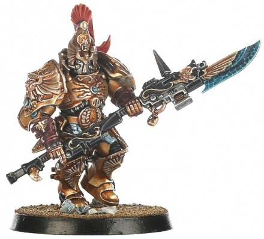
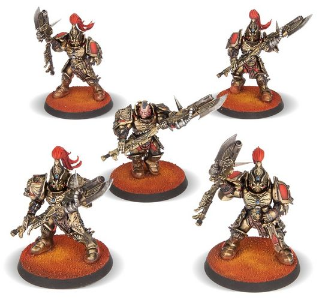

# 0174 禁军卫队 Custodian Guard

精校状态：中文行文已逐段精校，部分术语仍为暂定

分类：通用概念 / 帝国 Imperium / 中央政务部 Adeptus Terra / 禁军修会 Adeptus Custodes

原文来源：https://www.bilibili.com/opus/1058165261827309588

原作者：帝国神选罐头

原文时间：2025年04月21日 13:01

[返回分类目录](目录.md) · [全书目录](../../目录.md)

原篇名：禁军卫士 Custodian Guard

<!-- A0174-B0001 -->
**英文原文**

The Hykanatoi, sometimes simply called the Custodian Guard are one of the warrior-castes within the Adeptus Custodes. The Hykanatoi represented the main strength of the Custodian Guard.

<!-- /A0174-B0001 -->

<!-- A0174-B0002 -->

原译文

亥卡纳托，有时简称为禁军卫士，是禁军中的战士阶层之一。亥卡纳托代表了禁军卫队的主要力量。

**校订译文**

亥卡纳托有时泛称禁军卫队，是帝皇禁军的战斗阶层之一，构成禁军的主力。

<!-- /A0174-B0002 -->

<!-- A0174-B0003 图片 -->

<!-- A0174-B0004 -->

原译文

Custodian of the Hykanatoi 亥卡纳托禁军

**校订译文**

Custodian of the Hykanatoi 亥卡纳托禁军

<!-- /A0174-B0004 -->

<!-- A0174-B0005 -->
## Overview 概述

<!-- /A0174-B0005 -->

<!-- A0174-B0006 -->
**英文原文**

The Hykanatoi are Guardian Spear-equipped heavy infantry. Their numbers included the Custodian Guard proper as well as several specialized units such as the Sentinel Guard and Hetaeron Guard.

<!-- /A0174-B0006 -->

<!-- A0174-B0007 -->

原译文

亥卡纳托是配备卫士之矛的重型步兵。他们的成员包括禁军卫士以及哨戒卫士和侍从卫士等几个特殊部队。

**校订译文**

亥卡纳托是装备卫士之矛的重步兵，包括通常所称的禁军卫队，以及哨戒卫队、伴卫卫队等特种部队。

<!-- /A0174-B0007 -->

<!-- A0174-B0008 图片 -->

<!-- A0174-B0009 -->

原译文

Custodian Guards with Pyrithite Spears 配备火岩之矛的禁军卫士

**校订译文**

Custodian Guards with Pyrithite Spears 装备炙烈长矛的禁军卫队

**校注：** GW09/10 第3页 Custodian Guard with Adrasite and Pyrithite Spears 对应装备遗迹长矛或炙烈长矛的禁军卫队，按英文武器名顺序及并列对应采用炙烈长矛。

<!-- /A0174-B0009 -->

<!-- A0174-B0010 -->
## Known Members of the Hykanatoi 亥卡纳托著名成员

<!-- /A0174-B0010 -->

<!-- A0174-B0011 -->

原译文

Diocletian Coros 戴克里先·克洛斯

**校订译文**

Diocletian Coros 戴克里先·科罗斯

<!-- /A0174-B0011 -->

<!-- A0174-B0012 -->

原译文

Ra Endymion 拉·恩底弥翁

**校订译文**

Ra Endymion 拉·恩底弥翁

<!-- /A0174-B0012 -->

<!-- A0174-B0013 -->

原译文

Hanumarasi 哈奴曼拉斯

**校订译文**

Hanumarasi 哈奴曼拉斯

<!-- /A0174-B0013 -->

<!-- A0174-B0014 -->

原译文

Calaxor Tybaris 卡拉克索尔·泰巴里斯

**校订译文**

Calaxor Tybaris 卡拉克索尔·泰巴里斯

<!-- /A0174-B0014 -->

<!-- A0174-B0015 -->
## Trivia 琐事

<!-- /A0174-B0015 -->

<!-- A0174-B0016 -->
**英文原文**

The Hikanatoi were an elite Byzantine guard unit during the Middle Ages.

<!-- /A0174-B0016 -->

<!-- A0174-B0017 -->

原译文

希卡纳托伊是中世纪拜占庭的一支精英卫队。

**校订译文**

希卡纳托伊是中世纪拜占庭的一支精英卫队。

<!-- /A0174-B0017 -->

本篇核心术语与暂定项

以下列出本篇出现的英文原形及核心术语表用词。同形词可能指不同对象，具体词义以本篇正文和校注为准；单复数、别名和仅见于图注的名称可能尚未列入。完整候选见[术语表](../../术语表/双语术语候选.csv)。

| 英文 | 采用中文 | 状态 |
| --- | --- | --- |
| Adeptus Custodes | 帝皇禁军 | 官方已核对 |
| Custodian Guard | 禁军卫队 | 官方已核对 |
| Hykanatoi | 亥卡纳托 | 暂定·官方待核 |
| Hetaeron Guard | 伴卫卫队 | 暂定·官方待核 |
| Guardian Spear | 卫士之矛 | 暂定·官方待核 |

