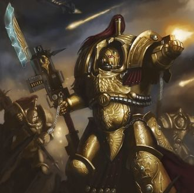
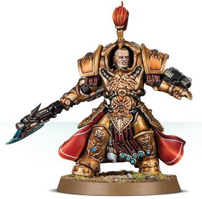

# 0175 阿拉鲁斯亲卫 Allarus Custodian

精校状态：中文行文已逐段精校，部分术语仍为暂定

分类：通用概念 / 帝国 Imperium / 中央政务部 Adeptus Terra / 禁军修会 Adeptus Custodes

原文来源：https://www.bilibili.com/opus/1219192609530970115

原作者：帝国神选罐头

原文时间：2026年06月29日 11:30

[返回分类目录](目录.md) · [全书目录](../../目录.md)

原篇名：阿拉鲁斯禁军 Allarus Custodian

<!-- A0175-B0001 -->
**英文原文**

Allarus Custodians are members of the Adeptus Custodes whose task is to kill key figures within the armies of the Imperium's enemies and eliminate key targets.

<!-- /A0175-B0001 -->

<!-- A0175-B0002 -->

原译文

阿拉鲁斯禁军是禁军修会的成员，其任务是杀死帝国之敌军队中的关键人物并消灭关键目标。

**校订译文**

阿拉鲁斯亲卫是帝皇禁军的成员，其任务是杀死帝国之敌军队中的关键人物并消灭关键目标。

<!-- /A0175-B0002 -->

<!-- A0175-B0003 图片 -->

<!-- A0175-B0004 -->

原译文

A squad of Allarus Custodians 阿拉鲁斯禁军小队

**校订译文**

A squad of Allarus Custodians 阿拉鲁斯亲卫小队

<!-- /A0175-B0004 -->

<!-- A0175-B0005 -->
## Overview 概述

<!-- /A0175-B0005 -->

<!-- A0175-B0006 -->
**英文原文**

These relentless hunters are encased within Allarus Terminator Power Armour, which comes equipped with Teleporters that allow the single-minded Allarus Custodians to quickly close with their selected targets. The standard armament of an Allarus Custodian is a Castellan Axe and wrist-mounted Balistus Grenade Launcher.

<!-- /A0175-B0006 -->

<!-- A0175-B0007 -->

原译文

这些无情的猎手被包裹在阿拉鲁斯终结者动力盔甲中，该盔甲配备了传送器，使一心一意的阿拉鲁斯禁军能够快速接近他们选择的目标。阿拉鲁斯禁军的标准武器是堡主之斧和腕戴式巴利斯图斯榴弹发射器。

**校订译文**

这些无情的猎手被包裹在阿拉鲁斯终结者动力盔甲中，该盔甲配备了传送器，使一心一意的阿拉鲁斯亲卫能够快速接近他们选择的目标。阿拉鲁斯亲卫的标准武器是堡主之斧和腕戴式巴利斯图斯榴弹发射器。

<!-- /A0175-B0007 -->

<!-- A0175-B0008 图片 -->

<!-- A0175-B0009 -->

原译文

Allarus Custodian with a Castellan Axe 配备堡主之斧的阿拉鲁斯禁军

**校订译文**

Allarus Custodian with a Castellan Axe 配备堡主之斧的阿拉鲁斯亲卫

<!-- /A0175-B0009 -->

<!-- A0175-B0010 -->
**英文原文**

Hand-picked by the Captain-General from amongst the most bellicose of their order, Allarus Custodians relish the chance to plunge into the most lethal battles. Their killer instincts are razor-sharp, their wrath honed to a fine point. Yet these are no maniacal berserkers. Where many of the galaxy’s most dangerous close-combat specialists allow their rage to drive them, Allarus Custodians leash their aggression wholly to their will. They land every blow with murderous strength, but also with surgical precision. So aggressive and heroic are these warriors that, when the situation demands, they have been known to splinter their units entirely after the initial strike and scatter through the enemy’s rear lines. Fighting as lone figures, the Allarus Custodians eliminate key targets, sow anarchy and confusion through unsuspecting forces, and completely destabilise the foe’s formation before fresh Adeptus Custodes forces arrive to end the conflict.

<!-- /A0175-B0010 -->

<!-- A0175-B0011 -->

原译文

阿拉鲁斯禁军由禁军元帅从他们修会中最好战的人中精心挑选，他们喜欢有机会投入最致命的战斗。他们的杀手本能是锋利的，他们的愤怒被磨练到了一个很好的地步。然而，这些人并不是疯狂的疯子。在银河系中许多最危险的近身格斗专家允许他们的愤怒驱使他们的地方，阿拉鲁斯禁军完全按照自己的意愿控制他们的侵略行为。他们以致命的力量，但也以外科手术般的精准，每一击都成功。这些战士如此具有侵略性和英勇，以至于在形势需要时，他们在最初的打击后会完全分裂部队，分散到敌人的后方。作为孤独的战士，阿拉鲁斯禁军消灭了关键目标，通过无戒备的部队播下无政府状态和混乱，并在新的禁军修会部队到达并结束冲突之前彻底破坏了敌人的编队。

**校订译文**

阿拉鲁斯亲卫由禁军元帅从最骁勇好战者中亲选，渴望投身最致命的战斗。他们杀戮本能敏锐，怒火凝练，却并非失控的狂战士。许多近战强者任由愤怒驱使，阿拉鲁斯亲卫则以意志彻底驾驭战意，每一击兼具致命力量与手术般精准。形势需要时，他们会在首轮打击后解散小队，分散至敌后独自作战，歼灭关键目标，在毫无防备的敌军中制造混乱，彻底瓦解其阵形，等待后续禁军部队抵达，结束战斗。

<!-- /A0175-B0011 -->

<!-- A0175-B0012 -->
## Notable Allarus Custodian Hosts 著名阿拉鲁斯亲卫军团

原题：Notable Allarus Custodian Hosts 著名阿拉鲁斯禁军天军

<!-- /A0175-B0012 -->

<!-- A0175-B0013 -->

原译文

The Gilded Fist 镀金之拳

**校订译文**

The Gilded Fist 镀金之拳

<!-- /A0175-B0013 -->

本篇核心术语与暂定项

以下列出本篇出现的英文原形及核心术语表用词。同形词可能指不同对象，具体词义以本篇正文和校注为准；单复数、别名和仅见于图注的名称可能尚未列入。完整候选见[术语表](../../术语表/双语术语候选.csv)。

| 英文 | 采用中文 | 状态 |
| --- | --- | --- |
| Adeptus Custodes | 帝皇禁军 | 官方已核对 |
| Terminator | 终结者 | 官方已核对 |
| Imperium | 帝国 | 暂定·简称 |
| Allarus Custodians | 阿拉鲁斯亲卫 | 官方已核对 |
| Captain-General | 禁军元帅 | 暂定·官方待核 |
| Power Armour | 动力盔甲 | 暂定·官方待核 |
| Captain | 连长 | 暂定·官方待核 |
| Castellan | 堡主 | 官方已核对 |
| Grenade launcher | 榴弹发射器 | 暂定·官方待核 |
| Balistus Grenade Launcher | 巴利斯图斯榴弹发射器 | 暂定·官方待核 |
| Grenade | 手榴弹 | 暂定·官方待核 |

