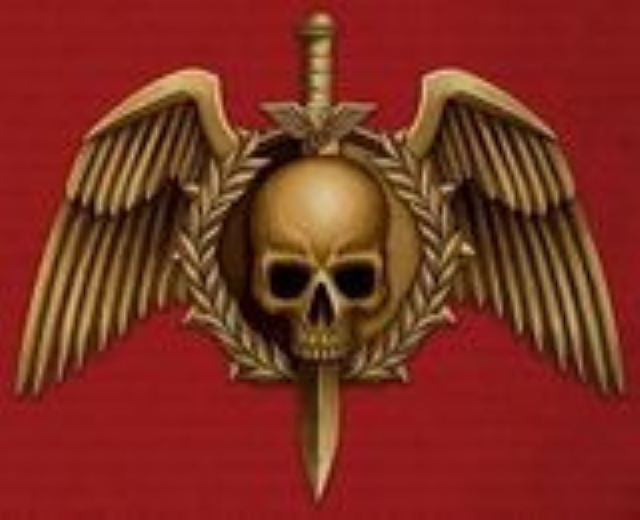
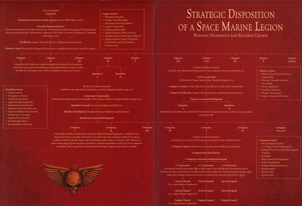

# 0176 星际战士军团 Space Marine Legion

精校状态：中文行文已逐段精校，部分术语仍为暂定

分类：通用概念 / 帝国 Imperium / 中央政务部 Adeptus Terra / 星际战士军团 Space Marine Legion

原文来源：https://www.bilibili.com/opus/994367108952358916

原作者：帝国神选罐头

原文时间：编辑于 2025年01月20日 15:05

[返回分类目录](目录.md) · [全书目录](../../目录.md)

<!-- A0176-B0001 -->
**英文原文**

The twenty Space Marine Legions, also known as the Legiones Astartes, were created by the Emperor to take part in the Great Crusade in what was later known as the First Founding. All the Space Marines of a Legion ("battle-brothers" amongst themselves) were modified with help of the DNA samples of a single Primarch. As a Primarch was found, he would receive the command of his respective Legion.

<!-- /A0176-B0001 -->

<!-- A0176-B0002 -->

原译文

二十个星际战士军团，也被称为阿斯塔特军团，是由帝皇在后来被称为初次建军时创建以参加大远征。一个军团的所有星际战士（他们之间的“战斗兄弟”）都在一个原体的DNA样本的帮助下进行了改造。当一位原体回归时，他将接过各自军团的指挥权。

**校订译文**

二十个星际战士军团，亦称阿斯塔特军团，是帝皇为大远征而创建的；这次建军后来被称为初次建军。每个军团的星际战士都利用同一位原体的 DNA 样本接受改造，彼此以“战斗兄弟”相称。每当一位原体被寻回，他就会接掌对应军团的指挥权。

<!-- /A0176-B0002 -->

<!-- A0176-B0003 图片 -->

<!-- A0176-B0004 -->

原译文

Legiones Astartes 阿斯塔特军团

**校订译文**

Legiones Astartes 阿斯塔特军团

<!-- /A0176-B0004 -->

<!-- A0176-B0005 -->
**英文原文**

Parent Agency: Imperium of Man

<!-- /A0176-B0005 -->

<!-- A0176-B0006 -->

原译文

隶属：人类帝国

**校订译文**

隶属：人类帝国

<!-- /A0176-B0006 -->

<!-- A0176-B0007 -->
**英文原文**

Leader: Emperor of Mankind, Warmaster Horus

<!-- /A0176-B0007 -->

<!-- A0176-B0008 -->

原译文

领导者：人类帝皇，战帅荷鲁斯

**校订译文**

领导者：人类帝皇，战帅荷鲁斯

<!-- /A0176-B0008 -->

<!-- A0176-B0009 -->
**英文原文**

Armed Forces: 20 Legions

<!-- /A0176-B0009 -->

<!-- A0176-B0010 -->

原译文

武装力量：20个军团

**校订译文**

武装力量：20个军团

<!-- /A0176-B0010 -->

<!-- A0176-B0011 -->
**英文原文**

Established: Late Unification Wars

<!-- /A0176-B0011 -->

<!-- A0176-B0012 -->

原译文

建立：统一战争后

**校订译文**

建立：统一战争末期

<!-- /A0176-B0012 -->

<!-- A0176-B0013 -->
**英文原文**

Dissolved: Post-Horus Heresy (Loyalist Legions) Some Traitor Legions still active

<!-- /A0176-B0013 -->

<!-- A0176-B0014 -->

原译文

解散：荷鲁斯叛乱后（忠诚军团）一些叛徒军团仍然活跃

**校订译文**

解散：荷鲁斯之乱结束后（忠诚派军团）；部分叛徒军团仍然存在。

<!-- /A0176-B0014 -->

<!-- A0176-B0015 -->
###### History 历史

<!-- /A0176-B0015 -->

<!-- A0176-B0016 -->
## Great Crusade and Horus Heresy 大远征与荷鲁斯之乱

原题：Great Crusade and Horus Heresy 大远征与荷鲁斯叛乱

<!-- /A0176-B0016 -->

<!-- A0176-B0017 -->
**英文原文**

The Legiones Astartes were originally created by the Emperor and his gene-wrights in the closing days of the Unification Wars and the extinction of their predecessors, the Thunder Warriors. The new Astartes had superior lifespans and discipline to the Thunder Warriors, and were intended by the Emperor to spearhead his coming Great Crusade. Each of the twenty Legions were created from gene-seed derived from a single Primarch, which were themselves maturing deep under the Himalayan Mountains before they were stolen away from the Forces of Chaos. However while the Gene-Seed was created by the Emperor, it was perfected and mass-produced by the Gene-Cults of Luna after they were pacified by the early Astartes. The combat debut of the Legiones Astartes occurred towards the end of the Unification Wars when they fought rebellious Thunder Warriors in the Palace Coup.

<!-- /A0176-B0017 -->

<!-- A0176-B0018 -->

原译文

阿斯塔特军团最初是由帝皇创造的，他的基因在统一战争的最后几天以及他们的前辈雷霆战士的灭绝中发挥了作用。新的阿斯塔特的寿命和纪律都优于雷霆战士，帝皇打算将他们作为即将到来的大远征的先锋。二十个军团中的每一个都是由一个原体的基因种子创建的，这些原体本身在喜马拉雅山脉深处成熟，然后被混沌力量偷走。然而，虽然基因种子是由帝皇创造的，但在早期阿斯塔特平息了月球的基因教派后，它们才被完善并大规模生产。军团的首次战斗是在统一战争接近尾声时，他们在皇宫政变中与反叛的雷霆战士作战。

**校订译文**

阿斯塔特军团由帝皇及其基因工匠创建于统一战争末期，正值其前身雷霆战士遭到消灭之际。阿斯塔特的寿命与纪律性都优于雷霆战士，帝皇计划让他们充当即将开始的大远征的先锋。二十个军团分别使用源自一位原体的基因种子创建；这些原体原本在喜马拉雅山脉深处孕育，后来遭混沌势力掳走。基因种子虽由帝皇创造，但其完善和大规模生产，则由早期阿斯塔特征服月球后臣服的月球基因教派完成。阿斯塔特军团首次投入实战是在统一战争末期的皇宫政变中，对手是反叛的雷霆战士。

**校注：** 英文原句 stolen away from the Forces of Chaos 的介词疑有误；依本句事件关系及上下文译为遭混沌势力掳走。

<!-- /A0176-B0018 -->

<!-- A0176-B0019 图片 -->

<!-- A0176-B0020 -->

原译文

The Luna Wolves during the Great Crusade 大远征期间的影月苍狼

**校订译文**

The Luna Wolves during the Great Crusade 大远征期间的影月苍狼

<!-- /A0176-B0020 -->

<!-- A0176-B0021 -->
**英文原文**

During the subsequent Great Crusade, the twenty Legiones Astartes were the tip of the Emperor's spear in his conquest of much of the galaxy. Gradually, the twenty lost Primarchs were reunified with their respective Legion and led them to further glories, where they would begin to establish unique identities for themselves. However some point during the Great Crusade, two of the legions were erased from all records for unknown reasons.

<!-- /A0176-B0021 -->

<!-- A0176-B0022 -->

原译文

在随后的大远征中，二十个阿斯塔特军团是帝皇征服银河系大部分地区的矛头。渐渐地，二十位失踪的原体与他们各自的军团重新团聚，并带领他们走向更辉煌的未来，在那里他们将开始为自己树立独特的身份。然而，在大远征的某个时刻，由于未知的原因，其中两个军团被从所有记录中抹去。

**校订译文**

在随后的大远征中，二十个阿斯塔特军团成为帝皇征服银河大片区域的先锋。失散的原体陆续与各自的军团重聚，带领军团再创辉煌；各军团也逐渐形成了独特的风貌。然而，大远征期间，其中两个军团因不明原因从所有记录中遭到抹除。

**校注：** 原文先泛称二十位原体重聚，随后又提到两军团被抹除；译文不据此补定两位失落原体的具体经历。

<!-- /A0176-B0022 -->

<!-- A0176-B0023 -->
**英文原文**

During the Horus Heresy, nine of the eighteen remaining Legions sided with Warmaster Horus against the Emperor. After the Battle of Terra, these fled into the Eye of Terror where many fragmented into disparate warbands that continue to plague the Imperium to this day. The remaining loyalist Legions were broken up by Roboute Guilliman as per the new Codex Astartes. The Space Marine Legions effectively ceased to exist after this act, succeeded by hundreds of new Chapters.

<!-- /A0176-B0023 -->

<!-- A0176-B0024 -->

原译文

在荷鲁斯叛乱期间，剩下的18个军团中有9个站在战帅荷鲁斯一边反对帝皇。泰拉之战后，这些人逃到了恐惧之眼，在那里，许多人分裂成不同的战帮，这些战帮一直困扰着帝国直到今天。根据新的阿斯塔特圣典，剩下的忠诚军团被罗伯特·基里曼解散。在这一法案之后，星际战士军团实际上已经不复存在，取而代之的是数百个新的战团。

**校订译文**

荷鲁斯之乱期间，余下十八个军团中有九个追随战帅荷鲁斯，反抗帝皇。泰拉之战后，叛徒军团逃入恐惧之眼，其中许多分裂为各自为战的战帮，持续侵扰帝国。罗保特·基里曼则依照新制定的《阿斯塔特圣典》，将忠诚派军团拆分重组。此后，忠诚派的星际战士军团编制实际上不复存在，取而代之的是数百个新战团。

<!-- /A0176-B0024 -->

<!-- A0176-B0025 -->
###### Organization 组织

<!-- /A0176-B0025 -->

<!-- A0176-B0026 -->
**英文原文**

A significant portion of the early Legions' organization was deeply rooted in the time-honored Terran models of strategy, hierarchy, and function found within the revered texts of the Principia Belicosa. The Emperor's ingenuity further enhanced this framework, providing an adaptable strategic approach that complemented the extraordinary strengths and abilities of the Legionaries themselves. The chain of command operated with clarity, with Legion officers leading their troops into battle personally.

<!-- /A0176-B0026 -->

<!-- A0176-B0027 -->

原译文

早期军团组织的很大一部分深深植根于历史悠久的人族战略、等级制度和职能模式，这些模式在军团组织法典的受人尊敬的文本中有所体现。帝皇的聪明才智进一步加强了这一框架，提供了一种适应性强的战略方法，补充了军团本身的非凡优势和能力。指挥链运作清晰，军团军官亲自率领部队投入战斗。

**校订译文**

早期军团的组织方式，大量沿袭了泰拉古老的战略、等级与职能划分模式；这些模式见于备受尊崇的《军团组织法典》。帝皇又加以改良，使这套框架能够灵活运用战略，充分发挥军团战士的超凡优势与能力。其指挥体系明确，军官会亲自率领部队投入战斗。

<!-- /A0176-B0027 -->

<!-- A0176-B0028 图片 -->

<!-- A0176-B0029 -->

原译文

Organization of a Space Marine Legion 星际战士军团组织

**校订译文**

Organization of a Space Marine Legion 星际战士军团组织

<!-- /A0176-B0029 -->

<!-- A0176-B0030 -->
**英文原文**

At the head of the Legion was its Primarch, seconded by Command structures who oversaw the Legion's organization. Below this were the Chapters of the Legion, each of which was commanded by a Lord Commander. Each Chapter in turn was divided into a number of Battalions, each of which was further divided into Companies. The Company, itself divided into a number of Squads, was the basic military division of the Legio Astartes. Due to the varying sizes of each Legion, there was no fixed number of how many Chapters, Companies, and Squads a Legion could contain.

<!-- /A0176-B0030 -->

<!-- A0176-B0031 -->

原译文

军团的首领是其原体，由监督军团组织的指挥机构借调。下面是军团的各个战团，每个战团都由一位领主指挥官指挥。每战团又分为若干战斗营，每个战斗营又分为连队。连队本身分为多个小队，是阿斯塔特军团的基本军事单位。由于每个军团的规模各不相同，一个军团可以包含多少个战团、连队和小队并没有固定的数量。

**校订译文**

军团由原体统领，负责组织管理的指挥机构从旁协助。其下设若干战团，各由一位领主指挥官指挥。战团再分为营，营下辖连队，连队下辖小队。连队是阿斯塔特军团的基本军事编制。由于各军团规模不同，所辖战团、连队和小队的数量也不固定。

<!-- /A0176-B0031 -->

<!-- A0176-B0032 -->
**英文原文**

Nominally , the structure of a Legion should have been as follows:

<!-- /A0176-B0032 -->

<!-- A0176-B0033 -->

原译文

名义上，军团的结构应该如下：

**校订译文**

名义上，军团的结构应该如下：

<!-- /A0176-B0033 -->

<!-- A0176-B0034 -->
**英文原文**

Each chapter should be 2 Battalions strong, each Battalion composed of 5 companies numbering 100 Legionaries, as well as various specialists and support staff.

<!-- /A0176-B0034 -->

<!-- A0176-B0035 -->

原译文

每战团应由2个战斗营组成，每个战斗营由5个连队组成，每个连队有100名军团士兵，以及各种专家和支援人员。

**校订译文**

每战团应由2个战斗营组成，每个战斗营由5个连队组成，每个连队有100名军团士兵，以及各种专家和支援人员。

<!-- /A0176-B0035 -->

<!-- A0176-B0036 -->
**英文原文**

The Ist company was composed of Veterans, the II, III and IV of line companies, and the Vth of specialists troops.

<!-- /A0176-B0036 -->

<!-- A0176-B0037 -->

原译文

第一连由老兵组成、第二、第三和第四线列连以及特种部队第五连。

**校订译文**

第一连由老兵组成；第二、第三和第四连为战线连队；第五连由专门兵种组成。

<!-- /A0176-B0037 -->

<!-- A0176-B0038 -->
**英文原文**

Despite the standard template organization, it seems a lot of Legions went against this organizational layout. For instance, a single World Eaters Chapter during the Battle of Beta-Garmon consisted of 5,000 Legionnaires (5x the "standard" size).

<!-- /A0176-B0038 -->

<!-- A0176-B0039 -->

原译文

尽管有标准的组织模版，但似乎很多军团都反对这种组织布局。例如，在贝塔·伽蒙战役期间，一个吞世者战团由5000名军团士兵组成（是“标准”尺寸的5倍）。

**校订译文**

虽然存在标准编制模板，许多军团却并不遵循。例如，贝塔·伽蒙战役期间，吞世者的一个战团就有 5,000 名军团战士，是“标准”规模的五倍。

<!-- /A0176-B0039 -->

<!-- A0176-B0040 -->
## Strategic Disposition of a Space Marine Legion 星际战士军团的战略部署

<!-- /A0176-B0040 -->

<!-- A0176-B0041 -->
### Hierarchical Level 编制层级

原题：Hierarchical Level 分层层次

<!-- /A0176-B0041 -->

<!-- A0176-B0042 -->
### Command Structure 指挥结构

<!-- /A0176-B0042 -->

<!-- A0176-B0043 -->
### Available Assets 可用资产

<!-- /A0176-B0043 -->

<!-- A0176-B0044 -->
## LEGION 军团

<!-- /A0176-B0044 -->

<!-- A0176-B0045 -->

原译文

Primarch 原体

**校订译文**

Primarch 原体

<!-- /A0176-B0045 -->

<!-- A0176-B0046 -->

原译文

Praetorate 执政官

**校订译文**

Praetorate 执政官团

<!-- /A0176-B0046 -->

<!-- A0176-B0047 -->

原译文

Consular Representatives 军团百夫长

**校订译文**

Consular Representatives 领事代表

<!-- /A0176-B0047 -->

<!-- A0176-B0048 -->

原译文

Vexillarius 禁卫

**校订译文**

Vexillarius 旗手

<!-- /A0176-B0048 -->

<!-- A0176-B0049 -->

原译文

Honour Guard 荣誉卫队

**校订译文**

Honour Guard 荣誉卫队

<!-- /A0176-B0049 -->

<!-- A0176-B0050 -->

原译文

Planetary Domains 行星领地

**校订译文**

Planetary Domains 行星领地

<!-- /A0176-B0050 -->

<!-- A0176-B0051 -->

原译文

Capital Class War Ships 主力级战舰

**校订译文**

Capital Class War Ships 主力级战舰

<!-- /A0176-B0051 -->

<!-- A0176-B0052 -->

原译文

Secondary Escort Squadrons 次级护航舰队

**校订译文**

Secondary Escort Squadrons 次级护航舰队

<!-- /A0176-B0052 -->

<!-- A0176-B0053 -->

原译文

Legion Armourium 军团军械库

**校订译文**

Legion Armourium 军团军械库

<!-- /A0176-B0053 -->

<!-- A0176-B0054 -->

原译文

Legion Apothecarion 军团医疗部

**校订译文**

Legion Apothecarion 军团药剂部

<!-- /A0176-B0054 -->

<!-- A0176-B0055 -->

原译文

Legion Librarius 军团智库馆

**校订译文**

Legion Librarius 军团智库

<!-- /A0176-B0055 -->

<!-- A0176-B0056 -->

原译文

Auxiliary Forces 辅助军

**校订译文**

Auxiliary Forces 辅助军

<!-- /A0176-B0056 -->

<!-- A0176-B0057 -->

原译文

Legion Support Corps 军团支援部队

**校订译文**

Legion Support Corps 军团支援部队

<!-- /A0176-B0057 -->

<!-- A0176-B0058 -->
## CHAPTER 战团

<!-- /A0176-B0058 -->

<!-- A0176-B0059 -->

原译文

1000 Legionaries (2 Battalions) 1000军团士兵（2战斗营）

**校订译文**

1000 Legionaries (2 Battalions) 1000军团士兵（2战斗营）

<!-- /A0176-B0059 -->

<!-- A0176-B0060 -->

原译文

Lord Commander 领主指挥官

**校订译文**

Lord Commander 领主指挥官

<!-- /A0176-B0060 -->

<!-- A0176-B0061 -->

原译文

Chapter Consuls 战团领事官

**校订译文**

Chapter Consuls 战团领事官

<!-- /A0176-B0061 -->

<!-- A0176-B0062 -->

原译文

Chapter Vexillarius 战团禁卫

**校订译文**

Chapter Vexillarius 战团旗手

<!-- /A0176-B0062 -->

<!-- A0176-B0063 -->

原译文

Chapter Command Bodyguard 战团指挥卫队

**校订译文**

Chapter Command Bodyguard 战团指挥卫队

<!-- /A0176-B0063 -->

<!-- A0176-B0064 -->

原译文

Chapter Flagship Battle Barge / Capital Ship 战团旗舰战斗驳船/主力舰

**校订译文**

Chapter Flagship Battle Barge / Capital Ship 战团旗舰战斗驳船/主力舰

<!-- /A0176-B0064 -->

<!-- A0176-B0065 -->

原译文

Planetary Assault Craft and Drop Ships 星球突击飞行器与空降船

**校订译文**

Planetary Assault Craft and Drop Ships 星球突击飞行器与空降船

<!-- /A0176-B0065 -->

<!-- A0176-B0066 -->

原译文

Escort Squadrons 护航舰队

**校订译文**

Escort Squadrons 护航舰队

<!-- /A0176-B0066 -->

<!-- A0176-B0067 -->

原译文

Gunship Squadrons 炮艇中队

**校订译文**

Gunship Squadrons 炮艇中队

<!-- /A0176-B0067 -->

<!-- A0176-B0068 -->

原译文

Chapter Armourium 战团军械库

**校订译文**

Chapter Armourium 战团军械库

<!-- /A0176-B0068 -->

<!-- A0176-B0069 -->

原译文

Legion Armoured Divisions 军团装甲分队

**校订译文**

Legion Armoured Divisions 军团装甲分队

<!-- /A0176-B0069 -->

<!-- A0176-B0070 -->
## BATTALION 战斗营

<!-- /A0176-B0070 -->

<!-- A0176-B0071 -->

原译文

500 Legionaries (5 Companies) 500军团士兵（5连队）

**校订译文**

500 Legionaries (5 Companies) 500军团士兵（5连队）

<!-- /A0176-B0071 -->

<!-- A0176-B0072 -->

原译文

Lieutenant Commander 副指挥官

**校订译文**

Lieutenant Commander 副指挥官

<!-- /A0176-B0072 -->

<!-- A0176-B0073 -->

原译文

Battalion Consuls 营部领事官

**校订译文**

Battalion Consuls 营部领事官

<!-- /A0176-B0073 -->

<!-- A0176-B0074 -->

原译文

Battalion Vexillarius 营部禁卫

**校订译文**

Battalion Vexillarius 营旗手

<!-- /A0176-B0074 -->

<!-- A0176-B0075 -->

原译文

Battalion Command Bodyguard 营部指挥卫队

**校订译文**

Battalion Command Bodyguard 营部指挥卫队

<!-- /A0176-B0075 -->

<!-- A0176-B0076 -->

原译文

Strike Cruisers 打击巡洋舰

**校订译文**

Strike Cruisers 打击巡洋舰

<!-- /A0176-B0076 -->

<!-- A0176-B0077 -->

原译文

Navigators Ordinary 普通导航者

**校订译文**

Navigators Ordinary 常任导航员

<!-- /A0176-B0077 -->

<!-- A0176-B0078 -->

原译文

Drop Pods and Rams 空降仓与空降艇

**校订译文**

Drop Pods and Rams 空降舱与撞击登陆艇

<!-- /A0176-B0078 -->

<!-- A0176-B0079 -->

原译文

Light Gunship Squadrons 轻型炮艇中队

**校订译文**

Light Gunship Squadrons 轻型炮艇中队

<!-- /A0176-B0079 -->

<!-- A0176-B0080 -->

原译文

Super-heavy Detachments 超重型载具分遣队

**校订译文**

Super-heavy Detachments 超重型载具分遣队

<!-- /A0176-B0080 -->

<!-- A0176-B0081 -->

原译文

Skimmer Strike Detachments 悬浮艇打击分遣队

**校订译文**

Skimmer Strike Detachments 悬浮艇打击分遣队

<!-- /A0176-B0081 -->

<!-- A0176-B0082 -->

原译文

Support Artillery Detachements 炮兵支援分遣队

**校订译文**

Support Artillery Detachements 炮兵支援分遣队

<!-- /A0176-B0082 -->

<!-- A0176-B0083 -->

原译文

Techmarine Covenants 技术军士组

**校订译文**

Techmarine Covenants 科技战士组

<!-- /A0176-B0083 -->

<!-- A0176-B0084 -->

原译文

Apothecarions Sections 药剂师组

**校订译文**

Apothecarions Sections 药剂师组

<!-- /A0176-B0084 -->

<!-- A0176-B0085 -->

原译文

Dreadnought Talon 无畏机甲进攻分队

**校订译文**

Dreadnought Talon 无畏机甲进攻分队

<!-- /A0176-B0085 -->

<!-- A0176-B0086 -->

原译文

Reconnaissance Sections 侦查分队

**校订译文**

Reconnaissance Sections 侦察分队

<!-- /A0176-B0086 -->

<!-- A0176-B0087 -->
## COMPANY 连队

<!-- /A0176-B0087 -->

<!-- A0176-B0088 -->

原译文

100 Legionaries 100军团士兵

**校订译文**

100 Legionaries 100军团士兵

<!-- /A0176-B0088 -->

<!-- A0176-B0089 -->

原译文

Company Captain 连队长

**校订译文**

Company Captain 连队长

<!-- /A0176-B0089 -->

<!-- A0176-B0090 -->

原译文

Company Standard Bearer 连队旗手

**校订译文**

Company Standard Bearer 连队旗手

<!-- /A0176-B0090 -->

<!-- A0176-B0091 -->

原译文

Lieutenant 副官

**校订译文**

Lieutenant 副官

<!-- /A0176-B0091 -->

<!-- A0176-B0092 -->

原译文

Tactical Squad 战术小队

**校订译文**

Tactical Squad 战术小队

<!-- /A0176-B0092 -->

<!-- A0176-B0093 -->

原译文

Heavy Support Squads 重型支援小队

**校订译文**

Heavy Support Squads 重型支援小队

<!-- /A0176-B0093 -->

<!-- A0176-B0094 -->

原译文

Assigned Veteran or Specialist Squads 特遣老兵或专业化小队

**校订译文**

Assigned Veteran or Specialist Squads 特遣老兵或专业化小队

<!-- /A0176-B0094 -->

<!-- A0176-B0095 -->

原译文

Gunships 炮艇

**校订译文**

Gunships 炮艇

<!-- /A0176-B0095 -->

<!-- A0176-B0096 -->

原译文

Rhino Armoured Transports 犀牛装甲运输车

**校订译文**

Rhino Armoured Transports 犀牛装甲运输车

<!-- /A0176-B0096 -->

<!-- A0176-B0097 -->

原译文

Tank Detachments 坦克分遣队

**校订译文**

Tank Detachments 坦克分遣队

<!-- /A0176-B0097 -->

<!-- A0176-B0098 -->

原译文

Support Weapons Batteries 支援武器平台

**校订译文**

Support Weapons Batteries 支援武器平台

<!-- /A0176-B0098 -->

<!-- A0176-B0099 -->

原译文

Dreadnoughts 无畏机甲

**校订译文**

Dreadnoughts 无畏机甲

<!-- /A0176-B0099 -->

<!-- A0176-B0100 -->

原译文

Techmarines 技术军士

**校订译文**

Techmarines 科技战士

<!-- /A0176-B0100 -->

<!-- A0176-B0101 -->

原译文

Apothecaries 药剂师

**校订译文**

Apothecaries 药剂师

<!-- /A0176-B0101 -->

<!-- A0176-B0102 -->
## Divergence between Legions 军团之间的差异

原题：Divergence between Legions 军团之间的分歧

<!-- /A0176-B0102 -->

<!-- A0176-B0103 -->
**英文原文**

Throughout the two centuries of the Great Crusade, the Terran Legions underwent myriad transformations. Influences from the worlds they recruited from and the development of customs and hierarchies within each Legion played pivotal roles. The discovery of the Primarchs further reshaped the Legions, imprinting their own personalities and will onto their respective forces. This process led to the rewriting of entire cultural, traditional, and ideological paradigms within the Legions. As a result, the regimens of training and indoctrination within each Legion diverged significantly, with many abandoning the strictures, doctrines, and terminology of the Principia Belicosa to tailor themselves to preferred styles of warfare. By the conclusion of the Great Crusade, each Legion had developed its own distinct character. These unique identities within the once-united body of the Legiones Astartes fostered rivalries and, eventually, feuds that would be exploited during the Horus Heresy.

<!-- /A0176-B0103 -->

<!-- A0176-B0104 -->

原译文

在大远征的两个世纪里，人类军团经历了无数的转变。来自他们的募兵世界的影响以及每个军团内部习俗和等级制度的发展发挥了关键作用。原体的回归进一步重塑了军团，将他们自己的个性和意志铭刻在各自的武装上。这一过程导致了军团内部整个文化、传统和意识形态范式的重写。因此，每个军团内部的训练和灌输方案存在显著差异，许多人放弃了军团组织法典的限制、理论和术语，以适应原体的战争风格。到大远征结束时，每个军团都发展出了自己独特的性格。这些独特的身份在曾经团结的阿斯塔特军团内助长了竞争，并最终导致了在荷鲁斯叛乱期间被利用的争斗。

**校订译文**

在长达两个世纪的大远征中，源自泰拉的军团经历了种种变化。征兵世界的影响，以及军团内部习俗和等级制度的发展，都起到了关键作用。原体的回归进一步重塑了军团，将各自的性格与意志烙印在部队之中。军团的文化、传统与思想体系随之彻底改观，各自的训练和思想灌输方式也愈发不同。许多军团不再遵循《军团组织法典》的规章、战术条令与术语，而是按自己偏好的作战方式重新调整。到大远征结束时，每个军团都已形成鲜明的个性。这些差异让原本团结的阿斯塔特军团之间滋生竞争，最终演变成仇怨，并在荷鲁斯之乱中被人利用。

<!-- /A0176-B0104 -->

<!-- A0176-B0105 -->
###### Number of Legionaries 军团士兵的数量

<!-- /A0176-B0105 -->

<!-- A0176-B0106 -->
**英文原文**

The Legions were massive armies, and the size of each could vary tremendously. A precise number was never truly achieved and maintained. Even during the Great Crusade, some Legions were very numerous, while others were not. The numbers would always vary with new recruits and inevitable battle-losses, and also important was the availability of potential recruits and the administrative skills of the Primarch and his officers.

<!-- /A0176-B0106 -->

<!-- A0176-B0107 -->

原译文

军团是一支庞大的军队，每支军队的规模可能差异很大。从未真正实现和保持一个精确的数字。即使在大远征期间，一些军团也非常庞大，而另一些则没有。人数总是随着新兵和不可避免的战斗损失而变化，潜在新兵的可用性以及原体及其军官的管理技能也很重要。

**校订译文**

军团是规模庞大的军队，但各军团的人数差异极大，从未长期保持某个固定的精确数目。即使在大远征期间，有些军团兵力雄厚，有些则人手较少。招募新兵和不可避免的战损使人数不断变化；兵源是否充足，以及原体和军官的管理能力，也都会影响军团规模。

<!-- /A0176-B0107 -->

<!-- A0176-B0108 -->
**英文原文**

The most numerous Legion of all was the Ultramarines. The Thousand Sons of Magnus were of a small number as many of them had developed mutations or uncontrollable levels of psychic powers. Fulgrim's samples had been largely lost, and this left the Legion of the Emperor's Children also with a very small number. Both of these Legions would increase their numbers to acceptable standards only after their Primarchs were found.

<!-- /A0176-B0108 -->

<!-- A0176-B0109 -->

原译文

在所有军团中，人数最多的是极限战士。马格努斯的千子最少，因为他们中的许多人已经展现出突变或无法控制的灵能力量水平。福格瑞姆的样本大部分已经丢失，这使得帝皇之子军团也只有很少的数量。只有在找到他们的原体后，这两个军团才将人数增加到可接受的标准。

**校订译文**

极限战士是人数最多的军团。马格努斯麾下的千子人数较少，因为许多成员发生了突变，或灵能强度变得难以控制。福格瑞姆的基因样本大多遗失，也使帝皇之子军团长期兵力稀少。这两个军团都在寻回各自原体后，才将人数恢复到可以接受的水平。

<!-- /A0176-B0109 -->

<!-- A0176-B0110 -->
**英文原文**

The approximate sizes of a few of the Legions at the start of the Heresy have been given in various sources:

<!-- /A0176-B0110 -->

<!-- A0176-B0111 -->

原译文

叛乱开始时，一些军团的大致规模已在各种来源中给出：

**校订译文**

叛乱开始时，一些军团的大致规模已在各种来源中给出：

<!-- /A0176-B0111 -->

<!-- A0176-B0112 -->

原译文

Ultramarines 极限战士— 250,000

**校订译文**

Ultramarines 极限战士

<!-- /A0176-B0112 -->

<!-- A0176-B0113 -->

原译文

Dark Angels 黑暗天使— 200,000-

**校订译文**

Dark Angels 黑暗天使

**校注：** 原文人数标为 200,000-，末尾连字符含义不明；保留原式，未擅改为上限或下限。

<!-- /A0176-B0113 -->

<!-- A0176-B0114 -->

原译文

Iron Warriors 钢铁勇士— 150,000 ~ 180,000

**校订译文**

Iron Warriors 钢铁勇士— 150,000 ~ 180,000

<!-- /A0176-B0114 -->

<!-- A0176-B0115 -->

原译文

Sons of Horus 荷鲁斯之子— 130,000 ~ 170,000

**校订译文**

Sons of Horus 荷鲁斯之子— 130,000 ~ 170,000

<!-- /A0176-B0115 -->

<!-- A0176-B0116 -->

原译文

World Eaters 吞世者— 150,000

**校订译文**

World Eaters 吞世者

<!-- /A0176-B0116 -->

<!-- A0176-B0117 -->

原译文

Word Bearers 怀言者— 100,000 ~ 150,000

**校订译文**

Word Bearers 怀言者— 100,000 ~ 150,000

<!-- /A0176-B0117 -->

<!-- A0176-B0118 -->

原译文

Blood Angels 圣血天使— 120,000

**校订译文**

Blood Angels 圣血天使

<!-- /A0176-B0118 -->

<!-- A0176-B0119 -->

原译文

Night Lords 午夜领主— 90,000 ~ 120,000

**校订译文**

Night Lords 午夜领主— 90,000 ~ 120,000

<!-- /A0176-B0119 -->

<!-- A0176-B0120 -->

原译文

Iron Hands 钢铁之手— 113,000

**校订译文**

Iron Hands 钢铁之手— 113,000

<!-- /A0176-B0120 -->

<!-- A0176-B0121 -->

原译文

Emperor's Children 帝皇之子— 110,000

**校订译文**

Emperor's Children 帝皇之子

<!-- /A0176-B0121 -->

<!-- A0176-B0122 -->

原译文

Imperial Fists 帝国之拳— 100,000+

**校订译文**

Imperial Fists 帝国之拳— 100,000+

<!-- /A0176-B0122 -->

<!-- A0176-B0123 -->

原译文

Space Wolves 太空野狼— 95,000 ~ 100,000

**校订译文**

Space Wolves 太空野狼

<!-- /A0176-B0123 -->

<!-- A0176-B0124 -->

原译文

Death Guard 死亡守卫— 95,000

**校订译文**

Death Guard 死亡守卫

<!-- /A0176-B0124 -->

<!-- A0176-B0125 -->

原译文

White Scars 白色伤疤— 95,000

**校订译文**

White Scars 白疤— 95,000

<!-- /A0176-B0125 -->

<!-- A0176-B0126 -->

原译文

Alpha Legion 阿尔法军团— 90,000 ~ 180,000

**校订译文**

Alpha Legion 阿尔法军团— 90,000 ~ 180,000

<!-- /A0176-B0126 -->

<!-- A0176-B0127 -->

原译文

Salamanders 火蜥蜴— 89,000

**校订译文**

Salamanders 火蜥蜴— 89,000

<!-- /A0176-B0127 -->

<!-- A0176-B0128 -->

原译文

Raven Guard 暗鸦守卫— 80,000

**校订译文**

Raven Guard 暗鸦守卫— 80,000

<!-- /A0176-B0128 -->

<!-- A0176-B0129 -->

原译文

Thousand Sons 千子— 85,000

**校订译文**

Thousand Sons 千子

<!-- /A0176-B0129 -->

<!-- A0176-B0130 -->
**英文原文**

The Legion size issue is contentious, with several types of numbers mentioned in separate sources meant to reflect a general or nominally-sized legion. As well as numbers directly given in sources themselves, several authors have commented on the issue. Pressed with questions about pre-Heresy organisation - although declaring there is not any real information about it — Andy Chambers answered that "Space Marines started out in Legions of approximately 10,000 strong (or more, depending on the specific legion), which were broken down into Chapter-sized Great Companies rather like the Space Wolves (who are renowned for not adopting the Codex Astartes alterations made by Guilliman post-heresy and who thus follow pre-heresy organisation more closely)".

<!-- /A0176-B0130 -->

<!-- A0176-B0131 -->

原译文

军团规模问题是有争议的，在不同的来源中提到了几种类型的数字，旨在反映一个一般或名义上规模的军团。除了来源本身直接给出的数字外，几位作者也对这个问题发表了评论。当被问及有关叛乱前组织的问题时——尽管声称没有任何关于它的真实信息——安迪·钱伯斯回答说：“星际战士最初是由大约1万人（或更多，取决于具体的军团）组成的军团组成的，这些军团被分解成战团级的大连，就像太空野狼一样（他们以不采用基里曼在叛乱后对阿斯塔特圣典的修改而闻名，因此更密切地遵循叛乱前的组织）”。

**校订译文**

关于军团规模，不同资料的记述颇有分歧：若干来源以不同数字描述普通军团或其名义编制。除资料中直接列出的人数外，也有作者对此作过说明。安迪·钱伯斯在回答荷鲁斯之乱前的编制问题时，虽先表示并没有确切资料，仍解释道：“星际战士最初以军团为编制，每个军团约一万人，具体军团也可能更多。军团之下分为战团规模的大连，与太空野狼类似。太空野狼以未采纳基里曼在叛乱后推行的《阿斯塔特圣典》改革而闻名，因此保留了更多叛乱前的组织方式。”

<!-- /A0176-B0131 -->

<!-- A0176-B0132 -->
**英文原文**

Note 1: In The Crimson Fist (Novella) it is mentioned that 20,000 Imperial Fists constituted one-fifth of the entire Legion, making 100,000 the likely number.

<!-- /A0176-B0132 -->

<!-- A0176-B0133 -->

原译文

注1：在绯红之拳（中篇小说）中提到，20000名帝国之拳占整个军团的五分之一，可能达到100000名。

**校订译文**

注 1：中篇小说《绯红之拳》提到，20,000 名帝国之拳占全军团的五分之一，据此推算，军团总人数应为 100,000。

<!-- /A0176-B0133 -->

<!-- A0176-B0134 -->
**英文原文**

Before the Word Bearers invasion of the Boros Gate it is mentioned that the Black Legion's strength is unparalleled and that their ranks outnumbered the Word Bearers by almost ten to one. If at that point the Word Bearers kept the ranks at the size of 100,000 space marines it means the Black Legion had vastly increased their numbers to around 1,000,000 space marines.

<!-- /A0176-B0134 -->

<!-- A0176-B0135 -->

原译文

在怀言者入侵波洛斯门之前，有人提到黑色军团的力量是无与伦比的，他们的队伍几乎是怀言者的十倍。如果在那时，怀言者将队伍保持在10万名星际战士的规模，这意味着黑色军团的人数大大增加，到了约100万名星际战士。

**校订译文**

在怀言者入侵波洛斯门之前，有人提到黑色军团的力量是无与伦比的，他们的队伍几乎是怀言者的十倍。如果在那时，怀言者将队伍保持在10万名星际战士的规模，这意味着黑色军团的人数大大增加，到了约100万名星际战士。

<!-- /A0176-B0135 -->

<!-- A0176-B0136 -->
**英文原文**

Note 2: Further down the page of the cited source, Betrayal states that this number is leading up to Istvaan III. After the conflict, some 60,000 Sons of Horus Astartes were lost, some of which are the Loyalists. After the betrayal at Istvaan III, the current numbers of the Sons of Horus are estimated to be 70,000-110,000.

<!-- /A0176-B0136 -->

<!-- A0176-B0137 -->

原译文

注2：在引用的消息来源的下一册-背叛表示，这个数字源于伊斯塔万三号。冲突后，约有6万名荷鲁斯之子的阿斯塔特丧生，其中一些是忠诚派。在伊斯塔万三号的背叛后，荷鲁斯之子目前的人数估计为7万至11万。

**校订译文**

注 2：所引《背叛》同一页面的后文说明，这一数字对应伊斯塔万三号事件之前。该战役使荷鲁斯之子损失了约 60,000 名阿斯塔特，其中包括忠诚派成员。因此，伊斯塔万三号背叛事件之后，荷鲁斯之子的人数估计为 70,000—110,000。

<!-- /A0176-B0137 -->

<!-- A0176-B0138 -->
**英文原文**

Note 3: The novel A Thousand Sons stated the Thousand Sons to be 10,000 strong by the time of the Burning of Prospero. However numbers later provided by The Horus Heresy Book Seven - Inferno stated their size to be 89,000-90,000.

<!-- /A0176-B0138 -->

<!-- A0176-B0139 -->

原译文

小说千子指出，到普罗斯佩罗之焚时，千子已经有一万人了。然而，荷鲁斯叛乱第七册-炼狱后来提供的数字表明，他们的规模为89000-90000。

**校订译文**

注 3：小说《千子》称，普罗斯佩罗之焚发生时，千子军团有 10,000 人；后来《荷鲁斯之乱》第七册《炼狱》给出的数字却为 89,000—90,000。

<!-- /A0176-B0139 -->

<!-- A0176-B0140 -->
###### Original names and appearances 原始名称和外观

<!-- /A0176-B0140 -->

<!-- A0176-B0141 -->
**英文原文**

Originally, each Legion was known simply by its number (i.e., the Dark Angels were originally known as I Legion) and had plain grey armour. However upon rediscovering their Primarch the Legion would take his homeworld as their own, gain a name instead of just being known by their number, and change their Power Armour from grey to one consisting of a combination of battle honours and their Primarch's own tastes.

<!-- /A0176-B0141 -->

<!-- A0176-B0142 -->

原译文

最初，每个军团仅以其编号而闻名（即，黑暗天使最初被称为I军团），并拥有朴素的灰色盔甲。然而，在重新发现他们的原体后，军团将把他的家园世界视为自己的家园，获得一个名称，而不仅仅是他们的编号，并将他们的动力盔甲从灰色变成由战斗荣誉和原体自己的喜好组成的盔甲。

**校订译文**

最初，每个军团仅以编号相称，例如黑暗天使原称第一军团，战士们统一穿着朴素的灰色盔甲。寻回原体后，军团通常会将原体的故乡作为母星，采用正式名称，并把动力甲涂装由灰色改为兼顾自身战斗荣誉与原体喜好的配色。

<!-- /A0176-B0142 -->

<!-- A0176-B0143 -->
**英文原文**

The Emperor saw no problems with this development; the loyalty of the Primarchs to him was believed to be unshakable. This reasoning would be proven to be mistaken as half of the known Legions revolted during the Horus Heresy.

<!-- /A0176-B0143 -->

<!-- A0176-B0144 -->

原译文

帝皇认为这一发展没有问题；人们相信，原体们对他的忠诚是不可动摇的。这一推理将被证明是错误的，因为已知的军团中有一半在荷鲁斯叛乱期间起义。

**校订译文**

帝皇并不认为这种发展有何问题，因为原体对他的忠诚被认为不可动摇。但荷鲁斯之乱中，已知军团有半数反叛，证明了这一判断有误。

<!-- /A0176-B0144 -->

<!-- A0176-B0145 -->
## I

<!-- /A0176-B0145 -->

<!-- A0176-B0146 -->
## Angels of Death,The Uncrowned Princes 死亡天使，无冕王子

<!-- /A0176-B0146 -->

<!-- A0176-B0147 -->

原译文

IV Corpse Grinders (Unofficial)尸体研磨机（非官方）

**校订译文**

IV Corpse Grinders (Unofficial)尸体研磨机（非官方）

<!-- /A0176-B0147 -->

<!-- A0176-B0148 -->
## V

<!-- /A0176-B0148 -->

<!-- A0176-B0149 -->
**英文原文**

Star Hunters,Other informal titles included the Pioneers, Vanguard, Blood Debt, Grey Ghosts

<!-- /A0176-B0149 -->

<!-- A0176-B0150 -->

原译文

星辰猎手，其他非正式头衔包括开拓者，先锋，血债，灰色幽灵

**校订译文**

星辰猎手，其他非正式头衔包括开拓者，先锋，血债，灰色幽灵

<!-- /A0176-B0150 -->

<!-- A0176-B0151 -->
## VI

<!-- /A0176-B0151 -->

<!-- A0176-B0152 -->

原译文

The Rout,Other informal titles included The Emperor's Executioners 野群，其他非正式头衔包括帝皇的刽子手

**校订译文**

The Rout,Other informal titles included The Emperor's Executioners 野群，其他非正式头衔包括帝皇的刽子手

<!-- /A0176-B0152 -->

<!-- A0176-B0153 -->

原译文

VII None officially. Informal titles included the Stone Men, Iceborn, Sentinels of the Void, Defenders of Terra, His Protectors 无官方，其他非正式头衔包括石人，冰裔，虚空哨兵，泰拉守卫，他的保护者

**校订译文**

VII None officially. Informal titles included the Stone Men, Iceborn, Sentinels of the Void, Defenders of Terra, His Protectors 无官方，其他非正式头衔包括石人，冰裔，虚空哨兵，泰拉守卫，他的保护者

<!-- /A0176-B0153 -->

<!-- A0176-B0154 -->

原译文

VIII None official. Informal titles included the Night's Children, The Terror 无官方，其他非正式头衔包括午夜之子，恐惧

**校订译文**

VIII None official. Informal titles included the Night's Children, The Terror 无官方，其他非正式头衔包括午夜之子，恐惧

<!-- /A0176-B0154 -->

<!-- A0176-B0155 -->

原译文

IX None official. Informal titles included the Revenant Legion, The Eaters of the Dead, The Charnel Feast 无官方，其他非正式头衔包括归来者军团，食尸者，阴森盛宴

**校订译文**

IX None official. Informal titles included the Revenant Legion, The Eaters of the Dead, The Charnel Feast 无官方，其他非正式头衔包括归来者军团，食尸者，阴森盛宴

<!-- /A0176-B0155 -->

<!-- A0176-B0156 -->

原译文

X Storm Walkers,Iron Tenth (informal)风暴行者，钢铁第十(非官方）

**校订译文**

X Storm Walkers,Iron Tenth (informal)风暴行者，钢铁第十(非官方）

<!-- /A0176-B0156 -->

<!-- A0176-B0157 -->
## XII

<!-- /A0176-B0157 -->

<!-- A0176-B0158 -->
## War Hounds 战犬

<!-- /A0176-B0158 -->

<!-- A0176-B0159 -->
## XIII War-Born 战争之子

<!-- /A0176-B0159 -->

<!-- A0176-B0160 -->
## XIV Dusk Raiders 黄昏突袭者

<!-- /A0176-B0160 -->

<!-- A0176-B0161 -->
## XV Thousand Sons 千子

原题：XV Thousand Sons 千疮之子

<!-- /A0176-B0161 -->

<!-- A0176-B0162 -->
## XVI Luna Wolves 影月苍狼

<!-- /A0176-B0162 -->

<!-- A0176-B0163 -->

原译文

XVII Imperial Heralds,Iconoclasts (informal)帝国传道者，圣像破坏者（非官方）

**校订译文**

XVII Imperial Heralds,Iconoclasts (informal)帝国传道者，圣像破坏者（非官方）

<!-- /A0176-B0163 -->

<!-- A0176-B0164 -->

原译文

XVIII Dragon Warriors,The Fearless (informal, used by Imperial Army)火龙战士，无惧者（非官方）

**校订译文**

XVIII Dragon Warriors,The Fearless (informal, used by Imperial Army) 火龙战士；无惧者（帝国军使用的非正式称呼）

<!-- /A0176-B0164 -->

<!-- A0176-B0165 -->

原译文

XIX None formally. Informal titles included the Pale Nomads, Dust Clad 无官方，其他非正式头衔包括苍白牧者，覆尘者

**校订译文**

XIX None formally. Informal titles included the Pale Nomads, Dust Clad 无正式名称。非正式称呼包括苍白游牧者、覆尘者。

<!-- /A0176-B0165 -->

<!-- A0176-B0166 -->

原译文

XX None formally. Various informal titles included the Ghost Legion, Harrowing, Unbroken Chain, Strife Wrought, Hydra, Combine, Left Hand of Darkness, Azure Serpent, Amaranth Coil, and simply The Legion 无官方，其他非正式头衔包括幽灵军团，无损之链，冲突制造者，九头蛇，聚合体，暗之左手，蔚蓝毒蛇，以及最简单的军团

**校订译文**

XX None formally. Various informal titles included the Ghost Legion, Harrowing, Unbroken Chain, Strife Wrought, Hydra, Combine, Left Hand of Darkness, Azure Serpent, Amaranth Coil, and simply The Legion 无正式名称。非正式称呼包括幽灵军团、苦刑、无损之链、争战铸者、九头蛇、联合体、暗之左手、蔚蓝之蛇、不凋之环，以及直接称作“军团”。

<!-- /A0176-B0166 -->

<!-- A0176-B0167 -->

原译文

De jure the homeworld of the Imperial Fists is Terra, but de facto it is Phalanx.从法律上讲，帝国之拳的家园是泰拉，但事实上是山阵号。

**校订译文**

De jure the homeworld of the Imperial Fists is Terra, but de facto it is Phalanx.从法律上讲，帝国之拳的家园是泰拉，但事实上是山阵号。

<!-- /A0176-B0167 -->

<!-- A0176-B0168 -->
###### Two Unknown Legions 两支未知的军团

<!-- /A0176-B0168 -->

<!-- A0176-B0169 -->
**英文原文**

While the nine "Excommunicate Traitoris" Legions are known to the Imperium as the Traitor Legions, of the 2nd and 11th Legions no records remain, including of which side they took during the Horus Heresy. The history of the Dark Angels during the Heresy is similarly known only to themselves, and possibly the Emperor. Therefore, excluding the role of the Dark Angels, there were at least nine, and as many as eleven Legions who took the side of Horus.

<!-- /A0176-B0169 -->

<!-- A0176-B0170 -->

原译文

虽然帝国将九个“绝罚叛徒”军团称为叛徒军团，但第二和第十一军团没有留下任何记录，包括他们在荷鲁斯叛乱期间站在了哪一方。叛乱时期黑暗天使的历史同样只有他们自己知道，也可能只有帝皇知道。因此，除了黑暗天使的角色，至少有九个，多达十一个军团站在荷鲁斯一边。

**校订译文**

帝国将九个被判为“绝罚叛徒”的军团称为叛徒军团；至于第二和第十一军团，则没有留下记录，也无从据此判断其在荷鲁斯之乱中的立场。黑暗天使在叛乱中的经历，同样只有他们自己知晓，帝皇或许也知道。原条目据此提出：若暂不计黑暗天使的情况，支持荷鲁斯的军团可能至少有九个，至多十一个。

**校注：** 本段关于未知军团可能参加荷鲁斯叛乱的推测，与下一段所述较晚作品存在版本差异；并列保留，不作为已证实史实。

<!-- /A0176-B0170 -->

<!-- A0176-B0171 -->
**英文原文**

Recent writings have shown that the two unknown legions were lost prior to the Heresy. They are referred to as the forgotten and purged. It is rumoured by some members of the Word Bearers Legion that the Astartes from one, if not both, of these unknown Legions were inducted into the Ultramarines after their Primarchs were 'forgotten'. An oath was sworn by the Primarchs to never speak the names of their two lost brothers. The loss of the 2nd and 11th sons grieved Lorgar deeply.

<!-- /A0176-B0171 -->

<!-- A0176-B0172 -->

原译文

最近的著作表明，这两个未知的军团在叛乱之前就已经消失了。他们被称为被遗忘者和被净化者。有传言说，怀言者军团的一些成员说，这些未知军团中的一个（如果不是两个）的阿斯塔特在他们的原体被“遗忘”后被编入了极限战士军团。原体们宣誓永不说出他们两个失散兄弟的名字。失去第二和第十一原体让珞珈深感悲痛。

**校订译文**

原条目随后指出，较晚的作品显示，这两个未知军团在荷鲁斯之乱以前便已消失，被称为“被遗忘者”与“被清洗者”。怀言者中有人传言，在这两位原体被“遗忘”后，至少一个、甚至两个未知军团的阿斯塔特被编入极限战士。原体们曾立誓，永不提及这两位失落兄弟的名字。第二与第十一位兄弟的消失，使珞珈深感悲痛。

<!-- /A0176-B0172 -->

<!-- A0176-B0173 -->
###### Modern Setting 后期设定

原题：Modern Setting 现在环境

<!-- /A0176-B0173 -->

<!-- A0176-B0174 -->
## Second Founding 二次建军

<!-- /A0176-B0174 -->

<!-- A0176-B0175 -->
**英文原文**

The loyalist Legions were later reorganised by the Codex Astartes and broken up into several 1,000 Marine-strong Chapters during the Second Founding.

<!-- /A0176-B0175 -->

<!-- A0176-B0176 -->

原译文

忠诚的军团后来被阿斯塔特圣典重组，并在二次建军期间分为数千个星际战士战团。

**校订译文**

忠诚派军团后来依照《阿斯塔特圣典》重组，在二次建军时拆分为若干个各约一千名星际战士的战团。

<!-- /A0176-B0176 -->

<!-- A0176-B0177 -->
**英文原文**

A single Chapter kept the name, traditions, rituals, homeworld, and original identity of the origin Legion, while the remaining Chapters received a part of their Legion's gene-seed, new homeworlds, new names, and over time eventually developed their own traditions and identities. These Chapters are known as "Successor Chapters", a title which is not granted to Chapters created during later Foundings.

<!-- /A0176-B0177 -->

<!-- A0176-B0178 -->

原译文

一个战团保留了原始军团的名称、传统、仪式、家园和原始身份，而其余战团则获得了军团的一部分基因种子、新的家园、新的名字，随着时间的推移，最终发展出了自己的传统和身份。这些战团被称为“子战团”，这是一个不授予后期建军期间创建的战团的头衔。

**校订译文**

一个战团保留了原始军团的名称、传统、仪式、家园和原始身份，而其余战团则获得了军团的一部分基因种子、新的家园、新的名字，随着时间的推移，最终发展出了自己的传统和身份。这些战团被称为“子战团”，这是一个不授予后期建军期间创建的战团的头衔。

**校注：** 本段将 Successor Chapters 限定为二次建军后继战团；这一限定可能与其他篇章的广义用法不同，应视作本段来源的说法。

<!-- /A0176-B0178 -->

<!-- A0176-B0179 -->
**英文原文**

The nine "original Chapters", to a certain extent, are more highly thought of. These Chapters are called "First Founding Chapters" or something similar.

<!-- /A0176-B0179 -->

<!-- A0176-B0180 -->

原译文

九个“起源战团”在一定程度上受到了更高的评价。这些战团被称为“初创战团”或类似的东西。

**校订译文**

这九个保留原军团名号的战团通常享有更高的声望，被称为“初创战团”或类似名称。

<!-- /A0176-B0180 -->

<!-- A0176-B0181 -->

原译文

I Angels of Absolution, Angels of Redemption, Angels of Vengeance 赦免天使、救赎天使、复仇天使

**校订译文**

I Angels of Absolution, Angels of Redemption, Angels of Vengeance 赦免天使、救赎天使、复仇天使

<!-- /A0176-B0181 -->

<!-- A0176-B0182 -->

原译文

V Marauders, Rampagers, Destroyers, Storm Lords 掠夺者，狂暴者，毁灭者，风暴领主

**校订译文**

V Marauders, Rampagers, Destroyers, Storm Lords 掠夺者，狂暴者，毁灭者，风暴领主

<!-- /A0176-B0182 -->

<!-- A0176-B0183 -->

原译文

VI Wolf Brothers 狼兄弟

**校订译文**

VI Wolf Brothers 狼兄弟

<!-- /A0176-B0183 -->

<!-- A0176-B0184 -->

原译文

VII Black Templars, Crimson Fists, Fists Exemplar, Excoriators, Soul Drinkers 黑色圣堂，绯红之拳，典范之拳，责难者，饮魂者

**校订译文**

VII Black Templars, Crimson Fists, Fists Exemplar, Excoriators, Soul Drinkers 黑色圣堂，绯红之拳，典范之拳，责难者，饮魂者

<!-- /A0176-B0184 -->

<!-- A0176-B0185 -->

原译文

IX Angels Encarmine, Angels Sanguine, Flesh Tearers, Angels Vermillion, Blood Drinkers 泛红天使，血红天使，撕肉者，朱红天使，饮血者

**校订译文**

IX Angels Encarmine, Angels Sanguine, Flesh Tearers, Angels Vermillion, Blood Drinkers 赤红天使，血红天使，撕肉者，朱红天使，饮血者

<!-- /A0176-B0185 -->

<!-- A0176-B0186 -->

原译文

X Red Talons, Brazen Claws 鲜红利爪，黄铜之爪

**校订译文**

X Red Talons, Brazen Claws 红爪，黄铜之爪

<!-- /A0176-B0186 -->

<!-- A0176-B0187 -->

原译文

XII Novamarines, Patriarchs of Ulixis, White Consuls, Black Consuls, Obsidian Glaives, Praetors of Orpheus, Inceptors, Genesis Chapter, Mortifactors, Aurora Chapter, Doom Eagles, Eagle Warriors, Libators, Nemesis, Silver Eagles, Silver Skulls 新星战士，尤利西斯族长，白色执政官，黑色执政官，黑曜石之剑，俄尔普斯执政官，先驱者，起源战团，苦行者，曙光女神，毁灭之鹰，雄鹰勇士，祭祀者，复仇女神，银鹰，银色颅骨

**校订译文**

XII Novamarines, Patriarchs of Ulixis, White Consuls, Black Consuls, Obsidian Glaives, Praetors of Orpheus, Inceptors, Genesis Chapter, Mortifactors, Aurora Chapter, Doom Eagles, Eagle Warriors, Libators, Nemesis, Silver Eagles, Silver Skulls 新星战士，尤利西斯宗主，白色执政官，黑色执政官，黑曜石阔剑，俄耳甫斯执政官，先驱者，起源战团，苦行者，曙光女神，末日天鹰，雄鹰勇士，献祭者，复仇女神，银鹰，银色颅骨

**校注：** 原文编号 XII 与所列极限战士子战团不符，可能应为 XIII；为保留英文原貌暂不改编号。

<!-- /A0176-B0187 -->

<!-- A0176-B0188 -->

原译文

XIX Black Guard, Raptors, Revilers 黑色守卫，猛禽，谩骂者

**校订译文**

XIX Black Guard, Raptors, Revilers 黑色守卫，猛禽，谩骂者

<!-- /A0176-B0188 -->

<!-- A0176-B0189 -->
**英文原文**

There are some works of Imperial literature dealing about the Legions and the Second Founding; the known ones are:

<!-- /A0176-B0189 -->

<!-- A0176-B0190 -->

原译文

有一些关于军团和二次建军的帝国文学作品；已知的有：

**校订译文**

帝国内部有一些记述军团与二次建军的文献，已知包括：

<!-- /A0176-B0190 -->

<!-- A0176-B0191 -->
**英文原文**

The Mythos Angelica Mortis, which deals mainly with the Astartes Praeses, but also provides information about the Dark Angels and its Successor Chapters. It reports that these Chapters refer to themselves as the "Unforgiven".

<!-- /A0176-B0191 -->

<!-- A0176-B0192 -->

原译文

死亡天使传说主要讲述阿斯塔特总督，但也提供了关于黑暗天使及其子战团的信息。据报道，这些战团自称“不可饶恕者”。

**校订译文**

《死亡天使传说》主要记述阿斯塔特总督诸战团，也涉及黑暗天使及其子战团；书中称，这些战团自称“戴罪者”。

<!-- /A0176-B0192 -->

<!-- A0176-B0193 -->
**英文原文**

The Apocrypha of Skaros and the Apocrypha of Davio, the first one tells us that there were 23 Successor Chapters of the Ultramarines, but fails to name them, the second source is able to provide eight names of them.

<!-- /A0176-B0193 -->

<!-- A0176-B0194 -->

原译文

斯卡洛斯经书和达维奥大典，第一个告诉我们有23个极限战士的子战团，但没有命名，第二个来源能够提供他们中的八个的名字。

**校订译文**

《斯卡罗斯次经》与《达维奥次经》：前者记载极限战士共有 23 个子战团，但未列出名称；后者则列出了其中八个。

<!-- /A0176-B0194 -->

<!-- A0176-B0195 -->
**英文原文**

In the current Age of The Imperium, nearly three-fifths of all Chapters are "descendants" of the Ultramarines, either directly or indirectly through one of the Ultramarines' Second Founding Chapters. Many records have been lost over time, consequently there are many Chapters which are unaware of which Legion they ultimately descend from.

<!-- /A0176-B0195 -->

<!-- A0176-B0196 -->

原译文

在当前的帝国时代，近五分之三的战团都是极限战士的“后裔”，无论是直接还是间接通过极限战士的二次建军战团之一。随着时间的推移，许多记录已经丢失，因此有许多战团不知道他们最终来自哪个军团。

**校订译文**

在当前的帝国时代，近五分之三的战团都是极限战士的“后裔”，无论是直接还是间接通过极限战士的二次建军战团之一。随着时间的推移，许多记录已经丢失，因此有许多战团不知道他们最终来自哪个军团。

<!-- /A0176-B0196 -->

<!-- A0176-B0197 -->
**英文原文**

The Grey Knights are an exception as this Chapter was created shortly before the Second Founding and its gene-seed is of secret origin.

<!-- /A0176-B0197 -->

<!-- A0176-B0198 -->

原译文

灰骑士是一个例外，因为该战团是在二次建军前不久创建的，其基因种子是秘密起源的。

**校订译文**

灰骑士是一个例外：该战团在二次建军前不久创建，基因种子的来源则属机密。

<!-- /A0176-B0198 -->

<!-- A0176-B0199 -->
###### Chaos Space Marine Legions 混沌星际战士军团

<!-- /A0176-B0199 -->

<!-- A0176-B0200 -->
**英文原文**

From a technical standpoint, the "Traitor Legions", are the only Space Marine Legions still in existence. In reality however, all of them have been broken up to some degree and now exist largely as separated individual warbands following rival Chaos Champions. On occasion, a highly successful Chaos Champion, such as Abaddon the Despoiler, is able to reunite these Traitor Legions once more and unleash them upon the galaxy.

<!-- /A0176-B0200 -->

<!-- A0176-B0201 -->

原译文

从技术角度来看，“叛徒军团”是唯一仍然存在的星际战士军团。然而，在现实中，所有这些都在一定程度上被打破了，现在主要是在竞争混沌冠军之后作为独立的战争团体存在。偶尔，一位非常成功的混沌冠军，如大掠夺者阿巴顿，能够再次团结这些叛徒军团，并将他们释放到银河系。

**校订译文**

严格说来，“叛徒军团”是唯一仍以军团形式存在的星际战士部队。但实际上，它们都已在不同程度上分裂，主要以彼此独立的战帮活动，分别追随相互竞争的混沌冠军。偶尔，大掠夺者阿巴顿这样的强大混沌冠军能够再度将这些叛徒军团联合起来，向银河发动进攻。

<!-- /A0176-B0201 -->

本篇核心术语与暂定项

以下列出本篇出现的英文原形及核心术语表用词。同形词可能指不同对象，具体词义以本篇正文和校注为准；单复数、别名和仅见于图注的名称可能尚未列入。完整候选见[术语表](../../术语表/双语术语候选.csv)。

| 英文 | 采用中文 | 状态 |
| --- | --- | --- |
| Space Marines | 星际战士 | 官方已核对 |
| Dark Angels | 黑暗天使 | 官方已核对 |
| Grey Knights | 灰骑士 | 官方已核对 |
| Space Wolves | 太空野狼 | 官方已核对 |
| Thousand Sons | 千子 | 官方已核对 |
| World Eaters | 吞世者 | 官方已核对 |
| Roboute Guilliman | 罗保特·基里曼 | 官方已核对 |
| Ultramarines | 极限战士 | 官方已核对 |
| Horus Heresy | 荷鲁斯之乱 | 官方已核对 |
| Imperium of Man | 人类帝国 | 官方已核对 |
| Imperium | 帝国 | 暂定·简称 |
| History | 历史 | 编辑用语已统一 |
| Eye of Terror | 恐惧之眼 | 官方已核对 |
| Imperial Fists | 帝国之拳 | 暂定 |
| Emperor of Mankind | 人类帝皇 | 暂定 |
| Emperor | 帝皇 | 官方已核对 |
| Primarch | 原体 | 官方已核对 |
| Word Bearers | 怀言者 | 暂定·官方待核 |
| Black Legion | 黑色军团 | 暂定·官方待核 |
| Emperor's Children | 帝皇之子 | 官方已核对 |
| Great Crusade | 大远征 | 暂定·官方待核 |
| Terra | 泰拉 | 暂定·官方待核 |
| Horus | 荷鲁斯 | 暂定·官方待核 |
| Sons of Horus | 荷鲁斯之子 | 暂定·官方待核 |
| Fulgrim | 福格瑞姆 | 官方已核对 |
| Legiones Astartes | 阿斯塔特军团 | 暂定·官方待核 |
| Thunder Warriors | 雷霆战士 | 暂定·官方待核 |
| Unification Wars | 统一战争 | 暂定·官方待核 |
| Age of the Imperium | 帝国时代 | 暂定·官方待核 |
| Luna | 月球 | 暂定·官方待核 |
| Principia Belicosa | 军团组织法典 | 暂定·官方待核 |
| Apocrypha of Skaros | 斯卡罗斯次经 | 暂定·官方待核 |
| Apocrypha of Davio | 达维奥次经 | 暂定·官方待核 |
| Unforgiven | 戴罪者 | 暂定·官方待核 |
| Lord Commander | 领主指挥官 | 暂定·官方待核 |
| Second Founding | 二次建军 | 暂定·官方待核 |
| The Crimson Fist | 绯红之拳 | 暂定·官方待核 |
| The Primarchs | 原体 | 暂定·官方待核 |
| The Battle of Beta-Garmon | 贝塔-伽蒙之战 | 暂定·官方待核 |
| Founding | 建军 | 暂定·官方待核 |
| Champion | 冠军 | 暂定·官方待核 |
| Despoiler | 劫掠者 | 暂定·官方待核 |
| Power Armour | 动力盔甲 | 暂定·官方待核 |
| Space Marine | 星际战士 | 暂定·官方待核 |
| Chapter | 战团 | 暂定·官方待核 |
| Vanguard | 先锋 | 暂定·官方待核 |
| Codex Astartes | 阿斯塔特圣典 | 暂定·官方待核 |
| First Founding | 初次建军 | 暂定·官方待核 |
| Gene-seed | 基因种子 | 暂定·官方待核 |
| Astartes Praeses | 阿斯塔特总督 | 暂定·官方待核 |
| Mythos Angelica Mortis | 死亡天使传说 | 暂定·官方待核 |
| Lorgar | 珞珈 | 暂定·官方待核 |
| Powers | 能天使 | 暂定·官方待核 |
| Abaddon the Despoiler | 掠夺者阿巴顿 | 官方已核对 |
| Andy Chambers | 安迪·钱伯斯 | 暂定·官方待核 |
| Emperor's Spear | 帝皇之矛 | 暂定·官方待核 |
| Star Hunters | 星辰猎手 | 暂定·官方待核 |
| The Dark | 《黑暗》 | 暂定·官方待核 |
| Palace Coup | 皇宫政变 | 暂定·官方待核 |
| Beta | 贝塔号 | 暂定·官方待核 |
| Boros Gate | 博罗斯之门 | 暂定·官方待核 |
| The Loss | 失落 | 暂定·官方待核 |

