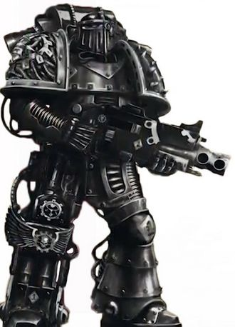

# 0181 破碎军团 Shattered Legions

精校状态：中文行文已逐段精校，部分术语仍为暂定

分类：通用概念 / 帝国 Imperium / 中央政务部 Adeptus Terra / 星际战士军团 Space Marine Legion

原文来源：https://www.bilibili.com/opus/1198095575496523783

原作者：帝国神选罐头

原文时间：2026年05月03日 15:02

[返回分类目录](目录.md) · [全书目录](../../目录.md)

<!-- A0181-B0001 -->
**英文原文**

The Shattered Legions is a collective term for the Iron Hands, Raven Guard and Salamanders Space Marine Legions who suffered heavy losses in the Isstvan V Dropsite Massacre at the outbreak of the Horus Heresy and were effectively destroyed as fighting Legions, but continued to fight against the traitor Legions as scattered warbands numbering anywhere between hundreds or just a handful of marines for the duration of the war.

<!-- /A0181-B0001 -->

<!-- A0181-B0002 -->

原译文

破碎军团是钢铁之手、暗鸦守卫和火蜥蜴星际战士军团的统称，他们在荷鲁斯叛乱爆发时的伊斯塔万五号登陆点大屠杀中遭受了重大损失，并作为战斗军团被有效摧毁，但在战争期间，他们继续与叛徒军团作斗争，作为破碎战帮，人数在数百人之间，或者只有少数战士。

**校订译文**

“破碎军团”是钢铁之手、暗鸦守卫和火蜥蜴的统称。荷鲁斯之乱爆发时，这三个军团在伊斯塔万五号登陆点大屠杀中损失惨重，实际上已无法作为完整军团作战。然而，幸存者仍在整场战争中继续对抗叛徒；他们分散成大小不一的战帮，多则数百人，少则仅数名战士。

<!-- /A0181-B0002 -->

<!-- A0181-B0003 -->
## Origins 起源

<!-- /A0181-B0003 -->

<!-- A0181-B0004 -->
**英文原文**

The Shattered Legions have their origins in the Isstvan V Dropsite Massacre, a large-scale ambush carried out by the traitor Warmaster Horus and those Legions loyal to him on the desert planet Isstvan V. The Death Guard, World Eaters, Emperor's Children and Sons of Horus Legions, their betrayal of the Imperium revealed by the virus-bombing of the Loyalist elements of their own Legions on Isstvan III, bunkered down in a large fortress on Isstvan V to await the arrival of a huge reprisal force organised and sent by the Emperor's Praetorian, Rogal Dorn. The Iron Hands, Salamanders and Raven Guard Legions formed the first wave of this force and touched down on Isstvan V under the leadership of Iron Hands' Primarch Ferrus Manus. Outraged by the betrayal of their brother Legions they launched a severe attack, the Iron Hands in particular driving deep into the Emperor's Children's ranks to avenge an earlier betrayal in the Carolis system. When the second wave of four more Legions arrived on the battlefield the Salamanders and Raven Guard fell back towards the dropsite to recover from the fierce fighting, while the enraged Iron Hands fought on and Ferrus Manus engaged in a ferocious single combat with Emperor's Children Primarch Fulgrim, almost managing to kill him until Fulgrim gave in to the whisperings of a Greater Daemon of Slaanesh housed in the pommel of his sword and became possessed, giving him the required strength to recover and strike Manus down. The four Legions comprising the second wave entrenched at the dropsite, and in the most infamous betrayal of the Imperium's history opened fire on the retreating Salamanders and Raven Guard. The Word Bearers, Night Lords, Iron Warriors and Alpha Legion had all secretly already sided with Horus, and slaughtered the vastly outnumbered Loyalist Legions in a huge and well-planned betrayal.

<!-- /A0181-B0004 -->

<!-- A0181-B0005 -->

原译文

破碎军团起源于伊斯塔万五号登陆点大屠杀，这是叛徒战帅荷鲁斯和忠于他的军团在沙漠行星伊斯塔万五号上进行的大规模伏击。死亡守卫、吞世者、帝皇之子和荷鲁斯之子军团，他们在伊斯塔万三号上对自己军团的忠诚者的病毒轰炸揭示了他们对帝国的背叛，他们驻扎在伊斯塔万五号一个大型堡垒里，等待帝皇禁卫罗格·多恩组织和派遣的庞大报复部队的到来。钢铁之手、火蜥蜴和暗鸦守卫组成了这支部队的第一波，并在钢铁之手原体费鲁斯·马努斯的领导下登陆了伊斯塔万五号。由于对兄弟军团的背叛感到愤怒，他们发动了一场猛烈的攻击，钢铁之手尤其深入帝皇之子队伍，为卡罗利斯星系中早些时候的背叛报仇。当第二波四个军团到达战场时，火蜥蜴和乌鸦卫队向登陆点撤退，以从激烈的战斗中恢复过来，而愤怒的钢铁之手继续战斗，菲鲁斯·马努斯与帝皇之子的原体福格瑞姆进行了一场凶猛的单独战斗，几乎设法杀死了他，直到福格瑞姆屈服于位于他的剑的配重球中的色孽大魔的低语，被附身，给了他恢复并击倒马努斯所需的力量。组成第二波部队的四个军团在登陆点加固，这是帝国历史上最臭名昭著的背叛，他们向撤退的火蜥蜴和暗鸦守卫开火。怀言者、午夜领主、钢铁勇士和阿尔法军团都已经秘密地站在荷鲁斯一边，并在一场规模庞大、计划周密的背叛中屠杀了数量远远超过他们的忠诚派军团。

**校订译文**

破碎军团的遭遇始于伊斯塔万五号登陆点大屠杀：叛徒战帅荷鲁斯及其追随军团在这颗沙漠星球上布下大规模伏击。死亡守卫、吞世者、帝皇之子和荷鲁斯之子此前已在伊斯塔万三号对本军团忠诚派实施病毒轰炸，公开背叛帝国；此后，他们据守伊斯塔万五号的大型要塞，等待有“帝皇禁卫统帅”之称的罗格·多恩组织派遣的庞大讨伐军。钢铁之手、火蜥蜴和暗鸦守卫在费鲁斯·马努斯率领下，作为第一波部队登陆。他们因兄弟军团背叛而愤怒，随即发动猛攻；钢铁之手更深入帝皇之子阵线，试图报复此前卡罗利斯星系的背叛。第二波四个军团抵达后，火蜥蜴与暗鸦守卫退往登陆点整顿，而愤怒的钢铁之手仍在鏖战。费鲁斯与福格瑞姆展开激烈决斗，几乎将其击杀；但按本段记述，福格瑞姆屈从于剑柄内色孽大魔的低语，遭其附身，因而获得力量反击，将费鲁斯斩杀。与此同时，第二波部队在登陆点构筑阵地，突然向撤下来的火蜥蜴与暗鸦守卫开火，酿成帝国史上最臭名昭著的背叛。怀言者、午夜领主、钢铁勇士和阿尔法军团早已暗中倒向荷鲁斯，在这场周密策划的伏击中，屠杀了人数远少于他们的忠诚派。

**校注：** 原文将福格瑞姆受恶魔附身置于斩杀费鲁斯之前；此处保留本段事件顺序，如与相关小说或其他条目不一致，须进一步比对版本。Praetorian 为多恩称号，不表示他属于帝皇禁军组织。

<!-- /A0181-B0005 -->

<!-- A0181-B0006 图片 -->

<!-- A0181-B0007 -->

原译文

Heresy-era Shattered Legions Iron Hands Space Marine 叛乱时期破碎军团钢铁之手星际战士

**校订译文**

Heresy-era Shattered Legions Iron Hands Space Marine 叛乱时期破碎军团钢铁之手星际战士

<!-- /A0181-B0007 -->

<!-- A0181-B0008 -->
## Escaping Isstvan 逃离伊斯塔万

<!-- /A0181-B0008 -->

<!-- A0181-B0009 -->
**英文原文**

Despite catastrophic numbers of casualties, a small number of Loyalist survivors managed to fight their way back to landed Stormbirds and Thunderhawks. Of those that did so almost all were wounded, many badly so, and of the ships that managed to take off from the dropsite many were shot down by traitor anti-aircraft guns. Those that escaped the planet then had to run the gauntlet of the traitor fleet, which prowled the Isstvan system for some time after the initial battle hunting for escaping craft, while Sons of Horus and Emperor's Children purge-fleets were dispatched to chase those who made it out of the system. Nevertheless, a comparatively tiny number of Loyalist marines did manage to escape through luck, skill and sheer indomitable will. Furthermore, relatively small task forces of Iron Hands, Salamanders and Raven Guard that nevertheless numbered into the hundreds were not present at the massacre, and the Iron Hands in particular were not wholly destroyed as Ferrus Manus had been so eager to take the fight to the traitors that he had not waited for the entire Legion to assemble before spearheading the attack. Of particular note are the Iron Hands forces of Shadrak Meduson, who commanded part of the reserve fleet held in orbit during the Dropsite Massacre and escaped, going on to become a feared Loyalist commander who wreaked significant damage on traitor assets and forces.

<!-- /A0181-B0009 -->

<!-- A0181-B0010 -->

原译文

尽管伤亡人数是灾难性的，但少数忠诚派幸存者设法夺回了登陆的风暴鸟和雷鹰。在那些这样做的人中，几乎所有人都受伤了，其中许多人伤势严重，在设法从登陆点起飞的舰船中，许多被叛徒的防空炮击落。那些逃离行星的人随后不得不接受叛徒舰队的挑战，在最初的战斗后，叛徒舰队在伊斯塔万星系徘徊了一段时间，寻找逃跑的飞船，而荷鲁斯之子和帝皇之子的净化舰队则被派去追捕那些逃离该星系的人。然而，相对较少的忠诚派战士确实凭借运气、技能和不屈不挠的意志逃脱了。此外，由钢铁之手、火蜥蜴和暗鸦守卫组成的相对较小的特遣部队虽然有数百人，但并没有出现在大屠杀中，尤其是钢铁之手并没有完全被摧毁，因为费鲁斯·马努斯非常渴望与叛徒作战，以至于他没有等到整个军团集结后才带头进攻。特别值得注意的是沙德拉克·梅杜森的钢铁之手部队，他们在登陆点大屠杀期间指挥了部分被困在轨道上的后备舰队并逃离，成为一名令人恐惧的忠诚派指挥官，对叛徒的资产和部队造成了重大破坏。

**校订译文**

尽管伤亡惨重，少数忠诚派仍杀出重围，回到已经降落的风暴鸟和雷鹰上。几乎人人带伤，许多人伤势极重；成功起飞的飞行器中，又有不少被叛徒防空炮击落。逃出星球的幸存者，还必须穿过叛徒舰队的封锁。初战结束后一段时间内，叛徒舰队仍在伊斯塔万星系巡弋，搜捕逃亡船只；荷鲁斯之子与帝皇之子的清剿舰队则追击已经逃出星系的人。最终，极少数忠诚派凭借运气、技巧与顽强意志逃脱。此外，三个军团都有一些数百人规模的小型特遣部队未参加这场战役。钢铁之手尤其没有全军覆没，因为费鲁斯急于惩罚叛徒，未等全军集结便率先发动了进攻。其中，沙德拉克·梅杜森指挥着留在轨道上的一部分预备舰队，成功逃脱，后来成为令叛徒忌惮的忠诚派指挥官，对其部队与设施造成重大打击。

<!-- /A0181-B0010 -->

<!-- A0181-B0011 -->
## The Raven's Flight 暗鸦的逃离

<!-- /A0181-B0011 -->

<!-- A0181-B0012 -->
**英文原文**

Of the three Loyalist Legions caught in the trap on Isstvan V the Raven Guard were the only ones who did not lose their Primarch, Ferrus Manus of the Iron Hands being killed by Fulgrim and Vulkan of the Salamanders being captured by the Night Lords. Corvus Corax was able to escape from the battlefield and regroup with three thousand surviving Raven Guard, and for 98 days they fled the pursuing traitor forces before being forced into a final stand against the World Eaters on the planet. At the very moment they were preparing for their deaths the Raven Guard were rescued by Branne Nev, the commander of the Raven Guard garrison on Deliverance, who was persuaded to abandon his post by the prophetic dreams of Therion Cohort Praefector Marcus Valerius and arrived with a rescue fleet in time to save his Primarch and the other survivors. The rescue fleet was then able to evade the traitor fleet and escape the Isstvan system, though unbeknownst to the Raven Guard, this was contrived by the Alpha Legion, whose operatives had infiltrated the survivors' ranks by surgically removing the faces of slain Legionaries and re-grafting them onto Alpha Legionaires.

<!-- /A0181-B0012 -->

<!-- A0181-B0013 -->

原译文

在被困在伊斯塔万五号陷阱中的三个忠诚派军团中，只有暗鸦守卫没有失去他们的原体，钢铁之手的费鲁斯·马努斯被福格瑞姆杀死，火蜥蜴的沃坎被午夜领主俘虏。科沃斯·科拉克斯得以逃离战场，并与三千名幸存的暗鸦守卫重新集结，在98天的时间里，他们逃离了追捕的叛徒部队，然后被迫与行星上的吞世者进行最后的对抗。就在他们为死亡做准备的那一刻，暗鸦守卫被拯救星暗鸦守卫驻军指挥官布兰尼·涅夫救出，他被圣兽大队军团长马库斯·瓦勒里乌斯的预言梦说服放弃了自己的职位，并及时带着救援舰队抵达，救出了他的原体和其他幸存者。救援舰队随后能够避开叛徒舰队，逃离伊斯塔万星系，尽管暗鸦守卫对此一无所知，但这是阿尔法军团策划的，阿尔法军团的特工通过手术切除被杀军团士兵的脸，并将其重新移植到阿尔法军团士兵身上，从而渗透到幸存者队伍中。

**校订译文**

陷入伊斯塔万五号圈套的三个忠诚派军团中，只有暗鸦守卫没有失去原体：费鲁斯·马努斯被福格瑞姆杀死，沃坎则被午夜领主俘虏。科沃斯·科拉克斯逃出战场，与三千名幸存者重整部队。他们躲避追击长达九十八天，最终被吞世者逼入绝境，准备作最后一战。就在此时，拯救星驻军指挥官布兰尼·涅夫率舰队赶来救援。圣兽大队统领马库斯·瓦勒里乌斯的预知梦说服了涅夫离开驻地，他及时救出了原体及其他幸存者。舰队随后避过叛徒舰队，逃出伊斯塔万星系。但暗鸦守卫并不知道，这条生路其实是阿尔法军团刻意留出的：其特工剥下阵亡军团战士的面皮，移植到自己脸上，混入了幸存者之中。

<!-- /A0181-B0013 -->

<!-- A0181-B0014 -->
## Actions undertaken by Shattered Legion forces 破碎军团部队采取的行动

<!-- /A0181-B0014 -->

<!-- A0181-B0015 -->
**英文原文**

The military actions undertaken by the Shattered Legion survivors against the traitor forces are too many to number, and most have been forgotten by history, the brave Loyalists who carried them out slain on forgotten worlds during failed missions and last stands. Nevertheless, through sheer daring and strategic skill, some elements of the Shattered Legions managed to strike significant blows against the Traitor Legions, conducting sabotage and hit-and-run attacks, disrupting supply lines and bolstering the defenses of Loyalist worlds. Horus had planned to remove the Raven Guard, Salamanders and Iron Hands completely as factors in his plans to conquer the Imperium, but, through the heroism of the Shattered Legion survivors, he was forced to rue their escape from Isstvan V.

<!-- /A0181-B0015 -->

<!-- A0181-B0016 -->

原译文

破碎军团幸存者对叛徒部队采取的军事行动太多了，不胜枚举，其中大多数已被历史遗忘，勇敢的忠诚者在失败的任务和最后的抵抗中在被遗忘的世界上被杀害。尽管如此，凭借纯粹的勇气和战略技能，破碎军团的一些成员设法对叛徒军团进行了重大打击，进行了破坏和跑打攻击，扰乱了补给线，加强了忠诚派世界的防御。荷鲁斯曾计划使暗鸦守卫、火蜥蜴和钢铁之手完全消失，作为他征服帝国的计划的因素，但由于破碎军团幸存者的英雄主义，他不得不为他们逃离伊斯塔万五号而感到后悔。

**校订译文**

破碎军团幸存者对叛徒发动的行动不计其数，大多已被历史遗忘；执行任务的忠诚战士，也在无名世界上的失败任务与最后抵抗中阵亡。但部分部队凭借勇气与谋略，通过破坏、袭扰和打了就走的战术，切断敌方补给线，加强忠诚世界的防御，给叛徒军团造成沉重打击。荷鲁斯原本想彻底消灭三个军团，使它们无法再干扰征服帝国的计划；幸存者们的奋战，却让他为未能在伊斯塔万五号斩草除根而悔恨。

<!-- /A0181-B0016 -->

<!-- A0181-B0017 -->
**英文原文**

Some notable actions undertaken by Shattered Legion forces during the war are listed below.

<!-- /A0181-B0017 -->

<!-- A0181-B0018 -->

原译文

下面列出了破碎军团部队在战争期间采取的一些值得注意的行动。

**校订译文**

下面列出了破碎军团部队在战争期间采取的一些值得注意的行动。

<!-- /A0181-B0018 -->

<!-- A0181-B0019 -->
**英文原文**

The Battle of Oqueth Minor, where a united fleet of Iron Hands, Raven Guard and Salamanders were ambushed by a Sons of Horus fleet under Tybalt Marr and the Iron Hands Clan-Fathers were killed, allowing Shadrak Meduson to rise to the position of Warleader.

<!-- /A0181-B0019 -->

<!-- A0181-B0020 -->

原译文

奥克丝次星之战中，钢铁之手、暗鸦守卫和火蜥蜴组成的联合舰队遭到提伯特·马尔率领的荷鲁斯之子舰队的伏击，钢铁之手氏族之父被杀，沙德拉克·梅杜森得以升任战争领袖。

**校订译文**

奥克丝次星之战中，钢铁之手、暗鸦守卫和火蜥蜴组成的联合舰队遭到提伯特·马尔率领的荷鲁斯之子舰队的伏击，钢铁之手氏族之父被杀，沙德拉克·梅杜森得以升任战争领袖。

<!-- /A0181-B0020 -->

<!-- A0181-B0021 -->
**英文原文**

The Battle of Arissak, where the shattered legions suffered heavy losses against the Sons of Horus.

<!-- /A0181-B0021 -->

<!-- A0181-B0022 -->

原译文

阿里萨克之战，破碎军团在与荷鲁斯之子的战斗中遭受了重大损失。

**校订译文**

阿里萨克之战，破碎军团在与荷鲁斯之子的战斗中遭受了重大损失。

<!-- /A0181-B0022 -->

<!-- A0181-B0023 -->
**英文原文**

The Defense of Dwell, where Shadrak Meduson combined his forces with the local Imperial Army to defend the planet against the Sons of Horus, losing the battle but badly injuring Horus Aximand and in the battle's aftermath almost claiming the lives of Horus, Fulgrim and Mortarion simultaneously with a surprise gunship strike.

<!-- /A0181-B0023 -->

<!-- A0181-B0024 -->

原译文

在德威尔防御中，沙德拉克·梅杜森将他的部队与当地帝国军队联合起来，保卫行星免受荷鲁斯之子的攻击，输掉了这场战斗，但荷鲁斯·阿西曼德受了重伤，在战斗结束后，荷鲁斯、福格瑞姆和莫塔里安同时几乎被一架突然的炮艇袭击夺去了生命。

**校订译文**

德威尔保卫战：沙德拉克·梅杜森与当地帝国军协同，对抗荷鲁斯之子。虽然战败，他们仍重创了荷鲁斯·阿西曼德；战后发动的炮艇突袭更险些同时杀死荷鲁斯、福格瑞姆和莫塔里安。

<!-- /A0181-B0024 -->

<!-- A0181-B0025 -->
**英文原文**

The Battle of Hamart III, in which Meduson's forces overwhelmed Sons of Horus garrisoning the planet and recovered a large amount of supplies they had gathered.

<!-- /A0181-B0025 -->

<!-- A0181-B0026 -->

原译文

哈马特三号之战中，梅杜森的部队击败了驻扎在行星上的荷鲁斯之子，并回收了他们收集的大量物资。

**校订译文**

哈马特三号之战中，梅杜森的部队击败了驻扎在行星上的荷鲁斯之子，并回收了他们收集的大量物资。

<!-- /A0181-B0026 -->

<!-- A0181-B0027 -->
**英文原文**

The Battle of the Zanaeh Gulf, in which Meduson led a large Shattered Legions fleet in ambushing a Sons of Horus convoy whose position was given away by intelligence recovered from Hamart III. The convoy turned out to be bait for an ambush, but Meduson still managed to achieve a hard-fought victory. During the battle, Vulkan reappeared among the Loyalists for the first time since Isstvan.

<!-- /A0181-B0027 -->

<!-- A0181-B0028 -->

原译文

扎奈赫湾之战中，梅杜森率领一支庞大的破碎军团舰队伏击了一支荷鲁斯之子船队，该船队的位置被来自哈马特三号的情报泄露。该船队最终成为伏击的诱饵，但梅杜森仍取得了艰难的胜利。在战斗中，沃坎自伊斯塔万以来首次重新出现在忠诚者中。

**校订译文**

扎奈赫湾之战：梅杜森利用在哈马特三号取得的情报，率领大规模破碎军团舰队伏击一支荷鲁斯之子运输船队。不料船队本身就是诱饵，但梅杜森仍艰难取胜。此役中，沃坎自伊斯塔万事件后首次重现于忠诚派阵营。

<!-- /A0181-B0028 -->

<!-- A0181-B0029 -->
**英文原文**

The Battle of the Aragna Chain, where Meduson's fleet inflicted significant damage on Tybalt Marr's larger force, but loses the initiative when a captured enemy ship is suddenly retaken and Meduson's attempt to board Marr's ship and kill him instead results in his own capture. Meduson is abandoned by the majority of the Iron Hands in his force and executed by Marr.

<!-- /A0181-B0029 -->

<!-- A0181-B0030 -->

原译文

阿拉格纳星链之战，梅杜森的舰队对提伯特·马尔的更大部队造成了重大破坏，但当一艘被俘的敌舰突然被夺回时，梅杜森失去了主动权，梅杜森试图跳帮马尔的船并杀死他，却导致了他自己被俘。梅杜森被其部队中的大多数钢铁之手抛弃，并被马尔处决。

**校订译文**

阿拉格纳星链之战，梅杜森的舰队对提伯特·马尔的更大部队造成了重大破坏，但当一艘被俘的敌舰突然被夺回时，梅杜森失去了主动权，梅杜森试图跳帮马尔的船并杀死他，却导致了他自己被俘。梅杜森被其部队中的大多数钢铁之手抛弃，并被马尔处决。

<!-- /A0181-B0030 -->

<!-- A0181-B0031 -->
**英文原文**

The Perditum Incursion, before departing Terra, Corvus and his forces were tasked by Malcador to launched a covert mission on Mars to retrieve or eliminate the famed gene-wright Kephram Unguor.

<!-- /A0181-B0031 -->

<!-- A0181-B0032 -->

原译文

迷失入侵，在离开泰拉之前，科沃斯和他的部队接受了马卡多的任务，在火星上发起了一项秘密任务，以找回或清除著名的基因工匠凯夫拉姆·昂戈尔。

**校订译文**

迷失入侵，在离开泰拉之前，科沃斯和他的部队接受了马卡多的任务，在火星上发起了一项秘密任务，以找回或清除著名的基因工匠凯夫拉姆·昂戈尔。

<!-- /A0181-B0032 -->

<!-- A0181-B0033 -->
**英文原文**

The Kiavahr Uprising, where the Raven Guard successfully put down an Alpha Legion-engineered uprising on the world orbited by their home moon and purged their ranks of Alpha Legion impostors.

<!-- /A0181-B0033 -->

<!-- A0181-B0034 -->

原译文

基亚瓦尔叛乱，暗鸦守卫成功地平息了由阿尔法军团策划的叛乱，并清除了他们的阿尔法军团冒名顶替者。

**校订译文**

基亚瓦尔叛乱：暗鸦守卫的母星是一颗卫星，此役发生在它所环绕的行星上。暗鸦守卫镇压了阿尔法军团策动的叛乱，并清除了混入军团的冒名者。

<!-- /A0181-B0034 -->

<!-- A0181-B0035 -->
**英文原文**

The Breaking of the Perfect Fortress, the Raven Guard and Therion Cohort under Corvus Corax launched an assault on the Perfect Fortress, a stronghold constructed by the Emperor's Children on the world of Narsis.

<!-- /A0181-B0035 -->

<!-- A0181-B0036 -->

原译文

破坏完美堡垒，科沃斯·科拉克斯领导的暗鸦守卫和圣兽大队对完美堡垒发动了攻击，这是帝皇之子在纳西斯世界建造的堡垒。

**校订译文**

完美堡垒攻破战——科沃斯·科拉克斯率暗鸦守卫和圣兽大队，攻击帝皇之子在纳西斯世界修建的完美堡垒。

<!-- /A0181-B0036 -->

<!-- A0181-B0037 -->
**英文原文**

The Battle of Constanix II, where the Raven Guard under Corvus Corax marshalled Loyalist Mechanicum forces on Constanix II and led a successful uprising against traitor Archmagos Delvere and his Word Bearers allies.

<!-- /A0181-B0037 -->

<!-- A0181-B0038 -->

原译文

康斯坦尼克斯二号之战中，科沃斯·科拉克斯率领的暗鸦守卫在康斯坦尼克斯二号上集结了忠诚派机械教部队，并领导了一场成功的叛乱，对抗叛徒大贤者德尔维尔和他的怀言者盟友。

**校订译文**

康斯坦尼克斯二号之战中，科沃斯·科拉克斯率领的暗鸦守卫在康斯坦尼克斯二号上集结了忠诚派机械教部队，并领导了一场成功的叛乱，对抗叛徒大贤者德尔维尔和他的怀言者盟友。

<!-- /A0181-B0038 -->

<!-- A0181-B0039 -->
**英文原文**

The Scarato Uprising, where Corax's Raven Guard and their Imperial Fists and Legio Custodes allies liberated Scarato from a Sons of Horus occupation force.

<!-- /A0181-B0039 -->

<!-- A0181-B0040 -->

原译文

斯卡拉托叛乱，科拉克斯的暗鸦守卫和他们的帝国之拳和禁军军团盟友将斯卡拉托从荷鲁斯之子占领部队手中解放出来。

**校订译文**

斯卡拉托叛乱，科拉克斯的暗鸦守卫和他们的帝国之拳和禁军军团盟友将斯卡拉托从荷鲁斯之子占领部队手中解放出来。

<!-- /A0181-B0040 -->

<!-- A0181-B0041 -->
**英文原文**

Raid on the asteroid base of Kapel-5642A, where the Raven Guard led by Corvus Corax attacked a Sons of Horus garrison guarding the shipyards constructing battleships for the war, ultimately destroying the whole production.

<!-- /A0181-B0041 -->

<!-- A0181-B0042 -->

原译文

突袭卡佩尔-5642A小行星基地，由科沃斯·科拉克斯领导的暗鸦守卫袭击了守卫为战争建造战列舰的造船厂的荷鲁斯之子驻军，最终摧毁了整个制造。

**校订译文**

卡佩尔-5642A 小行星基地突袭：科沃斯·科拉克斯率暗鸦守卫进攻荷鲁斯之子守备部队，摧毁了当地为战争建造战列舰的全部生产设施。

<!-- /A0181-B0042 -->

<!-- A0181-B0043 -->
**英文原文**

The Battle of Carandiru, where Corax' force assaulted the Penal World of Carandiru and foiled a plot by rogue Raven Guard Nathian to create a race of super-soldiers dubbed the New Men.

<!-- /A0181-B0043 -->

<!-- A0181-B0044 -->

原译文

在卡兰迪鲁之战中，科拉克斯的部队袭击了卡兰迪鲁刑罚世界，并挫败了离群暗鸦守卫纳西恩制造一个被称为新人类的超级士兵种族的阴谋。

**校订译文**

在卡兰迪鲁之战中，科拉克斯的部队袭击了卡兰迪鲁刑罚世界，并挫败了离群暗鸦守卫纳西恩制造一个被称为新人类的超级士兵种族的阴谋。

<!-- /A0181-B0044 -->

<!-- A0181-B0045 -->
**英文原文**

The Battle of Yarant III, where Corax's forces came to the aid of the Space Wolves in a last stand against the Thousand Sons, Alpha Legion and Sons of Horus.

<!-- /A0181-B0045 -->

<!-- A0181-B0046 -->

原译文

雅兰特三号之战，科拉克斯的部队在最后一场对抗千子、阿尔法军团和荷鲁斯之子的战斗中帮助了太空野狼。

**校订译文**

雅兰特三号之战：太空野狼面对千子、阿尔法军团和荷鲁斯之子的围攻，准备殊死抵抗时，科拉克斯率军前来援助。

<!-- /A0181-B0046 -->

<!-- A0181-B0047 -->
**英文原文**

The Crusade of Vengeance, after meeting with his brother Lion El'Jonson, Corax assigns a small expeditionary force of his Raven Guard to The Lion's forces.

<!-- /A0181-B0047 -->

<!-- A0181-B0048 -->

原译文

复仇远征，在与他的兄弟莱昂·艾尔庄森会面后，科拉克斯将他的暗鸦守卫的一支小型远征部队分配给了莱昂的部队。

**校订译文**

复仇远征：与兄弟莱昂·艾尔’庄森会面后，科拉克斯调拨了一支小型暗鸦守卫远征军，加入雄狮的部队。

<!-- /A0181-B0048 -->

<!-- A0181-B0049 -->
**英文原文**

The Escape of Vulkan, when the Salamanders Primarch escaped imprisonment aboard the Night Lords' flagship after prolonged torture at the hands of Konrad Curze.

<!-- /A0181-B0049 -->

<!-- A0181-B0050 -->

原译文

沃坎的逃亡，当火蜥蜴原体在康拉德·科兹的长期折磨下逃脱了午夜领主旗舰上的监禁。

**校订译文**

沃坎脱逃：在遭受康拉德·科兹长期折磨后，火蜥蜴原体从午夜领主旗舰的囚禁中逃脱。

<!-- /A0181-B0050 -->

<!-- A0181-B0051 -->
**英文原文**

The Raid on Traoris, where a primarily Salamanders force led by Artellus Numeon sacrificed themselves to prevent a Word Bearers force under Valdrekk Elias obtaining the Fulgurite.

<!-- /A0181-B0051 -->

<!-- A0181-B0052 -->

原译文

突袭特拉奥里斯，由阿特鲁斯·努梅昂领导的一支主要是火蜥蜴的部队牺牲了自己，以阻止瓦尔德里克·埃利亚斯领导的怀言者部队获得雷击石。

**校订译文**

特拉奥里斯突袭：阿泰勒斯·努梅昂率领一支以火蜥蜴为主的部队，牺牲自身，阻止瓦尔德里克·埃利亚斯麾下的怀言者取得雷击石。

<!-- /A0181-B0052 -->

<!-- A0181-B0053 -->
**英文原文**

The Voyage of the Sixty-Six, in which sixty-six Salamanders survivors from Ultramar led by Artellus Numeon braved the Ruinstorm in an attempt to return Vulkan's body to Nocturne.

<!-- /A0181-B0053 -->

<!-- A0181-B0054 -->

原译文

66人远航，由阿特鲁斯·努梅昂领导的来自奥特拉玛的66名火蜥蜴幸存者冒着毁灭风暴，试图将沃坎的尸体送回夜曲星。

**校订译文**

六十六人远航：阿泰勒斯·努梅昂率领六十六名来自奥特拉玛的火蜥蜴幸存者，冒险穿越毁灭风暴，试图将沃坎的遗体送回夜曲星。

<!-- /A0181-B0054 -->

<!-- A0181-B0055 -->
**英文原文**

The Battle of Nocturne, in which a force of Salamanders Neophytes and the survivors of The sixty-six defended their homeworld from an invasion of Death Guard under Malig Laestygon.

<!-- /A0181-B0055 -->

<!-- A0181-B0056 -->

原译文

夜曲星之战，一支由火蜥蜴新进者和六十六人的幸存者组成的部队保卫了他们的家园世界，抵御了马利格·莱斯提贡率领的死亡守卫的入侵。

**校订译文**

夜曲星之战，一支由火蜥蜴新进者和六十六人的幸存者组成的部队保卫了他们的家园世界，抵御了马利格·莱斯提贡率领的死亡守卫的入侵。

<!-- /A0181-B0056 -->

<!-- A0181-B0057 -->
**英文原文**

The War of Drakes, where the Salamanders began a series of purge campaigns, that targeted a cluster of Death Guard fiefdoms near Nocturne, as well as the warp horrors within the Upsilon-Xi Sector.

<!-- /A0181-B0057 -->

<!-- A0181-B0058 -->

原译文

火龙战争中，火蜥蜴开始了一系列的净化行动，目标是夜曲星附近的一群死亡卫队领地，以及υ-ξ星区的亚空间恐怖。

**校订译文**

火龙战争：火蜥蜴发起一系列清剿行动，打击夜曲星附近的死亡守卫领地，以及 υ-ξ 星区内的亚空间恐怖生物。

<!-- /A0181-B0058 -->

<!-- A0181-B0059 -->
**英文原文**

The Pale Stars Campaign, the Salamanders wage a bloody campaign against the forces of Emperor's Children that had invaded The Pale Stars, purging the planets that had been corrupted by the traitors and battling them in various systems such as Idylitar.

<!-- /A0181-B0059 -->

<!-- A0181-B0060 -->

原译文

在苍白群星战役中，火蜥蜴对入侵苍白群星的帝皇之子的部队发动了一场血腥的战役，净化了被叛徒腐化的行星，并在伊迪利塔等各个星系中与他们作战。

**校订译文**

在苍白群星战役中，火蜥蜴对入侵苍白群星的帝皇之子的部队发动了一场血腥的战役，净化了被叛徒腐化的行星，并在伊迪利塔等各个星系中与他们作战。

<!-- /A0181-B0060 -->

<!-- A0181-B0061 -->
**英文原文**

The Theft of the Kryptos, when Raven Guard commando Nykona Sharrowkyn and Iron Hands Iron Father Sabik Wayland infiltrated a Dark Mechanicum fortress and stole a strategically valuable artefact from the traitors.

<!-- /A0181-B0061 -->

<!-- A0181-B0062 -->

原译文

隐秘之窃，当暗鸦守卫突击队员尼科纳·沙罗金和钢铁之手铁父萨比克·韦兰潜入黑暗机械教堡垒，从叛徒手中偷走了一件具有战略价值的造物。

**校订译文**

隐秘之窃，当暗鸦守卫突击队员尼科纳·沙罗金和钢铁之手钢铁圣父萨比克·韦兰潜入黑暗机械教堡垒，从叛徒手中偷走了一件具有战略价值的造物。

<!-- /A0181-B0062 -->

<!-- A0181-B0063 -->
**英文原文**

The Assassination attempt on Fulgrim on Hydra Cordatus, when Nykona Sharrowkyn made what should have been a fatal headshot on the Emperor's Children Primarch.

<!-- /A0181-B0063 -->

<!-- A0181-B0064 -->

原译文

在海德拉之心对福格瑞姆的暗杀企图中，尼科纳·沙罗金对帝皇之子原体进行了本应致命的射头攻击。

**校订译文**

海德拉之心刺杀福格瑞姆行动：尼科纳·沙罗金射中帝皇之子原体的头部，这一枪本应致命。

<!-- /A0181-B0064 -->

<!-- A0181-B0065 -->
**英文原文**

The Battle of Iydris, where the forces of the Sisypheum interrupted the ascension of Fulgrim to daemonhood, Ignatius Numen slew Marius Vairosean and Nykona Sharrowkyn temporarily killed Lucius.

<!-- /A0181-B0065 -->

<!-- A0181-B0066 -->

原译文

在伊德里斯之战中，西西弗姆号的部队打断了福格瑞姆升格为恶魔王子，伊格内修斯·努门杀死了马里乌斯·瓦伊罗西安，尼科纳·沙罗金暂时杀死了卢修斯。

**校订译文**

伊德里斯之战：西西弗姆号的战士干扰了福格瑞姆升魔的仪式；伊格内修斯·努门杀死马里乌斯·瓦伊罗西安，尼科纳·沙罗金则一度杀死卢修斯。

<!-- /A0181-B0066 -->

<!-- A0181-B0067 -->
**英文原文**

The Battle of Eirene Septimus, where the warriors of the Sisypheum attempted to assassinate Alpharius alongside Shadrak Meduson but became pawns in Alpharius' plan to eliminate Loyalists from his own Legion.

<!-- /A0181-B0067 -->

<!-- A0181-B0068 -->

原译文

艾琳娜·塞普蒂默斯之战，西西弗姆号的战士试图与沙德拉克·梅杜森一起暗杀阿尔法瑞斯，但成为阿尔法瑞斯从自己的军团中消灭忠诚者的计划中的棋子。

**校订译文**

艾琳娜·塞普蒂默斯之战，西西弗姆号的战士试图与沙德拉克·梅杜森一起暗杀阿尔法瑞斯，但成为阿尔法瑞斯从自己的军团中消灭忠诚者的计划中的棋子。

<!-- /A0181-B0068 -->

<!-- A0181-B0069 -->
**英文原文**

The Raid on Luna during the Siege of Terra. The crew of the Sisypheum raid traitor-occupied Luna to rescue the Magna Mater from the clutches of the enemy.

<!-- /A0181-B0069 -->

<!-- A0181-B0070 -->

原译文

泰拉围城期间对月球的突袭。西西弗姆号的船员突袭了叛徒占领的月球，将伟大之母从敌人的魔爪中解救出来。

**校订译文**

泰拉围城期间对月球的突袭。西西弗姆号的船员突袭了叛徒占领的月球，将伟大之母从敌人的魔爪中解救出来。

<!-- /A0181-B0070 -->

<!-- A0181-B0071 -->
**英文原文**

The Escape from Laedrgeist, an Iron Hands company is rescued by the Salamanders from a force of Word Bearers on the world of Laedrgeist.

<!-- /A0181-B0071 -->

<!-- A0181-B0072 -->

原译文

逃离莱德格斯特，一个钢铁之手连队被火蜥蜴从莱德格斯特世界的一支怀言者部队中拯救出来。

**校订译文**

逃离莱德格斯特，一个钢铁之手连队被火蜥蜴从莱德格斯特世界的一支怀言者部队中拯救出来。

<!-- /A0181-B0072 -->

<!-- A0181-B0073 -->
**英文原文**

The Siege of Baal, where Shattered Legion forces alongside Imperial Fists elements supported the Blood Angels against the invasion of their homeworld from Sons of Horus and Emperor's Children forces.

<!-- /A0181-B0073 -->

<!-- A0181-B0074 -->

原译文

巴尔围城，破碎军团部队与帝国之拳部队一起支援圣血天使对抗荷鲁斯之子和帝皇之子部队对他们家园世界的入侵。

**校订译文**

巴尔围城，破碎军团部队与帝国之拳部队一起支援圣血天使对抗荷鲁斯之子和帝皇之子部队对他们家园世界的入侵。

<!-- /A0181-B0074 -->

<!-- A0181-B0075 -->
**英文原文**

The Erellian Subjugation, where a combined force of Iron Hands and Salamanders invaded the world of Erellia held by the Emperor's Children and Iron Warriors.

<!-- /A0181-B0075 -->

<!-- A0181-B0076 -->

原译文

艾瑞利安征服，钢铁之手和火蜥蜴的联合部队入侵了帝皇之子和钢铁勇士控制的艾瑞利亚世界。

**校订译文**

艾瑞利安征服，钢铁之手和火蜥蜴的联合部队入侵了帝皇之子和钢铁勇士控制的艾瑞利亚世界。

<!-- /A0181-B0076 -->

<!-- A0181-B0077 -->
**英文原文**

The Mezoan Campaign, where the warband known as the Disciples of the Flames led by Xiaphas Jurr and Cassian Dracos defended the Forgeworld of Mezoa against a combined force of Alpha Legion and Iron Warriors. During the battle, Cassian Dracos was able to convince Nârik Dreygur, the commander of the Iron Warriors, to defect to the loyalist side. With the Iron Warriors' reinforcements, the defenders were able to expel the Alpha Legion from Mezoa.

<!-- /A0181-B0077 -->

<!-- A0181-B0078 -->

原译文

梅佐安战役，由夏法斯·尤尔和卡西安·德拉科斯领导的被称为火焰门徒的战帮防守了梅佐亚铸造世界，对抗阿尔法军团和钢铁勇士的联合部队。在战斗中，卡西安·德拉科斯成功地说服了钢铁勇士的指挥官纳里克·德雷格叛逃到忠诚派的一方。在钢铁勇士的增援下，守军得以将阿尔法军团驱逐出梅佐亚。

**校订译文**

梅佐安战役，由夏法斯·尤尔和卡西安·德拉科斯领导的被称为火焰门徒的战帮防守了梅佐亚铸造世界，对抗阿尔法军团和钢铁勇士的联合部队。在战斗中，卡西安·德拉科斯成功地说服了钢铁勇士的指挥官纳里克·德雷格叛逃到忠诚派的一方。在钢铁勇士的增援下，守军得以将阿尔法军团驱逐出梅佐亚。

<!-- /A0181-B0078 -->

<!-- A0181-B0079 -->
**英文原文**

The Battle of Vanaheim, where a Shattered Legion warband led by Captain Cazin Ru'darak of the Salamanders' 53rd Company would wage a guerrilla campaign against the 72th Grand Battalion of the Iron Warriors and later on, the warband would be aided by a Space Wolves contingent.

<!-- /A0181-B0079 -->

<!-- A0181-B0080 -->

原译文

瓦纳海姆之战，由火蜥蜴第53连队连长卡津·鲁'达拉克率领的破碎军团战帮对钢铁勇士第72大营发动游击战，随后，该战帮得到太空野狼分遣队的协助。

**校订译文**

瓦纳海姆之战，由火蜥蜴第53连队连长卡津·鲁'达拉克率领的破碎军团战帮对钢铁勇士第72大营发动游击战，随后，该战帮得到太空野狼分遣队的协助。

<!-- /A0181-B0080 -->

<!-- A0181-B0081 -->
**英文原文**

The Constantinium Incursion, where Iron Warriors loyalists from the 14th Grand Company, including ancient Khragan, helped a Shattered Legions strike force.

<!-- /A0181-B0081 -->

<!-- A0181-B0082 -->

原译文

康斯坦丁入侵，来自第14大连的钢铁勇士忠诚者，包括长者克拉根，帮助了一支破碎军团打击部队。

**校订译文**

康斯坦丁入侵，来自第14大连的钢铁勇士忠诚者，包括长者克拉根，帮助了一支破碎军团打击部队。

<!-- /A0181-B0082 -->

<!-- A0181-B0083 -->
**英文原文**

The Battle of Perditus, where the Iron Hands 98th Clan-Company led by Cassalir Lorramech fought a Death Guard task force led by Calas Typhon to prevent them from claiming a powerful alien sentience that was later requisitioned by the Dark Angels.

<!-- /A0181-B0083 -->

<!-- A0181-B0084 -->

原译文

堕落之战，由卡萨利尔·洛拉梅奇领导的钢铁之手第98氏族连队与卡拉斯·提丰领导的死亡守卫特遣部队作战，防止他们索取强大的异型感知能力，后来被黑暗天使征用。

**校订译文**

佩迪图斯之战：卡萨利尔·洛拉梅奇率钢铁之手第九十八氏族连队，对抗卡拉斯·提丰麾下的死亡守卫，阻止其取得一个强大的异形智能实体。该实体后来被黑暗天使征用。

<!-- /A0181-B0084 -->

<!-- A0181-B0085 -->
**英文原文**

The Battle of Bodt, where forces under Autek Mor invaded the World Eaters recruitment world of Bodt and recovered precious Gene-tech from beneath its surface before destroying the planet by crashing its own moon into it.

<!-- /A0181-B0085 -->

<!-- A0181-B0086 -->

原译文

博德特之战，奥特克·莫尔率领的部队入侵了博德特吞世者招募世界，并从其地表下回收了宝贵的基因技术，然后将其卫星撞向行星，摧毁了行星。

**校订译文**

博德特之战，奥特克·莫尔率领的部队入侵了博德特吞世者招募世界，并从其地表下回收了宝贵的基因技术，然后将其卫星撞向行星，摧毁了行星。

<!-- /A0181-B0086 -->

<!-- A0181-B0087 -->
**英文原文**

The Xana Incursion, where Shattered Legions forces supported a Dark Angels attack on the traitor Forge world Xana and prevented its alliance with Horus.

<!-- /A0181-B0087 -->

<!-- A0181-B0088 -->

原译文

夏娜入侵，破碎军团部队支援黑暗天使攻击叛徒铸造世界夏娜，并阻止其与荷鲁斯结盟。

**校订译文**

夏娜入侵，破碎军团部队支援黑暗天使攻击叛徒铸造世界夏娜，并阻止其与荷鲁斯结盟。

<!-- /A0181-B0088 -->

<!-- A0181-B0089 -->
**英文原文**

The Battle of Nyrcon, where Salamanders forces supported by Imperial Army and Loyalist Titans reclaimed the Beta-Garmon system from the Emperor's Children and Legio Mortis.

<!-- /A0181-B0089 -->

<!-- A0181-B0090 -->

原译文

尼尔康之战，在帝国军队和忠诚派泰坦的支援下，火蜥蜴部队从帝皇之子和死亡军团手中夺回了贝塔·伽蒙星系。

**校订译文**

尼尔康之战：在帝国军与忠诚派泰坦支援下，火蜥蜴从帝皇之子和死亡军团手中夺回贝塔·伽蒙星系。

<!-- /A0181-B0090 -->

<!-- A0181-B0091 -->
**英文原文**

The Malagant Conflict, where a single force of Raven Guard bogged down all of the Death Guard's reserves from Barbarus for three years before achieving victory when Imperial Fists reinforcements arrived from Inwit.

<!-- /A0181-B0091 -->

<!-- A0181-B0092 -->

原译文

马拉甘特冲突，一支暗鸦守卫部队将所有来自巴巴鲁斯的死亡守卫后备陷入困境，持续了三年，直到帝国之拳增援部队从因维特抵达，才取得胜利。

**校订译文**

马拉甘特冲突：一支暗鸦守卫部队牵制了来自巴巴鲁斯的全部死亡守卫预备军达三年之久，直到帝国之拳援军从因维特抵达，才最终取胜。

<!-- /A0181-B0092 -->

<!-- A0181-B0093 -->
**英文原文**

The Battle of Ohmn-Mat, where Iron Hands and Sons of Horus forces took sides in a civil war amongst the planet's Mechanicum, leading to a prolonged stalemate.

<!-- /A0181-B0093 -->

<!-- A0181-B0094 -->

原译文

欧姆-马特之战，钢铁之手和荷鲁斯之子部队在行星机械教之间的内战中站队，导致长期僵局。

**校订译文**

欧姆-马特之战，钢铁之手和荷鲁斯之子部队在行星机械教之间的内战中站队，导致长期僵局。

<!-- /A0181-B0094 -->

<!-- A0181-B0095 -->
**英文原文**

The Battle of Tralsak, where loyalist Shattered Legions forces and World Eaters fought across the disintegrating landscape of the ice world of Tralsak.

<!-- /A0181-B0095 -->

<!-- A0181-B0096 -->

原译文

特拉萨克之战，忠诚派破碎军团部队和吞世者在特拉萨克冰雪世界的碎裂地貌中作战。

**校订译文**

特拉萨克之战，忠诚派破碎军团部队和吞世者在特拉萨克冰雪世界的碎裂地貌中作战。

<!-- /A0181-B0096 -->

<!-- A0181-B0097 -->
**英文原文**

The Battle of Beta-Garmon, where Shattered Legions forces joined the Loyalists in defending the strategically vital system from Horus' advance.

<!-- /A0181-B0097 -->

<!-- A0181-B0098 -->

原译文

贝塔-伽蒙之战，破碎军团部队与忠诚派联手，保卫战略上至关重要的星系免受荷鲁斯的进攻。

**校订译文**

贝塔-伽蒙之战，破碎军团部队与忠诚派联手，保卫战略上至关重要的星系免受荷鲁斯的进攻。

<!-- /A0181-B0098 -->

<!-- A0181-B0099 -->
**英文原文**

The Thassos Incident, where a Shattered Legions warfleet saved a Dark Angels flotilla from a Night Lords ambush.

<!-- /A0181-B0099 -->

<!-- A0181-B0100 -->

原译文

萨索斯事件，一支破碎军团战争舰队从午夜领主的伏击中救出了一支黑暗天使小型舰队。

**校订译文**

萨索斯事件，一支破碎军团战争舰队从午夜领主的伏击中救出了一支黑暗天使小型舰队。

<!-- /A0181-B0100 -->

<!-- A0181-B0101 -->
**英文原文**

The Foricaan Campaign. A fleet composed of fragments from the Iron Hands and Salamanders legions attacked the Foricaan System under the control of the Iron Warriors.

<!-- /A0181-B0101 -->

<!-- A0181-B0102 -->

原译文

弗瑞肯战役。由钢铁之手和火蜥蜴军团的碎片组成的舰队袭击了钢铁勇士控制下的弗瑞肯星系。

**校订译文**

弗瑞肯战役：由钢铁之手与火蜥蜴残部组成的舰队，袭击了钢铁勇士控制的弗瑞肯星系。

<!-- /A0181-B0102 -->

<!-- A0181-B0103 -->
**英文原文**

The Siege of Inwit. As the Siege of Terra drew the many traitors away from the Inwit Cluster, a relief force of Salamanders, Imperial Army, and Mechanicum forces reached Inwit and broke the siege.

<!-- /A0181-B0103 -->

<!-- A0181-B0104 -->

原译文

因维特围城。随着泰拉围城令许多叛徒从因威特星群中离开，一支由火蜥蜴、帝国军队和机械教部队组成的救援部队抵达因维特，打破了围城。

**校订译文**

因维特围城：泰拉围城吸引大批叛徒离开因维特星群后，火蜥蜴、帝国军和机械教联合组成的援军赶到因维特，解除了围困。

<!-- /A0181-B0104 -->

<!-- A0181-B0105 -->
**英文原文**

The Siege of Cthonia. Raven Guard and Iron Hands forces under the command of Shade-captain Syban Nethkal took part in the conflict, supporting the Imperial Fists garrison against the Sons of Horus. The infamous assassin Kaedes Nex was also part of this force.

<!-- /A0181-B0105 -->

<!-- A0181-B0106 -->

原译文

科索尼亚围城。在阴影连长赛班·内斯卡尔的指挥下，暗鸦守卫和钢铁之手部队参加了冲突，支援帝国之拳部队对抗荷鲁斯之子。著名的刺客凯德斯·奈克斯也是这支部队的一员。

**校订译文**

科索尼亚围城。在阴影连长赛班·内斯卡尔的指挥下，暗鸦守卫和钢铁之手部队参加了冲突，支援帝国之拳部队对抗荷鲁斯之子。著名的刺客凯德斯·奈克斯也是这支部队的一员。

<!-- /A0181-B0106 -->

<!-- A0181-B0107 -->
**英文原文**

The Siege of Terra. Various forces from all the Shattered Legions were present on Terra in order to defend the Throneworld against the final assault of the Warmaster and his traitor forces.

<!-- /A0181-B0107 -->

<!-- A0181-B0108 -->

原译文

泰拉围城。来自所有破碎军团的各个部队都出现在泰拉上，以保卫王座世界免受战帅及其叛徒部队的最后攻击。

**校订译文**

泰拉围城。来自所有破碎军团的各个部队都出现在泰拉上，以保卫王座世界免受战帅及其叛徒部队的最后攻击。

<!-- /A0181-B0108 -->

<!-- A0181-B0109 -->
## Known Shattered Legion survivors 已知破碎军团幸存者

<!-- /A0181-B0109 -->

<!-- A0181-B0110 -->
## Iron Hands 钢铁之手

<!-- /A0181-B0110 -->

<!-- A0181-B0111 -->
**英文原文**

Forces under Shadrak Meduson:

<!-- /A0181-B0111 -->

<!-- A0181-B0112 -->

原译文

沙德拉克·梅杜森的部队：

**校订译文**

沙德拉克·梅杜森的部队：

<!-- /A0181-B0112 -->

<!-- A0181-B0113 -->
**英文原文**

Shadrak Meduson, Warleader and Captain of the 10th Company, Clan Sorrgol

<!-- /A0181-B0113 -->

<!-- A0181-B0114 -->

原译文

沙德拉克·梅杜森，战争领袖和第十连队连长，索古罗氏族

**校订译文**

沙德拉克·梅杜森，战争领袖和第十连队连长，索古罗氏族

<!-- /A0181-B0114 -->

<!-- A0181-B0115 -->
**英文原文**

Jebez Aug, Iron Father and Hand-Elect, Clan Sorrgol

<!-- /A0181-B0115 -->

<!-- A0181-B0116 -->

原译文

杰贝兹·奥格，铁父和受选之手，索古罗氏族

**校订译文**

杰贝兹·奥格，钢铁圣父和受选之手，索古罗氏族

<!-- /A0181-B0116 -->

<!-- A0181-B0117 -->
**英文原文**

Bion Henricos, Sergeant, 10th Company, Clan Sorrgol

<!-- /A0181-B0117 -->

<!-- A0181-B0118 -->

原译文

拜昂·亨利科斯，军士，第十连队，索古罗氏族

**校订译文**

拜昂·亨利科斯，军士，第十连队，索古罗氏族

<!-- /A0181-B0118 -->

<!-- A0181-B0119 -->
**英文原文**

Goran Gorgonson, Apothecary, Clan Lokopt

<!-- /A0181-B0119 -->

<!-- A0181-B0120 -->

原译文

戈兰·戈尔贡松，药剂师，洛克普特氏族

**校订译文**

戈兰·戈尔贡松，药剂师，洛克普特氏族

<!-- /A0181-B0120 -->

<!-- A0181-B0121 -->
**英文原文**

Augos Lumak, Captain, Clan Avernii

<!-- /A0181-B0121 -->

<!-- A0181-B0122 -->

原译文

奥格斯·卢马克，连长，阿维尼氏族

**校订译文**

奥格斯·卢马克，连长，阿维尼氏族

<!-- /A0181-B0122 -->

<!-- A0181-B0123 -->
**英文原文**

Lars Mechosa, Captain, Clan Sorrgol

<!-- /A0181-B0123 -->

<!-- A0181-B0124 -->

原译文

拉斯·梅科萨，连长，索古罗氏族

**校订译文**

拉斯·梅科萨，连长，索古罗氏族

<!-- /A0181-B0124 -->

<!-- A0181-B0125 -->
**英文原文**

From the Sisypheum:

<!-- /A0181-B0125 -->

<!-- A0181-B0126 -->

原译文

来自西西弗姆号

**校订译文**

来自西西弗姆号

<!-- /A0181-B0126 -->

<!-- A0181-B0127 -->
**英文原文**

Cadmus Tyro, Equerry to Captain Ulrach Branthan, nominal captain

<!-- /A0181-B0127 -->

<!-- A0181-B0128 -->

原译文

卡德摩斯·泰罗，连长乌尔拉赫·布兰坦的侍从官，名义上的连长

**校订译文**

卡德摩斯·泰罗，连长乌尔拉赫·布兰坦的侍从官，名义上的连长

<!-- /A0181-B0128 -->

<!-- A0181-B0129 -->
**英文原文**

Frater Thamatica, Iron Father

<!-- /A0181-B0129 -->

<!-- A0181-B0130 -->

原译文

弗拉特·塔玛提卡，铁父

**校订译文**

弗拉特·塔玛提卡，钢铁圣父

<!-- /A0181-B0130 -->

<!-- A0181-B0131 -->
**英文原文**

Ignatius Numen, Morlock

<!-- /A0181-B0131 -->

<!-- A0181-B0132 -->

原译文

伊格内修斯·努门，莫洛克

**校订译文**

伊格内修斯·努门，莫洛克

<!-- /A0181-B0132 -->

<!-- A0181-B0133 -->
**英文原文**

Karaashi Bombastus, Dreadnought

<!-- /A0181-B0133 -->

<!-- A0181-B0134 -->

原译文

卡拉什·邦巴斯特斯，无畏

**校订译文**

卡拉什·邦巴斯特斯，无畏

<!-- /A0181-B0134 -->

<!-- A0181-B0135 -->
**英文原文**

Sabik Wayland, Iron Father

<!-- /A0181-B0135 -->

<!-- A0181-B0136 -->

原译文

萨比克·韦兰，铁父

**校订译文**

萨比克·韦兰，钢铁圣父

<!-- /A0181-B0136 -->

<!-- A0181-B0137 -->
**英文原文**

Septus Thoic, Morlock

<!-- /A0181-B0137 -->

<!-- A0181-B0138 -->

原译文

塞普图斯·托伊克，莫洛克

**校订译文**

塞普图斯·托伊克，莫洛克

<!-- /A0181-B0138 -->

<!-- A0181-B0139 -->
**英文原文**

Vermana Cybus, Morlock

<!-- /A0181-B0139 -->

<!-- A0181-B0140 -->

原译文

维尔马纳·赛巴斯，莫洛克

**校订译文**

维尔马纳·赛巴斯，莫洛克

<!-- /A0181-B0140 -->

<!-- A0181-B0141 -->
**英文原文**

Ulrach Branthan Captain, 65th Clan Company

<!-- /A0181-B0141 -->

<!-- A0181-B0142 -->

原译文

乌尔拉赫·布兰坦连长，第65氏族连队

**校订译文**

乌尔拉赫·布兰坦连长，第65氏族连队

<!-- /A0181-B0142 -->

<!-- A0181-B0143 -->
**英文原文**

From the Veritas Ferrum:

<!-- /A0181-B0143 -->

<!-- A0181-B0144 -->

原译文

来自钢铁真理号：

**校订译文**

来自钢铁真理号：

<!-- /A0181-B0144 -->

<!-- A0181-B0145 -->

原译文

Achaicus 阿凯库斯

**校订译文**

Achaicus 阿凯库斯

<!-- /A0181-B0145 -->

<!-- A0181-B0146 -->
**英文原文**

Anton Galba, Sergeant

<!-- /A0181-B0146 -->

<!-- A0181-B0147 -->

原译文

安东·加尔巴，军士

**校订译文**

安东·加尔巴，军士

<!-- /A0181-B0147 -->

<!-- A0181-B0148 -->
**英文原文**

Atrax, Dreadnought

<!-- /A0181-B0148 -->

<!-- A0181-B0149 -->

原译文

阿特拉斯，无畏

**校订译文**

阿特拉斯，无畏

<!-- /A0181-B0149 -->

<!-- A0181-B0150 -->
**英文原文**

Aulus, Sergeant

<!-- /A0181-B0150 -->

<!-- A0181-B0151 -->

原译文

奥卢斯，军士

**校订译文**

奥卢斯，军士

<!-- /A0181-B0151 -->

<!-- A0181-B0152 -->
**英文原文**

Camnus, Techmarine

<!-- /A0181-B0152 -->

<!-- A0181-B0153 -->

原译文

卡姆纳斯，技术军士

**校订译文**

卡姆纳斯，科技战士。

<!-- /A0181-B0153 -->

<!-- A0181-B0154 -->

原译文

Catigernus 卡蒂格努斯

**校订译文**

Catigernus 卡蒂格努斯

<!-- /A0181-B0154 -->

<!-- A0181-B0155 -->
**英文原文**

Crevther, Sergeant

<!-- /A0181-B0155 -->

<!-- A0181-B0156 -->

原译文

克雷夫瑟，军士

**校订译文**

克雷夫瑟，军士

<!-- /A0181-B0156 -->

<!-- A0181-B0157 -->
**英文原文**

Darras, Sergeant

<!-- /A0181-B0157 -->

<!-- A0181-B0158 -->

原译文

达拉斯，军士

**校订译文**

达拉斯，军士

<!-- /A0181-B0158 -->

<!-- A0181-B0159 -->
**英文原文**

Durun Atticus, Captain, 111th Clan Company

<!-- /A0181-B0159 -->

<!-- A0181-B0160 -->

原译文

杜伦·阿提克斯，连长，第111氏族连队

**校订译文**

杜伦·阿提克斯，连长，第111氏族连队

<!-- /A0181-B0160 -->

<!-- A0181-B0161 -->

原译文

Ecdurus 埃克杜鲁斯

**校订译文**

Ecdurus 埃克杜鲁斯

<!-- /A0181-B0161 -->

<!-- A0181-B0162 -->

原译文

Ennius 恩尼乌斯

**校订译文**

Ennius 恩尼乌斯

<!-- /A0181-B0162 -->

<!-- A0181-B0163 -->

原译文

Eutropius 欧特罗庇乌斯

**校订译文**

Eutropius 欧特罗庇乌斯

<!-- /A0181-B0163 -->

<!-- A0181-B0164 -->
**英文原文**

Lacertus, Sergeant

<!-- /A0181-B0164 -->

<!-- A0181-B0165 -->

原译文

拉瑟图斯，军士

**校订译文**

拉瑟图斯，军士

<!-- /A0181-B0165 -->

<!-- A0181-B0166 -->
**英文原文**

Vektus, Apothecary

<!-- /A0181-B0166 -->

<!-- A0181-B0167 -->

原译文

威克图斯，药剂师

**校订译文**

威克图斯，药剂师

<!-- /A0181-B0167 -->

<!-- A0181-B0168 -->
**英文原文**

Aan Kolver, Clan-Father, Clan Ungavarr

<!-- /A0181-B0168 -->

<!-- A0181-B0169 -->

原译文

安·科尔弗，氏族之父，昂加瓦尔氏族

**校订译文**

安·科尔弗，氏族之父，昂加瓦尔氏族

<!-- /A0181-B0169 -->

<!-- A0181-B0170 -->
**英文原文**

Karel Mach, Clan-Father, Clan Raukaan

<!-- /A0181-B0170 -->

<!-- A0181-B0171 -->

原译文

卡雷尔·马赫，氏族之父，劳坎氏族

**校订译文**

卡雷尔·马赫，氏族之父，劳坎氏族

<!-- /A0181-B0171 -->

<!-- A0181-B0172 -->
**英文原文**

Lech Vircule, Clan-Father, Clan Atraxii

<!-- /A0181-B0172 -->

<!-- A0181-B0173 -->

原译文

莱赫·维尔库尔，氏族之父，阿特拉克斯氏族

**校订译文**

莱赫·维尔库尔，氏族之父，阿特拉克斯氏族

<!-- /A0181-B0173 -->

<!-- A0181-B0174 -->
**英文原文**

Loreson Unfleshed, Clan-Father, Clan Felg

<!-- /A0181-B0174 -->

<!-- A0181-B0175 -->

原译文

洛瑞森·无躯者，氏族之父，费尔格氏族

**校订译文**

洛瑞森·无躯者，氏族之父，费尔格氏族

<!-- /A0181-B0175 -->

<!-- A0181-B0176 -->
**英文原文**

Ares Voitek, Knight-Errant

<!-- /A0181-B0176 -->

<!-- A0181-B0177 -->

原译文

阿瑞斯·沃泰克，游侠骑士

**校订译文**

阿瑞斯·沃泰克，游侠骑士

<!-- /A0181-B0177 -->

<!-- A0181-B0178 -->
**英文原文**

Autek Mor, Commander, Red Talon

<!-- /A0181-B0178 -->

<!-- A0181-B0179 -->

原译文

奥特克·莫尔，指挥官，红爪号

**校订译文**

奥特克·莫尔，指挥官，红爪号

<!-- /A0181-B0179 -->

<!-- A0181-B0180 -->
**英文原文**

Veur, Red Talon

<!-- /A0181-B0180 -->

<!-- A0181-B0181 -->

原译文

弗尔，红爪号

**校订译文**

弗尔，红爪号

<!-- /A0181-B0181 -->

<!-- A0181-B0182 -->
**英文原文**

Casalir Lorramech, Captain, 98th Clan Company

<!-- /A0181-B0182 -->

<!-- A0181-B0183 -->

原译文

卡萨利尔·洛拉梅奇，连长，第98氏族连队

**校订译文**

卡萨利尔·洛拉梅奇，连长，第98氏族连队

**校注：** 同一人物原文出现 Cassalir / Casalir 两种拼写；暂保留中文卡萨利尔·洛拉梅奇，英文原样。

<!-- /A0181-B0183 -->

<!-- A0181-B0184 -->
**英文原文**

Lasko Midoa, Iron Father, 98th Clan Company

<!-- /A0181-B0184 -->

<!-- A0181-B0185 -->

原译文

拉斯科·米多亚，铁父，第98氏族连队

**校订译文**

拉斯科·米多亚，钢铁圣父，第98氏族连队

<!-- /A0181-B0185 -->

<!-- A0181-B0186 -->
**英文原文**

Castrmen Orth, Spearhead-Centurion

<!-- /A0181-B0186 -->

<!-- A0181-B0187 -->

原译文

卡斯特门·奥斯，先锋百夫长

**校订译文**

卡斯特门·奥斯，先锋百夫长

<!-- /A0181-B0187 -->

<!-- A0181-B0188 -->
**英文原文**

Crius, Crusader Host

<!-- /A0181-B0188 -->

<!-- A0181-B0189 -->

原译文

克利俄斯，远征天军

**校订译文**

克利俄斯，远征天军

<!-- /A0181-B0189 -->

<!-- A0181-B0190 -->

原译文

Athanatos 阿萨纳托斯

**校订译文**

Athanatos 阿萨纳托斯

<!-- /A0181-B0190 -->

<!-- A0181-B0191 -->

原译文

Phidias 菲迪亚斯

**校订译文**

Phidias 菲迪亚斯

<!-- /A0181-B0191 -->

<!-- A0181-B0192 -->
**英文原文**

Verud Pergellen, Sniper (Fire Ark)

<!-- /A0181-B0192 -->

<!-- A0181-B0193 -->

原译文

维鲁德·佩格伦，狙击手（火焰方舟号）

**校订译文**

维鲁德·佩格伦，狙击手（火焰方舟号）

<!-- /A0181-B0193 -->

<!-- A0181-B0194 -->
**英文原文**

Domadus, Quartermaster (Fire Ark)

<!-- /A0181-B0194 -->

<!-- A0181-B0195 -->

原译文

多玛杜斯，军需官（火焰方舟号）

**校订译文**

多玛杜斯，军需官（火焰方舟号）

<!-- /A0181-B0195 -->

<!-- A0181-B0196 -->
**英文原文**

Eeron Kleve, Ultramar refugee (rank deferred in mourning)

<!-- /A0181-B0196 -->

<!-- A0181-B0197 -->

原译文

埃伦·克莱夫，奥特拉玛逃亡者（因哀悼而延期等级）

**校订译文**

埃伦·克莱夫，来自奥特拉玛的流亡者（服丧期间暂不使用军衔）。

<!-- /A0181-B0197 -->

<!-- A0181-B0198 -->
**英文原文**

Sardon Karaashison, Ultramar refugee

<!-- /A0181-B0198 -->

<!-- A0181-B0199 -->

原译文

萨尔东·卡拉阿希松，奥特拉玛逃亡者

**校订译文**

萨尔东·卡拉阿希松，奥特拉玛逃亡者

<!-- /A0181-B0199 -->

<!-- A0181-B0200 -->
**英文原文**

Erasmus Ruuman, Morlock

<!-- /A0181-B0200 -->

<!-- A0181-B0201 -->

原译文

伊拉斯谟·鲁曼，莫洛克

**校订译文**

伊拉斯谟·鲁曼，莫洛克

<!-- /A0181-B0201 -->

<!-- A0181-B0202 -->
**英文原文**

Ishmal Sulnar, Lieutenant

<!-- /A0181-B0202 -->

<!-- A0181-B0203 -->

原译文

伊什马尔·苏尔纳，副官

**校订译文**

伊什马尔·苏尔纳，副官

<!-- /A0181-B0203 -->

<!-- A0181-B0204 -->
**英文原文**

Tarkan, Sniper

<!-- /A0181-B0204 -->

<!-- A0181-B0205 -->

原译文

塔尔坎，狙击手

**校订译文**

塔尔坎，狙击手

<!-- /A0181-B0205 -->

<!-- A0181-B0206 -->
## Raven Guard 暗鸦守卫

<!-- /A0181-B0206 -->

<!-- A0181-B0207 -->
**英文原文**

Corvus Corax, Primarch

<!-- /A0181-B0207 -->

<!-- A0181-B0208 -->

原译文

科沃斯·科拉克斯，原体

**校订译文**

科沃斯·科拉克斯，原体

<!-- /A0181-B0208 -->

<!-- A0181-B0209 -->
**英文原文**

Agapito Nev, Commander of the Talons

<!-- /A0181-B0209 -->

<!-- A0181-B0210 -->

原译文

阿加皮托·涅夫，利爪指挥官

**校订译文**

阿加皮托·涅夫，利爪指挥官

<!-- /A0181-B0210 -->

<!-- A0181-B0211 -->
**英文原文**

Chovani, Talon Sergeant

<!-- /A0181-B0211 -->

<!-- A0181-B0212 -->

原译文

乔瓦尼，利爪军士

**校订译文**

乔瓦尼，利爪军士

<!-- /A0181-B0212 -->

<!-- A0181-B0213 -->
**英文原文**

Corbyk, Talon

<!-- /A0181-B0213 -->

<!-- A0181-B0214 -->

原译文

科比克，利爪

**校订译文**

科比克，利爪

<!-- /A0181-B0214 -->

<!-- A0181-B0215 -->
**英文原文**

Gal, Talon

<!-- /A0181-B0215 -->

<!-- A0181-B0216 -->

原译文

加尔，利爪

**校订译文**

加尔，利爪

<!-- /A0181-B0216 -->

<!-- A0181-B0217 -->
**英文原文**

Henn, Thunderhawk pilot, Talon

<!-- /A0181-B0217 -->

<!-- A0181-B0218 -->

原译文

亨恩，雷鹰驾驶员，利爪

**校订译文**

亨恩，雷鹰驾驶员，利爪

<!-- /A0181-B0218 -->

<!-- A0181-B0219 -->
**英文原文**

Vanda, Talon

<!-- /A0181-B0219 -->

<!-- A0181-B0220 -->

原译文

万达，利爪

**校订译文**

万达，利爪

<!-- /A0181-B0220 -->

<!-- A0181-B0221 -->
**英文原文**

Aloni Tev, Commander of the Falcons

<!-- /A0181-B0221 -->

<!-- A0181-B0222 -->

原译文

阿洛尼·特夫，猎鹰指挥官

**校订译文**

阿洛尼·特夫，猎鹰指挥官

<!-- /A0181-B0222 -->

<!-- A0181-B0223 -->
**英文原文**

Shaak, Lieutenant, Falcons

<!-- /A0181-B0223 -->

<!-- A0181-B0224 -->

原译文

沙克，副官，猎鹰

**校订译文**

沙克，副官，猎鹰

<!-- /A0181-B0224 -->

<!-- A0181-B0225 -->
**英文原文**

Branne Nev, Commander of the Raptors

<!-- /A0181-B0225 -->

<!-- A0181-B0226 -->

原译文

布兰尼·涅夫，猛禽指挥官

**校订译文**

布兰尼·涅夫，猛禽指挥官

<!-- /A0181-B0226 -->

<!-- A0181-B0227 -->
**英文原文**

Navar Hef, Lieutenant, Raptors

<!-- /A0181-B0227 -->

<!-- A0181-B0228 -->

原译文

纳瓦尔·赫夫，副官，猛禽

**校订译文**

纳瓦尔·赫夫，副官，猛禽

<!-- /A0181-B0228 -->

<!-- A0181-B0229 -->
**英文原文**

Xanda Neroka, Lieutenant, Raptors

<!-- /A0181-B0229 -->

<!-- A0181-B0230 -->

原译文

赞达·尼罗卡，副官，猛禽

**校订译文**

赞达·尼罗卡，副官，猛禽

<!-- /A0181-B0230 -->

<!-- A0181-B0231 -->
**英文原文**

Devor, Sergeant, Raptors

<!-- /A0181-B0231 -->

<!-- A0181-B0232 -->

原译文

德沃尔，军士，猛禽

**校订译文**

德沃尔，军士，猛禽

<!-- /A0181-B0232 -->

<!-- A0181-B0233 -->
**英文原文**

Foss, Sergeant, Raptors

<!-- /A0181-B0233 -->

<!-- A0181-B0234 -->

原译文

福斯，军士，猛禽

**校订译文**

福斯，军士，猛禽

<!-- /A0181-B0234 -->

<!-- A0181-B0235 -->
**英文原文**

Calda, Raptor

<!-- /A0181-B0235 -->

<!-- A0181-B0236 -->

原译文

卡尔达，猛禽

**校订译文**

卡尔达，猛禽

<!-- /A0181-B0236 -->

<!-- A0181-B0237 -->
**英文原文**

Drayk, Raptor

<!-- /A0181-B0237 -->

<!-- A0181-B0238 -->

原译文

德雷克，猛禽

**校订译文**

德雷克，猛禽

<!-- /A0181-B0238 -->

<!-- A0181-B0239 -->
**英文原文**

Fannas, Raptor

<!-- /A0181-B0239 -->

<!-- A0181-B0240 -->

原译文

凡纳斯，猛禽

**校订译文**

凡纳斯，猛禽

<!-- /A0181-B0240 -->

<!-- A0181-B0241 -->
**英文原文**

Garba, Raptor

<!-- /A0181-B0241 -->

<!-- A0181-B0242 -->

原译文

加尔巴，猛禽

**校订译文**

加尔巴，猛禽

<!-- /A0181-B0242 -->

<!-- A0181-B0243 -->
**英文原文**

Kaddian Styrus, Raptor

<!-- /A0181-B0243 -->

<!-- A0181-B0244 -->

原译文

卡迪安·斯泰勒斯，猛禽

**校订译文**

卡迪安·斯泰勒斯，猛禽

<!-- /A0181-B0244 -->

<!-- A0181-B0245 -->
**英文原文**

Kannak, Raptor

<!-- /A0181-B0245 -->

<!-- A0181-B0246 -->

原译文

坎纳克，猛禽

**校订译文**

坎纳克，猛禽

<!-- /A0181-B0246 -->

<!-- A0181-B0247 -->
**英文原文**

Kelpel, Raptor

<!-- /A0181-B0247 -->

<!-- A0181-B0248 -->

原译文

凯尔佩尔，猛禽

**校订译文**

凯尔佩尔，猛禽

<!-- /A0181-B0248 -->

<!-- A0181-B0249 -->
**英文原文**

Kharvo, Raptor

<!-- /A0181-B0249 -->

<!-- A0181-B0250 -->

原译文

卡沃，猛禽

**校订译文**

卡沃，猛禽

<!-- /A0181-B0250 -->

<!-- A0181-B0251 -->
**英文原文**

Nakaska, Raptor

<!-- /A0181-B0251 -->

<!-- A0181-B0252 -->

原译文

纳卡斯卡，猛禽

**校订译文**

纳卡斯卡，猛禽

<!-- /A0181-B0252 -->

<!-- A0181-B0253 -->
**英文原文**

Nastar, Raptor

<!-- /A0181-B0253 -->

<!-- A0181-B0254 -->

原译文

纳斯塔尔，猛禽

**校订译文**

纳斯塔尔，猛禽

<!-- /A0181-B0254 -->

<!-- A0181-B0255 -->
**英文原文**

Sannad, Raptor

<!-- /A0181-B0255 -->

<!-- A0181-B0256 -->

原译文

萨纳德，猛禽

**校订译文**

萨纳德，猛禽

<!-- /A0181-B0256 -->

<!-- A0181-B0257 -->
**英文原文**

Volb, Raptor

<!-- /A0181-B0257 -->

<!-- A0181-B0258 -->

原译文

沃尔布，猛禽

**校订译文**

沃尔布，猛禽

<!-- /A0181-B0258 -->

<!-- A0181-B0259 -->
**英文原文**

Chamell, Shade-Sergeant, Mor Deythan

<!-- /A0181-B0259 -->

<!-- A0181-B0260 -->

原译文

查梅尔，阴影军士，摩尔戴斯

**校订译文**

查梅尔，阴影军士，摩尔戴斯

<!-- /A0181-B0260 -->

<!-- A0181-B0261 -->
**英文原文**

Senderwat, Mor Deythan

<!-- /A0181-B0261 -->

<!-- A0181-B0262 -->

原译文

森德瓦特，摩尔戴斯

**校订译文**

森德瓦特，摩尔戴斯

<!-- /A0181-B0262 -->

<!-- A0181-B0263 -->
**英文原文**

Fasur, Mor Deythan

<!-- /A0181-B0263 -->

<!-- A0181-B0264 -->

原译文

法苏尔，摩尔戴斯

**校订译文**

法苏尔，摩尔戴斯

<!-- /A0181-B0264 -->

<!-- A0181-B0265 -->
**英文原文**

Korin, Mor Deythan

<!-- /A0181-B0265 -->

<!-- A0181-B0266 -->

原译文

科林，摩尔戴斯

**校订译文**

科林，摩尔戴斯

<!-- /A0181-B0266 -->

<!-- A0181-B0267 -->
**英文原文**

Strang, Mor Deythan

<!-- /A0181-B0267 -->

<!-- A0181-B0268 -->

原译文

斯特兰，摩尔戴斯

**校订译文**

斯特兰，摩尔戴斯

<!-- /A0181-B0268 -->

<!-- A0181-B0269 -->
**英文原文**

Gherith Arendi, commander of the Shadow Wardens

<!-- /A0181-B0269 -->

<!-- A0181-B0270 -->

原译文

格里思·阿伦迪，暗影守望指挥官

**校订译文**

格里思·阿伦迪，暗影守望指挥官

<!-- /A0181-B0270 -->

<!-- A0181-B0271 -->
**英文原文**

Shray Chavyon, Lieutenant, Black Guard

<!-- /A0181-B0271 -->

<!-- A0181-B0272 -->

原译文

谢雷·查维恩，副官，黑色守卫

**校订译文**

谢雷·查维恩，副官，黑色守卫

<!-- /A0181-B0272 -->

<!-- A0181-B0273 -->
**英文原文**

Soukhounou, Commander of the Hawks

<!-- /A0181-B0273 -->

<!-- A0181-B0274 -->

原译文

索胡努，战鹰指挥官

**校订译文**

索胡努，战鹰指挥官

<!-- /A0181-B0274 -->

<!-- A0181-B0275 -->
**英文原文**

Ashel, Sergeant

<!-- /A0181-B0275 -->

<!-- A0181-B0276 -->

原译文

阿舍尔，军士

**校订译文**

阿舍尔，军士

<!-- /A0181-B0276 -->

<!-- A0181-B0277 -->
**英文原文**

Balsar Kurthuri, former Librarian, later inducted into the Knights-Errant

<!-- /A0181-B0277 -->

<!-- A0181-B0278 -->

原译文

巴尔萨·库尔图里，前智库，后来正式加入游侠骑士

**校订译文**

巴尔萨·库尔图里，前智库员，后来加入游侠骑士。

<!-- /A0181-B0278 -->

<!-- A0181-B0279 -->
**英文原文**

Fara Tex, Librarian

<!-- /A0181-B0279 -->

<!-- A0181-B0280 -->

原译文

法拉·泰克斯，智库

**校订译文**

法拉·泰克斯，智库员。

<!-- /A0181-B0280 -->

<!-- A0181-B0281 -->
**英文原文**

Ghelt, Dark Fury Chooser of the Slain

<!-- /A0181-B0281 -->

<!-- A0181-B0282 -->

原译文

盖尔特，黑暗狂怒引魂者

**校订译文**

盖尔特，黑暗狂怒引魂者

<!-- /A0181-B0282 -->

<!-- A0181-B0283 -->
**英文原文**

Hadraig Dor, Sergeant

<!-- /A0181-B0283 -->

<!-- A0181-B0284 -->

原译文

哈德拉格·多尔，军士

**校订译文**

哈德拉格·多尔，军士

<!-- /A0181-B0284 -->

<!-- A0181-B0285 -->

原译文

Lukar Fereni 卢卡尔·费雷尼

**校订译文**

Lukar Fereni 卢卡尔·费雷尼

<!-- /A0181-B0285 -->

<!-- A0181-B0286 -->

原译文

Marko Diz 马可·迪兹

**校订译文**

Marko Diz 马可·迪兹

<!-- /A0181-B0286 -->

<!-- A0181-B0287 -->
**英文原文**

Stradon Binalt, Techmarine

<!-- /A0181-B0287 -->

<!-- A0181-B0288 -->

原译文

斯特拉顿·比纳尔特，技术军士

**校订译文**

斯特拉顿·比纳尔特，科技战士。

<!-- /A0181-B0288 -->

<!-- A0181-B0289 -->
**英文原文**

Syth Arriax, Librarian

<!-- /A0181-B0289 -->

<!-- A0181-B0290 -->

原译文

西斯·阿里亚克斯，副官

**校订译文**

西斯·阿里亚克斯，智库员。

<!-- /A0181-B0290 -->

<!-- A0181-B0291 -->
**英文原文**

Vincente Sixx, Chief Apothecary

<!-- /A0181-B0291 -->

<!-- A0181-B0292 -->

原译文

文森特·西克斯，首席药剂师

**校订译文**

文森特·西克斯，首席药剂师

<!-- /A0181-B0292 -->

<!-- A0181-B0293 -->
**英文原文**

Avus (Fire Ark)

<!-- /A0181-B0293 -->

<!-- A0181-B0294 -->

原译文

阿夫斯（火焰方舟号）

**校订译文**

阿夫斯（火焰方舟号）

<!-- /A0181-B0294 -->

<!-- A0181-B0295 -->
**英文原文**

Hriak, former Codicier (Fire Ark)

<!-- /A0181-B0295 -->

<!-- A0181-B0296 -->

原译文

赫里亚克，前典记员（火焰方舟号）

**校订译文**

赫里亚克，前典记员（火焰方舟号）

<!-- /A0181-B0296 -->

<!-- A0181-B0297 -->
**英文原文**

Inachus Ptero (Veritas Ferrum)

<!-- /A0181-B0297 -->

<!-- A0181-B0298 -->

原译文

伊纳库斯·普特罗（钢铁真理号）

**校订译文**

伊纳库斯·普特罗（钢铁真理号）

<!-- /A0181-B0298 -->

<!-- A0181-B0299 -->

原译文

Jaquos Zanak 雅克·扎纳克

**校订译文**

Jaquos Zanak 雅克·扎纳克

<!-- /A0181-B0299 -->

<!-- A0181-B0300 -->
**英文原文**

Judex (Veritas Ferrum)

<!-- /A0181-B0300 -->

<!-- A0181-B0301 -->

原译文

朱德克斯（钢铁真理号）

**校订译文**

朱德克斯（钢铁真理号）

<!-- /A0181-B0301 -->

<!-- A0181-B0302 -->
**英文原文**

Khalen, Sergeant

<!-- /A0181-B0302 -->

<!-- A0181-B0303 -->

原译文

卡伦，军士

**校订译文**

卡伦，军士

<!-- /A0181-B0303 -->

<!-- A0181-B0304 -->
**英文原文**

Kirhane, Warlock

<!-- /A0181-B0304 -->

<!-- A0181-B0305 -->

原译文

基尔哈内，战巫

**校订译文**

基尔哈内，战巫

<!-- /A0181-B0305 -->

<!-- A0181-B0306 -->
**英文原文**

Morikan (Obstinance)

<!-- /A0181-B0306 -->

<!-- A0181-B0307 -->

原译文

莫里坎（固执号）

**校订译文**

莫里坎（固执号）

<!-- /A0181-B0307 -->

<!-- A0181-B0308 -->
**英文原文**

Morvax Haukspeer, Apothecary

<!-- /A0181-B0308 -->

<!-- A0181-B0309 -->

原译文

莫瓦克斯·豪克斯皮尔，药剂师

**校订译文**

莫瓦克斯·豪克斯皮尔，药剂师

<!-- /A0181-B0309 -->

<!-- A0181-B0310 -->
**英文原文**

Napenna, Techmarine

<!-- /A0181-B0310 -->

<!-- A0181-B0311 -->

原译文

纳佩纳，技术军士

**校订译文**

纳佩纳，科技战士。

<!-- /A0181-B0311 -->

<!-- A0181-B0312 -->
**英文原文**

Nathian, planetary commandant

<!-- /A0181-B0312 -->

<!-- A0181-B0313 -->

原译文

纳西恩，行星指挥官

**校订译文**

纳西恩，行星指挥官

<!-- /A0181-B0313 -->

<!-- A0181-B0314 -->
**英文原文**

Nykona Sharrowkyn (Sisypheum)

<!-- /A0181-B0314 -->

<!-- A0181-B0315 -->

原译文

尼科纳·沙罗金（西西弗姆号）

**校订译文**

尼科纳·沙罗金（西西弗姆号）

<!-- /A0181-B0315 -->

<!-- A0181-B0316 -->
**英文原文**

Rama Karayan, Knight-Errant

<!-- /A0181-B0316 -->

<!-- A0181-B0317 -->

原译文

拉玛·卡拉扬，游侠骑士

**校订译文**

拉玛·卡拉扬，游侠骑士

<!-- /A0181-B0317 -->

<!-- A0181-B0318 -->
**英文原文**

Reve, Crusader Host

<!-- /A0181-B0318 -->

<!-- A0181-B0319 -->

原译文

雷夫，远征天军

**校订译文**

雷夫，远征天军

<!-- /A0181-B0319 -->

<!-- A0181-B0320 -->

原译文

Sallahn 萨拉恩

**校订译文**

Sallahn 萨拉恩

<!-- /A0181-B0320 -->

<!-- A0181-B0321 -->
**英文原文**

Tallor, Crusader Host

<!-- /A0181-B0321 -->

<!-- A0181-B0322 -->

原译文

泰勒，远征天军

**校订译文**

泰勒，远征天军

<!-- /A0181-B0322 -->

<!-- A0181-B0323 -->
**英文原文**

Verano Ebb, Captain, Ultramar refugee

<!-- /A0181-B0323 -->

<!-- A0181-B0324 -->

原译文

维拉诺·埃布，连长，奥特拉玛流亡者

**校订译文**

维拉诺·埃布，连长，奥特拉玛流亡者

<!-- /A0181-B0324 -->

<!-- A0181-B0325 -->
**英文原文**

Syban Nethkal, Shade-captain.

<!-- /A0181-B0325 -->

<!-- A0181-B0326 -->

原译文

赛班·内斯卡尔，阴影连长

**校订译文**

赛班·内斯卡尔，阴影连长

<!-- /A0181-B0326 -->

<!-- A0181-B0327 -->
**英文原文**

Kaedes Nex, Moritat-Prime, assassin.

<!-- /A0181-B0327 -->

<!-- A0181-B0328 -->

原译文

凯德斯·奈克斯，暗杀精英首席，刺客

**校订译文**

凯德斯·奈克斯，暗杀精英首席，刺客

<!-- /A0181-B0328 -->

<!-- A0181-B0329 -->
## Salamanders 火蜥蜴

<!-- /A0181-B0329 -->

<!-- A0181-B0330 -->
**英文原文**

Vulkan, Primarch

<!-- /A0181-B0330 -->

<!-- A0181-B0331 -->

原译文

沃坎，原体

**校订译文**

沃坎，原体

<!-- /A0181-B0331 -->

<!-- A0181-B0332 -->
**英文原文**

From the Charybdis

<!-- /A0181-B0332 -->

<!-- A0181-B0333 -->

原译文

来自卡律布迪斯号

**校订译文**

来自卡律布迪斯号

<!-- /A0181-B0333 -->

<!-- A0181-B0334 -->
**英文原文**

Artellus Numeon, Pyre Guard Captain (Fire Ark, Charybdis)

<!-- /A0181-B0334 -->

<!-- A0181-B0335 -->

原译文

阿特鲁斯·努梅昂，柴薪守卫连长（火焰方舟号，卡律布迪斯号）

**校订译文**

阿泰勒斯·努梅昂，柴薪守卫连长（火焰方舟号、卡律布迪斯号）。

<!-- /A0181-B0335 -->

<!-- A0181-B0336 -->
**英文原文**

Barek Zytos, Sergeant

<!-- /A0181-B0336 -->

<!-- A0181-B0337 -->

原译文

巴雷克·齐托斯，军士

**校订译文**

巴雷克·齐托斯，军士

<!-- /A0181-B0337 -->

<!-- A0181-B0338 -->
**英文原文**

Rek'or Xathen, Pyroclast Sergeant

<!-- /A0181-B0338 -->

<!-- A0181-B0339 -->

原译文

雷科'尔·克萨森，火山岩军士

**校订译文**

雷科'尔·克萨森，火山岩军士

**校注：** Pyroclast 为火蜥蜴专门兵种，原译火山岩暂保留；不要当作普通岩石描述。

<!-- /A0181-B0339 -->

<!-- A0181-B0340 -->
**英文原文**

Phaestus Var'kir, Chaplain

<!-- /A0181-B0340 -->

<!-- A0181-B0341 -->

原译文

费斯特斯·瓦尔'基尔，牧师

**校订译文**

费斯特斯·瓦尔’基尔，教士。

<!-- /A0181-B0341 -->

<!-- A0181-B0342 -->
**英文原文**

Far'kor Zonn, Techmarine

<!-- /A0181-B0342 -->

<!-- A0181-B0343 -->

原译文

法尔'科·佐恩，技术军士

**校订译文**

法尔’科·佐恩，科技战士。

<!-- /A0181-B0343 -->

<!-- A0181-B0344 -->
**英文原文**

Igen Gargo, metalsmith and amateur Apothecary

<!-- /A0181-B0344 -->

<!-- A0181-B0345 -->

原译文

伊根·加戈，金属铁匠和业余药剂师

**校订译文**

伊根·加戈，金属铁匠和业余药剂师

<!-- /A0181-B0345 -->

<!-- A0181-B0346 -->
**英文原文**

The Ash-Marred force

<!-- /A0181-B0346 -->

<!-- A0181-B0347 -->

原译文

灰烬之损部队

**校订译文**

灰烬之损部队

<!-- /A0181-B0347 -->

<!-- A0181-B0348 -->
**英文原文**

Atesh Tarsa, Apothecary (Sisypheum)

<!-- /A0181-B0348 -->

<!-- A0181-B0349 -->

原译文

阿泰什·塔尔萨，药剂师（西西弗姆号）

**校订译文**

阿泰什·塔尔萨，药剂师（西西弗姆号）

<!-- /A0181-B0349 -->

<!-- A0181-B0350 -->

原译文

Donak 多纳克

**校订译文**

Donak 多纳克

<!-- /A0181-B0350 -->

<!-- A0181-B0351 -->
**英文原文**

Go'Sol, Neophyte

<!-- /A0181-B0351 -->

<!-- A0181-B0352 -->

原译文

戈'索尔，新进者

**校订译文**

戈'索尔，新进者

<!-- /A0181-B0352 -->

<!-- A0181-B0353 -->

原译文

Hae’Phast 海'法斯特

**校订译文**

Hae’Phast 海'法斯特

<!-- /A0181-B0353 -->

<!-- A0181-B0354 -->

原译文

Jo’Phor 乔'福尔

**校订译文**

Jo’Phor 乔'福尔

<!-- /A0181-B0354 -->

<!-- A0181-B0355 -->
**英文原文**

Heka’tan, Captain

<!-- /A0181-B0355 -->

<!-- A0181-B0356 -->

原译文

赫卡’坦，连长

**校订译文**

赫卡’坦，连长

<!-- /A0181-B0356 -->

<!-- A0181-B0357 -->
**英文原文**

K'gosi, Pyroclast (Fire Ark)

<!-- /A0181-B0357 -->

<!-- A0181-B0358 -->

原译文

科'戈西，火山岩（火焰方舟号）

**校订译文**

科'戈西，火山岩（火焰方舟号）

<!-- /A0181-B0358 -->

<!-- A0181-B0359 -->
**英文原文**

Khi'Dem, Sergeant, 139th Company (Veritas Ferrum)

<!-- /A0181-B0359 -->

<!-- A0181-B0360 -->

原译文

凯'德姆，军士，第139连队（钢铁真理号）

**校订译文**

凯'德姆，军士，第139连队（钢铁真理号）

<!-- /A0181-B0360 -->

<!-- A0181-B0361 -->
**英文原文**

Leodrakk, Pyre Guard (Fire Ark)

<!-- /A0181-B0361 -->

<!-- A0181-B0362 -->

原译文

莱奥德拉克，柴薪守卫（火焰方舟号）

**校订译文**

莱奥德拉克，柴薪守卫（火焰方舟号）

<!-- /A0181-B0362 -->

<!-- A0181-B0363 -->
**英文原文**

Nomus Rhy'tan, Lord Chaplain

<!-- /A0181-B0363 -->

<!-- A0181-B0364 -->

原译文

诺姆斯·莱'坦，领主牧师

**校订译文**

诺姆斯·莱’坦，教士领主。

<!-- /A0181-B0364 -->

<!-- A0181-B0365 -->
**英文原文**

Ra'stan, Epistolary

<!-- /A0181-B0365 -->

<!-- A0181-B0366 -->

原译文

拉'斯坦，星语官

**校订译文**

拉’斯坦，星语官。

<!-- /A0181-B0366 -->

<!-- A0181-B0367 -->
**英文原文**

Shen'ra, Techmarine (Fire Ark)

<!-- /A0181-B0367 -->

<!-- A0181-B0368 -->

原译文

申'拉，技术军士（火焰方舟号）

**校订译文**

申’拉，科技战士（火焰方舟号）。

<!-- /A0181-B0368 -->

<!-- A0181-B0369 -->

原译文

Ven'tal 文'塔尔

**校订译文**

Ven'tal 文'塔尔

<!-- /A0181-B0369 -->

<!-- A0181-B0370 -->
**英文原文**

Vor'shar, Crusader Hos

<!-- /A0181-B0370 -->

<!-- A0181-B0371 -->

原译文

沃'沙尔，远征天军

**校订译文**

沃'沙尔，远征天军

**校注：** 英文 Crusader Hos 疑为 Crusader Host 截断，中文按名单上下文保留远征天军。

<!-- /A0181-B0371 -->

本篇核心术语与暂定项

以下列出本篇出现的英文原形及核心术语表用词。同形词可能指不同对象，具体词义以本篇正文和校注为准；单复数、别名和仅见于图注的名称可能尚未列入。完整候选见[术语表](../../术语表/双语术语候选.csv)。

| 英文 | 采用中文 | 状态 |
| --- | --- | --- |
| Blood Angels | 圣血天使 | 官方已核对 |
| Dark Angels | 黑暗天使 | 官方已核对 |
| Space Wolves | 太空野狼 | 官方已核对 |
| Imperial Army | 帝国军 | 暂定·官方待核 |
| Death Guard | 死亡守卫 | 官方已核对 |
| Thousand Sons | 千子 | 官方已核对 |
| World Eaters | 吞世者 | 官方已核对 |
| Librarian | 智库员 | 官方已核对 |
| Ultramar | 奥特拉玛 | 官方已核对 |
| Horus Heresy | 荷鲁斯之乱 | 官方已核对 |
| Warp | 亚空间 | 官方已核对 |
| Imperium | 帝国 | 暂定·简称 |
| Mechanicum | 机械教 | 暂定·历史称谓 |
| Dark Mechanicum | 黑暗机械教 | 暂定·官方待核 |
| Warlock | 战巫 | 官方已核对 |
| History | 历史 | 编辑用语已统一 |
| Imperial Fists | 帝国之拳 | 暂定 |
| Techmarine | 科技战士 | 官方已核对 |
| Emperor | 帝皇 | 官方已核对 |
| Primarch | 原体 | 官方已核对 |
| Forge World | 铸造世界 | 暂定·官方待核 |
| Word Bearers | 怀言者 | 暂定·官方待核 |
| Emperor's Children | 帝皇之子 | 官方已核对 |
| Slaanesh | 色孽 | 官方已核对 |
| Iron Warriors | 钢铁勇士 | 暂定·官方待核 |
| Night Lords | 午夜领主 | 暂定·官方待核 |
| Mortarion | 莫塔里安 | 官方已核对 |
| Barbarus | 巴巴鲁斯 | 暂定·官方待核 |
| Ferrus Manus | 费鲁斯·马努斯 | 暂定·官方待核 |
| Terra | 泰拉 | 暂定·官方待核 |
| Horus | 荷鲁斯 | 暂定·官方待核 |
| Sons of Horus | 荷鲁斯之子 | 暂定·官方待核 |
| Lion El'Jonson | 莱昂·艾尔’庄森 | 官方已核对 |
| Isstvan III | 伊斯塔万三号 | 暂定·官方待核 |
| Iron Hands | 钢铁之手 | 暂定·官方待核 |
| Fulgrim | 福格瑞姆 | 官方已核对 |
| Mor Deythan | 摩尔戴斯 | 暂定·官方待核 |
| Sector | 星区 | 暂定·官方待核 |
| Fulgurite | 雷击石 | 暂定·官方待核 |
| Vulkan | 沃坎 | 暂定·官方待核 |
| Salamanders | 火蜥蜴 | 暂定·官方待核 |
| Konrad Curze | 康拉德·科兹 | 暂定·官方待核 |
| Mars | 火星 | 暂定·官方待核 |
| Lucius | 卢修斯 | 暂定·官方待核 |
| Kiavahr | 基亚瓦尔 | 暂定·官方待核 |
| Mezoa | 梅佐亚 | 暂定·官方待核 |
| Baal | 巴尔 | 暂定·官方待核 |
| Nocturne | 夜曲星 | 暂定·官方待核 |
| Luna | 月球 | 暂定·官方待核 |
| Deliverance | 拯救星 | 暂定·官方待核 |
| Cthonia | 科索尼亚 | 暂定·官方待核 |
| Numen | 守护神 | 暂定·官方待核 |
| Zytos | 赛托斯 | 暂定·官方待核 |
| Verano Ebb | 维拉诺·埃布 | 暂定·官方待核 |
| Eeron Kleve | 埃伦·克莱夫 | 暂定·官方待核 |
| Tech | 技术语 | 暂定·官方待核 |
| Epistolary | 星语官 | 暂定·官方待核 |
| Codicier | 典记员 | 暂定·官方待核 |
| Neophyte | 新进者 | 暂定 |
| Pyroclast | 焚火者 | 暂定 |
| Mission | 教团／传教机构 | 暂定 |
| Iron Father | 钢铁圣父 | 暂定·官方待核 |
| Chief Apothecary | 首席药剂师 | 暂定·官方待核 |
| Chaplain | 教士 | 官方已核对 |
| Apothecary | 药剂师 | 官方已核对 |
| Ancient | 旗手 | 官方已核对 |
| Praetorian | 禁卫兵 | 暂定·官方待核 |
| Horus Aximand | 荷鲁斯·阿西曼德 | 暂定·官方待核 |
| Tybalt Marr | 提伯特·玛尔 | 暂定·官方待核 |
| Shadrak Meduson | 沙德拉克·梅杜森 | 暂定·官方待核 |
| Lieutenant | 副官 | 暂定·官方待核 |
| Alpha Legion | 阿尔法军团 | 暂定·官方待核 |
| Raven Guard | 暗鸦守卫 | 官方已核 |
| Shattered Legions | 破碎军团 | 暂定·官方待核 |
| The Battle of Oqueth Minor | 奥克丝次星之战 | 暂定·官方待核 |
| The Battle of Arissak | 阿里萨克之战 | 暂定·官方待核 |
| The Defense of Dwell | 德威尔保卫战 | 暂定·官方待核 |
| The Battle of Hamart III | 哈马特三号之战 | 暂定·官方待核 |
| The Battle of the Zanaeh Gulf | 扎奈赫湾之战 | 暂定·官方待核 |
| The Battle of the Aragna Chain | 阿拉格纳星链之战 | 暂定·官方待核 |
| The Perditum Incursion | 迷失入侵 | 暂定·官方待核 |
| The Kiavahr Uprising | 基亚瓦尔叛乱 | 暂定·官方待核 |
| The Breaking of the Perfect Fortress | 完美堡垒攻破战 | 暂定·官方待核 |
| The Battle of Constanix II | 康斯坦尼克斯二号之战 | 暂定·官方待核 |
| The Scarato Uprising | 斯卡拉托叛乱 | 暂定·官方待核 |
| The Battle of Carandiru | 卡兰迪鲁之战 | 暂定·官方待核 |
| The Battle of Yarant III | 雅兰特三号之战 | 暂定·官方待核 |
| The Crusade of Vengeance | 复仇远征 | 暂定·官方待核 |
| The Escape of Vulkan | 沃坎脱逃 | 暂定·官方待核 |
| The Raid on Traoris | 特拉奥里斯突袭 | 暂定·官方待核 |
| The Voyage of the Sixty-Six | 六十六人远航 | 暂定·官方待核 |
| The Battle of Nocturne | 夜曲星之战 | 暂定·官方待核 |
| The War of Drakes | 火龙战争 | 暂定·官方待核 |
| The Pale Stars Campaign | 苍白群星战役 | 暂定·官方待核 |
| The Theft of the Kryptos | 隐秘之窃 | 暂定·官方待核 |
| The Assassination attempt on Fulgrim on Hydra Cordatus | 海德拉之心刺杀福格瑞姆行动 | 暂定·官方待核 |
| The Battle of Iydris | 伊德里斯之战 | 暂定·官方待核 |
| The Battle of Eirene Septimus | 艾琳娜·塞普蒂默斯之战 | 暂定·官方待核 |
| The Escape from Laedrgeist | 逃离莱德格斯特 | 暂定·官方待核 |
| The Siege of Baal | 巴尔围城 | 暂定·官方待核 |
| The Erellian Subjugation | 艾瑞利安征服 | 暂定·官方待核 |
| The Mezoan Campaign | 梅佐安战役 | 暂定·官方待核 |
| The Battle of Vanaheim | 瓦纳海姆之战 | 暂定·官方待核 |
| The Constantinium Incursion | 康斯坦丁入侵 | 暂定·官方待核 |
| The Battle of Perditus | 佩迪图斯之战 | 暂定·官方待核 |
| The Battle of Bodt | 博德特之战 | 暂定·官方待核 |
| The Xana Incursion | 夏娜入侵 | 暂定·官方待核 |
| The Battle of Nyrcon | 尼尔康之战 | 暂定·官方待核 |
| The Malagant Conflict | 马拉甘特冲突 | 暂定·官方待核 |
| The Battle of Ohmn-Mat | 欧姆-马特之战 | 暂定·官方待核 |
| The Battle of Tralsak | 特拉萨克之战 | 暂定·官方待核 |
| The Battle of Beta-Garmon | 贝塔-伽蒙之战 | 暂定·官方待核 |
| The Thassos Incident | 萨索斯事件 | 暂定·官方待核 |
| Jebez Aug | 杰贝兹·奥格 | 暂定·官方待核 |
| Bion Henricos | 拜昂·亨利科斯 | 暂定·官方待核 |
| Goran Gorgonson | 戈兰·戈尔贡松 | 暂定·官方待核 |
| Augos Lumak | 奥格斯·卢马克 | 暂定·官方待核 |
| Lars Mechosa | 拉斯·梅科萨 | 暂定·官方待核 |
| Cadmus Tyro | 卡德摩斯·泰罗 | 暂定·官方待核 |
| Frater Thamatica | 弗拉特·塔玛提卡 | 暂定·官方待核 |
| Ignatius Numen | 伊格内修斯·努门 | 暂定·官方待核 |
| Karaashi Bombastus | 卡拉什·邦巴斯特斯 | 暂定·官方待核 |
| Sabik Wayland | 萨比克·韦兰 | 暂定·官方待核 |
| Septus Thoic | 塞普图斯·托伊克 | 暂定·官方待核 |
| Vermana Cybus | 维尔马纳·赛巴斯 | 暂定·官方待核 |
| Anton Galba | 安东·加尔巴 | 暂定·官方待核 |
| Atrax | 阿特拉斯 | 暂定·官方待核 |
| Aulus | 奥卢斯 | 暂定·官方待核 |
| Camnus | 卡姆纳斯 | 暂定·官方待核 |
| Crevther | 克雷夫瑟 | 暂定·官方待核 |
| Darras | 达拉斯 | 暂定·官方待核 |
| Durun Atticus | 杜伦·阿提克斯 | 暂定·官方待核 |
| Lacertus | 拉瑟图斯 | 暂定·官方待核 |
| Vektus | 威克图斯 | 暂定·官方待核 |
| Aan Kolver | 安·科尔弗 | 暂定·官方待核 |
| Karel Mach | 卡雷尔·马赫 | 暂定·官方待核 |
| Lech Vircule | 莱赫·维尔库尔 | 暂定·官方待核 |
| Loreson Unfleshed | 洛瑞森·无躯者 | 暂定·官方待核 |
| Ares Voitek | 阿瑞斯·沃泰克 | 暂定·官方待核 |
| Autek Mor | 奥特克·莫尔 | 暂定·官方待核 |
| Veur | 弗尔 | 暂定·官方待核 |
| Casalir Lorramech | 卡萨利尔·洛拉梅奇 | 暂定·官方待核 |
| Lasko Midoa | 拉斯科·米多亚 | 暂定·官方待核 |
| Castrmen Orth | 卡斯特门·奥斯 | 暂定·官方待核 |
| Crius | 克利俄斯 | 暂定·官方待核 |
| Verud Pergellen | 维鲁德·佩格伦 | 暂定·官方待核 |
| Domadus | 多玛杜斯 | 暂定·官方待核 |
| Sardon Karaashison | 萨尔东·卡拉阿希松 | 暂定·官方待核 |
| Erasmus Ruuman | 伊拉斯谟·鲁曼 | 暂定·官方待核 |
| Ishmal Sulnar | 伊什马尔·苏尔纳 | 暂定·官方待核 |
| Tarkan | 塔尔坎 | 暂定·官方待核 |
| Agapito Nev | 阿加皮托·涅夫 | 暂定·官方待核 |
| Chovani | 乔瓦尼 | 暂定·官方待核 |
| Corbyk | 科比克 | 暂定·官方待核 |
| Gal | 加尔 | 暂定·官方待核 |
| Henn | 亨恩 | 暂定·官方待核 |
| Vanda | 万达 | 暂定·官方待核 |
| Aloni Tev | 阿洛尼·特夫 | 暂定·官方待核 |
| Shaak | 沙克 | 暂定·官方待核 |
| Branne Nev | 布兰尼·涅夫 | 暂定·官方待核 |
| Navar Hef | 纳瓦尔·赫夫 | 暂定·官方待核 |
| Xanda Neroka | 赞达·尼罗卡 | 暂定·官方待核 |
| Devor | 德沃尔 | 暂定·官方待核 |
| Foss | 福斯 | 暂定·官方待核 |
| Calda | 卡尔达 | 暂定·官方待核 |
| Drayk | 德雷克 | 暂定·官方待核 |
| Fannas | 凡纳斯 | 暂定·官方待核 |
| Garba | 加尔巴 | 暂定·官方待核 |
| Kaddian Styrus | 卡迪安·斯泰勒斯 | 暂定·官方待核 |
| Kannak | 坎纳克 | 暂定·官方待核 |
| Kelpel | 凯尔佩尔 | 暂定·官方待核 |
| Kharvo | 卡沃 | 暂定·官方待核 |
| Nakaska | 纳卡斯卡 | 暂定·官方待核 |
| Nastar | 纳斯塔尔 | 暂定·官方待核 |
| Sannad | 萨纳德 | 暂定·官方待核 |
| Volb | 沃尔布 | 暂定·官方待核 |
| Chamell | 查梅尔 | 暂定·官方待核 |
| Senderwat | 森德瓦特 | 暂定·官方待核 |
| Fasur | 法苏尔 | 暂定·官方待核 |
| Korin | 科林 | 暂定·官方待核 |
| Strang | 斯特兰 | 暂定·官方待核 |
| Gherith Arendi | 格里思·阿伦迪 | 暂定·官方待核 |
| Shray Chavyon | 谢雷·查维恩 | 暂定·官方待核 |
| Soukhounou | 索胡努 | 暂定·官方待核 |
| Ashel | 阿舍尔 | 暂定·官方待核 |
| Balsar Kurthuri | 巴尔萨·库尔图里 | 暂定·官方待核 |
| Fara Tex | 法拉·泰克斯 | 暂定·官方待核 |
| Ghelt | 盖尔特 | 暂定·官方待核 |
| Hadraig Dor | 哈德拉格·多尔 | 暂定·官方待核 |
| Stradon Binalt | 斯特拉顿·比纳尔特 | 暂定·官方待核 |
| Syth Arriax | 西斯·阿里亚克斯 | 暂定·官方待核 |
| Vincente Sixx | 文森特·西克斯 | 暂定·官方待核 |
| Avus | 阿夫斯 | 暂定·官方待核 |
| Hriak | 赫里亚克 | 暂定·官方待核 |
| Inachus Ptero | 伊纳库斯·普特罗 | 暂定·官方待核 |
| Judex | 朱德克斯 | 暂定·官方待核 |
| Khalen | 卡伦 | 暂定·官方待核 |
| Kirhane | 基尔哈内 | 暂定·官方待核 |
| Morikan | 莫里坎 | 暂定·官方待核 |
| Morvax Haukspeer | 莫瓦克斯·豪克斯皮尔 | 暂定·官方待核 |
| Napenna | 纳佩纳 | 暂定·官方待核 |
| Nathian | 纳西恩 | 暂定·官方待核 |
| Nykona Sharrowkyn | 尼科纳·沙罗金 | 暂定·官方待核 |
| Rama Karayan | 拉玛·卡拉扬 | 暂定·官方待核 |
| Reve | 雷夫 | 暂定·官方待核 |
| Tallor | 泰勒 | 暂定·官方待核 |
| Syban Nethkal | 赛班·内斯卡尔 | 暂定·官方待核 |
| Kaedes Nex | 凯德斯·奈克斯 | 暂定·官方待核 |
| Artellus Numeon | 阿泰勒斯·努梅昂 | 暂定·官方待核 |
| Barek Zytos | 巴雷克·齐托斯 | 暂定·官方待核 |
| Rek'or Xathen | 雷科'尔·克萨森 | 暂定·官方待核 |
| Phaestus Var'kir | 费斯特斯·瓦尔’基尔 | 暂定·官方待核 |
| Far'kor Zonn | 法尔’科·佐恩 | 暂定·官方待核 |
| Igen Gargo | 伊根·加戈 | 暂定·官方待核 |
| Atesh Tarsa | 阿泰什·塔尔萨 | 暂定·官方待核 |
| Go'Sol | 戈'索尔 | 暂定·官方待核 |
| Heka’tan | 赫卡’坦 | 暂定·官方待核 |
| K'gosi | 科'戈西 | 暂定·官方待核 |
| Khi'Dem | 凯'德姆 | 暂定·官方待核 |
| Leodrakk | 莱奥德拉克 | 暂定·官方待核 |
| Nomus Rhy'tan | 诺姆斯·莱’坦 | 暂定·官方待核 |
| Ra'stan | 拉’斯坦 | 暂定·官方待核 |
| Shen'ra | 申’拉 | 暂定·官方待核 |
| Vor'shar | 沃'沙尔 | 暂定·官方待核 |
| Disciples of the Flames | 火焰门徒 | 暂定·官方待核 |
| Knights-Errant | 游侠骑士 | 暂定·官方待核 |
| Sol | 太阳系 | 暂定·官方待核 |
| Isstvan | 伊斯塔万 | 暂定·官方待核 |
| Calas Typhon | 卡拉斯·提丰 | 暂定·官方待核 |
| Moritat | 暗杀精英 | 暂定·官方待核 |
| Nârik Dreygur | 纳里克·德雷格尔 | 暂定·官方待核 |
| Space Marine | 星际战士 | 暂定·官方待核 |
| Captain | 连长 | 暂定·官方待核 |
| Sergeant | 军士 | 暂定·官方待核 |
| Brother | 修士 | 暂定·官方待核 |
| Black Guard | 黑色守卫 | 暂定·官方待核 |
| Raptors | 猛禽 | 暂定·官方待核 |
| The Falcons | 猎鹰 | 暂定·官方待核 |
| Equerry | 近侍 | 暂定·官方待核 |
| Cohort | 大队 | 暂定·官方待核 |
| Alpharius | 阿尔法瑞斯 | 暂定·官方待核 |
| Host | 天军 | 暂定·官方待核 |
| Clan Raukaan | 劳坎氏族 | 暂定·官方待核 |
| Pale Stars | 苍白群星 | 暂定·官方待核 |
| The Perfect Fortress | 完美堡垒 | 暂定·官方待核 |
| Iydris | 伊德瑞斯 | 暂定·官方待核 |
| Crusader Host | 远征代表 | 暂定·官方待核 |
| Shadow Wardens | 暗影守望 | 暂定·官方待核 |
| Clan Felg | 费尔格氏族 | 暂定·官方待核 |
| Dreadnought | 无畏机甲 | 暂定·官方待核 |
| Vengeance | 复仇号 | 暂定·官方待核 |
| Clan Avernii | 阿维尼氏族 | 暂定·官方待核 |
| Clan Sorrgol | 索古罗氏族 | 暂定·官方待核 |
| Clan Atraxii | 阿特拉克西氏族 | 暂定·官方待核 |
| Clan Lokopt | 洛科普特氏族 | 暂定·官方待核 |
| Clan Ungavarr | 昂加瓦尔氏族 | 暂定·官方待核 |
| Red Talon | 红爪号 | 暂定·官方待核 |
| Sisypheum | 西西弗姆号 | 暂定·官方待核 |
| Veritas Ferrum | 钢铁真理号 | 暂定·官方待核 |
| Ulrach Branthan | 乌尔拉赫·布兰坦 | 暂定·官方待核 |
| Thamatica | 塔玛提卡 | 暂定·官方待核 |
| Morlock | 莫洛克 | 暂定·官方待核 |
| Cassian | 卡西安 | 暂定·官方待核 |
| Cadmus | 卡德摩斯 | 暂定·官方待核 |
| Ignatius | 伊格纳修斯 | 暂定·官方待核 |
| Pyre Guard | 烈焰守卫 | 暂定·官方待核 |
| Assault on The Perfect Fortress | 完美堡垒突击 | 暂定·官方待核 |
| Corvus Corax | 科沃斯·科拉克斯 | 暂定·官方待核 |
| Dark Fury | 黑暗狂怒 | 暂定·官方待核 |
| Valdrekk Elias | 瓦尔德鲁克·伊莱亚斯 | 暂定·官方待核 |
| Hydra Cordatus | 海德拉之心 | 暂定·官方待核 |
| Breaking of the Perfect Fortress | 完美堡垒攻破战 | 暂定·官方待核 |
| Perfect Fortress | 完美堡垒 | 暂定·官方待核 |
| Narsis | 纳西斯 | 暂定·官方待核 |
| New Men | 新人类 | 暂定·官方待核 |
| Traoris | 特拉奥里斯 | 暂定·官方待核 |
| Aragna Chain | 阿拉贡纳星链 | 暂定·官方待核 |
| Cassian Dracos | 卡西安·德拉科斯 | 暂定·官方待核 |
| Xiaphas Jurr | 夏法斯·尤尔 | 暂定·官方待核 |
| Dwell | 德威尔 | 暂定·官方待核 |
| Inwit Cluster | 因维特星群 | 暂定·官方待核 |
| The Dark | 《黑暗》 | 暂定·官方待核 |
| The Blood | 鲜血 | 暂定·官方待核 |
| Marcus Valerius | 马库斯·瓦莱里乌斯 | 暂定·官方待核 |
| Praefector | 兵团长 | 暂定·官方待核 |
| Therion Cohort | 圣兽大队 | 暂定·官方待核 |
| Constanix II | 康斯坦尼克斯二号 | 暂定·官方待核 |
| Ruinstorm | 毁灭风暴 | 暂定·官方待核 |
| System | 星系（恒星系统） | 暂定·官方待核 |
| Ohmn-Mat | 奥姆-马特 | 暂定·官方待核 |
| Vanaheim | 瓦纳海姆 | 暂定·官方待核 |
| Xana | 夏娜 | 暂定·官方待核 |
| Therion | 圣兽星 | 暂定·官方待核 |
| Penal World | 刑罚世界 | 暂定·官方待核 |
| Battle of the Aragna Chain | 阿拉格纳星链之战 | 暂定·官方待核 |
| Magna Mater | 伟大之母 | 暂定·官方待核 |
| Legio Mortis | 死亡军团 | 暂定·官方待核 |
| Unfleshed | 无皮者 | 暂定·官方待核 |
| Fire Ark | 火焰方舟号 | 暂定·官方待核 |
| Beta | 贝塔号 | 暂定·官方待核 |
| Malig Laestygon | 马利格·莱斯提贡 | 暂定·官方待核 |
| Indomitable Will | 不屈意志号 | 暂定·官方待核 |
| Kephram Unguor | 凯夫拉姆·昂戈尔 | 暂定·官方待核 |
| Marius Vairosean | 马吕斯·瓦伊罗西恩 | 暂定·官方待核 |
| Ferrum | 钢铁号 | 暂定·官方待核 |
| Touched | 受触者 | 暂定·官方待核 |
| Constantinium | 康斯坦丁 | 暂定·官方待核 |
| Yarant III | 雅兰特三号 | 暂定·官方待核 |

