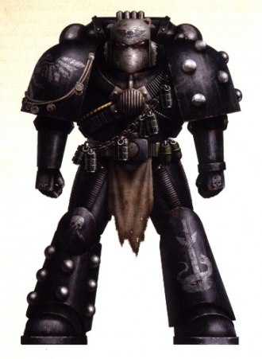
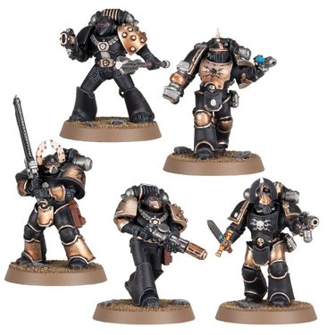

# 0182 黑盾 Blackshields

精校状态：中文行文已逐段精校，部分术语仍为暂定

分类：通用概念 / 帝国 Imperium / 中央政务部 Adeptus Terra / 星际战士军团 Space Marine Legion

原文来源：https://www.bilibili.com/opus/1198397601913765897

原作者：帝国神选罐头

原文时间：2026年05月04日 10:34

[返回分类目录](目录.md) · [全书目录](../../目录.md)

<!-- A0182-B0001 -->
**英文原文**

The term Blackshields refers to irregular Space Marine units during the Horus Heresy. Small in scale, few numbered more than a thousand or so warriors.

<!-- /A0182-B0001 -->

<!-- A0182-B0002 -->

原译文

黑盾一词是指荷鲁斯叛乱时期的非正规星际战士单位。规模很小，很少有超过一千名战士。

**校订译文**

黑盾是荷鲁斯之乱期间非正规星际战士部队的统称。这些部队规模较小，兵力超过一千人左右的很少。

<!-- /A0182-B0002 -->

<!-- A0182-B0003 图片 -->

<!-- A0182-B0004 -->

原译文

Blackshield of the Dark Brotherhood 黑暗兄弟会的黑盾

**校订译文**

Blackshield of the Dark Brotherhood 黑暗兄弟会的黑盾

<!-- /A0182-B0004 -->

<!-- A0182-B0005 -->
## Overview 概述

<!-- /A0182-B0005 -->

<!-- A0182-B0006 -->
**英文原文**

Evoking martial tradition of ancient times, a Blackshield was a warrior who had entirely denounced his parent Legion, or in some extreme cases had never known from which Legion they originated. They often fought under a false banner or bore no banner at all. Groups of Blackshields fought against both sides in the Heresy, dating back to the Battle of the Coronid Deeps of 006-008.M31. There, a force of loyalist Astartes clad in black and wearing no iconography other than the Aquila formed to fight the traitors, but refused the order to withdraw and were presumed lost.

<!-- /A0182-B0006 -->

<!-- A0182-B0007 -->

原译文

黑盾唤起了古代的军事传统，是一名完全谴责其母军团的战士，或者在某些极端情况下从未知道他们来自哪个军团。他们经常打着假旗号作战，或者根本没有旗号。黑盾组织在叛乱中与双方作战，可以追溯到006-008.M31的科罗尼德深渊之战。在那里，一支由忠诚派阿斯塔特组成的部队身穿黑甲，除了天鹰之外没有其他标记，组成了一支与叛徒作战的部队，但拒绝了撤军的命令，并被认为已经损失。

**校订译文**

“黑盾”沿用了古老的武士传统，指与原军团彻底决裂的战士；极少数甚至从未知道自己源自哪个军团。他们常冒用别人的旗号，或根本不打任何旗帜。荷鲁斯之乱期间，黑盾曾同交战双方为敌。相关记载可追溯至 006—008.M31 的科罗尼德深渊之战：一支身穿黑甲、除天鹰外不佩戴任何标记的忠诚派阿斯塔特部队，在此抵抗叛徒。他们拒绝撤退命令，后来被推定已经覆灭。

<!-- /A0182-B0007 -->

<!-- A0182-B0008 -->
**英文原文**

The exact origins of the Blackshields phenomenon remains a mystery. However, what is known is that many types of Blackshields existed, most defined by the circumstances of their formation. Some were Astartes driven beyond their limits, consumed by the grief and insanity of the Heresy. Some were so broken in mind and spirit they no longer recognized or acknowledged any lord, becoming determined to forge their own path in the Galaxy. Others were mere raiders determined to claiming their own domains from both sides. Some thought they were still continuing the work of the Great Crusade while others established petty empires, enslaving those they came across. Perhaps the most mythic type of Blackshields were those who actively turned on their own Primarch and Legion.

<!-- /A0182-B0008 -->

<!-- A0182-B0009 -->

原译文

黑盾现象的确切起源仍然是个谜。然而，众所周知，存在许多类型的黑盾，其中大多数是根据其形成的环境来定义的。有些人是阿斯塔特，被叛乱的悲伤和疯狂所驱使。有些人的思想和精神都崩溃了，他们不再接受或承认任何领主，决心在银河系中开辟自己的道路。其他人只是决心从双方夺取自己领土的袭击者。一些人认为他们仍在继续大远征的工作，而另一些人则建立了小帝国，奴役他们遇到的人。也许最神秘的黑盾是那些积极对抗自己的原体和军团的人。

**校订译文**

黑盾现象的确切起源仍不清楚，但他们显然有许多不同类型，往往取决于各自形成的经历。有些阿斯塔特被战争逼过承受极限，沉沦于悲伤与疯狂；有些精神彻底崩溃，不再承认任何主君，决心在银河中自寻道路；有些只是掠夺者，企图从交战双方手中夺取领地。有人认为自己仍在延续大远征，有人却建立小型帝国，奴役沿途遇见的人。最富传奇色彩的，也许是那些主动反抗自身原体与军团的黑盾。

<!-- /A0182-B0009 -->

<!-- A0182-B0010 -->
**英文原文**

However, one of the few defining factors common across Blackshields was the fact they all denounced their heritage and none considered themselves belonging to any Primarch. This led to most, though not all, painting themselves in a distinctive black. As with Shattered Legions forces, Blackshields were encountered on both sides of the war and in many cases were fighting entirely for themselves. Some bore the Aquila while others bore the Eye of Horus, but none answered to any master except themselves. The Imperium considered many of these bands to be little more than Pirates.

<!-- /A0182-B0010 -->

<!-- A0182-B0011 -->

原译文

然而，黑盾为数不多的共同定义因素之一是，他们都谴责自己的遗产，没有人认为自己属于任何一位原体。这导致大多数人（尽管不是全部）将自己涂成独特的黑色。与破碎军团一样，黑盾在战争双方都遇到了，在许多情况下，他们完全是为自己而战。有些人佩戴天鹰，而另一些人佩戴荷鲁斯之眼，但除了他们自己，没有人对任何主人负责。帝国认为这些群体中的许多只不过是海盗。

**校订译文**

黑盾为数不多的共同特征之一，就是否认原有传承，不再认为自己隶属任何原体。因此，他们大多将盔甲漆成醒目的黑色，但并非人人如此。与破碎军团部队一样，战争双方都曾有黑盾参战，许多人则只为自己而战。有的佩戴天鹰，有的佩戴荷鲁斯之眼，但他们都不向外人效忠。帝国认为，其中许多团伙无异于海盗。

<!-- /A0182-B0011 -->

<!-- A0182-B0012 -->
**英文原文**

In battle, Blackshields were observed using "Pariah" Wargear, modifying their armour and weapons in ways that would have been considered illegal in the Legiones Astartes. They were also observed using Xenos weaponry.

<!-- /A0182-B0012 -->

<!-- A0182-B0013 -->

原译文

在战斗中，观察到黑盾使用“被遗弃的”战斗装备，以及在阿斯塔特军团被视为非法的方式修改他们的盔甲和武器。还观察到他们使用异型武器。

**校订译文**

黑盾被观察到使用“弃民”式战斗装备（Pariah Wargear）：他们以阿斯塔特军团制度不允许的方式改造盔甲和武器，有时还会使用异形武器。

<!-- /A0182-B0013 -->

<!-- A0182-B0014 图片 -->

<!-- A0182-B0015 -->

原译文

Blackshield squad 黑盾小队

**校订译文**

Blackshield squad 黑盾小队

<!-- /A0182-B0015 -->

<!-- A0182-B0016 -->
## Types of Blackshields 黑盾类型

<!-- /A0182-B0016 -->

<!-- A0182-B0017 -->
**英文原文**

Death Seekers — Blackshields consumed with a drive to find death in battle. They were psychologically unstable and could endure tremendous amounts of pain and injury.

<!-- /A0182-B0017 -->

<!-- A0182-B0018 -->

原译文

死亡追寻者 — 在战斗中追寻死亡的冲动吞噬了黑盾。他们心理不稳定，可以忍受巨大的痛苦和伤害。

**校订译文**

死亡追寻者——一心求得战死的黑盾。他们精神不稳定，却能忍受极大的痛苦与伤害。

<!-- /A0182-B0018 -->

<!-- A0182-B0019 -->
**英文原文**

Orphans of War — Hardened veterans who were distrustful of both sides of the Heresy.

<!-- /A0182-B0019 -->

<!-- A0182-B0020 -->

原译文

战争孤者 — 对叛乱双方都不信任的有经验的老兵。

**校订译文**

战争孤者 — 对叛乱双方都不信任的有经验的老兵。

<!-- /A0182-B0020 -->

<!-- A0182-B0021 -->
**英文原文**

Outlanders — Have turned to pursuing their own goals, often acting as marauders and pirates.

<!-- /A0182-B0021 -->

<!-- A0182-B0022 -->

原译文

异乡人 — 转而追求自己的目标，经常充当掠夺者和海盗。

**校订译文**

异乡人 — 转而追求自己的目标，经常充当掠夺者和海盗。

<!-- /A0182-B0022 -->

<!-- A0182-B0023 -->
**英文原文**

Chymeriae — Warriors born from a combination of gene-seed from different Legions, often at the demand of a rogue Primarch or Apothecary. These warriors were mentally unstable and unpredictable, often suffering from madness and mutations.

<!-- /A0182-B0023 -->

<!-- A0182-B0024 -->

原译文

奇美拉 — 由不同军团的基因种子组合而成的战士，通常是在暴戾原体或药剂师的要求下诞生的。这些战士精神不稳定，难以捉摸，经常遭受疯狂和突变的折磨。

**校订译文**

奇美拉战士——将不同军团的基因种子混合而培育出的战士，往往出自脱离约束的原体或药剂师之命。他们精神不稳定、难以预测，常受疯狂与突变折磨。

**校注：** Chymeriae 为基因混合战士，与奇美拉运输车不是同一实体，增加通名“战士”以区分。

<!-- /A0182-B0024 -->

<!-- A0182-B0025 -->
## Known Blackshield Bands 已知黑盾群体

<!-- /A0182-B0025 -->

<!-- A0182-B0026 -->
## Named groups 命名组织

<!-- /A0182-B0026 -->

<!-- A0182-B0027 -->

原译文

Ashen Claws 灰烬之爪

**校订译文**

Ashen Claws 灰烬之爪

<!-- /A0182-B0027 -->

<!-- A0182-B0028 -->
**英文原文**

Brotherhood of Set — Took part in the Solar War

<!-- /A0182-B0028 -->

<!-- A0182-B0029 -->

原译文

集群兄弟会 — 参与了太阳战争

**校订译文**

赛特兄弟会——参加了太阳战争。

**校注：** Set 为组织专名，原译集群误按普通英文动词或集合名词理解，暂音译赛特。

<!-- /A0182-B0029 -->

<!-- A0182-B0030 -->
**英文原文**

Burnt Word — Took part in the Solar War

<!-- /A0182-B0030 -->

<!-- A0182-B0031 -->

原译文

烧焦之言 — 参与了太阳战争

**校订译文**

烧焦之言 — 参与了太阳战争

<!-- /A0182-B0031 -->

<!-- A0182-B0032 -->
**英文原文**

Company of the Sundered — Pirate band

<!-- /A0182-B0032 -->

<!-- A0182-B0033 -->

原译文

割裂连队 — 海盗群体

**校订译文**

割裂连队 — 海盗群体

<!-- /A0182-B0033 -->

<!-- A0182-B0034 -->

原译文

Dark Brotherhood 黑暗兄弟会

**校订译文**

Dark Brotherhood 黑暗兄弟会

<!-- /A0182-B0034 -->

<!-- A0182-B0035 -->

原译文

Death Eagles 死亡之鹰

**校订译文**

Death Eagles 死亡天鹰

<!-- /A0182-B0035 -->

<!-- A0182-B0036 -->

原译文

Desolation Hounds 荒凉猎犬

**校订译文**

Desolation Hounds 荒凉猎犬

<!-- /A0182-B0036 -->

<!-- A0182-B0037 -->

原译文

Disciples of the Flames 火焰门徒

**校订译文**

Disciples of the Flames 火焰门徒

<!-- /A0182-B0037 -->

<!-- A0182-B0038 -->
**英文原文**

Fangs of the Emperor — Loyalist warband led by Endryd Haar

<!-- /A0182-B0038 -->

<!-- A0182-B0039 -->

原译文

帝皇獠牙 — 由恩德里德·哈尔领导的忠诚派战帮

**校订译文**

帝皇獠牙 — 由恩德里德·哈尔领导的忠诚派战帮

<!-- /A0182-B0039 -->

<!-- A0182-B0040 -->
**英文原文**

Gerasene Host — Undertook unsanctioned gene-seed hybridization, creating "Chymeriae" Astartes

<!-- /A0182-B0040 -->

<!-- A0182-B0041 -->

原译文

格拉森之主 — 进行未经批准的基因种子杂交，创造了“奇美拉”阿斯塔特

**校订译文**

格拉森军势——擅自混合不同基因种子，创造“奇美拉”阿斯塔特。

<!-- /A0182-B0041 -->

<!-- A0182-B0042 -->

原译文

Marauder Squad 掠夺者小队

**校订译文**

Marauder Squad 掠夺者小队

<!-- /A0182-B0042 -->

<!-- A0182-B0043 -->

原译文

Mind-Blade 思维之刃

**校订译文**

Mind-Blade 思维之刃

<!-- /A0182-B0043 -->

<!-- A0182-B0044 -->
**英文原文**

Nine Blades — Established a petty slave empire in the Truan System

<!-- /A0182-B0044 -->

<!-- A0182-B0045 -->

原译文

九刃 — 在特鲁安星系中建立了一个小型奴隶帝国

**校订译文**

九刃 — 在特鲁安星系中建立了一个小型奴隶帝国

<!-- /A0182-B0045 -->

<!-- A0182-B0046 -->
**英文原文**

Skyrar's Dark Wolves — Mixed Sons of Horus/Space Wolves warband

<!-- /A0182-B0046 -->

<!-- A0182-B0047 -->

原译文

斯凯拉尔的黑暗之狼 — 荷鲁斯之子/太空野狼混合战帮

**校订译文**

斯凯拉尔的黑暗之狼 — 荷鲁斯之子/太空野狼混合战帮

<!-- /A0182-B0047 -->

<!-- A0182-B0048 -->

原译文

Third Covenant 第三盟约

**校订译文**

Third Covenant 第三盟约

<!-- /A0182-B0048 -->

<!-- A0182-B0049 -->

原译文

True Flame 真实火焰

**校订译文**

True Flame 真实火焰

<!-- /A0182-B0049 -->

<!-- A0182-B0050 -->
**英文原文**

Twelfth Truth — Took part in the Solar War

<!-- /A0182-B0050 -->

<!-- A0182-B0051 -->

原译文

第十二真理 — 参与了太阳战争

**校订译文**

第十二真理 — 参与了太阳战争

<!-- /A0182-B0051 -->

<!-- A0182-B0052 -->
**英文原文**

Umbral Hundred — Scoured twelve Systems in the Chonma Sector in 011.M31

<!-- /A0182-B0052 -->

<!-- A0182-B0053 -->

原译文

阴影百人队 — 在011.M31清洗了琼玛星区的十二个星系

**校订译文**

阴影百人队 — 在011.M31清洗了琼玛星区的十二个星系

<!-- /A0182-B0053 -->

<!-- A0182-B0054 -->
## Unnamed groups 无名组织

<!-- /A0182-B0054 -->

<!-- A0182-B0055 -->
**英文原文**

Raven Guard Blackshield group loyal to Horus - Murdered twenty million civilians at the gas giants of Euros

<!-- /A0182-B0055 -->

<!-- A0182-B0056 -->

原译文

忠于荷鲁斯的暗鸦守卫黑盾组织 - 在尤罗斯气体巨星谋杀了2000万平民

**校订译文**

忠于荷鲁斯的暗鸦守卫黑盾组织 - 在尤罗斯气体巨星谋杀了2000万平民

<!-- /A0182-B0056 -->

<!-- A0182-B0057 -->
**英文原文**

Loyalist Sons of Horus Blackshield group - Wore plundered armour, captured stasis weapons on Gamma-Dvalin, and used these for a suicidal attack on traitor Sons of Horus on lantana Minor

<!-- /A0182-B0057 -->

<!-- A0182-B0058 -->

原译文

忠诚派荷鲁斯之子黑盾组织 - 穿戴掠夺的盔甲，在伽马-德瓦林上缴获了静滞武器，并用这些武器对兰塔纳次星的叛徒荷鲁斯之子进行了自杀式袭击

**校订译文**

忠诚派荷鲁斯之子黑盾组织 - 穿戴掠夺的盔甲，在伽马-德瓦林上缴获了静滞武器，并用这些武器对兰塔纳次星的叛徒荷鲁斯之子进行了自杀式袭击

<!-- /A0182-B0058 -->

<!-- A0182-B0059 -->
**英文原文**

A Blackshield group which crippled the Death Guard warship Morbid Revelation

<!-- /A0182-B0059 -->

<!-- A0182-B0060 -->

原译文

一个黑盾组织瘫痪了死亡守卫战舰疾病启示号

**校订译文**

一个黑盾组织瘫痪了死亡守卫战舰疾病启示号

<!-- /A0182-B0060 -->

<!-- A0182-B0061 -->
**英文原文**

Warband which bore hybrid Iron Hands-Sons of Horus smybols and fought for the traitors in the Mezoan Campaign

<!-- /A0182-B0061 -->

<!-- A0182-B0062 -->

原译文

在梅佐安战役中为叛徒作战的钢铁之手-荷鲁斯之子混合标志战帮

**校订译文**

在梅佐安战役中为叛徒作战的钢铁之手-荷鲁斯之子混合标志战帮

<!-- /A0182-B0062 -->

<!-- A0182-B0063 -->
**英文原文**

Death Guard loyalists who returned to the symbols of the Dusk Raiders before fighting the Iron Warriors at Kibron and Malinche's Fall

<!-- /A0182-B0063 -->

<!-- A0182-B0064 -->

原译文

在基布龙和马林切之陨与钢铁勇士作战之前，死亡守卫忠诚派回归了黄昏突袭者的标志

**校订译文**

在基布龙和马林切之陨与钢铁勇士作战之前，死亡守卫忠诚派回归了黄昏突袭者的标志

<!-- /A0182-B0064 -->

<!-- A0182-B0065 -->
**英文原文**

Night Lords loyalists who were active on Estaban III during the Great Scouring

<!-- /A0182-B0065 -->

<!-- A0182-B0066 -->

原译文

在大清洗期间活跃在埃斯特班三号的午夜领主忠诚派

**校订译文**

在大清洗期间活跃在埃斯特班三号的午夜领主忠诚派

<!-- /A0182-B0066 -->

<!-- A0182-B0067 -->
**英文原文**

Loyalist Blackshields of Battlegroup Revenant

<!-- /A0182-B0067 -->

<!-- A0182-B0068 -->

原译文

亡魂战斗群的忠诚派黑盾

**校订译文**

亡魂战斗群的忠诚派黑盾

<!-- /A0182-B0068 -->

<!-- A0182-B0069 -->
**英文原文**

Khorak's group - A faction of Death Guard members who turned against their Legion when Mortarion used witchcraft during the Battle of Molech. They considered themselves the last "true" remnants of the Death Guard, and retained the legion's symbols and colors, though sought to eventually kill their Primarch. The group was wiped out at Agarvian.

<!-- /A0182-B0069 -->

<!-- A0182-B0070 -->

原译文

科拉克的组织 - 当莫塔里安在摩洛之战中使用妖术时，死亡守卫一个派系的成员转而对抗他们的军团。他们认为自己是死亡守卫最后的“真正”残余，并保留了军团的标志和配色，尽管他们试图最终杀死他们的原体。该组织在阿加维安被消灭。

**校订译文**

科拉克的组织 - 当莫塔里安在摩洛之战中使用妖术时，死亡守卫一个派系的成员转而对抗他们的军团。他们认为自己是死亡守卫最后的“真正”残余，并保留了军团的标志和配色，尽管他们试图最终杀死他们的原体。该组织在阿加维安被消灭。

<!-- /A0182-B0070 -->

<!-- A0182-B0071 -->
**英文原文**

Crysos Morturg's warband, based on the Strike Cruiser Malice; later became the 108th Independent Company.

<!-- /A0182-B0071 -->

<!-- A0182-B0072 -->

原译文

克瑞索斯·莫特格的战帮，基于打击巡洋舰恶意号；后来成为第108独立连队。

**校订译文**

克瑞索斯·莫特格的战帮，以打击巡洋舰恶意号为基地，后来成为第一百零八独立连队。

<!-- /A0182-B0072 -->

<!-- A0182-B0073 -->
## Famous Blackshields 著名黑盾

<!-- /A0182-B0073 -->

<!-- A0182-B0074 -->
**英文原文**

Endryd Haar — Former World Eater

<!-- /A0182-B0074 -->

<!-- A0182-B0075 -->

原译文

恩德里德·哈尔 — 前吞世者

**校订译文**

恩德里德·哈尔 — 前吞世者

<!-- /A0182-B0075 -->

<!-- A0182-B0076 -->
**英文原文**

Erud Vahn — Former Death Guard

<!-- /A0182-B0076 -->

<!-- A0182-B0077 -->

原译文

埃鲁德·梵恩 — 前死亡守卫

**校订译文**

埃鲁德·梵恩 — 前死亡守卫

<!-- /A0182-B0077 -->

<!-- A0182-B0078 -->
**英文原文**

Crysos Morturg — Former Death Guard

<!-- /A0182-B0078 -->

<!-- A0182-B0079 -->

原译文

克瑞索斯·莫特格 — 前死亡守卫

**校订译文**

克瑞索斯·莫特格 — 前死亡守卫

<!-- /A0182-B0079 -->

<!-- A0182-B0080 -->
**英文原文**

Nemean — Former Dark Angels

<!-- /A0182-B0080 -->

<!-- A0182-B0081 -->

原译文

涅墨亚 — 前黑暗天使

**校订译文**

涅墨亚 — 前黑暗天使

<!-- /A0182-B0081 -->

<!-- A0182-B0082 -->
**英文原文**

Nerat Kirine — Former Raven Guard

<!-- /A0182-B0082 -->

<!-- A0182-B0083 -->

原译文

内拉特·基林 — 前暗鸦守卫

**校订译文**

内拉特·基林 — 前暗鸦守卫

<!-- /A0182-B0083 -->

<!-- A0182-B0084 -->
**英文原文**

Nuhmarak, the "Crippled King of the Void"

<!-- /A0182-B0084 -->

<!-- A0182-B0085 -->

原译文

努马拉克，“跛脚的虚空之王”

**校订译文**

努马拉克，“跛脚的虚空之王”

<!-- /A0182-B0085 -->

<!-- A0182-B0086 -->
**英文原文**

Morkan Sayle — Former Raven Guard

<!-- /A0182-B0086 -->

<!-- A0182-B0087 -->

原译文

莫肯·赛尔 — 前暗鸦守卫

**校订译文**

莫肯·赛尔 — 前暗鸦守卫

<!-- /A0182-B0087 -->

本篇核心术语与暂定项

以下列出本篇出现的英文原形及核心术语表用词。同形词可能指不同对象，具体词义以本篇正文和校注为准；单复数、别名和仅见于图注的名称可能尚未列入。完整候选见[术语表](../../术语表/双语术语候选.csv)。

| 英文 | 采用中文 | 状态 |
| --- | --- | --- |
| Dark Angels | 黑暗天使 | 官方已核对 |
| Space Wolves | 太空野狼 | 官方已核对 |
| Death Guard | 死亡守卫 | 官方已核对 |
| Horus Heresy | 荷鲁斯之乱 | 官方已核对 |
| Imperium | 帝国 | 暂定·简称 |
| Emperor | 帝皇 | 官方已核对 |
| Primarch | 原体 | 官方已核对 |
| Iron Warriors | 钢铁勇士 | 暂定·官方待核 |
| Night Lords | 午夜领主 | 暂定·官方待核 |
| The Order | 秩序 | 暂定·官方待核 |
| Great Crusade | 大远征 | 暂定·官方待核 |
| Mortarion | 莫塔里安 | 官方已核对 |
| Horus | 荷鲁斯 | 暂定·官方待核 |
| Sons of Horus | 荷鲁斯之子 | 暂定·官方待核 |
| Iron Hands | 钢铁之手 | 暂定·官方待核 |
| Legiones Astartes | 阿斯塔特军团 | 暂定·官方待核 |
| Sector | 星区 | 暂定·官方待核 |
| Brotherhood | 兄弟会 | 暂定·官方待核 |
| Molech | 摩洛 | 暂定·官方待核 |
| Pariah | 贱民 | 暂定·官方待核 |
| Aquila | 天鹰 | 暂定·官方待核 |
| Master | 导师（审判庭职衔）／舰务官（舰员职务） | 语境定译·官方待核 |
| Apothecary | 药剂师 | 官方已核对 |
| Ancient | 旗手 | 官方已核对 |
| Skyrar's Dark Wolves | 斯卡拉的暗狼 | 暂定·官方待核 |
| Raven Guard | 暗鸦守卫 | 官方已核 |
| Shattered Legions | 破碎军团 | 暂定·官方待核 |
| The Mezoan Campaign | 梅佐安战役 | 暂定·官方待核 |
| Blackshields | 黑盾 | 暂定·官方待核 |
| Death Seekers | 死亡追寻者 | 暂定·官方待核 |
| Orphans of War | 战争孤者 | 暂定·官方待核 |
| Outlanders | 异乡人 | 暂定·官方待核 |
| Chymeriae | 奇美拉战士 | 暂定·官方待核 |
| Brotherhood of Set | 赛特兄弟会 | 暂定·官方待核 |
| Burnt Word | 烧焦之言 | 暂定·官方待核 |
| Company of the Sundered | 割裂连队 | 暂定·官方待核 |
| Fangs of the Emperor | 帝皇獠牙 | 暂定·官方待核 |
| Gerasene Host | 格拉森军势 | 暂定·官方待核 |
| Nine Blades | 九刃 | 暂定·官方待核 |
| Twelfth Truth | 第十二真理 | 暂定·官方待核 |
| Umbral Hundred | 阴影百人队 | 暂定·官方待核 |
| Endryd Haar | 恩德里德·哈尔 | 暂定·官方待核 |
| Erud Vahn | 埃鲁德·梵恩 | 暂定·官方待核 |
| Crysos Morturg | 克瑞索斯·莫特格 | 暂定·官方待核 |
| Nemean | 涅墨亚 | 暂定·官方待核 |
| Nerat Kirine | 内拉特·基林 | 暂定·官方待核 |
| Nuhmarak | 努马拉克 | 暂定·官方待核 |
| Morkan Sayle | 莫肯·赛尔 | 暂定·官方待核 |
| Space Marine | 星际战士 | 暂定·官方待核 |
| Marauders | 掠夺者 | 暂定·官方待核 |
| Remnants | 残骸 | 暂定·官方待核 |
| Gene-seed | 基因种子 | 暂定·官方待核 |
| Strike Cruiser | 打击巡洋舰 | 暂定·官方待核 |
| Grief | 格里夫 | 暂定·官方待核 |
| Host | 天军 | 暂定·官方待核 |
| Malice | 恶意 | 暂定·官方待核 |
| Xenos | 异形 | 暂定·官方待核 |
| Seekers | 寻觅者 | 官方已核对 |
| Dusk Raiders | 黄昏突袭者 | 暂定·官方待核 |
| Coronid Deeps | 科罗尼德深渊 | 暂定·官方待核 |
| Great Scouring | 大清洗 | 暂定·官方待核 |
| Revelation | 启示 | 暂定·官方待核 |
| System | 星系（恒星系统） | 暂定·官方待核 |
| Estaban III | 埃斯塔班三号 | 暂定·官方待核 |
| Chonma Sector | 天马星区 | 暂定·官方待核 |

