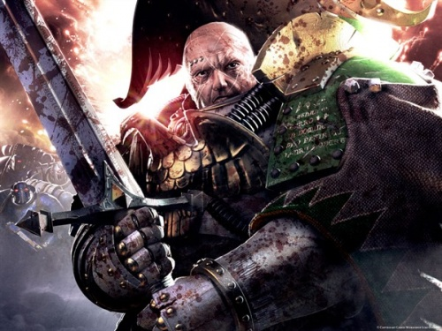
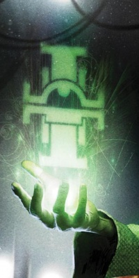
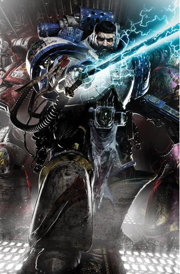

# 0183 游侠骑士 Knights-Errant

精校状态：中文行文已逐段精校，部分术语仍为暂定

分类：通用概念 / 帝国 Imperium / 中央政务部 Adeptus Terra / 星际战士军团 Space Marine Legion

原文来源：https://www.bilibili.com/opus/1061864615972962327

原作者：帝国神选罐头

原文时间：编辑于 2025年06月22日 14:18

[返回分类目录](目录.md) · [全书目录](../../目录.md)

<!-- A0183-B0001 -->
**英文原文**

The Knights-Errant were a small host of Space Marines gathered during the Horus Heresy on the orders of Malcador the Sigillite.

<!-- /A0183-B0001 -->

<!-- A0183-B0002 -->

原译文

游侠骑士是在荷鲁斯叛乱时期，根据掌印者马卡多的命令聚集的一小群星际战士。

**校订译文**

游侠骑士是荷鲁斯之乱期间，依掌印者马卡多之命召集的一支小规模星际战士部队。

<!-- /A0183-B0002 -->

<!-- A0183-B0003 图片 -->

<!-- A0183-B0004 -->

原译文

Nathaniel Garro, former Battle-Captain of the Death Guard, the first of Malcador's "Knights-Errant" 纳撒尼尔·伽罗，前死亡守卫战斗连长，马卡多的第一个“游侠骑士”

**校订译文**

Nathaniel Garro, former Battle-Captain of the Death Guard, the first of Malcador's "Knights-Errant" 纳撒尼尔·伽罗，前死亡守卫战斗连长，马卡多的第一个“游侠骑士”

<!-- /A0183-B0004 -->

<!-- A0183-B0005 -->
## Founding 成立

<!-- /A0183-B0005 -->

<!-- A0183-B0006 -->
**英文原文**

While Horus's rebellion was raging across the Galaxy, Malcador was already thinking ahead to the future. When Nathaniel Garro, Battle-Captain of the Death Guard Legion, escaped to Terra aboard the Eisenstein after refusing to follow his brothers' treason, Malcador called an audience with him and two of his companions, Iacton Qruze of the Luna Wolves and Amendera Kendel of the Sisters of Silence. He gave them a new purpose by tasking them with serving the Emperor in a different way, as the forerunners of on organisation that would 'require men and women of an inquisitive nature, hunters who might seek the witch, the traitor, the mutant, the xenos...',Malcador then tasked Garro with several dangerous missions to recruit other Space Marines into the group.

<!-- /A0183-B0006 -->

<!-- A0183-B0007 -->

原译文

当荷鲁斯的叛乱在银河系肆虐时，马卡多已经在考虑未来了。当死亡守卫军团的战斗连长纳撒尼尔·伽罗在拒绝追随兄弟的叛国行为后，乘坐爱森斯坦号逃到泰拉时，马卡多召集了他和他的两个同伴，影月苍狼的亚克顿·克鲁兹和寂静修女的阿蒙德菈·肯德尔。他给了他们一个新的目的，让他们以不同的方式为帝皇服务，作为“需要好学好问的男人与女人、可能寻找女巫、叛徒、变种人、异型的猎人……”的组织的先驱，马卡多随后委托伽罗执行几项危险的任务，招募其他星际战士加入该小队。

**校订译文**

荷鲁斯的叛乱席卷银河时，马卡多已经在谋划未来。死亡守卫战斗连长纳撒尼尔·伽罗拒绝追随军团背叛，乘爱森斯坦号逃到泰拉后，马卡多召见了他，以及同行的影月苍狼亚克顿·克鲁兹、寂静修女阿蒙德菈·肯德尔。他赋予三人新的使命，让他们以另一种方式效忠帝皇，成为某个未来组织的先驱。这个组织将需要“善于追问真相的男女，追猎巫师、叛徒、变种人和异形的猎手……”此后，马卡多派伽罗执行多项危险任务，招募其他星际战士加入。

<!-- /A0183-B0007 -->

<!-- A0183-B0008 图片 -->

<!-- A0183-B0009 -->

原译文

Malcador's Sigil, which was inscribed onto the armour of the Knights-Errant 马卡多之印，刻在游侠骑士的盔甲上·

**校订译文**

Malcador's Sigil, which was inscribed onto the armour of the Knights-Errant 马卡多之印，刻于游侠骑士的盔甲上。

<!-- /A0183-B0009 -->

<!-- A0183-B0010 -->
## Missions 任务

<!-- /A0183-B0010 -->

<!-- A0183-B0011 -->
### Calth 考斯

<!-- /A0183-B0011 -->

<!-- A0183-B0012 -->
**英文原文**

The first of Garro's recruiting missions sent him to Calth, where he arrived in the midst of the Word Bearers's surprise attack to recruit Tylos Rubio of the Ultramarines. A suspicious Rubio said it was foolhardy for Garro to appear alone on a battlefield,"court\[ing\] death... like some ancient knight-errant." Garro, who had renounced his former rank, was amused to accept the title as fitting. He helped the Ultramarines fend off the Word Bearers' attacks but Rubio refused to abandon his company, and only left the battlefield with Garro after an overwhelming assault forced him to unleash his banned psyker powers, which saved his comrades but earned him their censure for breaking the Edict of Nikaea.

<!-- /A0183-B0012 -->

<!-- A0183-B0013 -->

原译文

伽罗的第一次招募任务将他送到了考斯，在那里，他在怀言者的突然袭击中抵达，招募了星际战士的泰洛斯·卢比奥。多疑的卢比奥表示，伽罗独自出现在战场上是鲁莽的，“寻求死亡...像古代游侠一样。”伽罗已经放弃了以前的军衔，他很高兴接受这个头衔。他帮助极限战士抵御了怀言者的攻击，但卢比奥拒绝放弃他的连队，只有在一次压倒性的袭击迫使他释放了被禁止的灵能者力量后，他才与伽罗离开战场，这拯救了他的战友们，但让他因破坏了尼凯亚法令而受到谴责。

**校订译文**

伽罗的首次招募任务把他带到考斯。他在怀言者突袭期间抵达，寻找极限战士泰洛斯·卢比奥。心存戒备的卢比奥认为，他孤身来到战场简直莽撞，是在“寻死……像古代的游侠骑士一样”。已放弃原有军衔的伽罗觉得这个称呼颇为贴切，欣然接受。他帮助极限战士抵御进攻，但卢比奥不肯抛下连队。后来，一次势不可当的敌军攻击迫使卢比奥释放被禁用的灵能，救下战友，却也因违反尼凯亚法令而受到他们谴责。至此，他才随伽罗离开。

<!-- /A0183-B0013 -->

<!-- A0183-B0014 -->
### Sol 太阳系

<!-- /A0183-B0014 -->

<!-- A0183-B0015 -->
**英文原文**

Garro's second mission took place in the Sol system itself when a group of refugee ships arrived from the Isstvan system, claiming to be loyalists. Along with Rubio and agents of the Legio Custodes Garro investigated the fleet, which was led by loyalist World Eater Macer Varren but included White Scars and Emperor's Children as well. Events soon incriminated the Emperor's Children as traitors, but Garro, Rubio and Varren realized they had been tricked when the White Scars murder the Emperor's Children and Custodes. All of Varren's men are killed but he, Garro and Rubio escape and destroy the ship with the White Scars aboard.

<!-- /A0183-B0015 -->

<!-- A0183-B0016 -->

原译文

伽罗的第二次任务发生在太阳系本身，当时一群难民船从伊斯塔万星系抵达，声称是忠诚者。伽罗与卢比奥和禁军的特工一起调查了这支舰队，这支舰队由忠诚派吞世者马克尔·瓦伦领导，但也包括白色伤疤和帝皇之子。事件很快将帝皇之子定为叛徒，但当白色伤疤杀死了帝皇之子和禁军时，伽罗、卢比奥和瓦伦意识到，他们被骗了。瓦伦的所有手下都被杀了，但他、伽罗和卢比奥逃脱并摧毁了船上的白色伤疤。

**校订译文**

伽罗的第二次任务发生在太阳系。一支自称忠诚派的难民舰队从伊斯塔万抵达，伽罗与卢比奥、禁军人员共同调查。舰队由忠诚派吞世者马塞尔·瓦伦率领，其中还有白疤和帝皇之子。种种迹象起初都指向帝皇之子是叛徒；直到白疤杀死帝皇之子与禁军，三人才意识到自己受了骗。瓦伦部下全部遇害，但他与伽罗、卢比奥成功逃出，并摧毁了载有那些白疤叛徒的船只。

<!-- /A0183-B0016 -->

<!-- A0183-B0017 -->
### The Phalanx 山阵号

<!-- /A0183-B0017 -->

<!-- A0183-B0018 -->
**英文原文**

Garro undertook a further recruiting mission alone, infiltrating the Imperial Fists star-fortress Phalanx to rescue a Librarian named Massic, who had been imprisoned by his Legion since the Edict of Nikaea. Garro reached Massic and the other Librarians but they refused to leave and he was caught by Rogal Dorn, who warned him and Malcador by proxy not to interfere again, but revealed that he was not imprisoning his Librarians out of blind obedience but to keep them safe for the war to come.

<!-- /A0183-B0018 -->

<!-- A0183-B0019 -->

原译文

伽罗独自进行了进一步的招募任务，渗透到帝国之拳星堡山阵号，营救了一位名叫马萨克的智库，他自尼凯亚法令以来一直被他的军团监禁。伽罗找到了马萨克和其他智库，但他们拒绝离开，他被罗格·多恩抓住，后者通过代理人警告他和马卡多不要再干涉，但透露他并不是出于盲目服从而监禁他的智库，而是为了在即将到来的战争中保护他们的安全。

**校订译文**

伽罗后来独自潜入帝国之拳星堡山阵号，试图招募名叫马萨克的智库员。此人自尼凯亚法令颁布后便遭军团拘禁。伽罗找到了他与其他智库员，但他们不愿离开，伽罗随后被罗格·多恩抓获。多恩警告他，并让他转告马卡多，不要再干涉军团内部事务；同时也透露，自己拘禁智库员并非盲从禁令，而是为了将他们安全保存下来，应对即将到来的战争。

<!-- /A0183-B0019 -->

<!-- A0183-B0020 -->
### Isstvan 伊斯塔万

<!-- /A0183-B0020 -->

<!-- A0183-B0021 -->
**英文原文**

On Garro's final recruiting mission he, Rubio and Varren were sent to Isstvan III in the wake of Horus's virus bombing to recruit a survivor. Discovering a small colony of human refugees who survived their world's destruction they learned of 'the beast', a feral creature that attacks the survivors. Garro and Rubio tracked 'the beast' but it overwhelmed them before going after Varren. Seen to be an Astartes the beast killed several of the human survivors before being driven off by Rubio. However, Rubio later discovered marks of Nurgle on the bodies and the survivors were revealed to be plague zombies, which rose up and attacked the three who were only just saved by the return of the beast. After killing the zombies the beast turned on Garro, but Garro was able to restore the Astartes' damaged mind by revealing his true identity: Garviel Loken.

<!-- /A0183-B0021 -->

<!-- A0183-B0022 -->

原译文

在伽罗的最后一次招募任务中，他、卢比奥和瓦伦被派往荷鲁斯病毒轰炸后的伊斯塔万三号招募幸存者。他们发现了一小群在世界毁灭中幸存下来的人类难民，他们了解到了“野兽”，一种攻击幸存者的野兽。伽罗和卢比奥追踪了“野兽”，但在瓦伦离开之前，它压倒了他们。这头野兽看起来像阿斯塔特，在被卢比奥赶走之前杀死了几名人类幸存者。然而，卢比奥后来在尸体上发现了纳垢的痕迹，幸存者被揭露为瘟疫行尸，他们站起来攻击了三名刚刚被野兽救回的人。在杀死行尸后，这头野兽转向了伽罗，但伽罗通过揭露他的真实身份——加维尔·洛肯，恢复了阿斯塔特受伤的思维。

**校订译文**

最后一次招募任务中，伽罗、卢比奥与瓦伦前往遭病毒轰炸后的伊斯塔万三号，寻找一名幸存者。他们遇到一小群人类难民，得知附近有个袭击幸存者的“野兽”。伽罗与卢比奥追踪它，却被它击败，随后它又扑向瓦伦。这头“野兽”其实是一名阿斯塔特；它杀死数名人类后，被卢比奥逼退。但卢比奥在尸体上发现纳垢印记，所谓幸存者原来是瘟疫行尸。尸体再次爬起，围攻三人；幸而“野兽”返回，他们才获救。杀光行尸后，它又转向伽罗。伽罗道出了其真实身份——加维尔·洛肯——终于唤回了这名阿斯塔特破碎的神智。

<!-- /A0183-B0022 -->

<!-- A0183-B0023 -->
### Caliban 卡利班

<!-- /A0183-B0023 -->

<!-- A0183-B0024 -->
**英文原文**

Garviel Loken and Iacton Qruze were sent to Caliban to ascertain the loyalty of the Dark Angels garrison there. Loken was captured by Luther who interrogated him for information, and determined that Luther might be tainted but that he did not know of the Heresy and not to mention anything lest it be what tips Luther over the edge into betrayal. Freed by a Watcher in the Dark Loken reunited with Qruze, who was forced to shoot a Dark Angel so they could escape. They were then led to freedom by a mysterious Dark Angel who knew of the Heresy, Cypher.

<!-- /A0183-B0024 -->

<!-- A0183-B0025 -->

原译文

加维尔·洛肯和亚克顿·克鲁兹被派往卡利班，以确定那里的黑暗天使驻军的忠诚度。洛肯被卢瑟抓住，卢瑟审问他以获取信息，并确定卢瑟可能受到了污染，但他不知道叛乱，更不用说任何事情了，这避免让卢瑟陷入背叛的边缘。洛肯被黑暗守望者释放后，他们与克鲁兹重聚，克鲁兹被迫射杀了一名黑暗天使，这样他们才能逃脱。然后，他们被一位神秘的黑暗天使带领走向自由，这位黑暗天使知道叛乱，赛弗。

**校订译文**

加维尔·洛肯与亚克顿·克鲁兹奉命前往卡利班，查明当地黑暗天使驻军是否忠诚。洛肯被卢瑟俘虏并审问。他判断卢瑟可能已受腐化，却尚不知道荷鲁斯之乱的消息，于是决定闭口不提，以免这条消息成为促使卢瑟背叛的最后一推。黑暗守望者释放洛肯后，他与克鲁兹会合。克鲁兹被迫射杀一名黑暗天使，为他们开出逃生道路；随后，一位知晓叛乱内情的神秘黑暗天使赛弗，引导两人脱身。

<!-- /A0183-B0025 -->

<!-- A0183-B0026 -->
### Baal 巴尔

<!-- /A0183-B0026 -->

<!-- A0183-B0027 -->
**英文原文**

Tylos Rubio undertook a mission of his own to Baal, bringing word to the small Blood Angels garrison there that with their primarch and Legion lost in the Signus Cluster they were to be disbanded and their fleet and armoury distributed amongst the other loyal Legions. The garrison's commander was prepared to kill Rubio to prevent this from happening, but before this could happen a message came through that Sanguinius and the Blood Angels had survived the ambush at Signus. Happy at this outcome Rubio returned to Terra.

<!-- /A0183-B0027 -->

<!-- A0183-B0028 -->

原译文

泰洛斯·卢比奥对巴尔执行了自己的任务，向那里的小批圣血天使驻军传达了消息，他们的原体和军团在西格纳斯星群中丧生，他们将被解散，他们的舰队和军械库将分配给其他忠诚的军团。驻军指挥官准备杀死卢比奥以防止这种情况发生，但在此之前，有消息传来，圣吉列斯和圣血天使在西格纳斯的伏击中幸存下来。对这一结果感到高兴，卢比奥回到了泰拉。

**校订译文**

泰洛斯·卢比奥独自前往巴尔，通知当地少量圣血天使驻军：由于原体及军团主体在西格纳斯星群失踪或覆灭，军团将被解散，舰队与军械分配给其他忠诚军团。驻军指挥官准备杀死卢比奥阻止命令执行；但行动前，新消息传来，确认圣吉列斯与圣血天使已从西格纳斯的伏击中生还。卢比奥乐见这一结果，返回了泰拉。

**校注：** lost 在此是错误战报下的失踪或覆灭，不应断言原体已死亡。

<!-- /A0183-B0028 -->

<!-- A0183-B0029 -->
### Mars 火星

<!-- /A0183-B0029 -->

<!-- A0183-B0030 -->
**英文原文**

Malcador dispatched Dravian Klayde, formerly of the Raven Guard, to traitor-occupied Mars. His mission was to activate the ancient weapon known as the Vertex Australis to wipe out all life on the planet and thus deny the Dark Mechanicum its stronghold. Though he failed in his mission, he sacrificed himself to kill the corrupted Iron Warrior Aulus Scaramanca.

<!-- /A0183-B0030 -->

<!-- A0183-B0031 -->

原译文

马卡多派遣前暗鸦守卫的德拉维安·克莱德前往叛徒占领的火星。他的任务是激活被称为南天顶点的古老武器，消灭星球上的所有生命，从而剥夺黑暗机械教的堡垒。尽管他在任务中失败了，但他还是牺牲了自己，杀死了腐化的钢铁勇士奥鲁斯·斯卡拉曼卡。

**校订译文**

马卡多派遣前暗鸦守卫的德拉维安·克莱德前往叛徒占领的火星。他的任务是激活被称为南天顶点的古老武器，消灭星球上的所有生命，从而剥夺黑暗机械教的堡垒。尽管他在任务中失败了，但他还是牺牲了自己，杀死了腐化的钢铁勇士奥鲁斯·斯卡拉曼卡。

<!-- /A0183-B0031 -->

<!-- A0183-B0032 -->
### Molech 摩洛

<!-- /A0183-B0032 -->

<!-- A0183-B0033 -->
**英文原文**

The Knights-Errant undertook their first mission as a full squad at the behest of Leman Russ, who worked with Malcador to send a squad to infiltrate Horus's flagship, the Vengeful Spirit to act as pathfinders to guide Russ on a subsequent mission to assassinate Horus. Placed in charge of the mission, Garviel Loken recruited nine other Knights-Errant: Rubio, Varren, Iacton Qruze, Ares Voitek, Tubal Cayne, Bror Tyrfingr, Altan Nohai, Callion Zaven and Rama Karayan. Only Severian initally refused to join the mission.

<!-- /A0183-B0033 -->

<!-- A0183-B0034 -->

原译文

在黎曼·鲁斯的要求下，游侠骑士作为一个完整的小队进行了他们的第一次任务，他与马卡多合作，派遣了一个小队渗透到荷鲁斯的旗舰复仇之魂号中，作为探路者指导鲁斯执行后续暗杀荷鲁斯的任务。加维尔·洛肯被任命为该任务的负责人，他招募了其他九名骑士：卢比奥、瓦伦、亚克顿·克鲁兹、艾瑞斯·伏伊泰克、图巴尔·凯恩、布罗尔·蒂尔芬格、阿坦·诺海、卡利昂·扎文和拉玛·卡拉扬。只有塞维里安最初拒绝加入该任务。

**校订译文**

游侠骑士首次以完整小队执行任务，是应黎曼·鲁斯之请。鲁斯与马卡多派他们潜入荷鲁斯旗舰复仇之魂号，为日后刺杀荷鲁斯的行动探路。任务指挥官加维尔·洛肯选中九名同伴：卢比奥、瓦伦、亚克顿·克鲁兹、阿瑞斯·沃泰克、图巴尔·凯恩、布罗尔·蒂尔芬格、阿坦·诺海、卡利昂·扎文、拉玛·卡拉扬。塞维里安最初拒绝参与。

<!-- /A0183-B0034 -->

<!-- A0183-B0035 -->
**英文原文**

After Severian joined them anyway the Knights, guided by Tubal Cayne's sensors and planning and flying in the ship Tarnhelm piloted by mortal woman Banu Rassuah, boarded the Warmaster's flagship undetected. Leaving a trail of futharc runes to guide a future Space Wolves assault the team moved up through the ship before eventually encountering Sons of Horus resistance. Suffering from post-traumatic stress disorder upon being back on the flagship Loken was too dazed to fight when the team engaged in a skirmish in an armoury, in which Severian, Varren and Zaven were wounded, the latter two badly. Despite Altan Nohai's ministrations, Zaven died shortly afterwards. Tubal Cayne voiced the opinion that Loken was unfit to lead, but the others vouched for him and he led them further into the ship, where they encountered a cult gathering presided over by Serghar Targost. Rama Karayan assassinated Targost from hiding with a bullet to the brain and the Knights slaughtered the cultists, only for Targost's corpse to reanimate, possessed by the daemon Samus, and rip out Tubal Cayne's throat. The others fought back but could not kill Samus until an Ultramarine prisoner, Proximo Tarchon, slew it with a ritual dagger. Altan Nohai attempted to remove Cayne's gene-seed but was shot through the head by Tormageddon, who had already surprised and killed Rama Karayan, as Sons of Horus led by Grael Noctua took the rest prisoner. The Knights-Errant were brought before Horus, who returned to his flagship after conquering Molech, and attempted to talk Loken into rejoining the Sons of Horus. Despite being tempted Loken was able to defy his former primarch and the Knights turned on their captors, initiating a brutal brawl that led to the mortal wounding of Ares Voitek and Proximo Tarchon and the deaths of Grael Noctua, Tormageddon's host body and Iacton Qruze. At that moment Loken was able to summon Banu Rassuah in the Tarnhelm, who blew out the room's windows and sucked the surviving Knights into space. Voitek, Tarchon and Varren were placed in healing comas while Rubio recovered and Bror Tyrfingr and Severian convinced Loken that the mission's failure was not his fault.

<!-- /A0183-B0035 -->

<!-- A0183-B0036 -->

原译文

无论如何，在塞维里安加入他们之后，骑士们在图巴尔·凯恩的传感器和计划的指导下，乘坐由凡人巴努·拉苏阿驾驶的塔恩海姆号飞船，在未被发现的情况下登上了战帅的旗舰。留下一条如尼符文的轨迹来指导未来的太空野狼攻击，该团队在最终遇到荷鲁斯之子的抵抗之前，在飞船中向上移动。洛肯回到旗舰后遭受创伤后应激障碍，当小队在军械库发生小规模冲突时，他头晕目眩，无法战斗，塞维里安、瓦伦和扎文受伤，后两人伤势严重。尽管阿坦·诺海进行了救治，但扎文不久后就牺牲了。图巴尔·凯恩表示洛肯不适合领导，但其他人为他担保，他带领他们进一步进入船上，在那里他们遇到了塞加尔·塔戈斯特主持的邪教集会。拉马·卡拉扬用一颗子弹刺杀了躲藏的塔戈斯特，击中了他的大脑，骑士们屠杀了信徒，只是塔戈斯特的尸体复活，被恶魔萨姆斯附身，并割断了图巴尔·凯恩的喉咙。其他人进行了反击，但直到一名极限战士囚犯普罗克西莫·塔尔孔用仪式匕首杀死了它，他们才杀死了萨姆斯。阿坦·诺海试图回收凯恩的基因种子，但被托玛吉顿射中头部，后者已经突袭并杀死了拉玛·卡拉扬，而格拉艾·诺克图阿领导的荷鲁斯之子俘虏了其余的囚犯。游侠骑士被带到荷鲁斯面前，荷鲁斯在征服摩洛后回到了他的旗舰，并试图说服洛肯重新加入荷鲁斯之子。尽管受到诱惑，洛肯还是能够反抗他的前任原体，骑士们向俘虏他们的人发起攻击，引发了一场残酷的战斗，导致艾瑞斯·伏伊泰克和普罗克西莫·塔尔孔受重伤，托玛吉顿的宿主格拉艾·诺克图阿和亚克顿·克鲁兹死亡。在那一刻，洛肯能够召唤塔恩海姆号的巴努·拉苏阿，他炸毁了房间的窗户，把幸存的骑士们吸入了太空。伏伊泰克、塔尔孔和瓦伦在治疗昏迷中，而卢比奥康复了，布罗尔·蒂尔芬格和塞维里安说服洛肯，任务的失败不是他的错。

**校订译文**

塞维里安最终还是加入了他们。凭借图巴尔·凯恩的探测设备与行动计划，骑士们乘凡人女子巴努·拉苏阿驾驶的塔恩海姆号，悄然登上战帅旗舰。他们一边深入舰内，一边留下弗萨克符文，供日后来袭的太空野狼辨认路线，随后遭遇荷鲁斯之子。在军械库的交火中，重返旗舰使洛肯陷入创伤后应激反应，神情恍惚，无法作战。塞维里安、瓦伦和扎文负伤，后两人伤势尤其严重；阿坦·诺海竭力救治，仍未能救回扎文。凯恩质疑洛肯是否还适合指挥，其他人却支持他。洛肯继续带队深入，发现瑟加尔·塔戈斯特主持的邪教集会。拉玛·卡拉扬藏身暗处，一枪击中塔戈斯特头部，骑士们随即杀死教徒。不料塔戈斯特的尸体被恶魔萨姆斯占据，重新站起，撕开了凯恩的喉咙。众人无法杀死萨姆斯，直到被俘的极限战士普罗克西莫·塔尔孔以仪式匕首将其消灭。诺海正要回收凯恩的基因种子，就被托玛吉顿一枪爆头；托玛吉顿此前还偷袭杀死了卡拉扬。格拉艾·诺克图阿率荷鲁斯之子俘虏了其余骑士。征服摩洛归来的荷鲁斯召见他们，试图说服洛肯重返荷鲁斯之子。洛肯虽一度动摇，最终仍拒绝原体，率同伴向看守反击。混战使沃泰克与塔尔孔濒死，诺克图阿、托玛吉顿的宿主躯体及亚克顿·克鲁兹则身亡。洛肯此时召来拉苏阿，她驾驶塔恩海姆号击碎房间舷窗，失压将幸存骑士吸入太空，让他们得以脱身。沃泰克、塔尔孔与瓦伦被置于治疗性昏迷中，卢比奥逐渐康复；布罗尔·蒂尔芬格与塞维里安则劝服洛肯，不应把任务失败归咎于自己。

<!-- /A0183-B0036 -->

<!-- A0183-B0037 -->
### Shards of Magnus 马格努斯碎片

<!-- /A0183-B0037 -->

<!-- A0183-B0038 -->
**英文原文**

Dio Promus, Antaka Cyvaan, Yasu Nagasena and a force of Space Wolves under Rune Priest Bodvar Bjarki were later tasked by Malcador to recover several Shards of Magnus before the Thousand Sons could do the same. Promus' force first went to Kamiti Sona seeking a shard but were confronted by a raid by the Thousand Sons. The Remembrancer Lemuel Gaumon was captured by the Knights-Errant, who took him back to Aghoru in search of another shard. After Promus and the Space Wolves accompanying him were unable to defeat the shard, Menkaura, a Thousand Son also captured at Kamiti Sona, bound the shard into Gaumon as a daemonhost. The next destination for the Knights was Nikaea in search of another shard where they again met the Thousand Sons of Ahriman. After Gaumon was saved from possession when Ahriman extracted the shards on Nikaea and returned them to the Planet of the Sorcerers, the Rune Priest Bödvar Bjarki determined that Gaumon was "wyrd-wraith" and unable to be possessed by daemons in the future. The Wolves determined would take him back to the Sigillite for questions. At the end of the mission, Bjarki and his Space Wolves killed Promus after discovering he had murdered loyalists while attempting to assemble strong warriors for Malcador's plan on Titan.

<!-- /A0183-B0038 -->

<!-- A0183-B0039 -->

原译文

迪奥·普罗姆斯，安塔卡·凯万，长濑康和符文牧师博德瓦尔·比亚尔基领导的太空野狼部队后来被马卡多委托在千子之前收回几块马格努斯碎片。普罗姆斯的部队首先前往卡米蒂·索纳寻找碎片，但遭到千子的突袭。记述者莱缪尔·高蒙被游侠骑士俘虏，他们带他回到阿格鲁寻找另一块碎片。在普罗姆斯和陪同他的太空野狼无法击败碎片后，同样在卡米蒂·索纳被俘的千子门考拉将碎片绑在高蒙身上作为守护灵。骑士们的下一个目的地是尼凯亚，寻找另一块碎片，在那里他们再次遇到了阿里曼的千子。当阿里曼在尼凯亚提取碎片并将其归还给巫师星球时，高蒙从占据中获救后，符文牧师博德瓦尔·比亚尔基确定高蒙是“命运的幽灵”，未来无法被恶魔占据。野狼决定把他带回掌印者那里问问题。在任务结束时，比亚尔基和他的太空野狼在发现普罗姆斯在试图为马卡多在泰坦上的计划召集强大的战士时谋杀了忠诚者后杀死了普罗姆斯。

**校订译文**

马卡多随后派迪奥·普罗姆斯、安塔卡·凯万、长濑康，以及符文牧师博德瓦尔·比亚尔基率领的太空野狼，抢在千子之前回收马格努斯的灵魂碎片。众人先到卡米蒂·索纳，却遭千子突袭。他们俘虏记述者莱缪尔·高蒙，带他前往阿格鲁寻找另一块碎片。普罗姆斯与随行野狼无法制服碎片，同样在卡米蒂·索纳被俘的千子门考拉，便将其封入高蒙体内，使他成为恶魔宿主。骑士们随后前往尼凯亚寻找下一块碎片，再次遇到阿里曼的千子。阿里曼从高蒙体内取出碎片，带回巫师之星，使高蒙摆脱附身。比亚尔基判断，高蒙已成为“命运幽灵”（wyrd-wraith），此后不会再被恶魔附身，野狼决定将其带回马卡多处审问。任务结束时，比亚尔基等人得知，普罗姆斯曾为马卡多的泰坦计划筛选强大战士，杀害不符合要求的忠诚派，于是将他处死。

<!-- /A0183-B0039 -->

<!-- A0183-B0040 -->
### Terra 泰拉

<!-- /A0183-B0040 -->

<!-- A0183-B0041 -->
**英文原文**

Shortly before the Siege of Terra the Knights-Errant were busy battling Chaos Cultists and Daemonic manifestations that erupted across Terra in a foreshadowing of Horus' arrival. At White Mountain, the Knights fought a Cult led by the Lord of the Flies while Erebus' unwittingly mind-slave Tylos Rubio attempted to assassinate Malcador. After the battle, Malcador brought the remaining Knights-Errant before the Emperor himself who revealed their purpose: to battle a coming war against the Warp in order to prevent the future destruction of humanity. The Emperor made it clear that their part against Horus was done, and now a new fate awaited them.

<!-- /A0183-B0041 -->

<!-- A0183-B0042 -->

原译文

在泰拉围城之前不久，游侠骑士正忙于与混沌邪教徒和恶魔的显现战斗，这些显现在泰拉各地爆发，预示着荷鲁斯的到来。在白色山脉，骑士们与蝇王领导的邪教组织作战，而艾瑞巴斯无意中的思维奴隶泰洛斯·卢比奥试图暗杀马卡多。战斗结束后，马卡多将剩下的游侠骑士带到帝皇面前，帝皇亲自透露了他们的目的：与亚空间作战，以防止未来人类的毁灭。帝皇明确表示，他们对抗荷鲁斯的任务已经完成，现在一个新的命运在等待着他们。

**校订译文**

泰拉围城前夕，混沌教徒与恶魔在泰拉各地活动，预示着荷鲁斯即将到来，游侠骑士忙于镇压这些威胁。他们在白山迎战蝇王统领的邪教时，泰洛斯·卢比奥——在不知情中遭艾瑞巴斯控制心智——企图刺杀马卡多。战后，马卡多带幸存骑士面见帝皇。帝皇说明，他们真正的使命是在未来迎战亚空间，阻止人类最终毁灭；他们对抗荷鲁斯的职责已告终结，新的命运正在等待他们。

<!-- /A0183-B0042 -->

<!-- A0183-B0043 -->
**英文原文**

The Chosen each received new names, erasing their old identities. These surviving Knights-Errant were subsequently dubbed The Titans:

<!-- /A0183-B0043 -->

<!-- A0183-B0044 -->

原译文

被选中的每个人都收到了新的名字，抹去了他们的旧身份。这些幸存的游侠骑士后来被称为泰坦：

**校订译文**

被选中的每个人都收到了新的名字，抹去了他们的旧身份。这些幸存的游侠骑士后来被称为泰坦：

<!-- /A0183-B0044 -->

<!-- A0183-B0045 -->
**英文原文**

Ianius, the entity created from Revuel Arvida, Arvida's Tutelary of the same name and a shard of Magnus became Ianius (later stylised as Janus)

<!-- /A0183-B0045 -->

<!-- A0183-B0046 -->

原译文

伊努斯，由雷韦尔·阿维达创建的实体，阿维达的同名导师和马格努斯的碎片成为伊努斯（后来风格化为雅努斯）

**校订译文**

伊努斯由雷韦尔·阿维达、阿维达名为伊努斯的守护灵，以及一块马格努斯碎片融合而成。他采用伊努斯之名，后来改写为雅努斯（Janus）。

**校注：** 原文开头与末尾重复 Ianius，叙述有重复；按列出的三个融合构成保留，Tutelary 为守护灵而非导师。

<!-- /A0183-B0046 -->

<!-- A0183-B0047 -->
**英文原文**

Severian became Iapto

<!-- /A0183-B0047 -->

<!-- A0183-B0048 -->

原译文

塞维里安变成了拉普托

**校订译文**

塞维里安改名为伊阿普托。

<!-- /A0183-B0048 -->

<!-- A0183-B0049 -->
**英文原文**

Vardas Ison became Satre

<!-- /A0183-B0049 -->

<!-- A0183-B0050 -->

原译文

瓦尔达斯·伊森变成了萨彻

**校订译文**

瓦尔达斯·伊森变成了萨彻

<!-- /A0183-B0050 -->

<!-- A0183-B0051 -->
**英文原文**

Tylos Rubio became Koios

<!-- /A0183-B0051 -->

<!-- A0183-B0052 -->

原译文

泰洛斯·卢比奥变成了科俄斯

**校订译文**

泰洛斯·卢比奥变成了科俄斯

<!-- /A0183-B0052 -->

<!-- A0183-B0053 -->
**英文原文**

A member of the Dark Angels became Epithemius (later stylised as Epimetheus), implied to be The Nemean.

<!-- /A0183-B0053 -->

<!-- A0183-B0054 -->

原译文

黑暗天使的一名成员成为了伊皮忒弥俄斯（后来被称为厄庇墨透斯），暗示是尼米恩。

**校订译文**

一位黑暗天使成员改名为伊皮忒弥俄斯，后来写作厄庇墨透斯（Epimetheus）；原文暗示其原身份是涅墨亚。

<!-- /A0183-B0054 -->

<!-- A0183-B0055 -->
**英文原文**

A member of the Raven Guard became Ogen. This was likely Balsar Kurthuri but could also have been Antaka Cyvaan.

<!-- /A0183-B0055 -->

<!-- A0183-B0056 -->

原译文

暗鸦守卫的一名成员成为了奥根。这可能是巴尔萨·库图里，但也可能是安塔卡·凯万。

**校订译文**

一位暗鸦守卫成员改名为奥根，较可能是巴尔萨·库尔图里，但也可能是安塔卡·凯万。

<!-- /A0183-B0056 -->

<!-- A0183-B0057 -->
**英文原文**

A member of the Space Wolves became Yotun. This was potentially Fyodor Stromgren.

<!-- /A0183-B0057 -->

<!-- A0183-B0058 -->

原译文

太空野狼的一名成员成为了尤顿。这可能是费奥多·斯特罗姆格伦。

**校订译文**

太空野狼的一名成员成为了尤顿。这可能是费奥多·斯特罗姆格伦。

<!-- /A0183-B0058 -->

<!-- A0183-B0059 -->
**英文原文**

A member of the Night Lords became Khyron. This was likely Fel Zharost.

<!-- /A0183-B0059 -->

<!-- A0183-B0060 -->

原译文

午夜领主的一名成员成为了凯戎。这很可能是费尔·扎罗斯特。

**校订译文**

午夜领主的一名成员成为了凯戎。这很可能是费尔·扎罗斯特。

<!-- /A0183-B0060 -->

<!-- A0183-B0061 -->
**英文原文**

Garviel Loken was intended to become Crius, but quit after he felt that his fate demanded that he confront the Sons of Horus one more time. He joined Nathaniel Garro and Helig Gallor, the two remaining Knights-Errant who were also not chosen to become Titans.

<!-- /A0183-B0061 -->

<!-- A0183-B0062 -->

原译文

加维尔·洛肯原本打算成为克瑞斯，但在他觉得命运要求他再次面对荷鲁斯之子后退出了。他加入了纳撒尼尔·伽罗和赫利格·加洛，这两位剩余的游侠骑士也没有被选为泰坦。

**校订译文**

加维尔·洛肯原本被选中采用克瑞斯之名，但他认为命运要求自己再与荷鲁斯之子交锋一次，因此退出。他转而与纳撒尼尔·伽罗、赫利格·加洛同行；后两人也是留下来的游侠骑士，未获选成为“泰坦”。

<!-- /A0183-B0062 -->

<!-- A0183-B0063 -->
**英文原文**

With the help of Malcador's Eldar-Human hybrid/clone Ael Wyntor, the Chosen were transported to Titan.

<!-- /A0183-B0063 -->

<!-- A0183-B0064 -->

原译文

在马卡多的灵族-人类杂交/克隆人艾兰· 温特的帮助下，被选中的人被传送到了泰坦。

**校订译文**

在马卡多的灵族与人类混血克隆人艾尔·温特协助下，受选者被传送到泰坦。

<!-- /A0183-B0064 -->

<!-- A0183-B0065 -->
## Legacy 遗留

<!-- /A0183-B0065 -->

<!-- A0183-B0066 -->
**英文原文**

The Chosen Knights-Errant, eight from the group known as The Nine Who Are Named, would eventually be the forerunners of the Grey Knights, a unique Space Marine Chapter created to combat Chaos daemons. A fortress on Titan built in secret during the Horus Heresy would go on to become the Citadel of Titan of the Grey Knights.

<!-- /A0183-B0066 -->

<!-- A0183-B0067 -->

原译文

被称为九位命名者的八名受选游侠骑士最终将成为灰骑士的先驱，这是一个为对抗混沌恶魔而创建的独特的星际战士战团。在荷鲁斯叛乱时期秘密建造的泰坦要塞将成为灰骑士的泰坦城堡。

**校订译文**

这八名受选骑士出自“获赐名号的九人”，后来成为灰骑士的先驱。灰骑士是专门对抗混沌恶魔的独特星际战士战团。荷鲁斯之乱期间在泰坦秘密修建的要塞，则成为灰骑士日后的泰坦城堡。

<!-- /A0183-B0067 -->

<!-- A0183-B0068 -->
## Recruitment 招募

<!-- /A0183-B0068 -->

<!-- A0183-B0069 -->
**英文原文**

The Council of Terra initially blocked amendments to the Principia Bellicosa that would place legionaries under the sole command of non-Legion personnel, arguing that to do so would create a phantom 21st Legion without the stabilising hand of a primarch. These bureaucratic obstacles were removed following the betrayal at Isstvan. Following expert testimony provided by Severian, an initial list of 217 possible Knights-Errant candidates was drawn up based on exemplary combat records and honour rolls from Crusade operations archives. The first 20 names were given to Nathaniel Garro as Agentia Primus, and other recruitment of Knights-Errant was also carried out by and with support of Knights-Errant, agents and operatives including Dio Promus, Macer Varren, Vardas Ison, Umojen, Callion Zaven, Tylos Rubio, Kaspian Hecht, Yasu Nagasena, Khalid Hassan and Amendera Kendel.

<!-- /A0183-B0069 -->

<!-- A0183-B0070 -->

原译文

泰拉议会最初阻止了战策基理的修正案，该修正案将把军团士兵置于非军团人员的唯一指挥之下，认为这样做会在没有原体稳定之手的情况下创建一个幽灵般的第21军团。这些官僚障碍在伊斯塔万的背叛后被消除了。根据塞维里安提供的专业证词，根据大远征作战档案中的模范战斗记录和荣誉榜，初步拟定了217名可能的游侠骑士候选人名单。前20个名字被赋予了纳撒尼尔·伽罗作为首要代理人，其他招募游侠骑士的工作也由游侠骑士、特工和密探进行，并得到了他们的支持，包括迪奥·普罗姆斯、马克尔·瓦伦、瓦尔达斯·伊森、尤莫金、卡利昂·扎文、泰洛斯·卢比奥、卡斯皮安·赫克特、长濑康、哈立德·哈桑和阿蒙德菈·肯德尔。

**校订译文**

泰拉议会最初否决了修改《军团组织法典》的提议；该提议允许军团战士完全听命于军团体系之外的人。议会认为，这会创造一个缺少原体约束的、名不见经传的“第二十一军团”。伊斯塔万背叛发生后，这些制度障碍被清除。依据塞维里安提供的专业意见，以及大远征档案中的优异战绩与荣誉记录，初步选出了二百一十七名候选者。作为首席特工的纳撒尼尔·伽罗，先得到其中二十人的名单。其他招募工作则由游侠骑士和相关特工共同开展或协助，参与者包括迪奥·普罗姆斯、马塞尔·瓦伦、瓦尔达斯·伊森、尤莫金、卡利昂·扎文、泰洛斯·卢比奥、卡斯皮安·赫克特、长濑康、哈立德·哈桑和阿蒙德菈·肯德尔。

**校注：** 原文 Principia Bellicosa 与第176篇 Principia Belicosa 拼写不同，此处视为同一编制文献，英文原样保留。

<!-- /A0183-B0070 -->

<!-- A0183-B0071 -->
**英文原文**

Some candidates refused recruitment, such as Codicier Yored Massak of the Imperial Fists. Dio Promus notably killed candidates who were deemed not suitable, even though they were loyalists, which Bodvar Bjarki deemed dishonourable and for which he had Svafnir Rackwulf execute Promus. Other recruitments failed, such as when Kaspian Hecht tried to recruit but was killed by Barthusa Narek.

<!-- /A0183-B0071 -->

<!-- A0183-B0072 -->

原译文

一些候选人拒绝了招募，比如帝国之拳的指挥官约雷德·马萨克。迪奥·普罗姆斯特别杀害了被认为不合适的候选人，即使他们是忠诚者，博德瓦尔·比亚尔基认为这是不光彩的，为此他让斯瓦夫尼尔·拉克伍尔夫处决了普罗姆斯。其他招募失败了，比如卡斯皮安·赫克特试图招募，但被巴图萨·纳瑞克杀害。

**校订译文**

有些候选者拒绝加入，例如帝国之拳典记员约雷德·马萨克。迪奥·普罗姆斯甚至杀死被认为不适合的候选者，尽管他们仍是忠诚派。比亚尔基认为这种行径有辱荣誉，命斯瓦夫尼尔·拉克伍尔夫处死了普罗姆斯。也有招募行动以失败告终：卡斯皮安·赫克特试图招募巴图萨·纳瑞克，却反被对方杀死。

<!-- /A0183-B0072 -->

<!-- A0183-B0073 -->
## Known Members 著名成员

<!-- /A0183-B0073 -->

<!-- A0183-B0074 -->
**英文原文**

There are 26 known named members of the Knights-Errant.

<!-- /A0183-B0074 -->

<!-- A0183-B0075 -->

原译文

有26名已知的游侠骑士成员。

**校订译文**

有26名已知的游侠骑士成员。

**校注：** 26 名为原条目统计时点数字，名单身份中若干项仅为推测对应。

<!-- /A0183-B0075 -->

<!-- A0183-B0076 -->
**英文原文**

Nathaniel Garro — Agentia Primus, former Battle-Captain of the Death Guard's Seventh Great Company.

<!-- /A0183-B0076 -->

<!-- A0183-B0077 -->

原译文

纳撒尼尔·伽罗 — 首席特工，前死亡守卫第七大连的战斗连长。

**校订译文**

纳撒尼尔·伽罗 — 首席特工，前死亡守卫第七大连的战斗连长。

<!-- /A0183-B0077 -->

<!-- A0183-B0078 -->
**英文原文**

Tylos Rubio — former Codicier of the Ultramarines Librarius. Became Koios.

<!-- /A0183-B0078 -->

<!-- A0183-B0079 -->

原译文

泰洛斯·卢比奥 — 前极限战士智库馆的典记员。成为科俄斯

**校订译文**

泰洛斯·卢比奥——原为极限战士智库的典记员，后来改名科俄斯。

<!-- /A0183-B0079 -->

<!-- A0183-B0080 -->
**英文原文**

Macer Varren — former Captain of the World Eaters Twelfth Company. While fighting on Terra he commits suicide rather than face possession by the Lord of the Flies.

<!-- /A0183-B0080 -->

<!-- A0183-B0081 -->

原译文

马克尔·瓦伦 — 前吞世者第十二连队连长。在泰拉上战斗时，他宁愿自杀也不愿面被蝇王的占据。

**校订译文**

马塞尔·瓦伦——前吞世者第十二连队连长。在泰拉作战时，他为避免被蝇王附身而自尽。

<!-- /A0183-B0081 -->

<!-- A0183-B0082 图片 -->

<!-- A0183-B0083 -->

原译文

Macer Varren, former Captain of the World Eaters 马克尔·瓦伦，前吞世者连长

**校订译文**

Macer Varren, former Captain of the World Eaters 马塞尔·瓦伦，前吞世者连长。

<!-- /A0183-B0083 -->

<!-- A0183-B0084 -->
**英文原文**

Garviel Loken — former Captain of the Luna Wolves Tenth Company. Was selected to become Crius, but refused in order to confront the traitorous Sons of Horus one last time.

<!-- /A0183-B0084 -->

<!-- A0183-B0085 -->

原译文

加维尔·洛肯，前影月苍狼第十连队连长。被选为克瑞斯，但拒绝了，以便最后一次对抗背叛的荷鲁斯之子。

**校订译文**

加维尔·洛肯，前影月苍狼第十连队连长。被选为克瑞斯，但拒绝了，以便最后一次对抗背叛的荷鲁斯之子。

<!-- /A0183-B0085 -->

<!-- A0183-B0086 -->
**英文原文**

Iacton Qruze — Agentia Tertius, former Captain of the Luna Wolves Third Company. Killed aboard the Vengeful Spirit.

<!-- /A0183-B0086 -->

<!-- A0183-B0087 -->

原译文

亚克顿·克鲁兹 — 第三特工，前影月苍狼第三连队连长。在复仇之魂号上被杀。

**校订译文**

亚克顿·克鲁兹 — 第三特工，前影月苍狼第三连队连长。在复仇之魂号上被杀。

<!-- /A0183-B0087 -->

<!-- A0183-B0088 -->
**英文原文**

Severian — former Luna Wolf of the Crusader Host. Became Iapto.

<!-- /A0183-B0088 -->

<!-- A0183-B0089 -->

原译文

塞维里安 — 前远征代表的前影月苍狼。成为拉普托

**校订译文**

塞维里安——曾属远征天军的影月苍狼，后来改名伊阿普托。

<!-- /A0183-B0089 -->

<!-- A0183-B0090 -->
**英文原文**

Tubal Cayne — former Iron Warrior of the Crusader Host. Killed aboard the Vengeful Spirit.

<!-- /A0183-B0090 -->

<!-- A0183-B0091 -->

原译文

图巴尔·凯恩 — 前远征代表的钢铁勇士。在复仇之魂号上被杀。

**校订译文**

图巴尔·凯恩——曾属远征天军的钢铁勇士，在复仇之魂号上阵亡。

<!-- /A0183-B0091 -->

<!-- A0183-B0092 -->
**英文原文**

Ares Voitek — former Iron Father of the Iron Hands. Critically wounded aboard the Vengeful Spirit.

<!-- /A0183-B0092 -->

<!-- A0183-B0093 -->

原译文

艾瑞斯·伏伊泰克 — 前钢铁之手铁父。在复仇之魂号上受重伤。

**校订译文**

阿瑞斯·沃泰克——前钢铁之手钢铁圣父，在复仇之魂号上身受重伤。

<!-- /A0183-B0093 -->

<!-- A0183-B0094 -->
**英文原文**

Bror Tyrfingr — former Space Wolf. Killed during the Battle of Trisolian.

<!-- /A0183-B0094 -->

<!-- A0183-B0095 -->

原译文

布罗尔·蒂尔芬格 — 前太空野狼。在特里索兰战役中阵亡。

**校订译文**

布罗尔·蒂尔芬格 — 前太空野狼。在特里索兰战役中阵亡。

<!-- /A0183-B0095 -->

<!-- A0183-B0096 -->
**英文原文**

Rama Karayan — former Raven Guard. Killed aboard the Vengeful Spirit.

<!-- /A0183-B0096 -->

<!-- A0183-B0097 -->

原译文

拉玛·卡拉扬——前暗鸦守卫。在复仇之魂号上被杀。

**校订译文**

拉玛·卡拉扬——前暗鸦守卫。在复仇之魂号上被杀。

<!-- /A0183-B0097 -->

<!-- A0183-B0098 -->
**英文原文**

Altan Nohai — former Apothecary of the White Scars. Killed aboard the Vengeful Spirit.

<!-- /A0183-B0098 -->

<!-- A0183-B0099 -->

原译文

阿坦·诺海 — 前白色疤痕药剂师。在复仇之魂号上被杀。

**校订译文**

阿坦·诺海——前白疤药剂师，在复仇之魂号上阵亡。

<!-- /A0183-B0099 -->

<!-- A0183-B0100 -->
**英文原文**

Callion Zaven — former Emperor’s Children swordsman. Killed aboard the Vengeful Spirit.

<!-- /A0183-B0100 -->

<!-- A0183-B0101 -->

原译文

卡利昂·扎文 — 前帝皇之子剑士。在复仇之魂号上被杀。

**校订译文**

卡利昂·扎文 — 前帝皇之子剑士。在复仇之魂号上被杀。

<!-- /A0183-B0101 -->

<!-- A0183-B0102 -->
**英文原文**

Vardas Ison — former Librarian of the Blood Angels. Became Satre.

<!-- /A0183-B0102 -->

<!-- A0183-B0103 -->

原译文

瓦尔达斯·伊森——前圣血天使智库。变成了萨彻。

**校订译文**

瓦尔达斯·伊森——前圣血天使智库员，后来改名萨彻。

<!-- /A0183-B0103 -->

<!-- A0183-B0104 -->
**英文原文**

Nemean — former Dark Angel and leader of the Blackshields warband the Dark Brotherhood, implied to have become Epimetheus.

<!-- /A0183-B0104 -->

<!-- A0183-B0105 -->

原译文

尼米亚——前黑暗天使和黑盾战帮黑暗兄弟会的领袖，暗示自己已经成为厄庇墨透斯。

**校订译文**

涅墨亚——前黑暗天使、黑盾战帮黑暗兄弟会的领袖；原文暗示他后来成为厄庇墨透斯。

<!-- /A0183-B0105 -->

<!-- A0183-B0106 -->
**英文原文**

Helig Gallor — former Death Guard, one of The Seventy brought to Luna.

<!-- /A0183-B0106 -->

<!-- A0183-B0107 -->

原译文

赫利格·加洛 — 前死亡守卫，被带到月球的七十人之一。

**校订译文**

赫利格·加洛 — 前死亡守卫，被带到月球的七十人之一。

<!-- /A0183-B0107 -->

<!-- A0183-B0108 -->
**英文原文**

Bajun Kyda — 'Bull of the Seventh', former Death Guard and one of The Seventy. Killed on first mission at Proxima Majoris.

<!-- /A0183-B0108 -->

<!-- A0183-B0109 -->

原译文

拜俊·凯达 - “第七公牛”，前死亡守卫和七十人之一。在比邻星座的第一次任务中被杀。

**校订译文**

拜俊·凯达——绰号“第七之公牛”，前死亡守卫，也是“七十人”之一。首次执行任务时死于普罗克西玛·马约里斯。

**校注：** Bull of the Seventh 未说明 Seventh 指第七大连或其他组织，暂不补出军团；不能因绰号误判其属第七军团。

<!-- /A0183-B0109 -->

<!-- A0183-B0110 -->
**英文原文**

Dravian Klayde — 'The Carrion', former Techmarine of the Raven Guard. Assumed to have died on his mission to Mars.

<!-- /A0183-B0110 -->

<!-- A0183-B0111 -->

原译文

德拉维安·克莱德 — “腐尸”，前暗鸦守卫技术军士。据推测，他在火星任务中牺牲了。

**校订译文**

德拉维安·克莱德——绰号“腐尸”，前暗鸦守卫科技战士，被认为死于火星任务。

<!-- /A0183-B0111 -->

<!-- A0183-B0112 -->
**英文原文**

Revuel Arvida — former Sergeant of the Thousand Sons. Recruited by Khalid Hassan after the events of the Battle of Catallus. Became Ianius, the first Supreme Grand Master of the Grey Knights.

<!-- /A0183-B0112 -->

<!-- A0183-B0113 -->

原译文

雷韦尔·阿维达 — 前千子军士。在卡塔洛斯之战后被哈立德·哈桑招募。成为了伊努斯，灰骑士的第一位至高大导师。

**校订译文**

雷韦尔·阿维达 — 前千子军士。在卡塔洛斯之战后被哈立德·哈桑招募。成为了伊努斯，灰骑士的第一位至高大导师。

<!-- /A0183-B0113 -->

<!-- A0183-B0114 -->
**英文原文**

Fel Zharost — former Chief Librarian of the Night Lords. Recruited while in exile from his own Legion on Terra. Likely became Khyron.

<!-- /A0183-B0114 -->

<!-- A0183-B0115 -->

原译文

费尔·扎罗斯特 — 前午夜领主智库。在流亡期间从他在泰拉的军团中招募。很可能成为了凯戎。

**校订译文**

费尔·扎罗斯特——前午夜领主首席智库员。遭军团放逐后在泰拉被招募，很可能后来改名凯戎。

<!-- /A0183-B0115 -->

<!-- A0183-B0116 -->
**英文原文**

Umojen — former Chief Librarian of the Salamanders.

<!-- /A0183-B0116 -->

<!-- A0183-B0117 -->

原译文

尤莫金 — 前火蜥蜴首席智库。

**校订译文**

尤莫金——前火蜥蜴首席智库员。

<!-- /A0183-B0117 -->

<!-- A0183-B0118 -->
**英文原文**

Balsar Kurthuri — former Chief Librarian of the Raven Guard. Sent to Terra by Corax to face judgement. Likely became Ogen.

<!-- /A0183-B0118 -->

<!-- A0183-B0119 -->

原译文

巴尔萨·库图里 — 暗鸦守卫前首席智库。科拉克斯派往泰拉接受审判。很可能成为了奥根。

**校订译文**

巴尔萨·库尔图里——前暗鸦守卫首席智库员，被科拉克斯送往泰拉受审，很可能后来改名奥根。

<!-- /A0183-B0119 -->

<!-- A0183-B0120 -->
**英文原文**

Varskjold — killed by the Death Guard on Algonquis

<!-- /A0183-B0120 -->

<!-- A0183-B0121 -->

原译文

瓦尔斯克约德 — 在阿尔冈奎斯被死亡守卫杀害

**校订译文**

瓦尔斯克约德 — 在阿尔冈奎斯被死亡守卫杀害

<!-- /A0183-B0121 -->

<!-- A0183-B0122 -->
**英文原文**

Dio Promus — former Chief Librarian of the Ultramarines. Killed on Nikaea during the hunt for the Shards of Magnus

<!-- /A0183-B0122 -->

<!-- A0183-B0123 -->

原译文

迪奥·普罗姆斯 — 前极限战士首席智库。在寻找马格努斯碎片的过程中，于尼凯亚被杀

**校订译文**

迪奥·普罗姆斯——前极限战士首席智库员，在搜寻马格努斯碎片期间死于尼凯亚。

<!-- /A0183-B0123 -->

<!-- A0183-B0124 -->
**英文原文**

Fyodor Stromgren — former Space Wolf. Likely became Yotun.

<!-- /A0183-B0124 -->

<!-- A0183-B0125 -->

原译文

费奥多·斯特罗姆格伦 — 前太空野狼。很可能变成了约顿。

**校订译文**

费奥多·斯特罗姆格伦——前太空野狼，很可能后来改名尤顿。

<!-- /A0183-B0125 -->

<!-- A0183-B0126 -->
**英文原文**

Antaka Cyvaan — former Librarian of the Raven Guard. Possibly became Ogen.

<!-- /A0183-B0126 -->

<!-- A0183-B0127 -->

原译文

安塔卡·凯万 — 暗鸦守卫前智库。可能变成了奥根。

**校订译文**

安塔卡·凯万——前暗鸦守卫智库员，可能后来改名奥根。

<!-- /A0183-B0127 -->

<!-- A0183-B0128 -->
**英文原文**

Kaspian Hecht — psyker legionary, killed by Barthusa Narek but embedded his psyche onto Narek's mind who took on Hecht's armour and identity.

<!-- /A0183-B0128 -->

<!-- A0183-B0129 -->

原译文

卡斯皮安·赫克特 — 灵能者军团士兵，被巴图萨·纳瑞克杀害，但将他的灵魂植入了纳瑞克的脑海中，纳瑞克接受了赫克特的盔甲和身份。

**校订译文**

卡斯皮安·赫克特——具备灵能的军团战士，被巴图萨·纳瑞克杀死，却将自身意识留在对方心中。纳瑞克随后穿上赫克特的盔甲，并冒用其身份。

<!-- /A0183-B0129 -->

本篇核心术语与暂定项

以下列出本篇出现的英文原形及核心术语表用词。同形词可能指不同对象，具体词义以本篇正文和校注为准；单复数、别名和仅见于图注的名称可能尚未列入。完整候选见[术语表](../../术语表/双语术语候选.csv)。

| 英文 | 采用中文 | 状态 |
| --- | --- | --- |
| Space Marines | 星际战士 | 官方已核对 |
| Blood Angels | 圣血天使 | 官方已核对 |
| Dark Angels | 黑暗天使 | 官方已核对 |
| Grey Knights | 灰骑士 | 官方已核对 |
| Space Wolves | 太空野狼 | 官方已核对 |
| Death Guard | 死亡守卫 | 官方已核对 |
| Thousand Sons | 千子 | 官方已核对 |
| World Eaters | 吞世者 | 官方已核对 |
| Chaos Daemons | 混沌恶魔 | 官方已核对 |
| Eldar | 灵族 | 暂定·语境区分 |
| Psyker | 灵能者 | 官方已核对 |
| Librarian | 智库员 | 官方已核对 |
| Ultramarines | 极限战士 | 官方已核对 |
| Horus Heresy | 荷鲁斯之乱 | 官方已核对 |
| Warp | 亚空间 | 官方已核对 |
| Mechanicum | 机械教 | 暂定·历史称谓 |
| Dark Mechanicum | 黑暗机械教 | 暂定·官方待核 |
| Nurgle | 纳垢 | 官方已核对 |
| Librarius | 智库（机构）／智库学派（灵能学派） | 语境定译·官方待核 |
| Imperial Fists | 帝国之拳 | 暂定 |
| Phalanx | 山阵号 | 暂定 |
| Techmarine | 科技战士 | 官方已核对 |
| Emperor | 帝皇 | 官方已核对 |
| Primarch | 原体 | 官方已核对 |
| Mutant | 变种人 | 暂定·官方待核 |
| Word Bearers | 怀言者 | 暂定·官方待核 |
| Emperor's Children | 帝皇之子 | 官方已核对 |
| Night Lords | 午夜领主 | 暂定·官方待核 |
| Terra | 泰拉 | 暂定·官方待核 |
| Murder | 谋杀 | 暂定·官方待核 |
| Luna Wolves | 影月苍狼 | 暂定·官方待核 |
| Horus | 荷鲁斯 | 暂定·官方待核 |
| Erebus | 艾瑞巴斯 | 暂定·官方待核 |
| Garviel Loken | 加维尔·洛肯 | 暂定·官方待核 |
| Vengeful Spirit | 复仇之魂号 | 暂定·官方待核 |
| Sons of Horus | 荷鲁斯之子 | 暂定·官方待核 |
| Isstvan III | 伊斯塔万三号 | 暂定·官方待核 |
| Iron Hands | 钢铁之手 | 暂定·官方待核 |
| Sisters of Silence | 寂静修女 | 暂定·官方待核 |
| Malcador the Sigillite | 掌印者马卡多 | 暂定·官方待核 |
| Salamanders | 火蜥蜴 | 暂定·官方待核 |
| Brotherhood | 兄弟会 | 暂定·官方待核 |
| Mars | 火星 | 暂定·官方待核 |
| Caliban | 卡利班 | 暂定·官方待核 |
| Calth | 考斯 | 暂定·官方待核 |
| Baal | 巴尔 | 暂定·官方待核 |
| Luna | 月球 | 暂定·官方待核 |
| Molech | 摩洛 | 暂定·官方待核 |
| Titan | 泰坦 | 暂定·官方待核 |
| wyrd | 灵能异人（灵能者类别）／命数（芬里斯观念） | 语境定译·官方待核 |
| Amendera Kendel | 阿蒙德菈·肯德尔 | 暂定·官方待核 |
| Clear | 清明 | 暂定·官方待核 |
| Edict of Nikaea | 尼凯亚法令 | 暂定·官方待核 |
| Codicier | 典记员 | 暂定·官方待核 |
| Chief Librarian | 首席智库员 | 暂定·官方待核 |
| Tylos Rubio | 泰洛斯·鲁比奥 | 暂定·官方待核 |
| Master | 导师（审判庭职衔）／舰务官（舰员职务） | 语境定译·官方待核 |
| Mission | 教团／传教机构 | 暂定 |
| Iron Father | 钢铁圣父 | 暂定·官方待核 |
| Apothecary | 药剂师 | 官方已核对 |
| Ancient | 旗手 | 官方已核对 |
| Companions | 近侍 | 暂定·官方待核 |
| Iacton Qruze | 亚克顿·克鲁兹 | 暂定·官方待核 |
| White Scars | 白疤 | 官方已核 |
| Raven Guard | 暗鸦守卫 | 官方已核 |
| The Sigillite | 掌印者 | 暂定·官方待核 |
| Scars | 伤疤 | 暂定·官方待核 |
| Aulus | 奥卢斯 | 暂定·官方待核 |
| Ares Voitek | 阿瑞斯·沃泰克 | 暂定·官方待核 |
| Crius | 克利俄斯 | 暂定·官方待核 |
| Balsar Kurthuri | 巴尔萨·库尔图里 | 暂定·官方待核 |
| Rama Karayan | 拉玛·卡拉扬 | 暂定·官方待核 |
| Blackshields | 黑盾 | 暂定·官方待核 |
| Dark Brotherhood | 黑暗兄弟会 | 暂定·官方待核 |
| Nemean | 涅墨亚 | 暂定·官方待核 |
| Knights-Errant | 游侠骑士 | 暂定·官方待核 |
| Sol | 太阳系 | 暂定·官方待核 |
| Isstvan | 伊斯塔万 | 暂定·官方待核 |
| Nathaniel Garro | 纳撒尼尔·伽罗 | 暂定·官方待核 |
| Macer Varren | 马塞尔·瓦伦 | 暂定·官方待核 |
| Severian | 塞维里安 | 暂定·官方待核 |
| Tubal Cayne | 图巴尔·凯恩 | 暂定·官方待核 |
| Bror Tyrfingr | 布罗尔·蒂尔芬格 | 暂定·官方待核 |
| Altan Nohai | 阿坦·诺海 | 暂定·官方待核 |
| Callion Zaven | 卡利昂·扎文 | 暂定·官方待核 |
| Vardas Ison | 瓦尔达斯·伊森 | 暂定·官方待核 |
| Helig Gallor | 赫利格·加洛 | 暂定·官方待核 |
| Bajun Kyda | 拜俊·凯达 | 暂定·官方待核 |
| Dravian Klayde | 德拉维安·克莱德 | 暂定·官方待核 |
| Revuel Arvida | 雷韦尔·阿维达 | 暂定·官方待核 |
| Fel Zharost | 费尔·扎罗斯特 | 暂定·官方待核 |
| Umojen | 尤莫金 | 暂定·官方待核 |
| Varskjold | 瓦尔斯克约德 | 暂定·官方待核 |
| Dio Promus | 迪奥·普罗姆斯 | 暂定·官方待核 |
| Fyodor Stromgren | 费奥多·斯特罗姆格伦 | 暂定·官方待核 |
| Antaka Cyvaan | 安塔卡·凯万 | 暂定·官方待核 |
| Kaspian Hecht | 卡斯皮安·赫克特 | 暂定·官方待核 |
| Grael Noctua | 格拉艾·诺克图阿 | 暂定·官方待核 |
| Barthusa Narek | 巴图萨·纳瑞克 | 暂定·官方待核 |
| Space Marine | 星际战士 | 暂定·官方待核 |
| Chapter | 战团 | 暂定·官方待核 |
| Captain | 连长 | 暂定·官方待核 |
| Sergeant | 军士 | 暂定·官方待核 |
| Armoury | 军械库 | 暂定·官方待核 |
| Supreme Grand Master | 至高大导师 | 暂定·官方待核 |
| Gene-seed | 基因种子 | 暂定·官方待核 |
| Mortal | 凡人 | 暂定·官方待核 |
| Principia Bellicosa | 军团组织法典 | 暂定·官方待核 |
| Serghar Targost | 瑟加尔·塔戈斯特 | 暂定·官方待核 |
| Powers | 能天使 | 暂定·官方待核 |
| Host | 天军 | 暂定·官方待核 |
| Cypher | 塞弗 | 官方已核对 |
| Xenos | 异形 | 暂定·官方待核 |
| The Beast | 野兽 | 暂定·官方待核 |
| Crusader Host | 远征代表 | 暂定·官方待核 |
| Primus | 领军 | 官方已核对 |
| Pathfinders | 探路者 | 官方词根参考·语境定译 |
| Iapto | 伊阿普托 | 暂定·官方待核 |
| Grand Master | 大导师 | 暂定·官方待核 |
| Janus | 雅努斯 | 暂定·官方待核 |
| Khyron | 凯戎 | 暂定·官方待核 |
| Epimetheus | 厄庇墨透斯 | 暂定·官方待核 |
| Koios | 科俄斯 | 暂定·官方待核 |
| Ogen | 奥根 | 暂定·官方待核 |
| Satre | 萨彻 | 暂定·官方待核 |
| Yotun | 尤顿 | 暂定·官方待核 |
| Menkaura | 门卡乌拉 | 暂定·官方待核 |
| Ael Wyntor | 艾尔·温特 | 暂定·官方待核 |
| Khalid Hassan | 哈立德·哈桑 | 暂定·官方待核 |
| White Mountain | 白山 | 暂定·官方待核 |
| Lemuel Gaumon | 莱缪尔·高蒙 | 暂定·官方待核 |
| Bodvar Bjarki | 博德瓦尔·比亚尔基 | 暂定·官方待核 |
| Yasu Nagasena | 长濑康 | 暂定·官方待核 |
| Targost | 塔戈斯特 | 暂定·官方待核 |
| Tarnhelm | 塔恩海姆号 | 暂定·官方待核 |
| Tormageddon | 托玛格顿 | 暂定·官方待核 |
| Catallus | 卡塔鲁斯 | 暂定·官方待核 |
| Svafnir Rackwulf | 斯瓦夫尼尔·拉克伍尔夫 | 暂定·官方待核 |
| Kamiti Sona | 卡米蒂·索纳 | 暂定·官方待核 |
| The Crusader | 十字军号 | 暂定·官方待核 |
| The Dark | 《黑暗》 | 暂定·官方待核 |
| The Blood | 鲜血 | 暂定·官方待核 |
| Trisolian | 特里索兰 | 暂定·官方待核 |
| Signus Cluster | 西格纳斯星群 | 暂定·官方待核 |
| System | 星系（恒星系统） | 暂定·官方待核 |
| Battle of Trisolian | 特里索兰之战 | 暂定·官方待核 |
| Yored Massak | 约尔德·马萨克 | 暂定·官方待核 |
| Ianius | 伊阿尼乌斯 | 暂定·官方待核 |
| Tutelary | 守护灵 | 暂定·官方待核 |
| Proxima | 普罗西马 | 暂定·官方待核 |
| Eisenstein | 艾森斯坦号 | 暂定·官方待核 |
| The Seventy | 七十人 | 暂定·官方待核 |
| Nikaea | 尼凯亚 | 暂定·官方待核 |
| Sol System | 太阳系 | 暂定·官方待核 |

