# 0188 执政官 Praetor

精校状态：中文行文已逐段精校，部分术语仍为暂定

分类：通用概念 / 帝国 Imperium / 中央政务部 Adeptus Terra / 星际战士军团 Space Marine Legion

原文来源：https://www.bilibili.com/opus/1031413856198459399

原作者：帝国神选罐头

原文时间：编辑于 2025年08月04日 10:53

[返回分类目录](目录.md) · [全书目录](../../目录.md)

<!-- A0188-B0001 -->
**英文原文**

Praetor was one of the highest military ranks a Space Marine could reach during the Great Crusade and Horus Heresy era in the Legiones Astartes.

<!-- /A0188-B0001 -->

<!-- A0188-B0002 -->

原译文

在阿斯塔特军团的大远征和荷鲁斯叛乱时期，执政官是星际战士可以达到的最高军衔之一。

**校订译文**

执政官是大远征和荷鲁斯之乱时期，阿斯塔特军团军官能够获得的最高军衔之一。

<!-- /A0188-B0002 -->

<!-- A0188-B0003 -->
## Overview 概述

<!-- /A0188-B0003 -->

<!-- A0188-B0004 -->
**英文原文**

Praetors were commanders second only to their Primarchs in skill, battle prowess, and intellect in their respective Legions.

<!-- /A0188-B0004 -->

<!-- A0188-B0005 -->

原译文

在各自的军团中，执政官在技能、战斗能力和智力方面仅次于他们的原体。

**校订译文**

在各自的军团中，执政官在技能、战斗能力和智力方面仅次于他们的原体。

<!-- /A0188-B0005 -->

<!-- A0188-B0006 图片 -->
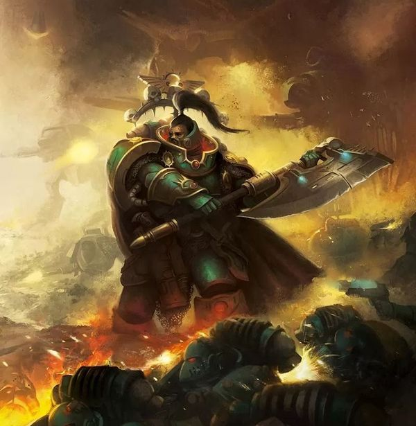

<!-- A0188-B0007 -->

原译文

Space Marine Praetor 星际战士执政官

**校订译文**

Space Marine Praetor 星际战士执政官

<!-- /A0188-B0007 -->

<!-- A0188-B0008 -->
**英文原文**

The highest rank a Praetor could attain was that of a Lord Commanders of a legion Chapter, putting them in a position of power second only to a Primarch. Depending on their Legion's culture, this title could also be First Captain, Chapter Master, Lord Commander, Khan, Tribune.

<!-- /A0188-B0008 -->

<!-- A0188-B0009 -->

原译文

一名执政官所能达到的最高级别是军团战团的领主指挥官，使他们处于仅次于原体的权力地位。根据他们军团的文化，这个头衔也可以是第一连长、战团长、领主指挥官、可汗、保民官。

**校订译文**

执政官最高可担任军团下属战团的领主指挥官，权力仅次于原体。各军团文化不同，对应头衔也可能是第一连长、战团长、领主指挥官、可汗或保民官。

<!-- /A0188-B0009 -->

<!-- A0188-B0010 -->
**英文原文**

As Masters of the the Legion, their tactical acumen allowed them to lead the forces at their disposal through varied formations and tactics, ranging from sheer brute force, armoured assault waves, murderous siege-craft or overwhelming and relentless attack from close orbit.

<!-- /A0188-B0010 -->

<!-- A0188-B0011 -->

原译文

作为军团之主，他们的战术智慧使他们能够通过各种编队和战术来领导他们所掌握的部队，从纯粹的蛮力、装甲突击浪潮、凶残的攻城艇到近地轨道的压倒性无情攻击。

**校订译文**

作为军团的高级统帅，执政官凭借敏锐的战术判断，运用各种编队和作战方式调遣部队：以强力正面压制、发动装甲突击、实施残酷的攻城战，或从近地轨道持续施加压倒性的打击。

<!-- /A0188-B0011 -->

<!-- A0188-B0012 -->
**英文原文**

Many commanders went to war with a dedicated cadre of bodyguards in the form of Legion Command Squads, guardians who protected their master in the heat of battle, as well as skilled warriors who pressed attack at the most crucial moment.

<!-- /A0188-B0012 -->

<!-- A0188-B0013 -->

原译文

许多指挥官带着一支由军团指挥组组成的专业护卫队伍参战，这些护卫在激战中保护他们的主人，还有在最关键的时刻发起进攻的熟练战士。

**校订译文**

许多指挥官会带着军团指挥小队参战。这些专职护卫既保护主君，也都是精锐战士，能够在关键时刻推进攻势。

<!-- /A0188-B0013 -->

<!-- A0188-B0014 -->
## Praetor Title Variations by Legion 不同军团的执政官头衔

<!-- /A0188-B0014 -->

<!-- A0188-B0015 -->
**英文原文**

Dark Angels - Seneschal, Grand Master, First Master, Knight-Praetor, Master, Voted-Lieutenant

<!-- /A0188-B0015 -->

<!-- A0188-B0016 -->

原译文

黑暗天使 - 总管，大导师，第一导师，骑士执政官，导师，受选副官

**校订译文**

黑暗天使 - 总管，大导师，第一导师，骑士执政官，导师，受选副官

<!-- /A0188-B0016 -->

<!-- A0188-B0017 -->
**英文原文**

Emperor's Children - Lord Commander Primus

<!-- /A0188-B0017 -->

<!-- A0188-B0018 -->

原译文

帝皇之子 - 首席领主指挥官

**校订译文**

帝皇之子 - 首席领主指挥官

<!-- /A0188-B0018 -->

<!-- A0188-B0019 -->
**英文原文**

Iron Warriors - Triarch, Warsmith

<!-- /A0188-B0019 -->

<!-- A0188-B0020 -->

原译文

钢铁勇士 - 三叉戟，战争铁匠

**校订译文**

钢铁勇士 - 三叉戟，战争铁匠

<!-- /A0188-B0020 -->

<!-- A0188-B0021 -->
**英文原文**

White Scars - Noyan-Khan

<!-- /A0188-B0021 -->

<!-- A0188-B0022 -->

原译文

白色疤痕 - 诺扬汗

**校订译文**

白疤——诺扬汗。

<!-- /A0188-B0022 -->

<!-- A0188-B0023 -->
**英文原文**

Space Wolves - Jarl

<!-- /A0188-B0023 -->

<!-- A0188-B0024 -->

原译文

太空野狼 - 狼主

**校订译文**

太空野狼 - 狼主

<!-- /A0188-B0024 -->

<!-- A0188-B0025 -->
**英文原文**

Imperial Fists - Marshal, Lord Seneschal, Lord Castellan, Siege Master

<!-- /A0188-B0025 -->

<!-- A0188-B0026 -->

原译文

帝国之拳 - 元帅，领主总管，领主堡主，攻城大师

**校订译文**

帝国之拳 - 元帅，领主总管，领主堡主，攻城大师

<!-- /A0188-B0026 -->

<!-- A0188-B0027 -->
**英文原文**

Night Lords - Terrormaster, Talonmaster

<!-- /A0188-B0027 -->

<!-- A0188-B0028 -->

原译文

午夜领主 - 恐惧大师，利爪大师

**校订译文**

午夜领主 - 恐惧大师，利爪大师

<!-- /A0188-B0028 -->

<!-- A0188-B0029 -->
**英文原文**

Blood Angels - Archein, Exarch

<!-- /A0188-B0029 -->

<!-- A0188-B0030 -->

原译文

圣血天使 - 统军，总督

**校订译文**

圣血天使 - 统军，总督

<!-- /A0188-B0030 -->

<!-- A0188-B0031 -->
**英文原文**

Iron Hands - Clan-Commander, Warleader

<!-- /A0188-B0031 -->

<!-- A0188-B0032 -->

原译文

钢铁之手 - 氏族指挥官，战争领袖

**校订译文**

钢铁之手 - 氏族指挥官，战争领袖

<!-- /A0188-B0032 -->

<!-- A0188-B0033 -->
**英文原文**

Ultramarines - Tetrarch

<!-- /A0188-B0033 -->

<!-- A0188-B0034 -->

原译文

极限战士 - 英杰

**校订译文**

极限战士 - 英杰

<!-- /A0188-B0034 -->

<!-- A0188-B0035 -->
**英文原文**

Death Guard - Battle-Captain, Siegemaster

<!-- /A0188-B0035 -->

<!-- A0188-B0036 -->

原译文

死亡守卫 - 战斗连长，攻城大师

**校订译文**

死亡守卫 - 战斗连长，攻城大师

<!-- /A0188-B0036 -->

<!-- A0188-B0037 -->
**英文原文**

Raven Guard - Commander (post-Isstvan V)

<!-- /A0188-B0037 -->

<!-- A0188-B0038 -->

原译文

暗鸦守卫 - 指挥官（伊斯塔万五号后）

**校订译文**

暗鸦守卫 - 指挥官（伊斯塔万五号后）

<!-- /A0188-B0038 -->

<!-- A0188-B0039 -->
**英文原文**

Alpha Legion - Harrowmaster

<!-- /A0188-B0039 -->

<!-- A0188-B0040 -->

原译文

阿尔法军团 - 折磨大师

**校订译文**

阿尔法军团 - 折磨大师

<!-- /A0188-B0040 -->

<!-- A0188-B0041 -->
## Wargear 战备

<!-- /A0188-B0041 -->

<!-- A0188-B0042 -->
**英文原文**

Praetors' were clad in Artificer Armour as befitted their status, and had access to the best gear available to the Legions, such as Master-crafted weapons, and Terminator Armour.

<!-- /A0188-B0042 -->

<!-- A0188-B0043 -->

原译文

执政官穿着适合其身份的精工盔甲，并可以获得军团可用的最佳装备，如大师级武器和终结者盔甲。

**校订译文**

执政官身穿符合其身份的精工盔甲，并可选用军团最好的装备，例如精工武器与终结者盔甲。

<!-- /A0188-B0043 -->

<!-- A0188-B0044 -->
## Notable Praetors 著名执政官

<!-- /A0188-B0044 -->

<!-- A0188-B0045 -->
### Loyalists 忠诚派

<!-- /A0188-B0045 -->

<!-- A0188-B0046 -->
### Dark Angels 黑暗天使

<!-- /A0188-B0046 -->

<!-- A0188-B0047 -->
**英文原文**

Astelan - First Master

<!-- /A0188-B0047 -->

<!-- A0188-B0048 -->

原译文

阿斯特兰 - 第一导师

**校订译文**

阿斯特兰 - 第一导师

<!-- /A0188-B0048 -->

<!-- A0188-B0049 -->

原译文

Corswain 考斯韦恩

**校订译文**

Corswain 考斯韦恩

<!-- /A0188-B0049 -->

<!-- A0188-B0050 -->
**英文原文**

Holguin - Master of the Deathwing

<!-- /A0188-B0050 -->

<!-- A0188-B0051 -->

原译文

霍尔金 - 死翼导师

**校订译文**

霍尔金 - 死翼导师

<!-- /A0188-B0051 -->

<!-- A0188-B0052 图片 -->
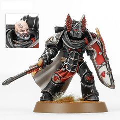

<!-- A0188-B0053 -->

原译文

Dark Angels Praetor 黑暗天使执政官

**校订译文**

Dark Angels Praetor 黑暗天使执政官

<!-- /A0188-B0053 -->

<!-- A0188-B0054 图片 -->
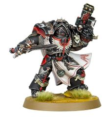

<!-- A0188-B0055 -->

原译文

Dark Angels Praetor in Cataphractii Armour 铁骑甲黑暗天使执政官

**校订译文**

Dark Angels Praetor in Cataphractii Armour 铁骑甲黑暗天使执政官

<!-- /A0188-B0055 -->

<!-- A0188-B0056 -->
### White Scars 白疤

原题：White Scars 白色疤痕

<!-- /A0188-B0056 -->

<!-- A0188-B0057 -->
**英文原文**

Qin Xa - Master of the Keshig

<!-- /A0188-B0057 -->

<!-- A0188-B0058 -->

原译文

秦夏 - 怯薛之主

**校订译文**

秦夏 - 怯薛之主

<!-- /A0188-B0058 -->

<!-- A0188-B0059 -->
**英文原文**

Hasik Noyan-Khan - Noyan-Khan (Chapter Master)

<!-- /A0188-B0059 -->

<!-- A0188-B0060 -->

原译文

哈西克诺扬汗 - 诺扬汗（战团长）

**校订译文**

哈西克诺扬汗 - 诺扬汗（战团长）

<!-- /A0188-B0060 -->

<!-- A0188-B0061 -->
**英文原文**

Jemulan Noyan-Khan - Noyan-Khan (Chapter Master)

<!-- /A0188-B0061 -->

<!-- A0188-B0062 -->

原译文

哲穆兰诺扬汗 - 诺扬汗（战团长）

**校订译文**

哲穆兰诺扬汗 - 诺扬汗（战团长）

<!-- /A0188-B0062 -->

<!-- A0188-B0063 -->
**英文原文**

Jubal Khan - Master of the Hunt

<!-- /A0188-B0063 -->

<!-- A0188-B0064 -->

原译文

朱巴可汗 - 狩猎大师

**校订译文**

朱巴可汗 - 狩猎大师

<!-- /A0188-B0064 -->

<!-- A0188-B0065 图片 -->
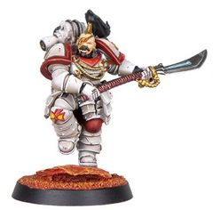

<!-- A0188-B0066 -->

原译文

White Scars Praetor 白色疤痕执政官

**校订译文**

White Scars Praetor 白疤执政官

<!-- /A0188-B0066 -->

<!-- A0188-B0067 图片 -->
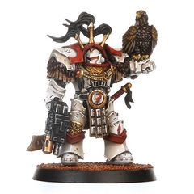

<!-- A0188-B0068 -->

原译文

White Scars Praetor in Cataphractii Armour 铁骑甲白色疤痕执政官

**校订译文**

White Scars Praetor in Cataphractii Armour 身穿铁骑型盔甲的白疤执政官

<!-- /A0188-B0068 -->

<!-- A0188-B0069 -->
### Space Wolves 太空野狼

<!-- /A0188-B0069 -->

<!-- A0188-B0070 -->
**英文原文**

Gunnar Gunnhilt - First Captain

<!-- /A0188-B0070 -->

<!-- A0188-B0071 -->

原译文

加纳·甘希尔特 - 第一连长

**校订译文**

加纳·甘希尔特 - 第一连长

<!-- /A0188-B0071 -->

<!-- A0188-B0072 -->
**英文原文**

Amlodhi Skarssen Skarssensson - Wolf Lord

<!-- /A0188-B0072 -->

<!-- A0188-B0073 -->

原译文

阿姆洛迪·斯卡森·斯卡森松 - 狼主

**校订译文**

阿姆洛迪·斯卡森·斯卡森松 - 狼主

<!-- /A0188-B0073 -->

<!-- A0188-B0074 -->
**英文原文**

Jorin Bloodhowl - Wolf Lord

<!-- /A0188-B0074 -->

<!-- A0188-B0075 -->

原译文

约林·血嚎 - 狼主

**校订译文**

约林·血嚎 - 狼主

<!-- /A0188-B0075 -->

<!-- A0188-B0076 -->
**英文原文**

Ogvai Ogvai Helmschrot - Wolf Lord

<!-- /A0188-B0076 -->

<!-- A0188-B0077 -->

原译文

奥格瓦伊·残盔 - 狼主

**校订译文**

奥格瓦伊·残盔 - 狼主

**校注：** 原文 Ogvai Ogvai Helmschrot 的名重复，中文保留人物名奥格瓦伊·残盔，不重复译出。

<!-- /A0188-B0077 -->

<!-- A0188-B0078 图片 -->
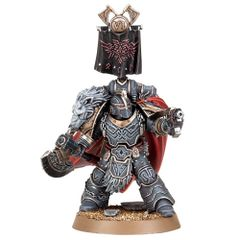

<!-- A0188-B0079 -->

原译文

Space Wolves Praetor 太空野狼执政官

**校订译文**

Space Wolves Praetor 太空野狼执政官

<!-- /A0188-B0079 -->

<!-- A0188-B0080 图片 -->
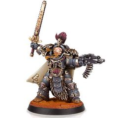

<!-- A0188-B0081 -->

原译文

Space Wolves Praetor in Cataphractii Armour 铁骑甲太空野狼执政官

**校订译文**

Space Wolves Praetor in Cataphractii Armour 铁骑甲太空野狼执政官

<!-- /A0188-B0081 -->

<!-- A0188-B0082 -->
### Imperial Fists 帝国之拳

<!-- /A0188-B0082 -->

<!-- A0188-B0083 -->
**英文原文**

Sigismund - First Captain

<!-- /A0188-B0083 -->

<!-- A0188-B0084 -->

原译文

西吉斯蒙德 - 第一连长

**校订译文**

西吉斯蒙德 - 第一连长

<!-- /A0188-B0084 -->

<!-- A0188-B0085 -->
**英文原文**

Archamus I - Master of the Huscarls

<!-- /A0188-B0085 -->

<!-- A0188-B0086 -->

原译文

阿坎姆斯一世 - 胡斯卡尔之主

**校订译文**

阿坎姆斯一世 - 胡斯卡尔之主

<!-- /A0188-B0086 -->

<!-- A0188-B0087 -->

原译文

Kestros 凯斯特罗斯

**校订译文**

Kestros 凯斯特罗斯

<!-- /A0188-B0087 -->

<!-- A0188-B0088 图片 -->
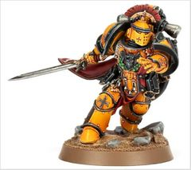

<!-- A0188-B0089 -->

原译文

Imperial Fists Praetor 帝国之拳执政官

**校订译文**

Imperial Fists Praetor 帝国之拳执政官

<!-- /A0188-B0089 -->

<!-- A0188-B0090 图片 -->
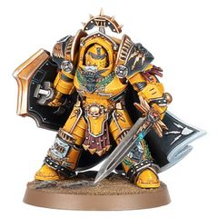

<!-- A0188-B0091 -->

原译文

Imperial Fists Praetor in Tartaros Armour 冥府甲帝国之拳执政官

**校订译文**

Imperial Fists Praetor in Tartaros Armour 冥府甲帝国之拳执政官

<!-- /A0188-B0091 -->

<!-- A0188-B0092 -->
### Blood Angels 圣血天使

<!-- /A0188-B0092 -->

<!-- A0188-B0093 -->
**英文原文**

Raldoron - First Captain, Chapter Master

<!-- /A0188-B0093 -->

<!-- A0188-B0094 -->

原译文

拉多隆 - 第一连长，战团长

**校订译文**

拉多隆 - 第一连长，战团长

<!-- /A0188-B0094 -->

<!-- A0188-B0095 -->
**英文原文**

Azkaellon - Commander of the Sanguinary Guard

<!-- /A0188-B0095 -->

<!-- A0188-B0096 -->

原译文

阿兹卡隆 - 圣血卫队指挥官

**校订译文**

阿兹卡隆 - 圣血守卫指挥官

<!-- /A0188-B0096 -->

<!-- A0188-B0097 -->
**英文原文**

Dahka Berus - High Warden

<!-- /A0188-B0097 -->

<!-- A0188-B0098 -->

原译文

达卡·贝鲁斯 - 至高看守者

**校订译文**

达卡·贝鲁斯 - 至高看守者

<!-- /A0188-B0098 -->

<!-- A0188-B0099 -->
**英文原文**

Alcetas Castael - Archein

<!-- /A0188-B0099 -->

<!-- A0188-B0100 -->

原译文

阿尔塞塔斯·卡斯塔尔 - 统军

**校订译文**

阿尔塞塔斯·卡斯塔尔 - 统军

<!-- /A0188-B0100 -->

<!-- A0188-B0101 图片 -->
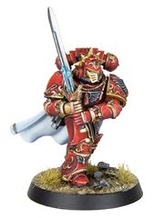

<!-- A0188-B0102 -->

原译文

Blood Angels Praetor 圣血天使执政官

**校订译文**

Blood Angels Praetor 圣血天使执政官

<!-- /A0188-B0102 -->

<!-- A0188-B0103 图片 -->
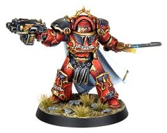

<!-- A0188-B0104 -->

原译文

Blood Angels Praetor in Tartaros Armour 冥府甲圣血天使执政官

**校订译文**

Blood Angels Praetor in Tartaros Armour 冥府甲圣血天使执政官

<!-- /A0188-B0104 -->

<!-- A0188-B0105 -->
### Iron Hands 钢铁之手

<!-- /A0188-B0105 -->

<!-- A0188-B0106 -->
**英文原文**

Gabriel Santar - First Captain

<!-- /A0188-B0106 -->

<!-- A0188-B0107 -->

原译文

加百列·桑塔尔 - 第一连长

**校订译文**

加百列·桑塔尔 - 第一连长

<!-- /A0188-B0107 -->

<!-- A0188-B0108 -->
**英文原文**

Amadeus DuCaine - Lord Commander

<!-- /A0188-B0108 -->

<!-- A0188-B0109 -->

原译文

阿玛迪乌斯·杜凯因 - 领主指挥官

**校订译文**

阿玛迪乌斯·杜凯因 - 领主指挥官

<!-- /A0188-B0109 -->

<!-- A0188-B0110 -->
**英文原文**

Autek Mor - Clan-Commander

<!-- /A0188-B0110 -->

<!-- A0188-B0111 -->

原译文

奥泰克·摩尔 - 氏族指挥官

**校订译文**

奥特克·莫尔——氏族指挥官。

<!-- /A0188-B0111 -->

<!-- A0188-B0112 图片 -->
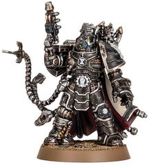

<!-- A0188-B0113 -->

原译文

Iron Hands Praetor 钢铁之手执政官

**校订译文**

Iron Hands Praetor 钢铁之手执政官

<!-- /A0188-B0113 -->

<!-- A0188-B0114 -->
### Ultramarines 极限战士

<!-- /A0188-B0114 -->

<!-- A0188-B0115 -->
**英文原文**

Valentus Dolor - Tetrarch

<!-- /A0188-B0115 -->

<!-- A0188-B0116 -->

原译文

瓦伦图斯·多洛尔 - 英杰

**校订译文**

瓦伦图斯·多洛尔 - 英杰

<!-- /A0188-B0116 -->

<!-- A0188-B0117 -->
**英文原文**

Marius Gage - First Master

<!-- /A0188-B0117 -->

<!-- A0188-B0118 -->

原译文

马里乌斯·盖奇 - 第一连长

**校订译文**

马吕斯·盖奇——第一导师。

**校注：** 原文写 First Master，区别于其他名单中的 First Captain；暂按第一导师处理，二者职衔对应需另核。

<!-- /A0188-B0118 -->

<!-- A0188-B0119 -->
**英文原文**

Orfeo Cassandar - Legatus

<!-- /A0188-B0119 -->

<!-- A0188-B0120 -->

原译文

奥费欧·卡桑达尔 - 司令官

**校订译文**

奥费欧·卡桑达尔 - 司令官

<!-- /A0188-B0120 -->

<!-- A0188-B0121 -->
**英文原文**

Phratus Auguston - Chapter Master

<!-- /A0188-B0121 -->

<!-- A0188-B0122 -->

原译文

弗拉图斯·奥古斯顿 - 战团长

**校订译文**

弗拉图斯·奥古斯顿 - 战团长

<!-- /A0188-B0122 -->

<!-- A0188-B0123 -->
**英文原文**

Verus Caspean - Chapter Master

<!-- /A0188-B0123 -->

<!-- A0188-B0124 -->

原译文

维鲁斯·卡斯佩恩 - 战团长

**校订译文**

维鲁斯·卡斯佩恩 - 战团长

<!-- /A0188-B0124 -->

<!-- A0188-B0125 -->

原译文

Artaeon 阿尔泰昂

**校订译文**

Artaeon 阿尔泰昂

<!-- /A0188-B0125 -->

<!-- A0188-B0126 图片 -->
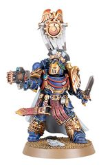

<!-- A0188-B0127 -->

原译文

Ultramarines Praetor 极限战士执政官

**校订译文**

Ultramarines Praetor 极限战士执政官

<!-- /A0188-B0127 -->

<!-- A0188-B0128 图片 -->
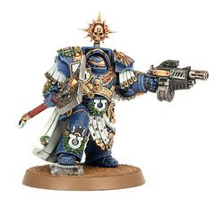

<!-- A0188-B0129 -->

原译文

Ultramarines Praetor in Cataphractii Armour 铁骑甲极限战士执政官

**校订译文**

Ultramarines Praetor in Cataphractii Armour 铁骑甲极限战士执政官

<!-- /A0188-B0129 -->

<!-- A0188-B0130 -->
### Salamanders 火蜥蜴

<!-- /A0188-B0130 -->

<!-- A0188-B0131 -->
**英文原文**

Artellus Numeon - First Captain

<!-- /A0188-B0131 -->

<!-- A0188-B0132 -->

原译文

阿泰勒斯·努梅昂 - 第一连长

**校订译文**

阿泰勒斯·努梅昂 - 第一连长

<!-- /A0188-B0132 -->

<!-- A0188-B0133 -->
### Raven Guard 暗鸦守卫

<!-- /A0188-B0133 -->

<!-- A0188-B0134 -->
**英文原文**

Nerat Kirine - Shade Captain (pre-Primarch only)

<!-- /A0188-B0134 -->

<!-- A0188-B0135 -->

原译文

内拉特·基林 - 阴影连长（只原体回归前）

**校订译文**

内拉特·基林——阴影连长（此称呼仅用于原体回归之前）。

<!-- /A0188-B0135 -->

<!-- A0188-B0136 -->
**英文原文**

Branne Nev - Commander

<!-- /A0188-B0136 -->

<!-- A0188-B0137 -->

原译文

布兰·涅夫 - 指挥官

**校订译文**

布兰尼·涅夫——指挥官。

<!-- /A0188-B0137 -->

<!-- A0188-B0138 -->
**英文原文**

Agapito Nev - Commander

<!-- /A0188-B0138 -->

<!-- A0188-B0139 -->

原译文

阿加皮托·涅夫 - 指挥官

**校订译文**

阿加皮托·涅夫 - 指挥官

<!-- /A0188-B0139 -->

<!-- A0188-B0140 -->
**英文原文**

Solaro An - Commander

<!-- /A0188-B0140 -->

<!-- A0188-B0141 -->

原译文

索罗拉·安 - 指挥官

**校订译文**

索罗拉·安 - 指挥官

<!-- /A0188-B0141 -->

<!-- A0188-B0142 -->
### Traitors 叛乱派

<!-- /A0188-B0142 -->

<!-- A0188-B0143 -->
### Emperor's Children 帝皇之子

<!-- /A0188-B0143 -->

<!-- A0188-B0144 -->
**英文原文**

Eidolon - Lord Commander Primus

<!-- /A0188-B0144 -->

<!-- A0188-B0145 -->

原译文

艾多隆 - 首席领主指挥官

**校订译文**

艾多隆 - 首席领主指挥官

<!-- /A0188-B0145 -->

<!-- A0188-B0146 -->
**英文原文**

Vespasian - Lord Commander

<!-- /A0188-B0146 -->

<!-- A0188-B0147 -->

原译文

维斯帕西安 - 领主指挥官

**校订译文**

维斯帕西安 - 领主指挥官

<!-- /A0188-B0147 -->

<!-- A0188-B0148 -->
**英文原文**

Julius Kaesoron - First Captain

<!-- /A0188-B0148 -->

<!-- A0188-B0149 -->

原译文

尤里乌斯·卡索隆 - 第一连长

**校订译文**

尤利乌斯·凯索伦——第一连长。

<!-- /A0188-B0149 -->

<!-- A0188-B0150 图片 -->
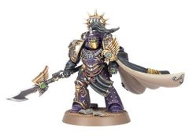

<!-- A0188-B0151 -->

原译文

Emperor's Children Praetor 帝皇之子执政官

**校订译文**

Emperor's Children Praetor 帝皇之子执政官

<!-- /A0188-B0151 -->

<!-- A0188-B0152 图片 -->
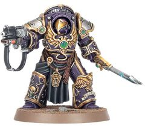

<!-- A0188-B0153 -->

原译文

Emperor's Children Praetor in Tartaros Armour 冥府甲帝皇之子执政官

**校订译文**

Emperor's Children Praetor in Tartaros Armour 冥府甲帝皇之子执政官

<!-- /A0188-B0153 -->

<!-- A0188-B0154 -->
### Iron Warriors 钢铁勇士

<!-- /A0188-B0154 -->

<!-- A0188-B0155 -->
**英文原文**

Kydomor Forrix - First Captain

<!-- /A0188-B0155 -->

<!-- A0188-B0156 -->

原译文

凯多莫·弗利克斯 - 第一连长

**校订译文**

凯德摩尔·弗里克斯——第一连长。

<!-- /A0188-B0156 -->

<!-- A0188-B0157 -->
**英文原文**

Soltarn Vull Bronn - Lieutenant

<!-- /A0188-B0157 -->

<!-- A0188-B0158 -->

原译文

索尔塔恩·沃·布隆 - 副官

**校订译文**

索尔塔恩·沃·布隆 - 副官

<!-- /A0188-B0158 -->

<!-- A0188-B0159 -->
**英文原文**

Berossus - Warsmith

<!-- /A0188-B0159 -->

<!-- A0188-B0160 -->

原译文

贝罗索斯 - 战争铁匠

**校订译文**

贝罗索斯 - 战争铁匠

<!-- /A0188-B0160 -->

<!-- A0188-B0161 -->
**英文原文**

Barabas Dantioch - Warsmith

<!-- /A0188-B0161 -->

<!-- A0188-B0162 -->

原译文

巴拉巴斯·丹提欧克 - 战争铁匠

**校订译文**

巴拉巴斯·丹提欧克 - 战争铁匠

**校注：** “叛徒”分组按军团归属编排，其中巴拉巴斯·丹提欧克等人物可能忠于帝国；勿据分组推断个体立场。

<!-- /A0188-B0162 -->

<!-- A0188-B0163 -->
**英文原文**

Barban Falk - Warsmith

<!-- /A0188-B0163 -->

<!-- A0188-B0164 -->

原译文

巴尔本·法尔克 - 战争铁匠

**校订译文**

巴尔本·法尔克 - 战争铁匠

<!-- /A0188-B0164 -->

<!-- A0188-B0165 -->
**英文原文**

Kroeger - Warsmith

<!-- /A0188-B0165 -->

<!-- A0188-B0166 -->

原译文

克罗格 - 战争铁匠

**校订译文**

克罗格 - 战争铁匠

<!-- /A0188-B0166 -->

<!-- A0188-B0167 -->
**英文原文**

Toramino - Warsmith

<!-- /A0188-B0167 -->

<!-- A0188-B0168 -->

原译文

托拉米诺 - 战争铁匠

**校订译文**

托拉米诺 - 战争铁匠

<!-- /A0188-B0168 -->

<!-- A0188-B0169 -->
**英文原文**

Harkor - Warsmith

<!-- /A0188-B0169 -->

<!-- A0188-B0170 -->

原译文

哈克 - 战争铁匠

**校订译文**

哈克 - 战争铁匠

<!-- /A0188-B0170 -->

<!-- A0188-B0171 -->
**英文原文**

Kyr Vhalen - Warsmith

<!-- /A0188-B0171 -->

<!-- A0188-B0172 -->

原译文

凯尔·瓦伦 - 战争铁匠

**校订译文**

凯尔·瓦伦 - 战争铁匠

<!-- /A0188-B0172 -->

<!-- A0188-B0173 -->
**英文原文**

Idriss Krendl - Warsmith

<!-- /A0188-B0173 -->

<!-- A0188-B0174 -->

原译文

伊德里斯·克伦德尔 - 战争铁匠

**校订译文**

伊德里斯·克伦德尔 - 战争铁匠

<!-- /A0188-B0174 -->

<!-- A0188-B0175 -->
### Night Lords 午夜领主

<!-- /A0188-B0175 -->

<!-- A0188-B0176 -->
**英文原文**

Jago Sevatarion - First Captain

<!-- /A0188-B0176 -->

<!-- A0188-B0177 -->

原译文

亚戈·塞维塔里昂 - 第一连长

**校订译文**

雅戈·赛维塔里昂——第一连长。

<!-- /A0188-B0177 -->

<!-- A0188-B0178 -->
**英文原文**

Shang - Equerry

<!-- /A0188-B0178 -->

<!-- A0188-B0179 -->

原译文

尚 - 侍从官

**校订译文**

尚 - 侍从官

<!-- /A0188-B0179 -->

<!-- A0188-B0180 -->

原译文

Nakrid Thole 纳克雷德·索尔

**校订译文**

Nakrid Thole 纳克雷德·索尔

<!-- /A0188-B0180 -->

<!-- A0188-B0181 图片 -->
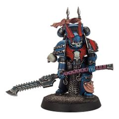

<!-- A0188-B0182 -->

原译文

Night Lords Praetor 午夜领主执政官

**校订译文**

Night Lords Praetor 午夜领主执政官

<!-- /A0188-B0182 -->

<!-- A0188-B0183 图片 -->
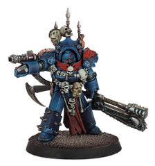

<!-- A0188-B0184 -->

原译文

Night Lords Praetor in Tartaros Armour 冥府甲午夜领主执政官

**校订译文**

Night Lords Praetor in Tartaros Armour 冥府甲午夜领主执政官

<!-- /A0188-B0184 -->

<!-- A0188-B0185 -->
### World Eaters 吞世者

<!-- /A0188-B0185 -->

<!-- A0188-B0186 -->
**英文原文**

Khârn - Centurion

<!-- /A0188-B0186 -->

<!-- A0188-B0187 -->

原译文

卡恩 - 百夫长

**校订译文**

卡恩 - 百夫长

<!-- /A0188-B0187 -->

<!-- A0188-B0188 -->
### Death Guard 死亡守卫

<!-- /A0188-B0188 -->

<!-- A0188-B0189 -->
**英文原文**

Calas Typhon - First Captain

<!-- /A0188-B0189 -->

<!-- A0188-B0190 -->

原译文

卡拉斯·泰丰斯 - 第一连长

**校订译文**

卡拉斯·提丰——第一连长。

<!-- /A0188-B0190 -->

<!-- A0188-B0191 -->
**英文原文**

Caipha Morarg - Equerry

<!-- /A0188-B0191 -->

<!-- A0188-B0192 -->

原译文

凯法·莫拉格 - 侍从官

**校订译文**

凯法·莫拉格 - 侍从官

<!-- /A0188-B0192 -->

<!-- A0188-B0193 -->
**英文原文**

Durak Rask - Master of Ordnance

<!-- /A0188-B0193 -->

<!-- A0188-B0194 -->

原译文

杜拉克·拉斯克 - 军械之主

**校订译文**

杜拉克·拉斯克 - 军械大师

<!-- /A0188-B0194 -->

<!-- A0188-B0195 -->
**英文原文**

Vrokhorn - Castellan of Barbarus

<!-- /A0188-B0195 -->

<!-- A0188-B0196 -->

原译文

弗罗克霍恩 - 巴巴鲁斯堡主

**校订译文**

弗罗克霍恩 - 巴巴鲁斯堡主

<!-- /A0188-B0196 -->

<!-- A0188-B0197 图片 -->
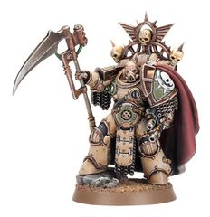

<!-- A0188-B0198 -->

原译文

Death Guard Praetor 死亡守卫执政官

**校订译文**

Death Guard Praetor 死亡守卫执政官

<!-- /A0188-B0198 -->

<!-- A0188-B0199 图片 -->
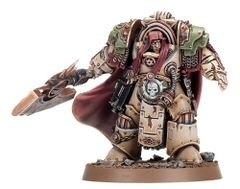

<!-- A0188-B0200 -->

原译文

Death Guard Praetor in Cataphractii Armour 铁骑甲死亡守卫执政官

**校订译文**

Death Guard Praetor in Cataphractii Armour 铁骑甲死亡守卫执政官

<!-- /A0188-B0200 -->

<!-- A0188-B0201 -->
### Thousand Sons 千子

<!-- /A0188-B0201 -->

<!-- A0188-B0202 -->
**英文原文**

Ahzek Ahriman - First Captain

<!-- /A0188-B0202 -->

<!-- A0188-B0203 -->

原译文

阿扎克·阿里曼 - 第一连长

**校订译文**

阿扎克·阿里曼 - 第一连长

<!-- /A0188-B0203 -->

<!-- A0188-B0204 -->
**英文原文**

Phosis T'Kar - Master

<!-- /A0188-B0204 -->

<!-- A0188-B0205 -->

原译文

弗西斯·塔'卡 - 大师

**校订译文**

弗西斯·塔'卡 - 大师

<!-- /A0188-B0205 -->

<!-- A0188-B0206 -->
**英文原文**

Hathor Maat - Master

<!-- /A0188-B0206 -->

<!-- A0188-B0207 -->

原译文

哈索尔·玛特 - 大师

**校订译文**

哈索尔·玛特 - 大师

<!-- /A0188-B0207 -->

<!-- A0188-B0208 -->
**英文原文**

Menes Kalliston - Master

<!-- /A0188-B0208 -->

<!-- A0188-B0209 -->

原译文

梅内斯·卡利斯顿 - 大师

**校订译文**

梅内斯·卡利斯顿 - 大师

<!-- /A0188-B0209 -->

<!-- A0188-B0210 -->
**英文原文**

Baleq Uthizzar - Master

<!-- /A0188-B0210 -->

<!-- A0188-B0211 -->

原译文

巴莱克·乌希萨尔 - 大师

**校订译文**

巴莱克·乌希萨尔 - 大师

<!-- /A0188-B0211 -->

<!-- A0188-B0212 -->
**英文原文**

Khalophis - Master

<!-- /A0188-B0212 -->

<!-- A0188-B0213 -->

原译文

卡洛菲斯 - 大师

**校订译文**

卡洛菲斯 - 大师

<!-- /A0188-B0213 -->

<!-- A0188-B0214 -->
**英文原文**

Amon - Equerry

<!-- /A0188-B0214 -->

<!-- A0188-B0215 -->

原译文

阿蒙 - 侍从官

**校订译文**

阿蒙 - 侍从官

<!-- /A0188-B0215 -->

<!-- A0188-B0216 图片 -->
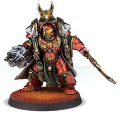

<!-- A0188-B0217 -->

原译文

Thousand Sons Praetor in Cataphractii Armour 铁骑甲千子执政官

**校订译文**

Thousand Sons Praetor in Cataphractii Armour 铁骑甲千子执政官

<!-- /A0188-B0217 -->

<!-- A0188-B0218 -->
### Sons of Horus 荷鲁斯之子

<!-- /A0188-B0218 -->

<!-- A0188-B0219 -->
**英文原文**

Ezekyle Abaddon - First Captain

<!-- /A0188-B0219 -->

<!-- A0188-B0220 -->

原译文

以泽凯尔·阿巴顿 - 第一连长

**校订译文**

以泽凯尔·阿巴顿 - 第一连长

<!-- /A0188-B0220 -->

<!-- A0188-B0221 -->
**英文原文**

Tarik Torgaddon - Mournival Member

<!-- /A0188-B0221 -->

<!-- A0188-B0222 -->

原译文

塔里克·托加顿 - 四王议会成员

**校订译文**

塔里克·托加顿 - 四王议会成员

<!-- /A0188-B0222 -->

<!-- A0188-B0223 -->
**英文原文**

Hastur Sejanus - Mournival Member

<!-- /A0188-B0223 -->

<!-- A0188-B0224 -->

原译文

哈斯塔·赛詹努斯 - 四王议会成员

**校订译文**

哈斯塔·赛詹努斯 - 四王议会成员

<!-- /A0188-B0224 -->

<!-- A0188-B0225 -->
**英文原文**

Garviel Loken - Mournival Member

<!-- /A0188-B0225 -->

<!-- A0188-B0226 -->

原译文

加维尔·洛肯 - 四王议会成员

**校订译文**

加维尔·洛肯 - 四王议会成员

<!-- /A0188-B0226 -->

<!-- A0188-B0227 -->
**英文原文**

Horus Aximand - Mournival Member

<!-- /A0188-B0227 -->

<!-- A0188-B0228 -->

原译文

荷鲁斯·艾克曼德 - 四王议会成员

**校订译文**

荷鲁斯·阿西曼德——四王议会成员。

<!-- /A0188-B0228 -->

<!-- A0188-B0229 -->
**英文原文**

Falkus Kibre - Mournival Member

<!-- /A0188-B0229 -->

<!-- A0188-B0230 -->

原译文

法库斯·凯博 - 四王议会成员

**校订译文**

法库斯·凯博 - 四王议会成员

<!-- /A0188-B0230 -->

<!-- A0188-B0231 -->
**英文原文**

Maloghurst - Equerry

<!-- /A0188-B0231 -->

<!-- A0188-B0232 -->

原译文

马洛赫斯特 - 侍从官

**校订译文**

马洛赫斯特 - 侍从官

<!-- /A0188-B0232 -->

<!-- A0188-B0233 -->
**英文原文**

Grael Noctua - Mournival Member

<!-- /A0188-B0233 -->

<!-- A0188-B0234 -->

原译文

格拉艾·诺克图阿 - 四王议会成员

**校订译文**

格拉艾·诺克图阿 - 四王议会成员

<!-- /A0188-B0234 -->

<!-- A0188-B0235 -->

原译文

Korosan Myrlath 科罗桑·米拉斯

**校订译文**

Korosan Myrlath 科罗桑·米拉斯

<!-- /A0188-B0235 -->

<!-- A0188-B0236 图片 -->
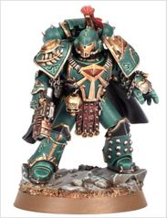

<!-- A0188-B0237 -->

原译文

Sons of Horus Praetor 荷鲁斯之子执政官

**校订译文**

Sons of Horus Praetor 荷鲁斯之子执政官

<!-- /A0188-B0237 -->

<!-- A0188-B0238 图片 -->
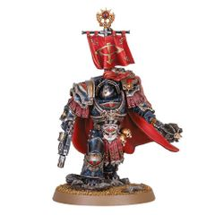

<!-- A0188-B0239 -->

原译文

Sons of Horus Justaerin Praetor in Cataphractii Armour 铁骑甲荷鲁斯之子加斯塔林执政官

**校订译文**

Sons of Horus Justaerin Praetor in Cataphractii Armour 铁骑甲荷鲁斯之子加斯塔林执政官

<!-- /A0188-B0239 -->

<!-- A0188-B0240 -->
### Word Bearers 怀言者

<!-- /A0188-B0240 -->

<!-- A0188-B0241 -->
**英文原文**

Erebus - First Chaplain

<!-- /A0188-B0241 -->

<!-- A0188-B0242 -->

原译文

艾瑞巴斯 - 第一连长

**校订译文**

艾瑞巴斯——首席教士。

<!-- /A0188-B0242 -->

<!-- A0188-B0243 -->
**英文原文**

Kor Phaeron - First Captain

<!-- /A0188-B0243 -->

<!-- A0188-B0244 -->

原译文

科尔·法隆 - 第一连长

**校订译文**

科尔·法伦——第一连长。

<!-- /A0188-B0244 -->

<!-- A0188-B0245 -->
**英文原文**

Argel Tal - Chapter Master

<!-- /A0188-B0245 -->

<!-- A0188-B0246 -->

原译文

安格尔·塔尔 - 战团长

**校订译文**

阿格尔·塔尔——战团长。

<!-- /A0188-B0246 -->

<!-- A0188-B0247 -->
**英文原文**

Zardu Layak - Crimson Apostle

<!-- /A0188-B0247 -->

<!-- A0188-B0248 -->

原译文

扎度·拉亚克 - 猩红使徒

**校订译文**

扎度·拉亚克 - 猩红使徒

<!-- /A0188-B0248 -->

<!-- A0188-B0249 图片 -->
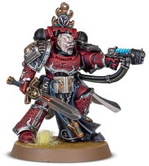

<!-- A0188-B0250 -->

原译文

Word Bearers Praetor 怀言者执政官

**校订译文**

Word Bearers Praetor 怀言者执政官

<!-- /A0188-B0250 -->

<!-- A0188-B0251 图片 -->
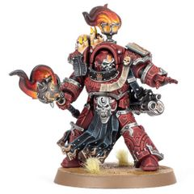

<!-- A0188-B0252 -->

原译文

Word Bearers Praetor in Tartaros Armour 冥府甲怀言者执政官

**校订译文**

Word Bearers Praetor in Tartaros Armour 冥府甲怀言者执政官

<!-- /A0188-B0252 -->

<!-- A0188-B0253 -->
### Alpha Legion 阿尔法军团

<!-- /A0188-B0253 -->

<!-- A0188-B0254 -->
**英文原文**

Armillus Dynat - Harrowmaster

<!-- /A0188-B0254 -->

<!-- A0188-B0255 -->

原译文

阿尔梅琉斯·迪纳特 - 恐惧之主

**校订译文**

阿尔梅琉斯·迪纳特——折磨大师。

<!-- /A0188-B0255 -->

<!-- A0188-B0256 -->
**英文原文**

Ingo Pech - First Captain

<!-- /A0188-B0256 -->

<!-- A0188-B0257 -->

原译文

因格·佩克 - 第一连长

**校订译文**

英戈·佩奇——第一连长。

<!-- /A0188-B0257 -->

<!-- A0188-B0258 -->
**英文原文**

Autilon Skorr - Consul-Delegatus

<!-- /A0188-B0258 -->

<!-- A0188-B0259 -->

原译文

奥帝隆·斯考尔 - 领事使节

**校订译文**

奥帝隆·斯考尔 - 领事使节

<!-- /A0188-B0259 -->

<!-- A0188-B0260 图片 -->
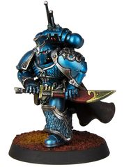

<!-- A0188-B0261 -->

原译文

Alpha Legion Praetor 阿尔法军团执政官

**校订译文**

Alpha Legion Praetor 阿尔法军团执政官

<!-- /A0188-B0261 -->

<!-- A0188-B0262 图片 -->
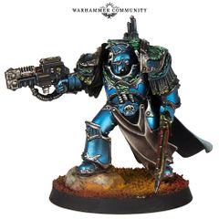

<!-- A0188-B0263 -->

原译文

Alpha Legion Praetor in Cataphractii Armour 铁骑甲阿尔法军团执政官

**校订译文**

Alpha Legion Praetor in Cataphractii Armour 铁骑甲阿尔法军团执政官

<!-- /A0188-B0263 -->

本篇核心术语与暂定项

以下列出本篇出现的英文原形及核心术语表用词。同形词可能指不同对象，具体词义以本篇正文和校注为准；单复数、别名和仅见于图注的名称可能尚未列入。完整候选见[术语表](../../术语表/双语术语候选.csv)。

| 英文 | 采用中文 | 状态 |
| --- | --- | --- |
| Blood Angels | 圣血天使 | 官方已核对 |
| Dark Angels | 黑暗天使 | 官方已核对 |
| Space Wolves | 太空野狼 | 官方已核对 |
| Death Guard | 死亡守卫 | 官方已核对 |
| Terminator | 终结者 | 官方已核对 |
| Ultramarines | 极限战士 | 官方已核对 |
| Horus Heresy | 荷鲁斯之乱 | 官方已核对 |
| Sanguinary | 圣血学派 | 暂定·学派语境 |
| Imperial Fists | 帝国之拳 | 暂定 |
| Emperor | 帝皇 | 官方已核对 |
| Primarch | 原体 | 官方已核对 |
| Emperor's Children | 帝皇之子 | 官方已核对 |
| Iron Warriors | 钢铁勇士 | 暂定·官方待核 |
| Night Lords | 午夜领主 | 暂定·官方待核 |
| Great Crusade | 大远征 | 暂定·官方待核 |
| Barbarus | 巴巴鲁斯 | 暂定·官方待核 |
| Horus | 荷鲁斯 | 暂定·官方待核 |
| Erebus | 艾瑞巴斯 | 暂定·官方待核 |
| Garviel Loken | 加维尔·洛肯 | 暂定·官方待核 |
| Iron Hands | 钢铁之手 | 暂定·官方待核 |
| Legiones Astartes | 阿斯塔特军团 | 暂定·官方待核 |
| Valentus Dolor | 瓦伦图斯·多洛尔 | 暂定·官方待核 |
| Barabas Dantioch | 巴拉巴斯·丹提欧克 | 暂定·官方待核 |
| Warsmith | 战争铁匠 | 暂定·官方待核 |
| Master | 导师（审判庭职衔）／舰务官（舰员职务） | 语境定译·官方待核 |
| Argel Tal | 阿格尔·塔尔 | 暂定·官方待核 |
| Chaplain | 教士 | 官方已核对 |
| Sanguinary Guard | 圣血守卫 | 官方已核对 |
| First Master | 首席舰务官（舰员职务）／第一大师（极限战士职衔） | 语境定译·官方待核 |
| Cadre | 骨干连（寂静修女）／核心队（钛族） | 语境定译·钛族词根参考 |
| Tribune | 护民官 | 暂定·官方待核 |
| Mournival | 四王议会 | 暂定·官方待核 |
| Falkus Kibre | 法库斯·凯博 | 暂定·官方待核 |
| Horus Aximand | 荷鲁斯·阿西曼德 | 暂定·官方待核 |
| Tarik Torgaddon | 塔里克·托加顿 | 暂定·官方待核 |
| Maloghurst | 马洛赫斯特 | 暂定·官方待核 |
| Lord Commander | 领主指挥官 | 暂定·官方待核 |
| Lieutenant | 副官 | 暂定·官方待核 |
| White Scars | 白疤 | 官方已核 |
| Alpha Legion | 阿尔法军团 | 暂定·官方待核 |
| Raven Guard | 暗鸦守卫 | 官方已核 |
| Scars | 伤疤 | 暂定·官方待核 |
| Autek Mor | 奥特克·莫尔 | 暂定·官方待核 |
| Agapito Nev | 阿加皮托·涅夫 | 暂定·官方待核 |
| Branne Nev | 布兰尼·涅夫 | 暂定·官方待核 |
| Artellus Numeon | 阿泰勒斯·努梅昂 | 暂定·官方待核 |
| Nerat Kirine | 内拉特·基林 | 暂定·官方待核 |
| Isstvan | 伊斯塔万 | 暂定·官方待核 |
| Amadeus DuCaine | 阿玛迪乌斯·杜凯因 | 暂定·官方待核 |
| First Captain | 第一连长 | 暂定·官方待核 |
| Praetor | 执政官 | 暂定·官方待核 |
| Astelan | 阿斯特兰 | 暂定·官方待核 |
| Holguin | 霍尔金 | 暂定·官方待核 |
| Qin Xa | 秦夏 | 暂定·官方待核 |
| Hasik Noyan-Khan | 哈西克诺扬汗 | 暂定·官方待核 |
| Jemulan Noyan-Khan | 哲穆兰诺扬汗 | 暂定·官方待核 |
| Jubal Khan | 朱巴可汗 | 暂定·官方待核 |
| Gunnar Gunnhilt | 加纳·甘希尔特 | 暂定·官方待核 |
| Amlodhi Skarssen Skarssensson | 阿姆洛迪·斯卡森·斯卡森松 | 暂定·官方待核 |
| Jorin Bloodhowl | 约林·血嚎 | 暂定·官方待核 |
| Sigismund | 西吉斯蒙德 | 暂定·官方待核 |
| Archamus I | 阿坎姆斯一世 | 暂定·官方待核 |
| Raldoron | 拉多隆 | 暂定·官方待核 |
| Azkaellon | 阿兹卡隆 | 暂定·官方待核 |
| Dahka Berus | 达卡·贝鲁斯 | 暂定·官方待核 |
| Alcetas Castael | 阿尔塞塔斯·卡斯塔尔 | 暂定·官方待核 |
| Gabriel Santar | 加百列·桑塔尔 | 暂定·官方待核 |
| Marius Gage | 马吕斯·盖奇 | 暂定·官方待核 |
| Orfeo Cassandar | 奥费欧·卡桑达尔 | 暂定·官方待核 |
| Phratus Auguston | 弗拉图斯·奥古斯顿 | 暂定·官方待核 |
| Verus Caspean | 维鲁斯·卡斯佩恩 | 暂定·官方待核 |
| Solaro An | 索罗拉·安 | 暂定·官方待核 |
| Eidolon | 艾多隆 | 暂定·官方待核 |
| Vespasian | 维斯帕西安 | 暂定·官方待核 |
| Julius Kaesoron | 尤利乌斯·凯索伦 | 暂定·官方待核 |
| Kydomor Forrix | 凯德摩尔·弗里克斯 | 暂定·官方待核 |
| Soltarn Vull Bronn | 索尔塔恩·沃·布隆 | 暂定·官方待核 |
| Berossus | 贝罗索斯 | 暂定·官方待核 |
| Barban Falk | 巴尔本·法尔克 | 暂定·官方待核 |
| Kroeger | 克罗格 | 暂定·官方待核 |
| Toramino | 托拉米诺 | 暂定·官方待核 |
| Harkor | 哈克 | 暂定·官方待核 |
| Kyr Vhalen | 凯尔·瓦伦 | 暂定·官方待核 |
| Idriss Krendl | 伊德里斯·克伦德尔 | 暂定·官方待核 |
| Jago Sevatarion | 雅戈·赛维塔里昂 | 暂定·官方待核 |
| Shang | 尚 | 暂定·官方待核 |
| Khârn | 卡恩 | 暂定·官方待核 |
| Calas Typhon | 卡拉斯·提丰 | 暂定·官方待核 |
| Caipha Morarg | 凯法·莫拉格 | 暂定·官方待核 |
| Durak Rask | 杜拉克·拉斯克 | 暂定·官方待核 |
| Vrokhorn | 弗罗克霍恩 | 暂定·官方待核 |
| Ahzek Ahriman | 阿扎克·阿里曼 | 暂定·官方待核 |
| Phosis T'Kar | 弗西斯·塔'卡 | 暂定·官方待核 |
| Hathor Maat | 哈索尔·玛特 | 暂定·官方待核 |
| Menes Kalliston | 梅内斯·卡利斯顿 | 暂定·官方待核 |
| Baleq Uthizzar | 巴莱克·乌希萨尔 | 暂定·官方待核 |
| Khalophis | 卡洛菲斯 | 暂定·官方待核 |
| Amon | 阿蒙 | 暂定·官方待核 |
| Ezekyle Abaddon | 以泽凯尔·阿巴顿 | 暂定·官方待核 |
| Hastur Sejanus | 哈斯塔·赛詹努斯 | 暂定·官方待核 |
| Grael Noctua | 格拉艾·诺克图阿 | 暂定·官方待核 |
| Kor Phaeron | 科尔·法伦 | 暂定·官方待核 |
| Zardu Layak | 扎度·拉亚克 | 暂定·官方待核 |
| Armillus Dynat | 阿尔梅琉斯·迪纳特 | 暂定·官方待核 |
| Ingo Pech | 英戈·佩奇 | 暂定·官方待核 |
| Autilon Skorr | 奥帝隆·斯考尔 | 暂定·官方待核 |
| Consul | 领事 | 暂定·官方待核 |
| Delegatus | 代表 | 暂定·官方待核 |
| Space Marine | 星际战士 | 暂定·官方待核 |
| Chapter | 战团 | 暂定·官方待核 |
| Chapter Master | 战团长 | 暂定·官方待核 |
| Captain | 连长 | 暂定·官方待核 |
| Master of the Hunt | 狩猎大师 | 暂定·官方待核 |
| Artificer | 技工 | 暂定·官方待核 |
| Equerry | 近侍 | 暂定·官方待核 |
| Orfeo | 奥尔菲奥 | 暂定·官方待核 |
| Castellan | 堡主 | 官方已核对 |
| Talonmaster | 利爪大师 | 暂定·官方待核 |
| Archein | 统军 | 暂定·官方待核 |
| Harrowmaster | 折磨大师 | 暂定·官方待核 |
| Triarch | 三圣（太空死灵统治议会）／三叉戟成员（钢铁勇士职衔） | 语境定译·官方待核 |
| Noyan-Khan | 诺扬汗 | 暂定·官方待核 |
| Tetrarch | 四方领主 | 暂定·官方待核 |
| Exarch | 主教（灵族道途） | 暂定·官方待核 |
| Primus | 领军 | 官方已核对 |
| Pech | 佩什 | 暂定·官方待核 |
| Marshal | 元帅 | 官方已核对 |
| Phaeron | 法皇 | 暂定·官方待核 |
| Grand Master | 大导师 | 暂定·官方待核 |
| First Chaplain | 首席教士 | 暂定·官方待核 |
| Lord Castellan | 堡主领主 | 暂定·官方待核 |
| Siege Master | 攻城大师 | 暂定·官方待核 |
| Ogvai Ogvai Helmschrot | 奥格瓦伊·残盔 | 暂定·官方待核 |
| Terminator Armour | 终结者盔甲 | 暂定·官方待核 |
| Artificer Armour | 精工盔甲 | 暂定·官方待核 |

