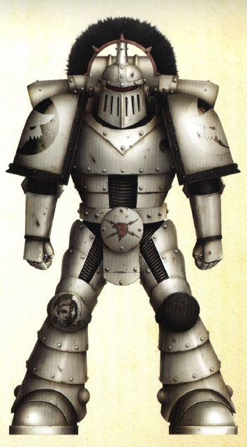

# 0189 军团百夫长 Legion Centurion

精校状态：中文行文已逐段精校，部分术语仍为暂定

分类：通用概念 / 帝国 Imperium / 中央政务部 Adeptus Terra / 星际战士军团 Space Marine Legion

原文来源：https://www.bilibili.com/opus/1019944992128368660

原作者：帝国神选罐头

原文时间：2025年01月08日 13:07

[返回分类目录](目录.md) · [全书目录](../../目录.md)

<!-- A0189-B0001 -->
**英文原文**

Centurion was a rank of Space Marine used during the era of the Legiones Astartes in the Great Crusade and Horus Heresy.

<!-- /A0189-B0001 -->

<!-- A0189-B0002 -->

原译文

百夫长是阿斯塔特军团在大远征和荷鲁斯叛乱时期中使用的星际战士军衔。

**校订译文**

百夫长是大远征和荷鲁斯之乱时期，阿斯塔特军团使用的一种星际战士军衔。

<!-- /A0189-B0002 -->

<!-- A0189-B0003 -->
## Overview 概述

<!-- /A0189-B0003 -->

<!-- A0189-B0004 -->
**英文原文**

These officers represented specialists able to give a Legion its operational depth and strategic flexibility. These fearless leaders led by example on the frontline and gained the title of Centurion through heroic actions, be they a Company Captain or Lieutenant.

<!-- /A0189-B0004 -->

<!-- A0189-B0005 -->

原译文

这些军官代表了能够赋予军团行动深度和战略灵活性的专家。这些无畏的领导者在前线以身作则，通过英勇的行动获得了百夫长的称号，无论是连长还是副官。

**校订译文**

这些军官各有所长，使军团能够开展更有纵深、更加灵活的作战。他们在前线身先士卒，无论原本是连长还是副官，都可凭英勇表现获得百夫长称号。

<!-- /A0189-B0005 -->

<!-- A0189-B0006 图片 -->

<!-- A0189-B0007 -->

原译文

Luna Wolves Centurion 影月苍狼百夫长

**校订译文**

Luna Wolves Centurion 影月苍狼百夫长

<!-- /A0189-B0007 -->

<!-- A0189-B0008 -->
**英文原文**

In M41, the Adeptus Custodes also use the rank of Centurion.

<!-- /A0189-B0008 -->

<!-- A0189-B0009 -->

原译文

在M41，禁军也使用百夫长军衔。

**校订译文**

第 41 千年时，帝皇禁军也使用百夫长军衔。

<!-- /A0189-B0009 -->

<!-- A0189-B0010 -->
### Variations 变体

<!-- /A0189-B0010 -->

<!-- A0189-B0011 -->

原译文

Thegn - Space Wolves 领主 - 太空野狼

**校订译文**

Thegn - Space Wolves 领主 - 太空野狼

<!-- /A0189-B0011 -->

<!-- A0189-B0012 -->
## Notable Centurions

**补译**

著名百夫长

**校注：** 本小标题仅有英文，可译“著名百夫长”；英文原块保留。

<!-- /A0189-B0012 -->

<!-- A0189-B0013 -->
**英文原文**

Aster Crohne — Blood Angels.

<!-- /A0189-B0013 -->

<!-- A0189-B0014 -->

原译文

阿斯特·克罗恩 — 圣血天使

**校订译文**

阿斯特·克罗恩 — 圣血天使

<!-- /A0189-B0014 -->

<!-- A0189-B0015 -->
**英文原文**

Castrmen Orth — Iron Hands.

<!-- /A0189-B0015 -->

<!-- A0189-B0016 -->

原译文

卡斯特曼·奥斯 — 钢铁之手

**校订译文**

卡斯特门·奥斯——钢铁之手。

<!-- /A0189-B0016 -->

<!-- A0189-B0017 -->
**英文原文**

Delvarus — World Eaters.

<!-- /A0189-B0017 -->

<!-- A0189-B0018 -->

原译文

德尔瓦鲁斯 — 吞世者

**校订译文**

德尔瓦鲁斯 — 吞世者

<!-- /A0189-B0018 -->

<!-- A0189-B0019 -->
**英文原文**

Kadus Brekkar — Death Guard.

<!-- /A0189-B0019 -->

<!-- A0189-B0020 -->

原译文

卡杜斯·布雷卡 — 死亡守卫

**校订译文**

卡杜斯·布雷卡 — 死亡守卫

<!-- /A0189-B0020 -->

<!-- A0189-B0021 -->
**英文原文**

Mago — World Eaters.

<!-- /A0189-B0021 -->

<!-- A0189-B0022 -->

原译文

马戈 — 吞世者

**校订译文**

马戈 — 吞世者

<!-- /A0189-B0022 -->

<!-- A0189-B0023 -->
**英文原文**

Shabran Darr — World Eaters.

<!-- /A0189-B0023 -->

<!-- A0189-B0024 -->

原译文

沙巴兰·达尔 — 吞世者

**校订译文**

沙巴兰·达尔 — 吞世者

<!-- /A0189-B0024 -->

<!-- A0189-B0025 -->
**英文原文**

Titus Prayto — Ultramarines. Also Chief Librarian.

<!-- /A0189-B0025 -->

<!-- A0189-B0026 -->

原译文

泰图斯·普瑞托 — 极限战士首席药剂师

**校订译文**

泰图斯·普瑞托——极限战士，同时担任首席智库员。

<!-- /A0189-B0026 -->

本篇核心术语与暂定项

以下列出本篇出现的英文原形及核心术语表用词。同形词可能指不同对象，具体词义以本篇正文和校注为准；单复数、别名和仅见于图注的名称可能尚未列入。完整候选见[术语表](../../术语表/双语术语候选.csv)。

| 英文 | 采用中文 | 状态 |
| --- | --- | --- |
| Blood Angels | 圣血天使 | 官方已核对 |
| Adeptus Custodes | 帝皇禁军 | 官方已核对 |
| Death Guard | 死亡守卫 | 官方已核对 |
| World Eaters | 吞世者 | 官方已核对 |
| Librarian | 智库员 | 官方已核对 |
| Ultramarines | 极限战士 | 官方已核对 |
| Horus Heresy | 荷鲁斯之乱 | 官方已核对 |
| Great Crusade | 大远征 | 暂定·官方待核 |
| Horus | 荷鲁斯 | 暂定·官方待核 |
| Iron Hands | 钢铁之手 | 暂定·官方待核 |
| Legiones Astartes | 阿斯塔特军团 | 暂定·官方待核 |
| Chief Librarian | 首席智库员 | 暂定·官方待核 |
| Lieutenant | 副官 | 暂定·官方待核 |
| Castrmen Orth | 卡斯特门·奥斯 | 暂定·官方待核 |
| Aster Crohne | 阿斯特·克罗恩 | 暂定·官方待核 |
| Delvarus | 德尔瓦鲁斯 | 暂定·官方待核 |
| Kadus Brekkar | 卡杜斯·布雷卡 | 暂定·官方待核 |
| Mago | 马戈 | 暂定·官方待核 |
| Shabran Darr | 沙巴兰·达尔 | 暂定·官方待核 |
| Titus Prayto | 泰图斯·普瑞托 | 暂定·官方待核 |
| Space Marine | 星际战士 | 暂定·官方待核 |
| Captain | 连长 | 暂定·官方待核 |
| Centurions | 百夫长 | 暂定·官方待核 |

