# 0190 领事 Consul

精校状态：中文行文已逐段精校，部分术语仍为暂定

分类：通用概念 / 帝国 Imperium / 中央政务部 Adeptus Terra / 星际战士军团 Space Marine Legion

原文来源：https://www.bilibili.com/opus/1020657668919918610

原作者：帝国神选罐头

原文时间：编辑于 2025年01月13日 15:05

[返回分类目录](目录.md) · [全书目录](../../目录.md)

<!-- A0190-B0001 -->
**英文原文**

Consuls, or Legiones Consularis, were Legion Centurions specialized in certain aspect of Warfare, during the Great Crusade and Horus Heresy.

<!-- /A0190-B0001 -->

<!-- A0190-B0002 -->

原译文

在大远征和荷鲁斯叛乱期间，领事或军团领事是专门从事某些战争方面的军团百夫长。

**校订译文**

领事，又称军团领事（Legiones Consularis），是大远征和荷鲁斯之乱时期，在特定作战领域有所专精的军团百夫长。

<!-- /A0190-B0002 -->

<!-- A0190-B0003 -->
## Overview 概述

<!-- /A0190-B0003 -->

<!-- A0190-B0004 -->
**英文原文**

Consuls specialized in many esoteric arts of combat and war, and were called upon to provide strategical and tactical advantages to the Legions in warfare.

<!-- /A0190-B0004 -->

<!-- A0190-B0005 -->

原译文

领事精通许多深奥的战斗和战争艺术，并被要求在战争中为军团提供战略和战术优势。

**校订译文**

领事精通各类专业作战技艺，负责为军团争取战略与战术优势。

<!-- /A0190-B0005 -->

<!-- A0190-B0006 -->
## Known types of Consuls 已知领事种类

<!-- /A0190-B0006 -->

<!-- A0190-B0007 -->
### Armistos 军械大师

<!-- /A0190-B0007 -->

<!-- A0190-B0008 -->
**英文原文**

These officers were charged with maintaining, categorizing, requisitioning, and dispensing the vast arsenals of a Space Marine Legion. Beyond this, they worked to improve the weaponry of the Legion and ran simulations and field augmented tests. The skill required of an Armistos was much sought after by the Master of the Arsenal, and the most prized candidates were those of level temperament who are capable of supporting and supplying their Battle-Brothers without desire for aggrandizement.

<!-- /A0190-B0008 -->

<!-- A0190-B0009 -->

原译文

这些军官负责维护、分类、征用和分配星际战士的庞大武器库。除此之外，他们还致力于改进军团的武器，并进行了模拟和现场增强测试。军械库之主非常追求军械大师所需的技能，最受欢迎的候选人是那些具有冷静气质的人，他们能够支持和供应他们的战斗兄弟，而不渴望晋升。

**校订译文**

军械大师负责保养、分类、调拨和发放军团庞大的武器储备，也负责改良武器，开展模拟与实地测试。军械库之主十分重视这类专才，尤其青睐性情稳重、乐于为战斗兄弟提供装备和支援，却不追逐个人声名的候选者。

<!-- /A0190-B0009 -->

<!-- A0190-B0010 -->
### Champion 冠军

<!-- /A0190-B0010 -->

<!-- A0190-B0011 -->
**英文原文**

Chosen from the best blades of the Legion, a Champion bears the honour of their chapter or company in battle, and is armed with a Paragon Blade. Their sworn task is to seek out the foe’s mightiest warriors, and slay them as an object lesson in the Imperium’s superiority.

<!-- /A0190-B0011 -->

<!-- A0190-B0012 -->

原译文

冠军从军团中最好的刀刃中挑选出来，在战斗中获得所在战团或连队的荣誉，并配备一把模范之刃。他们宣誓的任务是寻找敌人最强大的战士，并将其作为帝国优势的经验教训。

**校订译文**

冠军从军团最优秀的剑士中选出，携带模范之刃，在战场上代表所属战团或连队的荣誉。他们立誓寻找并斩杀敌方最强的战士，以此彰显帝国的威势。

<!-- /A0190-B0012 -->

<!-- A0190-B0013 图片 -->
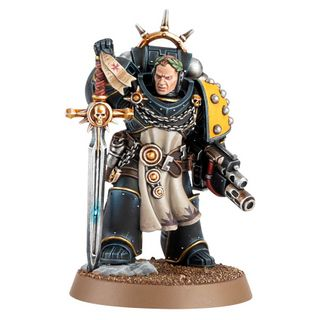

<!-- A0190-B0014 -->

原译文

Loyalist Champion Consul 忠诚派冠军领事

**校订译文**

Loyalist Champion Consul 忠诚派冠军领事

<!-- /A0190-B0014 -->

<!-- A0190-B0015 图片 -->
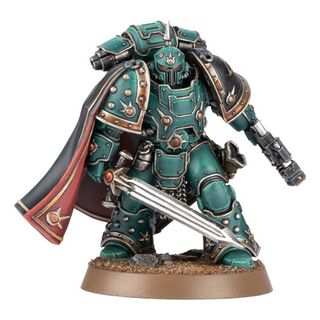

<!-- A0190-B0016 -->

原译文

Traitor Champion Consul 叛乱派冠军领事

**校订译文**

Traitor Champion Consul 叛乱派冠军领事

<!-- /A0190-B0016 -->

<!-- A0190-B0017 -->
### Chaplain 教士

原题：Chaplain 牧师

<!-- /A0190-B0017 -->

<!-- A0190-B0018 -->
**英文原文**

Fearsome veteran warriors who enforce a cohesion of doctrine and belief in the scattered and increasingly idiosyncratic Legions. Theirs was a mortuary symbol of sacrifice graven in the form of an ornate staff, mace or axe: the Crozius Arcanum, which served as both a badge of office and a deadly weapon.

<!-- /A0190-B0018 -->

<!-- A0190-B0019 -->

原译文

那些令人畏惧的资深战士，他们在分散且日益特立独行的军团中强化教义与信仰的凝聚力。他们拥有一种以华丽的长杖、权杖或斧头形式雕刻而成的象征着牺牲的丧葬标志：牧师权杖，它既是职权的标志，也是致命的武器。

**校订译文**

这些令人敬畏的资深战士，负责在分散作战、特色日益鲜明的军团中维系共同的信念与行为准则。他们携带以死亡象征牺牲的教士权杖（Crozius Arcanum），其外形可为饰纹华丽的长杖、战锤或斧；它既是职权象征，也是致命武器。

<!-- /A0190-B0019 -->

<!-- A0190-B0020 图片 -->
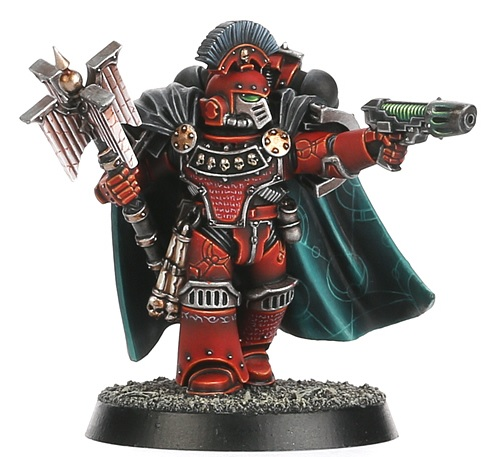

<!-- A0190-B0021 -->

原译文

Consul-Chaplain of the Word Bearers 怀言者牧师领事

**校订译文**

Consul-Chaplain of the Word Bearers 怀言者领事教士

<!-- /A0190-B0021 -->

<!-- A0190-B0022 -->
### Delegatus 代表

<!-- /A0190-B0022 -->

<!-- A0190-B0023 -->
**英文原文**

These officers were tasked with specific missions by a Legion's high command, allowing them to act with full authority. As such, they could mobilize the Legion's resources, deploy assets independently, and perform vital strategic missions.

<!-- /A0190-B0023 -->

<!-- A0190-B0024 -->

原译文

这些军官被军团的高级指挥部赋予了特定的任务，使他们能够全权行事。因此，他们可以调动军团的资源，独立部署资产，执行重要的战略任务。

**校订译文**

这些军官被军团的高级指挥部赋予了特定的任务，使他们能够全权行事。因此，他们可以调动军团的资源，独立部署资产，执行重要的战略任务。

<!-- /A0190-B0024 -->

<!-- A0190-B0025 -->
### Esoterist 密使

<!-- /A0190-B0025 -->

<!-- A0190-B0026 -->
**英文原文**

Members of the Librarius who returned to their studies with or without the blessing of their Primarch and delved into forbidden lore that saw common use on the battlefield. Esoterist aligned with the Traitor Legions are able to open rifts trough the warp and summon Ruinstorm Daemons to do their bidding, while those aligned with the Loyalist Legions have the power to close those rifts.

<!-- /A0190-B0026 -->

<!-- A0190-B0027 -->

原译文

无论是否得到原体的祝福，智库的成员都会回到他们的学习中，深入研究在战场上普遍使用的禁忌知识。与叛徒军团联结的密使能够通过亚空间打开裂缝，并召唤毁灭风暴恶魔来执行他们的命令，而与忠诚军团联结的人则有能力关闭这些裂缝。

**校订译文**

这些智库成员重新拾起研究，不论是否得到原体许可，都会钻研禁忌知识，并将其广泛用于战场。叛徒军团的密使能够打开通往亚空间的裂隙，召唤毁灭风暴恶魔为其效命；忠诚派密使则能够关闭这些裂隙。

<!-- /A0190-B0027 -->

<!-- A0190-B0028 图片 -->
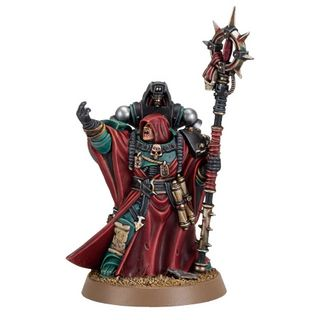

<!-- A0190-B0029 -->

原译文

Esoterist 密使

**校订译文**

Esoterist 密使

<!-- /A0190-B0029 -->

<!-- A0190-B0030 -->
### Forge Lord 铸炉之主

<!-- /A0190-B0030 -->

<!-- A0190-B0031 -->
**英文原文**

Masters of the machine and foundry, Forge Lords are the most experienced and skilful of the Legion’s Techmarines. These warrior-smiths are skilled battle-leaders as much as they are artisans of war, and are often appointed to the command of Legion detachments comprised largely of tanks and armoured vehicles or battle-automata, as well as serving as stewards to a Legion’s Dreadnoughts.

<!-- /A0190-B0031 -->

<!-- A0190-B0032 -->

原译文

铸炉之主是机械和铸造的大师，是军团技术军士中经验最丰富、技术最娴熟的。这些战斗铁匠既是熟练的战斗领袖，也是战争的工匠，他们经常被任命为军团分遣队的指挥官，该分遣队主要由坦克、装甲车或战斗自动机组成，并担任军团无畏的管理者。

**校订译文**

铸炉之主是军团中最富经验、技艺最精湛的科技战士，精通机械与铸造。他们既是战争工匠，也是能征善战的指挥官，常受命指挥以坦克、装甲载具或自动机兵为主的分遣队，并负责照管军团的无畏机甲。

<!-- /A0190-B0032 -->

<!-- A0190-B0033 -->
### Herald 传令官

<!-- /A0190-B0033 -->

<!-- A0190-B0034 -->
**英文原文**

These officers carried the official banner of their lords, be they Primarch or otherwise. They often oversaw and undertook the interests of their Legions in key missions, acting most commonly as emissaries

<!-- /A0190-B0034 -->

<!-- A0190-B0035 -->

原译文

这些军官高举着他们领主的职务旗帜，无论是原体还是其他领主。他们经常监督并承担其军团在关键任务中的利益，最常见的是作为使者

**校订译文**

传令官高举原体或其他主君的正式旗帜，通常作为使者，在关键任务中代表并维护军团的利益。

<!-- /A0190-B0035 -->

<!-- A0190-B0036 -->
### Librarian 智库员

原题：Librarian 智库

<!-- /A0190-B0036 -->

<!-- A0190-B0037 -->
**英文原文**

For many years the Legions maintained cadres of battle-psykers in their ranks, warriors who fused these esoteric powers with a Space Marine’s superhuman physical power. They used powers such as Divination, Pyromancy, Telekinesis, Telepathy, Thaumaturgy, and were equipped with a Psychic Hood.

<!-- /A0190-B0037 -->

<!-- A0190-B0038 -->

原译文

多年来，军团在他们的队伍中保留了战斗灵能者的地位，这些战士将这些深奥的力量与星际战士的超人灵能力量融合在一起。他们使用了预言、火术、念动、传心和圣言等力量，并配备了灵能护罩。

**校订译文**

军团长期保有战斗灵能者队伍，这些战士把神秘的灵能力量与星际战士超人的体能结合起来。他们运用预知、烈焰、念动、感应与奇术等灵能，并配备灵能兜帽。

**校注：** Thaumaturgy 暂译奇术；不能仅凭相近含义直接等同 Theosophamy 圣言学派。

<!-- /A0190-B0038 -->

<!-- A0190-B0039 图片 -->
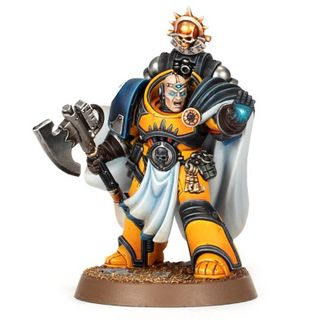

<!-- A0190-B0040 -->

原译文

Librarian 智库

**校订译文**

Librarian 智库员

<!-- /A0190-B0040 -->

<!-- A0190-B0041 图片 -->
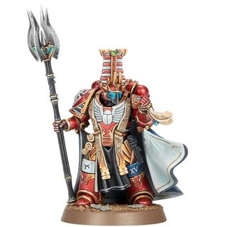

<!-- A0190-B0042 -->

原译文

Thousand Sons Librarian 千子智库

**校订译文**

Thousand Sons Librarian 千子智库员

<!-- /A0190-B0042 -->

<!-- A0190-B0043 -->
### Master of Signals 信号大师

原题：Master of Signals 信号之主

<!-- /A0190-B0043 -->

<!-- A0190-B0044 -->
**英文原文**

The Master of Signals is a strategic and communications specialist capable of interpreting and directing the flow of battle around them, and calling in support strikes from distant batteries and orbiting vessels.

<!-- /A0190-B0044 -->

<!-- A0190-B0045 -->

原译文

信号之主是一名战略和通信专家，能够解释和指挥周围的战斗流向，并从远处的炮台和轨道船只呼叫支援打击。

**校订译文**

信号大师是战略与通信专家，能分析并调控周围战场的局势，呼叫远处炮兵与轨道舰艇提供火力支援。

<!-- /A0190-B0045 -->

<!-- A0190-B0046 -->
### Moritat 暗杀精英

<!-- /A0190-B0046 -->

<!-- A0190-B0047 -->
**英文原文**

Cold-blooded murderers who fought with a suicidal fervour.

<!-- /A0190-B0047 -->

<!-- A0190-B0048 -->

原译文

冷血杀手，他们以自杀般的热情战斗。

**校订译文**

冷血杀手，他们以自杀般的热情战斗。

<!-- /A0190-B0048 -->

<!-- A0190-B0049 -->
### Mortification 禁欲者

**校注：** 标题英文 Mortification 与正文职衔 Mortificator 不同，疑为词形误写；英文照录，中文暂沿用禁欲者。

<!-- /A0190-B0049 -->

<!-- A0190-B0050 -->
**英文原文**

These specialized Techmarines were responsible for their Legion's Dreadnoughts. They showed a near fanatical devotion to their charge of managing the Legion's honored dead, and in some cases went so far as to contravene the tenets of the Cult Mechanicus adopted by the Masters of the Forge. A Mortificator's primary duties included the protection during slumber and rousing during war of the Legion's Dreadnoughts, and when necessary, extends to the controlling of those Dreadnoughts too asleep or too choleric to be considered wholly sane.

<!-- /A0190-B0050 -->

<!-- A0190-B0051 -->

原译文

这些专业的技术军士负责他们的军团无畏。他们对管理军团荣誉逝者的职责表现出近乎狂热的忠诚，在某些情况下甚至违反了铸造大师所采用的机械教信仰的原则。禁欲者的主要职责包括在军团无畏的休眠和战争中唤醒时提供保护，并在必要时扩展到控制那些睡得太熟或脾气太暴躁而无法被认为完全清醒的无畏。

**校订译文**

这些专门照管军团无畏机甲的科技战士，对守护荣誉先烈的职责近乎狂热，有时甚至不惜违背铸造大师奉行的机械教派教义。禁欲者的首要职责，是保护沉眠中的无畏机甲，并在战争来临时将其唤醒。必要时，他们还要控制那些神志过于昏沉或暴烈、已难称完全清醒的无畏机甲。

<!-- /A0190-B0051 -->

<!-- A0190-B0052 -->
### Pathfinder 探路者

<!-- /A0190-B0052 -->

<!-- A0190-B0053 -->
**英文原文**

Within the ranks of the Legions at the time of the outbreak of the Horus Heresy there were few remaining Scout cohorts, with most companies equipped with scout armour long since reassigned to Reconnaissance detachments.

<!-- /A0190-B0053 -->

<!-- A0190-B0054 -->

原译文

荷鲁斯叛乱爆发时，军团内部几乎没有剩余的侦察兵队伍，大多数连都配备了侦察装甲，早已被重新分配给侦察分队。

**校订译文**

荷鲁斯之乱爆发时，军团中已很少保留独立的侦察兵大队；大多数穿着侦察护甲的连队，早已改编进侦察分遣队。

<!-- /A0190-B0054 -->

<!-- A0190-B0055 -->
### Opsequiari 执法官

<!-- /A0190-B0055 -->

<!-- A0190-B0056 -->
**英文原文**

A rank of disciplinary officer.

<!-- /A0190-B0056 -->

<!-- A0190-B0057 -->

原译文

执行纪律的军官级别。

**校订译文**

执行纪律的军官级别。

<!-- /A0190-B0057 -->

<!-- A0190-B0058 -->
### Overseer 监督者

<!-- /A0190-B0058 -->

<!-- A0190-B0059 -->
**英文原文**

Also known as Legion Overseers, they were charged with ensuring the common troopers of the Imperial Army functioned acceptably alongside the Space Marine Legions, during battles. At these times, the Overseers were able to take three of an Imperial Army's Solar Auxilia Lasrifle Sections or Imperialis Militia Infantry Squads as part of their personal retinue. Though it was far from the most far glorious assignment, the Overseers' work was appreciated by depleted Legion forces who had to rely on the Imperial Army to bolster their shattered battle lines. Both the Loyalist and Traitor Legions used Overseers, during the Horus Heresy but they went about commanding their Imperial Army troopers differently. Loyalist Overseers usually sought to command their troopers through respect and led from the front with ornate power mauls. They also relied on using stirring rhetoric and wearing highly decorated power armor to inspire their charges. Traitor Overseers, though, commanded their troopers by using fear instead.

<!-- /A0190-B0059 -->

<!-- A0190-B0060 -->

原译文

他们也被称为军团监督者，负责确保帝国陆军的普通士兵在战斗中与星际战士军团并肩作战。在这些时候，监督者能够将帝国陆军的三个太阳辅助军激光步枪小队或帝国民兵步兵小队作为其个人随从的一部分。尽管这远非最光荣的任务，但监督者的工作受到了精疲力尽的军团部队的赞赏，他们不得不依靠帝国军队来巩固他们破碎的战线。在荷鲁斯叛乱时期，忠诚派和叛徒军团都使用了监督者，但他们指挥帝国军队的方式不同。忠诚派的监督者通常试图通过尊重来指挥他们的士兵，并从前线用华丽的动力槌攻击来领导他们。他们还依靠激动人心的言辞和佩戴装饰华丽的护甲来激励他们的冲锋。然而，叛徒监督者却用恐惧来指挥他们的士兵。

**校订译文**

监督者亦称军团监督者，负责确保普通帝国军士兵能够与星际战士军团有效协同。作战时，他们可以将三个太阳辅助军激光步枪小队或帝国民兵步兵小队编入自己的直属随从部队。虽然这项职责并不显赫，却深受兵力受损军团的重视，因为这些军团需要依靠帝国军填补战线。荷鲁斯之乱期间，双方军团都设有监督者，但指挥方式有所不同：忠诚派通常以赢得部下尊重来维持指挥，手持华丽的动力槌身先士卒，并以激昂演说和装饰精美的动力甲鼓舞士兵；叛徒监督者则依靠恐惧驱使部下。

<!-- /A0190-B0060 -->

<!-- A0190-B0061 图片 -->
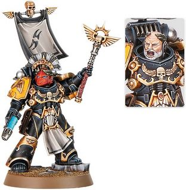

<!-- A0190-B0062 -->

原译文

Loyalist Overseer Consul 忠诚派监督者领事

**校订译文**

Loyalist Overseer Consul 忠诚派监督者领事

<!-- /A0190-B0062 -->

<!-- A0190-B0063 -->
### Praevian 智控顾问

<!-- /A0190-B0063 -->

<!-- A0190-B0064 -->
**英文原文**

On the field of battle they marched at the forefront of Battle-Automata forces, guiding them through the engagement

<!-- /A0190-B0064 -->

<!-- A0190-B0065 -->

原译文

在战场上，他们走在战斗自动机部队的最前线，引导它们完成交战

**校订译文**

在战场上，他们走在战斗自动机部队的最前线，引导它们完成交战

<!-- /A0190-B0065 -->

<!-- A0190-B0066 图片 -->
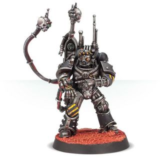

<!-- A0190-B0067 -->

原译文

Praevian 智控顾问

**校订译文**

Praevian 智控顾问

<!-- /A0190-B0067 -->

<!-- A0190-B0068 -->
### Primus Medicae 首席药剂师

<!-- /A0190-B0068 -->

<!-- A0190-B0069 -->
**英文原文**

High officers of the Legion Apothecarion, the primus medicae of a Legion ensures the battle-readiness and physical wellbeing of their battle-brothers. This is an authority which none but a Primarch or his chosen deputy can overrule, and such warriors are dedicated to preserving the gene-seed of the Legion from loss or contamination at any cost.

<!-- /A0190-B0069 -->

<!-- A0190-B0070 -->

原译文

军团药剂师（Legion Apothecarion）的高级军官是军团的首要医疗人员，确保他们的战斗兄弟的战备状态和身体健康。这是一个只有原体或他选择的副手才能推翻的权力，这些战士致力于不惜一切代价保护军团的基因种子免受损失或污染。

**校订译文**

首席药剂师是军团药剂部（Legion Apothecarion）的高级军官，负责保证战斗兄弟的身体健康与战备状态。其专业决定只有原体或原体指定的副手能够否决。他们不惜一切代价保护军团基因种子，避免其遗失或受污染。

<!-- /A0190-B0070 -->

<!-- A0190-B0071 -->
### Primus Nullificator 首席湮灭者

<!-- /A0190-B0071 -->

<!-- A0190-B0072 -->
**英文原文**

These warriors were pioneers of early attempts by the Legiones Astartes to counter the Daemonic once the spawn of the Warp began to appear in number during the Heresy. They sanctioned research into esoteric artefacts and weapons and openly sought prohibited lore in the hope that it would provide wisdom capable of combating the Daemonic.

<!-- /A0190-B0072 -->

<!-- A0190-B0073 -->

原译文

这些战士是阿斯塔特军团早期尝试对抗恶魔的先驱，由于亚空间的恶魔在叛乱期间开始大量出现。他们批准了对深奥文物和武器的研究，并公开寻求被禁止的知识，希望它能提供能够对抗恶魔的智慧。

**校订译文**

荷鲁斯之乱期间，亚空间生物开始大量现身，这些战士成为阿斯塔特早期抗击恶魔的先驱。他们批准研究神秘造物与武器，公开搜寻禁忌知识，希望找到对付恶魔的方法。

<!-- /A0190-B0073 -->

<!-- A0190-B0074 -->
### Siege-Breaker 破城者

<!-- /A0190-B0074 -->

<!-- A0190-B0075 -->
**英文原文**

The wreckers of cities and fortresses, Siege Breakers were officers whose specialty is applied to the destruction of strategic targets. They were often placed in command of armoured spearhead assaults and frontline artillery units, preferring to closely observe their work rather than sat back behind the rear

<!-- /A0190-B0075 -->

<!-- A0190-B0076 -->

原译文

破城者是城市和堡垒的破坏者，他们的专长是摧毁战略目标。他们经常被安排指挥装甲先锋突击队和前线炮兵部队，宁愿密切观察他们的工作，也不愿坐在后方

**校订译文**

破城者是城市和堡垒的破坏者，他们的专长是摧毁战略目标。他们经常被安排指挥装甲先锋突击队和前线炮兵部队，宁愿密切观察他们的工作，也不愿坐在后方

<!-- /A0190-B0076 -->

<!-- A0190-B0077 图片 -->
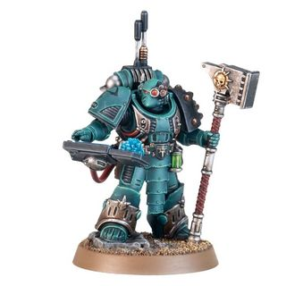

<!-- A0190-B0078 -->

原译文

Siege-Breaker Consul 破城者领事

**校订译文**

Siege-Breaker Consul 破城者领事

<!-- /A0190-B0078 -->

<!-- A0190-B0079 -->
### Warmonger 好战者

<!-- /A0190-B0079 -->

<!-- A0190-B0080 -->
**英文原文**

These Centurions were hardened commanders who were much respected for their willingness to heroically throw themselves and their men into the toughest resistance, and are entrusted to prosecute shock assaults which crush the foe in a single action.

<!-- /A0190-B0080 -->

<!-- A0190-B0081 -->

原译文

这些百夫长是久经沙场的指挥官，他们因愿意英勇地将自己和部下投入最艰难的抵抗而备受尊敬，并被委托进行突击，在一次行动中粉碎敌人。

**校订译文**

这些百夫长是久经战阵的指挥官，勇于亲自率领部下冲击敌军抵抗最坚决之处，因此备受敬重。他们受命实施猛烈突击，力求一击摧垮敌人。

<!-- /A0190-B0081 -->

<!-- A0190-B0082 -->
## Legion-Specific Consuls 特殊军团领事

<!-- /A0190-B0082 -->

<!-- A0190-B0083 -->
### Caster of Runes 符文祭司

原题：Caster of Runes 符文牧师

**校注：** 按第363篇军团时代职衔语境统一 Caster of Runes 为符文祭司，区别后世 Rune Priest 符文牧师。

<!-- /A0190-B0083 -->

<!-- A0190-B0084 -->
**英文原文**

A librarian from the Space Wolves Legion.

<!-- /A0190-B0084 -->

<!-- A0190-B0085 -->

原译文

太空野狼军团的智库。

**校订译文**

太空野狼军团的智库员。

<!-- /A0190-B0085 -->

<!-- A0190-B0086 图片 -->
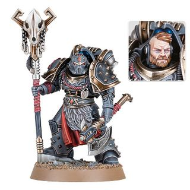

<!-- A0190-B0087 -->

原译文

Space Wolves Caster of Runes 太空野狼符文牧师

**校订译文**

Space Wolves Caster of Runes 太空野狼符文祭司

**校注：** Caster of Runes 是军团时期旧称，采用符文祭司；后世 Rune Priest 仍为符文牧师。

<!-- /A0190-B0087 -->

<!-- A0190-B0088 -->
### Dark Emissary 黑暗使节

原题：Dark Emissary 黑暗使徒

<!-- /A0190-B0088 -->

<!-- A0190-B0089 -->
**英文原文**

A rank established for the Sons of Horus, they were charged with ensuring their Primarch's allies and servants remained unquestioningly loyal to him. The Dark Emissaries also guided the Warmaster's forces with their strategic experience and served as a paragon of skill and martial prowess. However they would also serve as executioners for anyone that failed to live up to the their exacting Primarch's expectations or displayed seditious intentions. These could be carried out by the Dark Emissaries' Staff of Dark Authority.

<!-- /A0190-B0089 -->

<!-- A0190-B0090 -->

原译文

这是为荷鲁斯之子建立的一个等级，他们负责确保他们的原体的盟友和仆人对他保持无可置疑的忠诚。黑暗使徒还凭借他们的战略经验指导了战帅的部队，并成为技能和军事实力的典范。然而，他们也会成为任何不符合他们严格的原体期望或表现出煽动意图的人的刽子手。这些可以由黑暗威权的黑暗使徒团体来执行。

**校订译文**

黑暗使节是荷鲁斯之子设立的职衔，负责确保原体的盟友与仆从始终绝对效忠于他。他们凭借丰富的战略经验引导战帅的部队，也是技艺与武勇的典范。对未能达到原体严苛要求、或显露不臣之心的人，他们同样充当刽子手，以“黑暗威权之杖”实施处决。

<!-- /A0190-B0090 -->

<!-- A0190-B0091 图片 -->
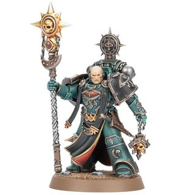

<!-- A0190-B0092 -->

原译文

Sons of Horus Dark Emissary 荷鲁斯之子黑暗使徒

**校订译文**

Sons of Horus Dark Emissary 荷鲁斯之子黑暗使节

<!-- /A0190-B0092 -->

<!-- A0190-B0093 -->
### Saboteur 破坏者

<!-- /A0190-B0093 -->

<!-- A0190-B0094 -->
**英文原文**

A rank used by the Alpha Legion, Saboteur Consuls were expert assassins, masters of misdirection and infiltrators who were dedicated to upending their enemies' best-laid plans. They were so skilled, that Saboteurs could stroll into the ranks of their opponents without revealing themselves and cause havoc behind enemy lines or eliminate high-ranking targets by using their equipment of a sling of explosive devices, a Power Dagger, and an Astartes Shotgun.

<!-- /A0190-B0094 -->

<!-- A0190-B0095 -->

原译文

作为阿尔法军团使用的军衔，破坏者领事是专业的刺客、误导大师和渗透者，他们致力于颠覆敌人最周密的计划。他们非常熟练，破坏者可以在不暴露自己的情况下走进对手的队伍，在敌后造成破坏，或使用他们的爆炸装置吊索、动力匕首和阿斯塔特霰弹枪等装备消灭高级目标。

**校订译文**

破坏者领事是阿尔法军团的专业刺客、欺敌大师和渗透者，专门瓦解敌人最周密的计划。他们能若无其事地混入敌军，利用随身携带的一串爆炸装置、动力匕首与阿斯塔特霰弹枪，在敌后制造混乱，或刺杀重要目标。

<!-- /A0190-B0095 -->

<!-- A0190-B0096 图片 -->
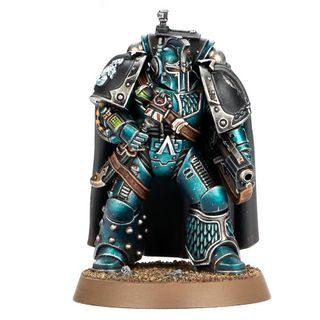

<!-- A0190-B0097 -->

原译文

Alpha Legion Saboteur Consul 阿尔法军团破坏者领事

**校订译文**

Alpha Legion Saboteur Consul 阿尔法军团破坏者领事

<!-- /A0190-B0097 -->

<!-- A0190-B0098 -->
### Stormseer 风暴先知

<!-- /A0190-B0098 -->

<!-- A0190-B0099 -->
**英文原文**

A librarian from the White Scars Legion.

<!-- /A0190-B0099 -->

<!-- A0190-B0100 -->

原译文

白色疤痕军团的智库。

**校订译文**

白疤军团的智库员。

<!-- /A0190-B0100 -->

<!-- A0190-B0101 图片 -->
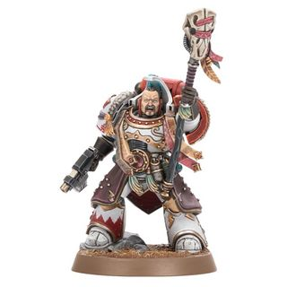

<!-- A0190-B0102 -->

原译文

White Scars Stormseer 白色疤痕风暴先知

**校订译文**

White Scars Stormseer 白疤风暴先知

<!-- /A0190-B0102 -->

本篇核心术语与暂定项

以下列出本篇出现的英文原形及核心术语表用词。同形词可能指不同对象，具体词义以本篇正文和校注为准；单复数、别名和仅见于图注的名称可能尚未列入。完整候选见[术语表](../../术语表/双语术语候选.csv)。

| 英文 | 采用中文 | 状态 |
| --- | --- | --- |
| Space Wolves | 太空野狼 | 官方已核对 |
| Imperial Army | 帝国军 | 暂定·官方待核 |
| Librarian | 智库员 | 官方已核对 |
| Divination | 预知学派 | 官方已核对 |
| Pyromancy | 烈焰学派 | 官方已核对 |
| Telekinesis | 念动学派 | 官方已核对 |
| Telepathy | 感应学派 | 官方已核对 |
| Horus Heresy | 荷鲁斯之乱 | 官方已核对 |
| Warp | 亚空间 | 官方已核对 |
| Imperium | 帝国 | 暂定·简称 |
| Cult Mechanicus | 机械教派 | 暂定·概念区分 |
| Psychic Hood | 灵能兜帽 | 暂定·官方待核 |
| Librarius | 智库（机构）／智库学派（灵能学派） | 语境定译·官方待核 |
| Equipment | 装备 | 编辑用语已统一 |
| Primarch | 原体 | 官方已核对 |
| Great Crusade | 大远征 | 暂定·官方待核 |
| Horus | 荷鲁斯 | 暂定·官方待核 |
| Sons of Horus | 荷鲁斯之子 | 暂定·官方待核 |
| Legiones Astartes | 阿斯塔特军团 | 暂定·官方待核 |
| Solar Auxilia | 太阳辅助军 | 暂定·官方待核 |
| Imperialis Militia | 帝国民兵 | 暂定·官方待核 |
| Assignment | 灵能分级 | 暂定·官方待核 |
| Master | 导师（审判庭职衔）／舰务官（舰员职务） | 语境定译·官方待核 |
| Crozius Arcanum | 教士权杖 | 暂定·官方待核 |
| Apothecarion | 药剂部 | 暂定·官方待核 |
| Primus Medicae | 首席药剂师 | 暂定·官方待核 |
| Master of the Arsenal | 军械大师 | 暂定·官方待核 |
| Saboteur | 破坏专家 | 暂定·官方待核 |
| Scout Armour | 侦察护甲 | 暂定·官方待核 |
| Armoured Spearhead | 装甲矛头编队 | 暂定·官方待核 |
| Space Marine Legion | 星际战士军团 | 暂定·官方待核 |
| Legion Apothecarion | 军团药剂部 | 暂定·官方待核 |
| White Scars | 白疤 | 官方已核 |
| Alpha Legion | 阿尔法军团 | 暂定·官方待核 |
| Scars | 伤疤 | 暂定·官方待核 |
| Armistos | 军械大师 | 暂定·官方待核 |
| Champion | 冠军 | 暂定·官方待核 |
| Esoterist | 密使 | 暂定·官方待核 |
| Master of Signals | 信号大师 | 暂定·官方待核 |
| Paragon Blade | 模范之刃 | 暂定·官方待核 |
| Space Marine | 星际战士 | 暂定·官方待核 |
| Chapter | 战团 | 暂定·官方待核 |
| Veteran | 老兵 | 暂定·官方待核 |
| Scout | 侦察兵 | 暂定·官方待核 |
| Executioners | 处刑者 | 语境定译·官方待核 |
| Centurions | 百夫长 | 暂定·官方待核 |
| Gene-seed | 基因种子 | 暂定·官方待核 |
| Medicae | 医疗工 | 暂定·官方待核 |
| Mortificator | 禁欲者 | 暂定·官方待核 |
| Staff of Dark Authority | 黑暗威权之杖 | 暂定·官方待核 |
| Thaumaturgy | 奇术 | 暂定·官方待核 |
| Powers | 能天使 | 暂定·官方待核 |
| Imperialis | 帝国徽记 | 暂定·官方待核 |
| Primus | 领军 | 官方已核对 |
| The Dark | 《黑暗》 | 暂定·官方待核 |
| Ruinstorm | 毁灭风暴 | 暂定·官方待核 |
| Shotgun | 霰弹枪 | 暂定·官方待核 |

