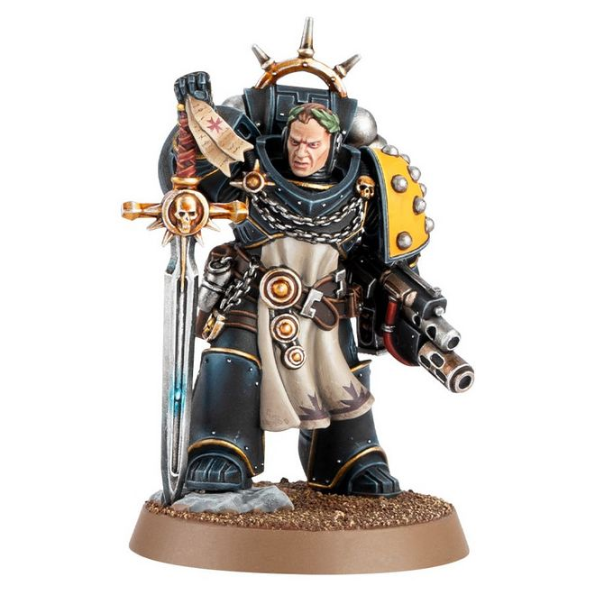
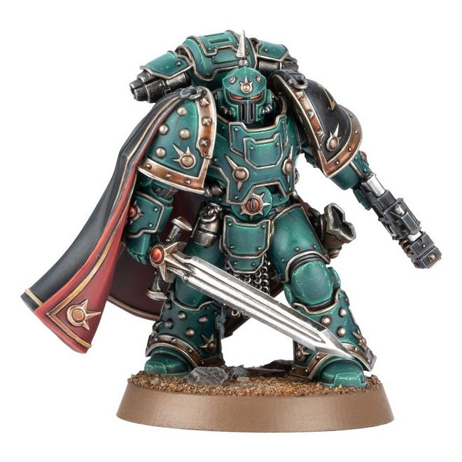

# 0191 冠军领事 Champion Consul

精校状态：中文行文已逐段精校，部分术语仍为暂定

分类：通用概念 / 帝国 Imperium / 中央政务部 Adeptus Terra / 星际战士军团 Space Marine Legion

原文来源：https://www.bilibili.com/opus/1019945077994160147

原作者：帝国神选罐头

原文时间：2025年01月08日 13:07

[返回分类目录](目录.md) · [全书目录](../../目录.md)

<!-- A0191-B0001 -->
**英文原文**

Champion Consuls were Champions from the Space Marine Legions during the Horus Heresy.

<!-- /A0191-B0001 -->

<!-- A0191-B0002 -->

原译文

冠军领事是荷鲁斯叛乱时期星际战士的冠军。

**校订译文**

冠军领事是荷鲁斯之乱时期星际战士军团中担任冠军战士的领事。

<!-- /A0191-B0002 -->

<!-- A0191-B0003 图片 -->

<!-- A0191-B0004 -->

原译文

Imperial Fists Champion Consul 帝国之拳冠军领事

**校订译文**

Imperial Fists Champion Consul 帝国之拳冠军领事

<!-- /A0191-B0004 -->

<!-- A0191-B0005 -->
## Description 描述

<!-- /A0191-B0005 -->

<!-- A0191-B0006 -->
**英文原文**

The Legions's greatest duelists were chosen for the rank and were responsible for reaping a fierce toll against Traitor commanders. By pairing the Champions' mastery of swordsmanship with finely forged Greatblades, they could clash with the mightiest Traitor Praetors and emerge victorious. This made them an invaluable asset for Loyalist armies whose commanders kept their eye on a battle's bigger picture.

<!-- /A0191-B0006 -->

<!-- A0191-B0007 -->

原译文

军团最伟大的决斗者被选为军衔，并负责对叛徒的指挥官造成巨大损失。通过将冠军对剑术的掌握与精心锻造的大剑相结合，他们可以与最强大的叛徒执政官发生冲突，并取得胜利。这使他们成为忠诚派军队的宝贵资产，指挥官们一直关注着战斗的大局。

**校订译文**

军团最出色的决斗者会被选任为冠军领事，负责猎杀叛徒指挥官。凭借精湛剑术与精工锻造的大剑，他们能够击败最强大的叛徒执政官。这使忠诚派指挥官得以专注于全局，让冠军领事成为军队不可多得的助力。

**校注：** 本段聚焦忠诚派用途，但冠军领事并非仅见忠诚派，随后图注即为荷鲁斯之子。

<!-- /A0191-B0007 -->

<!-- A0191-B0008 图片 -->

<!-- A0191-B0009 -->

原译文

Sons of Horus Champion Consul 荷鲁斯之子冠军领事

**校订译文**

Sons of Horus Champion Consul 荷鲁斯之子冠军领事

<!-- /A0191-B0009 -->

<!-- A0191-B0010 -->
**英文原文**

The Legions armed and armored their Champion Consuls with masterwork equipment, which included Paragon Blades. They also wore laurel wreaths on their armored or bare heads, which befitted the Champions' station.

<!-- /A0191-B0010 -->

<!-- A0191-B0011 -->

原译文

军团用精湛的装备武装和披甲了他们的冠军领事，其中包括模范之刃。他们还在他们的装甲或头顶佩戴桂冠，与冠军的地位相称。

**校订译文**

军团为冠军领事配备精工武器和盔甲，其中包括模范之刃。他们还会在头盔或裸露的头上佩戴桂冠，彰显冠军身份。

<!-- /A0191-B0011 -->

<!-- A0191-B0012 -->
## Equipment 装备

<!-- /A0191-B0012 -->

<!-- A0191-B0013 -->

原译文

Paragon Blade 模范之刃

**校订译文**

Paragon Blade 模范之刃

<!-- /A0191-B0013 -->

<!-- A0191-B0014 -->

原译文

Refractor Field 折射力场

**校订译文**

Refractor Field 折射力场

<!-- /A0191-B0014 -->

<!-- A0191-B0015 -->

原译文

Iron Halo 铁光环

**校订译文**

Iron Halo 铁光环

<!-- /A0191-B0015 -->

本篇核心术语与暂定项

以下列出本篇出现的英文原形及核心术语表用词。同形词可能指不同对象，具体词义以本篇正文和校注为准；单复数、别名和仅见于图注的名称可能尚未列入。完整候选见[术语表](../../术语表/双语术语候选.csv)。

| 英文 | 采用中文 | 状态 |
| --- | --- | --- |
| Horus Heresy | 荷鲁斯之乱 | 官方已核对 |
| Equipment | 装备 | 编辑用语已统一 |
| Horus | 荷鲁斯 | 暂定·官方待核 |
| Champion | 冠军 | 暂定·官方待核 |
| Space Marine | 星际战士 | 暂定·官方待核 |

