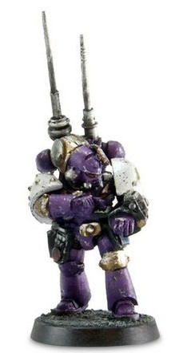

# 0193 信号大师 Master of Signals

精校状态：中文行文已逐段精校，部分术语仍为暂定

分类：通用概念 / 帝国 Imperium / 中央政务部 Adeptus Terra / 星际战士军团 Space Marine Legion

原文来源：https://www.bilibili.com/opus/1112447618326200329

原作者：帝国神选罐头

原文时间：2025年09月14日 19:44

[返回分类目录](目录.md) · [全书目录](../../目录.md)

<!-- A0193-B0001 -->
**英文原文**

Master of Signals was a type of Consul title used by the Legiones Astartes during the Great Crusade and Horus Heresy.

<!-- /A0193-B0001 -->

<!-- A0193-B0002 -->

原译文

信号大师是阿斯塔特军团在大远征和荷鲁斯叛乱期间使用的一种领事头衔。

**校订译文**

信号大师是大远征和荷鲁斯之乱时期，阿斯塔特军团使用的一种领事职衔。

<!-- /A0193-B0002 -->

<!-- A0193-B0003 图片 -->

<!-- A0193-B0004 -->

原译文

Emperor's Children Master of Signals 帝皇之子信号大师

**校订译文**

Emperor's Children Master of Signals 帝皇之子信号大师

<!-- /A0193-B0004 -->

<!-- A0193-B0005 -->
**英文原文**

A vital link between those fighting and supporting the Legion in battle, Masters of Signal were strategic and communications specialists equipped with Vox command relays. These warriors received constant positional updates from forces in the vicinity and directed them with a logistical skill that was second to none. They specialized in signaling priority attacks, ensuring weak spots in enemy lines were exploited, reinforcing against counterattacks, and directing orbital support.

<!-- /A0193-B0005 -->

<!-- A0193-B0006 -->

原译文

在战斗中，信号大师是战斗人员和支援战斗中的军团之间的重要纽带，他们是配备音阵指挥中继的战略和通信专家。这些战士不断收到附近部队的位置更新，并以无与伦比的后勤技能指挥他们。他们专门负责发出优先攻击信号，确保利用敌方战线上的弱点，加强反击，并指挥轨道支援。

**校订译文**

信号大师是军团战斗部队与支援部队之间的重要纽带。他们是配备音阵指挥中继设备的战略与通信专家，不断接收周边部队的位置报告，以高超的协调能力进行调度。他们负责标定优先攻击目标、把握敌方战线的薄弱处、增援己方以抵御反击，并引导轨道支援。

<!-- /A0193-B0006 -->

本篇核心术语与暂定项

以下列出本篇出现的英文原形及核心术语表用词。同形词可能指不同对象，具体词义以本篇正文和校注为准；单复数、别名和仅见于图注的名称可能尚未列入。完整候选见[术语表](../../术语表/双语术语候选.csv)。

| 英文 | 采用中文 | 状态 |
| --- | --- | --- |
| Horus Heresy | 荷鲁斯之乱 | 官方已核对 |
| Great Crusade | 大远征 | 暂定·官方待核 |
| Horus | 荷鲁斯 | 暂定·官方待核 |
| Legiones Astartes | 阿斯塔特军团 | 暂定·官方待核 |
| Master | 导师（审判庭职衔）／舰务官（舰员职务） | 语境定译·官方待核 |
| Consul | 领事 | 暂定·官方待核 |
| Master of Signals | 信号大师 | 暂定·官方待核 |

