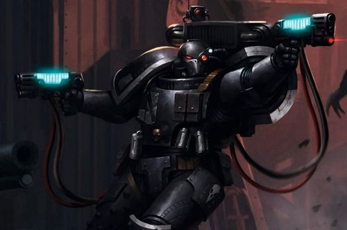
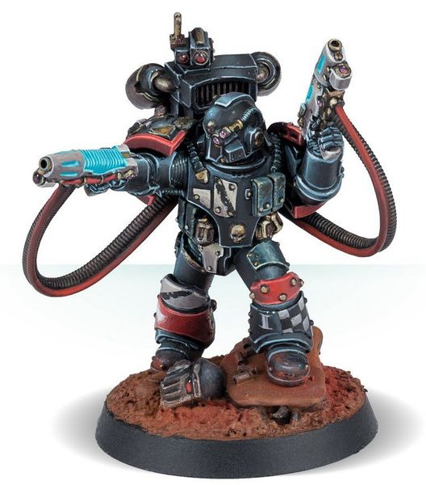
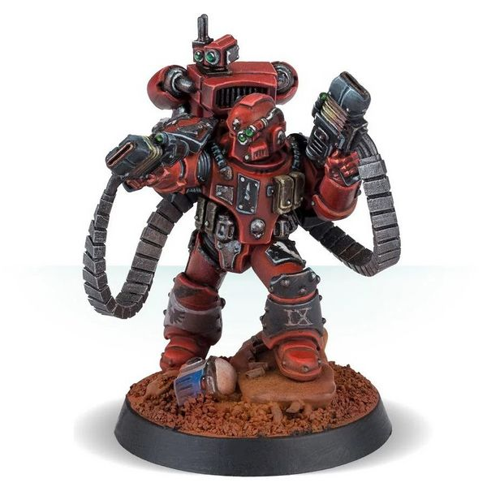

# 0194 暗杀精英 Moritat

精校状态：中文行文已逐段精校，部分术语仍为暂定

分类：通用概念 / 帝国 Imperium / 中央政务部 Adeptus Terra / 星际战士军团 Space Marine Legion

原文来源：https://www.bilibili.com/opus/1030340445063872513

原作者：帝国神选罐头

原文时间：2025年02月05日 13:27

[返回分类目录](目录.md) · [全书目录](../../目录.md)

<!-- A0194-B0001 -->
**英文原文**

Moritats were specialized Space Marine warriors during the Great Crusade and Horus Heresy.

<!-- /A0194-B0001 -->

<!-- A0194-B0002 -->

原译文

在大远征和荷鲁斯叛乱时期，暗杀精英是特殊的星际战士。

**校订译文**

暗杀精英是大远征与荷鲁斯之乱时期的一类专业星际战士。

<!-- /A0194-B0002 -->

<!-- A0194-B0003 图片 -->

<!-- A0194-B0004 -->

原译文

Moritat 暗杀精英

**校订译文**

Moritat 暗杀精英

<!-- /A0194-B0004 -->

<!-- A0194-B0005 -->
**英文原文**

The individuals assigned to this duty were often cold-blooded murderers who fought with a suicidal fervour. They were normally given missions from which they would not be expected to return.

<!-- /A0194-B0005 -->

<!-- A0194-B0006 -->

原译文

被指派执行这项任务的人往往是冷血杀手，他们以自杀般的热情进行战斗。他们通常被派去执行预计无归的任务。

**校订译文**

被指派执行这项任务的人往往是冷血杀手，他们以自杀般的热情进行战斗。他们通常被派去执行预计无归的任务。

<!-- /A0194-B0006 -->

<!-- A0194-B0007 -->
## Overview 概述

<!-- /A0194-B0007 -->

<!-- A0194-B0008 -->
**英文原文**

The Moritat had their origin in Raven Guard Ash Blind (also known as Sable Blind on Deliverance). These black-eyed warriors were veterans who were known to forsake all pretense of self-preservation, fighting with a terrifying determination before succumbing to their foes. The survivors of these suicidal incidents were sometimes recovered and in future battles would often descend into the same suicidal fervor that befell them before. The Raven Guard under Corax would organize these warriors into units of assassins and shock troops and they proved highly effective.

<!-- /A0194-B0008 -->

<!-- A0194-B0009 -->

原译文

暗杀精英起源于暗鸦守卫灰烬盲者（也称为拯救星的目盲暗夜）。这些黑眼睛的战士是老兵，他们放弃了所有自我保护的伪装，在屈服于敌人之前以可怕的决心战斗。这些自杀事件的幸存者有时会康复，在未来的战斗中，他们往往会陷入与之前相同的自杀般热情。科拉克斯领导的暗鸦守卫将这些战士组织成刺客和突击部队，他们被证明非常有效。

**校订译文**

暗杀精英源于暗鸦守卫的“灰盲”（在拯救星亦称“黑盲”）。这些双眼漆黑的老兵彻底抛弃自保念头，以骇人的决心死战，直到被敌人击倒。有时，侥幸生还者会被救回；但在之后的战斗中，他们往往又会陷入同样不顾生死的狂热。科拉克斯麾下的暗鸦守卫将这些战士编成刺客和突击部队，结果卓有成效。

<!-- /A0194-B0009 -->

<!-- A0194-B0010 图片 -->

<!-- A0194-B0011 -->

原译文

Moritat 暗杀精英

**校订译文**

Moritat 暗杀精英

<!-- /A0194-B0011 -->

<!-- A0194-B0012 -->
**英文原文**

After the Raven Guard bested the Ultramarines in several simulated battles with these warriors, Roboute Guilliman adopted similar units in his own legion, designating them Moritat. They then spread throughout the rest of the Legiones Astartes.

<!-- /A0194-B0012 -->

<!-- A0194-B0013 -->

原译文

在暗鸦守卫在与这些战士的几次模拟战斗中击败了极限战士后，罗伯特·基里曼在自己的军团中采用了类似的部队，将其命名为暗杀精英。然后，他们蔓延到其他地区的阿斯塔特军团。

**校订译文**

暗鸦守卫凭借这些战士，在数次模拟战中击败极限战士后，罗保特·基里曼也在自己的军团组建类似部队，并将其命名为暗杀精英。此后，这类部队逐渐推广到其他阿斯塔特军团。

<!-- /A0194-B0013 -->

<!-- A0194-B0014 图片 -->

<!-- A0194-B0015 -->

原译文

Blood Angels Moritat 圣血天使暗杀精英

**校订译文**

Blood Angels Moritat 圣血天使暗杀精英

<!-- /A0194-B0015 -->

<!-- A0194-B0016 -->
**英文原文**

Their primary armament was two Volkite Serpentae or two plasma pistols, connected to their jump packs via plasma feed cables and capable of launching a continuous barrage of incredible amounts of firepower.

<!-- /A0194-B0016 -->

<!-- A0194-B0017 -->

原译文

他们的主要武器是两支爆燃蛇铳或两支等离子手枪，通过等离子馈电电缆连接到跳跃背包，能够连续发射令人难以置信的火力。

**校订译文**

他们的主要武器是两支爆燃蛇铳或两支等离子手枪，通过等离子馈电电缆连接到跳跃背包，能够连续发射令人难以置信的火力。

**校注：** 原文把两类手枪及等离子供能管线并列，技术适用范围未说明；未自行补定爆燃武器也以等离子供能。

<!-- /A0194-B0017 -->

<!-- A0194-B0018 -->
## Known Moritats 著名暗杀精英

<!-- /A0194-B0018 -->

<!-- A0194-B0019 -->
**英文原文**

Kaedes Nex — Raven Guard.

<!-- /A0194-B0019 -->

<!-- A0194-B0020 -->

原译文

凯德斯 奈克斯 — 暗鸦守卫

**校订译文**

凯德斯·奈克斯——暗鸦守卫。

<!-- /A0194-B0020 -->

<!-- A0194-B0021 -->
**英文原文**

Munokhoi — White Scars.

<!-- /A0194-B0021 -->

<!-- A0194-B0022 -->

原译文

穆诺霍伊 — 白色疤痕

**校订译文**

穆诺霍伊——白疤。

<!-- /A0194-B0022 -->

<!-- A0194-B0023 -->
**英文原文**

Vitas Phorgal — Death Guard.

<!-- /A0194-B0023 -->

<!-- A0194-B0024 -->

原译文

维塔斯·福戈 — 死亡守卫

**校订译文**

维塔斯·福戈 — 死亡守卫

<!-- /A0194-B0024 -->

<!-- A0194-B0025 -->
**英文原文**

Vortronar — Alpha Legion

<!-- /A0194-B0025 -->

<!-- A0194-B0026 -->

原译文

沃特朗纳 — 阿尔法军团

**校订译文**

沃特朗纳 — 阿尔法军团

<!-- /A0194-B0026 -->

<!-- A0194-B0027 -->
**英文原文**

Zhyrgal — Death Guard.

<!-- /A0194-B0027 -->

<!-- A0194-B0028 -->

原译文

日尔加尔 — 死亡守卫

**校订译文**

日尔加尔 — 死亡守卫

<!-- /A0194-B0028 -->

本篇核心术语与暂定项

以下列出本篇出现的英文原形及核心术语表用词。同形词可能指不同对象，具体词义以本篇正文和校注为准；单复数、别名和仅见于图注的名称可能尚未列入。完整候选见[术语表](../../术语表/双语术语候选.csv)。

| 英文 | 采用中文 | 状态 |
| --- | --- | --- |
| Death Guard | 死亡守卫 | 官方已核对 |
| Roboute Guilliman | 罗保特·基里曼 | 官方已核对 |
| Ultramarines | 极限战士 | 官方已核对 |
| Horus Heresy | 荷鲁斯之乱 | 官方已核对 |
| Great Crusade | 大远征 | 暂定·官方待核 |
| Horus | 荷鲁斯 | 暂定·官方待核 |
| Legiones Astartes | 阿斯塔特军团 | 暂定·官方待核 |
| Deliverance | 拯救星 | 暂定·官方待核 |
| White Scars | 白疤 | 官方已核 |
| Alpha Legion | 阿尔法军团 | 暂定·官方待核 |
| Raven Guard | 暗鸦守卫 | 官方已核 |
| Scars | 伤疤 | 暂定·官方待核 |
| Kaedes Nex | 凯德斯·奈克斯 | 暂定·官方待核 |
| Moritat | 暗杀精英 | 暂定·官方待核 |
| Munokhoi | 穆诺霍伊 | 暂定·官方待核 |
| Vitas Phorgal | 维塔斯·福戈 | 暂定·官方待核 |
| Vortronar | 沃特朗纳 | 暂定·官方待核 |
| Zhyrgal | 日尔加尔 | 暂定·官方待核 |
| Space Marine | 星际战士 | 暂定·官方待核 |
| Ash Blind | 灰盲 | 暂定·官方待核 |
| Sable Blind | 黑盲 | 暂定·官方待核 |
| Sable | 暗夜星 | 暂定·官方待核 |

