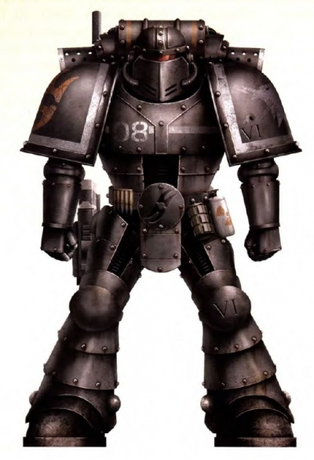

# 0195 领事执法官 Consul-Opsequiari

精校状态：中文行文已逐段精校，部分术语仍为暂定

分类：通用概念 / 帝国 Imperium / 中央政务部 Adeptus Terra / 星际战士军团 Space Marine Legion

原文来源：https://www.bilibili.com/opus/1021090464205373446

原作者：帝国神选罐头

原文时间：2025年01月11日 15:12

[返回分类目录](目录.md) · [全书目录](../../目录.md)

<!-- A0195-B0001 -->
**英文原文**

The Consul-Opsequiari was a rank of Space Marine Consul during the Great Crusade and Horus Heresy.

<!-- /A0195-B0001 -->

<!-- A0195-B0002 -->

原译文

领事执法官是大远征和荷鲁斯叛乱时期的星际战士领事。

**校订译文**

领事执法官是大远征与荷鲁斯之乱时期，星际战士领事的一种职衔。

<!-- /A0195-B0002 -->

<!-- A0195-B0003 图片 -->

<!-- A0195-B0004 -->

原译文

VIth Legion Consul-Opsequiari 第六军团领事执法官

**校订译文**

VIth Legion Consul-Opsequiari 第六军团领事执法官

<!-- /A0195-B0004 -->

<!-- A0195-B0005 -->
**英文原文**

Utilizing the twin-flamed Sanghuata as their symbol, the Consul-Opsequiaris were a disciplinary corps with purview over not just Space Marines, but also Imperial Army allies under their command. They served to maintain order in the ranks both in and outside of battle, as well as curb any attempts to disregard or circumvent orders. Officers were selected from the most stable veterans of their Legion and granted the power of life and death over their brothers.

<!-- /A0195-B0005 -->

<!-- A0195-B0006 -->

原译文

领事执法官以双焰桑华塔为象征，是一支纪律部队，不仅负责星际战士，还负责其指挥下的帝国陆军盟友。它们有助于在战斗内外维持队伍的秩序，并遏制任何无视或规避命令的企图。军官们是从军团中最稳定的老兵中挑选出来的，并被授予对兄弟们的死生大权。

**校订译文**

领事执法官以双焰桑华塔为标志，组成一支纪律监察队伍，既管辖星际战士，也管辖其指挥下的帝国军友军。他们在战时和平时维持部队秩序，制止无视或规避命令的行为。担任此职者从军团最沉稳的老兵中选出，对战斗兄弟拥有生杀大权。

<!-- /A0195-B0006 -->

<!-- A0195-B0007 -->
**英文原文**

The VIth Legion had the most extensive Consul-Opsequiari Corps in its early days, barring perhaps the XIIth.

<!-- /A0195-B0007 -->

<!-- A0195-B0008 -->

原译文

第六军团在早期拥有最广泛的领事执法官部队，也许除了第十二军团。

**校订译文**

在早期军团中，第六军团的领事执法官队伍规模最大，唯一可能超过它的是第十二军团。

<!-- /A0195-B0008 -->

<!-- A0195-B0009 -->
## Known Consul-Opsequiaris 著名领事执法官

<!-- /A0195-B0009 -->

<!-- A0195-B0010 -->
**英文原文**

Bercim Ovkul — 8th Great Company of the Space Wolves.

<!-- /A0195-B0010 -->

<!-- A0195-B0011 -->

原译文

贝尔吉姆·奥夫库尔 — 太空野狼第八大连

**校订译文**

贝尔吉姆·奥夫库尔 — 太空野狼第八大连

<!-- /A0195-B0011 -->

本篇核心术语与暂定项

以下列出本篇出现的英文原形及核心术语表用词。同形词可能指不同对象，具体词义以本篇正文和校注为准；单复数、别名和仅见于图注的名称可能尚未列入。完整候选见[术语表](../../术语表/双语术语候选.csv)。

| 英文 | 采用中文 | 状态 |
| --- | --- | --- |
| Space Marines | 星际战士 | 官方已核对 |
| Space Wolves | 太空野狼 | 官方已核对 |
| Imperial Army | 帝国军 | 暂定·官方待核 |
| Horus Heresy | 荷鲁斯之乱 | 官方已核对 |
| Great Crusade | 大远征 | 暂定·官方待核 |
| Horus | 荷鲁斯 | 暂定·官方待核 |
| Consul | 领事 | 暂定·官方待核 |
| Opsequiari | 执法官 | 暂定·官方待核 |
| Consul-Opsequiari | 领事执法官 | 暂定·官方待核 |
| Bercim Ovkul | 贝尔吉姆·奥夫库尔 | 暂定·官方待核 |
| Space Marine | 星际战士 | 暂定·官方待核 |

