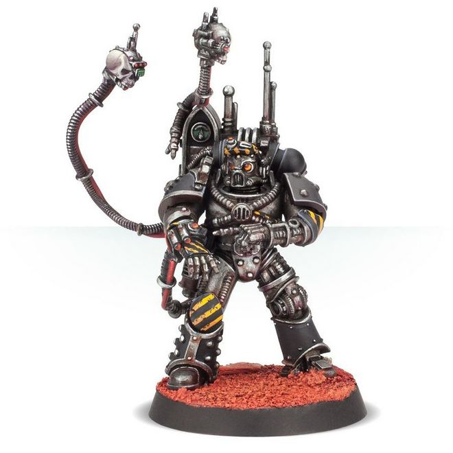

# 0196 领事智控顾问 Consul Praevian

精校状态：中文行文已逐段精校，部分术语仍为暂定

分类：通用概念 / 帝国 Imperium / 中央政务部 Adeptus Terra / 星际战士军团 Space Marine Legion

原文来源：https://www.bilibili.com/opus/1020658055487946774

原作者：帝国神选罐头

原文时间：2025年01月10日 11:14

[返回分类目录](目录.md) · [全书目录](../../目录.md)

<!-- A0196-B0001 -->
**英文原文**

Consul Praevian were a type of Astartes commander during the Great Crusade and Horus Heresy.

<!-- /A0196-B0001 -->

<!-- A0196-B0002 -->

原译文

领事智控顾问是大远征和荷鲁斯叛乱时期的阿斯塔特指挥官。

**校订译文**

领事智控顾问是大远征和荷鲁斯之乱时期的一类阿斯塔特指挥官。

<!-- /A0196-B0002 -->

<!-- A0196-B0003 图片 -->

<!-- A0196-B0004 -->

原译文

Praevian 智控顾问

**校订译文**

Praevian 智控顾问

<!-- /A0196-B0004 -->

<!-- A0196-B0005 -->
## Overview 概述

<!-- /A0196-B0005 -->

<!-- A0196-B0006 -->
**英文原文**

Trained on Mars by the Mechanicum, these commanders were the keeper of the Legion's robots, including Battle-Automata given honorary induction into the Legion's ranks. On the field of battle they marched at the forefront of Battle-Automata forces, guiding them through the engagement.

<!-- /A0196-B0006 -->

<!-- A0196-B0007 -->

原译文

这些指挥官在火星上接受了机械教的训练，是军团机器人的守护者，其中包括被授予荣誉军衔的自动机兵。在战场上，他们走在自动机兵部队的最前线，引导他们完成交战。

**校订译文**

这些指挥官在火星接受机械教训练，负责照管军团的机器人，包括以荣誉成员身份编入军团的自动机兵。战场上，他们走在自动机兵部队前方，指引其行动。

<!-- /A0196-B0007 -->

<!-- A0196-B0008 -->
**英文原文**

Consul Praevians were often chosen from Veterans whose injuries required extensive Bionics. Known to be solitary individuals, they rarely advanced up the chain of command. Some Legions used the rank as a dumping ground for warriors seen as unfit for other duty. However in others, such as the Iron Hands and Salamanders, the rank was seen as a great honour.

<!-- /A0196-B0008 -->

<!-- A0196-B0009 -->

原译文

领事智控顾问通常是从老兵中挑选出来的，他们的伤势需要大量的仿生部件。众所周知，他们是单独的个体，很少在指挥链上晋升。一些军团将该等级用作安置被视为不适合其他职责的战士的场所。然而，在钢铁之手和火蜥蜴等其他军团中，这一军衔被视为一种巨大的荣誉。

**校订译文**

领事智控顾问往往从因重伤而需要大量机械义体的老兵中选出。他们通常性格孤僻，也很少继续晋升。一些军团把这一职务当作安置不适合担任其他职务者的去处；但在钢铁之手和火蜥蜴等军团中，担任此职却是极大的荣誉。

<!-- /A0196-B0009 -->

<!-- A0196-B0010 -->
## Notable Consul Praevians 著名领事智控顾问

<!-- /A0196-B0010 -->

<!-- A0196-B0011 -->

原译文

Nârik Dreygur 纳里克·德雷格尔

**校订译文**

Nârik Dreygur 纳里克·德雷格尔

<!-- /A0196-B0011 -->

<!-- A0196-B0012 -->

原译文

Vorakon 沃拉肯

**校订译文**

Vorakon 沃拉肯

<!-- /A0196-B0012 -->

本篇核心术语与暂定项

以下列出本篇出现的英文原形及核心术语表用词。同形词可能指不同对象，具体词义以本篇正文和校注为准；单复数、别名和仅见于图注的名称可能尚未列入。完整候选见[术语表](../../术语表/双语术语候选.csv)。

| 英文 | 采用中文 | 状态 |
| --- | --- | --- |
| Horus Heresy | 荷鲁斯之乱 | 官方已核对 |
| Mechanicum | 机械教 | 暂定·历史称谓 |
| Great Crusade | 大远征 | 暂定·官方待核 |
| Horus | 荷鲁斯 | 暂定·官方待核 |
| Iron Hands | 钢铁之手 | 暂定·官方待核 |
| Salamanders | 火蜥蜴 | 暂定·官方待核 |
| Mars | 火星 | 暂定·官方待核 |
| Bionics | 仿生改造／仿生部件（依语境） | 语境定译·官方待核 |
| Consul | 领事 | 暂定·官方待核 |
| Praevian | 智控顾问 | 暂定·官方待核 |
| Consul Praevian | 领事智控顾问 | 暂定·官方待核 |

