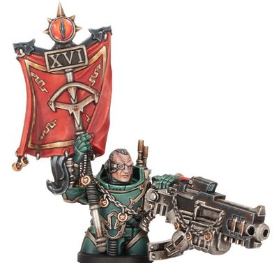

# 0198 军团十夫长 Legiones Decurion

精校状态：中文行文已逐段精校，部分术语仍为暂定

分类：通用概念 / 帝国 Imperium / 中央政务部 Adeptus Terra / 星际战士军团 Space Marine Legion

原文来源：https://www.bilibili.com/opus/1025820133737627651

原作者：帝国神选罐头

原文时间：2025年01月24日 09:06

[返回分类目录](目录.md) · [全书目录](../../目录.md)

<!-- A0198-B0001 -->
**英文原文**

Legiones Decurion were a rank of Space Marine used during the Great Crusade and Horus Heresy era for use in the Legiones Astartes.

<!-- /A0198-B0001 -->

<!-- A0198-B0002 -->

原译文

军团十夫长是大远征和荷鲁斯叛乱时代用于阿斯塔特军团的星际战士军衔。

**校订译文**

军团十夫长是大远征和荷鲁斯之乱时期，阿斯塔特军团使用的一种军衔。

<!-- /A0198-B0002 -->

<!-- A0198-B0003 图片 -->

<!-- A0198-B0004 -->

原译文

Sons of Horus Legiones Decurion Lanius 荷鲁斯之子军团十夫长刽子手

**校订译文**

Sons of Horus Legiones Decurion Lanius 荷鲁斯之子军团十夫长刽子手

<!-- /A0198-B0004 -->

<!-- A0198-B0005 -->
## Description 描述

<!-- /A0198-B0005 -->

<!-- A0198-B0006 -->
**英文原文**

They are Tank Commanders who knew their Legion's Battle Tanks inside and out. Decurions had different ranks, which included Decurion Locus and Decurion Defensors, the latter of which had extensive hypno-indoctrination training in the weapons of the Imperium. Others included the Decurion Lanius and the Decurion Sagittar, who were armed with an Illiastus Assault Cannon and a Banestrike Bolt Cannon respectively, and an Augury Scanner to pick out vulnerable targets for destruction.

<!-- /A0198-B0006 -->

<!-- A0198-B0007 -->

原译文

他们是坦克指挥官，对军团的战斗坦克了如指掌。十夫长有不同的军衔，其中包括核心十夫长和十夫长防御者，后者接受了关于帝国武器的广泛催眠教学训练。其他包括十夫长刽子手和十夫长射手座，他们分别配备了伊利亚斯图斯突击炮和致命打击爆矢炮，以及占卜师扫描仪，用于挑选易受攻击的目标进行摧毁。

**校订译文**

军团十夫长是熟知军团战斗坦克性能的坦克指挥官，分为多种职衔，包括核心十夫长与防卫十夫长；后者接受大量有关帝国武器的催眠灌输训练。另有刽子手十夫长和射手十夫长，分别装备伊利亚斯图斯突击炮与致命打击爆矢炮，并借助侦测扫描仪寻找敌方薄弱目标予以摧毁。

**校注：** Decurion Sagittar 是职衔，此处译射手十夫长，不是星座射手座；Augury Scanner 是探测装备，不是占卜师本人。

<!-- /A0198-B0007 -->

本篇核心术语与暂定项

以下列出本篇出现的英文原形及核心术语表用词。同形词可能指不同对象，具体词义以本篇正文和校注为准；单复数、别名和仅见于图注的名称可能尚未列入。完整候选见[术语表](../../术语表/双语术语候选.csv)。

| 英文 | 采用中文 | 状态 |
| --- | --- | --- |
| Horus Heresy | 荷鲁斯之乱 | 官方已核对 |
| Imperium | 帝国 | 暂定·简称 |
| Great Crusade | 大远征 | 暂定·官方待核 |
| Horus | 荷鲁斯 | 暂定·官方待核 |
| Legiones Astartes | 阿斯塔特军团 | 暂定·官方待核 |
| Legiones Decurion | 军团十夫长 | 暂定·官方待核 |
| Space Marine | 星际战士 | 暂定·官方待核 |
| Locus | 基卫 | 官方已核对 |
| Assault Cannon | 突击炮 | 暂定·官方待核 |
| Bolt | 爆矢 | 暂定·官方待核 |
| Scanner | 扫描仪 | 暂定·官方待核 |
| Augury Scanner | 占卜扫描仪 | 暂定·官方待核 |

