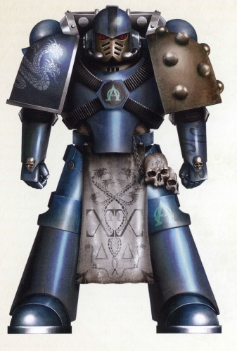

# 0201 追踪者 Seeker

精校状态：中文行文已逐段精校，部分术语仍为暂定

分类：通用概念 / 帝国 Imperium / 中央政务部 Adeptus Terra / 星际战士军团 Space Marine Legion

原文来源：https://www.bilibili.com/opus/1033597782653403153

原作者：帝国神选罐头

原文时间：2025年02月14日 08:07

[返回分类目录](目录.md) · [全书目录](../../目录.md)

<!-- A0201-B0001 -->
**英文原文**

Seeker Space Marines were a type of specialist Space Marine infantry squad used during the Great Crusade and Horus Heresy. Their principal role on the battlefield was to identify an enemy command structure and destroy them with well-placed surgical strikes while the battle rages. It is said that the Alpha Legion first perfected these specialists and with the Emperor's approval spread them to the rest of the Legio Astartes.

<!-- /A0201-B0001 -->

<!-- A0201-B0002 -->

原译文

追踪者星际战士是在大远征和荷鲁斯叛乱期间使用的一种专业星际战士步兵班。他们在战场上的主要作用是识别敌人的指挥结构，并在战斗激烈时用适当的外科手术打击将其摧毁。据说阿尔法军团首先完善了这些专家，并在帝皇的批准下将他们传播到阿斯塔特军团的其他成员。

**校订译文**

追踪者是大远征和荷鲁斯之乱期间的一类专业星际战士步兵小队。他们的主要任务是在战火中查明敌方指挥体系，并以精确的斩首打击将其摧毁。据说，阿尔法军团最先完善了这种部队，经帝皇批准后推广至其他阿斯塔特军团。

<!-- /A0201-B0002 -->

<!-- A0201-B0003 图片 -->

<!-- A0201-B0004 -->

原译文

Alpha Legion Seeker Space Marine 阿尔法军团追踪者

**校订译文**

Alpha Legion Seeker Space Marine 阿尔法军团追踪者

<!-- /A0201-B0004 -->

<!-- A0201-B0005 -->
**英文原文**

These troops are chosen on the basis of pure merit, usually those in a Seeker squad are the best shots of their respective Companies. To aid with their kill, they are usually equipped with specialized Bolter ammunition to better deal with their chosen victims.

<!-- /A0201-B0005 -->

<!-- A0201-B0006 -->

原译文

这些部队是根据纯粹的功绩选择的，通常在追踪者小队中的人是他们各自连队的最佳射手。为了协助他们的杀戮，他们通常会配备专门的爆矢弹药，以更好地对付他们选择的受害者。

**校订译文**

追踪者完全按能力选拔，通常由各连最优秀的射手组成。为有效消灭选定目标，他们往往配备特种爆矢弹药。

<!-- /A0201-B0006 -->

本篇核心术语与暂定项

以下列出本篇出现的英文原形及核心术语表用词。同形词可能指不同对象，具体词义以本篇正文和校注为准；单复数、别名和仅见于图注的名称可能尚未列入。完整候选见[术语表](../../术语表/双语术语候选.csv)。

| 英文 | 采用中文 | 状态 |
| --- | --- | --- |
| Space Marines | 星际战士 | 官方已核对 |
| Horus Heresy | 荷鲁斯之乱 | 官方已核对 |
| Emperor | 帝皇 | 官方已核对 |
| Great Crusade | 大远征 | 暂定·官方待核 |
| Horus | 荷鲁斯 | 暂定·官方待核 |
| Alpha Legion | 阿尔法军团 | 暂定·官方待核 |
| Seeker | 追踪者 | 暂定·官方待核 |
| Space Marine | 星际战士 | 暂定·官方待核 |
| Principal | 首席（史洛斯职衔） | 暂定·官方待核 |
| Bolter | 爆矢枪 | 暂定·官方待核 |

