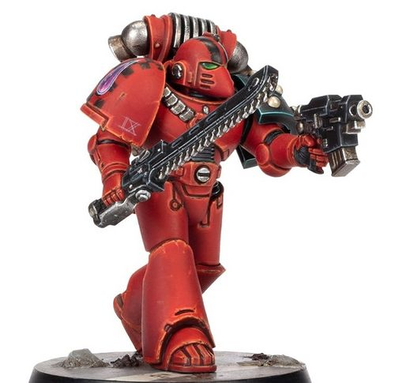
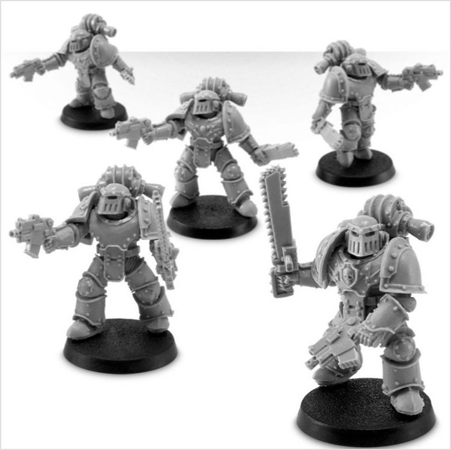
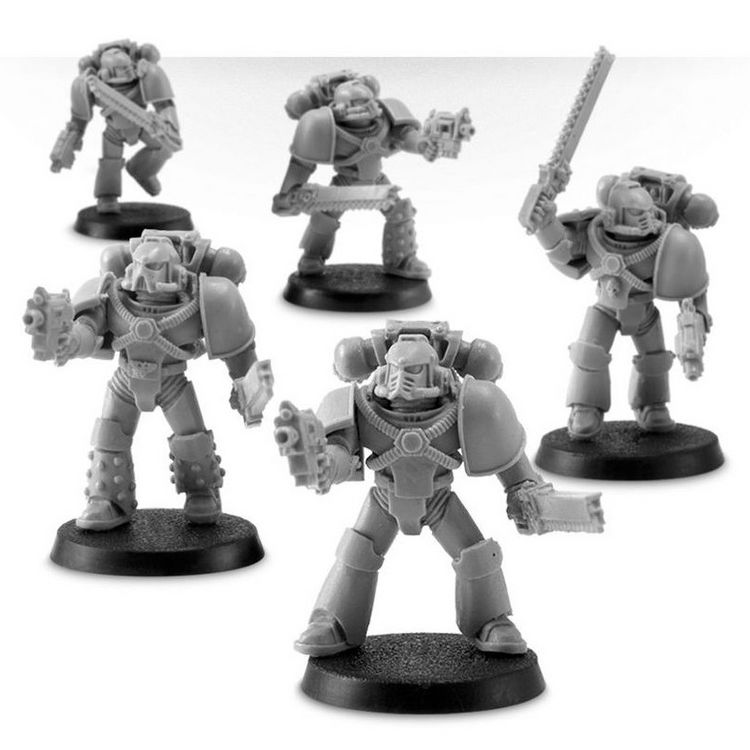

# 0202 劫掠者 Despoiler

精校状态：中文行文已逐段精校，部分术语仍为暂定

分类：通用概念 / 帝国 Imperium / 中央政务部 Adeptus Terra / 星际战士军团 Space Marine Legion

原文来源：https://www.bilibili.com/opus/1022077159899922438

原作者：帝国神选罐头

原文时间：2025年01月14日 07:01

[返回分类目录](目录.md) · [全书目录](../../目录.md)

<!-- A0202-B0001 -->
**英文原文**

Despoiler Squads were specialized close-combat infantry formations of the Space Marine Legions during the Great Crusade and Horus Heresy.

<!-- /A0202-B0001 -->

<!-- A0202-B0002 -->

原译文

劫掠者小队是大远征和荷鲁斯叛乱时期星际战士的特种近战步兵编队。

**校订译文**

劫掠者小队是大远征和荷鲁斯之乱时期，星际战士军团的专门近战步兵编队。

<!-- /A0202-B0002 -->

<!-- A0202-B0003 图片 -->

<!-- A0202-B0004 -->

原译文

Despoiler Legionary 军团劫掠者

**校订译文**

Despoiler Legionary 军团劫掠者

<!-- /A0202-B0004 -->

<!-- A0202-B0005 -->
## Overview 概述

<!-- /A0202-B0005 -->

<!-- A0202-B0006 -->
**英文原文**

Frequently employed during boarding actions or trench clearing operations, Tactical Squads would sometimes forgo their standard Bolter in favour of a Bolt Pistol and Chainsword, allowing for greater manoeuvrability in tight confines.

<!-- /A0202-B0006 -->

<!-- A0202-B0007 -->

原译文

战术小队经常在跳帮行动或战壕清理行动中使用，有时会放弃他们的标准爆矢枪，转而使用爆矢手枪和链锯剑，从而在狭小的空间内获得更大的机动性。

**校订译文**

在跳帮或清理战壕等任务中，战术小队有时会舍弃制式爆矢枪，改用爆矢手枪与链锯剑，以便在狭窄环境中更加灵活地作战。

<!-- /A0202-B0007 -->

<!-- A0202-B0008 图片 -->

<!-- A0202-B0009 -->

原译文

MK III Despoiler Squad MK III劫掠者小队

**校订译文**

MK III Despoiler Squad MK III劫掠者小队

<!-- /A0202-B0009 -->

<!-- A0202-B0010 -->
**英文原文**

Consisting of up to nine Despoiler Marines led by a Sergeant, on the battlefield, Despoiler squads engage the enemy line directly, carving a bloody path through entrenched foes, shattering their morale and slaughtering all who do not flee.

<!-- /A0202-B0010 -->

<!-- A0202-B0011 -->

原译文

在战场上，由一名军士领导的多达九名劫掠者星际战士组成的劫掠者小队直接与敌人交战，在根深蒂固的敌人中开辟了一条血腥的道路，摧毁了他们的士气，屠杀了所有不逃跑的人。

**校订译文**

一支劫掠者小队由一名军士率领，另有最多九名战士。战场上，他们直接冲击敌军阵线，在固守阵地的敌人中杀出血路，摧垮其士气，并屠戮一切拒不逃走的敌人。

<!-- /A0202-B0011 -->

<!-- A0202-B0012 图片 -->

<!-- A0202-B0013 -->

原译文

MK IV Despoiler Squad MK IV劫掠者小队

**校订译文**

MK IV Despoiler Squad MK IV劫掠者小队

<!-- /A0202-B0013 -->

<!-- A0202-B0014 -->
## Wargear 战备

<!-- /A0202-B0014 -->

<!-- A0202-B0015 -->
**英文原文**

Standard Issue :

<!-- /A0202-B0015 -->

<!-- A0202-B0016 -->

原译文

标准配置：

**校订译文**

标准配置：

<!-- /A0202-B0016 -->

<!-- A0202-B0017 -->

原译文

Chainsword 链锯剑

**校订译文**

Chainsword 链锯剑

<!-- /A0202-B0017 -->

<!-- A0202-B0018 -->

原译文

Bolt Pistol 爆矢手枪

**校订译文**

Bolt Pistol 爆矢手枪

<!-- /A0202-B0018 -->

<!-- A0202-B0019 -->

原译文

Power Armour 动力盔甲

**校订译文**

Power Armour 动力盔甲

<!-- /A0202-B0019 -->

<!-- A0202-B0020 -->

原译文

Frag Grenades 破片手榴弹

**校订译文**

Frag Grenades 破片手榴弹

<!-- /A0202-B0020 -->

<!-- A0202-B0021 -->

原译文

Krak Grenades 穿甲手榴弹

**校订译文**

Krak Grenades 穿甲手榴弹

<!-- /A0202-B0021 -->

<!-- A0202-B0022 -->
## Legion-Specific Variants 军团特殊变体

<!-- /A0202-B0022 -->

<!-- A0202-B0023 -->
**英文原文**

The Dark Angels' Stormwing were masters at making use of the Despoilers on the battlefield, while the Sons of Horus had their own elite formation of Despoilers called the Reaver Attack Squad.

<!-- /A0202-B0023 -->

<!-- A0202-B0024 -->

原译文

黑暗天使的风暴翼是在战场上利用劫掠者的大师，而荷鲁斯之子则有自己的劫掠者精英编队，称为收割者攻击小队。

**校订译文**

黑暗天使的风暴翼是在战场上利用劫掠者的大师，而荷鲁斯之子则有自己的劫掠者精英编队，称为收割者攻击小队。

<!-- /A0202-B0024 -->

本篇核心术语与暂定项

以下列出本篇出现的英文原形及核心术语表用词。同形词可能指不同对象，具体词义以本篇正文和校注为准；单复数、别名和仅见于图注的名称可能尚未列入。完整候选见[术语表](../../术语表/双语术语候选.csv)。

| 英文 | 采用中文 | 状态 |
| --- | --- | --- |
| Dark Angels | 黑暗天使 | 官方已核对 |
| Bolt Pistol | 爆矢手枪 | 官方已核对 |
| Chainsword | 链锯剑 | 官方已核对 |
| Horus Heresy | 荷鲁斯之乱 | 官方已核对 |
| Great Crusade | 大远征 | 暂定·官方待核 |
| Horus | 荷鲁斯 | 暂定·官方待核 |
| Sons of Horus | 荷鲁斯之子 | 暂定·官方待核 |
| Reaver Attack Squad | 掠夺者攻击小队 | 暂定·官方待核 |
| Despoiler | 劫掠者 | 暂定·官方待核 |
| Space Marine | 星际战士 | 暂定·官方待核 |
| Sergeant | 军士 | 暂定·官方待核 |
| Tactical Squads | 战术小队 | 暂定·官方待核 |
| The Dark | 《黑暗》 | 暂定·官方待核 |
| Bolt | 爆矢 | 暂定·官方待核 |
| Bolter | 爆矢枪 | 暂定·官方待核 |

