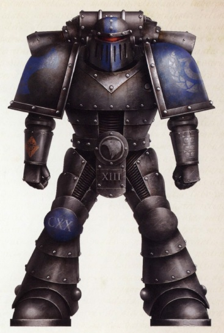
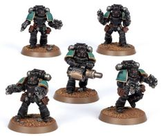
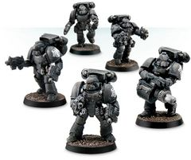

# 0203 毁灭者 Destroyer

精校状态：中文行文已逐段精校，部分术语仍为暂定

分类：通用概念 / 帝国 Imperium / 中央政务部 Adeptus Terra / 星际战士军团 Space Marine Legion

原文来源：https://www.bilibili.com/opus/1024791948599230464

原作者：帝国神选罐头

原文时间：2025年01月21日 14:36

[返回分类目录](目录.md) · [全书目录](../../目录.md)

<!-- A0203-B0001 -->
**英文原文**

Destroyer Marines were a type of elite Space Marine squad employed during the Great Crusade and Horus Heresy.

<!-- /A0203-B0001 -->

<!-- A0203-B0002 -->

原译文

毁灭者战士是大远征和荷鲁斯叛乱期间运用的一种精英星际战士。

**校订译文**

毁灭者小队是大远征和荷鲁斯之乱时期使用的一类精锐星际战士部队。

<!-- /A0203-B0002 -->

<!-- A0203-B0003 图片 -->

<!-- A0203-B0004 -->

原译文

Ultramarines Destroyer Marine 极限战士毁灭者战士

**校订译文**

Ultramarines Destroyer Marine 极限战士毁灭者战士

<!-- /A0203-B0004 -->

<!-- A0203-B0005 -->
## Overview 概述

<!-- /A0203-B0005 -->

<!-- A0203-B0006 -->
**英文原文**

The origins of the Destroyer Squad lie in the Unification Wars of Terra. During the terrible conflict, the enemies of the Emperor utilized forbidden or proscribed weaponry from the Age of Strife which many Legions considered dishonorable. Alongside certain factions of the Mechanicum, only Destroyer Squads have license to use such forbidden devices such as Radiation Weapons, bio-alchem munitions, and Phosphex. Normally, Destroyer Squads were shunned and deemed tainted by their Battle-Brothers, while still viewed by Imperial commanders as a necessary evil.

<!-- /A0203-B0006 -->

<!-- A0203-B0007 -->

原译文

毁灭者小队的起源可以追溯到泰拉统一战争。在这场可怕的冲突中，帝皇的敌人使用了纷争时代被禁止或宣布禁止的武器，许多军团认为这是不光彩的。除了机械教的某些派系外，只有毁灭者小队有许可使用此类违禁设备，如辐射武器、生化弹药和磷化武器。通常情况下，毁灭者小队会被他们的战斗兄弟避开并被视为有污点，而帝国指挥官仍将其视为必要的邪恶。

**校订译文**

毁灭者小队的起源可以追溯到泰拉统一战争。在这场可怕的冲突中，帝皇的敌人使用了纷争时代被禁止或宣布禁止的武器，许多军团认为这是不光彩的。除了机械教的某些派系外，只有毁灭者小队有许可使用此类违禁设备，如辐射武器、生化弹药和磷化武器。通常情况下，毁灭者小队会被他们的战斗兄弟避开并被视为有污点，而帝国指挥官仍将其视为必要的邪恶。

<!-- /A0203-B0007 -->

<!-- A0203-B0008 图片 -->

<!-- A0203-B0009 -->

原译文

Destroyer Squad 毁灭者小队

**校订译文**

Destroyer Squad 毁灭者小队

<!-- /A0203-B0009 -->

<!-- A0203-B0010 -->
**英文原文**

Led by a Space Marine Sergeant, Destroyer Squads were most typically equipped with Missile Launchers armed with Rad Missiles or Volkite Serpenta as well as Toxiferran Flamers. They also commonly carried twin Bolt Pistols, Chainswords, Phosphex Bombs, Rad Grenades, and Melta bombs. To better rain death upon their foes, they were sometimes equipped with Jump Packs.

<!-- /A0203-B0010 -->

<!-- A0203-B0011 -->

原译文

在一名星际战士军士的带领下，毁灭者小队最典型的装备是装有辐射导弹的导弹发射器或爆燃蛇铳以及毒铁火焰发射器。他们还经常携带双联爆矢手枪、链锯剑、磷化炸弹、辐射手榴弹和热熔炸弹。为了更好地给敌人带来死亡，他们有时会配备跳跃背包。

**校订译文**

毁灭者小队由星际战士军士指挥，通常配备发射辐射导弹的导弹发射器，或爆燃蛇铳，以及毒铁喷火器。他们也常携带双持爆矢手枪、链锯剑、磷化炸弹、辐射手榴弹和热熔炸弹，有时还配备跳跃背包，从空中向敌人倾泻死亡。

**校注：** twin Bolt Pistols 在此指两把爆矢手枪，暂按双持处理；原译双联可能误示固定双联武器。

<!-- /A0203-B0011 -->

<!-- A0203-B0012 -->
## Variations 变体

<!-- /A0203-B0012 -->

<!-- A0203-B0013 -->
### Standard 标准

<!-- /A0203-B0013 -->

<!-- A0203-B0014 -->
**英文原文**

Destroyer Assault Squad - Equipped with Jump Packs to rain death upon their foes.

<!-- /A0203-B0014 -->

<!-- A0203-B0015 -->

原译文

毁灭者突击小队 - 装备跳跃背包，将死亡倾泻在敌人身上。

**校订译文**

毁灭者突击小队 - 装备跳跃背包，将死亡倾泻在敌人身上。

<!-- /A0203-B0015 -->

<!-- A0203-B0016 图片 -->

<!-- A0203-B0017 -->

原译文

Destroyer Assault Squad 毁灭者突击小队

**校订译文**

Destroyer Assault Squad 毁灭者突击小队

<!-- /A0203-B0017 -->

<!-- A0203-B0018 -->
**英文原文**

Mortalis Destroyer Squad - Unleashed in situations where no quarter was to be given to the enemy as well as close-confines battlezones. Especially favored by the Death Guard and Ultramarines.

<!-- /A0203-B0018 -->

<!-- A0203-B0019 -->

原译文

终死毁灭者小队 - 在不给敌人任何机会的情况下以及在封闭的战区释放。尤其受到死亡守卫和极限战士的青睐。

**校订译文**

终死毁灭者小队——用于不留活口的作战，或在狭窄封闭战区执行任务，尤其受到死亡守卫和极限战士青睐。

<!-- /A0203-B0019 -->

<!-- A0203-B0020 -->
### Legion Variations 军团变体

<!-- /A0203-B0020 -->

<!-- A0203-B0021 -->
**英文原文**

Dreadwing — Dark Angels

<!-- /A0203-B0021 -->

<!-- A0203-B0022 -->

原译文

恐翼 — 黑暗天使

**校订译文**

恐翼 — 黑暗天使

<!-- /A0203-B0022 -->

<!-- A0203-B0023 -->
**英文原文**

Interemptor - Dark Angels

<!-- /A0203-B0023 -->

<!-- A0203-B0024 -->

原译文

屠灭者 - 黑暗天使

**校订译文**

屠灭者 - 黑暗天使

<!-- /A0203-B0024 -->

<!-- A0203-B0025 -->
**英文原文**

Karaoghlanlar — White Scars

<!-- /A0203-B0025 -->

<!-- A0203-B0026 -->

原译文

死暗之子 — 白色疤痕

**校订译文**

死暗之子——白疤。

<!-- /A0203-B0026 -->

<!-- A0203-B0027 -->
**英文原文**

Black Cull — Space Wolves

<!-- /A0203-B0027 -->

<!-- A0203-B0028 -->

原译文

黑屠 — 太空野狼

**校订译文**

黑屠 — 太空野狼

<!-- /A0203-B0028 -->

<!-- A0203-B0029 -->
**英文原文**

Angel's Tears — Blood Angels

<!-- /A0203-B0029 -->

<!-- A0203-B0030 -->

原译文

天使之泪 — 圣血天使

**校订译文**

天使之泪 — 圣血天使

<!-- /A0203-B0030 -->

<!-- A0203-B0031 -->
**英文原文**

High Host - Blood Angels

<!-- /A0203-B0031 -->

<!-- A0203-B0032 -->

原译文

至高之主 - 圣血天使

**校订译文**

至高军势——圣血天使。

<!-- /A0203-B0032 -->

<!-- A0203-B0033 -->
**英文原文**

Red Hand — World Eaters

<!-- /A0203-B0033 -->

<!-- A0203-B0034 -->

原译文

血手 — 吞世者

**校订译文**

血手 — 吞世者

<!-- /A0203-B0034 -->

<!-- A0203-B0035 -->
**英文原文**

Nemesis Destroyers — Ultramarines (22nd Chapter).

<!-- /A0203-B0035 -->

<!-- A0203-B0036 -->

原译文

复仇女神毁灭者 — 极限战士（第二十二战团）

**校订译文**

复仇女神毁灭者 — 极限战士（第二十二战团）

<!-- /A0203-B0036 -->

<!-- A0203-B0037 -->
**英文原文**

Mortus Poisoners — Death Guard

<!-- /A0203-B0037 -->

<!-- A0203-B0038 -->

原译文

莫图斯毒杀者 — 死亡守卫

**校订译文**

莫图斯毒杀者 — 死亡守卫

<!-- /A0203-B0038 -->

<!-- A0203-B0039 -->
**英文原文**

Pyroclast - Salamanders

<!-- /A0203-B0039 -->

<!-- A0203-B0040 -->

原译文

火山岩 - 火蜥蜴

**校订译文**

火山岩 - 火蜥蜴

<!-- /A0203-B0040 -->

<!-- A0203-B0041 -->
## Notable Destroyers 著名毁灭者

<!-- /A0203-B0041 -->

<!-- A0203-B0042 -->
**英文原文**

Skane - World Eaters

<!-- /A0203-B0042 -->

<!-- A0203-B0043 -->

原译文

斯科纳 - 吞世者

**校订译文**

斯科纳 - 吞世者

<!-- /A0203-B0043 -->

<!-- A0203-B0044 -->
**英文原文**

Kletos - Ultramarines

<!-- /A0203-B0044 -->

<!-- A0203-B0045 -->

原译文

克莱托斯 - 极限战士

**校订译文**

克莱托斯 - 极限战士

<!-- /A0203-B0045 -->

<!-- A0203-B0046 -->
**英文原文**

Serac Lukash - Sons of Horus

<!-- /A0203-B0046 -->

<!-- A0203-B0047 -->

原译文

塞拉克·卢卡什 - 荷鲁斯之子

**校订译文**

塞拉克·卢卡什 - 荷鲁斯之子

<!-- /A0203-B0047 -->

<!-- A0203-B0048 -->
**英文原文**

Zephon - Blood Angels

<!-- /A0203-B0048 -->

<!-- A0203-B0049 -->

原译文

泽丰 - 圣血天使

**校订译文**

泽丰 - 圣血天使

<!-- /A0203-B0049 -->

本篇核心术语与暂定项

以下列出本篇出现的英文原形及核心术语表用词。同形词可能指不同对象，具体词义以本篇正文和校注为准；单复数、别名和仅见于图注的名称可能尚未列入。完整候选见[术语表](../../术语表/双语术语候选.csv)。

| 英文 | 采用中文 | 状态 |
| --- | --- | --- |
| Blood Angels | 圣血天使 | 官方已核对 |
| Dark Angels | 黑暗天使 | 官方已核对 |
| Space Wolves | 太空野狼 | 官方已核对 |
| Death Guard | 死亡守卫 | 官方已核对 |
| World Eaters | 吞世者 | 官方已核对 |
| Ultramarines | 极限战士 | 官方已核对 |
| Horus Heresy | 荷鲁斯之乱 | 官方已核对 |
| Mechanicum | 机械教 | 暂定·历史称谓 |
| Emperor | 帝皇 | 官方已核对 |
| Great Crusade | 大远征 | 暂定·官方待核 |
| Age of Strife | 纷争时代 | 暂定·官方待核 |
| Terra | 泰拉 | 暂定·官方待核 |
| Horus | 荷鲁斯 | 暂定·官方待核 |
| Sons of Horus | 荷鲁斯之子 | 暂定·官方待核 |
| Unification Wars | 统一战争 | 暂定·官方待核 |
| Salamanders | 火蜥蜴 | 暂定·官方待核 |
| Pyroclast | 焚火者 | 暂定 |
| White Scars | 白疤 | 官方已核 |
| Scars | 伤疤 | 暂定·官方待核 |
| Destroyer | 毁灭者 | 暂定·官方待核 |
| Destroyer Assault Squad | 毁灭者突击小队 | 暂定·官方待核 |
| Mortalis Destroyer Squad | 终死毁灭者小队 | 暂定·官方待核 |
| Dreadwing | 恐翼 | 暂定·官方待核 |
| Interemptor | 屠灭者 | 暂定·沿用现稿 |
| Karaoghlanlar | 死暗之子 | 暂定·官方待核 |
| Black Cull | 黑屠 | 暂定·官方待核 |
| Angel's Tears | 天使之泪 | 暂定·官方待核 |
| High Host | 至高军势 | 暂定·官方待核 |
| Red Hand | 血手 | 暂定·官方待核 |
| Nemesis Destroyers | 复仇女神毁灭者 | 暂定·官方待核 |
| Mortus Poisoners | 莫图斯毒杀者 | 暂定·官方待核 |
| Skane | 斯科纳 | 暂定·官方待核 |
| Kletos | 克莱托斯 | 暂定·官方待核 |
| Serac Lukash | 塞拉克·卢卡什 | 暂定·官方待核 |
| Zephon | 泽丰 | 暂定·官方待核 |
| Space Marine | 星际战士 | 暂定·官方待核 |
| Chapter | 战团 | 暂定·官方待核 |
| Sergeant | 军士 | 暂定·官方待核 |
| Nemesis | 复仇女神 | 暂定·官方待核 |
| Destroyers | 毁灭者 | 暂定·官方待核 |
| Missile Launchers | 导弹发射器 | 暂定·官方待核 |
| Host | 天军 | 暂定·官方待核 |
| Flamers | 火妖（奸奇单位）／火焰喷射器（武器） | 语境定译·对应官译已核 |
| Phosphex | 磷化燃剂 | 暂定·官方待核 |
| Bolt | 爆矢 | 暂定·官方待核 |
| Volkite Serpenta | 爆燃蛇铳 | 暂定·官方待核 |

